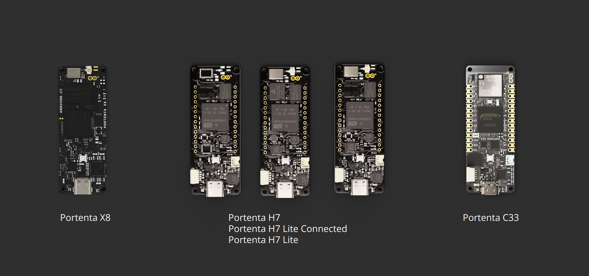
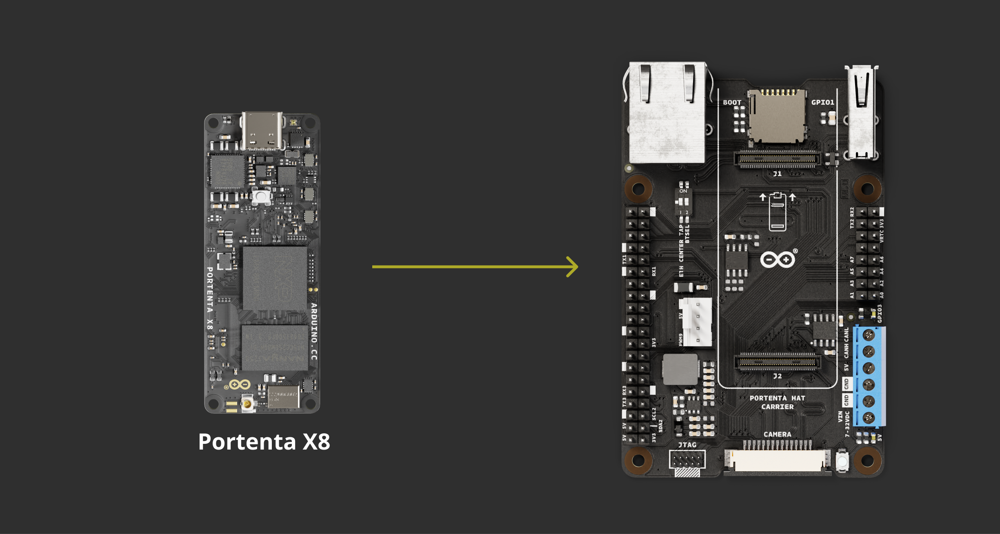
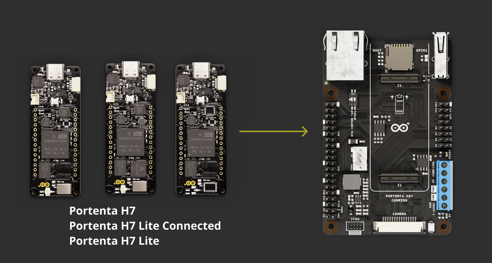
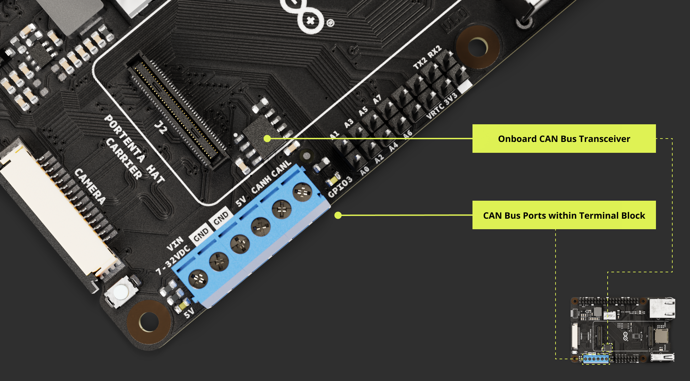
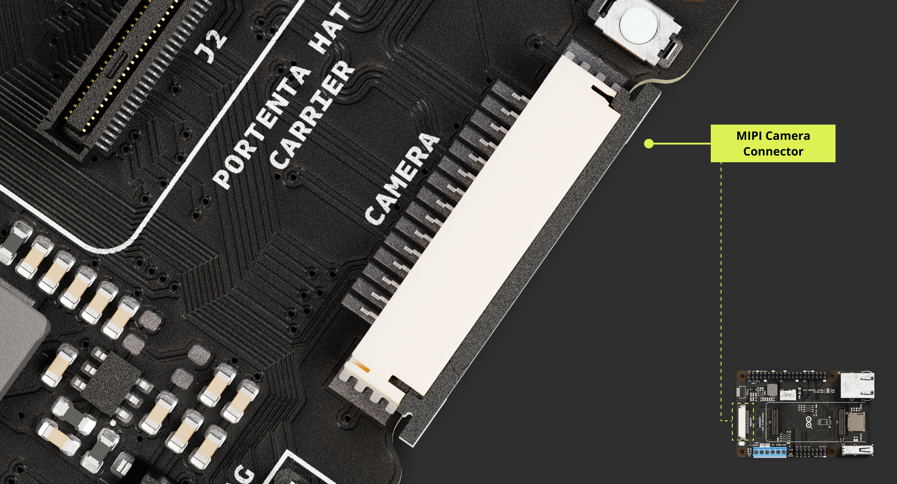
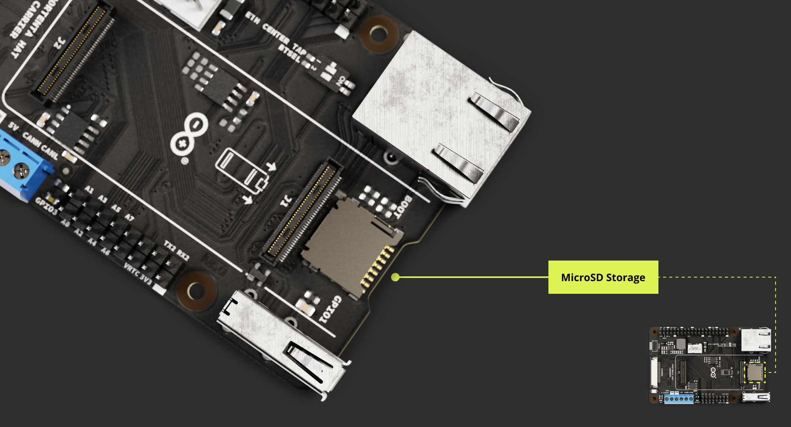
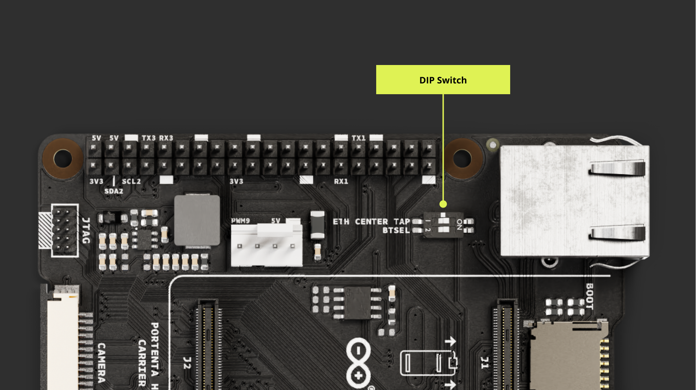
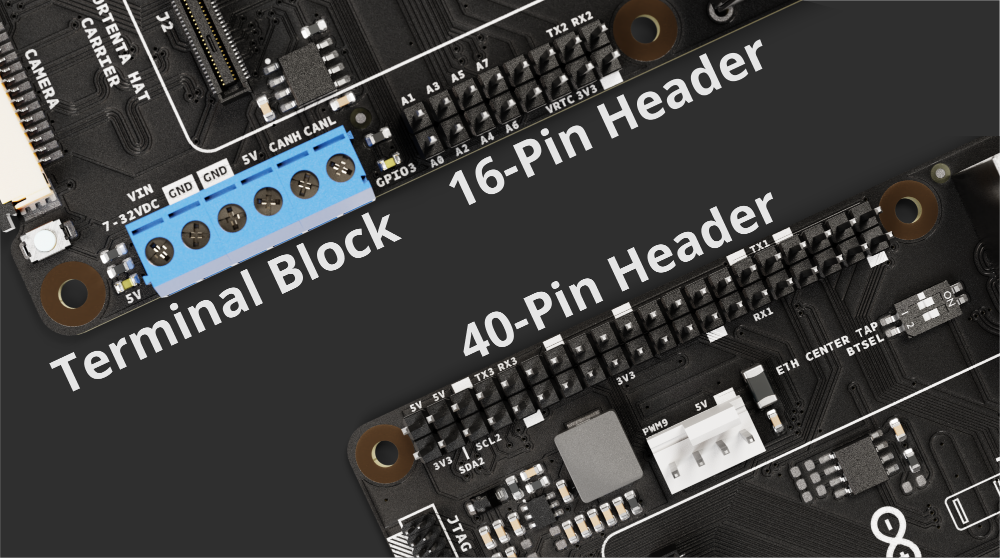
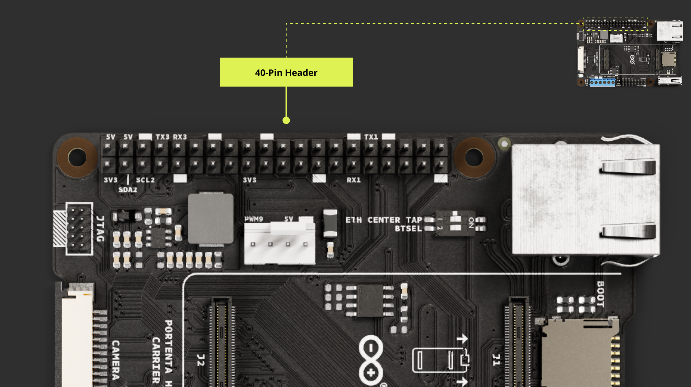

## Overview

The user manual offers a detailed guide on the Arduino Portenta Hat Carrier, consolidating all its features for easy reference. It will show how to set up, adjust, and assess its main functionalities.


This manual will show the user how to proficiently operate the Portenta Hat Carrier, making it suitable for project developments related to industrial automation, manufacturing automation, robotics, and prototyping.

## Hardware and Software Requirements

### Hardware Requirements

To use the [Portenta Hat Carrier](https://store.arduino.cc/products/portenta-hat-carrier), it is necessary to attach one of the boards from the Portenta Family:

- [Arduino Portenta X8](https://store.arduino.cc/products/portenta-x8)
- [Arduino Portenta C33](https://store.arduino.cc/products/portenta-c33)
- [Arduino Portenta H7](https://store.arduino.cc/products/portenta-h7)

Additionally, the following accessories are needed:

- [USB-C® cable](https://store.arduino.cc/products/usb-cable2in1-type-c) (x1)
- Wi-Fi® Access Point or Ethernet with Internet access (x1)

### Software Requirements

If you want to use the Portenta Hat Carrier with a Portenta X8, check the following bullet points:

- Make sure you have the latest Linux image. Refer to [this section](https://docs.arduino.cc/tutorials/portenta-x8/user-manual#portenta-x8-os-image-update) to confirm that your Portenta X8 is up-to-date.

***To ensure a stable operation of the Portenta Hat Carrier with Portenta X8, the minimum Linux image version required for Portenta X8 is __746__. To flash the latest image on your board, you can use the [Portenta X8 Out-of-the-box](https://docs.arduino.cc/tutorials/portenta-x8/user-manual#out-of-the-box-experience) or [flash it manually](https://docs.arduino.cc/tutorials/portenta-x8/user-manual#update-using-uuu-tool) downloading the latest version directly from this [link](https://downloads.arduino.cc/portentax8image/image-latest.tar.gz).***

- [Arduino IDE 1.8.10+](https://www.arduino.cc/en/software), [Arduino IDE 2.0+](https://www.arduino.cc/en/software), or [Arduino Cloud Editor](https://create.arduino.cc/editor) in case you want to use the auxiliary microcontroller of the Portenta X8 to run Arduino code.

In case you want to use the Portenta Hat Carrier with a Portenta H7/C33:

- [Arduino IDE 1.8.10+](https://www.arduino.cc/en/software), [Arduino IDE 2.0+](https://www.arduino.cc/en/software), or [Arduino Cloud Editor](https://create.arduino.cc/editor) is needed to use the Portenta H7/C33 to run Arduino code.

## Product Overview

The **Portenta Hat Carrier** offers a platform for developing a variety of robotics and building automation applications. It provides access to multiple peripherals, including CAN FD, Ethernet, microSD, and USB, as well as a camera interface via MIPI and 8x analog pins. On the other hand, the dedicated debug pins for JTAG and the PWM fan connector help simplify your Portenta applications.


The carrier is adaptable, pairing seamlessly with Portenta X8 and converting it into an industrial Linux platform compatible with Raspberry Pi® Hats. It also works with Portenta H7 and Portenta C33, providing versatile solutions to meet demands across various requirements.



### Carrier Architecture Overview

The **Portenta Hat Carrier**, designed for Portenta SOM boards like the Portenta X8, H7, and C33, offers a diverse power supply range:

- 7-32V through its screw terminal
- USB-C®
- 5V pin on the 40-pin header

This versatility extends to its connectivity: a USB-A for peripherals, 1000 Mbit Base-T Ethernet, SPI, I2C, I2S, and UART interfaces accessible via a 40-pin male header, and MIPI camera support exclusive for the Portenta X8.

It integrates a microSD slot for storage and data logging, broad interface options through its 40-pin and 16-pin headers, JTAG pins for debugging, and a PWM fan connector for cooling. The Ethernet speed control is intuitive with a two-position DIP switch, allowing various profiles based on the paired Portenta board.


The Portenta Hat Carrier has the following characteristics:

- **Compatible SOM boards**: The carrier is compatible with: Portenta X8 (ABX00049), Portenta H7 (ABX00042/ABX00045/ABX00046) and Portenta C33 (ABX00074).

- **Power management**: The board can be powered up from different sources. The onboard screw terminal block allows a 7-32 V power supply to power the Portenta board and the carrier, and a 5 V power supply.

  The USB-C® interface of the Portenta X8, H7, and C33 can supply the needed power to the board. Alternatively, the 5V pin from the 40-pin male header can be used to power the board. The carrier can deliver a maximum current of 1.5 A.

- **USB connectivity**: A USB-A female connector is used for data logging and the connection of external peripherals like keyboards, mice, hubs, and similar devices.

- **Communication**: The carrier supports Ethernet interface (X1) via RJ45 connector 1000 Base-T connected to High-Density pins (J1). If paired with Portenta H7 or C33, the maximum speed is limited to 100 Mbit Ethernet.

  The SPI (X1), I2C (x2), I2S (x1), and UART (x2) are accessible via a 40-pin male header connector. The I2C1 is already dedicated to the EEPROM memory but is accessible through a 40-pin male header connector on SCL2 and SDA2.

  The UARTs do not have flow control, and UART1 and UART3 can be accessed via a 40-pin connector while UART2 can be accessed via a 16-pin connector. The **CAN** (x1) bus is available with an onboard transceiver. The **MIPI** camera is also available but only when the Portenta X8 is attached. Examples of compatible devices include the OmniVision OV5647 and the Sony IMX219 sensors.

- **Storage**: The board has a microSD card slot for data logging operation and bootloading operation from external memory.

- **Ethernet connectivity**: The carrier offers a Gigabit Ethernet interface through an RJ45 connector 1000 Base-T. If the carrier is paired with Portenta H7 or C33, the maximum speed is limited to 100 Mbit Ethernet.

- **40-pin male header connector**: The connector allows for SPI (x1), I2S (x1), SAI (x1), 5V power pin (x2), 3V3 power pin (x2), I2C (x2), UART (x2), PWM pins (x7), GND (x8), and GPIO (X26). The I2C count includes the one that is dedicated to EEPROM. UARTs do not have flow control. The GPIO pins are shared with different functionalities.

- **16-pin male header connector**: The connector allows analog pins (x8), PWM (x2), LICELL (x1), GPIO (x1), 3V3 (x1), GND (x1), serial TX (x1), and serial RX (x1).

- **Screw terminal block**: The terminal block allows power supply line feed for the carrier and bus ports. It consists of VIN 7 ~ 32 VDC (x1), VIN 5 V (x1), CANH (x1), CANL (x1), and GND (x2).

- **Debug interface**: The carrier features an onboard 10x pin 1.27mm JTAG connector.

- **PWM fan connector**: The board has an onboard PWM fan connector (x1) compatible with a 5 V fan with a PWM signal for speed regulation.

- **DIP switch**: The carrier features a DIP switch with two positions, allowing for different profiles depending on the paired Portenta board. This DIP switch includes both the ETH CENTER TAP and BTSEL switches.

  The ETH CENTER TAP controls the Ethernet interface. The OFF position enables Ethernet for the Portenta X8. Conversely, the ON position enables Ethernet for the Portenta H7/C33.

  The BTSEL switch can be used to set the Portenta X8 into Flashing Mode when the switch is set to the ON position.

### Carrier Topology


| **Item** | **Onboard modules**                                             |
|:--------:|:----------------------------------------------------------------|
|  J1, J2  | High-Density connectors for Portenta boards                     |
|    J3    | JTAG male connector for debugging                               |
|    J4    | USB-A female connector for data logging and external devices    |
|    J5    | 40-pin male header compatible with Raspberry Pi® Hats           |
|    J6    | 16-pin male header for analog, GPIOs, UART and RTC battery pins |
|    J7    | MicroSD slot for data logging and media purposes                |
|    J8    | RJ45 connector for Ethernet                                     |
|    J9    | Screw terminal for power supply and CAN FD support              |
|   J10    | MIPI camera connector, exclusive for Portenta X8                |
|   J11    | PWM male header connector to control fan speed                  |
|   SW2    | DIP switch with two sliders: _ETH CENTER TAP_ and _BTSEL_       |
|   PB1    | User Button                                                     |

### Pinout


### Datasheet

The full datasheet is available and downloadable as PDF from the link below:

- [Portenta Hat Carrier Datasheet](https://docs.arduino.cc/resources/datasheets/ASX00049-datasheet.pdf)

### Schematics

The full schematics are available and downloadable as PDF from the link below:

- [Portenta Hat Carrier Schematics](assets/ASX00049-schematics.pdf)

### STEP Files

The full _STEP_ files are available and downloadable from the link below:

- [Portenta Hat Carrier STEP files](assets/ASX00049-step.zip)

### Mechanical Information

In this section, you can find mechanical information about the Portenta Hat Carrier. The dimensions of the board are all specified here, within top and bottom views, including the placements of the components onboard.

If you desire to design and manufacture a custom mounting device or create a custom enclosure for your carrier, the following image shows the dimensions for the mounting holes and general board layout. The given dimensions are all in **millimeters [mm]**.

You can also access the STEP files which are also available [here](assets/ASX00049-step.zip).


## First Use Of Your Portenta Hat Carrier

### Stack The Carrier

The Portenta Hat Carrier design allows the user to easily stack the preferred Portenta board. The following figure shows how the Portenta Hat Carrier pairs with the Portenta boards via High-Density connectors.


With the Portenta mounted to the carrier, you can proceed to power the carrier and start prototyping.

### Power The Board

The Portenta Hat Carrier can be powered according to one of the following methods:

- Using an **external 7 to 32 V power supply connected to the VIN pin available on the screw terminal block of the board is the most recommended method**. It ensures that the Portenta Hat Carrier, the SOM, and any connected hat receive power.

  For clarity on the connection points, please refer to the [board pinout section](#pinout) of the user manual. Ensure the supplied current meets the specification for all components, as shown in the operating conditions table reported later on.

- Using an external **5 V power supply** to:

* The _5V_ pin located on the 40-pin male header connector pins
* The _5V_ pin located on the screw terminal of the board

  You can effectively power the Portenta Hat Carrier, the SOM, and any connected hat.

  For more details on this connection, kindly consult the [board pinout section](#pinout) of the user manual. Again, ensure that the power supply's maximum current respects all components' specifications.

- Using a USB-C® cable (not included) connected to the Portenta core board of your choice powers not only the selected core board, like the Portenta X8, H7, or C33, but also the Portenta Hat Carrier, and any connected hat that does not require a dedicated external power supply.

***The Portenta Hat Carrier can deliver a __maximum__ of 1.5 A.***


The image below magnifies the location of the terminal block for the 7 - 32 V and 5 V power source of the Portenta Hat Carrier:


Subsequently, you can check how the Portenta Hat Carrier distributes power resources with the power tree diagram.


### Recommended Operating Conditions

To ensure the safety and longevity of the board, it is essential to understand the carrier's operating conditions. The table below provides the recommended operating conditions for the carrier:

|                     **Parameter**                      | **Min** | **Typ** | **Max** | **Unit** |
|:------------------------------------------------------:|:-------:|:-------:|:-------:|:--------:|
|    VIN from onboard screw terminal\* of the Carrier    |   7.0   |    -    |  32.0   |    V     |
| USB-C® input from the connected Portenta family board  |    -    |   5.0   |    -    |    V     |
| +5 VDC from the 40-pin header connector on the carrier |    -    |   5.0   |    -    |    V     |
|    +5 VDC from the carrier's onboard screw terminal    |    -    |   5.0   |    -    |    V     |
|            Current supplied by the carrier             |    -    |    -    |   1.5   |    A     |
|             Ambient operating temperature              |   -40   |    -    |   85    |    °C    |

**_The onboard screw terminal powers both the carrier and any connected Portenta board. Additionally, this terminal connector includes reverse polarity protection for enhanced safety._**

### Carrier Characteristics Highlight

The Portenta Hat Carrier provides different functionalities based on the connected Portenta family board, as shown in the table below:

| **Features**  |  **Portenta X8**  |  **Portenta H7**   |  **Portenta 33**   |
|:-------------:|:-----------------:|:------------------:|:------------------:|
| 40-Pin Header |    Compatible     |     Compatible     |     Compatible     |
| 16-Pin Header |    Compatible     |     Compatible     |     Compatible     |
|  MIPI Camera  |    Compatible     |    Incompatible    |    Incompatible    |
|   Ethernet    | 1 Gbit (DIP: OFF) | 100 Mbit (DIP: ON) | 100 Mbit (DIP: ON) |
|    PWM Fan    |     Available     |     Available      |     Available      |
|  JTAG Debug   |     Available     |     Available      |     Available      |
| Storage Exp.  |   MicroSD slot    |    MicroSD slot    |    MicroSD slot    |
|    CAN FD     |     Available     |     Available      |     Available      |
| USB-A Support |     Available     |     Available      |     Available      |

**_The Portenta X8 is the specific Portenta family board that offers compatibility with Raspberry Pi® Hats on the 40-pin Header._**

This provides a general idea of how the Portenta Hat Carrier will perform depending on the paired Portenta board. Each feature is explained in the following section after a quick guide covering how to properly interface the Portenta boards.

## Hello World Carrier

### Hello World Using Linux

#### Using Portenta X8 with Linux

<br></br>

To use the Portenta Hat Carrier with the Portenta X8, you will have to align the High-Density connectors along with the USB-C® port. The following diagram shows how the board stacks on the carrier.




***For the stable functionality of the Portenta Hat Carrier when used with Portenta X8, it is crucial to have at least version __746__ of the Linux image on the Portenta X8. Access and download the latest version directly through this [link](https://downloads.arduino.cc/portentax8image/image-latest.tar.gz).***

#### Hello World With Portenta X8 Shell

<br></br>

A series of _Hello World_ examples will be used to ensure the Portenta Hat Carrier is correctly operating with the paired Portenta X8. These examples, using Linux commands, Python® scripts, and the Arduino IDE, aim to trigger the user-programmable LED connected to GPIO3 leveraging different methods and platforms.

We will begin with a _Hello World_ example using Linux commands. The user-programmable LED can be controlled using commands within the Portenta X8's shell. Learn how to connect with the Portenta X8 shell [here](https://docs.arduino.cc/tutorials/portenta-x8/user-manual#first-use-of-your-portenta-x8).

The following commands will help you set and control the GPIO3, which connects to the user-programmable LED.

Let us begin with the commands to access the Portenta X8's shell:

```bash
adb shell
sudo su -
```

When you execute the _sudo su -_ command, you will be prompted for a password:

***The default password is `fio`***

This command grants you access as the root user, loading the root user's environment settings such as `$HOME` and `$PATH`.

The aforementioned commands allow you to access the Portenta X8's shell with elevated privileges. This allows you to modify system configurations that require administrative permissions.

Subsequently, use the following command to export the gpio device located under `/sys/class/`. In this context, _GPIO3_ corresponds to _GPIO 163_, which is associated with the user-programmable LED we aim to access.

```bash
echo 163 > /sys/class/gpio/export
```

Using the following commands will help you verify the available GPIO elements.

```bash
ls /sys/class/gpio
```

It lists all the GPIOs previously initialized by the system. Meanwhile, the following command lists the details of _GPIO 163_, corresponding to _GPIO3_, which was previously imported:

```bash
ls /sys/class/gpio/gpio163
```

The GPIO can now be configured verifying that GPIO3 elements were successfully exported. The following command with the `I/O` field will set the I/O state of the pin. The pin can be set either as Input using `in` or Output using `out` value.

```bash
echo <I/O> >/sys/class/gpio/gpio163/direction
```

For this example, we will replace the `<I/O>` field with `out` value within the following command:

```bash
echo out >/sys/class/gpio/gpio163/direction
```

To verify the pin setting, use the `cat` command. If correctly configured, this command will display the set value:

```bash
cat /sys/class/gpio/gpio163/direction
```

The GPIO is now set as an output, thus it can now be controlled by setting its state.

To set the pin High, you need to assign the value `1`, or `0` to set the pin `HIGH` or `LOW`. The command will require the `value` at the end to ensure the pin's state is controlled.

To set the pin to `HIGH`:

```bash
echo 1 >/sys/class/gpio/gpio163/value
```

To set the pin to `LOW`:

```bash
echo 0 >/sys/class/gpio/gpio163/value
```

If you have finished controlling the GPIO, you can use the following command to _unexport_ it, ensuring it no longer appears in the userspace:

```bash
echo 163 >/sys/class/gpio/unexport
```

To confirm that the specified GPIO has been properly unexported, you can use the following command:

```bash
ls /sys/class/gpio
```

This step helps you to prevent unintentional modifications to the element configuration.

#### Hello World Using Linux and Python® Scripts

<br></br>

Previously, we manually toggled the LED linked to _GPIO3_ on the Portenta X8 via the command line. However, to automate this process and potentially extend our control logic, we can employ a Python® script for this purpose.

The script below is compatible with the ADB shell on the Portenta X8:

```python
#!/usr/bin/env python3
import time

class GPIOController:
    def __init__(self, gpio_number):
        self.gpio_number = gpio_number
        self.gpio_path = f"/sys/class/gpio/gpio{gpio_number}/"

    def export(self):
        with open("/sys/class/gpio/export", "w") as f:
            f.write(str(self.gpio_number))

    def unexport(self):
        with open("/sys/class/gpio/unexport", "w") as f:
            f.write(str(self.gpio_number))

    def set_direction(self, direction):
        with open(f"{self.gpio_path}direction", "w") as f:
            f.write(direction)

    def read_direction(self):
        with open(f"{self.gpio_path}direction", "r") as f:
            return f.read().strip()

    def set_value(self, value):
        with open(f"{self.gpio_path}value", "w") as f:
            f.write(str(value))

    def read_value(self):
        with open(f"{self.gpio_path}value", "r") as f:
            return int(f.read().strip())

def main():
    print("============================================")
    print("Hello World PHC!")
    print("============================================")

    gpio = GPIOController(163)

    # Export GPIO
    gpio.export()

    # Set as output
    gpio.set_direction("out")
    if gpio.read_direction() == "out":
        print("GPIO set as output.")
        print("User LED Blinking 20 times")


    # Turn on (set to 1) and then off (set to 0)
    for i in range(1,20,1):
        gpio.set_value(1)
        time.sleep(1)
        gpio.set_value(0)
        time.sleep(1)


    print("GPIO Unexport")
    gpio.unexport()
    print("End of the program")
    exit()

if __name__ == "__main__":
    main()
```

The script can be named `hello_world_python.py` for example. It can then be pushed to Portenta X8 using the following command on a computer terminal:

```bash
adb push hello_world_python.py /home/fio
```

The file is uploaded to the `/home/fio` directory. Navigate to the directory using ADB shell:

```bash
cd python3 hello_world_python.py
```

Now use the following command to run the script:

```bash
python3 hello_world_python.py
```

Portenta Hat Carrier's user-programmable LED will start blinking whenever the script is running.

Please check out the [Portenta X8 user manual](https://docs.arduino.cc/tutorials/portenta-x8/user-manual) to learn how the board operates, and maximize its potential when paired with the Portenta Hat Carrier. The Portenta Hat Carrier supports the Portenta X8 via High-Density connectors.

The Portenta X8 has the capability to operate in a Linux environment and it is based on Yocto Linux distribution. It is recommendable to read how the Portenta X8 works in terms of Linux environment [here](https://docs.arduino.cc/tutorials/portenta-x8/user-manual#linux-environment).

### Hello World Using Arduino

#### Using Portenta X8 / H7 / C33 with Arduino

<br></br>

The Portenta X8 is also capable of operating within the Arduino environment and retains the same hardware setup as explained [here](#using-portenta-x8-with-linux).

The Portenta H7 and C33 boards have hardware setups similar to the Portenta X8. To mount them on the Hat Carrier, please align the High-Density connectors along with USB-C® port orientation.

The diagrams below show how the Portenta H7 and C33 stack on the carrier:

- _Portenta H7_




- _Portenta C33_


#### Hello World With Arduino

<br></br>

In this section, you will learn how to use the Portenta X8, Portenta H7, or Portenta C33 with the Portenta Hat Carrier. You will interact with the user-configurable LED connected to GPIO3, but this time within the Arduino environment.

Once any compatible Portenta board is connected to the Portenta Hat Carrier, launch the Arduino IDE 2 and set up the subsequent sketch:

```arduino
// the setup function runs once when you press reset or power the board
void setup() {
  // Initialize the digital pin of the chosen SOM as an output
  pinMode(<DIGITAL_PIN>, OUTPUT);
}

// the loop function runs over and over again forever
void loop() {
  digitalWrite(<DIGITAL_PIN>, HIGH);         // turn the LED on (HIGH is the voltage level)
  delay(1000);                               // wait for a second
  digitalWrite(<DIGITAL_PIN>, LOW);          // turn the LED off by making the voltage LOW
  delay(1000);                               // wait for a second
}
```

Make sure to replace `<DIGITAL_PIN>` with the appropriate value for your chosen Portenta board:

- **Portenta X8**: PF_4
- **Portenta H7**: PD_5
- **Portenta C33**: 30

For example, when using the Portenta X8, your script should look like this:

```arduino
// the setup function runs once when you press reset or power the board
void setup() {
  // Initialize the digital pin of the chosen SOM as an output
  pinMode(PF_4, OUTPUT);
}

// the loop function runs over and over again forever
void loop() {
  digitalWrite(PF_4, HIGH);         // turn the LED on (HIGH is the voltage level)
  delay(1000);                      // wait for a second
  digitalWrite(PF_4, LOW);          // turn the LED off by making the voltage LOW
  delay(1000);                      // wait for a second
}
```

After successfully uploading the sketch, the user-configurable LED will start blinking. The following clip illustrates the expected LED blink pattern.


Please check out the following documentation to learn more about each board and maximize its potential when paired with the Portenta Hat Carrier:

- [Portenta C33 user manual](https://docs.arduino.cc/tutorials/portenta-c33/user-manual).
- [Portenta H7 set-up guide](https://docs.arduino.cc/tutorials/portenta-h7/setting-up-portenta).
- [Portenta X8 user manual](https://docs.arduino.cc/tutorials/portenta-x8/user-manual#arduino-environment). You can also read the tutorial providing a step-by-step guide on how to upload sketches to the M4 Core on Arduino Portenta X8 [here](https://docs.arduino.cc/tutorials/portenta-x8/uploading-sketches-m4).

**_Please note that the Ethernet connectivity speed is limited to 100 Mbit when used with the Portenta H7 or C33._**

**_For up-to-date performance of the Portenta X8 on the Portenta Hat Carrier, ensure you update to the latest Portenta X8 OS image. You can check [here](https://docs.arduino.cc/tutorials/portenta-x8/user-manual#portenta-x8-os-image-update) for more details._**

## Carrier Features and Interfaces

The carrier offers a diverse range of features and interfaces to cater to a variety of user requirements and applications. This section provides an overview of the main hardware interfaces, storage options, and configuration mechanisms integrated into the carrier.

Each sub-section further delves into the specifications of each feature, ensuring users will get comprehensive information for optimal utilization.

## Hardware Interfaces

This sub-section introduces the essential hardware connection points and interfaces present on the Portenta Hat Carrier. Ranging from connectors and camera interfaces to fan control, you will be able to explore the physical interaction points of the carrier.

### High-Density Connectors

The Portenta X8, H7, and C33 enhance functionality through High-Density connectors. For a comprehensive understanding of these connectors, please refer to the complete pinout documentation for each Portenta model.

- [Complete Portenta X8 pinout information](https://docs.arduino.cc/resources/pinouts/ABX00049-full-pinout.pdf)
- [Complete Portenta H7 pinout information](https://docs.arduino.cc/resources/pinouts/ABX00042-full-pinout.pdf)
- [Complete Portenta C33 pinout information](https://docs.arduino.cc/resources/pinouts/ABX00074-full-pinout.pdf)

### USB Interface

The Portenta Hat Carrier features a USB interface suitable for data logging and connecting external devices.


If you are interested in the USB-A port pinout, the following table may serve to understand its connection distribution:

| **Pin number** | **Power Net** | **Portenta HD Standard Pin** |                         **High-Density Pin**                         | **Interface** |
|:--------------:|:-------------:|:----------------------------:|:--------------------------------------------------------------------:|:-------------:|
|       1        |      +5V      |       VIN / USB0_VBUS        |                  J1-21, J1-24, J1-32, J1-41, J1-48                   |               |
|       2        |               |           USB0_D_N           |                                J1-28                                 |    USB D-     |
|       3        |               |           USB0_D_P           |                                J1-26                                 |    USB D+     |
|       4        |      GND      |             GND              | J1-22, J1-31, J1-42, J1-47, J1-54, J2-24, J2-33, J2-44, J2-57, J2-70 |               |

Devices with a USB-A interface, such as storage drives, can be used for logging data. External devices include peripherals like keyboards, mouses, webcams, and hubs.

#### Using Linux

<br></br>

As an example, the following command on Portenta X8's shell can be used to test a write command with a USB memory drive. To write a file, the following sequence of commands can help you to accomplish such task.

```bash
sudo su -
```

First of all, let's enter root mode to have the right permissions to mount and unmount related peripherals like our USB memory drive.

```bash
lsblk
```

The `lsblk` command lists all available block devices, such as hard drives and USB drives. It helps in identifying the device name, like `/dev/sda1` which will be probably the partition designation of the USB drive you just plugged in. A common trick to identify and check the USB drive connected is to execute the `lsblk` command twice; once with the USB disconnected and the next one to the USB connected, to compare both results and spot easily the newly connected USB drive. Additionally, the command `lsusb` can be used to gather more information about the connected USB drive.

```bash
mkdir -p /mnt/USBmount
```

The `mkdir -p` command creates the directory `/mnt/USBmount`. This directory will be used as a mount point for the USB drive.

```bash
mount -t vfat /dev/sda1 /mnt/USBmount
```

This mount command mounts the USB drive, assumed to have a FAT filesystem (`vfat`), located at `/dev/sda1` to the directory `/mnt/USBmount`. Once mounted, the content of the USB drive can be accessed from the `/mnt/USBmount` directory with `cd`:

```bash
cd /mnt/USBmount
```

Now if you do an `ls` you can see the actual content of the connected USB Drive.

```bash
ls
```

Let's create a simple text file containing the message `Hello, World!` in the already connected USB memory drive using the following command:

```bash
dd if=<(echo -n "Hello, World!") of=/mnt/USBmount/helloworld.txt
```

This command uses the `dd` utility, combined with process substitution. Specifically, it seizes the output of the `echo` command, responsible for generating the `Hello, World!` message, and channels it as an input stream to `dd`.

Subsequently, the message gets inscribed into a file named _helloworld.txt_ situated in the `/mnt/USBmount` directory.

After creating the file, if you wish to retrieve its contents and display them on the shell, you can use:

```bash
cat helloworld.txt
```

This command `cat` prompts in the terminal the content of a file, in this case the words `Hello, World!`.

Now that you know how to locate, mount, write and read information from an external USB stick or hard drive you can expand the possibilities of your solution with the additional storage connected to the Portenta Hat Carrier.

#### Using Arduino IDE

<br></br>

The following example demonstrates how to use the USB interface of the Portenta Hat Carrier with the Portenta C33 to mount a Mass Storage Device (MSD).

Through this code, users will be able to effectively connect to, read from, and write to a USB storage device, making it easier to interact with external storage via the USB interface.

```arduino
#include <vector>
#include <string>
#include "UsbHostMsd.h"
#include "FATFileSystem.h"

#define TEST_FS_NAME "usb"
#define TEST_FOLDER_NAME "TEST_FOLDER"
#define TEST_FILE "test.txt"
#define DELETE_FILE_DIMENSION 150


USBHostMSD block_device;
FATFileSystem fs(TEST_FS_NAME);

std::string root_folder       = std::string("/") + std::string(TEST_FS_NAME);
std::string folder_test_name  = root_folder + std::string("/") + std::string(TEST_FOLDER_NAME);
std::string file_test_name    = folder_test_name + std::string("/") + std::string(TEST_FILE);

/* this callback will be called when a Mass Storage Device is plugged in */
void device_attached_callback(void) {
  Serial.println();
  Serial.println("++++ Mass Storage Device detected ++++");
  Serial.println();
}

void setup() {
  /*
   *  SERIAL INITIALIZATION
   */
  Serial.begin(9600);
  while(!Serial) {

  }

  Serial.println();
  Serial.println("*** USB HOST Mass Storage Device example ***");
  Serial.println();

  /* attached the callback so that when the device is inserted the device_attached_callback
     will be automatically called */
  block_device.attach_detected_callback(device_attached_callback);
  /* list to store all directory in the root */
  std::vector<std::string> dir_list;

  /*
   *  Check for device to be connected
   */

  int count = 0;
  while (!block_device.connect()) {
        if(count == 0) {
          Serial.println("Waiting for Mass Storage Device");
        }
        else {
          Serial.print(".");
          if(count % 30 == 0) {
            Serial.println();
          }
        }
        count++;
        delay(1000);
  }

  Serial.println("Mass Storage Device connected.");

  /*
   *  MOUNTING SDCARD AS FATFS filesystem
   */

  Serial.println("Mounting Mass Storage Device...");
  int err =  fs.mount(&block_device);
  if (err) {
    // Reformat if we can't mount the filesystem
    // this should only happen on the first boot
    Serial.println("No filesystem found, formatting... ");
    err = fs.reformat(&block_device);
  }

  if (err) {
     Serial.println("Error formatting USB Mass Storage Device");
     while(1);
  }

  /*
   *  READING root folder
   */

  DIR *dir;
  struct dirent *ent;
  int dirIndex = 0;

  Serial.println("*** List USB Mass Storage Device content: ");
  if ((dir = opendir(root_folder.c_str())) != NULL) {
    while ((ent = readdir (dir)) != NULL) {
      if(ent->d_type == DT_REG) {
        Serial.print("- [File]: ");
      }
      else if(ent->d_type == DT_DIR) {
        Serial.print("- [Fold]: ");
        if(ent->d_name[0] != '.') { /* avoid hidden folders (.Trash might contain a lot of files) */
          dir_list.push_back(ent->d_name);
        }
      }
      Serial.println(ent->d_name);
      dirIndex++;
    }
    closedir (dir);
  }
  else {
    // Could not open directory
    Serial.println("Error opening USB Mass Storage Device\n");
    while(1);
  }

  if(dirIndex == 0) {
    Serial.println("Empty SDCARD");
  }

  bool found_test_folder = false;

  /*
   *  LISTING CONTENT of the first level folders (the one immediately present in root folder)
   */

  if(dir_list.size()) {
    Serial.println();
    Serial.println("Listing content of folders in root: ");
  }
  for(unsigned int i = 0; i < dir_list.size(); i++) {
    if(dir_list[i] == TEST_FOLDER_NAME) {
      found_test_folder = true;
    }
    Serial.print("- ");
    Serial.print(dir_list[i].c_str());
    Serial.println(":");

    std::string d = root_folder + std::string("/") + dir_list[i];
    if ((dir = opendir(d.c_str())) != NULL) {
      while ((ent = readdir (dir)) != NULL) {
        if(ent->d_type == DT_REG) {
          Serial.print("   - [File]: ");
        }
        else if(ent->d_type == DT_DIR) {
          Serial.print("   - [Fold]: ");
        }
        Serial.println(ent->d_name);
      }
      closedir (dir);
    }
    else {
      Serial.print("ERROR OPENING SUB-FOLDER ");
      Serial.println(d.c_str());
    }
  }

  /*
   *  CREATING TEST FOLDER (if does not exist already)
   */

  err = 0;
  if(!found_test_folder) {
    Serial.println("TEST FOLDER NOT FOUND... creating folder test");
    err = mkdir(folder_test_name.c_str(), S_IRWXU | S_IRWXG | S_IRWXO);
    if(err != 0) {
      Serial.print("FAILED folder creation with error ");
      Serial.println(err);
    }
  }

  /*
   *  READING TEST FILE CONTENT
   */

  if(err == 0) {
    int file_dimension = 0;
    FILE* fp = fopen(file_test_name.c_str(), "r");
    if(fp != NULL) {
      Serial.print("Opened file: ");
      Serial.print(file_test_name.c_str());
      Serial.println(" for reading");

      fseek(fp, 0L, SEEK_END);
      int numbytes = ftell(fp);
      fseek(fp, 0L, SEEK_SET);

      Serial.print("Bytes in the file: ");
      Serial.println(numbytes);
      file_dimension = numbytes;

      if(numbytes > 0) {
        Serial.println();
        Serial.println("-------------------- START FILE CONTENT --------------------");
      }

      for(int i = 0; i < numbytes; i++) {
        char ch;
        fread(&ch, sizeof(char), 1, fp);
        Serial.print(ch);
      }

      if(numbytes > 0) {
        Serial.println("--------------------- END FILE CONTENT ---------------------");
        Serial.println();
      }
      else {
        Serial.println("File is EMPTY!");
        Serial.println();
      }

      fclose(fp);
    }
    else {
      Serial.print("FAILED open file ");
      Serial.println(file_test_name.c_str());
    }

    /*
     * DELETE FILE IF THE File dimension is greater than 150 bytes
     */

    if(file_dimension > DELETE_FILE_DIMENSION) {
      Serial.println("Test file reached the delete dimension... deleting it!");
      if(remove(file_test_name.c_str()) == 0) {
        Serial.println("TEST FILE HAS BEEN DELETED!");
      }
    }

    /*
     * APPENDING SOMETHING TO FILE
     */

    fp = fopen(file_test_name.c_str(), "a");
    if(fp != NULL) {
      Serial.print("Opened file: ");
      Serial.print(file_test_name.c_str());
      Serial.println(" for writing (append)");
      char text[] = "This line has been appended to file!\n";
      fwrite(text, sizeof(char), strlen(text), fp);
      fclose(fp);
    }
    else {
      Serial.print("FAILED open file for appending ");
      Serial.println(file_test_name.c_str());
    }

    /*
     * READING AGAIN FILE CONTENT
     */

    fp = fopen(file_test_name.c_str(), "r");
    if(fp != NULL) {
      Serial.print("Opened file: ");
      Serial.print(file_test_name.c_str());
      Serial.println(" for reading");

      fseek(fp, 0L, SEEK_END);
      int numbytes = ftell(fp);
      fseek(fp, 0L, SEEK_SET);

      Serial.print("Bytes in the file: ");
      Serial.println(numbytes);

      if(numbytes > 0) {
        Serial.println();
        Serial.println("-------------------- START FILE CONTENT --------------------");
      }

      for(int i = 0; i < numbytes; i++) {
        char ch;
        fread(&ch, sizeof(char), 1, fp);
        Serial.print(ch);
      }

      if(numbytes > 0) {
        Serial.println("--------------------- END FILE CONTENT ---------------------");
        Serial.println();
      }
      else {
        Serial.println("File is EMPTY!");
        Serial.println();
      }

      fclose(fp);

    }
    else {
      Serial.print("FAILED open file for appending ");
      Serial.println(file_test_name.c_str());
    }
  }

}

void loop() {
  // Empty
}
```

### Analog Pins

The 16-pin header connector of the Portenta Hat Carrier integrates the analog channels. The analog `A0`, `A1`, `A2`, `A3`, `A4`, `A5`, `A6`, and `A7` are accessible through these pins.


| **Pin number** | **Silkscreen** | **Portenta HD Standard Pin** | **High-Density Pin** |
|:--------------:|:--------------:|:----------------------------:|:--------------------:|
|       1        |       A0       |          ANALOG_A0           |        J2-73         |
|       2        |       A1       |          ANALOG_A1           |        J2-75         |
|       3        |       A2       |          ANALOG_A2           |        J2-77         |
|       4        |       A3       |          ANALOG_A3           |        J2-79         |
|       5        |       A4       |          ANALOG_A4           |        J2-74         |
|       6        |       A5       |          ANALOG_A5           |        J2-76         |
|       7        |       A6       |          ANALOG_A6           |        J2-78         |
|       8        |       A7       |          ANALOG_A7           |        J2-80         |

The built-in features of the Arduino programming language ([`analogRead()` function](https://reference.arduino.cc/reference/en/language/functions/analog-io/analogread/)) can be used to access the eight analog input pins on the Arduino IDE.

Please, refer to the [board pinout section](#pinout) of the user manual to find the analog pins on the board.

#### Using Linux

<br></br>

Using the Portenta X8, you can obtain a voltage reading that falls within a _0 - 65535_ range. This reading corresponds to a voltage between 0 and 3.3 V. To fetch this reading, use the command:

```bash
cat /sys/bus/iio/devices/iio\:device0/in_voltage<adc_pin>_raw
```

Where `<adc_pin>` is the number of the analog pin to read. For example, in the case of `A0`:

```bash
cat /sys/bus/iio/devices/iio\:device0/in_voltage0_raw
```

If you are working in Python®, the command can be implemented as shown in the script below:

```python
def read_adc_value(adc_pin):
  try:
    with open(f'/sys/bus/iio/devices/iio:device0/in_voltage{adc_pin}_raw', 'r') as file:
        return int(file.read().strip())
  except FileNotFoundError:
    print(f"ADC pin {adc_pin} not found!")
    return None

if __name__ == "__main__":
  adc_pin = input("Enter ADC pin number: ")
  value = read_adc_value(adc_pin)

  if value is not None:
    print(f"Value from ADC pin {adc_pin}: {value}")

    # Mapping between 0-3.3 V
    new_value = (float) (value/65535)*3.3
    print(f"Value mapped between 0-3.3 V: {new_value}")
```

#### Using Arduino IDE

<br></br>

The following example snippet, compatible with Portenta H7, shows how to read the voltage value from a potentiometer on `A0`. It will then display the readings on the Arduino IDE Serial Monitor.

```arduino
// Define the potentiometer pin and variable to store its value
int potentiometerPin = A0;
int potentiometerValue = 0;

void setup() {
  // Initialize Serial communication
  Serial.begin(9600);
}

void loop() {
  // Read the voltage value from the potentiometer
  potentiometerValue = analogRead(potentiometerPin);

  // Print the potentiometer voltage value to the Serial Monitor
  Serial.print("- Potentiometer voltage value: ");
  Serial.println(potentiometerValue);

  // Wait for 1000 milliseconds
  delay(1000);
}
```

The following example can be considered for Portenta C33:

```arduino
#include "analogWave.h" // Include the library for analog waveform generation

analogWave wave(DAC);   // Create an instance of the analogWave class, using the DAC pin

int freq = 10;  // in hertz, change accordingly

void setup() {
  Serial.begin(115200);  // Initialize serial communication at a baud rate of 115200
  wave.sine(freq);       // Generate a sine wave with the initial frequency
}

void loop() {
  // Read an analog value from pin XX and map it to a frequency range
  freq = map(analogRead(XX), 0, 1024, 0, 10000);

  // Print the updated frequency to the serial monitor
  Serial.println("Frequency is now " + String(freq) + " hz");

  wave.freq(freq);  // Set the frequency of the waveform generator to the updated value
  delay(1000);      // Delay for one second before repeating
}
```

### CAN FD (Onboard Transceiver)

The Portenta Hat Carrier features a dedicated CAN bus connected to a screw terminal block. It uses the _TJA1049_ module, a high-speed CAN FD transceiver integrated within the Portenta Hat Carrier.

The TJA1049 module supports ISO 11898-2:2016, SAE J2284-1, and SAE J2284-5 standards over the CAN physical layer, guaranteeing stable communication during the CAN FD fast phase.



Since CAN FD is part of the screw terminal block, we have highlighted the CAN bus ports within the screw terminal block pinout for reference.

| **Pin number** | **Silkscreen** | **Power Net** | **Portenta HD Standard Pin** |                         **High-Density Pin**                         |   **Interface**    |
|:--------------:|:--------------:|:-------------:|:----------------------------:|:--------------------------------------------------------------------:|:------------------:|
|       1        |  VIN 7-32VDC   | INPUT_7V-32V  |                              |                                                                      |                    |
|       2        |      GND       |      GND      |             GND              | J1-22, J1-31, J1-42, J1-47, J1-54, J2-24, J2-33, J2-44, J2-57, J2-70 |                    |
|       3        |      GND       |      GND      |             GND              | J1-22, J1-31, J1-42, J1-47, J1-54, J2-24, J2-33, J2-44, J2-57, J2-70 |                    |
|       4        |       5V       |      +5V      |             VIN              |                  J1-21, J1-24, J1-32, J1-41, J1-48                   |                    |
|     **5**      |    **CANH**    |               |                              |                        **J1-49 (Through U1)**                        | **CAN BUS - CANH** |
|     **6**      |    **CANL**    |               |                              |                        **J1-51 (Through U1)**                        | **CAN BUS - CANL** |

**_For stable CAN bus communication, it is recommended to install a 120 Ω termination resistor between CANH and CANL lines._**

More information on how to use the CAN Bus protocol can be found within [CAN Bus section](#can-bus) under [Pins chapter](#pins).

### MIPI Camera

The Portenta X8 can interact with MIPI cameras through the dedicated camera connector. As a quick note, the out-of-the-box Alpine shell does not support certain commands directly through the ADB shell.

On the other hand, the Portenta H7 and C33 have no MIPI interface, so they cannot use the camera connector.



The MIPI connector is distributed as follows:

| **Pin number** | **Power Net** | **Portenta HD Standard Pin** |                         **High-Density Pin**                         | **Interface** |
|:--------------:|:-------------:|:----------------------------:|:--------------------------------------------------------------------:|:-------------:|
|       1        |      GND      |             GND              |                  J1-22, J1-31, J1-42, J1-47, J1-54                   |               |
|       2        |               |         CAM_D0_D0_N          |               J2-16, J2-24, J2-33, J2-44, J2-57, J2-70               |               |
|       3        |               |         CAM_D1_D0_P          |                                J2-14                                 |               |
|       4        |      GND      |             GND              | J1-22, J1-31, J1-42, J1-47, J1-54, J2-24, J2-33, J2-44, J2-57, J2-70 |               |
|       5        |               |         CAM_D2_D1_N          |                                J2-12                                 |               |
|       6        |               |         CAM_D3_D1_P          |                                J2-10                                 |               |
|       7        |      GND      |             GND              | J1-22, J1-31, J1-42, J1-47, J1-54, J2-24, J2-33, J2-44, J2-57, J2-70 |               |
|       8        |               |         CAM_CK_CK_N          |                                J2-20                                 |               |
|       9        |               |         CAM_VS_CK_P          |                                J2-18                                 |               |
|       10       |      GND      |             GND              | J1-22, J1-31, J1-42, J1-47, J1-54, J2-24, J2-33, J2-44, J2-57, J2-70 |               |
|       11       |               |            GPIO_5            |                                J2-56                                 |               |
|       12       |               |              NC              |                                  NC                                  |               |
|       13       |               |           I2C1_SCL           |                                J1-45                                 |   I2C 1 SCL   |
|       14       |               |           I2C1_SDA           |                                J1-43                                 |   I2C 1 SDA   |
|       15       | +3V3_PORTENTA |             VCC              |                      J2-23, J2-34, J2-43, J2-69                      |               |

As mentioned before, the Portenta Hat Carrier supports the MIPI camera if paired with the Portenta X8. The flex cable can be used to interface a compatible camera with the platform. Compatible camera devices are as follows:

- OmniVision OV5647 sensor (Raspberry Pi® Camera Module 1)
- Sony IMX219 sensor (Raspberry Pi® Camera Module 2)


#### Using Linux

<br></br>

The following commands, using the Portenta X8 environment, allow you to capture a single frame and stream video at 30 FPS (Frames per Second) for 10 seconds from the Raspberry Pi Camera v1.3, which is based on the **OV5647 CMOS** sensor.

First, we need to set environment variables and specify the overlays for our camera and board setup:

```bash
fw_setenv carrier_custom 1
fw_setenv overlays ov_som_lbee5kl1dx ov_som_x8h7 ov_carrier_rasptenta_base ov_carrier_rasptenta_ov5647_camera_mipi
```

The U-Boot environment variables are modified with the above commands and `fw_setenv` sets the changes which are already persistent. The following command sequences can be used on the U-boot shell.

```bash
setenv carrier_custom 1
setenv overlays ov_som_lbee5kl1dx ov_som_x8h7 ov_carrier_rasptenta_base ov_carrier_rasptenta_ov5647_camera_mipi
saveenv
```

Define the runtime directory for `Wayland` and load the necessary module for the OV5647 camera:

```bash
export XDG_RUNTIME_DIR=/run # location of wayland-0 socket
modprobe ov5647_mipi
```

Before capturing or streaming, we need to check the supported formats and controls of the connected video device:

```bash
v4l2-ctl --list-formats-ext --device /dev/video0
v4l2-ctl -d /dev/video0 --list-ctrls
```

Using `GStreamer`, capture a single frame in `JPEG` format:

```bash
export GST_DEBUG=3
gst-top-1.0 gst-launch-1.0 -v v4l2src device=/dev/video0 num-buffers=1 ! "video/x-bayer, format=bggr, width=640, height=480, bpp=8, framerate=30/1"  ! bayer2rgbneon reduce-bpp=t ! jpegenc ! filesink location=/tmp/test.jpg
```

This command allows the user to capture one frame and save it as `/tmp/test.jpg`. The following command is used to stream video at 30FPS for approximately 10 seconds using `GStreamer`:

```bash
gst-top-1.0 gst-launch-1.0 -v v4l2src device=/dev/video0 num-buffers=300 ! "video/x-bayer, format=bggr, width=640, height=480, bpp=8, framerate=30/1"  ! bayer2rgbneon reduce-bpp=t ! queue ! waylandsink
```

This command allows the user to capture 300 frames at 30 FPS, which equals 10 seconds of video, and displays them using the `waylandsink`.

Following these steps, you will be able to successfully capture and stream video from the Raspberry Pi Camera v1.3 based on the OV5647 sensor.

**_For enhanced image quality, we recommend using a MIPI camera module with an integrated Image Signal Processor (ISP)._**

### PWM Fan Control

The Portenta Hat Carrier is designed to be a thermal dissipation reference carrier for Portenta X8, including dedicated Pulse Width Modulation (PWM) pins for external fan control. The principle of PWM involves varying the width of the pulses sent to the device, in this case, a fan, to control its speed or position.


The fan can be connected via PWM pins available on the Portenta Hat Carrier. The connector has the following structure:

| **Pin number** | **Silkscreen** | **Power Net** | **Portenta HD Standard Pin** |                         **High-Density Pin**                         |
|:--------------:|:--------------:|:-------------:|:----------------------------:|:--------------------------------------------------------------------:|
|       1        |      PWM9      |               |            PWM_9             |                                J2-68                                 |
|       2        |      N/A       |               |                              |                                                                      |
|       3        |       5V       |      +5V      |             VIN              |                  J1-21, J1-24, J1-32, J1-41, J1-48                   |
|       4        |      GND       |      GND      |             GND              | J1-22, J1-31, J1-42, J1-47, J1-54, J2-24, J2-33, J2-44, J2-57, J2-70 |

#### Using Linux

<br></br>

The fan's speed can be controlled using the following code sequence when you are using the Portenta X8 within the Linux environment.

Export the PWM channel:

```bash
echo 9 > /sys/class/pwm/pwmchip0/export
```

Set the PWM period. By defining the period, you determine the duration of one PWM "cycle". Here, we set it to 100,000, representing 100,000 nanoseconds or 100 microseconds:

```bash
echo 100000 > /sys/class/pwm/pwmchip0/pwm9/period
```

The following command sets the "ON" duration within the given period. A 50% duty cycle, for instance, means the signal is on for half the period and off for the other half:

```bash
echo 50000 > /sys/class/pwm/pwmchip0/pwm9/duty_cycle #50% duty
```

We will then enable the PWM channel exported previously:

```bash
echo 1 > /sys/class/pwm/pwmchip0/pwm9/enable
```

You can use the following command if you want to monitor the temperature of the device or environment (optional step):

```bash
cat /sys/devices/virtual/thermal/thermal_zone0/temp
```

It can be translated into a Python® script to automate the command sequence:

```python
def setup_pwm(pwm_chip, pwm_channel, period, duty_cycle):
  base_path = f"/sys/class/pwm/pwmchip{pwm_chip}"

  # Export the PWM channel
  with open(f"{base_path}/export", "w") as f:
      f.write(str(pwm_channel))

  # Set period
  with open(f"{base_path}/pwm{pwm_channel}/period", "w") as f:
      f.write(str(period))

  # Set duty cycle
  with open(f"{base_path}/pwm{pwm_channel}/duty_cycle", "w") as f:
      f.write(str(duty_cycle))

  # Enable the PWM channel
  with open(f"{base_path}/pwm{pwm_channel}/enable", "w") as f:
      f.write("1")

def get_thermal_temperature(zone=0):
  with open(f"/sys/devices/virtual/thermal/thermal_zone{zone}/temp", "r") as f:
    return int(f.read().strip())


if __name__ == "__main__":
  # Set up PWM
  setup_pwm(0, 9, 100000, 50000)  # 50% duty

  # Read and print thermal temperature
  temperature = get_thermal_temperature()
  print(f"Thermal Temperature (thermal_zone0): {temperature}")
```

If you are logged in with normal privileges, the speed of the fan can be controlled using the following instruction sequence. Export the PWM channel using the command below:

```bash
echo 9 | sudo tee /sys/class/pwm/pwmchip0/export
```

Set the PWM period:

```bash
echo 100000 | sudo tee /sys/class/pwm/pwmchip0/pwm9/period
```

Determine the duty cycle at 50%:

```bash
echo 50000 | sudo tee /sys/class/pwm/pwmchip0/pwm9/duty_cycle #50% duty
```

And activate the PWM channel:

```bash
echo 1 | sudo tee /sys/class/pwm/pwmchip0/pwm9/enable
```

Consider the following Python® script if you would like to automate the command sequence:

```python
import subprocess

def setup_pwm(pwm_chip, pwm_channel, period, duty_cycle):
  base_path = f"/sys/class/pwm/pwmchip{pwm_chip}"

  # Export the PWM channel
  subprocess.run(f"echo {pwm_channel} | sudo tee {base_path}/export", shell=True)

  # Set period
  subprocess.run(f"echo {period} | sudo tee {base_path}/pwm{pwm_channel}/period", shell=True)

  # Set duty cycle
  subprocess.run(f"echo {duty_cycle} | sudo tee {base_path}/pwm{pwm_channel}/duty_cycle", shell=True)

  # Enable the PWM channel
  subprocess.run(f"echo 1 | sudo tee {base_path}/pwm{pwm_channel}/enable", shell=True)

if __name__ == "__main__":
  setup_pwm(0, 9, 100000, 50000)  # 50% duty
```


By understanding the fundamentals of PWM and leveraging the capabilities of the Portenta Hat Carrier, you can effectively regulate fan speed as part of the main feature, ensuring optimal cooling performance and longevity of the device of interest.

## Storage and Boot Options

Storage and boot-related options are provided to manage the device's data storage and control its operational sequences. Dive into this sub-section to understand the onboard storage options and boot initialization mechanisms with user-programmable actuators.

### User-Programmable Push Button

The Portenta Hat Carrier boasts a streamlined, user-centric design with its multifunctional push button. The button is designed for general user-programmable functions.

A single button press can be customized according to the application's needs. Whether you need to start a specific event, switch between various states, or execute a particular action, this button is equipped for diverse implementations.


### MicroSD Storage

The available microSD card slot offers the advantage of expanded storage. This is especially beneficial for processing large volumes of log data, whether from sensors or the onboard computer registry.



The following table shows an in-depth connector designation:

| **Pin number** | **Silkscreen** | **Power Net** | **Portenta HD Standard Pin** |                         **High-Density Pin**                         |
|:--------------:|:--------------:|:-------------:|:----------------------------:|:--------------------------------------------------------------------:|
|       1        |      N/A       |               |            SDC_D2            |                                J1-63                                 |
|       2        |      N/A       |               |            SDC_D3            |                                J1-65                                 |
|       3        |      N/A       |               |           SDC_CMD            |                                J1-57                                 |
|       4        |      N/A       |  VDD_SDCARD   |             VSD              |                                J1-72                                 |
|       5        |      N/A       |               |           SDC_CLK            |                                J1-55                                 |
|       6        |      N/A       |      GND      |             GND              | J1-22, J1-31, J1-42, J1-47, J1-54, J2-24, J2-33, J2-44, J2-57, J2-70 |
|       7        |      N/A       |               |            SDC_D0            |                                J1-59                                 |
|       8        |      N/A       |               |            SDC_D1            |                                J1-61                                 |
|      CD1       |      N/A       |               |            SDC_CD            |                                J1-67                                 |
|      CD2       |      N/A       |      GND      |             GND              | J1-22, J1-31, J1-42, J1-47, J1-54, J2-24, J2-33, J2-44, J2-57, J2-70 |

#### Using Linux

<br></br>

To begin using a microSD card with Portenta X8, please use the following command to pull a Docker container that assists in setting up the necessary elements for interacting with the microSD card:

```bash
docker run -it --cap-add SYS_ADMIN --device /dev/mmcblk1p1 debian:stable-slim bash
```

The command above will run the image immediately after the container image has been successfully pulled. You will find yourself inside the container once it is ready for use.

You will need to identify the partition scheme where the microSD card is located. If a partition table does not exist for the microSD card, you will have to use the `fdisk` command to create its partitions.

Inside the container, you can use the following commands.

To determine if the Portenta X8 has recognized the microSD card, you can use one of the following commands:

```bash
lsblk

# or
fdisk -l
```

The microSD card usually appears as `/dev/mmcblk0` or `/dev/sdX`. Where X can be a, b, c, etc. depending on other connected storage devices.

Before accessing the contents of the microSD card, it needs to be mounted. For convenient operation, create a directory that will serve as the mount point:

```bash
mkdir -p /tmp/sdcard
```

Use the following command to mount the microSD card to the previously created directory. Ensure you replace `XX` with the appropriate partition number (e.g., p1 for the first partition):

```bash
mount /dev/mmcblk1p1 /tmp/sdcard
```

Navigate to the mount point and list the contents of the SD card:

```bash
cd /tmp/sdcard
ls
```

To write data to the microSD card, you can use the `echo` command. For example, type the following code to create a file named `hello.txt` with the content `"Hello World Carrier!"`:

```bash
echo "Hello World Carrier!" > hello.txt
```

To read the contents of the file you have just created:

```bash
cat hello.txt
```

This will print on your shell the contents that were saved to the `hello.txt` file.

Once you are done with the operations related to the microSD card, it is important to unmount it properly:

```bash
umount /tmp/sdcard
```

If you need to format the SD card to the _ext4_ filesystem, use the following command. Please be cautious, since this command will erase all the existing data on the microSD card.

```bash
mkfs.ext4 /dev/mmcblk1p1
```

#### Using Arduino IDE

<br></br>

To learn how to use the microSD card slot for enhanced storage with the Arduino IDE, please follow this [guide](https://docs.arduino.cc/learn/programming/sd-guide).

For Portenta H7, you can use the following Arduino IDE script to test the mounted SD card within the Portenta Hat Carrier:

```arduino
#include "SDMMCBlockDevice.h"
#include "FATFileSystem.h"

SDMMCBlockDevice block_device;
mbed::FATFileSystem fs("fs");

void setup() {
  Serial.begin(9600);
  while (!Serial);

  Serial.println("Mounting SDCARD...");
  int err =  fs.mount(&block_device);
  if (err) {
    // Reformat if we can't mount the filesystem
    // this should only happen on the first boot
    Serial.println("No filesystem found, formatting... ");
    err = fs.reformat(&block_device);
  }
  if (err) {
     Serial.println("Error formatting SDCARD ");
     while(1);
  }

  DIR *dir;
  struct dirent *ent;
  int dirIndex = 0;

  Serial.println("List SDCARD content: ");
  if ((dir = opendir("/fs")) != NULL) {
    // Print all the files and directories within directory (not recursively)
    while ((ent = readdir (dir)) != NULL) {
      Serial.println(ent->d_name);
      dirIndex++;
    }
    closedir (dir);
  } else {
    // Could not open directory
    Serial.println("Error opening SDCARD\n");
    while(1);
  }
  if(dirIndex == 0) {
    Serial.println("Empty SDCARD");
  }
}

void loop() {
  // Empty
}
```

For Portenta C33, consider the following script for testing a mounted SD card.

```arduino
#include <vector>
#include <string>
#include "SDCardBlockDevice.h"
#include "FATFileSystem.h"

#define TEST_FS_NAME "fs"
#define TEST_FOLDER_NAME "TEST_FOLDER"
#define TEST_FILE "test.txt"
#define DELETE_FILE_DIMENSION 150


SDCardBlockDevice block_device(PIN_SDHI_CLK, PIN_SDHI_CMD, PIN_SDHI_D0, PIN_SDHI_D1, PIN_SDHI_D2, PIN_SDHI_D3, PIN_SDHI_CD, PIN_SDHI_WP);
FATFileSystem fs(TEST_FS_NAME);

std::string root_folder       = std::string("/") + std::string(TEST_FS_NAME);
std::string folder_test_name  = root_folder + std::string("/") + std::string(TEST_FOLDER_NAME);
std::string file_test_name    = folder_test_name + std::string("/") + std::string(TEST_FILE);

void setup() {
  /*
   *  SERIAL INITIALIZATION
   */
  Serial.begin(9600);
  while(!Serial) {

  }

  /* list to store all directory in the root */
  std::vector<std::string> dir_list;

  Serial.println();
  Serial.println("##### TEST SD CARD with FAT FS");
  Serial.println();

  /*
   *  MOUNTING SDCARD AS FATFS filesystem
   */
  Serial.println("Mounting SDCARD...");
  int err =  fs.mount(&block_device);
  if (err) {
    // Reformat if we can't mount the filesystem
    // this should only happen on the first boot
    Serial.println("No filesystem found, formatting... ");
    err = fs.reformat(&block_device);
  }
  if (err) {
     Serial.println("Error formatting SDCARD ");
     while(1);
  }

  /*
   *  READING root folder
   */

  DIR *dir;
  struct dirent *ent;
  int dirIndex = 0;

  Serial.println("*** List SD CARD content: ");
  if ((dir = opendir(root_folder.c_str())) != NULL) {
    while ((ent = readdir (dir)) != NULL) {

      if(ent->d_type == DT_REG) {
        Serial.print("- [File]: ");
      }

      else if(ent->d_type == DT_DIR) {
        Serial.print("- [Fold]: ");
        dir_list.push_back(ent->d_name);
      }
      Serial.println(ent->d_name);
      dirIndex++;
    }
    closedir (dir);
  }
  else {
    // Could not open directory
    Serial.println("Error opening SDCARD\n");
    while(1);
  }

  if(dirIndex == 0) {
    Serial.println("Empty SDCARD");
  }

  bool found_test_folder = false;

  /*
   *  LISTING CONTENT of the first level folders (the one immediately present in root folder)
   */

  if(dir_list.size()) {
    Serial.println();
    Serial.println("Listing content of folders in root: ");
  }
  for(unsigned int i = 0; i < dir_list.size(); i++) {
    if(dir_list[i] == TEST_FOLDER_NAME) {
      found_test_folder = true;
    }
    Serial.print("- ");
    Serial.print(dir_list[i].c_str());
    Serial.println(":");

    std::string d = root_folder + std::string("/") + dir_list[i];
    if ((dir = opendir(d.c_str())) != NULL) {
      while ((ent = readdir (dir)) != NULL) {
        if(ent->d_type == DT_REG) {
          Serial.print("   - [File]: ");
        }
        else if(ent->d_type == DT_DIR) {
          Serial.print("   - [Fold]: ");
        }
        Serial.println(ent->d_name);
      }
      closedir (dir);
    }
    else {
      Serial.print("ERROR OPENING SUB-FOLDER ");
      Serial.println(d.c_str());
    }
  }

  /*
   *  CREATING TEST FOLDER (if does not exist already)
   */

  err = 0;
  if(!found_test_folder) {
    Serial.println("TEST FOLDER NOT FOUND... creating folder test");
    err = mkdir(folder_test_name.c_str(), S_IRWXU | S_IRWXG | S_IRWXO);
    if(err != 0) {
      Serial.print("FAILED folder creation with error ");
      Serial.println(err);
    }
  }

  /*
   *  READING TEST FILE CONTENT
   */

  if(err == 0) {
    int file_dimension = 0;
    FILE* fp = fopen(file_test_name.c_str(), "r");
    if(fp != NULL) {
      Serial.print("Opened file: ");
      Serial.print(file_test_name.c_str());
      Serial.println(" for reading");

      fseek(fp, 0L, SEEK_END);
      int numbytes = ftell(fp);
      fseek(fp, 0L, SEEK_SET);

      Serial.print("Bytes in the file: ");
      Serial.println(numbytes);
      file_dimension = numbytes;

      if(numbytes > 0) {
        Serial.println();
        Serial.println("-------------------- START FILE CONTENT --------------------");
      }

      for(int i = 0; i < numbytes; i++) {
        char ch;
        fread(&ch, sizeof(char), 1, fp);
        Serial.print(ch);
      }

      if(numbytes > 0) {
        Serial.println("--------------------- END FILE CONTENT ---------------------");
        Serial.println();
      }
      else {
        Serial.println("File is EMPTY!");
        Serial.println();
      }

      fclose(fp);
    }
    else {
      Serial.print("FAILED open file ");
      Serial.println(file_test_name.c_str());
    }

    /*
     * DELETE FILE IF THE File dimension is greater than 150 bytes
     */

    if(file_dimension > DELETE_FILE_DIMENSION) {
      Serial.println("Test file reached the delete dimension... deleting it!");
      if(remove(file_test_name.c_str()) == 0) {
        Serial.println("TEST FILE HAS BEEN DELETED!");
      }
    }

    /*
     * APPENDING SOMETHING TO FILE
     */

    fp = fopen(file_test_name.c_str(), "a");
    if(fp != NULL) {
      Serial.print("Opened file: ");
      Serial.print(file_test_name.c_str());
      Serial.println(" for writing (append)");
      char text[] = "This line has been appended to file!\n";
      fwrite(text, sizeof(char), strlen(text), fp);
      fclose(fp);
    }
    else {
      Serial.print("FAILED open file for appending ");
      Serial.println(file_test_name.c_str());
    }

    /*
     * READING AGAIN FILE CONTENT
     */

    fp = fopen(file_test_name.c_str(), "r");
    if(fp != NULL) {
      Serial.print("Opened file: ");
      Serial.print(file_test_name.c_str());
      Serial.println(" for reading");

      fseek(fp, 0L, SEEK_END);
      int numbytes = ftell(fp);
      fseek(fp, 0L, SEEK_SET);

      Serial.print("Bytes in the file: ");
      Serial.println(numbytes);

      if(numbytes > 0) {
        Serial.println();
        Serial.println("-------------------- START FILE CONTENT --------------------");
      }

      for(int i = 0; i < numbytes; i++) {
        char ch;
        fread(&ch, sizeof(char), 1, fp);
        Serial.print(ch);
      }

      if(numbytes > 0) {
        Serial.println("--------------------- END FILE CONTENT ---------------------");
        Serial.println();
      }
      else {
        Serial.println("File is EMPTY!");
        Serial.println();
      }

      fclose(fp);

    }
    else {
      Serial.print("FAILED open file for appending ");
      Serial.println(file_test_name.c_str());
    }
  }

}

void loop() {
  // Empty
}
```

Once the script has successfully compiled, the result should resemble the following image:


## Configuration and Control

Configuration and control features allow the user to customize the device's behavior for their specific needs. If you are interested in learning how to set up network connectivity or adjust switch configurations, follow the section below.

### DIP Switch Configuration

The Portenta Hat Carrier incorporates a DIP switch, giving users the ability to manage the behavior of the board. The configuration parameters of this switch differ based on which Portenta board it is paired with.



For configurations when the Portenta Hat Carrier is combined with the Portenta X8, the DIP switch governs these settings:

| **DIP Switch Designation** |  **Position: ON**  | **Position: OFF** |
|:--------------------------:|:------------------:|:-----------------:|
|       ETH CENTER TAP       | Ethernet Disabled  | Ethernet Enabled  |
|           BTSEL            | Flashing Mode (ON) |         -         |

Setting the _BTSEL_ switch to the `ON` position will place the board in _Flashing Mode_, allowing to update the OS Image of the Portenta X8.

When the Portenta Hat Carrier is combined with either the Portenta H7 or C33, the DIP switch adjustments are as follows:

| **DIP Switch Designation** | **Position: ON** | **Position: OFF** |
|:--------------------------:|:----------------:|:-----------------:|
|       ETH CENTER TAP       | Ethernet Enabled | Ethernet Disabled |
|           BTSEL            |     Not used     |     Not used      |

This flexibility ensures that the Portenta Hat Carrier remains adaptable to the unique needs of each paired Portenta board.

### Network Connectivity

The Portenta Hat Carrier significantly augments the networking functionalities of the devices within the Portenta family through its integrated Ethernet port. Additionally, the Portenta devices destined for pairing with this carrier are inherently equipped with Wi-Fi® and Bluetooth® capabilities.

Thus, when conceptualizing and executing project developments, the user can proficiently exploit both the wired and wireless communication capabilities. The inherent wireless attributes of the Portenta devices, combined with the carrier's sophisticated onboard components and adaptable protocol choices, enable a comprehensive suite of communication solutions ideal for a wide range of applications.

#### Ethernet
<br></br>

The Portenta HAT Carrier features a gigabit Ethernet port with an RJ45 connector model _TRJG16414AENL_ with integrated magnetics. These magnetics are crucial for voltage isolation, noise suppression, signal quality maintenance, and rejecting common mode noise, ensuring adherence to waveform standards.

The connector supports the _1000BASE-T_ standard, complying with _IEEE 802.3ab_, guaranteeing high-speed, reliable network connections for data-intensive industrial applications.


The following table shows an in-depth connector designation:

| **Pin number** | **Silkscreen** | **Power Net** | **Portenta HD Standard Pin** |                         **High-Density Pin**                         |
|:--------------:|:--------------:|:-------------:|:----------------------------:|:--------------------------------------------------------------------:|
|       1        |      N/A       |      GND      |             GND              | J1-22, J1-31, J1-42, J1-47, J1-54, J2-24, J2-33, J2-44, J2-57, J2-70 |
|       2        | ETH CENTER TAP |               |                              |                                                                      |
|       3        |      N/A       |               |           ETH_D_P            |                                J1-13                                 |
|       4        |      N/A       |               |           ETH_D_N            |                                J1-15                                 |
|       5        |      N/A       |               |           ETH_C_P            |                                 J1-9                                 |
|       6        |      N/A       |               |           ETH_C_N            |                                J1-11                                 |
|       7        |      N/A       |               |           ETH_B_P            |                                 J1-5                                 |
|       8        |      N/A       |               |           ETH_B_N            |                                 J1-7                                 |
|       9        |      N/A       |               |           ETH_A_P            |                                 J1-1                                 |
|       10       |      N/A       |               |           ETH_A_N            |                                 J1-3                                 |
|       11       |      N/A       |               |           ETH_LED2           |                                J1-19                                 |
|       12       |      N/A       |      GND      |             GND              | J1-22, J1-31, J1-42, J1-47, J1-54, J2-24, J2-33, J2-44, J2-57, J2-70 |
|       13       |      N/A       |               |             N/A              |                                                                      |
|       14       |      N/A       |               |           ETH_LED1           |                                J1-17                                 |

Ethernet connection speeds differ based on the associated Portenta board:

- With the Portenta X8: The system supports 1 Gbit Ethernet.
- When combined with the Portenta H7 or C33: The performance is limited to 100 Mbit Ethernet.

To configure the Ethernet settings, depending on the paired Portenta board, one must use the provided DIP switch on the Portenta Hat Carrier. The following table shows the specific DIP switch configuration needed to enable Ethernet on the carrier:

| **Mounted Portenta Device** | **ETH CENTER TAP DIP SWITCH** |
|:---------------------------:|:-----------------------------:|
|         Portenta X8         |         Position: OFF         |
|       Portenta H7/C33       |         Position: ON          |

***For an in-depth understanding of the DIP switch, kindly refer to [this section](#dip-switch-configuration).***

It is advisable to connect the Portenta X8 through the Portenta HAT Carrier to a device with DHCP server capabilities, such as a network router, to ease the automatic assignment of an IP address. DHCP will allow the Portenta X8 to communicate with other devices on the network without manual IP configuration. Employing DHCP simplifies device management, supports dynamic reconfiguration, and provides an advantage for applications involving many devices.

In case you want to assign a manual IP to your device, or even create a direct network between your computer and your board, you can follow the multiple procedures available depending on your network devices and operating system.

#### Ethernet Interface With Linux
<br></br>

Using the Portenta X8 in combination with the Hat Carrier allows you to evaluate the Ethernet speed between your device and your computer in your network. First, ensure that the Portenta X8 is mounted on the Hat Carrier, and then connect them using an RJ45 LAN cable to your local network. Be sure that your computer and your devices are connected to the same network and are on the same IP range, been capable of seeing each other.

Subsequently, open a terminal to access the shell of the Portenta X8 with admin (root) privileges.

```bash
adb shell
sudo su -
```

When prompted, enter the password `fio`. To measure the bandwidth, we will use the _iperf3_ tool, which is available [here](https://github.com/userdocs/iperf3-static).

To use the _iperf3_ tool, we will set the Portenta X8 and Hat Carrier as the Server and the controlling computer as the Client. The commands will measure the bandwidth between the Portenta Hat Carrier with Portenta X8 and the computer. For a deeper understanding of _iperf3_, refer to its [official documentation](https://iperf.fr/iperf-doc.php).

Begin by setting up the Portenta Hat Carrier with Portenta X8 as the Server. For the configuration of the necessary files to establish _iperf3_ on the device, follow the steps for _Linux and Cygwin_ under _General Build Instructions_ available [here](https://github.com/userdocs/iperf3-static). In this case, we need _aarch64 / arm64_ version, thus we need to execute the following commands:

```bash
mkdir -p ~/bin && source ~/.profile
```

```bash
wget -qO ~/bin/iperf3 https://github.com/userdocs/iperf3-static/releases/latest/download/iperf3-arm64v8
```

```bash
chmod 700 ~/bin/iperf3
```

Once installed, _iperf3_ will be ready on your device. To ensure it operates without issues, run:

```bash
chmod +x iperf3
```

By following the provided instructions, the tool should be located in the Linux shell at:

```bash
# ~bin/
```

Check the tool's version using the following command:

```bash
./iperf3 -v
```

It should display the version information for the _iperf3_ tool.

Activate the Portenta Hat Carrier with Portenta X8 as a Server using the command:

```bash
./iperf3 -s
```

This will set the Server to wait for connections via its IP address. It listens on port `5201` by default. To use an alternative port, append `-p` and your chosen port number:

```bash
./iperf3 -s -p <Port Number>
```

To identify the IP address of the Portenta X8, you can use either of the following commands and search for `eth0` which provides the network information related to the Ethernet connection:

```bash
ifconfig

# Or
ip addr show
```

Next, set up your computer as a Client. In this shared [repository](https://github.com/userdocs/iperf3-static), select and download a version suitable for your system, like Windows x64.

Once you extract the content, you will notice the _iperf3_ file structure as follows:

```
iperf3
    |___bin
    |___include
    |___lib
    |___share
```

Navigate to _bin_ and launch a terminal to prepare to use the tool. You can now begin a simple speed test using the following command.

```bash
# For Linux shell
iperf3 -c <Server IP>

# For Windows
.\iperf3.exe -c <Server IP>
```

This will set the computer as a Client and connect to the configured IP address. If a specific Port needs to be assigned, the following command will allow you to make such a configuration:

```bash
.\iperf3.exe -c <Server IP> -p <Port Number>
```

Upon starting the test, you will see the amount of data transferred and the corresponding bandwidth rate. With this, you will be able to verify the Ethernet connection and its performance.

Going forward, we can use the following examples to test out Ethernet connectivity.

If you desire to use Portenta X8 paired with Portenta Hat Carrier, please consider following Python® scripts. These scripts use the _`socket`_ library used to create the socket and establish a computer network.

The below script would be used for **Server side (TCP/IP)** operations:

```python
#!/usr/bin/env python3

import socket

def start_server():
  HOST = '127.0.0.1'  # Localhost
  PORT = 65432        # Port to listen on

  with socket.socket(socket.AF_INET, socket.SOCK_STREAM) as s:
    s.bind((HOST, PORT))
    s.listen()
    print('Server is listening...')
    conn, addr = s.accept()
    with conn:
      print('Connected by', addr)
      while True:
        data = conn.recv(1024)
        if not data:
            break
        conn.sendall(data)

if __name__ == "__main__":
    start_server()
```

The Server-side script is set to wait for incoming connections on `127.0.0.1` (localhost) at port `65432`. These two properties can be modified later at your preference. When a Client connects, the server waits for incoming data and simply sends back whatever it receives, behaving as an echo server.

The script below will be used for **Client side (TCP/IP)** operations:

```python
#!/usr/bin/env python3

import socket

def start_client():
  HOST = '127.0.0.1'  # The server's hostname or IP address
  PORT = 65432        # The port used by the server

  with socket.socket(socket.AF_INET, socket.SOCK_STREAM) as s:
      s.connect((HOST, PORT))
      s.sendall(b'Hello, server!')
      data = s.recv(1024)

  print('Received', repr(data))

if __name__ == "__main__":
    start_client()
```

The Client-side script connects to the server specified by the `HOST` and `PORT`. These are properties that you change to your preferences. Once connected, it sends a message `"Hello, server!"` and waits for a response.

If you would like to have a single script running both instances, the following script can perform the task using Python®'s built-in `threading` component.

```python
import socket
import threading

def server_function():
  HOST = '127.0.0.1'
  PORT = 65432

  with socket.socket(socket.AF_INET, socket.SOCK_STREAM) as s:
    s.bind((HOST, PORT))
    s.listen()
    print('Server is listening...')
    conn, addr = s.accept()
    with conn:
      print('Connected by', addr)
      data = conn.recv(1024)
      if data:
        print('Server received:', repr(data))
        conn.sendall(data)

def client_function():
  HOST = '127.0.0.1'
  PORT = 65432

  with socket.socket(socket.AF_INET, socket.SOCK_STREAM) as s:
    s.connect((HOST, PORT))
    s.sendall(b'Hello, server!')
    data = s.recv(1024)
    print('Client received:', repr(data))

if __name__ == "__main__":
  # Start server thread
  server_thread = threading.Thread(target=server_function)
  server_thread.start()

  # Wait a bit to ensure server is up before starting client
  threading.Event().wait(1)

  # Start client function
  client_function()

  # Join server thread
  server_thread.join()
```

The script makes the server start in a separate thread, adding a brief pause using `threading.Event().wait(1)` to confirm it successfully started. It ensures the server is ready to accept connections before the client attempts to connect and send any data.

The client runs on the main thread. Using `server_thread.join()`, the main script waits for the server thread to finish its tasks before exiting.

#### Ethernet Interface With Arduino IDE

<br></br>

Below is a 'WebClient' example that can be used to test Ethernet connectivity with Portenta H7.

```arduino
#include <PortentaEthernet.h>
#include <Ethernet.h>
#include <SPI.h>

// Enter a MAC address for your controller below.
// Newer Ethernet shields have a MAC address printed on a sticker on the shield
// byte mac[] = { 0xDE, 0xAD, 0xBE, 0xEF, 0xFE, 0xED };

// if you don't want to use DNS (and reduce your sketch size)
// use the numeric IP instead of the name for the server:
//IPAddress server(74,125,232,128);  // numeric IP for Google (no DNS)
char server[] = "www.google.com"; // name address for Google (using DNS)

// Set the static IP address to use if the DHCP fails to assign
IPAddress ip(192, 168, 2, 177);
IPAddress myDns(192, 168, 2, 1);

// Initialize the Ethernet client library
// with the IP address and port of the server
// that you want to connect to (port 80 is default for HTTP):
EthernetClient client;

// Variables to measure the speed
unsigned long beginMicros, endMicros;
unsigned long byteCount = 0;
bool printWebData = true; // set to false for better speed measurement

void setup()
{

    // Open serial communications and wait for port to open:
    Serial.begin(9600);
    while (!Serial) {
        ; // wait for serial port to connect. Needed for native USB port only
    }

    // start the Ethernet connection:
    Serial.println("Initialize Ethernet with DHCP:");
    if (Ethernet.begin() == 0) {
        Serial.println("Failed to configure Ethernet using DHCP");
        // Check for Ethernet hardware present
        if (Ethernet.hardwareStatus() == EthernetNoHardware) {
            Serial.println("Ethernet shield was not found.  Sorry, can't run without hardware");
            while (true) {
                delay(1); // do nothing, no point running without Ethernet hardware
            }
        }
        if (Ethernet.linkStatus() == LinkOFF) {
            Serial.println("Ethernet cable is not connected.");
        }
        // try to configure using IP address instead of DHCP:
        Ethernet.begin(ip, myDns);
    } else {
        Serial.print("  DHCP assigned IP ");
        Serial.println(Ethernet.localIP());
    }
    // give the Ethernet shield a second to initialize:
    delay(1000);
    Serial.print("connecting to ");
    Serial.print(server);
    Serial.println("...");

    // if you get a connection, report back via serial:
    if (client.connect(server, 80)) {
        Serial.print("connected to ");
        Serial.println(client.remoteIP());
        // Make a HTTP request:
        client.println("GET /search?q=arduino HTTP/1.1");
        client.println("Host: www.google.com");
        client.println("Connection: close");
        client.println();
    } else {
        // if you didn't get a connection to the server:
        Serial.println("connection failed");
    }
    beginMicros = micros();
}

void loop()
{
    // if there are incoming bytes available
    // from the server, read them and print them:
    int len = client.available();
    if (len > 0) {
        byte buffer[80];
        if (len > 80)
            len = 80;
        client.read(buffer, len);
        if (printWebData) {
            Serial.write(buffer, len); // show in the serial monitor (slows some boards)
        }
        byteCount = byteCount + len;
    }

    // if the server's disconnected, stop the client:
    if (!client.connected()) {
        endMicros = micros();
        Serial.println();
        Serial.println("disconnecting.");
        client.stop();
        Serial.print("Received ");
        Serial.print(byteCount);
        Serial.print(" bytes in ");
        float seconds = (float)(endMicros - beginMicros) / 1000000.0;
        Serial.print(seconds, 4);
        float rate = (float)byteCount / seconds / 1000.0;
        Serial.print(", rate = ");
        Serial.print(rate);
        Serial.print(" kbytes/second");
        Serial.println();

        // do nothing forevermore:
        while (true) {
            delay(1);
        }
    }
}
```

The following `Web Client` example can be considered for Portenta C33:

```arduino
#include <EthernetC33.h>

// if you don't want to use DNS (and reduce your sketch size)
// use the numeric IP instead of the name for the server:
//IPAddress server(74,125,232,128);  // numeric IP for Google (no DNS)
char server[] = "www.google.com";    // name address for Google (using DNS)

// Set the static IP address to use if the DHCP fails to assign
IPAddress ip(10, 130, 22, 84);

// Initialize the Ethernet client library
// with the IP address and port of the server
// that you want to connect to (port 80 is default for HTTP):
EthernetClient client;

void setup() {
  // Open serial communications and wait for port to open:
  Serial.begin(115200);

  while (!Serial) {
    ; // wait for serial port to connect. Needed for native USB port only
  }

  bool use_dns = true;

  // start the Ethernet connection:
  if (Ethernet.begin() == 0) {
    Serial.println("Failed to configure Ethernet using DHCP");
    // try to configure using IP address instead of DHCP:
    // IN THAT CASE YOU SHOULD CONFIGURE manually THE DNS or USE the IPAddress Server variable above
    // that is what is automatically done here...
    Ethernet.begin(ip);
    use_dns = false;
  }
  // give the Ethernet shield a second to initialize:
  delay(2000);
  Serial.println("connecting...");

  Serial.print("Your DNS server is: ");
  Serial.println(Ethernet.dnsServerIP());

  bool connect_result = false;

  if(use_dns) {
    connect_result = client.connect(server, 80);
  }
  else {
    connect_result = client.connect(IPAddress(74,125,232,128), 80);
  }

  // if you get a connection, report back via serial:
  if (client.connect(server, 80)) {
    Serial.println("connected");
    // Make a HTTP request:
    client.println("GET /search?q=arduino HTTP/1.1");
    client.println("Host: www.google.com");
    client.println("Connection: close");
    client.println();
  } else {
    // if you didn't get a connection to the server:
    Serial.println("connection failed");
  }
}

/* just wrap the received data up to 80 columns in the serial print*/
void read_request() {
  uint32_t received_data_num = 0;
  while (client.available()) {
    /* actual data reception */
    char c = client.read();
    /* print data to serial port */
    Serial.print(c);
    /* wrap data to 80 columns*/
    received_data_num++;
    if(received_data_num % 80 == 0) {
      Serial.println();
    }
  }
}

void loop() {

  read_request();

  // if the server's disconnected, stop the client:
  if (!client.connected()) {
    Serial.println();
    Serial.println("disconnecting.");
    client.stop();

    // do nothing forevermore:
    while (true);
  }
}
```

#### Wi-Fi® & Bluetooth®

<br></br>

The Portenta Hat Carrier is designed to work flawlessly with wireless features. Among its numerous advantages is its capacity to use Wi-Fi® and Bluetooth® technologies present in the Portenta models like X8, H7, or C33. When these wireless options are activated, they can be effectively combined with the intrinsic capabilities and features that the carrier offers. This combination makes this solution more versatile and powerful for many different projects.

This integration not only broadens the spectrum of use cases for the Portenta Hat Carrier but also ensures that developers can use robust wireless communications in their applications. The effectiveness of onboard capabilities with these wireless features makes the Portenta Hat Carrier an indispensable tool for developers looking for versatile and powerful connectivity solutions.

For a comprehensive understanding of these connectivity options, kindly refer to the specific documentation for each Portenta model.

- Portenta X8 connectivity: [Wi-Fi® configuration](https://docs.arduino.cc/tutorials/portenta-x8/user-manual#wi-fi-configuration) and [Bluetooth®](https://docs.arduino.cc/tutorials/portenta-x8/user-manual#bluetooth)
- Portenta H7 connectivity: [Wi-Fi® access point](https://docs.arduino.cc/tutorials/portenta-h7/wifi-access-point) and [BLE connectivity](https://docs.arduino.cc/tutorials/portenta-h7/ble-connectivity)
- Portenta C33 User Manual: [Wi-Fi®](https://docs.arduino.cc/tutorials/portenta-c33/user-manual#wi-fi) and [Bluetooth®](https://docs.arduino.cc/tutorials/portenta-c33/user-manual#bluetooth)

## Pins

The Portenta Hat Carrier is a versatile platform, and a significant feature of this carrier is its extensive pin availability. These pins provide a range of functionalities, including power, I/Os, communication, and more.



In this section we will examine the **40 pin** and **16 pin headers** of the Portenta Hat Carrier. These headers are integral to the carrier's interfacing capabilities, providing diverse connectivity options for various applications.

### 40-Pin Header

The Portenta Hat Carrier provides a 40 pin header that serves as an important interface for numerous applications.



To make it easier for developers, here is a comprehensive breakdown of the 40-pin header:

|     **Pin Description**     | **Pin** | **Pin** |     **Pin Description**      |
|:---------------------------:|:-------:|:-------:|:----------------------------:|
|     VCC (+3V3_PORTENTA)     |    1    |    2    |          VIN (+5V)           |
|    I2C2_SDA (I2C 2 SDA)     |    3    |    4    |          VIN (+5V)           |
|    I2C2_SCL (I2C 2 SCL)     |    5    |    6    |             GND              |
|        PWM0 (PWM_0)         |    7    |    8    | SERIAL3_TX (TX3 - UART 3 TX) |
|             GND             |    9    |   10    | SERIAL3_RX (RX3 - UART 3 RX) |
|            GPIO2            |   11    |   12    |            I2S_CK            |
|            GPIO6            |   13    |   14    |             GND              |
|           SAI_D0            |   15    |   16    |            SAI_CK            |
|     VCC (+3V3_PORTENTA)     |   17    |   18    |            SAI_FS            |
|    SPI1_MOSI (SPI1 COPI)    |   19    |   20    |             GND              |
|    SPI1_MISO (SPI1 CIPO)    |   21    |   22    |         PWM1 (PWM_1)         |
|     SPI1_CK (SPI1 SCK)      |   23    |   24    |      SPI1_CS (SPI1 CE)       |
|             GND             |   25    |   26    |         PWM2 (PWM_2)         |
|    I2C0_SDA (I2C 0 SDA)     |   27    |   28    |     I2C0_SCL (I2C 0 SCL)     |
| SERIAL1_RX (RX1- UART 1 RX) |   29    |   30    |             GND              |
|        PWM3 (PWM_3)         |   31    |   32    | SERIAL1_TX (TX1- UART 1 TX)  |
|        PWM4 (PWM_4)         |   33    |   34    |             GND              |
|       I2S_WS (I2S WS)       |   35    |   36    |         PWM5 (PWM_5)         |
|        PWM6 (PWM_6)         |   37    |   38    |      I2S_SDI (I2S SDI)       |
|             GND             |   39    |   40    |      I2S_SDO (I2S SDO)       |

This layout is designed to ensure that developers have a clear understanding of each pin and its function.

### 16-Pin Header

The Portenta Hat Carrier features a 16-pin male header connector dedicated to analog input but also offers a variety of other functionalities. The table below provides a detailed mapping:

|    **Pin Description**    | **Pins** | **Pins** |     **Pin Description**      |
|:-------------------------:|:--------:|---------:|:----------------------------:|
|      ANALOG_A0 (A0)       |    1     |        2 |        ANALOG_A1 (A1)        |
|      ANALOG_A2 (A2)       |    3     |        4 |        ANALOG_A3 (A3)        |
|      ANALOG_A4 (A4)       |    5     |        6 |        ANALOG_A5 (A5)        |
|      ANALOG_A6 (A6)       |    7     |        8 |        ANALOG_A7 (A7)        |
|       PWM7 (PWM_7)        |    9     |       10 |         PWM8 (PWM_8)         |
| LICELL (RTC Power Source) |    11    |       12 |         GPIO0 (PWM4)         |
|    VCC (+3V3_PORTENTA)    |    13    |       14 | SERIAL2_TX (TX2 - UART 2 TX) |
|            GND            |    15    |       16 | SERIAL2_RX (RX2 - UART 2 RX) |

A visual representation of the header can be seen in the image below.


It is characterized as follows:

- **Analog Pins**: It integrates eight dedicated pins for analog channels. It ranges from _A0 ~ A7_, and each of these pins serves a unique analog channel, facilitating a range of analog signal measurements.

- **PWM Pins**: Integrates dedicated PWM pins within the header. Pin 9 is labeled _PWM7 (PWM_7)_, and Pin 10 is identified as _PWM8 (PWM_8)_.

  Additionally, Pin 12, although a General-Purpose Input/Output (GPIO0), also supports PWM and is labeled as PWM4.

- **Serial Pins**: It integrates UART 2 functionalities. Pin 14 is the transmit function, identified as _SERIAL2_TX_ or _TX2_, while Pin 16 is dedicated to the receive function, labeled as _SERIAL2_RX_ or _RX2_.

- **Power and Grounding**: Pin 11, labeled as LICELL, serves as the _Real Time Clock (RTC)_ power source.

  For providing a voltage source, Pin 13 offers a 3.3 V output, specifically for the Portenta module, and is marked as _VCC (+3V3_PORTENTA)_. The Ground for this header is accessible via Pin 15, designated simply as _GND_.

### GPIO Pins

Understanding and managing your device's General-Purpose Input/Output (GPIO) pins can be crucial for many applications. The following script is designed to display all the GPIOs available on the 40-pin connector of the Portenta Hat Carrier paired with Portenta X8.

Within the 40-pin connector, certain GPIOs are specifically related to different functionalities:

- __GPIO pins - 15, 16, and 18:__ are associated with the _Serial Audio Interface (SAI)_. These pins are exclusively designated for __OUTPUT__ purposes. As such, these three GPIO pins are not configurable as inputs and are solely used as __OUTPUTS__.

- __GPIO pins - 19, 21, 23, 24, and 26:__ are allocated for the _Serial Peripheral Interface (SPI)_. By implementing a specific Device Tree Blob (DTB) layer, these pins can be activated as GPIOs. The relevant DTB layers for this purpose are __`ov_som_lbee5kl1dx`__ and __`ov_som_x8h7`__.
  
  For more information regarding the DTB layer, please refer to the [Device Tree Blob (DTB) Overlays](#understanding-device-tree-blobs-dtb-overlays) section.

The __Portenta.GPIO__ library, officially supported and compatible with the Portenta Hat Carrier and Portenta X8, can be found [here](https://github.com/SuMere/portenta-gpio).

The GPIO configuration register for the STM32 microcontroller is structured with various fields that control different aspects of GPIO functionality:

| 8  |  7  |  6  |  5  | 4 3  | 2 1 0 |
|:--:|:---:|:---:|:---:|:----:|:-----:|
| PE | HYS | PUE | ODE | FSEL |  DSE  |

- __PE (Pull Resistors Enable)__: Controls the use of pull resistors. 0 disables them, while 1 enables them.
- __HYS (Hysteresis Enable Field)__: Sets the input type. 0 selects CMOS input, and 1 selects Schmitt input.
- __PUE (Control IO ports PS)__: Determines the type of pull resistors used. 0 selects pull-down resistors, and 1 selects pull-up resistors.
- __ODE (Open Drain Enable Field)__: Configures the pin for open-drain mode. 0 turns off, 1 enables.
- __FSEL (Slew Rate Field)__: Controls the slew rate. 0X is slow, 1X is fast.
- __DSE (Drive Strength Field)__: Adjusts the drive strength. Options range from X1 to X6, with varying levels of strength.

To control a desired GPIO within the Linux environment of the Portenta X8, the following GPIO chip formula can help get the required number designation:

```
[(<GPIO group> -1) * 32] + <GPIO number>
```

For example, __PA0__ is one available GPIO pin from __Port A__ within i.MX8M Mini found with the Portenta X8. Its GPIO designation is defined as `GPIO1_IO07`. Such port relationship can be found within the provided [schematics of the Portenta X8](https://docs.arduino.cc/resources/schematics/ABX00049-schematics.pdf), that can be exposed to be used with the Portenta Hat Carrier.

Applying the formula to the GPIO designation, the formula field is seen as follows:

```
# Illustrative form
[(GPIO1 - 1) * 32] + IO07

# Numeric form
[(1 - 1) * 32] + 7 = 7
```

With this, it is possible to recognize that __PA0__, known as `GPIO1_IO07`, can be accessed as __`7`__, representing a numeric designation for this specific GPIO.

Each GPIO chip manages a specific range of GPIO numbers, facilitating organized and efficient access to the GPIO functionality of the STM32 microcontroller. The GPIO groups for the Portenta X8 are segmented in the following manner:

| **GPIO Chip** | **Corresponding GPIO Number** |
|---------------|-------------------------------|
| _gpiochip0_   | GPIOs 0-31                    |
| _gpiochip1_   | GPIOs 32-63                   |
| _gpiochip2_   | GPIOs 64-95                   |
| _gpiochip3_   | GPIOs 96-127                  |
| _gpiochip4_   | GPIOs 128-159                 |
| _gpiochip5_   | GPIOs 160-193 (H7 GPIOs)      |

The STM32 microcontroller includes various GPIO ports, each with a specific set of pins. The enumeration of these GPIO ports is as follows:

- __Port A__: PA6, PA8, PA9, PA10, PA11, PA12
- __Port B__: PB1, PB5, PB6, PB10
- __Port C__: PC4, PC6, PC7, PC8
- __Port D__: PD0, PD1, PD3, PD4, PD5, PD6, PD15
- __Port E__: PE10, PE11
- __Port F__: PF3, PF4, PF5, PF6, PF7, PF8, PF9, PF11, PF12, PF13

Each pin is identified by its port and a unique port number. The following table shows the numeric designations of the GPIOs handled by the STM32 microcontroller.

| **Port** | **Port Number** | **Port Name** | **Function / Role** |
|----------|-----------------|---------------|---------------------|
| _Port A_ |                 |               |                     |
|          | 168             | PA6           | ADC_CH1 (A1)        |
|          | 189             | PA8           | PWM_6               |
|          | 184             | PA9           | PWM_1               |
|          | 185             | PA10          | PWM_2               |
|          | 187             | PA11          | PWM_4               |
|          | 191             | PA12          | PWM_8               |
| _Port B_ |                 |               |                     |
|          | 170             | PB1           | ADC_CH3 (A3)        |
|          | 178             | PB5           | FDCAN2_RX           |
|          | 177             | PB6           | FDCAN2_TX           |
|          | 186             | PB10          | PWM_3               |
| _Port C_ |                 |               |                     |
|          | 171             | PC4           | ADC_CH4 (A4)        |
|          | 190             | PC6           | PWM_7               |
|          | 183             | PC7           | PWM_0               |
|          | 192             | PC8           | PWM_9               |
| _Port D_ |                 |               |                     |
|          | 176             | PD0           | FDCAN1_RX           |
|          | 175             | PD1           | FDCAN1_TX           |
|          | 182             | PD3           | USART2_CTS          |
|          | 181             | PD4           | USART2_RTS          |
|          | 189             | PD5           | USART2_TX           |
|          | 180             | PD6           | USART2_RX           |
|          | 188             | PD15          |                     |
| _Port E_ |                 |               |                     |
|          | 165             | PE10          | GPIO_5              |
|          | 166             | PE11          | GPIO_6              |
| _Port F_ |                 |               |                     |
|          | 162             | PF3           | GPIO_2              |
|          | 163             | PF4           | GPIO_3              |
|          | 174             | PF5           | ADC_CH7 (A7)        |
|          | 161             | PF6           | GPIO_1              |
|          | 172             | PF7           | ADC_CH5 (A5)        |
|          | 160             | PF8           | GPIO_0              |
|          | 173             | PF9           | ADC_CH6 (A6)        |
|          | 167             | PF11          | ADC_CH0 (A0)        |
|          | 164             | PF12          | GPIO_4              |
|          | 169             | PF13          | ADC_CH2 (A2)        |

#### GPIO Global Map
<br></br>

For easy access to the available GPIOs on the Portenta Hat Carrier, the table below lists each designation that allows direct access to each GPIO when using a board from the Portenta family.

The __Connector__ column shows the position of each GPIO pin within the Portenta Hat Carrier. The [carrier topology](#carrier-topology) section can help in identifying the connectors' locations. The __Pin Number__ column identifies the position of each GPIO pin on its respective connector. The __Function__ column describes the role of each pin. For instance, pin `7` on the _40-pin connector_ is characterized as `PWM0`. The access methods for each Portenta board are as follows:

- _Portenta X8_: Accessible using `183` in the ADB shell and `4` in Python® scripts using the [official __Portenta.GPIO__ library](https://github.com/SuMere/portenta-gpio) in BCM mode or `PC_7` in the Arduino IDE.
- _Portenta H7 / H7 Lite / H7 Lite Connected_: Controllable by calling `PA_8` in the Arduino IDE.
- _Portenta C33_: Accessible using `0` in the Arduino IDE

This logic applies to all listed GPIOs. The GPIOs in the table are controllable, and each pin may have its specific function.

|       **Connector**       | **Pin number** |              **Function**              | **Portenta X8 (Linux)** | **Portenta X8 (Python® - Modes: BOARD / BCM / IMX / X8)** | **Portenta X8 (Arduino)** | **Portenta H7** | **Portenta C33** |
|:-------------------------:|:--------------:|:--------------------------------------:|:-----------------------:|:---------------------------------------------------------:|:-------------------------:|:---------------:|:----------------:|
|  _40-Pin Connector (J5)_  |                |                                        |                         |                                                           |                           |                 |                  |
|                           |       3        |                I2C2 SDA                |           149           |                  3 / 2 / 149 / I2C2_SDA                   |             -             |      PH_12      |        39        |
|                           |       5        |                I2C2 SCL                |           148           |                  5 / 3 / 148 / I2C2_SCL                   |             -             |      PH_11      |        40        |
|                           |       7        |              PWM0 [1WIRE]              |           183           |                    7 / 4 / 183 / PWM0                     |           PC_7            |      PA_8       |        0         |
|                           |       8        |               SERIAL3 TX               |           157           |                    8 / 14 / 157 / TX3                     |             -             |      PL_8       |        53        |
|                           |       10       |               SERIAL3 RX               |           156           |                    10 / 15 / 156 / RX3                    |             -             |      PJ_9       |        54        |
|                           |       11       |                 GPIO2                  |           162           |                    11 / 17 / - / GPIO2                    |           PF_3            |      PD_4       |        29        |
|                           |       12       |            I2S CK [PCM_CLK]            |           87            |                   12 / 18 / 87 / I2S_CK                   |             -             |      PD_3       |        63        |
|                           |       13       |                 GPIO6                  |           166           |                    13 / 27 / - / GPIO6                    |           PE_11           |      PG_10      |        33        |
|                           |       15       |         SAI D0 _(OUTPUT ONLY)_         |           108           |                  15 / 22 / 108 / SAI_D0                   |             -             |      PI_6       |        80        |
|                           |       16       |         SAI CK _(OUTPUT ONLY)_         |           107           |                  16 / 23 / 107 / SAI_CK                   |             -             |      PI_5       |        78        |
|                           |       18       |         SAI FS _(OUTPUT ONLY)_         |           106           |                  18 / 24 / 106 / SAI_FS                   |             -             |      PI_7       |        79        |
|                           |       19       |      SPI1 COPI _(DTB Activated)_       |           135           |                 19 / 10 / 135 / SPI1_COPI                 |             -             |      PC_3       |        46        |
|                           |       21       |      SPI1 CIPO _(DTB Activated)_       |           136           |                 21 / 9 / 136 / SPIO1_CIPO                 |             -             |      PC_2       |        45        |
|                           |       22       |                  PWM1                  |           184           |                   22 / 25 / 184 / PWM1                    |           PA_9            |      PC_6       |        1         |
|                           |       23       |       SPI1 SCK _(DTB Activated)_       |           134           |                 23 / 11 / 134 / SPI1_SCK                  |             -             |      PI_0       |        47        |
|                           |       24       | SPI1 CE [SPI1_CE0_N] _(DTB Activated)_ |           137           |                  24 / 8 / 137 / SPI1_CE                   |             -             |      PI_1       |        48        |
|                           |       26       |           PWM2 [SPI1_CE1_N]            |           185           |                    26 / 7 / 185 / PWM2                    |           PA_10           |      PC_7       |        2         |
|                           |       27       |                I2C0 SDA                |           147           |                  27 / - / 147 / I2C0_SDA                  |             -             |      PH_8       |        11        |
|                           |       28       |                I2C0 SCL                |           146           |                  28 / - / 146 / I2C0_SCL                  |             -             |      PH_7       |        12        |
|                           |       29       |               SERIAL1 RX               |           127           |                    29 / 5 / 127 / RX1                     |             -             |      PA_10      |        13        |
|                           |       31       |                  PWM3                  |           186           |                    31 / 6 / 186 / PWM3                    |           PB_10           |      PG_7       |        3         |
|                           |       32       |               SERIAL1 TX               |           128           |                    31 / 12 / 128 / TX1                    |             -             |      PA_9       |        14        |
|                           |       33       |                  PWM4                  |           187           |                   33 / 13 / 187 / PWM4                    |           PA_11           |      PJ_11      |        4         |
|                           |       35       |                 I2S WS                 |           86            |                   35 / 19 / 86 / I2S_WS                   |             -             |      PB_9       |        64        |
|                           |       36       |                  PWM5                  |           188           |                   36 / 16 / 188 / PWM5                    |           PD_15           |      PK_1       |        5         |
|                           |       37       |                  PWM6                  |           189           |                   37 / 26 / 189 / PWM6                    |           PA_8            |      PH_15      |        6         |
|                           |       38       |                I2S SDI                 |           85            |                  38 / 20 / 85 / I2S_SDI                   |             -             |      PI_2       |        65        |
|                           |       40       |                I2S SDO                 |           88            |                  40 / 21 / 88 / I2S_SDO                   |             -             |      PI_3       |        66        |
|  _16-Pin Connector (J6)_  |                |                                        |                         |                                                           |                           |                 |                  |
|                           |       1        |             Analog 0 - A0              |           167           |                             -                             |            A0             |   PA_0C / A0    |        15        |
|                           |       2        |             Analog 1 - A1              |           168           |                             -                             |            A1             |   PA_1C / A1    |        16        |
|                           |       3        |             Analog 2 - A2              |           169           |                             -                             |            A2             |   PC_2C / A2    |        17        |
|                           |       4        |             Analog 3 - A3              |           170           |                             -                             |            A3             |   PC_3C / A3    |        18        |
|                           |       5        |             Analog 4 - A4              |           171           |                             -                             |            A4             |    PC_2 / A4    |        19        |
|                           |       6        |             Analog 5 - A5              |           172           |                             -                             |            A5             |    PC_3 / A5    |        20        |
|                           |       7        |             Analog 6 - A6              |           173           |                             -                             |            A6             |    PA_4 / A6    |        21        |
|                           |       8        |             Analog 7 - A7              |           174           |                             -                             |            A7             |    PA_6 / A7    |        22        |
|                           |       9        |                  PWM7                  |           190           |                             -                             |           PC_6            |      PJ_7       |        7         |
|                           |       10       |                  PWM8                  |           191           |                             -                             |           PA_12           |      PJ_10      |        8         |
|                           |       12       |                  PWM4                  |           187           |                             -                             |           PA_11           |      PJ_11      |        4         |
|                           |       14       |               SERIAL2 TX               |           155           |                             -                             |             -             |      PG_14      |        49        |
|                           |       16       |               SERIAL2 RX               |           154           |                             -                             |             -             |      PG_9       |        50        |
| _PWM Fan Connector (J11)_ |                |                                        |                         |                                                           |                           |                 |                  |
|                           |       1        |                  PWM9                  |           192           |                             -                             |           PC_8            |      PH_6       |        25        |
|    _On-Board Element_     |                |                                        |                         |                                                           |                           |                 |                  |
|                           |       -        |            GPIO3 (User LED)            |           163           |                             -                             |           PF_4            |      PD_5       |        30        |

To effectively understand and use the GPIO (General Purpose Input/Output) designations of the table above, which are specific to combinations of the Portenta family board and the Portenta Hat Carrier, it is important to consider the following details:

- The __Linux__ GPIO designations for the Portenta X8 are applicable in the ADB shell. These designations can also be used in Python® scripts by constructing a path to the GPIO pin in the system's file system.
  
  For more information, please refer to the [Hello World Using Linux](#hello-world-using-linux) section in this present user manual.

- The __Python®__ GPIO designations defined for the Portenta X8 are available via different modes through the [official Portenta.GPIO library](https://github.com/SuMere/portenta-gpio). It applies with pins on the 40-pin Connector compatible with Raspberry Pi® HATs (J5) of the Portenta Hat Carrier. These modes, in Python® script, are available as:

* __BOARD__ - e.g. GPIO.setmode(GPIO.BOARD)
* __BCM__   - e.g. GPIO.setmode(GPIO.BCM)
* __X8__    - e.g. GPIO.setmode(GPIO.X8)
* __IMX__   - e.g. GPIO.setmode(GPIO.IMX)

  The initial pair of methods align with the *RPi.GPIO* library's numbering conventions, specifically the **BOARD** and **BCM** modes.

  **BOARD** mode is based on the physical pin layout of the 40-pin GPIO header. Meanwhile, **BCM** mode relies on the Broadcom SoC's GPIO numbering system.

  The other two modes, **X8** and **IMX**, have distinctive approaches. **X8** mode employs strings for identification, consistent with the naming on the Portenta HAT Carrier's serigraphy. While **IMX** mode uses the NXP standard for pin numbering.

  To learn about the practical implementation of these designations, please refer to the `gpio.py` example in the [GPIO Pins](#gpio-pins) section of this user manual. More information about the official Portenta.GPIO library can be found [here](https://github.com/SuMere/portenta-gpio).

- The __Arduino__ GPIO designations for the Portenta X8 are applicable if desired in the Arduino IDE. The GPIO definitions for the Portenta H7, including its H7 Lite and H7 Lite Connected variants and the C33, are directly usable in the Arduino IDE.
  
  For more information, refer to this user manual's [Hello World Using Arduino](#hello-world-using-arduino) section.

#### Using Linux With Shell
<br></br>

The GPIOs of the Portenta X8 can be controlled via the ADB shell. The initial procedure involves accessing elevated access to the Portenta X8's shell, a necessary step to adjust system settings protected by administrative privileges.

Subsequently, the command below must be executed to export the GPIO device located within the directory `/sys/class/`. It is important to note that in this particular instance, _GPIO3_ is synonymous with _163_, which is linked to the LED programmable by the user:

```bash
echo 163 > /sys/class/gpio/export
```

To ascertain the availability of GPIO elements, the following command is advised:

```bash
ls /sys/class/gpio
```

This command will enumerate all GPIOs that the system has initialized. Additionally, the command below provides detailed information about _163_ (equivalent to _GPIO3_), which was previously exported:

```bash
ls /sys/class/gpio/gpio163
```

It is possible to configure GPIO3 after exporting it. The ensuing command provides for the specification of the I/O state of the pin, with the options being _Input_ (denoted as `in`) or _Output_ (designated as `out`):

```bash
echo <I/O> >/sys/class/gpio/gpio163/direction
```

For this example, the `<I/O>` field will be replaced with `out`:

```bash
echo out >/sys/class/gpio/gpio163/direction
```

To verify the pin configuration, use the `cat` command. If the configuration is correct, the command will display the set value.

```bash
cat /sys/class/gpio/gpio163/direction
```

Upon setting the GPIO as an output, it becomes possible to manipulate its state. Assigning the value `1` sets the pin __High__, whereas assigning `0` sets it __Low__. The following command adjusts the pin's state.

For __High__ state:

```bash
echo 1 >/sys/class/gpio/gpio163/value
```

For __Low__ state:

```bash
echo 0 >/sys/class/gpio/gpio163/value
```

After using the GPIO, it is recommended to unexport it using the following command to remove it from the userspace:

```bash
echo 163 >/sys/class/gpio/unexport
```

To confirm that the GPIO has been unexported correctly, the following command can help ensure its state:

```bash
ls /sys/class/gpio
```

This measure is crucial for preventing unintentional modifications to the configuration of the GPIO. By adhering to these guidelines, one can effectively and securely manage the GPIO settings on the Portenta X8, from obtaining administrative privileges to the eventual safe unexporting of the GPIO.

#### Using Linux With Library
<br></br>

The General-Purpose Input/Output (GPIO) features of the Portenta X8 can also be efficiently managed using the [__Portenta.GPIO__ library](https://pypi.org/project/Portenta.GPIO/). This library facilitates an accessible means to control the GPIOs, an aspect that is particularly advantageous when integrating GPIO management within Python® scripts.

The functionality of the GPIO management using this library will be illustrated by presenting an example that demonstrates how to retrieve the status of all available GPIOs on a Portenta X8 mounted on the Portenta Hat Carrier. This example is available in the `x8-devel` container, where the required environmental configuration is established.

In preparation for this, the following conditions are recommended to ensure the hardware is correctly configured for testing GPIO controls:

1. Begin by positioning the Portenta-X8 securely onto the Portenta Hat Carrier. Make sure the High-Density connectors are securely connected.

2. Each GPIO on the Portenta Hat Carrier is versatile and robust, designed to safely accept input voltages ranging between 0.0 V and 3.3 V. This input range ensures compatibility with an array of sensors and external devices.

3. To prevent floating states and offer a consistent and predictable behavior, internal pull-ups are automatically enabled on all input pins. This default configuration means that, unless actively driven low, the pins will naturally read as high (or 3.3 V).

When all conditions are set and in place, access the Portenta X8's shell with admin (root) access as follows:

```bash
adb shell
sudo su -
```

Enter the password `fio` when prompted. Next, access the `x8-devel` Docker container with the command:

```bash
docker exec -it x8-devel sh
```

Navigate to the directory containing the GPIO example, named `gpios.py`:

```bash
cd root/examples/portenta-hat-carrier
```

Run the `gpios.py` script to read the status of all available GPIOs on the 40-pin header:

```python
#!/usr/bin/env python3

# created 12 October 2023
# by Riccardo Mereu & Massimo Pennazio

import os

if os.environ['CARRIER_NAME'] != "rasptenta":
    print("This script requires Portenta HAT carrier")
    exit(1)

import Portenta.GPIO as GPIO

GPIO.setmode(GPIO.BCM)

all_pins_in_header = [2,3,4,5,6,7,8,9,10,11,12,13,14,15,16,17,18,19,20,21,22,23,24,25,26,27]

GPIO.setup(all_pins_in_header, GPIO.IN)

for pin in all_pins_in_header:
    try:
        print(GPIO.input(pin))
    except RuntimeError as e:
        print("Error reading GPIO %s: %s" % (str(pin), str(e)))

GPIO.cleanup()
```

***The latest compatible GPIO library can be found [here](https://pypi.org/project/Portenta.GPIO/). Make sure to use the latest library for optimal functionality.***

This script will help you verify the following considerations:

- Avoid manually checking each pin by having a consolidated overview of all GPIOs' statuses.

- By staying within the specified voltage range, you ensure the longevity of your device and prevent potential damages.

- With the default pull-ups, you can be confident in your readings, knowing that unintentional fluctuations are minimized.

By employing this script, not only do you gain a deeper insight into the state of your GPIOs, but you also save valuable time and reduce the margin for error.

Whether you are debugging, prototyping, or setting up a new project, this script is an invaluable tool for all Portenta Hat Carrier users.

You can also retrieve information about the available GPIOs on the Portenta X8's shell using the following command:

```bash
cat /sys/kernel/debug/gpio
```

#### Using Arduino IDE

<br></br>

If Portenta Hat Carrier is paired with Portenta H7 or Portenta C33, consider using the following example:

```arduino
const int actPin = 2;          // the number of the activation pin (GPIO)
const int ledPin = <PD_5/30>;  // User programmable LED GPIO3 corresponding to paired Portenta board
int actState = 0;              // variable for reading the activation status

void setup() {
  pinMode(ledPin, OUTPUT);     // initialize the User programmable LED of Portenta Hat Carrier
  pinMode(actPin, INPUT);      // initialize the activation pin as an input
}

void loop() {
  actState = digitalRead(actPin);  // read the state of the activation value

  if (actState == HIGH) {          // if the GPIO pin has feedback
    digitalWrite(ledPin, HIGH);
  } else {
    digitalWrite(ledPin, LOW);
  }
}
```

This example uses a designated GPIO pin to set the user-programmable LED on the Portenta Hat Carrier to either a HIGH or LOW state.

Alternatively, the following example controls the user-programmable LED on the Portenta Hat Carrier based on potentiometer input:

```arduino
const int potPin = A0;         // the number of the potentiometer pin (16-Pin header)
const int ledPin = <PD_5/30>;  // User programmable LED GPIO3 corresponding to paired Portenta board

int potValue = 0;              // value read from the potentiometer
int ledThreshold = 0;          // PWM value for the LED brightness (0 to 255)

void setup() {
  pinMode(ledPin, OUTPUT);      // initialize the User programmable LED of Portenta Hat Carrier
                                // choose either PD_5 for H7, or 30 for C33
}

void loop() {
  potValue = analogRead(potPin);                   // read the pot value (0 to 1023)
  ledThreshold = map(potValue, 0, 1023, 0, 255);   // scale it for user programmable LED GPIO3 activation threshold

  if (ledThreshold >= 128){
    digitalWrite(ledPin, HIGH);          // set the GPIO3 LED High if potentiometer is mapped above 128 value
  } else {
    digitalWrite(ledPin, LOW);           // set the GPIO3 LED Low if potentiometer is mapped below 128 value
  }
  delay(10);
}
```

### PWM Pins

The Portenta Hat Carrier has 10 digital pins with PWM functionality, mapped as follows:

| **Pin number**  | **Silkscreen** | **Portenta HD Standard Pin** | **High-Density Pin** |
|:---------------:|:--------------:|:----------------------------:|:--------------------:|
| _40-Pin Header_ |                |                              |                      |
|        7        |      PWM0      |            PWM_0             |        J2-59         |
|       22        |      PWM1      |            PWM_1             |        J2-61         |
|       26        |      PWM2      |            PWM_2             |        J2-63         |
|       31        |      PWM3      |            PWM_3             |        J2-65         |
|       33        |      PWM4      |            PWM_4             |        J2-67         |
|       36        |      PWM5      |            PWM_5             |        J2-60         |
|       37        |      PWM6      |            PWM_6             |        J2-62         |
| _16-Pin Header_ |                |                              |                      |
|        9        |      PWM7      |            PWM_7             |        J2-64         |
|       10        |      PWM8      |            PWM_8             |        J2-66         |
|       12        |      PWM4      |            GPIO_0            |        J2-46         |

Please, refer to the [board pinout section](#pinout) of the user manual to find them on the board. All these pins must be configured on the corresponding Portenta.

#### Using Linux

<br></br>

The following Python® script is designed to control the brightness of a device, such as an LED, by varying the duty cycle of a PWM signal in a Linux environment on Portenta X8.

The script sets up the PWM channel, defines its period, and then, within a loop, modulates the brightness by adjusting the duty cycle. Consider the script below as an example:

```python
#!/usr/bin/env python3

import time
import subprocess

# Define the PWM chip, channel, and other parameters
PWM_CHIP = 0
PWM_CHANNEL = 9  # Replace with the correct channel if necessary
BASE_PATH = f"/sys/class/pwm/pwmchip{PWM_CHIP}/pwm{PWM_CHANNEL}"
PERIOD = 1000000  # 1 second in nanoseconds
FADE_DURATION = 0.03  # 30 milliseconds

# Define brightness and fade amount variables
brightness = 0
fadeAmount = 5 * (PERIOD // 255)  # Scale fadeAmount for our period

def setup_pwm():
  subprocess.run(f"echo {PWM_CHANNEL} | sudo tee /sys/class/pwm/pwmchip{PWM_CHIP}/export", shell=True)
  subprocess.run(f"echo {PERIOD} | sudo tee {BASE_PATH}/period", shell=True)
  subprocess.run(f"echo 0 | sudo tee {BASE_PATH}/duty_cycle", shell=True)
  subprocess.run(f"echo 1 | sudo tee {BASE_PATH}/enable", shell=True)

def set_pwm_brightness(brightness_value):
  duty_cycle = brightness_value * (PERIOD // 255)
  subprocess.run(f"echo {duty_cycle} | sudo tee {BASE_PATH}/duty_cycle", shell=True)

if __name__ == "__main__":
  setup_pwm()
  try:
    while True:
      set_pwm_brightness(brightness)
      brightness += fadeAmount
      if brightness <= 0 or brightness >= 255:
        fadeAmount = -fadeAmount
      time.sleep(FADE_DURATION)
  except KeyboardInterrupt:
      print("Exiting")
```

#### Using Arduino IDE

<br></br>

The [`analogWrite()` [function](https://www.arduino.cc/reference/en/language/functions/analog-io/analogwrite) included in the Arduino programming language can be used to access the PWM pins.

The example code shown below grabs a pin compatible with PWM functionality to control the brightness of an LED connected to it:

```arduino
const int ledPin = <PWM_X>;  // Use a pin that supports PWM

void setup() {
  pinMode(ledPin, OUTPUT);  // Configure the pin as OUTPUT
}

void loop() {
  // Increase brightness
  for (int brightness = 0; brightness <= 255; brightness++) {
    analogWrite(ledPin, brightness);
    delay(10);
  }

  // Decrease brightness
  for (int brightness = 255; brightness >= 0; brightness--) {
    analogWrite(ledPin, brightness);
    delay(10);
  }
}
```

### JTAG Pins

For developers aiming to investigate and understand the intricate details of development, the Portenta Hat Carrier features a built-in JTAG interface. This tool is crucial for hardware debugging, offering real-time observation. Through the JTAG pins, users can smoothly debug and program, guaranteeing accurate and optimal device performance.


The pins used for the JTAG debug port on the Portenta Hat Carrier are the following:

| **Pin number** | **Power Net** | **Portenta HD Standard Pin** |                         **High-Density Pin**                         | **Interface** |
|:--------------:|:-------------:|:----------------------------:|:--------------------------------------------------------------------:|:-------------:|
|       1        | +3V3_PORTENTA |             VCC              |                      J2-23, J2-34, J2-43, J2-69                      |               |
|       2        |               |           JTAG_SWD           |                                J1-75                                 |   JTAG SWD    |
|       3        |      GND      |             GND              | J1-22, J1-31, J1-42, J1-47, J1-54, J2-24, J2-33, J2-44, J2-57, J2-70 |               |
|       4        |               |           JTAG_SCK           |                                J1-77                                 |   JTAG SCK    |
|       5        |      GND      |             GND              | J1-22, J1-31, J1-42, J1-47, J1-54, J2-24, J2-33, J2-44, J2-57, J2-70 |               |
|       6        |               |           JTAG_SWO           |                                J1-79                                 |   JTAG SWO    |
|       7        |               |              NC              |                                  NC                                  |               |
|       8        |               |           JTAG_TDI           |                                J1-78                                 |   JTAG TDI    |
|       9        |               |          JTAG_TRST           |                                J1-80                                 |   JTAG TRST   |
|       10       |               |           JTAG_RST           |                                J1-73                                 |   JTAG RST    |

## Understanding Device Tree Blobs (DTB) Overlays

### Device Tree Blobs (DTB) And DTB Overlays

In the world of embedded systems, _U-boot_ and the _Linux kernel_ use a concept called **Device Tree Blobs (DTB)** to describe a board's hardware configuration. This approach allows for a unified main source tree to be used across different board configurations, ensuring consistency.

The boards, acting as carriers, allow various peripherals to be connected, such as temperature sensors or accelerometers. These carriers serve as expansion connectors. You might want to connect various peripherals and be able to add or remove them easily.

The concept of modularity is applied to the _DTB_, resulting in **DTB overlays**. The hardware configuration is split into multiple small files, each representing a different peripheral or function in the form of a DTB overlay.

During the early boot stage, these overlays are merged together into a single DTB and loaded into RAM. This approach enables users to select and change configurations with ease. However, it is important to note that changing the hardware configuration requires a system reboot to maintain system stability.

### Handling DTB Overlays

To modify and maintain the Device Tree Blob (DTB) overlays of your Portenta X8 so it can support different hardware and devices, please read and execute the following steps.

### Custom DTB Overlays

In cases where the required DTB overlay is not readily available and a specific configuration that is not part of the pre-compiled set is needed, it is possible to create customized DTB overlays.

DTB overlays originate from readable source files known as _DTS files_. Users with the respective experience can modify these DTS files and cross-compile them to create tailored overlays suited to their needs.

### Automated Load And Carrier Detection

U-boot can be configured to automatically load specific DTB overlays based on the carrier board it detects, in this case the Portenta Hat Carrier, either by probing specific hardware or by reading an identification ID from an EEPROM.

For instance, for a Portenta-X8 placed on a Portenta HAT Carrier, upon logging into the board and executing subsequent commands on the shell, the expected output is as follows:

```bash
fw_printenv overlays
overlays=ov_som_lbee5kl1dx ov_som_x8h7 ov_carrier_rasptenta_base

fw_printenv carrier_name
carrier_name=rasptenta

fw_printenv is_on_carrier
is_on_carrier=yes
```

This information is written by U-boot during boot in a step referred to as _auto carrier detection_. You can modify the variables from user space, but after a reboot, they revert to their default state unless the `carrier_custom` variable is set to `1`.

```bash
fw_setenv carrier_custom 1
```

This serves as an escape mechanism to enable user-based configurations.

```bash
fw_setenv carrier_custom 1
fw_setenv carrier_name rasptenta
fw_setenv is_on_carrier yes
fw_setenv overlays "ov_som_lbee5kl1dx ov_som_x8h7 ov_carrier_rasptenta_base ov_carrier_rasptenta_pwm_fan ov_carrier_rasptenta_ov5647_camera_mipi ov_rasptenta_iqaudio_codec"
```

The commands above enable functionalities such as a speed-controlled fan connector, an OV5647 based RPi v1.3 camera, and an IQ Audio Codec Zero audio HAT.

### Hardware Configuration Layers

Hardware configuration is divided into the following layers:

- **Layer 0**: System on Module (SoM), prefixed with `ov_som_`.
- **Layer 1**: Carrier boards, prefixed with `ov_carrier_`.
- **Layer 2**: HATs and Cameras, which is usually a concatenation of the carrier name and the hat name or functionality.

EEPROMs, which store identification IDs, are typically defined on _Layer 1_ and accessible on _I2C1_. Some HATs may also have EEPROMs according to the Raspberry Pi® standard (_ID_SD_, _ID_SC_), accessible on _I2C0_.

There are some overlays which add specific functionalities. For example:

- `ov_som_lbee5kl1dx`: Adds Wi-Fi®
- `ov_som_x8h7`: Adds the H7 external microcontroller
- `ov_carrier_rasptenta_base`: Base support for Portenta Hat Carrier

When no known carrier is detected and the Portenta X8 is mounted as the main board, the first two overlays mentioned above are applied by default.

#### Distinction Between System And Hardware Configuration

<br></br>

The distinction between system and hardware configuration is crucial. System configuration includes settings such as user creation and Wi-Fi® passwords, whereas hardware configuration is explicitly defined through the device tree.

In production environments, the addition of custom compiled device tree overlays is restricted to maintain system integrity and security.

## Raspberry Pi® HAT

The Portenta Hat Carrier is notable for its compatibility with **Hardware Attached on Top (HAT)** add-on boards.

A **Hardware Attached on Top (HAT)** is known as a standardized add-on module designed to be interfaced with compatible host systems. The HAT concept can be understood as a modular approach to hardware extension.

Following certain design rules to specific mechanical and electronic design criteria, a HAT usually has a built-in memory chip (EEPROM). This allows the host system to automatically recognize and potentially configure itself corresponding to the attached module.

The main objective of a HAT is to augment the functionalities of the host device, allowing for capabilities ranging from sensor integration and display enhancements to advanced audio processing and communication features.

The standardized design of HATs ensures they are compatible and easy to use with various devices. This makes them suitable for both seasoned professionals and enthusiasts.


These is the officially compatible list of HATs:

- **Stepper Motor HAT**: it is a HAT that drives stepper motors, enabling precise control of rotation direction, angle, speed, and steps, suitable for projects like CNC, 3D printers, and robotics. It uses a DRV8825 dual H-bridge motor driver.

- **RPi Relay Board**: it is a HAT that eases the control of high-voltage devices, featuring three channels, and photo coupling isolation. It helps provide safe device switching for various applications.

The example scripts are located within the Docker container. To access these scripts and test them with the Hat mounted, execute the following command:

```bash
docker exec -it x8-devel sh
```

Upon gaining access to the container, all relevant Portenta Hat Carrier scripts are conveniently located in the `root/examples/portenta-hat-carrier` directory. Alternatively, you also have the option to manually dockerize the scripts to run them within ADB shell of the Portenta X8.

To use the example script, a series of commands can be used. These will help you define and export necessary modules before executing the desired example. To start, the Python® shell can be launched within the container using:

```bash
python3
```

To use modules like _smbus2_, the following sequence of commands will help you import such modules:

```bash
import smbus2
```

To use a specific class or function from the module:

```bash
from smbus2 import SMBus
```

Setting variables is straightforward. Depending on your requirement, assign values in either HEX or DEC:

```bash
# Value can be in HEX or DEC
variable_name = Value
```

To run an example script within the Python® shell, consider using the following command:

```bash
with open('example_script.py', 'r') as file:
...     exec(file.read())
```

If you prefer traditional methods of execution, the following command can be used:

```bash
python3 example_script.py
```

This last command for example is also applicable within ADB shell of the Portenta X8.

The following sections will help you become familiar with the examples found within the `root/examples/portenta-hat-carrier` directory. This directory contains both the _RPi Relay Board_ and the _Stepper Motor HAT_. These examples are used within the **Linux** environment.

### RPi Relay Board

The _RPi Relay Board_ is a dynamic board that consists of three channels: a high-level trigger and two low-level triggers. With the capability to manage up to 250V AC or 30V DC with a current rating of 2A, it operates using the I2C interface, renowned for its high-quality relays.

The continuing script offers an interface for interaction with the Seeed Studio Raspberry Pi Relay Board. Authored by John M. Wargo, it is a refined version of the sample code available on the [Seeed Studio Wiki](http://wiki.seeed.cc/Raspberry_Pi_Relay_Board_v1.0/). The script uses the _smbus_ library to interface with the relay board and has a default I2C address set to `0x20`.

It can interact with up to four relay ports on the board. Among its various features, it can turn a specific relay on or off, toggle all relays simultaneously, toggle a particular relay's state, and retrieve the status of any relay. Furthermore, it has built-in error handling to ensure that a valid integer relay number is specified.

```python
from __future__ import print_function

from smbus2 import SMBus

# The number of relay ports on the relay board.
# This value should never change!
NUM_RELAY_PORTS = 4

# Change the following value if your Relay board uses a different I2C address.
DEVICE_ADDRESS = 0x20  # 7 bit address (will be left shifted to add the read write bit)

# Don't change the values, there's no need for that.
DEVICE_REG_MODE1 = 0x06
DEVICE_REG_DATA = 0xff

bus = SMBus(3)  # 0 = /dev/i2c-0 (port I2C0), 1 = /dev/i2c-1 (port I2C1)


def relay_on(relay_num):
    global DEVICE_ADDRESS
    global DEVICE_REG_DATA
    global DEVICE_REG_MODE1

    if isinstance(relay_num, int):
        # do we have a valid relay number?
        if 0 < relay_num <= NUM_RELAY_PORTS:
            print('Turning relay', relay_num, 'ON')
            DEVICE_REG_DATA &= ~(0x1 << (relay_num - 1))
            bus.write_byte_data(DEVICE_ADDRESS, DEVICE_REG_MODE1, DEVICE_REG_DATA)
        else:
            print('Invalid relay #:', relay_num)
    else:
        print('Relay number must be an Integer value')


def relay_off(relay_num):
    global DEVICE_ADDRESS
    global DEVICE_REG_DATA
    global DEVICE_REG_MODE1

    if isinstance(relay_num, int):
        # do we have a valid relay number?
        if 0 < relay_num <= NUM_RELAY_PORTS:
            print('Turning relay', relay_num, 'OFF')
            DEVICE_REG_DATA |= (0x1 << (relay_num - 1))
            bus.write_byte_data(DEVICE_ADDRESS, DEVICE_REG_MODE1, DEVICE_REG_DATA)
        else:
            print('Invalid relay #:', relay_num)
    else:
        print('Relay number must be an Integer value')


def relay_all_on():
    global DEVICE_ADDRESS
    global DEVICE_REG_DATA
    global DEVICE_REG_MODE1

    print('Turning all relays ON')
    DEVICE_REG_DATA &= ~(0xf << 0)
    bus.write_byte_data(DEVICE_ADDRESS, DEVICE_REG_MODE1, DEVICE_REG_DATA)


def relay_all_off():
    global DEVICE_ADDRESS
    global DEVICE_REG_DATA
    global DEVICE_REG_MODE1

    print('Turning all relays OFF')
    DEVICE_REG_DATA |= (0xf << 0)
    bus.write_byte_data(DEVICE_ADDRESS, DEVICE_REG_MODE1, DEVICE_REG_DATA)


def relay_toggle_port(relay_num):
    print('Toggling relay:', relay_num)
    if relay_get_port_status(relay_num):
        # it's on, so turn it off
        relay_off(relay_num)
    else:
        # it's off, so turn it on
        relay_on(relay_num)


def relay_get_port_status(relay_num):
    # determines whether the specified port is ON/OFF
    global DEVICE_REG_DATA
    print('Checking status of relay', relay_num)
    res = relay_get_port_data(relay_num)
    if res > 0:
        mask = 1 << (relay_num - 1)
        # return the specified bit status
        # return (DEVICE_REG_DATA & mask) != 0
        return (DEVICE_REG_DATA & mask) == 0
    else:
        # otherwise (invalid port), always return False
        print("Specified relay port is invalid")
        return False


def relay_get_port_data(relay_num):
    # gets the current byte value stored in the relay board
    global DEVICE_REG_DATA
    print('Reading relay status value for relay', relay_num)
    # do we have a valid port?
    if 0 < relay_num <= NUM_RELAY_PORTS:
        # read the memory location
        DEVICE_REG_DATA = bus.read_byte_data(DEVICE_ADDRESS, DEVICE_REG_MODE1)
        # return the specified bit status
        return DEVICE_REG_DATA
    else:
        # otherwise (invalid port), always return 0
        print("Specified relay port is invalid")
        return 0
```

Next script showcases the utility of the relay board functions. At the onset, it activates all the relays and then deactivates them, pausing for a second between these actions.

Subsequently, it sequentially powers each relay on and off, with a one-second intermission in between. In the event of a keyboard interrupt, the script terminates and ensures all the relays are switched off.

```python
#!/usr/bin/python

from __future__ import print_function

import sys
import time

from relay_lib_seeed import *


def process_loop():
    # turn all of the relays on
    relay_all_on()
    # wait a second
    time.sleep(1)
    # turn all of the relays off
    relay_all_off()
    # wait a second
    time.sleep(1)

    # now cycle each relay every second in an infinite loop
    while True:
        for i in range(1, 5):
            relay_on(i)
            time.sleep(1)
            relay_off(i)


# Now see what we're supposed to do next
if __name__ == "__main__":
    try:
        process_loop()
    except KeyboardInterrupt:
        # tell the user what we're doing...
        print("\nExiting application")
        # turn off all of the relays
        relay_all_off()
        # exit the application
        sys.exit(0)
```

For implementation, this script draws functions from `relay_lib_seeed`, which was previously explained. Together, these scripts simplify the control of the RPi Relay Board.

### Stepper Motor HAT

Using the capabilities of the Portenta X8 alongside specific modules can increase its performance. One such module is the **drv8825 HAT**, designed specifically for driving stepper motors, especially when paired with the Portenta Hat Carrier.

To use the drv8825 HAT with Portenta Hat Carrier and Portenta X8, please follow these steps:

1. Place the Portenta X8 onto the Portenta Hat Carrier.

2. Align and position the drv8825 HAT on the Portenta Hat Carrier. Make sure to align its 40-Pin header.

3. Proceed by wiring the motor poles. This can be done using either the **A1-A2**, **B1-B2** configurations or the alternative **A3-B3**, **A4-B4** setups. Proper wiring is crucial for achieving the desired rotational motion in the motor.

4. To ensure the system is powered on, connect an external power source using the **VIN-GND** terminals. This powers both the Portenta X8 and the drv8825 HAT, securing stable electrical performance.

5. One distinguishing feature of the drv8825 HAT is the provision for micro-stepping. This feature enhances the precision of motor operations.

   Adjust the micro-stepping settings using the DIP switches present on the drv8825 HAT to achieve the desired level of granularity in motor steps.

Once the hardware setup is ready, use the script below to perform a test run of the connected stepper motor:

```python
#!/usr/bin/env python3

# created 12 October 2023
# by Riccardo Mereu & Massimo Pennazio

import os

if os.environ['CARRIER_NAME'] != "rasptenta":
    print("This script requires Portenta HAT carrier")
    exit(1)

from rpi_python_drv8825.stepper import StepperMotor

motor = StepperMotor(enable_pin, step_pin, dir_pin, mode_pins, step_type, fullstep_delay)

motor.enable(True)        # enables stepper driver
motor.run(6400, True)     # run motor 6400 steps clowckwise
motor.run(6400, False)    # run motor 6400 steps counterclockwise
motor.enable(False)       # disable stepper driver
```

The parameters for the stepper motor must be defined. Consider the following parameters as an example:

```
enable_pin = 12
step_pin = 23
dir_pin = 24
mode_pins = (14, 15, 18)
step_type = '1/32'
fullstep_delay = .005
```

For a comprehensive understanding, and perhaps to delve into advanced configurations, [Waveshare's Stepper Motor HAT (B) Wiki](<https://www.waveshare.com/wiki/Stepper_Motor_HAT_(B)>) is an excellent resource. It provides extensive insights and details about the drv8825 HAT.

## Communication

The Portenta Hat Carrier extends multiple communication protocols from the Portenta core board. These protocols are Serial Peripheral Interface (SPI), Inter-Integrated Circuit (I2C), Universal Asynchronous Receiver-Transmitter (UART), JTAG interface, and MIPI tailored for the Portenta X8 camera compatibility. This section offers further details on these protocols.

Dedicated pins are provided as well on the Portenta Hat Carrier for each communication protocol. They are easily accessible via the 40-pin male header connectors, simplifying the process of interfacing with various components, peripherals, and sensors. Additionally, a 16-pin header connector is present to support analog pins, PWM pins, LICELL, and serial communication.

### SPI

The Portenta Hat Carrier supports SPI communication via two dedicated ports named `SPI0` and `SPI1`. Both ports are available via High-Density connectors, while `SPI1` is also available over [40-pin connector](#40-pin-header). This allows data transmission between the board and other SPI-compatible devices. The pins used in the Portenta Hat Carrier for the SPI communication protocol are the following:

| **Pin number** | **Silkscreen** | **Portenta HD Standard Pin** | **High-Density Pin** | **Interface** |
|:--------------:|:--------------:|:----------------------------:|:--------------------:|:-------------:|
|       19       |   SPI1 COPI    |          SPI1_MOSI           |        J2-42         |  SPI 1 MOSI   |
|       21       |   SPI1 CIPO    |          SPI1_MISO           |        J2-40         |  SPI 1 MISO   |
|       23       |    SPI1 SCK    |           SPI1_CK            |        J2-38         |   SPI 1 CK    |
|       24       |    SPI1 CE     |           SPI1_CS            |        J2-36         |   SPI 1 CS    |
|       26       |      PWM2      |       PWM_2 (SPI1_CE1)       |        J2-63         |               |

Additionally, the __GPIO pins - 19, 21, 23, 24, and 26__ - on the 40-pin connector become operational with the application of a specific Device Tree Source (DTS) layer. For detailed information on configuring this DTS layer, please refer to the [Device Tree Blob (DTB) Overlays](#understanding-device-tree-blobs-dtb-overlays) section.

Please, refer to the [board pinout section](#pinout) of the user manual to find them on the board.

#### Using Linux

<br></br>

With admin (root) access, you can use the following commands within the shell for the Portenta X8:

```bash
sudo modprobe spidev
```

Present sequence of commands is used to enable the SPI device interface on the Portenta X8. After adding the `spidev` module to the system's configuration, the system is rebooted to apply the changes.

```bash
echo "spidev" | sudo tee > /etc/modules-load.d/spidev.conf
sudo systemctl reboot
```

Following section configures a service named `my_spi_service` to use the SPI device available at `/dev/spidev0.0`.

```yaml
services:
    my_spi_service:
       devices:
          - '/dev/spidev0.0'
```

#### Using Arduino IDE

<br></br>

Include the [`SPI` library](https://reference.arduino.cc/reference/en/language/functions/communication/spi/) at the top of your sketch to use the SPI communication protocol. This can be used with Portenta H7 or C33. The SPI library provides functions for SPI communication:

```arduino
#include <SPI.h>
```

The `setup()` function compiles initial SPI processes, by setting the chip select (`CS) with the proper configuration.

```arduino
void setup() {
  // Set the chip select pin as output
  pinMode(SS, OUTPUT);

  // Pull the CS pin HIGH to unselect the device
  digitalWrite(SS, HIGH);

  // Initialize the SPI communication
  SPI.begin();
}
```

Following commands can be used to establish transmission and exchange information with an SPI-compatible device.

```arduino
// Replace with the target device's address
byte address = 0x00;

// Replace with the value to send
byte value = 0xFF;

// Pull the CS pin LOW to select the device
digitalWrite(SS, LOW);

// Send the address
SPI.transfer(address);

// Send the value
SPI.transfer(value);

// Pull the CS pin HIGH to unselect the device
digitalWrite(SS, HIGH);
```

### I2S

I2S, short for Inter-IC Sound, connects digital audio devices using an electrical serial bus interface.

It operates using three main lines:

- **SCK (Serial Clock) or BCLK**: the clock signal.
- **WS (Word Select) or FS (Frame Select)**: Differentiates data for the Right or Left Channel.
- **SD (Serial Data)**: transmits the audio data.

The Controller generates the SCK and WS signals, and its frequency is derived from SampleRate x Bits Per Channel x Number of Channels.

In an I2S setup, while one device acts as the Controller, others are in Peripheral mode. Audio data samples can vary from 4 to 32 bits, with higher sample rates and bits offering superior audio quality.

The pins used in the Portenta Hat Carrier for the I2S communication protocol are the following:

| **Pin number** | **Silkscreen** | **Portenta HD Standard Pin** | **High-Density Pin** | **Interface** |
|:--------------:|:--------------:|:----------------------------:|:--------------------:|:-------------:|
|       12       |     I2S CK     |            I2S_CK            |        J1-56         |    I2S CK     |
|       35       |     I2S WS     |            I2S_WS            |        J1-58         |    I2S WS     |
|       38       |    I2S SDI     |           I2S_SDI            |        J1-60         |    I2S SDI    |
|       40       |    I2S SDO     |           I2S_SDO            |        J1-62         |    I2S SDO    |

### SAI - Serial Audio Interface

**Serial Audio Interface (SAI)** is a versatile protocol for transmitting audio data between digital components. Unlike the fixed I2S standard, SAI supports multiple audio data formats and configurations. The carrier works with the following data lines:

- **D0**: This is the primary data line, transmitting or receiving audio data.
- **CK (BCLK)**: The Bit Clock, governing the rate of individual audio data bit transmission or reception.
- **FS**: Frame Sync, marking the boundary of audio frames, often differentiating channels in stereo audio.

SAI protocol can operate synchronously and asynchronously, adjusting to various audio system needs. Due to its adaptability, SAI suits complex audio tasks, systems with multi-channel requirements, and specific audio formats.

In essence, SAI offers greater flexibility than I2S, catering to a broader range of audio system configurations.

The pins used in the Portenta Hat Carrier for the SAI protocol are the following:

| **Pin number** | **Silkscreen** | **Portenta HD Standard Pin** | **High-Density Pin** | **Interface** |
|:--------------:|:--------------:|:----------------------------:|:--------------------:|:-------------:|
|       15       |     SAI D0     |            SAI_D0            |        J2-53         |    SAI D0     |
|       16       |     SAI CK     |            SAI_CK            |        J2-49         |    SAI CK     |
|       18       |     SAI FS     |            SAI_FS            |        J2-51         |    SAI FS     |

The pins detailed above are exclusively designated for __OUTPUT__ purposes. As such, these three GPIO pins are not configurable as inputs and are solely used as __OUTPUTS__.

### I2C

The Portenta Hat Carrier supports I2C communication, which allows data transmission between the board and other I2C-compatible devices. The pins used in the Portenta Hat Carrier for the I2C communication protocol are the following:

| **Pin number** | **Silkscreen** | **Portenta HD Standard Pin** | **High-Density Pin** | **Interface** |
|:--------------:|:--------------:|:----------------------------:|:--------------------:|:-------------:|
|       27       |    I2C0 SDA    |           I2C0_SDA           |        J1-44         |   I2C 0 SDA   |
|       28       |    I2C0 SCL    |           I2C0_SCL           |        J1-46         |   I2C 0 SCL   |
|       3        |    I2C2 SDA    |           I2C2_SDA           |        J2-45         |   I2C 2 SDA   |
|       5        |    I2C2 SCL    |           I2C2_SCL           |        J2-47         |   I2C 2 SCL   |

Please, refer to the [pinout section](#pinout) of the user manual to find them on the board. The I<sup>2</sup>C pins are also available through the onboard ESLOV connector of the Portenta Hat Carrier.


#### Using Linux

<br></br>

For the Portenta X8, it is possible to use the following commands within the shell when you have admin (root) access:

```bash
sudo modprobe i2c-dev
```

Present sequence of commands is used to enable the I2C device interface on the Portenta X8. After adding the `i2c-dev` module to the system's configuration, the system is rebooted to apply the changes.

```bash
echo "i2c-dev" | sudo tee > /etc/modules-load.d/i2c-dev.conf
sudo systemctl reboot
```

Following section configures a service named `my_i2c_service` to use the I2C device available at `/dev/i2c-3`.

```yaml
services:
    my_i2c_service:
       devices:
          - `/dev/i2c-3`
```

Within the Portenta X8 shell, you can use specific commands to quickly test I2C communication with compatible devices. The command below lists all the connected I2C devices:

```bash
i2cdetect -y <I2C bus>
```

To communicate with and fetch information from a connected I2C device, use:

```bash
i2cget -y <I2C bus> <device address> <register address>
```

Below are some brief examples to help you in using I2C with the Portenta X8 and the Portenta Hat Carrier.

Here, the SMBus (System Management Bus) communication, with SMBus-compatible [libraries](https://github.com/kplindegaard/smbus2), is established with the device on `/dev/i2c-3`. A byte of data is read from the device at address 80 and offset 0, then printed.

```python
from smbus2 import SMBus

# Connect to /dev/i2c-3
bus = SMBus(3)
b = bus.read_byte_data(80, 0)
print(b)
```

The following code initializes the I2C bus using the _smbus2 library_ and reads multiple bytes from the device. The `read_i2c_block_data` function reads a block of bytes from the I2C device at a given address.

```python
from smbus2 import SMBus

# Initialize the I2C bus
bus = SMBus(3)  # 3 indicates /dev/i2c-3

device_address = 0x1
num_bytes = 2

# Read from the I2C device
data = bus.read_i2c_block_data(device_address, 0, num_bytes)  # Starting address is 0 to read from

# Now data is a list of bytes
for byte in data:
    print(byte)

```

The next code shows how to write data to an I2C device using the _smbus2 library_. A byte of data (`value`) is written to a specific address (`device_address`) with a given instruction.

```python
from smbus2 import SMBus

# Initialize the I2C bus
bus = SMBus(3)  # 3 indicates /dev/i2c-3

device_address = 0x1
instruction = 0x00
value = 0xFF

# Write to the I2C device
bus.write_byte_data(device_address, instruction, value)
```

In the following code, the [python-periphery](https://python-periphery.readthedocs.io/en/latest/index.html) library is used to interact with the I2C device. This is useful if a broad spectrum of protocols are required within the same script. The `I2C.transfer()` method performs both write and read operations on the I2C bus.

A byte is read from the EEPROM at address `0x50` and offset `0x100`, then printed.

```python
from periphery import I2C

# Open i2c-0 controller
i2c = I2C("/dev/i2c-3")

# Read byte at address 0x100 of EEPROM at 0x50
msgs = [I2C.Message([0x01, 0x00]), I2C.Message([0x00], read=True)]
i2c.transfer(0x50, msgs)
print("0x100: 0x{:02x}".format(msgs[1].data[0]))

i2c.close()
```

#### Using Arduino IDE

<br></br>

To use I2C communication, include the [`Wire` library](https://reference.arduino.cc/reference/en/language/functions/communication/wire/) at the top of your sketch. This can be used with Portenta H7 or C33. The `Wire` library provides functions for I2C communication:

```arduino
#include <Wire.h>
```

In the `setup()` function, initialize the I2C library:

```arduino
// Initialize the I2C communication
Wire.begin();
```

Following commands are available to transmit or write with an I2C-compatible device.

```arduino
// Replace with the target device's I2C address
byte deviceAddress = 0x1;

// Replace with the appropriate instruction byte
byte instruction = 0x00;

// Replace with the value to send
byte value = 0xFF;

// Begin transmission to the target device
Wire.beginTransmission(deviceAddress);

// Send the instruction byte
Wire.write(instruction);

// Send the value
Wire.write(value);

// End transmission
Wire.endTransmission();
```

Following commands are available to request or read with an I2C-compatible device.

```arduino
// The target device's I2C address
byte deviceAddress = 0x1;

// The number of bytes to read
int numBytes = 2;

// Request data from the target device
Wire.requestFrom(deviceAddress, numBytes);

// Read while there is data available
while (Wire.available()) {
  byte data = Wire.read();
}
```

### CAN Bus

The CAN bus, short for Controller Area Network bus, is a resilient communication protocol created by Bosch® in the 1980s for vehicles. It lets microcontrollers and devices interact without a central computer. Using a multi-master model, any system device can send data when the bus is available.

This approach ensures system continuity even if one device fails and is especially effective in electrically noisy settings like in vehicles, where various devices need reliable communication.

The Portenta Hat Carrier is equipped with CAN bus communication capabilities, powered by the TJA1049 module, and a high-speed CAN FD transceiver. With this, developers can leverage the robustness and efficiency of CAN communication in their projects.


Since the CAN bus pins are integrated within the High-Density connectors, they are conveniently accessible on the carrier through the screw terminal. This provides flexibility in connection, allowing developers to design and troubleshoot their systems easily.

| **Pin number** | **Silkscreen** | **High-Density Pin** | **Interface**  |
|:--------------:|:--------------:|:--------------------:|:--------------:|
|       5        |      CANH      |  J1-49 (Through U1)  | CAN BUS - CANH |
|       6        |      CANL      |  J1-51 (Through U1)  | CAN BUS - CANL |


**_For stable CAN bus communication, it is recommended to install a 120 Ω termination resistor between CANH and CANL lines._**

#### Using Linux

<br></br>

For the Portenta X8, when you have admin (root) access, you can execute the following commands within the shell to control the CAN bus protocol. The CAN transceiver can be enabled using the following command

```bash
echo 164 > /sys/class/gpio/export && echo out > /sys/class/gpio/gpio164/direction && echo 0 > /sys/class/gpio/gpio164/value
```

This command sequence activates the CAN transceiver. It does so by exporting _GPIO 164_, setting its direction to "`out`", and then writing a value of "`0`" to it. Writing 0 as a value to GPIO 164 means that it will set the GPIO to a LOW state.

For Portenta X8, it is possible to use the following commands:

```bash
sudo modprobe can-dev
```

The necessary modules for CAN (Controller Area Network) support on the Portenta X8 are loaded. The `can-dev` module is added to the system configuration, after which the system is rebooted to apply the changes.

```bash
echo "can-dev" | sudo tee > /etc/modules-load.d/can-dev.conf
sudo systemctl reboot
```

Within the Portenta X8's shell, Docker containers offer a streamlined environment for specific tasks, such as command-based CAN bus operations. The _cansend_ command is one such utility that facilitates sending CAN frames. The command to issue such task is as follows:

```bash
cansend
```

And as an example, if you need to send a specific CAN frame, the _cansend_ command can be used to achieve this task. The command follows the format:

```bash
cansend <CAN Interface [can0 | can1]> <CAN ID>#<Data_Payload>
```

- `<CAN Interface [can0 | can1]>`: defines the CAN interface that the Portenta X8 will use with the Portenta Hat Carrier.
- `<CAN ID>`: is the identifier of the message and is used for message prioritization. The identifier can be in 11-bit or 29-bit format.
- `<Data_Payload>`: is the data payload of the CAN message and ranges from 0 to 8 bytes in standard CAN frames.

For instance, the following command example would send a CAN message on the `can0` interface with an ID of `123`, using an 11-bit identifier, and a data payload of `DEADBEEF`:

```bash
cansend can0 123#DEADBEEF
```

While the following command example with a 29-bit identifier would send a CAN message with an extended ID of `1F334455` and a data payload of `1122334455667788`.

```bash
cansend can0 1F334455#1122334455667788
```

This command sends a message with an extended CAN ID and an 8-byte payload.

To use the _cansend_ command, it is crucial to set up the appropriate environment. First, clone the following container repository

```bash
git clone https://github.com/pika-spark/pika-spark-containers
```

Navigate to the _can-utils-sh_ directory:

```bash
cd pika-spark-containers/can-utils-sh
```

Build the Docker container:

```bash
./docker-build.sh
```

Run the Docker container with the desired CAN interface and bitrate:

```bash
sudo ./docker-run.sh can0 | can1 [bitrate]
```

Moreover, if your goal is to monitor and dump all received CAN frames, a slightly different procedure is to be followed. Having the container repository ready with its components, navigate to the _candump_ directory:

```bash
cd pika-spark-containers/candump
```

Build the Docker container:

```bash
./docker-build.sh
```

Run the Docker container with the desired CAN interface and bitrate:

```bash
sudo ./docker-run.sh can0 | can1 [bitrate]
```

As an example, the command can be structured as follows:

```bash
sudo ./docker-run.sh can0 250000
```

For more information regarding this container utility, please check _can-utils-sh_ and [_candump_](https://github.com/pika-spark/pika-spark-containers/tree/main/can-utils-sh).

The list provided offers a quick reference for various `bustype` parameters supported by _python-can_ library.

- **socketcan**: For the SocketCAN interface, which is native to Linux.
- **virtual**: Creates a virtual CAN bus, useful for testing purposes when you do not have actual CAN hardware.
- **pcan**: For Peak-System PCAN-USB adapters.
- **canalystii**: For the Canalyst II interface.
- **kvaser**: For Kvaser CAN interfaces.
- **systec**: For SYS TEC electronic interfaces.
- **vector**: For Vector hardware using the XL Driver Library.
- **usb2can**: For the 8devices USB2CAN.
- **ixxat**: For IXXAT hardware using the VCI driver.
- **nican**: For National Instruments CAN hardware.
- **iscan**: For the Intrepid Control Systems (ICS) neoVI.

Each bustype corresponds to different CAN interfaces or devices, ranging from the native Linux _SocketCAN_ interface to specific hardware devices like _Kvaser_, _Vector_, and more.

In the following Python® script, `send_standard_can_message` and `send_extended_can_message` functions are defined to send standard and extended CAN messages respectively. The `main()` function creates a CAN bus instance with a 'virtual' bus type for demonstration purposes and sends standard and extended CAN messages in a loop.

```python
import can
import time

def send_standard_can_message(channel, message_id, data):
  msg = can.Message(arbitration_id=message_id, data=data, is_extended_id=False)
  channel.send(msg)

def send_extended_can_message(channel, message_id, data):
  msg = can.Message(arbitration_id=message_id, data=data, is_extended_id=True)
  channel.send(msg)

def main():
  # Assuming you're using a virtual channel for the CAN bus for testing.
  # If you're using real hardware like the SocketCAN interface, change 'virtual' to 'socketcan'.
  bus = can.interface.Bus(channel='virtual', bustype='virtual')

  while True:
    print("Sending packet ... ", end="")
    send_standard_can_message(bus, 0x12, [ord('h'), ord('e'), ord('l'), ord('l'), ord('o')])
    print("done")

    time.sleep(1)

    print("Sending extended packet ... ", end="")
    send_extended_can_message(bus, 0xabcdef, [ord('w'), ord('o'), ord('r'), ord('l'), ord('d')])
    print("done")

    time.sleep(1)

if __name__ == "__main__":
    main()
```

Continuing Python® script defines functions to receive and print incoming CAN messages. The receive_can_messages function continuously listens for CAN messages and calls print_received_message to display the details of the received message, such as whether it is an extended message or a remote transmission request (RTR) and its data.

```python
import can

def receive_can_messages(bus):
    while True:
        message = bus.recv()  # Blocks until a message is received
        print_received_message(message)

def print_received_message(message):
    print("Received ", end="")

    if message.is_extended_id:
        print("extended ", end="")

    if message.is_remote_frame:
        print("RTR ", end="")

    print("packet with id 0x{:X}".format(message.arbitration_id), end="")

    if message.is_remote_frame:
        print(" and requested length {}".format(message.dlc))
    else:
        print(" and length {}".format(len(message.data)))

        # Only print packet data for non-RTR packets
        for byte in message.data:
            print(chr(byte), end="")
        print()

    print()

def main():
    # Assuming you're using a virtual channel for testing.
    # If you're using real hardware like the SocketCAN interface, change 'virtual' to 'socketcan'.
    bus = can.interface.Bus(channel='virtual', bustype='virtual')
    print("CAN Receiver Callback")
    receive_can_messages(bus)

if __name__ == "__main__":
    main()
```

The `main()` function initializes the CAN bus with a 'virtual' channel for example demonstration and starts the message listening process.

#### Using Arduino IDE

For users working with the Portenta H7 or Portenta C33, the following simple examples can be used to test the CAN bus protocol's capabilities.

The _CAN Read_ example for Portenta H7/C33 starts CAN communication at a rate of _250 kbps_ and continuously listens for incoming messages, displaying such information upon receipt.

```arduino
#include <Arduino_CAN.h>

/**************************************************************************************
 * SETUP/LOOP
 **************************************************************************************/

void setup()
{
  Serial.begin(115200);
  while (!Serial) { }

  if (!CAN.begin(CanBitRate::BR_250k))
  {
    Serial.println("CAN.begin(...) failed.");
    for (;;) {}
  }
}

void loop()
{
  if (CAN.available())
  {
    CanMsg const msg = CAN.read();
    Serial.println(msg);
  }
}
```

The _CAN Write_ example, also set at _250 kbps_, builds and sends a specific message format. This message includes a fixed preamble followed by an incrementing counter value that updates with each loop iteration.

```arduino
/**************************************************************************************
 * INCLUDE
 **************************************************************************************/

#include <Arduino_CAN.h>

/**************************************************************************************
 * CONSTANTS
 **************************************************************************************/

static uint32_t const CAN_ID = 0x20;

/**************************************************************************************
 * SETUP/LOOP
 **************************************************************************************/

void setup()
{
  Serial.begin(115200);
  while (!Serial) { }

  if (!CAN.begin(CanBitRate::BR_250k))
  {
    Serial.println("CAN.begin(...) failed.");
    for (;;) {}
  }
}

static uint32_t msg_cnt = 0;

void loop()
{
  /* Assemble a CAN message with the format of
   * 0xCA 0xFE 0x00 0x00 [4 byte message counter]
   */
  uint8_t const msg_data[] = {0xCA,0xFE,0,0,0,0,0,0};
  memcpy((void *)(msg_data + 4), &msg_cnt, sizeof(msg_cnt));
  CanMsg const msg(CanStandardId(CAN_ID), sizeof(msg_data), msg_data);

  /* Transmit the CAN message, capture and display an
   * error core in case of failure.
   */
  if (int const rc = CAN.write(msg); rc < 0)
  {
    Serial.print  ("CAN.write(...) failed with error code ");
    Serial.println(rc);
    for (;;) { }
  }

  /* Increase the message counter. */
  msg_cnt++;

  /* Only send one message per second. */
  delay(1000);
}
```

### UART

The Portenta Hat Carrier supports UART communication. The pins used in the Portenta Hat Carrier for the UART communication protocol are the following:

| **Pin number**  | **Silkscreen** | **Portenta HD Standard Pin** | **High-Density Pin** | **Interface** |
|:---------------:|:--------------:|:----------------------------:|:--------------------:|:-------------:|
| _40-Pin Header_ |                |                              |                      |               |
|        8        |      TX3       |          SERIAL3_TX          |        J2-25         |   UART 3 TX   |
|       10        |      RX3       |          SERIAL3_RX          |        J2-27         |   UART 3 RX   |
|       29        |      RX1       |          SERIAL1_RX          |        J1-35         |   UART 1 RX   |
|       32        |      TX1       |          SERIAL1_TX          |        J1-33         |   UART 1 TX   |
| _16-Pin Header_ |                |                              |                      |               |
|       14        |      TX2       |          SERIAL2_TX          |        J2-26         |   UART 2 TX   |
|       16        |      RX2       |          SERIAL2_RX          |        J2-28         |   UART 2 RX   |

Please, refer to the board pinout section of the user manual to find them on the board. The UART pins can be used through the built-in ([Serial](https://www.arduino.cc/reference/en/language/functions/communication/serial/)) library functions.

#### Using Linux

<br></br>

For the Portenta X8, when you have admin (root) access, you can execute the command `ls /dev/ttyUSB* /dev/ttyACM* /dev/ttymxc*` within the shell to list available serial ports in Linux. Typically, USB serial devices could appear as _/dev/ttyUSBx_, _/dev/ttyACMx_, or _/dev/ttymxcx_.

```bash
ls /dev/ttyUSB* /dev/ttyACM* /dev/ttymxc*
```

```bash
/dev/ttymxc2   // Something similar
```

The output _/dev/ttymxc2_ is an example of a potential serial device you might find on Portenta X8.

Following Python® script uses the _pyserial_ library to communicate with devices over UART. It defines the `processData` function which prints the received data. You can modify this function based on your application's needs.

```python
import serial
import time

# Define the processData function (you'll need to fill this in based on your requirements)
def processData(data):
    print("Received:", data)  # For now, just print the data. Modify as needed.

# Set up the serial port
ser = serial.Serial('/dev/ttymxc2', 9600)  # Use the appropriate port and baud rate for your device

incoming = ""

while True:
  # Check for available data and read individual characters
  while ser.in_waiting:
    c = ser.read().decode('utf-8')  # Read a single character and decode from bytes to string

    # Check if the character is a newline (line-ending)
    if c == '\n':
      # Process the received data
      processData(incoming)

      # Clear the incoming data string for the next message
      incoming = ""
    else:
      # Add the character to the incoming data string
      incoming += c

    time.sleep(0.002)  # Delay for data buffering, equivalent to Arduino's delay(2);
```

The script sets up a serial connection on port _/dev/ttymxc2_ at a baud rate of _9600_. It then continuously checks for incoming data. When a newline character (`\n`) is detected, indicating the end of a message, the script processes the accumulated data and then resets the data string to be ready for the next incoming message.

The `time.sleep(0.002)` line adds a slight delay, ensuring data has enough time to buffer, similar to using `delay(2);` in Arduino.

#### Using Arduino IDE

<br></br>

For Portenta H7 or C33, the following examples can be used to test UART communication. For a proper UART communication, the baud rate (bits per second) must be set within the `setup()` function.

```arduino
// Start UART communication at 9600 baud
Serial.begin(9600);
```

With the `Serial1.available()` function and the `Serial1.read()` function, you can read incoming data by using a `while()` loop to repeatedly check for available data and read individual characters. When a line-ending character is received, the code below processes the input and stores the incoming characters in a String variable.:

Using the `Serial1.available()` method alongside the `Serial1.read()` method allows you to read incoming data. The technique involves using a `while()` loop to consistently check for available data and then read individual characters.

Upon receiving a line-ending character, the code processes the accumulated characters and stores them in a _String_ variable. The relevant section of the code is presented below:

```arduino
void loop() {
  while (Serial1.available()) {
    delay(2);
    char c = Serial1.read();
    if (c == '\n') {
      processData(incoming);
      incoming = "";
    } else {
      incoming += c;
    }
  }
}

void processData(String data) {
  Serial.println("Received: " + data);  // Print on Serial Monitor
}
```

Consequently, the following provides a complete example illustrating the reception of incoming data via UART:

```arduino
String incoming = "";

void setup() {
  Serial1.begin(9600);  // For communication with Arduino using RX1 and TX1
  Serial.begin(9600);   // For debugging over USB
}

void loop() {
  while (Serial1.available()) {
    delay(2);
    char c = Serial1.read();
    if (c == '\n') {
      processData(incoming);
      incoming = "";
    } else {
      incoming += c;
    }
  }
}

void processData(String data) {
  Serial.println("Received: " + data);  // Print on Serial Monitor
}
```

For transmitting data over UART, which can complement the receiving board as depicted above, refer to the ensuing example:

```arduino
void setup() {
  Serial1.begin(9600);
}

void loop() {
  Serial1.println("Hello from Portenta!");
  delay(1000);
}
```

Using these codes, you should observe the message `"Hello from Portenta!"` being transmitted to the receiving Portenta board when coupled with a Portenta Hat Carrier.

The `Serial.write()` method allows you to send data over UART (Universal Asynchronous Receiver-Transmitter). This method is used when you want to transmit raw bytes or send a byte array.

```arduino
// Transmit the string "Hello world!
Serial.write("Hello world!");
```

Code snippet above sends the string "`Hello world!`" to another device through UART using the `Serial.write()` function.

The following methods are used to send strings over UART.

```arduino
// Transmit the string "Hello world!"
Serial.print("Hello world!");

// Transmit the string "Hello world!" followed by a newline character
Serial.println("Hello world!");
```

The difference between the two is that `Serial.println()` sends a newline character (`\n`) after sending the string, thereby moving the cursor to the next line, whereas` Serial.print()` does not.

## Support

If you encounter any issues or have questions while working with the Portenta Hat Carrier, we provide various support resources to help you find answers and solutions.

### Help Center

Explore our Help Center, which offers a comprehensive collection of articles and guides for the Portenta Hat Carrier. The Arduino Help Center is designed to provide in-depth technical assistance and help you make the most of your device.

- [Portenta Hat Carrier help center page](https://support.arduino.cc/hc)

### Forum

Join our community forum to connect with other Portenta Hat Carrier users, share your experiences, and ask questions. The forum is an excellent place to learn from others, discuss issues, and discover new ideas and projects related to the Portenta Hat Carrier.

- [Portenta Hat Carrier category in the Arduino Forum](https://forum.arduino.cc/)

### Contact Us

Please get in touch with our support team if you need personalized assistance or have questions not covered by the help and support resources described before. We're happy to help you with any issues or inquiries about the Portenta Hat Carrier.

- [Contact us page](https://www.arduino.cc/pro/contact-us)
