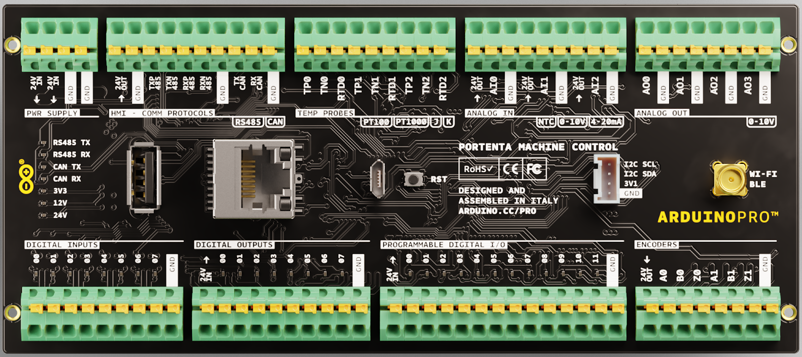
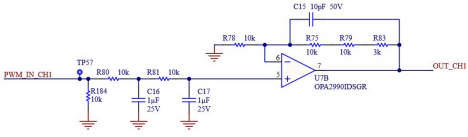
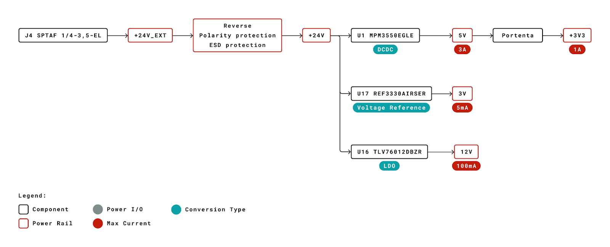

# Description

The Arduino® Portenta Machine Control is powered with a 24V DC power supply and provides several input/output digital and analog pins. This makes the board capable of driving high power relays, sample analog signals and measure temperature with different probes.

# Target Areas
Industry 4.0,  system integrators

# Features
-   **STM32H747XI dual Cortex®**
    -   **Processor**
    -   M7+M4 32 bit low power Arm® MCU
    -   8 MB SDRAM
    -   16 MB Flash QSPI
    -   480 Mhz clock
    -   Cryptochip NXP SE0502 security
 
-   **Input voltage 24**
    
-   **Reverse polarity protection**
    
-   **8 digital input channels**
    
-   **0-24V input** 
    
-   **8 digital output channels**
    -   Non-galvanic isolated 24V power input 
    -   8 High side switches with current limit and inductive load kick-back protection

-  **3 analog input channels**

    Each channel is SW configurable to be:
    -   0-10V input
    -   4-20mA input
    -   NTC input with 3V voltage reference **REF3330AIRSER**

-   **4 analog output channels**
    -   DC Voltage output SW configurable 0-10V
    -   Max 20 mA per channel

-   **12 digital programmable channels**
    -   Non-galvanic isolated 24V power input 
    -   12 High side switches with current 
        limit and inductive load kick-back protection
    -   12 Digital inputs

-   **3 temperature channels**
    Each channel is SW configurable to measure: 
    -   Thermocouple K, non grounded, front-end **MAX31855KASA+T**
    -   Thermocouple J, non grounded, front-end **MAX31855KASA+T** with SW multiplication coefficient
        -   PT100, front end **MAX31865ATP+T**

    -   **2 encoder channels ABZ**
        -   0-24V input  

    -   **High speed CAN**
        -   **TJA1049T/3J** able to work at 12V/24V 
        -   On board termination resistors 

-   **RS232/RS422/RS485 software configurable**
    -   **SP335ECR1-L** with on board termination resistors 
    -   RS485 configurable half duplex or full duplex 

-   **I2C**
    -    Grove connector 
    -    10kΩ pullups on board 

-   **Ethernet**
    -   On board transformer 

-   **Full speed USB A connector**

-   **Half speed micro USB connector**

-   **RTC**
    -   At least 48h memory retention 
    
-   **Wi-Fi/BLE**
    -   SMA connector 50Ω 

***Note: ESD protection on all inputs/outputs***

# Contents

## The Board

### Application Examples
-  **Food processing** The Portenta Machine Control scales up to meet your needs by providing control to your lab, pilot and industrial food processing demands across the beverage, drying and fermentation fields. Access professional support from Arduino or tap into the vast amount of community support to reduce the time to market. Gain real-time information about the process status and utilise edge computing capabilities to adjust the food processing parameters for improved yield and minimal waste.

-  **Glass bottle manufacturing** Make use of the fast edge computing capabilities of the Portenta range for minimal latency control of industrial components used in glass bottle manufacturing. Ensure the consistency of glass bottles created while simultaneously increasing the overall equipment effectiveness and increase the generated revenue. Make use of custom thermal control algorithms to ensure optimum annealing processes with minimal resource consumption. All while increasing the bottles per minute (BPM).

-   **Packaging** Develop and control machines that fill, freeze, wrap, seal, label and much more to ensure that your product is safely packaged to reach your consumer. Achieve interconnects between various processes with Arduino's advanced technologies such as the Arduino Cloud infrastructure. Reduce labour costs and achieve a fully automated line with minimal human interaction to meet the stringiest hygiene and quality standards

### Related Products
-   Portenta H7

### Solution Overview

## Ratings
### Recommended Operating Conditions
| Symbol          | Description                                      | Min            | Max            |
| --------------- | ------------------------------------------------ | -------------- | -------------- |
| TMax | Conservative thermal limits for the whole board: | -40 °C (-40°F) | 85 °C (185 °F) |

## Absolute Maximum Ratings

| Symbol                  | Description                                                                                                                                                                                                        | Min | Typ | Max | Unit |
| ----------------------- | ------------------------------------------------------------------------------------------------------------------------------------------------------------------------------------------------------------------ | --- | --- | --- | ---- |
| VINMax       | Input voltage on PWR SUPPLY connector 24V IN pin                                                                                                                                                                   | 0   | -   | 35  | V    |
| VA_IN_0-10V  | Input voltage on analog IN pins in 0-10V mode                                                                                                                                                                      | 0   | -   | 13  | V    |
| IA_IN_4-20mA | Input current on analog IN pins in 4-20mA mode                                                                                                                                                                     | 0   | -   | 30  | mA   |
| VA_IN_NTC    | Input voltage on analog IN pins in NTC mode                                                                                                                                                                        | 0   | -   | 3.5 | V    |
| VI2C         | I2C connector voltage                                                                                                                                                                                              | 0   | -   | 3.4 | V    |
| VD_IN        | Input voltage on DIGITAL IN connector channels. Exceeding 25V will trigger the ESD protection diodes.                                                                                                              | 0   | -   | 25  | V    |
| VD_OUT       | Output voltage on DIGITAL OUT connector channels. It is the same as DIGITAL OUT connector pin 24V IN since it must be provided externally. Exceeding 25V will trigger the ESD protection diodes.                   | 0   | -   | 25  | V    |
| VD_PROG_OUT  | Output voltage on DIGITAL PROGRAMMABLE connector channels. It is the same as DIGITAL PROGRAMMABLE connector pin 24V IN since it must be provided externally. Exceeding 25V will trigger the ESD protection diodes. | 0   | -   | 25  | V    |
| IOUT_24V     | Maximum output current from any 24V OUT pin                                                                                                                                                                        | 0   | -   | 500 | mA   |
| IOUT_ENC     | Maximum output current from any ENCODERS pin                                                                                                                                                                       | 0   | -   | 2   | mA   |

## Functional Overview

## Block Diagram

### Board Topology 

| **Ref.** | **Description**                                 | **Ref.** | **Description** |
| -------- | ----------------------------------------------- | -------- | --------------- |
| J3       | Digital inputs                                  | J10      | Encoders        |
| J4       | Power supply 24V                                | J11      | Analog out      |
| J5       | HMI - Comm protocols (RS232, RS422, RS485, CAN) | J13      | Ethernet        |
| J6       | Digital outputs                                 | J14      | WI-FI / Bluetooth® Low Energy SMA |
| J7       | Temperature probes                              | J15      | USB A           |
| J8       | Digital programmable                            | J16      | USB micro       |
| J9       | Analog in                                       | J17      | Grove I2C       |

### Digital Input 
8 channels, each is a 680 kΩ and 100 kΩ resistor divider: a 0-24V input is scaled down to 0-3V. 

### Digital Output 
The digital output connector has a 24V IN pin which must be supplied with 24V DC. 

The 24V IN pin is not galvanically isolated: the input voltage must be referred to the same GND of the board. 

The supply voltage can be the same 24V which is powering the board. 

- 8 high side switches (2x **TPS4H160AQPWPRQ1**), one for each channel Current limit
- Nominal value is 0.6A per channel. Due to internal **TPS4H160AQPWPRQ1** circuit tolerances the real value can be higher, up to 0.9A. 
- The 12 channels behavior when the current limit is reached can be selected: 
  - **Latch**: when the current limit is reached the channel is shut down and the co-respective channel enable pin must be toggled to activate it again. 
  - **Retry**: when the current limit is reached the channel is shut down and re-connected after a short period of time. If the current limit is reached again the process repeats periodically. 
  
    Internal inductive loads kick-back protection plus external 60V, 2A Schottky diode **PMEG6020ER,115**

### Digital Programmable 
The **digital programmable** connector has a 24V IN pin which must be supplied with 24V DC.

The 24V IN pin is not galvanically isolated: the input voltage must be referred to the same GND of the board. 

The supply voltage can be the same 24V which is powering the board. 

- 12 high side switches (3x **TPS4H160AQPWPRQ1**), one for each channel

Current limit 
- Nominal value is 0.6A per channel. Due to internal **TPS4H160AQPWPRQ1** circuit tolerances the real value can be higher, up to 0.9A. 
- The 12 channels behavior when the current limit is reached can be selected: 

  **Latch**: when the current limit is reached the channel is shut down and the co-respective channel enable pin must be toggled to activate it again. 

  **Retry**: when the current limit is reached the channel is shut down and re-connected after a short period of time. If the current limit is reached again the process repeats periodically. 

Internal inductive loads kick-back protection plus external 60V, 2A Schottky diode **PMEG6020ER,115**

- 12 digital input channels, each is a 680kΩ and 100kΩ resistor divider: a 0-24V input is scaled down to 0-3V. 

  The digital input channels are independent of the high side switches.
  **The digital input channels can read the status of the high side switches if needed.**

### Analog Input 
The internal A/D converter of the microcontroller has a resolution of max 16 bit (12-16 bit range) and delivers values from 0 to 65535, configurable by the user via sketch. 

Three independent analog input channels are available. Each of them has an analog switch TS12A44514PWR which is switching between three modes: 

- **0-10V**
The input is connected to a 100kΩ and 39kΩ resistor divider: a 0-10V input is scaled down to 0-2.8V.  
Input impedance approximately 28kΩ 

- **4-20mA**
The input is connected to a 120Ω resistor. A 4-20mA current input becomes a 0.48V-2.4V voltage  

- **NTC**
The input is connected to a 3V voltage reference (REF3330AIRSER) with a 100kΩ resistor in series, becoming part of a resistor divider powered by the voltage reference.  

An output pin provides 24V to power sensors. A 500mA PTC resettable fuse protects the 24V output pin. 

### Analog Output 
Four independent analog output channels are available. Each of them a double low pass filter and a high current op amp arranged in a non-inverting topology with gain 3.3.

At each input of each channel a PWM from Portenta is provided filtered by a double low pass filter, obtaining a DC output with a small AC ripple. The signal is then fed to the channel non inverting amplifier which amplifies it by 3.3. 

The output signal is a DC which amplitude is a function of the PWM duty cycle. 

Maximum output current is 20mA per channel. 

### Temperature Measurements 
Three independent temperature measurement channels are available. 

Each channel can measure non grounded thermocouples **OR** PT100, but cannot measure them at the same time.

**NOTE**: do not connect both a thermocouple and a PT100 to one channel. 
Only a single channel at a time is available to be read, according to the analog switches position. 

### Front-Ends 
There are two front ends on this board:

- MAX31855KASA+T dedicated to thermocouples
- MAX31865ATP+T dedicated to PT100

The front ends are multiplexed to the three channels via: 

  - A single low-ohmic single-pole double-throw analog switch NX3L4053HR,115 which is switching between one front end or the other. 
  - Three quadruple single pole single throw analog switches TMUX1511RSVR which are switching the active channel between the three available. 

### Connect Thermocouples 

**NOTE**: Connect only **non-grounded** thermocouples. (Grounded thermocouples are not supported).

**NOTE**: Do not connect both a thermocouple and a PT100 to a channel. 

Connect a thermocouple to channel 0: 
  - Connect the thermocouple positive pin to TP0
  - Connect the thermocouple negative pin to TN0 

**NOTE**: Do not connect the thermocouple negative pin to GND

Connect a thermocouple to channel 1:
  - Connect the thermocouple positive pin to TP1
  - Connect the thermocouple negative pin to TN1 

**NOTE**: Do not connect the thermocouple negative pin to GND

Connect a thermocouple to channel 2: 	
  - Connect the thermocouple positive pin to TP2
  - Connect the thermocouple negative pin to TN2. 

**NOTE**: Do not connect the thermocouple negative pin to GND 

### Connect Two Wires RTDs (PT100)
Connect a two wire RTD to channel 0: 
  - Connect one RTD pin to TP0 
  - Connect the other RTD pin to TN0 
  - Connect a jumper between TP0 and RTD0 

Connect a two wire RTD to channel 1: 
  -  Connect one RTD pin to TP1 
  - Connect the other RTD pin to TN1
  - Connect a jumper between TP1 and RTD1

Connect a two wire RTD to channel 2: 
  - Connect one RTD pin to TP2 
  - Connect the other RTD pin to TN2 
  - Connect a jumper between TP2 and RTD2

### Connect Three Wires RTDs (PT100) 

Connect a three wire RTD to channel 0: 
  - Connect one RTD pin to TP0 
  - Connect a second RTD pin to TN0 
**Note:** Do not connect this pin to GND 
  - Connect the third RTD pin to RTD0

Connect the third RTD pin to RTDN0 
  - Connect a three wire RTD to channel 1: 
  - Connect one RTD pin to TP1 
  - Connect a second RTD pin to TN1 
  **Note:** Do not connect this pin to GND
  - Connect the third RTD pin to RTD1 

Connect a three wire RTD to channel 2: 
  - Connect one RTD pin to TP2 
  - Connect a second RTD pin to TN2 
  **Note:** Do not connect this pin to GND
  - Connect the third RTD pin to RTD2 

### Encoders 
  - Two independent ABZ encoders channels are available. 
  - Each channel is pulled up to the board 24V supply with a 10 kΩ pullup resistor.

### CAN 
The on board transceiver is the TJA1049T/3J and implements the CAN physical layer as defined in ISO 11898-2:2016 and SAE J2284-1 to SAE J2284-5. It is compatible with 12V or 24V bus. 

- **Nominal** maximum data rate 5Mbit/s 
  - Integrated ESD protection 
  - 60Ω termination resistors are on board, with 4.7nF to GND 
A 500mA PTC resettable fuse protects the 24V OUT pin. 

### RS232/RS422/RS485 
The on board transceiver is the TJA1049T/3J, which can be SW configured for RS232, RS442 or RS485 half/full duplex. 

  - **Nominal** data rates 20Mbps RS485 and 1Mbps RS232 Data Rates 
  - Selectable 250kbps Slew Limiting 
  - Integrated RS485 120Ω differential cable termination, inactive for RS232. 
  - Integrated ESD protection 
  - A 500mA PTC resettable fuse protects the 24V output pin. 

### I2C 
  - Grove connector
  - 10kΩ pullups on board 

### Ethernet 
  - On board transformer 
  - 10/100 Ethernet physical interface is directly connected to the internal Ethernet MAC and provides full duplex communication with automatic MDIX support. 
  - The Wake On Lan functionality allows reducing power consumption when in sleep mode. 

### USB A Full Speed USB 
  - Portenta High Speed USB Phy is connected to the USB A connector 
  - Transfer rates of up to 480 Mbps. 
  - It can be used both as a host and as a device. 
  *ESD protection

### Half Speed Micro USB 
  - Portenta half speed USB is connected to the micro USB connector. 
  - Useful to program portenta via a micro usb cable 
  - It can be use to power Portenta while the 24V power supply is off. 
  *ESD protection

### RTC 
The on board real time clock/calendar is the PCF8563T/F4,118 which clock is provided by a dedicated external crystal oscillator. 

  - A 100mF supercapacitor (FC0V104ZFTBR24) provides power to the PCF8563T/F4,118 when the board power supply is disconnected. PCF8563T/F4,118 will be powered by the supercapacitor for at least 48h. 
  - 32,768kHz clock crystal (Q13FC1350000400) 

### Power Tree 

## Board Operation
### Getting Started - IDE
If you want to program your Arduino Machine Control while offline you need to install the Arduino Desktop IDE **[1]** To connect the Arduino Machine Control to your computer, you’ll need a Micro-B USB cable. This also provides power to the board, as indicated by the LED.

### Getting Started - Arduino Web Editor
All Arduino boards, including this one, work out-of-the-box on the Arduino Web Editor **[2]**, by just installing a simple plugin.

The Arduino Web Editor is hosted online, therefore it will always be up-to-date with the latest features and support for all boards. Follow **[3]** to start coding on the browser and upload your sketches onto your board.

### Getting Started - Arduino IoT Cloud
All Arduino IoT enabled products are supported on Arduino IoT Cloud which allows you to Log, graph and analyze sensor data, trigger events, and automate your home or business.

### Online Resources
Now that you have gone through the basics of what you can do with the board you can explore the endless possibilities it provides by checking exciting projects on ProjectHub **[4]**, the Arduino Library Reference **[5]** and the online store **[6]** where you will be able to complement your board with sensors, actuators and more

## Connector Pinouts
### Power Supply (J4)
| Pin | **Type** | **Description**                                  |
| --- | -------- | ------------------------------------------------ |
| 1   | 24V IN   | Board input voltage, reverse polarity protected. |
| 2   | 24V IN   | Board input voltage, reverse polarity protected. |
| 3   | GND      | GND                                              |
| 4   | GND      | GND                                              |

### HMI - Communication Protocols (J5)
| Pin | **Type** | **Description**                                                                  |
| --- | -------- | -------------------------------------------------------------------------------- |
| 1   | 24V OUT  | Output voltage connected to the board input voltage. PTC protected, nominal 0.5A |
| 2   | GND      | GND                                                                              |
| 3   | TXP 485  | RS485 TX P , RS232 TX                                                            |
| 4   | TXN 485  | RS485 TX N                                                                       |
| 5   | RXP 485  | RS485 RX P , RS232 RX                                                            |
| 6   | RXN 486  | RS485 RX N                                                                       |
| 7   | GND      | GND                                                                              |
| 8   | TX CAN   | CAN TX                                                                           |
| 9   | RX CAN   | CAN RX                                                                           |
| 10  | GND      | GND                                                                              |

### Temperature Probes (J7)
**NOTE**: RTD (**R**esistance **T**emperature **D**etector) are PT100. 

| Pin | **Type** | **Channel** | **Description**                                                |
| --- | -------- | ----------- | -------------------------------------------------------------- |
| 1   | TP0      | 00          | Thermocouples P RTD P                                          |
| 2   | TN01     | 00          | Thermocouples N RTD N **NOTE:** DO NOT CONNECT THIS PIN TO GND |
| 3   | RTD0     | 00          | RTD P third wire                                               |
| 4   | TP1      | 01          | Thermocouples P RTD P                                          |
| 5   | TN1      | 01          | Thermocouples N RTD N **NOTE:** DO NOT CONNECT THIS PIN TO GND |
| 6   | RTD1     | 01          | RTD P third wire                                               |
| 7   | TP2      | 02          | Thermocouples P RTD P                                          |
| 8   | TN2      | 02          | Thermocouples N RTD N **NOTE:** DO NOT CONNECT THIS PIN TO GND |
| 9   | RTD2     | 02          | RTD P third wire                                               |

### Analog in (J9)
| Pin | **Type** | **Channel** | **Description**                                                                                                |
| --- | -------- | ----------- | -------------------------------------------------------------------------------------------------------------- |
| 1   | 24V OUT  | -           | Output voltage connected to the board input voltage. A single PTC protects pins 1, 4, 7. PTC nominal value 0.5A |
| 2   | AI0      | 00          | Analog input                                                                                                   |
| 3   | GND      | -           | GND                                                                                                            |
| 4   | 24V OUT  | -           | Output voltage connected to the board input voltage. A single PTC protects pins 1, 4, 7. PTC nominal value 0.5A |
| 5   | AI1      | 01          | Analog input                                                                                                   |
| 6   | GND      | -           | GND                                                                                                            |
| 7   | 24V OUT  | -           | Output voltage connected to the board input voltage. A single PTC protects pins 1, 4, 7. PTC nominal value 0.5A |
| 8   | AI2      | 02          | Analog input                                                                                                   |
| 9   | GND      | -           | GND                                                                                                            |

### Analog Out (J11)
| Pin | **Type** | **Channel** | **Description** |
| --- | -------- | ----------- | --------------- |
| 1   | A0       | 00          | Analog output   |
| 2   | GND      | -           | GND             |
| 3   | A1       | 01          | Analog output   |
| 4   | GND      | -           | GND             |
| 5   | A2       | 02          | Analog output   |
| 6   | GND      | -           | GND             |
| 7   | A3       | 03          | Analog output   |
| 8   | GND      | -           | GND             |

### Digital Inputs (J3)
| Pin | **Type** | **Channel** | **Description** |
| --- | -------- | ----------- | --------------- |
| 1   | 00       | 00          | Digital input   |
| 2   | 01       | 01          | Digital input   |
| 3   | 02       | 02          | Digital input   |
| 4   | 03       | 03          | Digital input   |
| 5   | 04       | 04          | Digital input   |
| 6   | 05       | 05          | Digital input   |
| 7   | 06       | 06          | Digital input   |
| 8   | 07       | 07          | Digital input   |
| 9   | GND      | -           | GND             |

### Digital Outputs (J6)
| Pin | **Type** | **Channel** | **Description**                                                                                     |
| --- | -------- | ----------- | --------------------------------------------------------------------------------------------------- |
| 1   | 24V IN   | -           | Input voltage: this voltage is (non galvanically) isolated with respect to the board input voltage. |
| 2   | 00       | 00          | Digital output                                                                                      |
| 3   | 01       | 01          | Digital output                                                                                      |
| 4   | 02       | 02          | Digital output                                                                                      |
| 5   | 03       | 03          | Digital output                                                                                      |
| 6   | 04       | 04          | Digital output                                                                                      |
| 7   | 05       | 05          | Digital output                                                                                      |
| 8   | 06       | 06          | Digital output                                                                                      |
| 9   | 07       | 07          | Digital output                                                                                      |
| 10  | GND      | -           | GND                                                                                                 |

### Programmable Digital I/O (J8)
| Pin | **Type** | **Channel** | **Description**                                                                                     |
| --- | -------- | ----------- | --------------------------------------------------------------------------------------------------- |
| 1   | 24V IN   | -           | Input voltage: this voltage is (non galvanically) isolated with respect to the board input voltage. |
| 2   | 00       | 00          | Digital programmable output Digital programmable input                                              |
| 3   | 01       | 01          | Digital programmable output Digital programmable input                                              |
| 4   | 02       | 02          | Digital programmable output Digital programmable input                                              |
| 5   | 03       | 03          | Digital programmable output Digital programmable input                                              |
| 6   | 04       | 04          | Digital programmable output Digital programmable input                                              |
| 7   | 05       | 05          | Digital programmable output Digital programmable input                                              |
| 8   | 06       | 06          | Digital programmable output Digital programmable input                                              |
| 9   | 07       | 07          | Digital programmable output Digital programmable input                                              |
| 10  | 08       | 08          | Digital programmable output Digital programmable input                                              |
| 11  | 09       | 09          | Digital programmable output Digital programmable input                                              |
| 12  | 10       | 10          | Digital programmable output Digital programmable input                                              |
| 13  | 11       | 11          | Digital programmable output Digital programmable input                                              |
| 14  | GND      | -           | GND                                                                                                 |

### Encoders (J10)
| Pin | **Type** | **Channel** | **Description**                                                                            |
| --- | -------- | ----------- | ------------------------------------------------------------------------------------------ |
| 1   | 24V OUT  | -           | Output voltage connected to the board input voltage. PTC protected with nominal value 0.5A |
| 2   | A0       | 00          | Encoder A input                                                                            |
| 3   | B0       | 00          | Encoder B input                                                                            |
| 4   | Z0       | 00          | Encoder Z input                                                                            |
| 5   | A1       | 01          | Encoder A input                                                                            |
| 6   | B1       | 01          | Encoder B input                                                                            |
| 7   | Z1       | 01          | Encoder Z input                                                                            |
| 8   | GND      | -           | GND                                                                                        |

### USB A (J15)
| Pin | **Description** |
| --- | --------------- |
| 1   | VBUS            |
| 2   | DN              |
| 3   | DP              |
| 4   | GND             |

### USB Micro (J16)
| Pin | **Description** |
| --- | --------------- |
| 1   | VBUS            |
| 2   | DN              |
| 3   | DP              |
| 4   | ID              |
| 5   | GND             |

## Mechanical Information
### Board Outline

## Certifications
### Declaration of Conformity CE DoC (EU)
We declare under our sole responsibility that the products above are in conformity with the essential requirements of the following EU Directives and therefore qualify for free movement within markets comprising the European Union (EU) and European Economic Area (EEA). 

**ROHS 2 Directive 2011/65/EU**
Conforms to:    EN50581:2012

**Directive 2014/35/EU. (LVD)**
Conforms to:    EN 60950-1:2006/A11:2009/A1:2010/A12:2011/AC:2011

**Directive 2004/40/EC & 2008/46/EC & 2013/35/EU, EMF**
Conforms to:    EN 62311:2008

### Declaration of Conformity to EU RoHS & REACH 211 01/19/2021
Arduino boards are in compliance with RoHS 2 Directive 2011/65/EU of the European Parliament and RoHS 3 Directive 2015/863/EU of the Council of 4 June 2015 on the restriction of the use of certain hazardous substances in electrical and electronic equipment. 

| Substance                              | **Maximum limit (ppm)** |
| -------------------------------------- | ----------------------- |
| Lead (Pb)                              | 1000                    |
| Cadmium (Cd)                           | 100                     |
| Mercury (Hg)                           | 1000                    |
| Hexavalent Chromium (Cr6+)             | 1000                    |
| Poly Brominated Biphenyls (PBB)        | 1000                    |
| Poly Brominated Diphenyl ethers (PBDE) | 1000                    |
| Bis(2-Ethylhexyl} phthalate (DEHP)     | 1000                    |
| Benzyl butyl phthalate (BBP)           | 1000                    |
| Dibutyl phthalate (DBP)                | 1000                    |
| Diisobutyl phthalate (DIBP)            | 1000                    |

Exemptions : No exemptions are claimed. 

Arduino Boards are fully compliant with the related requirements of European Union Regulation (EC) 1907 /2006 concerning the Registration, Evaluation, Authorization and Restriction of Chemicals (REACH). We declare none of the SVHCs (https://echa.europa.eu/web/guest/candidate-list-table), the Candidate List of Substances of Very High Concern for authorization currently released by ECHA, is present in all products (and also package) in quantities totaling in a concentration equal or above 0.1%. To the best of our knowledge, we also declare that our products do not contain any of the substances listed on the "Authorization List" (Annex XIV of the REACH regulations) and Substances of Very High Concern (SVHC) in any significant amounts as specified by the Annex XVII of Candidate list published by ECHA (European Chemical Agency) 1907 /2006/EC.

### Conflict Minerals Declaration 
As a global supplier of electronic and electrical components, Arduino is aware of our obligations with regards to laws and regulations regarding Conflict Minerals, specifically the Dodd-Frank Wall Street Reform and Consumer Protection Act, Section 1502. Arduino does not directly source or process conflict minerals such as Tin, Tantalum, Tungsten, or Gold. Conflict minerals are contained in our products in the form of solder, or as a component in metal alloys. As part of our reasonable due diligence Arduino has contacted component suppliers within our supply chain to verify their continued compliance with the regulations. Based on the information received thus far we declare that our products contain Conflict Minerals sourced from conflict-free areas. 

## FCC Caution
Any Changes or modifications not expressly approved by the party responsible for compliance could void the user’s authority to operate the equipment.

This device complies with part 15 of the FCC Rules. Operation is subject to the following two conditions: 

(1) This device may not cause harmful interference

 (2) this device must accept any interference received, including interference that may cause undesired operation.

**FCC RF Radiation Exposure Statement:**

1. This Transmitter must not be co-located or operating in conjunction with any other antenna or transmitter.

2. This equipment complies with RF radiation exposure limits set forth for an uncontrolled environment.

3. This equipment should be installed and operated with minimum distance 20cm between the radiator & your body.

**English**: 
User manuals for license-exempt radio apparatus shall contain the following or equivalent notice in a conspicuous location in the user manual or alternatively on the device or both. This device complies with Industry Canada license-exempt RSS standard(s). Operation is subject to the following two conditions:

(1) this device may not cause interference

(2) this device must accept any interference, including interference that may cause undesired operation of the device.

**French**: 
Le présent appareil est conforme aux CNR d’Industrie Canada applicables aux appareils radio exempts de licence. L’exploitation est autorisée aux deux conditions suivantes :

(1) l’ appareil nedoit pas produire de brouillage

(2) l’utilisateur de l’appareil doit accepter tout brouillage radioélectrique subi, même si le brouillage est susceptible d’en compromettre le fonctionnement.

**IC SAR Warning:**

**English**:
This equipment should be installed and operated with minimum distance 20 cm between the radiator and your body. 

**French**: 
Lors de l’ installation et de l’ exploitation de ce dispositif, la distance entre le radiateur et le corps est d ’au moins 20 cm.

**Important:** The operating temperature of the EUT can’t exceed 85℃ and shouldn’t be lower than -40℃.

Hereby, Arduino S.r.l. declares that this product is in compliance with essential requirements and other relevant provisions of Directive 2014/53/EU. This product is allowed to be used in all EU member states. 

## Company Information

| Company name    | Arduino S.r.l.                             |
| --------------- | ------------------------------------------ |
| Company Address | Via Andrea Appiani,25 20900 MONZA（Italy） |

## Reference Documentation

| Reference                 | **Link**                                                                                            |
| ------------------------- | --------------------------------------------------------------------------------------------------- |
| Arduino IDE (Desktop)     | https://www.arduino.cc/en/Main/Software                                                             |
| Arduino IDE (Cloud)       | https://create.arduino.cc/editor                                                                    |
| Cloud IDE Getting Started | https://create.arduino.cc/projecthub/Arduino_Genuino/getting-started-with-arduino-web-editor-4b3e4a |
| Arduino Pro Website       | https://www.arduino.cc/pro                                                                          |
| Project Hub               | https://create.arduino.cc/projecthub?by=part&part_id=11332&sort=trending                            |
| Library Reference         | https://www.arduino.cc/reference/en/                                                                |
| Online Store              | https://store.arduino.cc/                                                                           |

## Revision History

| Date       | **Revision** | **Changes**   |
| ---------- | ------------ | ------------- |
| 04/13/2021 | 1            | First Release |
| 05/09/2020 | 2            | Remove PT1000, not compatible |
