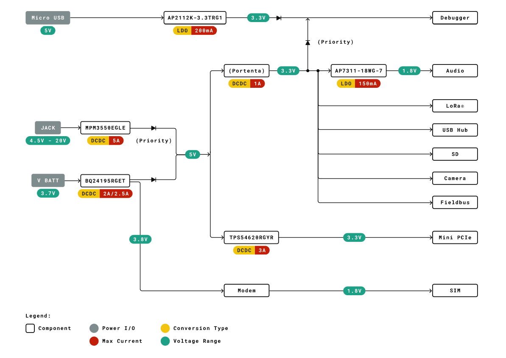
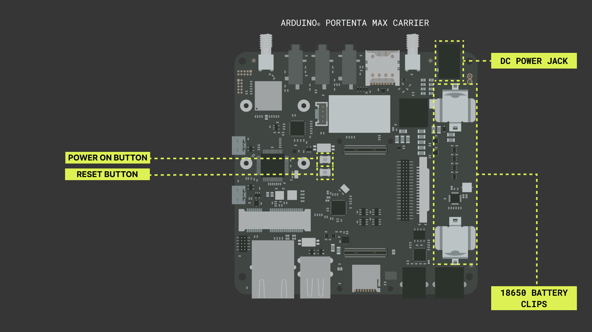
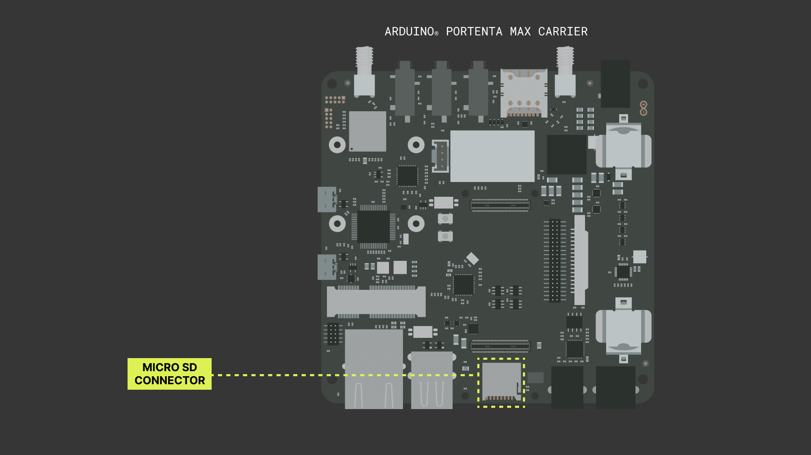
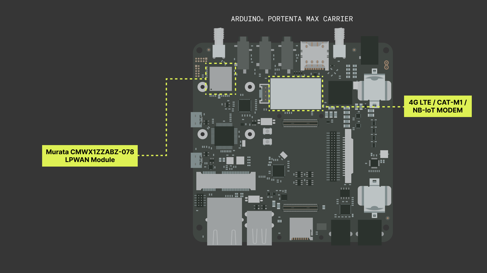
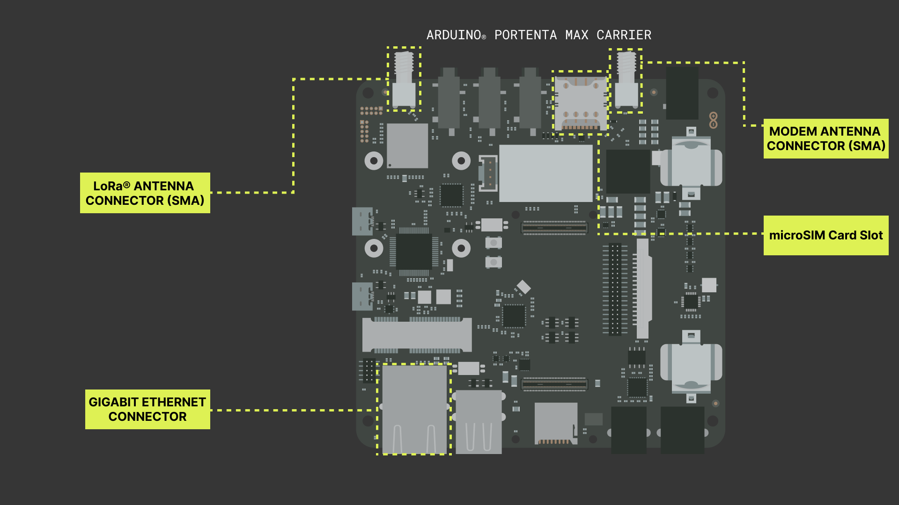
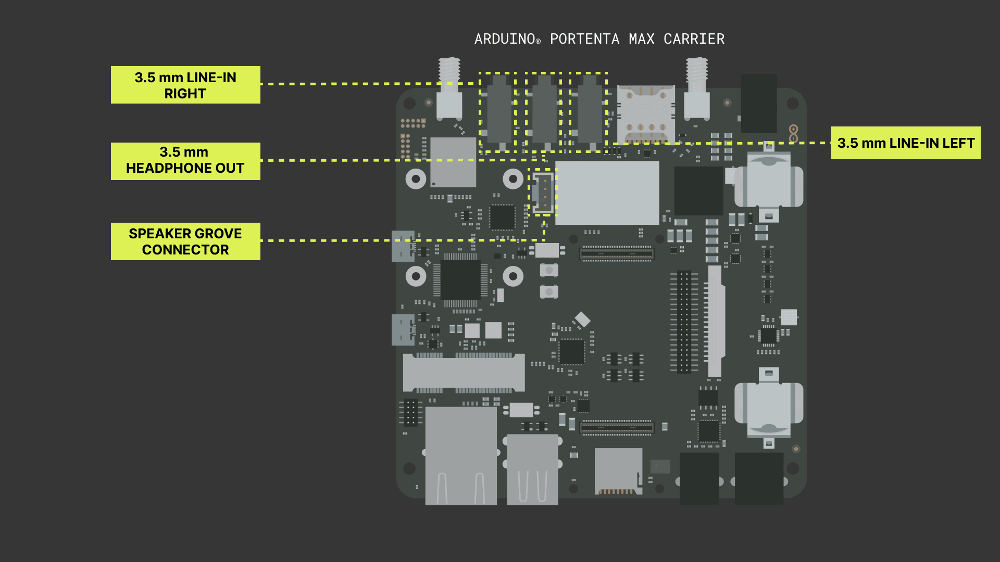
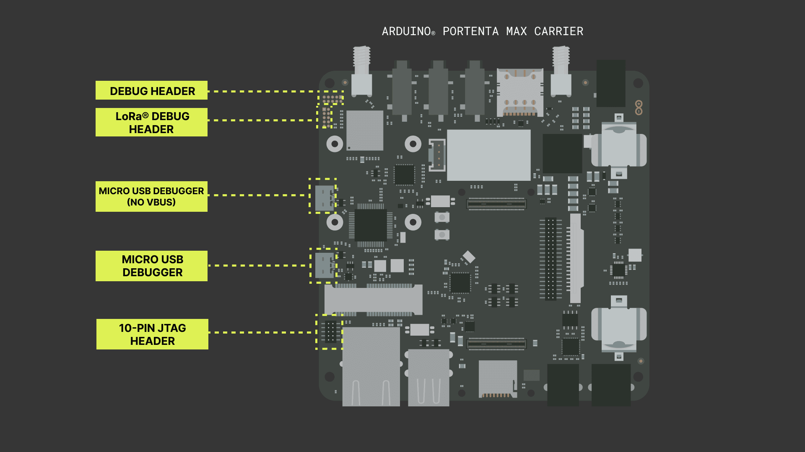
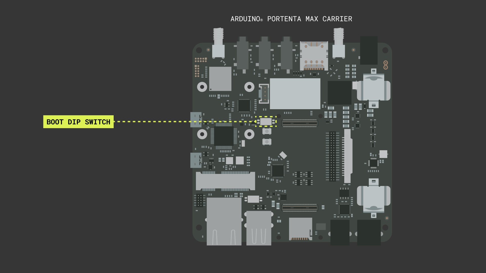
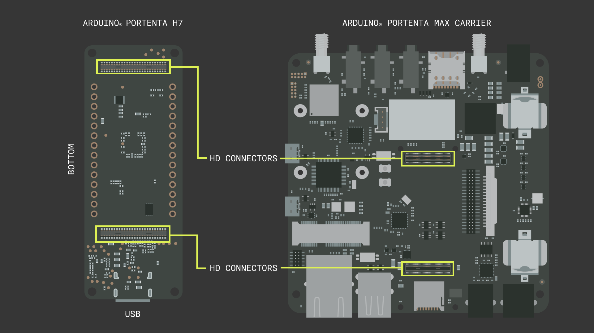

## Overview

The Arduino Portenta Max Carrier provides developers with an unlimited range of applications, from robotics and medical devices to industrial or automotive applications; the Portenta Max Carrier possibilities are endless. The Portenta Max Carrier can be used as a single-board computer (SBC) or reference design. It couples the Arduino Portenta H7 board as a central high-performance unit, granting Edge AI and cutting-edge connectivity features into an industry-standard embedded Next Unit of Computing (eNUC) form factor ready.

In this tutorial, you will learn about the core features of the Portenta Max Carrier and how to get started with it.

## Goals

- Describe the core features of the Portenta Max Carrier.
- Describe the power sources of the Portenta Max Carrier.
- Describe the relevant peripherals, headers, and connectors of the Portenta Max Carrier.

## Required Hardware and Software

- [Portenta H7](https://store.arduino.cc/products/portenta-h7)
- [Portenta Max Carrier](http://store.arduino.cc/portenta-max-carrier)
- USB-C® cable (either USB-A to USB-C® or USB-C® to USB-C®)
- LoRa® antenna (868-915MHz) with SMA connector
- LTE antenna (698-960/1710-2690MHz) with SMA connector
- 3.7V 2600mAh 18650 Li-Ion battery
- DC 4.5-20V power supply with barrel jack
- Micro SD Card
- Arduino IDE ([online](https://create.arduino.cc/) or [offline](https://www.arduino.cc/en/main/software))

## Instructions

### 1. Get to Know the Portenta Max Carrier

The Portenta Max Carrier was designed to augment the capabilities of the Portenta H7 board and provide easy access to its onboard peripherals. It is designed to enable research and develop industrial-grade advanced applications, from rapid prototyping to a deployable robust single-board computer.

The Portenta Max Carrier establishes a connection with Portenta H7 via High-Density connectors. This interface grants access to extensive modules and peripherals on-board the Portenta Max Carrier.

In this tutorial, we will describe the following features of the Portenta Max Carrier:

- Power distribution
- Connectors
- On-board memory units
- Wireless connectivity
- Audio interfaces
- On-board debugger

#### 1.1. Power Distribution

The Portenta Max Carrier provides several peripherals and modules to cover a wide spectrum of applications. For these peripherals and modules to be powered up and run, the Portenta Max Carrier is built upon a sophisticated electric power distribution architecture.

To power the Portenta Max Carrier, you can use the **barrel jack** connector (X1) or a **3.7V 18650 Li-Ion battery** connected to the Portenta Max Carrier's battery clips (J16 and J18). You can also power the Portenta Max Carrier directly from the USB-C® connector of the Portenta H7 board.

You can see the detailed Portenta Max Carrier's power tree in the image below:

The following image shows the Portenta Max Carrier's power inputs:

These power feed line options power up different peripherals and modules depending on the line configuration. The Portenta H7 powered by USB-C® cable attached to Portenta Max Carrier enables Audio, LoRa®, USB Hub, SD port, and Fieldbus. The Debugger is also enabled, and it is also possible to upload the code at the same time. This power line use case will be useful to develop and debug the code.

**If the Arduino IDE throws an error failing to upload the code, please set the Portenta H7 in Bootloader Mode before uploading.**

The external power supply goes through [**MPM3550EGLE**](https://www.mouser.com/datasheet/2/277/MPS_05172019_MPM3550E_r1.0-1595120.pdf), which is a DC/DC power module, to provide +5V to power up the peripherals and the modules. The module provides the power to [**BQ24195RGET**](https://www.ti.com/lit/ds/symlink/bq24195.pdf?HQS=dis-mous-null-mousermode-dsf-pf-null-wwe&ts=1647034752895&ref_url=https%253A%252F%252Fwww.mouser.com%252F), which is a battery charge and power path management, and it is used in Portenta Max Carrier for the Li-Ion battery source and to boost the voltage to +5V. The battery charger IC feeds the power to the Modem including all the peripherals and modules mentioned previously. The external power supply has the highest priority in the power line.

A Micro USB port is available for debugging on the Portenta Max Carrier. The debugging module is a separate segment, and it is powered by a Micro USB port using its power supply [**AP2112K**](https://www.diodes.com/assets/Datasheets/AP2112.pdf), which is a low-dropout linear regulator. The debugger is available for use without the Portenta H7 paired with the Portenta Max Carrier.

#### 1.2. Connectors

The Portenta Max Carrier is equipped with a wide spectrum of connectors for expandability. The following table will show briefly the connectors that are available on the carrier.

|         **Connector (Ref.)**        |                      **Description**                      |
|:-----------------------------------:|:---------------------------------------------------------:|
|           **USB Hub (U3)**          |             USB2514Bi/M2 4-port USB 2.0 Hub IC            |
|        **LoRa® Header (CN2)**       |                        Debug Header                       |
|        **Debug Header (CN3)**       |                     LoRa® Debug Header                    |
| **High Density Connectors (J1,J2)** |     DF40HC(3.5)-80DS-0.4V(51) High Density Connectors     |
|     **Modem SMA Connector (J3)**    |            Right-Angle SMA Connector for Modem            |
|     **LoRa® SMA Connector (J9)**    |            Right-Angle SMA Connector for LoRa®            |
|        **FPC Connector (J4)**       |                 2-1734248-0 FPC Connector                 |
|        **JTAG Header (CN1)**        |            FTSH-105-01-F-DV 10-pin JTAG Header            |
|          **USB DBG0 (J10)**         |   ZX62-AB-5PA(31) Micro USB Debugger Connector with VBUS  |
|          **USB DBG1 (J19)**         | ZX62-AB-5PA(31) Micro USB Debugger Connector without VBUS |
| **Grove Connector for Audio (J20)** |          110990030 Grove Connector for a Speaker          |
|      **Header Connector (J5)**      |             FW-20-05-G-D-254-150 Signal Break             |
|     **4P4C CAN Connector (J7)**     |        J6 615006138421 RS-232/RS-485 Connector J7 6       |
|    **6P6C Serial Connector (J6)**   |            615006138421 RS-232/RS-485 Connector           |
|       **PCIe Connector (J8)**       |               1759546-1 Mini PCIe Connector               |
|     **Micro SD Connector (J11)**    |              114-00841-68 Micro SD Connector              |
|     **Ethernet Connector (J17)**    |          TRJK7003A97NL Gigabit Ethernet Connector         |

***PCIe connector is available on-board. However, only USB and I2C is available for use at the moment.***

It is worth noting that a 4P4C connector establishes the connection to the **CAN Transceiver** based on a [TJA1049T/3J](https://www.mouser.com/datasheet/2/302/TJA1049-1127979.pdf) IC.

The **Serial Transceiver** based on [SP335](https://assets.maxlinear.com/web/documents/sp335e.pdf) IC, which is a multi-protocol transceiver with support for RS-232, RS-485, and RS-422. It establishes a connection via a 6P6C connector, and its default configurations are as follows:

- Full Duplex
- 232 Protocol
- No Data Rate Limit
- Enabled

#### 1.3. Onboard Memory Units

The Portenta Max Carrier equips two different memory units onboard: Flash Memory and Mini SD Card slot.

**On-Board Flash Memory**

- The Flash memory on-board the Portenta Max Carrier has 2 MB of storage via QSPI (Quad Serial Peripheral Interface).

***For more information on how to use the Flash Memory storage, please follow this [guide](https://docs.arduino.cc/tutorials/portenta-h7/reading-writing-flash-memory) to get the most out of the Flash Memory.***

**Mini SD Card slot**

- The Mini SD card interface grants the possibility to extend the storage size. It can be used to process a hefty amount of log data, which can be from sensors or programmed onboard computer registry.

***To learn how to use the Mini SD card slot to expand the storage size, please follow this [guide](https://docs.arduino.cc/learn/programming/sd-guide).***

***If it requires to reduce library size and uses FAT16/FAT32 formats, please look into this [library](https://github.com/greiman/SdFat), created and maintained by Bill Greiman.***

#### 1.4. Wireless Connectivity

The Portenta Max Carrier has on-board Murata CMWX1ZZABZ-078 LoRaWAN® Module and SARA-R412M-02B Cell Modem shown in the following image below:

#### LoRaWAN® Module - Murata CMWX1ZZABZ-078

One of the notable features of Portenta Max Carrier is the Murata [CMWX1ZZABZ-078](https://www.murata.com/products/connectivitymodule/lpwa/overview/lineup/type-abz-078) that enables LoRaWAN® connectivity. LoRaWAN® is a Low Power Wide Area Network (LPWAN) designed to connect low-power devices to the Internet. It was developed to meet and fulfill Internet of Things (IoT) devices' requirements, such as low-power consumption and low data throughput.

Depending on the region, it will require to use an appropriate antenna for the respective frequencies. The common frequencies are 915 MHz for North America and Australia, and 863 MHz for European region. Frequencies are on a range, so for example, Australian region is possible to use a 928 MHz compatible antenna and configuration.

***For more in-depth information about LoRa® and LoRaWAN®, please read [The Arduino Guide to LoRa® and LoRaWAN®](https://docs.arduino.cc/learn/communication/lorawan-101).***

For the LoRa® Connection tutorial with in-depth details on how to power up the module and establish a connection to The Things Network (TTN), please go [here](https://docs.arduino.cc/tutorials/portenta-max-carrier/connecting-to-ttn) for more information.

#### Cell Modem - SARA-R412M-02B

The Portenta Max Carrier carries a cellular modem SARA-R412M-02B to carry out tasks requiring general network connectivity. This cellular modem is capable of establishing **2G / Cat-M1 / NB-IoT** connections globally. It is powered by a bidirectional logic level shifter SN74LVC1T45 and an internal regulator, implemented for the use of SIM card and I/O.

The cellular modem requires SIM card integration, which can be fulfilled by introducing a SIM card in the available microSIM slot (SIM1). The modem has a dedicated SMA connector (J3) for the antenna.

***Please DO NOT USE the cellular modem without the external antenna attached to the SMA connector. It might damage the Portenta Max Carrier if used without.***

To begin using the modem, it will require some packages to be installed beforehand. Given the network technology, Cat-M1 and NB-IoT, it will require the use of the `MKRNB` library. Please also make sure to have the `Arduino Mbed OS Portenta Core` up to date from the board manager.

We will use the `arduino_secrets.h` header file for the PIN and APN configuration of the SIM card that will be inserted into the microSIM slot onboard Portenta Max Carrier.

If you want to learn how to run a sketch with this library or how to switch between Cat M1 and NB IoT, please take a look at our [Portenta Max Carrier and Portenta H7 Cat M1/NB IoT tutorial](https://docs.arduino.cc/tutorials/portenta-max-carrier/catm1-and-nbiot)

The antenna connectors for both LoRaWAN® and cellular modem with the microSIM slot are indicated in the following image:

#### Ethernet Connection

The Portenta Max Carrier has a physical Ethernet interface on-board, which is directly connected via High-Density Connectors of the Portenta board. The connector provides network activity status and speed indication via an LED indicator.

The 10/100 Ethernet is supported and the Gigabit connection is reserved for future use at the moment. The physical interface is indicated visually with the previous image showing antenna connectors and a microSIM slot.

#### 1.5. Audio Interfaces

The Portenta Max Carrier features a stereo CODEC, the [CS42L52](https://www.mouser.com/datasheet/2/76/CS42L52_F2-1141287.pdf) from Cirrus Logic®. The CS42L52 is a 24-bit, low-power stereo CODEC that can provide up to 1W per channel of Class D stereo/mono amplification to external speakers (8-ohm stereo speakers and 4-ohm mono speakers) or enough power to drive 44mW per channel into stereo headphones. There are four analog audio interfaces in the Portenta Max Carrier, as shown in the image below:

You can use [this](https://www.digikey.ca/en/products/detail/adafruit-industries-llc/5244/16056943) cable assembly and make your mono speaker. The CS42L52 stereo CODEC operates using an I2C interface, with the CODEC acting as a secondary device.

The Portenta H7 establishes an I2C interface using the `Wire` library included in the `ArduinoCore-mbed` package. The Portenta Max Carrier, while having paired the Portenta H7 via High-Density Connectors, can be expanded via Header Connector J5 for I2C interface interoperability. External modules requiring an I2C interface can be established via header Connector J5 with up to 2 available I2C bridges.

***For more information on I2C protocol, please have a look at this [guide to Arduino & the I2C Protocol (Two Wire)](https://docs.arduino.cc/learn/communication/wire).***

#### 1.6. Onboard Debugger

Part of the development process, debugging process is crucial, and it is a required step if we are aiming now to work with industrial-grade devices. The Portenta Max Carrier provides discrete debugging capability onboard. The feature can be accessed via micro USB to J-Link debugger.

It is driven by an STM32F405RGT6 controller and compatible with Segger® J-Link OB and Blackmagic probes. The module itself does not require Portenta H7 to be attached to the Portenta Max Carrier, meaning it does not require VBUS.

***For more in-depth information about Debugging, please read [Debugging Fundamentals](https://docs.arduino.cc/learn/microcontrollers/debugging).***

The following image indicates the connectors that enable and allows to establish a connection to Portenta Max Carrier's onboard debugger.

### 2. Basic Setup of the Portenta Max Carrier

The Portenta Max Carrier only requires the Portenta H7 as the main unit to be able to use it. External components are required to enable the onboard module's capability and correct operation, such as cellular modem and LoRaWAN® connectivity. As the Portenta H7 is the central control unit of the Portenta Max Carrier, it will need to have the latest **Arduino Mbed OS Portenta Core** installed.

If it is not installed or requires an update, it is possible to navigate under **Tools > Board > Board Manager** and search for the `Arduino Mbed OS Portenta Core` and proceed with the update.

To take advantage of Portenta Max Carrier's Power Architecture, an important physical configuration requires to be verified. A DIP Switch for Boot mode selection is present on the Portena Max Carrier board. It requires setting **BOOT_SEL** to select between 2 boot addresses, which will enable Portenta H7 and Max Carrier to run the firmware. **BOOT** parameter will switch the Portenta H7 state into Boot mode.

Every time it initiates at Boot mode, the Portenta H7 will fade the Green LED to indicate its state. It will help to understand the board is in Boot mode and not turned off due to an unavailable electric supply as it shut off. As the power lines are alive even if the board shows no indication of an operating instance.

### 3. The Circuit

The Portenta Max Carrier uses the Portenta H7 as the main central processing unit and that powers up the carrier's modules mentioned above. Both systems possess High-Density Connectors to establish communication interfaces in between. It is simple as attaching the Portenta H7 to Portenta Max Carrier's High-Density Connectors. The following connection scheme shows how exactly the device is paired with the correct orientation.

The rest of the connection population will depend on the development requirement. It is important that if the connectivity modules are to be utilized, respective antennas should be attached before powering up. Otherwise, the Portenta Max Carrier may suffer from severe electronic hardware damage. Such details are drawn on the table with the briefly mentioned content above in `1.4. Wireless Connectivity` section.

### 4. Getting up to Pro with Development Environment

For all the information detailed above for it to be used, we will need to develop the code and flash it to the system. It is possible to use the following development environment designed by Arduino.

#### 4.1. Using Arduino IDE 2

The Arduino IDE 2 allows the developers to design and upload the code to Portenta H7 offline. It will also help you with organizing packages needed to program the Portenta H7. It will require a USB-C® Type cable that will allow you to connect and program the Portenta H7. In [here](https://www.arduino.cc/en/software), you will be able to find the latest version of the Arduino IDE 2.

***If you want to know how to set up the Arduino IDE 2 adequately, please look into [Quick Guide to Arduino IDE 2](https://docs.arduino.cc/software/ide-v2/tutorials/getting-started/ide-v2-downloading-and-installing).***

#### 4.2. Using Arduino Web Editor

All Arduino boards work Out-of-the-Box with the Arduino Web Editor, and the Portenta H7 with Portenta Max Carrier is no exception. The Arduino Web Editor requires an online connection with an Arduino account and a simple plugin for development. The features are always up-to-date and support every Arduino board. By following this [link to Arduino® Web Editor](https://create.arduino.cc/editor), you will be able to access and begin developing the code.

***If you want to know how to get started with Arduino Web Editor, please look into [Getting started with the Web Editor](https://docs.arduino.cc/cloud/web-editor/tutorials/getting-started/getting-started-web-editor).***

#### 4.3. Using Arduino IoT Cloud

The Arduino boards that are IoT enabled, can use the Arduino IoT Cloud to develop an automated system and a feedback system that gathers useful data for analysis purposes. By following this [link to Arduino IoT Cloud](https://create.arduino.cc/iot/things), you will be able to access and begin developing the code.

***If you want to know how to get started with Arduino IoT Cloud, please look into [Getting Started With the Arduino IoT Cloud](https://docs.arduino.cc/cloud/iot-cloud/tutorials/iot-cloud-getting-started).***

### 5. Portenta Max Carrier Quick Peripheral Table

The following peripheral table will help you guide through quickly the select available connectors on Portenta Max Carrier.

| PERIPHERAL                 | PIN       | FUNCTION      | TYPE    | DESCRIPTION                         |
| -------------------------- | --------- | ------------- | ------- | ----------------------------------- |
| **LoRa® Header (CN2)**     |           |               |         |                                     |
|                            | 1         | +3V3          | Power   | +3V3 Power Rail                     |
|                            | 2         | LoRa_SWDIO    | Digital | LoRa® SWD Data Line                 |
|                            | 3, 5, 9   | GND           | Power   | Ground                              |
|                            | 6 ~ 8     | NC            | NC      | Not Connected                       |
|                            | 4         | LoRa_SWCLK    | Digital | LoRa® SWD Clock Line                |
|                            | 10        | LORA_RST      | Digital | LoRa® module reset pin              |
| **Debug Header (CN3)**     |           |               |         |                                     |
|                            | 1         | 3V3_DBG       | Power   | +3V3 Power Rail                     |
|                            | 2         | DBG_SWDIO     | Digital | SWD Data Line                       |
|                            | 3, 5, 9   | GND           | Power   | Ground                              |
|                            | 4         | DBG_SWCLK     | Digital | SWD Clock Line                      |
|                            | 6 ~ 8     | NC            | NC      | Not Connected                       |
|                            | 10        | RST           | Digital | Reset Pin                           |
| **JTAG Header (CN1)**      |           |               |         |                                     |
|                            | 1         | 3V3           | Power   | +3V3 Power Rail                     |
|                            | 2         | JTAG_SWD      | Digital | JTAG SWD Data Line                  |
|                            | 3, 5      | GND           | Power   | Ground                              |
|                            | 4         | JTAG_SCK      | Digital | JTAG Clock Line                     |
|                            | 6         | JTAG_SWO      | Digital | JTAG Trace Data Line                |
|                            | 7         | NC            | NC      | Not Connected                       |
|                            | 8         | JTAG_TDI      | Digital | JTAG Test Data In Line              |
|                            | 9         | JTAG_TRST     | Digital | JTAG Test Reset Line                |
|                            | 10        | JTAG_RST      | Digital | JTAG Reset Line                     |
| **Header Connector (J5)**  |           |               |         |                                     |
|                            | 1         | 3V3           | Power   | +3V3 Power Rail                     |
|                            | 2, 13, 14 | GND           | Power   | Ground                              |
|                            | 3         | VREF_P        | Analog  | Positive Analog Voltage Reference   |
|                            | 4         | VREF_N        | Analog  | Negative Analog Voltage Reference   |
|                            | 5 ~ 12    | A0 ~ A7       | Analog  | Analog input 0 ~ 7                  |
|                            | 15        | SAI_CK        | Digital | SAI Clock Line                      |
|                            | 16        | CS            | Digital | SPI1 Clock Select                   |
|                            | 17        | SAI_FS        | Digital | SAI Frame Synchronization           |
|                            | 18        | CK            | Digital | SPI1 Clock Line                     |
|                            | 19        | SAI_D0        | Digital | SAI Data Line 0                     |
|                            | 20        | MISO          | Digital | SPI Main In Secondary Out           |
|                            | 21        | SAI_D1        | Digital | SAI Data Line 1                     |
|                            | 22        | MOSI          | Digital | SPI1 Main Out Secondary In          |
|                            | 23        | SPDIF_TX      | Digital | SPDIF Transmission                  |
|                            | 24        | TX            | Digital | Serial3 Transmission                |
|                            | 25        | SPDIF_RX      | Digital | SPDIF Receive                       |
|                            | 26        | RX            | Digital | Serial3 Receive                     |
|                            | 27        | SDA           | Digital | I2C1 Data Line                      |
|                            | 28        | RTS           | Digital | Serial3 Ready to Send               |
|                            | 29        | SCL           | Digital | I2C1 Clock Line                     |
|                            | 30        | CTS           | Digital | Serial3 Clear to Send               |
|                            | 31        | 3V8           | Power   | +3V8 Power Rail                     |
|                            | 32        | SDA           | Digital | I2C2 Data Line                      |
|                            | 33        | PWM0          | Digital | PWM Output 0                        |
|                            | 34        | SCL           | Digital | I2C2 Clock Line                     |
|                            | 35        | PWM1          | Digital | PWM Output 1                        |
|                            | 36        | 5V            | Power   | +5V Power Rail                      |
|                            | 37        | PWM2          | Digital | PWM Output 2                        |
|                            | 38        | CAN1_TX       | Digital | CAN Transmission Line               |
|                            | 39        | PWM3          | Digital | PWM Output 3                        |
|                            | 40        | CAN1_RX       | Digital | CAN Receive Line                    |
| **4P4C CAN Connector (J7)**|           |               |         |                                     |
|                            | 1         | 5V            | Power   | +5V (Fused)                         |
|                            | 2         | CANL          | Diff.   | CAN Differential Signal Low         |
|                            | 3         | CANH          | Diff.   | CAN Differential Signal High        |
|                            | 4         | GND           | Power   | Ground                              |
| **6P6C Serial Conn. (J6)** |           |               |         |                                     |
|                            | 1         | GND           | Power   | Ground                              |
|                            | 2         | Z             | Digital | SP335 Out 1                         |
|                            | 3         | Y             | Digital | SP335 Out 2                         |
|                            | 4         | A             | Digital | SP335 In 2                          |
|                            | 5         | B             | Digital | SP335 In 1                          |
|                            | 6         | GND           | Power   | Ground                              |
| **PCIe Connector (J8)**    |           |               |         |                                     |
|                            | 1, 3, 5, 6, 8, 10, 12, 14, 16, 17, 19, 20, 24, 28, 37, 42 ~ 49, 51        | NC            | NC      | Not Connected                       |
|                            | 2, 39, 41, 52             | 3V3_PCIE      | Power   | +3V3 Power Rail                     |
|                            | 3, 9, 15, 18, 21, 26, 27, 29, 34, 35, 40, 50                              | GND           | Power   | Ground                              |
|                            | 7         | PCIE_CLKREQ   | Digital | PCIE Clock Request Signal           |
|                            | 11        | mPCIe_CK_N    | Diff.   | PCIe Clock Differential Negative    |
|                            | 13        | mPCIe_CK_P    | Diff.   | PCIe Clock Differential Positive    |
|                            | 22        | mPCIe_RST     | Digital | PCIe Reset Signal                   |
|                            | 23        | mPCIe_RX_N    | Diff.   | PCIe Receive Differential Negative  |
|                            | 25        | mPCIe_RX_N    | Diff.   | PCIe Receive Differential Positive  |
|                            | 30        | SCL           | Digital | I2C Clock Line                      |
|                            | 31        | mPCIe_TX_N    | Diff.   | PCIe Transmission Differential Negative  |
|                            | 32        | SDA           | Digital | I2C Data  Line                      |
|                            | 33        | mPCIe_TX_P    | Diff.   | PCIe Transmission Differential Positive  |
|                            | 36        | USB_DN        | Diff.   | USB Data Differential Negative      |
|                            | 38        | USB_DN        | Diff.   | USB Differential Positive           |

***These are a quick reference to commonly used interfaces and if custom connectors are to be used, above quick peripheral table will assist you to verify the correct polarity of connector pins.***

## Conclusion

You now have a quickstart guide to the Portenta Max Carrier with its rich modules and peripherals to design and implement real-world solutions. The Portenta Max Carrier provides a wide spectrum of tools and ports to enable a scalable design solution. With this guide, you now also acquired brief knowledge about the Portenta Max Carrier and will be able to solidify the requirements and devise more clearly.

### Next Steps

In-depth guides for each distinctive module onboard Portenta Max Carrier can be found under each section of the features listed previously in this guide.

## Troubleshooting

One may encounter issues setting up and initializing for the first time the Portenta Max Carrier. The following troubleshooting will help you with the possible issues that might occur in the beginning.

- When sketch upload fails, please check if the Portenta H7 attached to Portenta Max Carrier is in bootloader mode. Double-press the RESET button and the Green LED will be waving, indicating it has entered bootloader mode. Please retry uploading the sketch afterward.

- Verify that the BOOT DIP switch of the Portenta Max Carrier has been configured to an address. Otherwise, the paired Portenta H7 will go into bootloader mode after power-on and it will not initialize the program.
