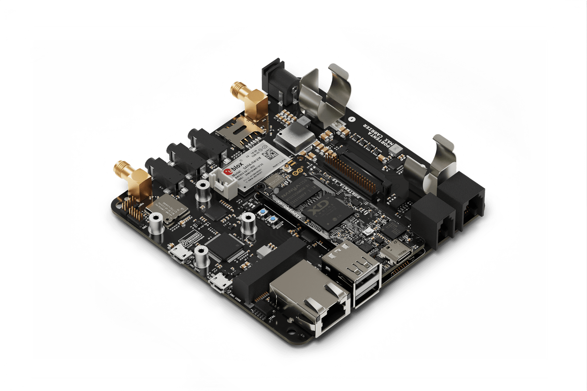

# Description 
Enable edge AI for high performance industrial, building automation and robotics applications with the Portenta Max Carrier. The Portenta Max Carrier transforms the Arduino® Portenta family into a standardized industrial platform, ready for use as a single board computer or as a reference design. The Portenta Max Carrier provides easy access to the onboard peripherals of the Arduino® Portenta X8 including Gigabit Ethernet, microSD and PCIe. This board further augments the capabilities of the Portenta X8 with Fieldbus, LoRa®, 4G, Cat-M1 and NB-IoT connectivity providing a platform for Industry 4.0. 

# Target areas:
Industry 4.0, prototyping, robotics, data logging 

# Features
**Note**: This board needs the Portenta X8 for full functionality. Not all features are available with the Arduino® Portenta H7.  

*   **High Density connectors compatible with Portenta family**
*   **Memory**
    *   Flash  memory (2Mb QSPI)
    *   Micro SD Card slot
*   **Power**
    *   Power Jack for external supply (6-36V)
    *   On-board 18650 Li-ion battery connector with battery charger (3.7V). It can be used as backup power source if the external power supply fails.
*   **Wireless modules**
    *   Murata CMWX1ZZABZ-078 LoRa® module,  SMA connector for antenna
    *   SARA-R412M-02B (4G/Cat-M1/NBIoT), micro SIM, SMA connector for antenna
*   **Connectors**
    *   2x USB-A female connectors
    *   1x Gigabit Ethernet connector (RJ45)
    *   1x FD-Can on RJ11
    *   1x mini PCIe
    *   1x Serial RS232/422/485 on RJ12
*   **Audio**
    *   3x audio jacks: stereo line in, mic in, HP line out 
    *   1x speaker connector
*   **Debugging**
    *   On board JLink OB / Blackmagic probe 

# Contents

## The Board
### Application Examples
The Portenta Max Carrier provides the user with almost limitless possibilities to create edge computing applications. Together with the Portenta X8, there is a wide range of application options.

**Industrial IoT:** The Portenta Max Carrier enables connectivity between the Portenta boards and Fieldbus (MODBUS/CAN bus). Join the Industry 4.0 bandwagon with edge computing and a range of connectivity options to increase the revenue on your specific application. Remotely control machinery through the Arduino IoT Cloud or your own choice of third-party services without concern for vendor lock-in and identify process bottlenecks with continuous flow monitoring. The low power consumption and integrated Li-ion battery power management ensure reliable operation even in the face of external power failures.

**Digital Smart Kiosk:** Develop fully-fledged Information Kiosks, Point of Sales devices or other HMI solutions with the Portenta Max Carrier. Increase the productivity and satisfaction of your personnel and customers with real time information. The Portenta Max Carrier can be part of your solution for real time assessment of production environments, just-in-time management of warehouses, patient centric healthcare experiences and mobility management with a streamlined development process

**Reference Design:** The Portenta Max Carrier is a great reference design for developing your own custom products around the Portenta ecosystem that conforms to the industry standard specifications. Arduino Pro also provides full development, production and operation support to develop solutions tailored to your business needs.

### Accessories (Not Included)
*   Mini PCIe expansion boards
*   SIM card
*   3.7V 18650 Li-ion battery
*   microSD card

### Related Products
*   Portenta H7 (Partial support)
*   Portenta X8

## Ratings

### Recommended Operating Conditions
| Symbol                | Description               | Min | Typ | Max  | Unit |
| --------------------- | ------------------------- | --- | --- | ---- | ---- |
| T                     | Thermal limits *(1)*      | -20 | 25  | 85   | °C   |
| VPWR_IN_12 | Power Jack Input Voltage  | 6   | 7   | 36   | V    |
| PMax       | Maximum Power Consumption | -   | -   | 5000 | mW   |

>  (1) RF performance of the SARA-R4 modem above 65°C may be affected, although module is fully functional

## Functional Overview

### Block Diagram

### Board Topology 

| **Ref.** | **Description**                                        | **Ref.**       | **Description**                                           |
| -------- | ------------------------------------------------------ | -------------- | --------------------------------------------------------- |
| U1       | SARA-R412M-02B 4G LTE/Cat-M1/NB-IoT Modem IC           | U2             | CS42L52-CNZ Stereo Codec IC                               |
| U3       | USB2514Bi/M2 4-port USB 2.0 Hub IC                     | U4             | SP335EER1-L RS232/RS485/RS422 Transceiver IC              |
| U5       | TJA1049 CAN Transceiver IC                             | U6             | MPM3550EGLE Non-isolated DC-DC IC                         |
| U7       | NCP383 Current Limiting IC                             | U8,U20,U21,U22 | SN74LVC1T45 Bi-directional logic level converter IC       |
| U9       | DSC6111HI2B 12MHz MEMS Oscillator IC                   | U10            | SN74LVC1G125 Single Bus Buffer Gate IC                    |
| U11      | BQ24195RGET 4.5A Single Cell Charger IC                | U12            | AP7311 1.8V 150mA LDO Linear Regulator IC                 |
| U13      | TPS54620 6A Buck Regulator IC                          | U14            | AP2112K-3.3TRG1 3.3V 600mA LDO Regulator IC               |
| U15      | STM32F405RG 168MHz 32 bit ARM Cortex-M4 MCU IC         | U16-U19        | 74LVC1G157 Single 2-input multiplexer IC                  |
| U23      | CMWX1ZZABZ-078 Murrata LoRa® module                    | U24, U25       | LM73100 Ideal Diode with Reverse Polarity Protection      |
| J1, J2   | DF40HC(3.5)-80DS-0.4V(51) High Density Connectors      | J3             | Right-Angle SMA Connector for Modem                       |
| J4       | 2-1734248-0 FPC Connector                              | J5             | FW-20-05-G-D-254-150 Signal Break                         |
| J6       | 615006138421 RS232/RS485 Connector                     | J7             | 615006138421 CAN Connector                                |
| J8       | 1759546-1 Mini PCIe Connector                          | J9             | Right-Angle SMA Connector for LoRa®                       |
| J10      | ZX62-AB-5PA(31) Micro USB Debugger Connector with VBUS | J11            | 114-00841-68 Micro SD Connector                           |
| J12      | SJ-3524-SMT-TR 3.5mm Headphone Out                     | J13            | SJ-3524-SMT-TR 3.5mm Line In Right                        |
| J14      | SJ-3524-SMT-TR 3.5mm Line In Left                      | J15            | 61400826021 2-port USB 2.0 Female Connector               |
| J16      | 254TR Positive Li-ion Terminal                         | J17            | TRJK7003A97NL Gigabit Ethernet Connector                  |
| J18      | 254TR Negative Li-ion Terminal                         |             |  |
| J20      | 110990030 Connector for Speaker                  | X1             | PJ-102A 5.5mm Power Jack Adapter                          |
| CN1      | FTSH-105-01-F-DV 10-pin JTAG Header                    | CN2            | Debug Header                                              |
| CN3      | LoRa® Debug Header                                     | SIM1           | 2199337-5 microSIM Card Holder (for on-board modem)       |
| SW1      | 218-2LPST Boot Select Switch                           | SW2            | 218-2LPST Switch *(2)*                                    |
| PB1      | PTS820J25KSMTRLFS Power On Button                      | PB2            | PTS820J25KSMTRLFS Reset Button                            |

### Debugger 
Debugging capabilities are integrated directly into the Portenta Max Carrier and are accessible via microUSB (J10). The J-link debugger is compatible with the Segger® J-Link OB and Blackmagic probes, driven by the STM32F405RGT6 controller (U15). In addition to providing access to the Portenta board JTAG ports, different sniffer channels for I2C, CAN and UART lines.  The debugger firmware can be updated via SWD on CN3. Additionally, headers for debugging the LoRa® are accessible via CN2 with SWD.

### Audio
The Portenta Max Carrier enables connection connections to analog audio channels. This is done through the low power CS42L52 stereo CODEC providing ADC/DAC between analog signals and the I2S protocol. An internal Class D amplifier eliminates the need for external audio amplification circuitry. Configuration of the CS42L52 is achieved over I2C. The CS42L52 IC operates over the 1V8 rail.

There are four analog audio interfaces accessible on the Portenta Max Carrier:

*   1x audio jack for right line (J13)
*   1x audio jack for left line in (J14)
*   1x audio jack for stereo headphone line out (J12)
*   1x connector for speaker out (J20)

**Note:** Audio not supported with the Portenta H7.

### Cell Modem 
The SARA-R412M-02B (U1) is a multi-region modem capable of connecting to 2G/Cat-M1/NBIoT networks worldwide. A dedicated SMA connector (J3) allows for an external antenna. The chip operates over the 1V8 power line. A microSIM slot is available (SIM1). SN74LVC1T45 bidirectional logic level shifters (U8, U20, U21, U22) act as middleware for connecting to 3V3 serial connections. The chip is powered by 3V8 and an internal regulator provides 1V8 that is used for the SIM card and the I/O. The corresponding SIM card slot for the cell modem is on the top side of the board, directly adjacent to the module.

>  (2) Functionality dependent upon connected Portenta board. Check the respective datasheet.

### LoRa® Module
The Portenta Max Carrier provides long range wireless connectivity for low bandwidth applications with the on-board Murata CMWX1ZZABZ-078 LoRa® transceiver module (U23). This module operates on 3V3. A dedicated SMA connector (J9) allows for an external antenna. Serial wire debug (SWD) headers are accessible via CN2.

### Mini PCIe 
The Portenta Max Carrier includes one female mini PCI Express card slot (J8). The connector is right angled and the board includes 2 removable standoffs for external module support. To use the spacer, add the plastic spacer on the top side of the board then attach the M2.5 screw from the back together with the washer. The Max Carrier supports two different Mini PCIe sizes. Pins 8, 10, 12 and 14 are reserved for UIM (in this case SIM).

**Note:** USB, I2C and SIM functionality over PCIe is available only for the X8. Full PCIe functionality not provided at this time.

### USB
The Portenta Max Carrier also includes a USB 2.0 Hi-Speed Hub controller based on the USB2514B/M2 (U3) that manages the 2 USB devices from the USB type A connector (J15) plus the LoRa® (U23) and PCIe (J8) modules. J15 is protected by a NCP383LMUAJAATXG (U7) power switch and current limiter. 

### Ethernet 
The Gigabit Ethernet physical interface (J17) is directly connected to the high density connector to the Portenta board. The connector includes an activity LED indication (orange) and speed indication (green).

**Note:** Gigabit Ethernet functionality is only supported on the Portenta X8.

### Serial Transceiver 
The Portenta Max Carrier includes a multi-protocol transceiver supporting RS-232, RS-485, and RS-422 serial standards (configurable) based on the SP335 IC. It is connected to a 6P6C Connector (RJ11, RJ12, RJ14, RJ25).

Default configuration:
*   Full Duplex
*   232 protocol
*   No data rate limit
*   Enabled

### CAN Transceiver
The Portenta Max Carrier includes a high speed CAN transceiver based on the TJA1049T/3J IC. It is connected to a 4P4C connector (RJ9, RJ10, RJ22).

### Micro SD Card Slot
The on board Micro SD card can be used for data logging operations.

### FEATURES SUPPORTED BY PORTENTA BOARDS
The supported features depend upon your choice of Portenta board used together with the Portenta Max Carrier.

| Function                 | Portenta H7 Support | Portenta X8 Support | Notes                                            |
| ------------------------ | ------------------- | ------------------- | ------------------------------------------------ |
| USB Host                 | USB 1.0             | USB 2.0             | Max Speed: USB 1.0 - 12 Mbps, USB 2.0 - 480 Mbps |
| Ethernet                 | Fast Ethernet       | 1 Gbps              | Fast Ethernet - 100 Mbps                         |
| CAN                      | Yes                 | Yes                 |                                                  |
| Mini PCIe (USB)          | USB 1.0             | USB 2.0             | Max Speed: USB 1.0 - 12 Mbps, USB 2.0 - 480 Mbps |
| Mini PCIe (PCIe)         | No                  | PCIe 2.0            | Portenta H7 only supports USB based PCIe cards   |
| Battery Charger          | Yes                 | Yes                 |                                                  |
| LoRa®                    | Yes                 | Yes                 |                                                  |
| NBIoT/CatM1/2G           | Yes                 | Yes                 | Communication with modem is via USB              |
| Camera                   | No                  | MIPI up to 4 lanes  |                                                  |
| Audio                    | Limited             | Yes                 | No firmware support for the H7                   |
| RS232/422/485            | Yes                 | Yes                 |                                                  |
| on board JTAG  debugging | Yes                 | No                  |                                                  |
| on board console to USB  | Yes                 | Yes                 |                                                  |
| on board bus sniffing    | Limited             | Limited             | Only hardware support                            |

### Power Tree

The Portenta Max Carrier can either be powered through the power jack (X1) or a 18650 Li-ion/LiPo battery (J16, J18). The battery is charged while the minimum input voltage to X1 is met. The MPM3550EGLE (U6) provides a +5V rail to power the peripherals. This IC also provides power to the BQ24195RGET IC (U11) that manages the Li-ion battery and boosts the voltage to +5V. U11 also determines the battery status. 

The power source can be determined by querying the System Status Register of U11 and check the PG_STAT field. PG_STAT = 1 means the board is powered with a power source on VBUS. Please refer to the IC [datasheet](/resources/datasheets/bq24195-datasheet.pdf) for further details.

Priority is with the jack delivered power. The battery charger IC also outputs a +3V8 power rail that powers the modem (U1). The +5V power rail provides power to the Portenta board that regulates the voltage with its onboard buck converter to +3V3. The +3V3 power rail supplies power to the LoRa module (U23), 4-port USB hub (U3), microSD module (J11) and Fieldbus circuitry (U4). Audio is powered by a dedicated AP7311 LDO regulator that provides a low noise +1V8 power rail. 

The debugger circuitry has a dedicated power supply AP2112K (U14) that runs off the micro USB voltage from J10. This enables the debugger to operate even if the Portenta board is not inserted.

Voltage range and max current are provided as a general guideline only. Consult converter datasheet for specific details.

## Board Operation
**Note:** This board is intended to operate together with Portenta X8 (see section 1.4 Solution Overview). For more information see Portenta X8 datasheet 

## Connector Pinouts
### LoRa® Header (CN2)
| Pin | **Function** | **Type** | **Description**        |
| --- | ------------ | -------- | ---------------------- |
| 1   | +3V3         | Power    | +3V3 Power Rail        |
| 2   | LoRa_SWDIO   | Digital  | LoRa® SWD Data Line    |
| 3   | GND          | Power    | Ground                 |
| 4   | LoRa_SWCLK   | Digital  | LoRa® SWD Clock Line   |
| 5   | GND          | Power    | Ground                 |
| 6   | NC           | NC       | Not Connected          |
| 7   | NC           | NC       | Not Connected          |
| 8   | NC           | NC       | Not Connected          |
| 9   | GND          | Power    | Ground                 |
| 10  | LORA_RST     | Digital  | LoRa® module reset pin |

### Debug Header (CN3)
| Pin | **Function** | **Type** | **Description** |
| --- | ------------ | -------- | --------------- |
| 1   | 3V3_BDG      | Power    | +3V3 Power Rail |
| 2   | DBG_SWDIO    | Digital  | SWD Data Line   |
| 3   | GND          | Power    | Ground          |
| 4   | DBG_SWCLK    | Digital  | SWD Clock Line  |
| 5   | GND          | Power    | Ground          |
| 6   | NC           | NC       | Not Connected   |
| 7   | NC           | NC       | Not Connected   |
| 8   | NC           | NC       | Not Connected   |
| 9   | GND          | Power    | Ground          |
| 10  | RST          | Digital  | Reset pin       |

### JTAG Header (CN1)
| Pin | **Function** | **Type** | **Description**        |
| --- | ------------ | -------- | ---------------------- |
| 1   | +3V3         | Power    | +3V3 Power Rail        |
| 2   | JTAG_SWD     | Digital  | JTAG SWD Data Line     |
| 3   | GND          | Power    | Ground                 |
| 4   | JTAG_SCK     | Digital  | JTAG Clock Line        |
| 5   | GND          | Power    | Ground                 |
| 6   | JTAG_SWO     | Digital  | JTAG Trace Data Line   |
| 7   | NC           | NC       | Not Connected          |
| 8   | JTAG_TDI     | Digital  | JTAG Test Data In Line |
| 9   | JTAG_TRST    | Digital  | JTAG Test Reset Line   |
| 10  | JTAG_RST     | Digital  | JTAG Reset Line        |

### USB DBG0 (J10) 
| Pin | **Function** | **Type**     | **Description**         |
| --- | ------------ | ------------ | ----------------------- |
| 1   | VBUS         | Power        | Connected to +5V_DBG    |
| 2   | D-           | Differential | USB differential data - |
| 3   | D+           | Differential | USB differential data + |
| 4   | ID           | Digital      | Not Connected           |
| 5   | GND          | Power        | Ground                  |

### Speaker Connector (J20)
| Pin | **Function** | **Type** | **Description**             |
| --- | ------------ | -------- | --------------------------- |
| 1   | SPK_OUTA+    | Analog   | Speaker A Positive Terminal |
| 2   | SPK_OUTA-    | Analog   | Speaker A Negative Terminal |
| 3   | SPK_OUTB+    | Analog   | Speaker B Positive Terminal |
| 4   | SPK_OUTB-    | Analog   | Speaker B Negative Terminal |

### Header Connector (J5)
| Pin | **Function** | **Type** | **Description**                   |
| --- | ------------ | -------- | --------------------------------- |
| 1   | +3V3         | Power    | +3V3 Power Rail                   |
| 2   | GND          | Power    | Ground                            |
| 3   | VREF_P       | Analog   | Positive Analog Voltage Reference |
| 4   | VREF_N       | Analog   | Negative Analog Voltage Reference |
| 5   | A0           | Analog   | Analog Input 0                    |
| 6   | A1           | Analog   | Analog Input 1                    |
| 7   | A2           | Analog   | Analog Input 2                    |
| 8   | A3           | Analog   | Analog Input 3                    |
| 9   | A4           | Analog   | Analog Input 4                    |
| 10  | A5           | Analog   | Analog Input 5                    |
| 11  | A6           | Analog   | Analog Input 6                    |
| 12  | A7           | Analog   | Analog Input 7                    |
| 13  | GND          | Power    | Ground                            |
| 14  | GND          | Power    | Ground                            |
| 15  | SAI_CK       | Digital  | SAI Clock Line                    |
| 16  | CS           | Digital  | SPI1 Clock Select                 |
| 17  | SAI_FS       | Digital  | SAI Frame Synchronization         |
| 18  | CK           | Digital  | SPI1 Clock Line                   |
| 19  | SAI_D0       | Digital  | SAI Data Line 0                   |
| 20  | MISO         | Digital  | SPI Main In Secondary Out         |
| 21  | SAI_D1       | Digital  | SAI Data Line 1                   |
| 22  | MOSI         | Digital  | SPI1 Main Out Secondary In        |
| 23  | SPDIF_TX     | Digital  | SPDIF Transmission                |
| 24  | TX           | Digital  | Serial3 Transmission              |
| 25  | SPDIF_RX     | Digital  | SPDIF Receive                     |
| 26  | RX           | Digital  | Serial3 Receive                   |
| 27  | SDA          | Digital  | I2C1 Data Line                    |
| 28  | RTS          | Digital  | Serial3 Ready To Send             |
| 29  | SCL          | Digital  | I2C1 Clock Line                   |
| 30  | CTS          | Digital  | Serial3 Clear To Send             |
| 31  | +3V8         | Power    | +3V8 Power Rail                   |
| 32  | SDA          | Digital  | I2C2 Dala Line                    |
| 33  | PWM0         | Digital  | PWM Output 0                      |
| 34  | SCL          | Digital  | I2C2 Clock Line                   |
| 35  | PWM1         | Digital  | PWM Output 1                      |
| 36  | +5V          | Power    | +5V Power Rail                    |
| 37  | PWM2         | Digital  | PWM Output 2                      |
| 38  | CAN1_TX      | Digital  | CAN Transmission Line             |
| 39  | PWM3         | Digital  | PWM Output 3                      |
| 40  | CAN1_RX      | Digital  | CAN Receive Line                  |

### microSD Module
| Pin | **Function** | **Type** | **Description**                             |
| --- | ------------ | -------- | ------------------------------------------- |
| 1   | DATA2        | Digital  | Data bit 2                                  |
| 2   | CD/DAT3/SS   | Digital  | Chip Select/Data Line 3                     |
| 3   | CMD/MOSI     | Digital  | Main Out Secondary In/Command-Response Line |
| 4   | VDD          | Power    | +3V3 Power Rail                             |
| 5   | CLK/SCK      | Digital  | Clock                                       |
| 6   | VSS          | Power    | Ground                                      |
| 7   | DAT0/MISO    | Digital  | Main In Secondary Out/Data bit 0            |
| 8   | DAT1         | Digital  | Data bit 1                                  |
| CD1 | CD1          | Power    | Card Detect                                 |
| CD2 | CD2          | Power    | Ground                                      |
| G2  | GND          | Power    | Ground                                      |
| G3  | GND          | Power    | Ground                                      |

### 4P4C CAN Connector (J7)
| Pin | **Function** | **Type**     | **Description**              |
| --- | ------------ | ------------ | ---------------------------- |
| 1   | +5V          | Power        | +5V (fused)                  |
| 2   | CANL         | Differential | CAN Differential Signal Low  |
| 3   | CANH         | Differential | CAN Differential Signal High |
| 4   | GND          | Power        | Ground                       |

### 6P6C Serial Connector (J6)
Note: Functions of pins 2-5 are dependent upon the configured protocol for the SP335

| Pin | **Function** | **Type** | **Description** |
| --- | ------------ | -------- | --------------- |
| 1   | GND          | Power    | Ground          |
| 2   | Z            | Digital  | SP335 Out 1     |
| 3   | Y            | Digital  | SP335 Out 2     |
| 4   | A            | Digital  | SP335 In 2      |
| 5   | B            | Digital  | SP335 In 1      |
| 6   | GND          | Power    | Ground          |

### PCIe Connector
**Note:** Only USB, I2C and USIM is available. PCIe functionality is reserved for future use and is not supported at this time

| Pin | **Function** | **Type**     | **Description**                         |
| --- | ------------ | ------------ | --------------------------------------- |
| 1   | NC           | NC           | Not Connected                           |
| 2   | +3V3_PCIE    | Power        | +3V3 Power Rail                         |
| 3   | NC           | NC           | Not Connected                           |
| 4   | GND          | Power        | Ground                                  |
| 5   | NC           | NC           | Not Connected                           |
| 6   | NC           | NC           | Not Connected                           |
| 7   | PCIE_CLKREQ  | Digital      | PCIe Clock Request Signal               |
| 8   | UIM_PWR      | Power        | SIM Power                               |
| 9   | GND          | Power        | Ground                                  |
| 10  | UIM_DATA     | Digital      | SIM Data Line                           |
| 11  | mPCIe_CK_N   | Differential | PCIe Clock Differential Negative        |
| 12  | UIM_CLK      | Digital      | SIM Clock Signal                        |
| 13  | mPCIe_CK_P   | Differential | PCIe Clock Differential Positive        |
| 14  | UIM_RST      | Digital      | SIM Reset Signal                        |
| 15  | GND          | Power        | Ground                                  |
| 16  | NC           | NC           | Not Connected                           |
| 17  | NC           | NC           | Not Connected                           |
| 18  | GND          | Power        | Ground                                  |
| 19  | NC           | NC           | Not Connected                           |
| 20  | NC           | NC           | Not Connected                           |
| 21  | GND          | Power        | Ground                                  |
| 22  | mPCIe_RST    | Digital      | PCIe Reset Signal                       |
| 23  | mPCIe_RX_N   | Differential | PCIe Receive Differential Negative      |
| 24  | NC           | NC           | Not Connected                           |
| 25  | mPCIe_RX_P   | Differential | PCIe Receive Differential Positive      |
| 26  | GND          | Power        | Ground                                  |
| 27  | GND          | Power        | Ground                                  |
| 28  | NC           | NC           | Not Connected                           |
| 29  | GND          | Power        | Ground                                  |
| 30  | SCL          | Digital      | I2C Clock Line                          |
| 31  | mPCIe_TX_N   | Differential | PCIe Transmission Differential Negative |
| 32  | SDA          | Digital      | I2C Data Line                           |
| 33  | mPCIe_RX_P   | Differential | PCIe Transmission Differential Positive |
| 34  | GND          | Power        | Ground                                  |
| 35  | GND          | Power        | Ground                                  |
| 36  | USB_DN       | Differential | USB Data Differential Negative          |
| 37  | NC           | NC           | Not Connected                           |
| 38  | USB_DP       | Differential | USB Differential Positive               |
| 39  | +3V3_PCIE    | Power        | +3V3 Power Rail                         |
| 40  | GND          | Power        | Ground                                  |
| 41  | +3V3_PCIE    | Power        | +3V3 Power Rail                         |
| 42  | NC           | NC           | Not Connected                           |
| 43  | NC           | NC           | Not Connected                           |
| 44  | NC           | NC           | Not Connected                           |
| 45  | NC           | NC           | Not Connected                           |
| 46  | NC           | NC           | Not Connected                           |
| 47  | NC           | NC           | Not Connected                           |
| 48  | NC           | NC           | Not Connected                           |
| 49  | NC           | NC           | Not Connected                           |
| 50  | GND          | Power        | Ground                                  |
| 51  | NC           | NC           | Not Connected                           |
| 52  | +3V3_PCIE    | Power        | +3V3 Power Rail                         |

## Mechanical Information
### Board Outline

### Mounting Holes

### Connector Positions

## Certifications
### Declaration of Conformity CE DoC (EU)
We declare under our sole responsibility that the products above are in conformity with the essential requirements of the following EU Directives and therefore qualify for free movement within markets comprising the European Union (EU) and European Economic Area (EEA). 

### Declaration of Conformity to EU RoHS & REACH 211 01/19/2021
Arduino boards are in compliance with RoHS 2 Directive 2011/65/EU of the European Parliament and RoHS 3 Directive 2015/863/EU of the Council of 4 June 2015 on the restriction of the use of certain hazardous substances in electrical and electronic equipment. 

| Substance                              | **Maximum limit (ppm)** |
| -------------------------------------- | ----------------------- |
| Lead (Pb)                              | 1000                    |
| Cadmium (Cd)                           | 100                     |
| Mercury (Hg)                           | 1000                    |
| Hexavalent Chromium (Cr6+)             | 1000                    |
| Poly Brominated Biphenyls (PBB)        | 1000                    |
| Poly Brominated Diphenyl ethers (PBDE) | 1000                    |
| Bis(2-Ethylhexyl} phthalate (DEHP)     | 1000                    |
| Benzyl butyl phthalate (BBP)           | 1000                    |
| Dibutyl phthalate (DBP)                | 1000                    |
| Diisobutyl phthalate (DIBP)            | 1000                    |

Exemptions : No exemptions are claimed. 

Arduino Boards are fully compliant with the related requirements of European Union Regulation (EC) 1907 /2006 concerning the Registration, Evaluation, Authorization and Restriction of Chemicals (REACH). We declare none of the SVHCs (https://echa.europa.eu/web/guest/candidate-list-table), the Candidate List of Substances of Very High Concern for authorization currently released by ECHA, is present in all products (and also package) in quantities totaling in a concentration equal or above 0.1%. To the best of our knowledge, we also declare that our products do not contain any of the substances listed on the "Authorization List" (Annex XIV of the REACH regulations) and Substances of Very High Concern (SVHC) in any significant amounts as specified by the Annex XVII of Candidate list published by ECHA (European Chemical Agency) 1907 /2006/EC.

### Conflict Minerals Declaration 
As a global supplier of electronic and electrical components, Arduino is aware of our obligations with regards to laws and regulations regarding Conflict Minerals, specifically the Dodd-Frank Wall Street Reform and Consumer Protection Act, Section 1502. Arduino does not directly source or process conflict minerals such as Tin, Tantalum, Tungsten, or Gold. Conflict minerals are contained in our products in the form of solder, or as a component in metal alloys. As part of our reasonable due diligence Arduino has contacted component suppliers within our supply chain to verify their continued compliance with the regulations. Based on the information received thus far we declare that our products contain Conflict Minerals sourced from conflict-free areas. 

## FCC Caution
Any Changes or modifications not expressly approved by the party responsible for compliance could void the user’s authority to operate the equipment.

This device complies with part 15 of the FCC Rules. Operation is subject to the following two conditions: 

 (1) This device may not cause harmful interference

 (2) this device must accept any interference received, including interference that may cause undesired operation.

**FCC RF Radiation Exposure Statement:**

1. This Transmitter must not be co-located or operating in conjunction with any other antenna or transmitter.

2. This equipment complies with RF radiation exposure limits set forth for an uncontrolled environment.

3. This equipment should be installed and operated with minimum distance 20cm between the radiator & your body.

English: 
User manuals for license-exempt radio apparatus shall contain the following or equivalent notice in a conspicuous location in the user manual or alternatively on the device or both. This device complies with Industry Canada license-exempt RSS standard(s). Operation is subject to the following two conditions:

 (1) this device may not cause interference

 (2) this device must accept any interference, including interference that may cause undesired operation of the device.

French: 
Le présent appareil est conforme aux CNR d’Industrie Canada applicables aux appareils radio exempts de licence. L’exploitation est autorisée aux deux conditions suivantes :

 (1) l’ appareil nedoit pas produire de brouillage

 (2) l’utilisateur de l’appareil doit accepter tout brouillage radioélectrique subi, même si le brouillage est susceptible d’en compromettre le fonctionnement.

**IC SAR Warning:**
English 
This equipment should be installed and operated with minimum distance 20 cm between the radiator and your body.  

French: 
Lors de l’ installation et de l’ exploitation de ce dispositif, la distance entre le radiateur et le corps est d ’au moins 20 cm.

**Important:** The operating temperature of the EUT can’t exceed 85℃ and shouldn’t be lower than -40℃.

Hereby, Arduino S.r.l. declares that this product is in compliance with essential requirements and other relevant provisions of Directive 2014/53/EU. This product is allowed to be used in all EU member states. 

| Frequency bands      | Typical Output Power |
| -------------------- | -------------------- |
| 2.4 GHz, 40 channels | TBC                  |

## Company Information
| Company name    | Arduino SRL                                  |
| --------------- | -------------------------------------------- |
| Company Address | Via Andrea Appiani 25, 20900 Monza MB, Italy |

## Reference Documentation
| Reference                        | **Link**                                                                        |
| -------------------------------- | ------------------------------------------------------------------------------- |
| Arduino IDE (Desktop)            | https://www.arduino.cc/en/Main/Software                                         |
| Arduino IDE (Cloud)              | https://create.arduino.cc/editor                                                |
| Cloud Web Editor Getting Started | https://docs.arduino.cc/arduino-cloud/getting-started/iot-cloud-getting-started |
| Arduino Pro Website              | https://www.arduino.cc/pro                                                      |
| Library Reference                | https://www.arduino.cc/reference/en/                                            |
| Online Store                     | https://store.arduino.cc/                                                       |
| Arduino Max Carrier Docs         | https://docs.arduino.cc/hardware/portenta-max-carrier                           |

## Revision History
| Date       | **Revision** | **Changes**   |
| ---------- | ------------ | ------------- |
| 10/05/2022 | 1            | First Release |
