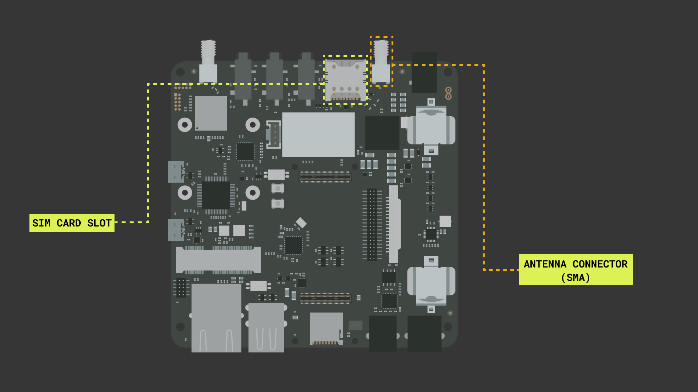

## Introduction 

The Portenta Max carrier adds a lot of functionality to the Portenta H7. With the Portenta Max Carrier it is possible to use NB IoT and Cat M1 technology. In this tutorial we will show to connect to GSM with the Portenta Max carrier and the Portenta H7.

***Note: This tutorial was created in Sweden, and as a result, the available networks are only Swedish network operators. The results will vary depending on what location you are in.***

## Goals

The goals of this project are:

- Learn how to connect the board and the carrier.
- Connect to the GSM network with Cat-M1 or NBIoT.
- Print HTML content in the Serial Monitor.

## Hardware & Software Needed

- Arduino IDE ([online](https://create.arduino.cc/) or [offline](https://www.arduino.cc/en/main/software)).
- [Portenta H7](https://store.arduino.cc/products/portenta-h7)
- Antenna with GSM 850 / 900 / 1800 / 1900 MHz range and the ability to connect via SMA
- [Portenta Max carrier](https://store.arduino.cc/products/portenta-max-carrier)

## Instructions

### Circuit

For this tutorial we need to plug the Portenta H7 into the Max Carrier, like shown in the image below.

And we also need to insert a SIM card and connect an antenna to the Max Carrier, like shown in the image below.

### Arduino IDE

Make sure you have the latest **Portenta mbed os Core** installed. Found in **Tools > Board: > boards manager...**.

We will also be using an example sketch from the **MKRNB** library, make sure this library is installed. It can be found inside the **Library manager** in the Arduino IDE.

### Switching between NB IoT and Cat M1

If you prefer to use one communication technology over the other, then this can be changed with the simple use of one sketch. Open the **ChoseRadioAccessTechnology** sketch located in the libraries examples. When this sketch is uploaded open the serial monitor. You will now get options for what technology you prefer to use in the serial monitor. Follow the steps and wait for the sketch to say that it is finished. The board will now use the prefered technology and we can move on to upload other sketches.

[Serial monitor for sketch]()

### Programming the Board

Now open the sketch from examples **NBWebClient**. This sketch will connect the Portenta and Max carrier to a website and print its content in the serial monitor.

First go to the **arduino_secrets.h** tab and enter your PIN code into the **Secret_pinnumber** variable.

The **char server[]** variable will decide what website the board will connect to and print in the serial monitor. Feel free to try different sites and see the difference in the result. In this tutorial we will use the default **example.org**.

The sketch will also set the port it uses for connecting with **int port = 80;**. This is the default connection port, but if the connection is not being established. Or if you know the specific port you want to connect to, then change this variable to a more appropriate value.

### Result of Sketch

When the sketch is uploaded open the serial monitor to see the result. You will also get error messages in the serial monitor if there is some issue along the way. When it works you should see something similar to what is shown below.

[Result in the serial monitor]()

### Troubleshoot

If the code is not working, there are some common issues we can troubleshoot:

- We have entered the wrong pin number.
- We are out of coverage (no signal). You can run the example sketch **Scan available networks** to see if there is coverage.
- SIM card may not be activated.

## Next Step

## Conclusion

In this tutorial we went through how to connect everything with the Portenta Max Carrier to be able to utilize NB IoT / Cat M1. 