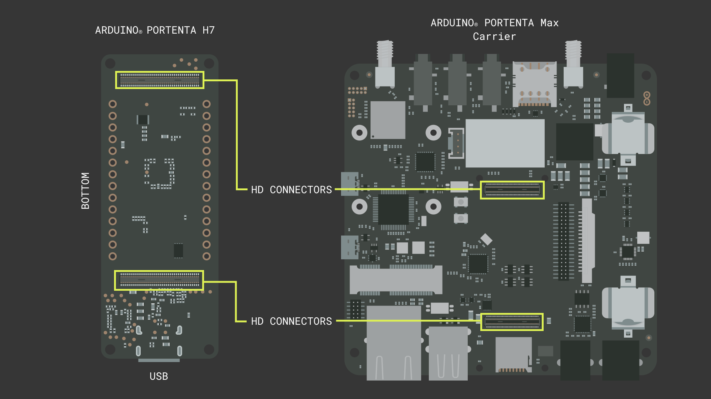
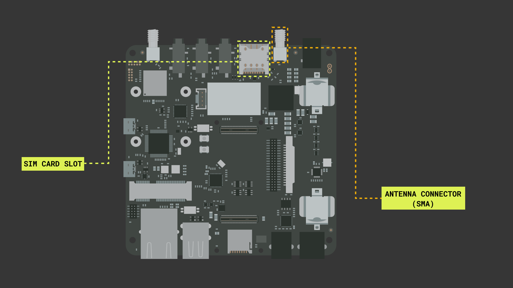
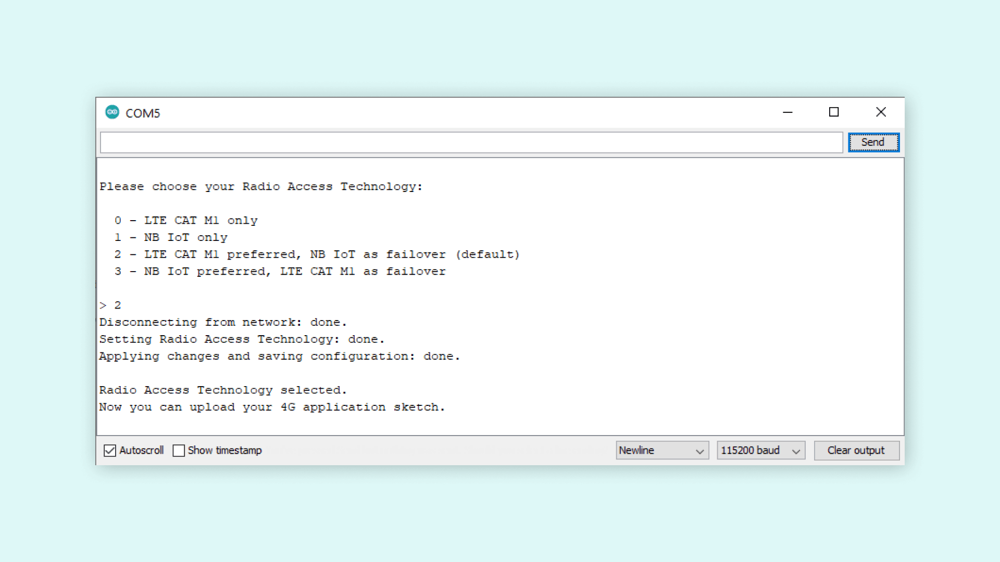
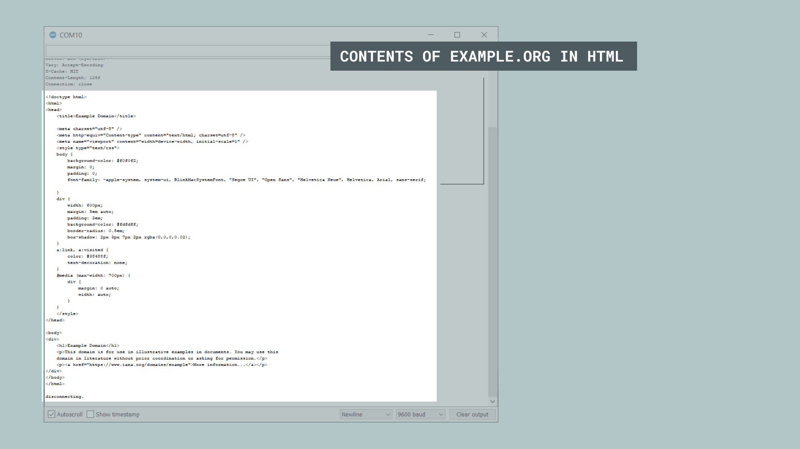

## Introduction 

The Arduino® Portenta Max Carrier adds a lot of functionality to the Portenta H7. With the Portenta Max Carrier it is possible to use NB-IoT and Cat-M1 technology. In this tutorial we will show to connect to GSM with the Portenta Max Carrier and the Portenta H7.

***Note: This tutorial was created in Sweden, and as a result, the available networks are only Swedish network operators. The results will vary depending on what location you are in.***

## Goals

The goals of this project are:

- Learn how to connect the board and the carrier.
- Connect to the GSM network with Cat-M1 or NB-IoT.
- Print HTML content in the Serial Monitor.

## Hardware & Software Needed

- Arduino IDE ([online](https://create.arduino.cc/) or [offline](https://www.arduino.cc/en/main/software)).
- [Portenta H7](https://store.arduino.cc/products/portenta-h7)
- Antenna with GSM 850 / 900 / 1800 / 1900 MHz range and the ability to connect via SMA
- DC 4.5-20V power supply with barrel jack.
- [Portenta Max carrier](https://store.arduino.cc/products/portenta-max-carrier)

## Instructions

### Circuit

For this tutorial we need to plug the Portenta H7 into the Max Carrier, like shown in the image below. By attaching the Portenta H7 board to the HD connectors on top of the carrier, press firmly to let it snap in. Once attached, plug the Portenta H7 into your computer using a USB-C® cable.



And we also need to insert a SIM card and connect an antenna to the Max Carrier, like shown in the image below. Put the SIM card into the SIM card slot at the top of the carrier, the same side where the Portenta H7 is located. Next to the SIM card slot there is an antenna SMA connector where you will need to screw on your antenna. 



After everything else is connected, connect a power cable to the barrel jack. The one right next to the SMA antenna connector.

### Arduino IDE

In the Arduino IDE, make sure you have the latest **Portenta mbed os Core** installed. Found in **Tools > Board: > boards manager...**.

We will also need two libraries to be installed, **MKRNB** and **arduino_bq24195**. You can find these in the **Library manager** in the Arduino IDE. We will be using example sketches from the **MKRNB** library. The **arduino_bq24195** library allows us to control and configuration the BQ24195 PMIC used on the Portenta Max Carrier.

### NB-IoT or Cat-M1

NB-IoT is a radio technology deployed over mobile networks which is especially suited for indoor coverage, low cost, long battery life, and large number of devices. While Cat-M1 supports downlink and uplink speeds up to 1 Mbps with a latency of 50 to 100 ms and can be used for realtime-communication. Cat-M1 is ideal if you are interested in tracking things such as logistics and transportation. Make sure the technology that you choose is supported by your service provider.

### Switching Between NB-IoT and Cat-M1

If you prefer to use one communication technology over the other, then this can be changed with the simple use of one sketch. Open the **ChoseRadioAccessTechnology** sketch located in the **MKRNB** examples. When this sketch is uploaded, open the serial monitor. You will now get options for what technology you prefer to use in the serial monitor. Follow the steps and wait for the sketch to say that it is finished. The board will now use the preferred technology and we can move on to upload other sketches.



### Programming the Board

Now open the **NBWebClient** example, this is located inside the **MKRNB**. The full sketch will also be included later in this tutorial. This sketch will connect the our setup to a website and print its content in the serial monitor.

This sketch uses a secret.h file to store sensitive information, like the PIN code for the SIM card. First we need to go to the **arduino_secrets.h** tab and enter our PIN code into the **Secret_pinnumber** variable.

The **char server[]** variable will decide what website the setup will connect to and print in the serial monitor. Feel free to try different sites and see the difference in the result. In this tutorial we will use the default **example.org**.

The sketch will also set the port it uses for connecting with **int port = 80;**. This is the default connection port. If the connection is not being established or if you know the specific port you want to connect to, then change this variable to a more appropriate value.

### Result of Sketch

When the sketch is uploaded, open the serial monitor to see the result. You will get error messages in the serial monitor if there is some issue along the way. When it works you should see something similar to what is shown below.



### Full Sketch

```cpp

// libraries
#include <MKRNB.h>

#include "arduino_secrets.h"
// Please enter your sensitive data in the Secret tab or arduino_secrets.h
// PIN Number
const char PINNUMBER[]     = SECRET_PINNUMBER;

// initialize the library instance
NBClient client;
GPRS gprs;
NB nbAccess;

// URL, path and port (for example: example.org)
char server[] = "example.org";
char path[] = "/";
int port = 80; // port 80 is the default for HTTP

void setup() {
  // initialize serial communications and wait for port to open:
  Serial.begin(9600);
  while (!Serial) {
    ; // wait for serial port to connect. Needed for native USB port only
  }

  Serial.println("Starting Arduino web client.");
  // connection state
  boolean connected = false;

  // After starting the modem with NB.begin()
  // attach to the GPRS network with the APN, login and password
  while (!connected) {
    if ((nbAccess.begin(PINNUMBER) == NB_READY) &&
        (gprs.attachGPRS() == GPRS_READY)) {
      connected = true;
    } else {
      Serial.println("Not connected");
      delay(1000);
    }
  }

  Serial.println("connecting...");

  // if you get a connection, report back via serial:
  if (client.connect(server, port)) {
    Serial.println("connected");
    // Make a HTTP request:
    client.print("GET ");
    client.print(path);
    client.println(" HTTP/1.1");
    client.print("Host: ");
    client.println(server);
    client.println("Connection: close");
    client.println();
  } else {
    // if you didn't get a connection to the server:
    Serial.println("connection failed");
  }
}

void loop() {
  // if there are incoming bytes available
  // from the server, read them and print them:
  if (client.available()) {
    Serial.print((char)client.read());
  }

  // if the server's disconnected, stop the client:
  if (!client.available() && !client.connected()) {
    Serial.println();
    Serial.println("disconnecting.");
    client.stop();

    // do nothing forevermore:
    for (;;)
      ;
  }
}
```

### Troubleshoot

If the code is not working, there are some common issues we can troubleshoot:

- We have entered the wrong pin number.
- We are out of coverage (no signal). You can run the example sketch **Scan available networks** to see if there is coverage.
- SIM card may not be activated.

## Next Step

- The Portenta Max Carrier offers a lot of features when used with the Portenta H7. If you want to learn more about the Portenta Max Carriers peripherals and features, check out our [Getting Started guide for Max Carrier and Portenta H7](/tutorials/portenta-h7/setting-up-portenta).

- If you are interested in trying out more of the Max Carriers connectivity options. Be sure to check out our tutorial on how to use [LoRa® with the Max Carrier and Portenta H7](/tutorials/portenta-max-carrier/connecting-to-ttn).

## Conclusion

In this tutorial we went through how to connect the Portenta H7 and Portenta Max Carrier, with peripherals to be able to use the carriers GSM feature. We then learned how to set a preference between NB-IoT or Cat-M1 technology. And at the end we tested so everything works by running an example sketch on our setup.
