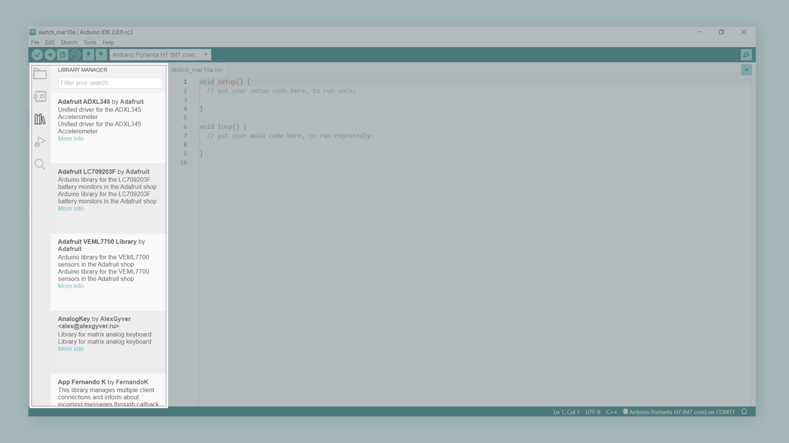
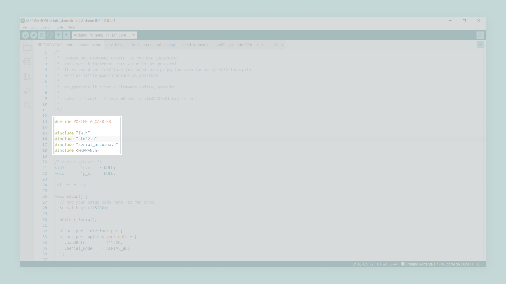

## Overview

This tutorial explains how to connect your Arduino® Max Carrier, with an [Arduino® Portena H7](https://store.arduino.cc/products/portenta-h7), to The Things Network (TTN) using its LoRaWAN® connectivity feature. The article will focus on achieving communication between the Max Carrier and an application on TTN.

## Goals

* Enable LoRaWAN® connectivity on the Arduino® Portenta Max Carrier.
* Establish a connection between the Arduino® Portenta Max Carrier and TTN.


### Required Hardware and Software

- [Arduino® Portena H7](https://store.arduino.cc/products/portenta-h7).
- Arduino® Portenta Max Carrier.
- 868-915 MHz antenna with SMA connector.
- USB-C cable (either USB-A to USB-C or USB-C to USB-C).
- [Arduino IDE 2.0](https://www.arduino.cc/en/software). 
- [MKRWAN library](https://github.com/arduino-libraries/MKRWAN).  
- An active account in [TTN](https://www.thethingsnetwork.org/).

## The Arduino® Portenta Max Carrier LoRaWAN® Connectivity Feature

The Arduino® Portenta Max Carrier provides you with an unlimited range of applications, from robotics and medical devices to industrial or automotive applications; the Max Carrier possibilities are endless. One feature that boosts Portenta's Max Carrier possibilities is its onboard LoRaWAN® communications module, the [CMWX1ZZABZ-078](https://www.murata.com/products/connectivitymodule/lpwa/overview/lineup/type-abz-078) from Murata®. LoRaWAN® is a Low Power Wide Area Network (LPWAN) designed to connect low power devices to the Internet. It was developed to meet and fulfill Internet of Things (IoT) devices' requirements, such as low-power consumption and low data throughput. 


***For more in-depth information about LoRa® and LoRaWAN®, please read [The Arduino Guide to LoRa® and LoRaWAN®](https://docs.arduino.cc/learn/communication/lorawan-101).***

## Connecting to TTN

Let's start sending data to TTN using the Portenta Max Carrier LoRaWAN® module. As stated before, to do this, you will need a TTN account and to be in the range of a public TTN gateway. You can check the [world map](https://www.thethingsnetwork.org/map) of public gateways connected to TTN and see if your region already has a gateway installed. If not, consider installing one!

To connect your Portenta Max Carrier to TTN, we must follow these steps:

1. Hardware setup.
2. Software setup.
3. Arduino® Portenta Max Carrier provisioning. 
4. Create an application in TTN.
5. Send a message to a TTN application.

Let's start!


### 1. Setting up the Hardware 

Begin by attaching the Arduino® Portenta H7 board to the high-density connectors of the Arduino® Portenta Max Carrier, as shown in the image below:


To power the CMWX1ZZABZ-078 LoRaWAN® module of the Portenta Max Carrier, you can use the **DC power jack** (with a 4.5V to 36V external DC power supply) of the Portenta Max Carrier or a **18650 3.7V Li-Ion battery**, connected to the Portenta Max Carrier battery clips; you can power the module also directly from the USB-C connector of the Portenta H7 board. **Also, do not forget to attach a LoRa® antenna to the SMA connector (J9) in the Max Carrier**.


***Using the LoRaWAN® module of the Portenta Max Carrier without an antenna may damage it. Please, do not forget to connect a suitable antenna to the dedicated SMA connector (J9) on the Max Carrier board.***

Now you can connect the Portenta H7 board to your computer using a USB-C cable. **Don't forget to change the position of the BOOT DIP switch** (SW1), **from BOOT SEL to BOO**T; otherwise, you are not going to be able to program your Portenta H7 board when attached to the Max Carrier.


### 2. Setting up the Software

You can use several Arduino libraries with the CMWX1ZZABZ-078 LoRaWAN® module from Murata®; we recommend the [MKRWAN library](https://github.com/arduino-libraries/MKRWAN), developed by the Arduino Team. The MKRWAN library provides you the APIs to communicate with LoRa® and LoRaWAN networks® using the CMWX1ZZABZ-078 module. You can use this library in the Arduino IDE, both [online](https://create.arduino.cc/editor) and [offline](https://www.arduino.cc/en/software). 

 If you are using the online IDE, you don't need to do anything; the library is already installed and ready to be used. If you are using the offline IDE, you must install the library **manually**. Installing the library can be done quickly by navigating to **Tools > Manage Libraries...** and then in the **Library Manager** search for **MKRWAN** library by Arduino; remember to install the latest version of the libraries. You can also access the Library Manager using the left toolbar of the IDE, as shown in the image below:

 

***Currently, there are two versions of the MKRWAN library. We recommend using the MKRWAN_v1 library since MKRWAN_v2 library is still in beta.***

To use the MKRWAN library with the Portenta Max Carrier, you must define `PORTENTA_CARRIER` before the library inclusion, as shown below:

```arduino
#define PORTENTA_CARRIER
#include <MKRWAN.h>
```

#### 2.1 Updating the LoRaWAN® Module Firmware

The LoRaWAN® module firmware of the Portenta Max Carrier **must be updated** before its first use. This can be done using the example sketch `MKRWANFWUpdate_standalone` of the MKRWAN library. You can open this example by navigating to **Files > Examples MKRWAN**; before uploading the sketch into the Portenta H7 board, open the `MKRWANFWUpdate_standalone.ino` file and define `PORTENTA_CARRIER` before the library inclusion, as shown in the image below:



Upload the sketch, open the Serial Monitor and wait for the firmware update to finish. You should see a confirmation message when the process is done as shown in the image below: 


### 3. Provisioning the Arduino® Portenta Max Carrier

Device provisioning is a process comparable to bank card numbering. Let's think about bank cards; bank cards numbers start with a six-digit vendor ID number that indicates who allocated and controls the card's security; the remaining digits are unique numbers associated with a specific card. Devices with LoRa® and LoRaWAN® capabilities have a similar system; the Join Server Unique Identifier (usually referred to as `JoinEUI`) is a number that manages the security and authorizes the device in a network, while the **Device Unique Identifier** (usually referred to as `DevEUI`) is a unique number that identifies the device. The `JoinEUI` and `DevEUI` numbers, are required to send information to TTN; the `JoinEUI` number is provided by the network (in this case TTN) while the `DevEUI` is provided by the manufacturer of the device's LoRa® module. 

The following sketch let's you find out what is the `DevEUI` of your Portenta Max Carrier: 

```arduino
#define PORTENTA_CARRIER
#include <MKRWAN.h>

_lora_band region = US915;

LoRaModem modem(Serial1);

void setup() {
  Serial.begin(115200);
  while(!Serial1);

  if(!modem.begin(region)) {
    Serial.println("Failed to start the module...");
    while(1) {}
  }

  Serial.print("Your Portenta Max Carrier DevEUI is: ");V
  Serial.println(modem.deviceEUI());  
}

void loop() {
}
```

The only line you may need to change before uploading the code is the one that sets the frequency:

```arduino
_lora_band region = US915;
```

Set the frequency designator according to your country if needed. You can find more information about frequency plans definitions used in TTN [here](https://www.thethingsnetwork.org/docs/lorawan/frequency-plans/). After you upload the sketch into your Portenta H7 board, you should see the Portenta Max Carrier `DevEUI` in the Serial Monitor as shown below:

Now, let's use the `DevEUI` number from your Portenta Max Carrier to create an application in TTN. 

### 3. Creating an Application in TTN

To send information to TTN, first we need to create an application and register a device with it. Navigate to TTN portal and sign in; after signing in, clik on **Create an application**. If you already created an aplication, clik on **Go to applications**.

Now click in **Create an application**. You will need to add the following information:

* **Owner**: the person or organization that owns the application.
* **Application ID**: a unique identifier for your application (must be lowercase and without spaces).

Complete both fields and click on **Create application**. Now you will be redirected to the application dashboard that shows information of the newly created application. Now, scroll to **End devices** in the left toolbar and then click on **Add end device**; a registration page for end devices will open.

On the registration page click on **Manually**, now you will have to add the following information for your Portenta Max Carrier:

* **Frequency plan**: choose a region according to your country.
* **LoRaWAN version**: 1.0.2.
* **Regional Parameters version**: 1.0.2.
* **Activation mode**: Over the air activation (OTAA).
* **DevEUI**: fill it with the `DevEUI` number of your Portenta Max Carier. 
* **AppEUI**: fill it with zeros or enter your own.
* **AppKey**: generate one or enter your own.
* **Device ID**: must be lowercase and without spaces. 

Click on **Register end device**, this will take you to a Device Overview page where you will see all the information related to the device. We are going to use some of this information with your Portenta Max Carrier. 

### 4. Sending a Message to an Application in TTN 

## Conclusion

### Next Steps

## Troubleshooting

