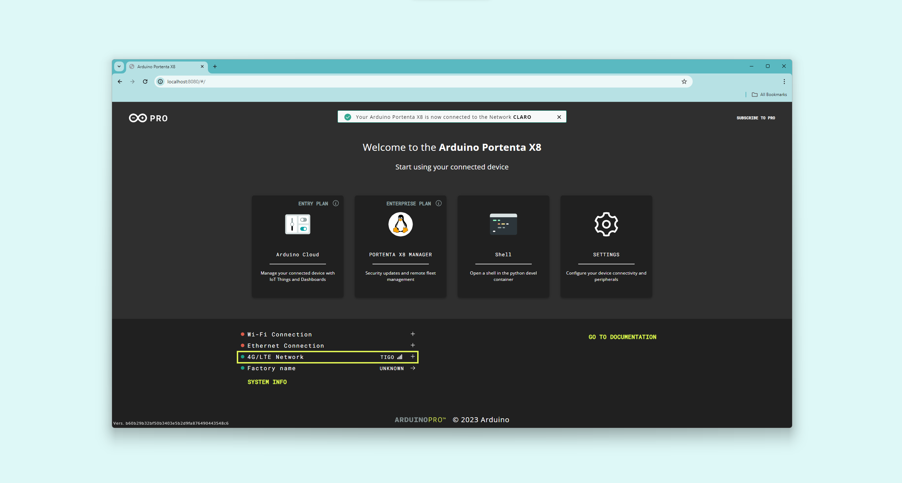
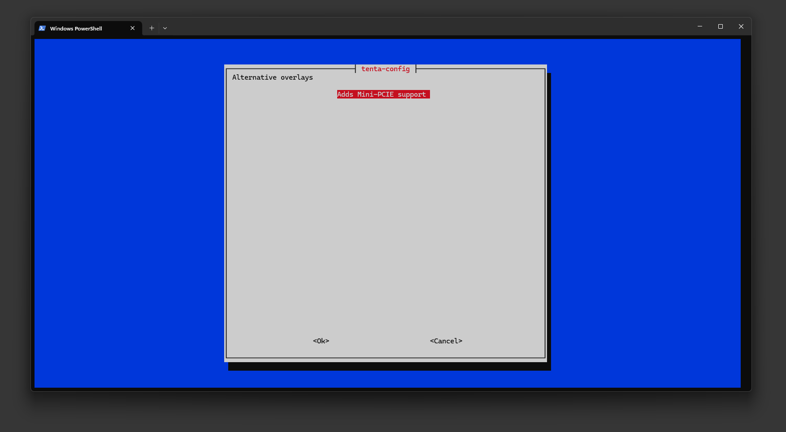
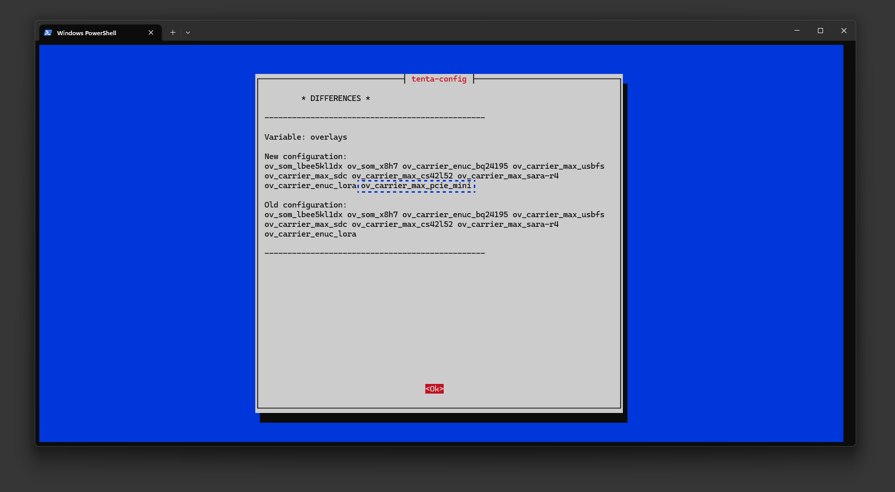

## Overview

This tutorial will guide you about the **Mini PCI Express (Mini PCIe) interface of the Portenta Max Carrier**. We will explore the onboard Mini PCIe slot and show you how to set up and configure this interface using the Portenta X8, ensuring you can fully leverage the capabilities of your device.


The hands-on part of this tutorial will walk you through performing a speed test with the **Arduino Pro 4G Module**, a Cat.4 modem mini PCIe card compatible with the Portenta Max Carrier. This test aims to provide valuable insights into the functionality and efficiency of the Portenta Max Carrier and the Pro 4G Module while demonstrating its combination's practical application and network performance potential.

## Goals

* Learn about the onboard Mini PCI Express interface on the Portenta Max Carrier.
* Learn to set up and configure the Mini PCIe interface on the Portenta Max Carrier using the Portenta X8.
* Implement a speed test using a Pro 4G Module, the Portenta Max Carrier, and the Portenta X8.

## Hardware and Software Requirements

### Hardware Requirements

* [Portenta Max Carrier](https://store.arduino.cc/products/portenta-max-carrier) (x1)
* [Portenta X8](https://store.arduino.cc/products/portenta-x8) (x1)
* Pro 4G Module (GNSS Module Global / EMEA) (x1)

The following accessories are needed:

- USB-C® cable (either USB-C® to USB-A or USB-C® to USB-C®) (x1)
- Wi-Fi® Access Point or Ethernet with Internet access (x1)
- Power cables: Wires with a cross-sectional area ranging from 0.82 mm² to 1.3 mm², corresponding to AWG sizes 18 to 16

### Software Requirements

To get your Portenta X8 ready for use with the Portenta Max Carrier, ensure it runs the most recent version of Linux. The steps to check and update your device are in [this section of Portenta X8's user manual](https://docs.arduino.cc/tutorials/portenta-x8/user-manual/#set-flashing-mode-with-carrier).

***Your Portenta X8 should be on Linux __image version 746 or newer__ to ensure everything works smoothly. To update your board to the latest image, use the [__Portenta X8 Out-of-the-box__](https://docs.arduino.cc/tutorials/portenta-x8/user-manual#out-of-the-box-experience) method or [manually flash it](https://docs.arduino.cc/tutorials/portenta-x8/user-manual#update-using-uuu-tool), downloading the most recent version from this [link](https://downloads.arduino.cc/portentax8image/image-latest.tar.gz).***

### Setting Up the Hardware

For this tutorial, you will need to connect an **external 6.0 to 36.0 V power supply to the Portenta Max Carrier's Power Jack**. This ensures the carrier, the System on Module (SOM), and any PCIe modules connected are sufficiently powered.

To ensure the power demands are met, especially for the PMIC modules' external power, we recommend using cables that conform to the appropriate electrical standards, such as ASTM B 258 standard and can carry currents up to 2.0 A. __Cables with a cross-sectional area ranging from 0.82 mm² to 1.3 mm², corresponding to AWG 18-16, should be adequate to manage 2.0 A of current.__ 

***It is advised to use a __6.0 - 36.0 V external power source__ when using modules like the Arduino Pro 4G Module (EMEA / GNSS Global) or other mPCIe modules, to ensure a stable power supply for both the SOM and the carrier during prolonged usage.***

The following image provides the position of the Power Jack on the Portenta Max Carrier:


## Mini PCI Express

**Mini PCIe**, short for Mini Peripheral Component Interconnect Express, is a smaller version of the PCIe interface mainly used in laptops and small devices to add features such as Wi-Fi®, Bluetooth®, and cellular connectivity.

These cards are significantly smaller than standard PCIe cards, typically measuring around 30 mm x 50.95 mm, and are designed to fit into the limited spaces of compact systems. They connect to a motherboard via a dedicated Mini PCIe slot, supporting PCIe and USB 2.0 interfaces. They are available in full-size and half-size variants.

## Mini PCIe & Portenta Max Carrier

The Portenta Max Carrier features a mini PCI Express card slot designed for use with female connectors. This slot is positioned at a right angle, and the board comes equipped with two detachable supports to ease the addition of external modules. Additionally, the Max Carrier is compatible with two sizes of Mini PCIe cards. For use with SIM cards, pins 8, 10, 12, and 14 are specifically set aside.


In its portfolio, Arduino has two mini PCIe modules compatible with Portenta Max Carrier, the **Arduino Pro 4G Module**, a Cat.4 modem mini PCIe card available in two variants: **EMEA** and **GNSS Global**.


The onboard Mini PCIe slot of the Portenta Max Carrier has the following pin layout characteristic:

| **Pin Number** | **Silkscreen Pin** |  **Power Net**  | **Portenta Standard Pin** |                        **High-Density Pin**                         |                  **Pin Detail**                   |
|:--------------:|:------------------:|:---------------:|:-------------------------:|:-------------------------------------------------------------------:|:-------------------------------------------------:|
|       2        |        N/A         | +3V3 PCIE (Out) |                           |                                                                     | From PCIE dedicated high current 3V3 power supply |
|       4        |        N/A         |     Ground      |            GND            | J1-22, J1-31, J1-42, J1-47, J1-54 J2-24, J2-33, J2-44, J2-57, J2-70 |                                                   |
|       7        |        N/A         |                 |           PWM_9           |                                J2-68                                |                    PCIE_CLKREQ                    |
|       8        |        N/A         |                 |                           |                                                                     |                      UIM_PWR                      |
|       9        |        N/A         |     Ground      |            GND            | J1-22, J1-31, J1-42, J1-47, J1-54 J2-24, J2-33, J2-44, J2-57, J2-70 |                                                   |
|       10       |        N/A         |                 |                           |                                                                     |                     UIM_DATA                      |
|       11       |        N/A         |                 |         PCIE_CK_N         |                                J2-19                                |                                                   |
|       12       |        N/A         |                 |                           |                                                                     |                      UIM_CLK                      |
|       13       |        N/A         |                 |         PCIE_CK_P         |                                J2-17                                |                                                   |
|       14       |        N/A         |                 |                           |                                                                     |                      UIM_RST                      |
|       15       |        N/A         |     Ground      |            GND            | J1-22, J1-31, J1-42, J1-47, J1-54 J2-24, J2-33, J2-44, J2-57, J2-70 |                                                   |
|       18       |        N/A         |     Ground      |            GND            | J1-22, J1-31, J1-42, J1-47, J1-54 J2-24, J2-33, J2-44, J2-57, J2-70 |                                                   |
|       20       |        N/A         |                 |         ANALOG_A1         |                                J2-75                                |                     W_DISABLE                     |
|       21       |        N/A         |     Ground      |            GND            | J1-22, J1-31, J1-42, J1-47, J1-54 J2-24, J2-33, J2-44, J2-57, J2-70 |                                                   |
|       22       |        N/A         |                 |         PCIE_RST          |                                J2-21                                |                                                   |
|       23       |        N/A         |                 |         PCIE_RX_N         |                                J2-15                                |                                                   |
|       24       |        N/A         | +3V3 PCIE (Out) |                           |                                                                     | From PCIE dedicated high current 3V3 power supply |
|       25       |        N/A         |                 |         PCIE_RX_P         |                                J2-13                                |                                                   |
|       26       |        N/A         |     Ground      |            GND            | J1-22, J1-31, J1-42, J1-47, J1-54 J2-24, J2-33, J2-44, J2-57, J2-70 |                                                   |
|       27       |        N/A         |     Ground      |            GND            | J1-22, J1-31, J1-42, J1-47, J1-54 J2-24, J2-33, J2-44, J2-57, J2-70 |                                                   |
|       29       |        N/A         |     Ground      |            GND            | J1-22, J1-31, J1-42, J1-47, J1-54 J2-24, J2-33, J2-44, J2-57, J2-70 |                                                   |
|       31       |        N/A         |                 |         PCIE_TX_N         |                                J2-11                                |                                                   |
|       33       |        N/A         |                 |         PCIE_TX_P         |                                J2-9                                 |                                                   |
|       34       |        N/A         |     Ground      |            GND            | J1-22, J1-31, J1-42, J1-47, J1-54 J2-24, J2-33, J2-44, J2-57, J2-70 |                                                   |
|       35       |        N/A         |     Ground      |            GND            | J1-22, J1-31, J1-42, J1-47, J1-54 J2-24, J2-33, J2-44, J2-57, J2-70 |                                                   |
|       36       |        N/A         |                 |          USB_D_N          |                                                                     |                 USB3_N (USB HUB)                  |
|       37       |        N/A         |     Ground      |            GND            | J1-22, J1-31, J1-42, J1-47, J1-54 J2-24, J2-33, J2-44, J2-57, J2-70 |                                                   |
|       38       |        N/A         |                 |          USB_D_P          |                                J1-26                                |                 USB3_P (USB HUB)                  |
|       39       |        N/A         | +3V3 PCIE (Out) |                           |                                                                     | From PCIE dedicated high current 3V3 power supply |
|       40       |        N/A         |     Ground      |            GND            | J1-22, J1-31, J1-42, J1-47, J1-54 J2-24, J2-33, J2-44, J2-57, J2-70 |                                                   |
|       41       |        N/A         | +3V3 PCIE (Out) |                           |                                                                     | From PCIE dedicated high current 3V3 power supply |
|       43       |        N/A         |     Ground      |            GND            | J1-22, J1-31, J1-42, J1-47, J1-54 J2-24, J2-33, J2-44, J2-57, J2-70 |                                                   |
|       50       |        N/A         |     Ground      |            GND            | J1-22, J1-31, J1-42, J1-47, J1-54 J2-24, J2-33, J2-44, J2-57, J2-70 |                                                   |
|       52       |        N/A         | +3V3 PCIE (Out) |                           |                                                                     | From PCIE dedicated high current 3V3 power supply |

The [full pinout document of the Portenta Max Carrier](https://docs.arduino.cc/resources/pinouts/ABX00043-full-pinout.pdf) can also provide a graphical representation of the mini PCIe interface pinout layout. The following image represents the dedicated page from the complete pinout documentation: 


### Mini PCIe Power Distribution

To address the power demands and ensure reliable connections, using jumper cables that comply with appropriate electrical standards, such as ASTM B 258 standard, and can support up to 2A of current is advisable. **Jumper cables with a cross-sectional area ranging from 0.82 mm² to 1.3 mm², roughly equivalent to AWG 18-16, should be sufficient for 2.0 A of current.**

Such a precaution is key to preventing wire overheating and guaranteeing stable power supply to Mini PCIe-compatible devices, like Cat.4 modems. An essential setup for activating the mini PCIe interface with the Portenta Max Carrier involves:

- Powering the **PCIE ENABLE (PWM6)** pin with 3.3 V
- Correctly installing a mini PCIe module, such as a Pro 4G GNSS Module Global or a Pro 4G EMEA Module

***Using an external power source of 6.0 to 36.0 V is important when working with an Arduino Pro 4G Module (EMEA / GNSS Global) or any other mPCIe modules because of their high power consumption. This ensures a continuous and stable power feed to the Portenta SOM, the carrier, and the involved mPCIe module, especially during extended use.***


## Pro 4G Module - Cat.4 Modem

The **Cat.4 modem**, compatible with [mPCIe interfaces](#mini-pcie--portenta-max-carrier), leverages LTE (Long Term Evolution) standards to provide high-speed data transmission across various electronic devices.

These modems offer substantial data speeds, reaching up to 150 Mbps for downloads and 50 Mbps for uploads, making them ideal for a range of internet activities like streaming high-definition content and quick transfers of large files.

Designed with the mPCIe form factor, Cat.4 modems fit snugly in compact electronics such as laptops, tablets, and IoT devices. They also support older 3G and 2G networks, ensuring wide network coverage.

The Portenta Max Carrier uses this modem through its built-in mini PCIe interface. It ensures dependable 4G connectivity while supporting 3G and 2G networks. The **Arduino Pro 4G Module (EMEA / GNSS Global)**, a Cat.4 modem in a mini PCIe format that follows the PCI Express Mini Card 1.2 Standard Interface, is a key feature in this configuration.

Below is an image of the **Arduino Pro 4G Module**:


This module has two versions: **EMEA** and **Global (including the US)**. It can be used with various Portenta boards to help develop expansive smart city/building projects and to support remote maintenance and fleet management.


## Instructions

### Accessing Mini PCIe Interface

You can check if the mini PCIe module is properly installed and detected by the Portenta X8 by using the Portenta Max Carrier. Since the mini PCIe lanes on the Portenta Max Carrier include USB lines, and the Pro 4G Module functions as a USB device, you will use a different approach to confirm its setup.

To ensure the Pro 4G Module is powered up and recognized by the Portenta X8 along with the Portenta Max Carrier, use the following command instead of the `lspci` command:

```bash
lsusb
```

This command lists the devices recognized by the Portenta X8. If the Pro 4G Module is correctly detected, you will see results similar to the ones shown in the following image.


### Setting Up Via Out-Of-The-Box Experience

Setting up the modem is easy with the Out-Of-The-Box process on the Portenta X8 paired with the Portenta Max Carrier.

Please ensure the mini PCIe power configuration is set as outlined in the [Mini PCIe Power Distribution section](#mini-pcie-power-distribution). The Portenta X8 requires the **PCIE ENABLE (PWM6)** pin to be connected to a **VCC (3V3)** pin.

***Please use a 6.0 - 36.0 V external power source when using an Arduino Pro 4G Module (EMEA / GNSS Global) or any other mPCIe modules due to their high power consumption. This is important for maintaining a stable power supply to the Portenta SOM, the carrier, and the involved mPCIe module, particularly for extended periods of use.***

***If you are new to the Out-Of-The-Box experience of the Portenta X8, we recommend reviewing the [Out-Of-The-Box Experience section of the Portenta X8 User Manual](https://docs.arduino.cc/tutorials/portenta-x8/user-manual/#out-of-the-box-experience) for a better understanding before you continue.***

Proceed to the Out-Of-The-Box dashboard on the Portenta X8.


In this dashboard, you will find the **Settings** option. Please click on this option to proceed to the next step.


In the **Settings**, choose the **LTE/4G Sim** option to start configuring the modem.


For the **LTE/4G Sim** settings, youll need to provide:

- **APN**
- **PIN** (if available)

You will also need to choose an **Authentication Protocol**, either:

- **PAP/CHAP**
- **NONE**

PAP (Password Authentication Protocol) sends passwords as clear text, suitable for low-security or legacy environments. At the same time, CHAP (Challenge-Handshake Authentication Protocol) offers enhanced security through a three-step verification process and encrypted passwords, providing better protection than PAP.

Enter these details based on your SIM card's requirements. Once done, the **4G/LTE Network** connection status will be displayed at the bottom left of the Out-Of-The-Box dashboard.



A brief notification will confirm the successful network connection by the Portenta X8 if a network is available. You can view more details about the connection by selecting **SYSTEM INFO**.


You have successfully connected the Portenta X8 to a 4G/LTE network via the Portenta Max Carrier and the Pro 4G Module.

### Setting Up Using Linux Environment

The Pro 4G Module can be managed via ADB shell on the Portenta X8's Linux environment.

Please ensure the mini PCIe power configuration is set as outlined in the [Mini PCIe Power Distribution section](#mini-pcie-power-distribution). The Portenta X8 requires the **PCIE ENABLE (PWM6)** pin to be connected to a **VCC (3V3)** pin.

***Please use a 6.0 - 36.0 V external power source when using an Arduino Pro 4G Module (EMEA / GNSS Global) or any other mPCIe modules due to their high power consumption. This is important for maintaining a stable power supply to the Portenta SOM, the carrier, and the involved mPCIe module, particularly for extended periods of use.***

The image below illustrates the expected setup, showcasing the integration of the Portenta X8 and Pro 4G Module with the Portenta Max Carrier, complete with the mini PCIe setup:


Once the setup is verified, a series of commands are used to apply the necessary overlays for the Portenta X8 and the Portenta Max Carrier.

To check the existing device tree overlay configurations, which play a key role in managing hardware features and customizing the system, you can use this command:

```bash
fw_printenv overlays
```

This command uses the `fw_printenv` tool to list the overlays as per the U-Boot firmware settings. Overlays are crucial for specifying changes or additions to the device's hardware setup without modifying the original device tree structure.

This might involve enabling extra peripherals, setting up pin configurations, or turning on specific hardware functionalities, thus offering a versatile means for customizing hardware settings. Among the overlays that should be visible is:

```bash
ov_carrier_max_pcie_mini
```

If it is not present, the following steps will help you to set the needed overlays to use the mini PCIe interface on the Portenta Max Carrier. There are two ways to set up the overlay configuration for the mPCIe interface:

- Via **tenta-config** based on `tenta` framework
- Via purely ADB shell

#### Overlay Configuration Via Tenta-Config

You can apply the necessary overlays to activate mini PCIe on the Portenta Max Carrier with the Portenta X8 by using the **tenta-config** process.

Start by accessing the docker container named **x8-devel** with this command:

```bash
docker exec -it x8-devel sh
```

This command uses **docker exec** to start a new shell session inside the active **x8-devel** container. The `-it` flag creates an interactive terminal session, allowing you to perform commands directly within the container's environment. This feature is convenient for development activities, such as modifying code, tracking processes, or troubleshooting within the container's secluded environment.

Find the **tenta_runner** Python® script with the help of this command:

```bash
find / -name *.py
```

This command begins at the root directory and recursively searches for files with a `.py` extension, representing Python® scripts. This search helps find Python®-based tools, scripts, or programs throughout the system.

Once you have found **tenta_runner.py**, move to its directory with this command:

```bash
cd /root/examples/tenta-config
```

Run the **tenta_runner.py** script using the following command:

```bash
python tenta_runner.py
```

The script will activate a user interface within the `tenta` framework. Once the **tenta-config** window appears, please choose **Portenta Max Carrier**.


It will then show a list of available options that can be executed within the Portenta Max Carrier platform. Here, the **Enable alternative overlays** option will be selected.


It will open a new window displaying the **Adds Mini-PCIE support** option. Please select the **Adds Mini-PCIE support** option.



It will prompt a message showing a new set of overlays that will be applied once modified.



Select **Ok** to confirm, and the device will be configured with the overlays for mini PCIe support.


#### Overlay Configuration Via ADB Shell

The following commands are used to set the required overlays to add mini PCIe support on the Portenta X8 and the Portenta Max Carrier.

```bash
fw_setenv carrier_custom 1
```

```bash
fw_setenv is_on_carrier yes
```

```bash
fw_setenv carrier_name max
```

The previous commands are used to set environment variables, which we will use to set and use the needed overlays to link the mini PCIe interface under its profile. The overlays are as follows and set using the following command:

```bash
fw_setenv overlays 'ov_som_lbee5kl1dx ov_som_x8h7 ov_carrier_enuc_bq24195 ov_carrier_max_usbfs ov_carrier_max_sdc ov_carrier_max_cs42l52 ov_carrier_max_pcie_mini'
```

Once the overlays are set, please reboot the Portenta X8 to ensure the configuration has been applied correctly.

#### Connecting & Testing Network Connectivity

With the overlays configured, the setup process involves bringing down the `wwan0` interface, setting it to raw IP mode, and then bringing it back up:

```bash
ip link set dev wwan0 down
```

```bash
echo Y > /sys/class/net/wwan0/qmi/raw_ip
```

```bash
ip link set dev wwan0 up
```

Following that, use `qmicli` commands to inspect the card's status and begin a network connection:

```bash
qmicli --device=/dev/cdc-wdm0 --device-open-proxy --uim-get-card-status
```


```bash
qmicli --device=/dev/cdc-wdm0 --device-open-proxy --wds-start-network="ip-type=4,apn=iot.1nce.net" --client-no-release-cid
```


After establishing the network connection, the `udhcpc` is used to handle dynamic IP configuration:

```bash
udhcpc -q -f -n -i wwan0
```


We now have the Pro 4G Module with the Portenta X8 on the Porteta Max Carrier ready for use. To test the connection speed, perform a speed test by downloading the `speedtest-cli` script, making it executable, and running it within a Docker container:

```bash
wget -O speedtest-cli https://raw.githubusercontent.com/sivel/speedtest-cli/master/speedtest.py
```

```bash
chmod +x speedtest-cli
```

```bash
docker run python:3.8-slim-buster
```

```bash
docker run -it --mount type=bind,source="$(pwd)",target=/app python:3.8-slim-buster /bin/bash
```

```bash
/app/speedtest-cli
```

After the speed test, you might observe results similar to the following image.


***The download and upload speed may vary depending on the region.***

This setup demonstrates the integration and use of Mini PCIe cards in compact systems such as the Portenta Max Carrier, showcasing their ability to add functionalities while maintaining a small footprint.

For a more streamlined approach, you can use the following single-line command:

```bash
nmcli c add type gsm ifname cdc-wdm0 con-name wwan0 apn hologram connection.autoconnect yes
```

If your SIM card requires a PIN, adjust the command as follows:

```bash
nmcli c add type gsm ifname cdc-wdm0 con-name wwan0 apn mobile.vodafone.it gsm.pin <PIN>
```

## Conclusion
