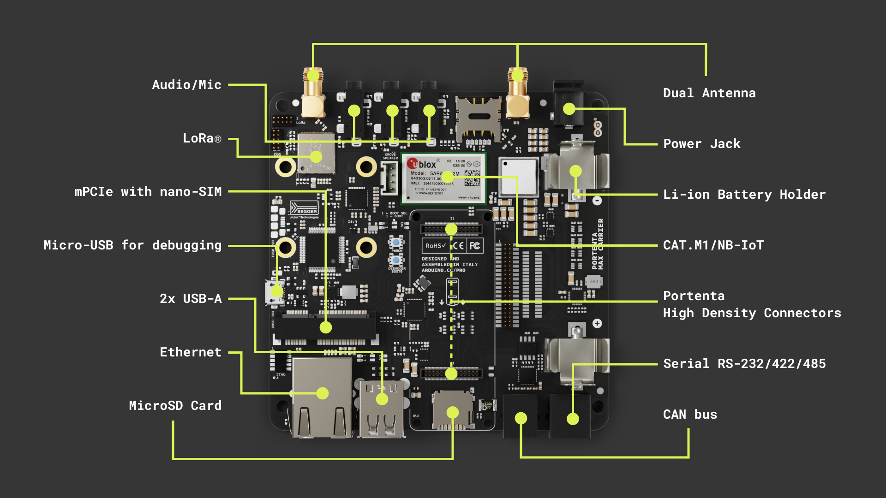

## Overview

This user manual offers a detailed guide on the Portenta Max Carrier, consolidating all its features for easy reference. It will show how to set up, adjust, and assess its main functionalities. This manual will guide as a key to proficiently operate the Portenta Max Carrier, making it suitable for project developments related to industrial automation, manufacturing automation, robotics, and prototyping.

## Hardware and Software Requirements

### Hardware Requirements

* [Portenta Max Carrier](https://store.arduino.cc/products/portenta-max-carrier) (x1)
* [Portenta X8](https://store.arduino.cc/products/portenta-x8) (x1)
* [Portenta C33](https://store.arduino.cc/products/portenta-c33) (x1)
* [Portenta H7](https://store.arduino.cc/products/portenta-h7) (x1)
* USB-C® cable (either USB-C® to USB-A or USB-C® to USB-C®) (x1)
* Wi-Fi® Access Point or Ethernet with Internet access (x1)

### Software Requirements

- [Arduino IDE 1.8.10+](https://www.arduino.cc/en/software), [Arduino IDE 2.0+](https://www.arduino.cc/en/software), or [Arduino Web Editor](https://create.arduino.cc/editor)

## Product Overview

Max Carrier transforms Portenta modules into single-board computers that enable edge AI for high-performance industrial, building automation and robotics applications.
Thanks to dedicated high-density connectors, it can be paired with Portenta X8, H7 or C33, allowing you to easily prototype and deploy your industrial projects.

This Arduino Pro carrier further augments Portenta connectivity options with Fieldbus, LoRa®, Cat-M1 and NB-IoT.
Among the many available plug-and-play connectors there are Gigabit Ethernet, USB-A, audio jacks, microSD, mini-PCIe, MIPI camera, FD-CAN and Serial RS-232/422/485.
Max Carrier can be powered via external supply (6-36V) or battery via the onboard 18650 Li-ion battery connector.

### Carrier Architecture Overview

The Portenta Hat Carrier consists of the following characteristics:

- **Compatible core**: The board is compatible with Portenta X8 (ABX00049), Portenta H7 (ABX00042/ABX00045/ABX00046), and Portenta C33 (ABX00074). The Portenta H7 and C33 are limited in camera support and the Ethernet speed to 100 Mbit.
  
- **Power management**: The board can be powered up from different sources. The onboard screw terminal block allows 7 ~ 32V CC power supply to power the Portenta board and the carrier, and 5V power supply.
  
  The USB-C interface of the Portenta X8, H7, and C33 can supply the needed power to the board. Alternatively, the 5V pin from the 40-pin male header can be used to power the board. The carrier can deliver maximum current of 1.5 A.

- **USB connectivity**: A USB-A female connector is used for data logging and the connection of external peripherals like keyboards, mice, hubs, and similar devices.
  
- **Communication**: The carrier supports Ethernet interface (X1) via RJ45 connector 1000 Base-T connected to High-Density pins (J1). If paired with Portenta H7 or C33, the maximum speed is limited to 100 Mbit Ethernet.

  The SPI (X1), I2C (x2), I2S (x1), and UART (x2) are accessible via a 40-pin male header connector. The I2C1 is already dedicated to the EEPROM memory but is accessible through a 40-pin male header connector on SCL2 and SDA2.
  
  The UARTs do not have flow control, and UART1 can be accessed via a 40-pin connector while UART2 can be accessed via a 16-pin connector. The **CAN** (x1) bus is available with an onboard transceiver. The **MIPI** camera is also available but only when the Portenta X8 is attached. Examples of compatible devices include the OmniVision OV5647 and the Sony IMX219 sensors.
  
- **Storage**: The board has a MicroSD card slot for data logging operation and bootloading operation from external memory.
  
- **Ethernet connectivity**: The carrier has Gigabit Ethernet connector (x1) on RJ45 with P/N TBC. If the carrier is paired with Portenta H7 or C33, the maximum speed is limited to 100 Mbit ethernet.
  
- **40-pin male header connector**: The connector allows for SPI (x1), I2S (x1), SAI (x1), 5V power pin (x2), 3V3 power pin (x2), I2C (x2), UART (x2), PWM pins (x7), GND (x8), and GPIO (X26). The I2C count includes the one that is dedicated to EEPROM. UARTs doest not have flow control. The GPIO pins are shared with different functionalities.
  
- **16-pin analog male header connector**: The connector allows analog I/O (x8), PWM (x2), LiCell (x1), GPIO (x1), 3V3 (x1), GND (x1), serial TX (x1), and serial RX (x1).
  
- **Screw terminal block**: The terminal block allows power supply line feed for the carrier and bus ports. It consists of VIN 7 ~ 32VDC (x1), VIN 5V (x1), CANH (x1), CANL (x1), and GND (x2).
  
- **Debug interface**: The carrier features onboard JTAG pins designated for the debug connector compatible to male headers.
  
- **PWM fan connector**: The board has onboard PWM fan connector (x1) compatible with 5V fan with PWM input for speed regulation.
  
- **DIP switch**: The carrier has a DIP switch with two position and allows different profiles depending on the paired Portenta board. The DIP switch has ETH CENTER TAP and BTSEL switches.
  
  when paired with **Portenta X8**, the ETH CENTER TAP will control 1 Gbit Ethernet capacity, while the BTSEL will make the system boot from SD Card memory if turned on or from MMC memory if selected in off position.
  
  The **Portenta H7/C33** will have the 100 Mbit Ethenet capacity controlled by ETH CENTER TAP, but BTSEL does not modify any settings.

### Carrier Topology
### Pinout
### Datasheet
### Schematics
### STEP Files
### Mechanical Information
## First Use Of Your Portenta Hat Carrier
### Stack The Carrier
### Power The Board
### Carrier Characteristics Highlight
### Using Portenta X8 with Linux
### Using Portenta X8 with Arduino
### Using Portenta H7 with Arduino
### Using Portenta C33 with Arduino
### Hello World Using Linux
### Hello World Using Arduino
## High-Density Connectors
## Network Connectivity
### Ethernet
### Wi-Fi® & Bluetooth®
### LTE CAT.M1 NB-IoT
### LoRa®
## mini PCIe
## MIPI Camera
## Audio Interface
## DIP Switch Configuration
## USB Interface
## MicroSD Storage
## CAN Bus (Onboard Transceiver)
### JTAG Pins
## Communication
### SPI
### I2C
### CAN Bus
### Serial RS-232 / RS-422 / RS-485
### UART

## Support

If you encounter any issues or have questions while working with the Portenta Max Carrier, we provide various support resources to help you find answers and solutions.

### Help Center

Explore our Help Center, which offers a comprehensive collection of articles and guides for the Portenta Max Carrier. The Arduino Help Center is designed to provide in-depth technical assistance and help you make the most of your device.

- [Portenta Max Carrier help center page](https://support.arduino.cc/hc)

### Forum

Join our community forum to connect with other Portenta Max Carrier users, share your experiences, and ask questions. The forum is an excellent place to learn from others, discuss issues, and discover new ideas and projects related to the Portenta Max Carrier.

- [Portenta Max Carrier category in the Arduino Forum](https://forum.arduino.cc/c/hardware/portenta/portenta-max-carrier/175)

### Contact Us

Please get in touch with our support team if you need personalized assistance or have questions not covered by the help and support resources described before. We're happy to help you with any issues or inquiries about the Portenta Max Carrier.

- [Contact us page](https://www.arduino.cc/pro/contact-us)