## Overview

This user manual offers a detailed guide on the Portenta Max Carrier, consolidating all its features for easy reference. It will show how to set up, adjust, and assess its main functionalities. This document will enable any user to proficiently operate the Portenta Max Carrier, making it suitable for project developments related to industrial automation, manufacturing automation, robotics, and prototyping.


## Hardware and Software Requirements

### Hardware Requirements

* [Portenta Max Carrier](https://store.arduino.cc/products/portenta-max-carrier) (x1)
* [Portenta X8](https://store.arduino.cc/products/portenta-x8) (x1)
* [Portenta C33](https://store.arduino.cc/products/portenta-c33) (x1)
* [Portenta H7](https://store.arduino.cc/products/portenta-h7) (x1)
* USB-C® cable (either USB-C® to USB-A or USB-C® to USB-C®) (x1)
* Wi-Fi® Access Point or Ethernet with Internet access (x1)
* Compatible antennas like the [Arduino Pro 4G Module Antennas Kit](https://store.arduino.cc/products/4g-module-antenna) (x1)

### Software Requirements

- [Arduino IDE 1.8.10+](https://www.arduino.cc/en/software), [Arduino IDE 2.0+](https://www.arduino.cc/en/software), or [Arduino Web Editor](https://create.arduino.cc/editor)

## Product Overview

Max Carrier transforms Portenta modules into single-board computers with edge AI capabilities for high-performance industrial, building automation and robotics applications.
Thanks to its dedicated high-density connectors, Portenta Max Carrier can be paired with Portenta X8, H7, or C33, allowing any user to easily prototype and deploy multiple industrial projects.

This Arduino Pro carrier further augments Portenta connectivity options with Fieldbus, LoRa®, Cat-M1 and NB-IoT.
Among the many available plug-and-play connectors, there are Gigabit Ethernet, USB-A, audio jacks, microSD, mini-PCIe, MIPI camera, FD-CAN, and Serial RS-232/422/485.
Max Carrier can be powered via external supply (6-36V) or battery via the onboard 18650 Li-ion battery connector.


### Carrier Architecture Overview


Here is an overview of the board's architecture's main components shown in the image above:

- **Compatible core**: The board is compatible with Portenta X8 (ABX00049), Portenta H7 (ABX00042/ABX00045/ABX00046), and Portenta C33 (ABX00074). The Portenta H7 and C33 are limited in camera support and the Ethernet speed to 100 Mbit.
  
- **Power management**: The Portenta Max Carrier can either be powered through the power jack (6 ~ 36V DC) or an 18650 Li-ion/LiPo battery (3.7V), which can be used as a backup power source if the external power supply fails. The battery is charged when the minimum input voltage to the power jack is met.

- **USB connectivity**: The Portenta Max Carrier also includes a USB 2.0 High-Speed Hub controller based on the USB2514B/M2 that manages the 2 USB devices of the USB type A connector plus the LoRa® and PCIe modules. J15 is protected by an NCP383LMUAJAATXG power switch and current limiter.

  A USB-A female connector can be used for data logging and the connection of external peripherals like keyboards, mice, hubs, and similar devices.
  
- **Ethernet connectivity**: The Gigabit Ethernet physical interface (J17) is directly connected to the high density connector to the Portenta board. The connector includes an activity LED indication (orange) and speed indication (green). __Note:__ Gigabit Ethernet functionality is only supported on the Portenta X8. Portenta H7 and Portenta C33 just support 100 Mbit Ethernet speed.

- **Serial Transceiver**: The Portenta Max Carrier includes a multi-protocol transceiver supporting RS-232, RS-485, and RS-422 serial standards (configurable) based on the SP335 IC. It is connected to a 6P6C Connector (RJ11, RJ12, RJ14, RJ25).

- **CAN Transceiver**: The Portenta Max Carrier includes a high speed CAN transceiver based on the TJA1049T/3J IC. It is connected to a 4P4C connector (RJ9, RJ10, RJ22).

- **Mini PCIe**: The Portenta Max Carrier includes one female mini PCI Express card slot. The connector is right angled and the board includes 2 removable standoffs for external module support. The Max Carrier supports two different Mini PCIe sizes. Pins 8, 10, 12 and 14 are reserved for UIM (in this case SIM).
__Note:__ USB, I2C and SIM functionality over PCIe is available only for the X8.

- **Cellular Modem**: The SARA-R412M-02B is a multi-region modem capable of connecting to 2G/Cat-M1/NB-IoT networks worldwide. A dedicated SMA connector is provided for connecting an external antenna. The chip operates over the 1V8 power line. A microSIM slot is available, the corresponding SIM card slot for the cell modem is on the top side of the board, directly adjacent to the module.

- **Audio**: The Portenta Max Carrier enables connections to analog audio channels. This is done through the low power CS42L52 stereo CODEC providing ADC/DAC between analog signals and the I2S protocol. An internal Class D amplifier eliminates the need for external audio amplification circuitry. 

- **LoRa® Module**: The Portenta Max Carrier provides long range wireless connectivity for low bandwidth applications with the onboard Murata CMWX1ZZABZ-078 LoRa® transceiver module. This module operates at 3V3. A dedicated SMA connector is provided for connecting an external antenna.

- **MIPI Camera**: The Portenta Max Carrier, when combined with a Portenta X8, supports MIPI cameras. The latter can be plugged into the onboard camera connector (J4) via a flexible flat cable. The camera support is perfect for machine/computer vision applications such as product line inspection, object detection, image classification and robotics.

- **Storage**: The board has a MicroSD card slot for data logging operation.

- **Debug interface**: Debugging capabilities are integrated directly into the Portenta Max Carrier and are accessible via micro USB. The J-link debugger is compatible with the Segger® J-Link OB and Blackmagic probes, driven by the STM32F405RGT6 controller. In addition to providing access to the Portenta board JTAG ports, different sniffer channels for I2C, CAN and UART lines are available. The debugger firmware can be updated via SWD on CN3. Additionally, headers for debugging the LoRa® are accessible via CN2 with SWD.
   
- **DIP switch**: The carrier has a DIP switch with two positions and enables different profiles depending on the paired Portenta board. See the [DIP Switches section](#dip-switch-configuration) for more details.
  

### Carrier Topology


| **Ref.** | **Description**                                        | **Ref.**       | **Description**                                           |
| -------- | ------------------------------------------------------ | -------------- | --------------------------------------------------------- |
| U1       | SARA-R412M-02B 4G LTE/Cat-M1/NB-IoT Modem IC           | U2             | CS42L52-CNZ Stereo Codec IC                               |
| U3       | USB2514Bi/M2 4-port USB 2.0 Hub IC                     | U4             | SP335EER1-L RS232/RS485/RS422 Transceiver IC              |
| U5       | TJA1049 CAN Transceiver IC                             | U6             | MPM3550EGLE Non-isolated DC-DC IC                         |
| U7       | NCP383 Current Limiting IC                             | U8,U20,U21,U22 | SN74LVC1T45 Bi-directional logic level converter IC       |
| U9       | DSC6111HI2B 12MHz MEMS Oscillator IC                   | U10            | SN74LVC1G125 Single Bus Buffer Gate IC                    |
| U11      | BQ24195RGET 4.5A Single Cell Charger IC                | U12            | AP7311 1.8V 150mA LDO Linear Regulator IC                 |
| U13      | TPS54620 6A Buck Regulator IC                          | U14            | AP2112K-3.3TRG1 3.3V 600mA LDO Regulator IC               |
| U15      | STM32F405RG 168MHz 32 bit Arm® Cortex®-M4 MCU IC         | U16-U19        | 74LVC1G157 Single 2-input multiplexer IC                  |
| U23      | CMWX1ZZABZ-078 Murrata LoRa® module                    | U24, U25       | LM73100 Ideal Diode with Reverse Polarity Protection      |
| J1, J2   | DF40HC(3.5)-80DS-0.4V(51) High Density Connectors      | J3             | Right-Angle SMA Connector for Modem                       |
| J4       | Camera 2-1734248-0 FPC Connector                              | J5             | FW-20-05-G-D-254-150 Signal Break                         |
| J6       | 615006138421 RS232/RS485 Connector                     | J7             | 615006138421 CAN Connector                                |
| J8       | 1759546-1 Mini PCIe Connector                          | J9             | Right-Angle SMA Connector for LoRa®                       |
| J10      | ZX62-AB-5PA(31) Micro USB Debugger Connector with VBUS | J11            | 114-00841-68 Micro SD Connector                           |
| J12      | SJ-3524-SMT-TR 3.5mm Headphone Out                     | J13            | SJ-3524-SMT-TR 3.5mm Line In Right                        |
| J14      | SJ-3524-SMT-TR 3.5mm Line In Left                      | J15            | 61400826021 2-port USB 2.0 Female Connector               |
| J16      | 254TR Positive Li-ion Terminal                         | J17            | TRJK7003A97NL Gigabit Ethernet Connector                  |
| J18      | 254TR Negative Li-ion Terminal                         |             |  |
| J20      | 110990030 Connector for Speaker                  | X1             | PJ-102A 5.5mm Power Jack Adapter                          |
| CN1      | FTSH-105-01-F-DV 10-pin JTAG Header                    | CN2            | Debug Header                                              |
| CN3      | LoRa® Debug Header                                     | SIM1           | 2199337-5 microSIM Card Holder (for on-board modem)       |
| SW1      | 218-2LPST Boot Select Switch                           | SW2            | 218-2LPST Switch *(2)*                                    |
| PB1      | PTS820J25KSMTRLFS Power On Button                      | PB2            | PTS820J25KSMTRLFS Reset Button                            |

### Carrier Characteristics Highlight

The Portenta Max Carrier extends the features of the Portenta X8, H7, and C33. The following table summarizes the carrier's characteristics depending on the paired Portenta.

| Function                 | Portenta H7/C33 Support | Portenta X8 Support | Notes                                            |
|--------------------------|-------------------------|---------------------|--------------------------------------------------|
| USB Host                 | USB 1.0                 | USB 2.0             | Max Speed: USB 1.0 - 12 Mbps, USB 2.0 - 480 Mbps |
| Ethernet                 | 100 Mbps                | 1 Gbps              |                                                  |
| CAN                      | Portenta C33 only       | Yes                 |                                                  |
| Mini PCIe (USB)          | USB 1.0                 | USB 2.0             | Max Speed: USB 1.0 - 12 Mbps, USB 2.0 - 480 Mbps |
| Mini PCIe (PCIe)         | No                      | PCIe 2.0            |    |
| Battery Charger          | Yes                     | Yes                 |                                                  |
| LoRa®                    | Yes                     | Yes                 |                                                  |
| NBIoT/CatM1/2G           | Yes                     | Yes                 |                                                  |
| Camera                   | No                      | MIPI up to 4 lanes  | No MIPI camera support on H7/C33                 |
| Audio                    | Limited                 | Yes                 | No firmware support for the H7                   |
| RS232/422/485            | Yes                     | Yes                 |                                                  |
| on board JTAG  debugging | Yes                     | No                  |                                                  |
| on board console to USB  | Yes                     | Yes                 |                                                  |
| on board bus sniffing    | Limited                 | Limited             | Only hardware support                            |

The table above provides a general idea of how the Portenta Max Carrier performs depending on the paired Portenta board. Each feature is explained in the following section after a quick guide covering how to properly interface the Portenta boards.

### Pinout

* 

The full __pinout__ is available and downloadable as PDF from the link below:

* [Portenta Max Carrier Full Pinout](https://docs.arduino.cc/resources/pinouts/ABX00043-full-pinout.pdf)

### Datasheet

The full __datasheet__ is available and downloadable as PDF from the link below:

* [Portenta Max Carrier Datasheet](https://docs.arduino.cc/resources/datasheets/ABX00043-datasheet.pdf)

### Schematics

The full __schematics__ are available and downloadable as PDF from the link below:

* [Portenta Max Carrier Schematics](https://docs.arduino.cc/resources/schematics/ABX00043-schematics.pdf)

### STEP Files

The full __STEP__ files are available and downloadable from the link below:

* [Portenta Max Carrier STEP files](assets/ABX00043-step.zip)

### Altium Files

The full __Altium__ files are available and downloadable from the link below:

* [Portenta Max Carrier Altium files](https://docs.arduino.cc/static/0470b68c0b66e0f16c8db927b68d13de/ABX00043-altium-files.zip)

## First Use
### Stack The Carrier

The Portenta Max Carrier design enables an easy stack of the preferred Portenta board. The following figure shows how the Portenta boards pair via the High-Density connectors.


With the Portenta mounted to the carrier, you can proceed to power the carrier and begin prototyping.

### Power The Board

The Portenta Max Carrier can be powered using the following methods:

- Using an external **6 to 36V power supply** connected to the `Power Jack` of the board.
- Using a **3.7V 18650 Li-ion battery** inserted in the on-board battery socket.
- Using a USB-C® cable connected to the Portenta core board of your choice. (This option does not power the Modem and Mini PCIe connector).


***Please ensure to connect the battery with the right polarity, not doing so may damage the board.***

## Hello World 

Let's test the Portenta Max Carrier with the classic `Hello World` example used in the Arduino ecosystem. As the Max Carrier was designed to avoid having built-in LEDs for IoT purposes, we can not use a `Blink`. Instead, we are going to leverage the Ethernet connectivity for a quick test. We will use this example to verify the board is working as expected with the different Portenta boards.

To configure the Ethernet settings, depending on the paired Portenta board, you must properly set the provided DIP switch located on the Portenta Max Carrier.

The Portenta Max Carrier incorporates two DIP switches, giving users the ability to manage the behavior of the board. The configuration parameters of these switches differ based on which Portenta board it is paired with.


For configurations when the Portenta Max Carrier is combined with the Portenta boards, the DIP switch governs these settings:

| **Ethernet DIP Switch Designation** | **Position: ON**  | **Position: OFF** |
|:-----------------------------------:|:-----------------:|:-----------------:|
|                1 - 2                | Ethernet Disabled for X8 / Enabled for H7/C33 | Ethernet Enabled for X8 / Disabled for H7/C33  |

For an in-depth understanding of the DIP switch, kindly refer to [this section](#dip-switch-configuration).

### Using Linux

For the Portenta X8, be sure the ethernet DIP switches are both set to _OFF_. Then connect the board using a __LAN cable__ to the network.

Enter to your Portenta X8 using `adb shell` and access to root (admin) by typing `sudo su -`, the password is `fio` by default.

First, you need an internet connection to download the tool. You can establish one using the following commands:

```bash
nmcli connection show  # To find the ethernet device name ("eth0" in this case)
```
If your _ethernet_ connection is up and running you should see something similar to this:


If not, you can create a DHCP network with a custom name and interface with the following commands:

```bash
nmcli conn add con-name <NtwrkName> type ethernet ifname <DevName> ipv4.method auto # Create a DHCP network. <NtwrkName> will be the custom network alias and <DevName> must be the device name found with the past command.

nmcli conn up <NtwrkName> # Initiate the connection
```

To test if we are successfully connected, let's make a `ping` using:

```bash
ping -I eth0 -c 4 arduino.cc  # ping 4 times to Arduino's webpage using ethernet
```
If you have a working ethernet connection to the internet, the ping should show the latency as follows:


### Using Arduino IDE

To test the Ethernet connection using a __Portenta H7__ or a __Portenta C33__ we are going to use an example sketch that will retrieve your City information from the internet and show it through the Serial Monitor.

When using the Portenta H7 or the Portenta C33, be sure the ethernet DIP switches are both set to _ON_. Then connect the board using a __LAN cable__ to the network.

```arduino
/**
  Purpose: This sketch connects a device to ip-api.com via Ethernet
  and fetches IP details for the device.
**/

// Include the necessary libraries.
#if defined(ARDUINO_PORTENTA_H7_M7)
  #include <PortentaEthernet.h> // for Portenta H7 
#elif defined(ARDUINO_PORTENTA_C33)
  #include <EthernetC33.h>  // for Portenta C33
#endif

#include <Arduino_JSON.h>

// Server address for ip-api.com.
const char* server = "ip-api.com";

// API endpoint path to get IP details in JSON format.
String path = "/json/";

// Ethernet client instance for the communication.
EthernetClient client;

// JSON variable to store and process the fetched data.
JSONVar doc;

// Variable to ensure we fetch data only once.
bool dataFetched = false;

void setup() {
  // Begin serial communication at a baud rate of 115200.
  Serial.begin(115200);

  // Wait for the serial port to connect,
  // This is necessary for boards that have native USB.
  while (!Serial);

  // Attempt to start Ethernet connection via DHCP,
  // If DHCP failed, print a diagnostic message.
  if (Ethernet.begin() == 0) {
    Serial.println("- Failed to configure Ethernet using DHCP!");

  }
  printIPAddress();
  delay(2000);
}

void loop() {
  // Ensure we haven't fetched data already,
  // ensure the Ethernet link is active,
  // establish a connection to the server,
  // compose and send the HTTP GET request.
  if (!dataFetched) {
    if (Ethernet.linkStatus() == LinkON) {
      if (client.connect(server, 80)) {
        client.print("GET ");
        client.print(path);
        client.println(" HTTP/1.1");
        client.print("Host: ");
        client.println(server);
        client.println("Connection: close");
        client.println();

        // Wait and skip the HTTP headers to get to the JSON data.
        char endOfHeaders[] = "\r\n\r\n";
        client.find(endOfHeaders);

        // Read and parse the JSON response.
        String payload = client.readString();
        doc = JSON.parse(payload);

        // Check if the parsing was successful.
        if (JSON.typeof(doc) == "undefined") {
          Serial.println("- Parsing failed!");
          return;
        }

        // Extract and print the IP details.
        Serial.println("*** IP Details:");
        Serial.print("- IP Address: ");
        Serial.println((const char*)doc["query"]);
        Serial.print("- City: ");
        Serial.println((const char*)doc["city"]);
        Serial.print("- Region: ");
        Serial.println((const char*)doc["regionName"]);
        Serial.print("- Country: ");
        Serial.println((const char*)doc["country"]);
        Serial.println("");

        // Mark data as fetched.
        dataFetched = true;
      }
      // Close the client connection once done.
      client.stop();
    } else {
      Serial.println("- Ethernet link disconnected!");
    }
  }
}

void printIPAddress()
{
  Serial.print("Connected to: ");
  for (byte thisByte = 0; thisByte < 4; thisByte++) {
    // print the value of each byte of the IP address:
    Serial.print(Ethernet.localIP()[thisByte], DEC);
    Serial.print(".");
  }

  Serial.println();
}
```
If the connection is successful, you should see your IP address and location information printed out in the Arduino IDE Serial Monitor.


## High-Density Connectors

The Portenta X8, H7, and C33 enhance functionality through High-Density connectors. For a comprehensive understanding of these connectors, please refer to the complete pinout documentation for each Portenta model.

- [Complete Portenta X8 pinout information](/resources/pinouts/ABX00049-full-pinout.pdf)
- [Complete Portenta H7 pinout information](https://docs.arduino.cc/resources/pinouts/ABX00042-full-pinout.pdf)
- [Complete Portenta C33 pinout information](https://docs.arduino.cc/resources/pinouts/ABX00074-full-pinout.pdf)


## Configuration and Control

Configuration and control features enable the customization of the device's behavior to its specific needs. Whether you would like to set up network connectivity or adjust switch configurations, this sub-section will guide you through the carrier connectivity and profile setup processes.

### DIP Switch Configuration

The Portenta Max Carrier incorporates two DIP switches, giving users the ability to manage the behavior of the board. The configuration parameters of these switches differ based on which Portenta board it is paired with.


For configurations when the Portenta Max Carrier is combined with the Portenta boards, the DIP switch governs these settings:

| **Ethernet DIP Switch Designation** | **Position: ON**  | **Position: OFF** |
|:-----------------------------------:|:-----------------:|:-----------------:|
|                1 - 2                | Ethernet Disabled for X8 / Enabled for H7/C33 | Ethernet Enabled for X8 / Enabled for H7/C33  |

| **Boot DIP Switch Designation** |     **Position: ON**     |            **Position: OFF**             |
|:-------------------------------:|:------------------------:|:----------------------------------------:|
|            BOOT SEL             |     Enter Boot Mode for X8 / Not used for H7/C33     | Normal boot from Portenta onboard memory for X8 / Not used for H7/C33 |
|              BOOT               | Not officially supported for X8 / Enter Boot mode for H7/C33 |           Boot from MMC Memory for X8 / Normal Boot (Run) for H7/C33         |

This flexibility ensures that the Portenta Max Carrier remains adaptable to the unique needs of each paired Portenta board.

Learn more about how the different DIP Switches configurations work and help you to flash images to the **Portenta X8** following this [guide](https://docs.arduino.cc/tutorials/portenta-x8/image-flashing/).

## Network Connectivity

### Ethernet
The Portenta Max Carrier is equipped with an Ethernet interface, specifically an RJ45 connector supporting 1000 Base-T.


Ethernet performance differs based on the associated Portenta board:

- With the Portenta X8: The system supports 1 Gbit Ethernet.
- When combined with the Portenta H7 or C33: The performance is limited to 100 Mbit Ethernet.

To configure the Ethernet settings, depending on the paired Portenta board, you must properly set the provided DIP switch located on the Portenta Max Carrier. For an in-depth understanding of the DIP switch, kindly refer to [this section](#dip-switch-configuration).

#### Using Linux

Using the Portenta X8 in combination with the Max Carrier allows you to evaluate the Ethernet speed. First, ensure the Portenta X8 is mounted on the Max Carrier, and then connect them using a __LAN cable__.

To measure the bandwidth, use the `iperf3` tool, which is available [here](https://github.com/userdocs/iperf3-static).

Enter to your Portenta X8 using `adb shell` and access to root (admin) by typing `sudo su -`, the password is `fio` by default.

First, you need an internet connection to download the tool. You can establish one using the following commands:

```bash
nmcli connection show  # To find the ethernet device name ("eth0" in this case)
```
If your _ethernet_ connection is up and running you should see something similar to this:


If not, you can create a DHCP network with a custom name and interface with the following commands:

```bash
nmcli conn add con-name <NtwrkName> type ethernet ifname <DevName> ipv4.method auto # Create a DHCP network. <NtwrkName> will be the custom network alias and <DevName> must be the device name found with the past command.

nmcli conn up <NtwrkName> # Initiate the connection
```

To test if we are successfully connected, let's make a `ping` using:

```bash
ping -I eth0 -c 4 arduino.cc  # ping 4 times to Arduino's webpage using ethernet
```
If you have a working internet connection, the ping should show the latency as follows:


Now we know we are connected through ethernet, let's do the speed test. To install the `iperf3` tool, we can use the following commands:

```bash
mkdir -p ~/bin && source ~/.profile
wget -qO ~/bin/iperf3 https://github.com/userdocs/iperf3-static/releases/latest/download/iperf3-arm64v8
chmod 700 ~/bin/iperf3
```

To verify the installation, type `~/bin/iperf3 -v` and the tool version should be printed on the terminal.


As the speed test must be done between two devices to measure the link speed, we need to install `iperf3` on a second device, in this case on my PC. You can download it from [here](https://iperf.fr/iperf-download.php) for your preferred OS.

Once installed on both devices, we should set one as a `server` and the other one as a `client` with the following commands respectively:

```bash
~/bin/iperf3 -s # run this on the Portenta X8 (Server)
```
```bash
iperf3.exe -c <Server IP Address> # run this on your PC (Windows) from the iperf3 download directory and use the Portenta X8 IP address.
```
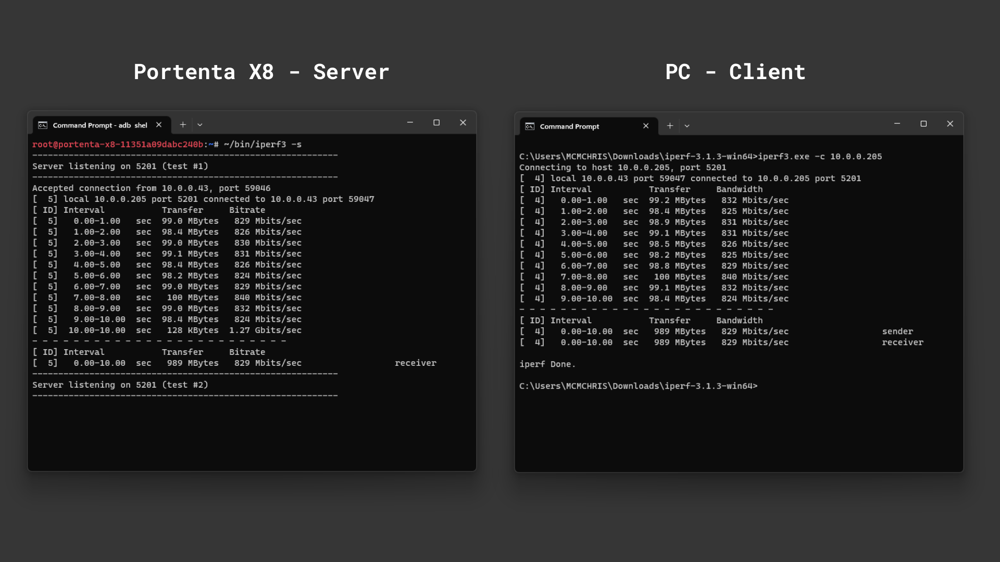

***The speed results could be affected by your Ethernet cable quality or your PC Ethernet card.***

#### Using Arduino IDE

To test the Ethernet connection using a __Portenta H7__ or a __Portenta C33__ we are going to use an example sketch that will retrieve your City information from the internet and show it through the Serial Monitor.

```arduino
/**
  Purpose: This sketch connects a device to ip-api.com via Ethernet
  and fetches IP details for the device.
**/

// Include the necessary libraries.
#if defined(ARDUINO_PORTENTA_H7_M7)
  #include <PortentaEthernet.h> // for Portenta H7 
#elif defined(ARDUINO_PORTENTA_C33)
  #include <EthernetC33.h>  // for Portenta C33
#endif

#include <Arduino_JSON.h>

// Server address for ip-api.com.
const char* server = "ip-api.com";

// API endpoint path to get IP details in JSON format.
String path = "/json/";

// Ethernet client instance for the communication.
EthernetClient client;

// JSON variable to store and process the fetched data.
JSONVar doc;

// Variable to ensure we fetch data only once.
bool dataFetched = false;

void setup() {
  // Begin serial communication at a baud rate of 115200.
  Serial.begin(115200);

  // Wait for the serial port to connect,
  // This is necessary for boards that have native USB.
  while (!Serial);

  // Attempt to start Ethernet connection via DHCP,
  // If DHCP failed, print a diagnostic message.
  if (Ethernet.begin() == 0) {
    Serial.println("- Failed to configure Ethernet using DHCP!");

  }
  printIPAddress();
  delay(2000);
}

void loop() {
  // Ensure we haven't fetched data already,
  // ensure the Ethernet link is active,
  // establish a connection to the server,
  // compose and send the HTTP GET request.
  if (!dataFetched) {
    if (Ethernet.linkStatus() == LinkON) {
      if (client.connect(server, 80)) {
        client.print("GET ");
        client.print(path);
        client.println(" HTTP/1.1");
        client.print("Host: ");
        client.println(server);
        client.println("Connection: close");
        client.println();

        // Wait and skip the HTTP headers to get to the JSON data.
        char endOfHeaders[] = "\r\n\r\n";
        client.find(endOfHeaders);

        // Read and parse the JSON response.
        String payload = client.readString();
        doc = JSON.parse(payload);

        // Check if the parsing was successful.
        if (JSON.typeof(doc) == "undefined") {
          Serial.println("- Parsing failed!");
          return;
        }

        // Extract and print the IP details.
        Serial.println("*** IP Details:");
        Serial.print("- IP Address: ");
        Serial.println((const char*)doc["query"]);
        Serial.print("- City: ");
        Serial.println((const char*)doc["city"]);
        Serial.print("- Region: ");
        Serial.println((const char*)doc["regionName"]);
        Serial.print("- Country: ");
        Serial.println((const char*)doc["country"]);
        Serial.println("");

        // Mark data as fetched.
        dataFetched = true;
      }
      // Close the client connection once done.
      client.stop();
    } else {
      Serial.println("- Ethernet link disconnected!");
    }
  }
}

void printIPAddress()
{
  Serial.print("Connected to: ");
  for (byte thisByte = 0; thisByte < 4; thisByte++) {
    // print the value of each byte of the IP address:
    Serial.print(Ethernet.localIP()[thisByte], DEC);
    Serial.print(".");
  }

  Serial.println();
}
```


### Wi-Fi® & Bluetooth®

The Portenta Max Carrier is designed to work flawlessly with wireless features. Among its numerous advantages is its capacity to use Wi-Fi® and Bluetooth® technologies present in the Portenta models like X8, H7, or C33. When these wireless options are activated, they can be effectively combined with the intrinsic capabilities and features that the carrier offers. This combination makes this solution more versatile and powerful for many different projects.

This integration not only broadens the spectrum of use cases for the Portenta Max Carrier but also ensures that developers can use robust wireless communications in their applications. The effectiveness of onboard capabilities with these wireless features makes the Portenta Max Carrier an indispensable tool for developers looking for versatile and powerful connectivity solutions.

For a comprehensive understanding of these connectivity options, kindly refer to the specific documentation for each Portenta model.

- Portenta X8 connectivity: [Wi-Fi® configuration](https://docs.arduino.cc/tutorials/portenta-x8/user-manual#wi-fi-configuration) and [Bluetooth®](https://docs.arduino.cc/tutorials/portenta-x8/user-manual#bluetooth)
- Portenta H7 connectivity: [Wi-Fi® access point](https://docs.arduino.cc/tutorials/portenta-h7/wifi-access-point) and [BLE connectivity](https://docs.arduino.cc/tutorials/portenta-h7/ble-connectivity)
- Portenta C33 User Manual: [Wi-Fi®](https://docs.arduino.cc/tutorials/portenta-c33/user-manual#wi-fi) and [Bluetooth®](https://docs.arduino.cc/tutorials/portenta-c33/user-manual#bluetooth)

### LTE CAT.M1 NB-IoT

To ensure connectivity in a wide variety of possible scenarios, the Max Carrier features cellular connectivity powered by the SARA-R412M-02B multi-band module. 

You can easily connect your solution to the internet leveraging the more suitable communication protocol, from LTE, NB-IoT, Cat.M1 and more.

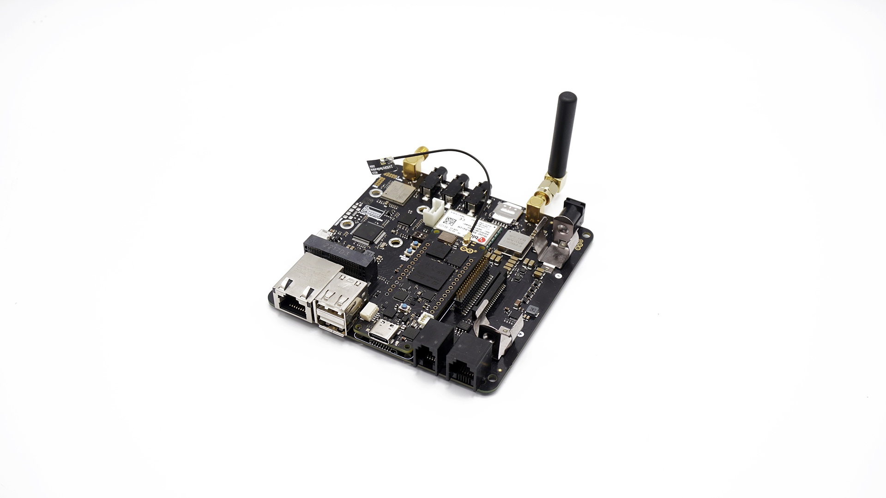

***Recommended cellular antenna: ANT-5GW-SPS1-2***

#### Using Arduino IDE

To use the cellular connectivity we are going to use a __Portenta H7__ alongside the Max Carrier. To drive the module we recommend the `MKRNB` library which can be downloaded directly from the Arduino IDE Library Manager.

To quickly find out if the setup successfully connects to mobile networks, we are going to use an example code that can be found on **File > Examples > MKRNB > NBWwebClient**. 

Go to the __arduino_secrets.h__ tab that opens with the example and enter the PIN of the SIM card you are using into the `SECRET_PINNUMBER` variable.

***Note: A standard pre-paid SIM card typically has 0000 or 1234 as a PIN code. This varies from operator to operator, it is important to find out your PIN before uploading the code. Otherwise, too many unsuccessful attempts may block the SIM card.***

Upload the code to your Portenta H7 and open the Serial Monitor to follow the connection process.

If the connection is successful, you should see the HTML content of the server printed in the Serial Monitor. The server is set as `example.com` as default. Feel free to change this and take a look at how it prints different web pages. 

Below you can see what will be printed in the Serial Monitor when connecting to example.com.


### LoRa®

One feature that boosts Portenta Max Carrier possibilities is its onboard LoRa® module, the CMWX1ZZABZ-078 from Murata®. LoRaWAN® is a Low Power Wide Area Network (LPWAN) protocol designed to connect low-power devices to the Internet. It has been developed to meet and fulfill Internet of Things (IoT) devices' requirements, such as low power consumption and low data throughput.

A dedicated SMA connector (J9) is available for connecting an external antenna.

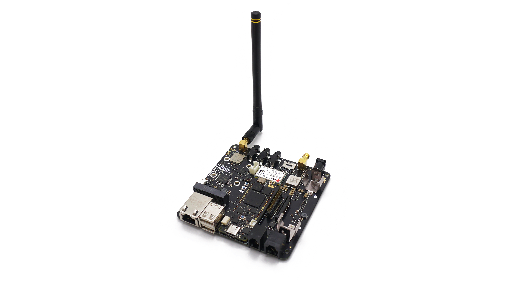

***Recommended LoRa® antenna: ANT-8/9-IPW1-SMA***

#### Using Linux

Empower your Portenta X8 connectivity with LoRa® by following this detailed guide on [How to set up a multi-protocol gateway using the Portenta X8 and the Max Carrier](https://docs.arduino.cc/tutorials/portenta-x8/multi-protocol-gateway)

#### Using Arduino IDE

To learn how to leverage LoRa® capabilities with this carrier and the Arduino IDE, follow this detailed tutorial on [How to Connect the Portenta Max Carrier with The Things Network using a Portenta H7](https://docs.arduino.cc/tutorials/portenta-max-carrier/connecting-to-ttn)

## Audio Interface

The Portenta Max Carrier features a low-power but mighty stereo CODEC, ideal for audio applications powered by the Portenta X8. An internal Class D amplifier lets us play high-quality audio directly on external speakers. 

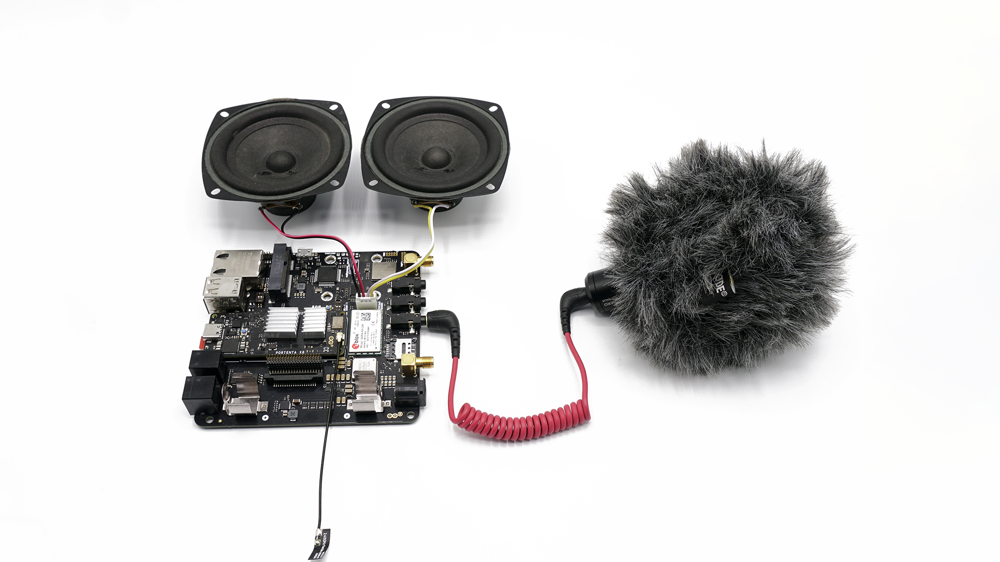

The audio recording couldn't be simpler thanks to its variety of audio inputs, letting you connect a microphone or any other audio source.

### Recording Audio

In the following example, we are going to record audio using an external microphone and store it on a micro SD card.


First of all, let's connect to the internet to download the tools and run the needed Docker containers. 

***Use `nmcli device wifi connect <SSID> password <PASSWORD>` to easily connect to a WiFi network.***

After inserting the micro SD in the Max Carrier slot, mount it with the following command.

```bash
sudo mount -t vfat /dev/mmcblk1p1 /mnt
```
Run the docker image `debian:stable-slim` and set the peripherals to be used with the following command.

```bash
docker run -it -u '0' --device '/dev/snd:/dev/snd' -v '/mnt:/sdcard' --tmpfs /tmp --name "alsa-utils" debian:stable-slim bash
```

Install the audio management tools. This procedure will take a while.

```bash
apt-get update && apt-get install alsa-utils ffmpeg -y
```

Define the microphone inputs as the audio sources and the input gain.

```bash
amixer -c 1 sset 'ADC Left Mux' 'Input3A' # Mic Input
amixer -c 1 sset 'ADC Right Mux' 'Input3B' # Mic Input
amixer -c 1 sset 'ADC' 100% # Mic volume
```
Now, we are ready for the audio recording. Use `ffmpeg` command alongside the settings of your preference.

The following command will record audio for 30 seconds at 44100 Hz and save it on `/sdcard/` as `out.wav`.

```bash
ffmpeg -f alsa -i hw:1 -t 30 -ac 1 -ar 44100 -c:a pcm_s16le /sdcard/out.wav
```
***If you want to learn more about the `ffmpeg` tool and its options, here is a [useful reference](https://ffmpeg.org/ffmpeg.html).***

If we list the `/sdcard/` directory content with `ls /scard/` command, the audio file should be there.

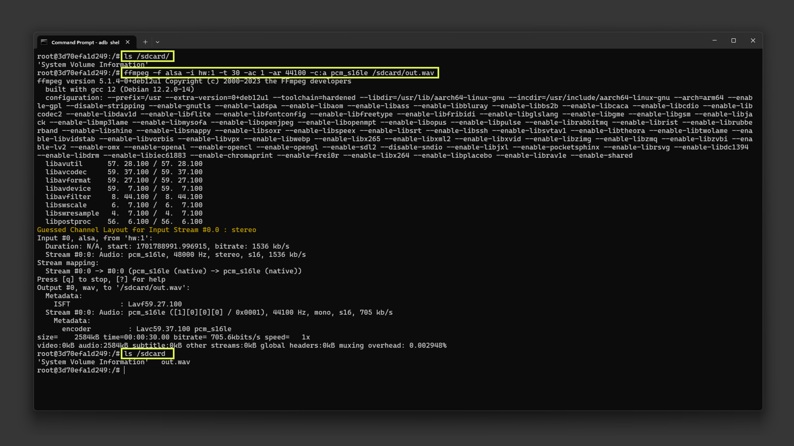

You can open the audio file on your computer by copying it with the following commands:

- First, find the `alsa-utils` container ID with `docker ps -a`.
- Copy the file from the container to the X8 local storage with `sudo docker cp <CONTAINER ID>:/sdcard/out.wav /home/fio`
- The audio file is now on `/home/fio`, from here you can pull it using `adb` from a terminal. Use `adb pull /home/fio/out.wav <destination path>`

### Playing Back Audio

In the following example, we are going to playback the previously recorded audio file and learn how to test the Max Carrier audio outputs.


First, it is important to know some commands to control the audio volume.

```bash
# This sets the master output volume 
amixer -c 1 sset 'Master' 100% # accepts also a dB parameter 100% = 12dB
# This sets the headphone output volume 
amixer -c 1 sset 'Headphone' 0dB # 0dB = 100%
# This sets the speaker output volume 
amixer -c 1 sset 'Speaker' 100% # 100% = 0dB
```
By default, the Class D amplifier outputs are turned off. To play audio on the external speakers, you must turn them on with the following commands.

```bash
amixer -c 1 sset 'SPK Right Amp' on # turn on the right channel speaker
amixer -c 1 sset 'SPK Left Amp' on # turn on the right channel speaker
```

The following command will play an example `.wav` audio file stored on `/usr/share/sounds/alsa`.
```bash
speaker-test -c 2 -D hw:cs42l52audio -t wav
```

To play a sine wave at 440 Hz, use:

```bash
speaker-test -c 2 -D hw:cs42l52audio -t sine -f 440
```

To play the recorded `.wav` file in the previous section, use this command.

```bash
aplay -c 2 -D hw:cs42l52audio -t wav /sdcard/out2.wav
```

***To send a file from the Portenta X8 local storage to the container use: `sudo docker cp /home/fio/<file>.wav <CONTAINER ID>:/sdcard`***

## USB Interface

The Portenta Max Carrier features a USB interface suitable for data logging and connecting external devices.


If you are interested in the USB-A port pinout, the following table may serve to understand its connection distribution:

| **Pin number** | **Power Net** | **Portenta HD Standard Pin** |                         **High-Density Pin**                         | **Interface** |
| :------------: | :-----------: | :--------------------------: | :------------------------------------------------------------------: | :-----------: |
|       1        |      +5V      |       USB0_VBUS        |                  J1-24                  |               |
|       2        |               |           USB0_D_N           |                                J1-28                                 |    USB D-     |
|       3        |               |           USB0_D_P           |                                J1-26                                 |    USB D+     |
|       4        |      GND      |             GND              | J1-22, J1-31, J1-42, J1-47, J1-54, J2-24, J2-33, J2-44, J2-57, J2-70 |               |

Devices with a USB-A interface, such as storage drives, can be used for logging data. External devices include peripherals like keyboards, mouses, webcams, and hubs.

### Using Linux

As an example, the following command on Portenta X8's shell can be used to test a write command with a USB memory drive. To write a file, the following sequence of commands can help you to accomplish such a task.

```bash
sudo su -
```

First of all, let's enter root mode to have the right permissions to mount and unmount related peripherals like our USB memory drive.

```bash
lsblk
```

The `lsblk` command lists all available block devices, such as hard drives and USB drives. It helps in identifying the device name, like `/dev/sda1` which will be probably the partition designation of the USB drive you just plugged in. A common trick to identify and check the USB drive connected is to execute the `lsblk` command twice; once with the USB disconnected and the next one to the USB connected, to compare both results and spot easily the newly connected USB drive. Additionally, the command `lsusb` can be used to gather more information about the connected USB drive.

```bash
mkdir -p /mnt/USBmount
```

The `mkdir -p` command creates the directory `/mnt/USBmount`. This directory will be used as a mount point for the USB drive.

```bash
mount -t vfat /dev/sda1 /mnt/USBmount
```

This mount command mounts the USB drive, assumed to have a FAT filesystem (`vfat`), located at `/dev/sda1` to the directory `/mnt/USBmount`. Once mounted, the content of the USB drive can be accessed from the `/mnt/USBmount` directory with `cd`:

```bash
cd /mnt/USBmount
```

Now if you do an `ls` you can see the actual content of the connected USB Drive.

```bash
ls
```
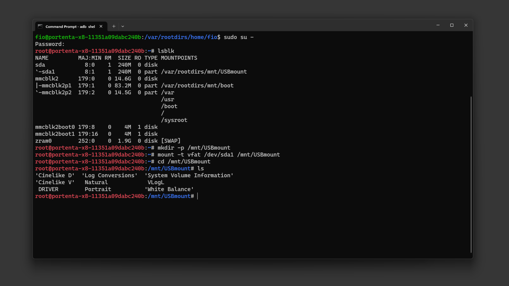

Let's create a simple text file containing the message `Hello, World!` in the already connected USB memory drive using the following command:

```bash
dd if=<(echo -n "Hello, World!") of=/mnt/USBmount/helloworld.txt
```

This command uses the `dd` utility, combined with process substitution. Specifically, it seizes the output of the `echo` command, responsible for generating the `Hello, World!` message, and channels it as an input stream to `dd`.

Subsequently, the message gets inscribed into a file named _helloworld.txt_ situated in the `/mnt/USBmount` directory.

After creating the file, if you wish to retrieve its contents and display them on the shell, you can use:

```bash
cat helloworld.txt
```

This command `cat` prompts in the terminal the content of a file, in this case the words `Hello, World!`.

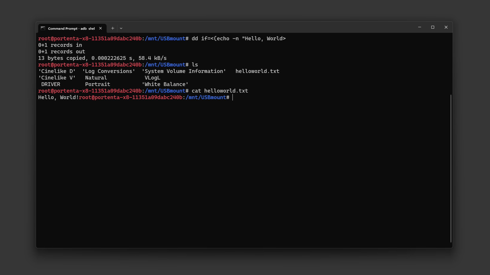

To unmount the USB drive use the following command from outside the USB folder:

```bash
umount /dev/sda1 /mnt/USBmount
```

Now that you know how to locate, mount, write and read information from an external USB stick or hard drive, you can expand the possibilities of your solution with the additional storage connected to the Portenta Max Carrier.

### Using Arduino IDE

The following example demonstrates how to use the USB interface of the Portenta Max Carrier with the Portenta C33 to mount a Mass Storage Device (MSD).

The Max Carrier uses a USB hub IC (USB2514B) that manages the communication between the two USB-A ports and the USB interface of the Portenta SoM. To use it with the Arduino IDE, a library is needed and you can install it by searching for `USB251X` on the library manager and clicking on install.

Through this code, users will be able to effectively connect to, read from, and write to a USB storage device, making it easier to interact with external storage via the USB interface.

```arduino 
#include <Wire.h>
#include "SparkFun_USB251x_Arduino_Library.h"   //Click here to install: http://librarymanager/All#USB251x
#include <vector>
#include <string>
#include "UsbHostMsd.h"
#include "FATFileSystem.h"

#define TEST_FS_NAME "USB"
#define TEST_FOLDER_NAME "TEST_FOLDER"
#define TEST_FILE "test.txt"
#define DELETE_FILE_DIMENSION 150

USB251x myHub;
USBHostMSD block_device;
FATFileSystem fs(TEST_FS_NAME);

std::string root_folder = std::string("/") + std::string(TEST_FS_NAME);
std::string folder_test_name = root_folder + std::string("/") + std::string(TEST_FOLDER_NAME);
std::string file_test_name = folder_test_name + std::string("/") + std::string(TEST_FILE);

/* this callback will be called when a Mass Storage Device is plugged in */
void device_attached_callback(void) {
  Serial.println();
  Serial.println("++++ Mass Storage Device detected ++++");
  Serial.println();
}

void setup() {
  /*
   *  SERIAL INITIALIZATION
   */
  Serial.begin(115200);
  while (!Serial) {
  }

  Wire.begin();

  if (myHub.begin() == false) {
    Serial.println("Device not found. USB251xB may already be in hub mode. Please check wiring or reset the hub. Freezing...");
    while (1)
      ;
  }

  Serial.println("Writing default settings to hub");
  myHub.setDefaults();  //Write ROM defaults
  myHub.attach();       //Locks settings and begin acting as hub


  Serial.println();
  Serial.println("*** USB HOST Mass Storage Device example ***");
  Serial.println();

  /* attach the callback so that when the device is inserted the device_attached_callback
     will be automatically called */
  block_device.attach_detected_callback(device_attached_callback);
  /* list to store all directory in the root */
  std::vector<std::string> dir_list;

  /* 
   *  Check for device to be connected
   */

  int count = 0;
  while (!block_device.connect()) {
    if (count == 0) {
      Serial.println("Waiting for Mass Storage Device");
    } else {
      Serial.print(".");
      if (count % 30 == 0) {
        Serial.println();
      }
    }
    count++;
    delay(1000);
  }

  Serial.println("Mass Storage Device connected.");

  /* 
   *  MOUNTIN SDCARD AS FATFS filesystem
   */

  Serial.println("Mounting Mass Storage Device...");
  int err = fs.mount(&block_device);
  if (err) {
    // Reformat if we can't mount the filesystem
    // this should only happen on the first boot
    Serial.println("No filesystem found, formatting... ");
    err = fs.reformat(&block_device);
  }

  if (err) {
    Serial.println("Error formatting USB Mass Storage Device");
    while (1)
      ;
  }

  /* 
   *  READING root folder
   */

  DIR *dir;
  struct dirent *ent;
  int dirIndex = 0;

  Serial.println("*** List USB Mass Storage Device content: ");
  if ((dir = opendir(root_folder.c_str())) != NULL) {
    while ((ent = readdir(dir)) != NULL) {
      if (ent->d_type == DT_REG) {
        Serial.print("- [File]: ");
      } else if (ent->d_type == DT_DIR) {
        Serial.print("- [Fold]: ");
        if (ent->d_name[0] != '.') { /* avoid hidden folders (.Trash might contain a lot of files) */
          dir_list.push_back(ent->d_name);
        }
      }
      Serial.println(ent->d_name);
      dirIndex++;
    }
    closedir(dir);
  } else {
    // Could not open directory
    Serial.println("Error opening USB Mass Storage Device\n");
    while (1)
      ;
  }

  if (dirIndex == 0) {
    Serial.println("Empty SDCARD");
  }

  bool found_test_folder = false;

  /* 
   *  LISTING CONTENT of the first level folders (the one immediately present in root folder)
   */

  if (dir_list.size()) {
    Serial.println();
    Serial.println("Listing content of folders in root: ");
  }
  for (unsigned int i = 0; i < dir_list.size(); i++) {
    if (dir_list[i] == TEST_FOLDER_NAME) {
      found_test_folder = true;
    }
    Serial.print("- ");
    Serial.print(dir_list[i].c_str());
    Serial.println(":");

    std::string d = root_folder + std::string("/") + dir_list[i];
    if ((dir = opendir(d.c_str())) != NULL) {
      while ((ent = readdir(dir)) != NULL) {
        if (ent->d_type == DT_REG) {
          Serial.print("   - [File]: ");
        } else if (ent->d_type == DT_DIR) {
          Serial.print("   - [Fold]: ");
        }
        Serial.println(ent->d_name);
      }
      closedir(dir);
    } else {
      Serial.print("ERROR OPENING SUB-FOLDER ");
      Serial.println(d.c_str());
    }
  }

  /* 
   *  CREATING TEST FOLDER (if does not exist already)
   */

  err = 0;
  if (!found_test_folder) {
    Serial.println("TEST FOLDER NOT FOUND... creating folder test");
    err = mkdir(folder_test_name.c_str(), S_IRWXU | S_IRWXG | S_IRWXO);
    if (err != 0) {
      Serial.print("FAILED folder creation with error ");
      Serial.println(err);
    }
  }

  /* 
   *  READING TEST FILE CONTENT
   */

  if (err == 0) {
    int file_dimension = 0;
    FILE *fp = fopen(file_test_name.c_str(), "r");
    if (fp != NULL) {
      Serial.print("Opened file: ");
      Serial.print(file_test_name.c_str());
      Serial.println(" for reading");

      fseek(fp, 0L, SEEK_END);
      int numbytes = ftell(fp);
      fseek(fp, 0L, SEEK_SET);

      Serial.print("Bytes in the file: ");
      Serial.println(numbytes);
      file_dimension = numbytes;

      if (numbytes > 0) {
        Serial.println();
        Serial.println("-------------------- START FILE CONTENT --------------------");
      }

      for (int i = 0; i < numbytes; i++) {
        char ch;
        fread(&ch, sizeof(char), 1, fp);
        Serial.print(ch);
      }

      if (numbytes > 0) {
        Serial.println("--------------------- END FILE CONTENT ---------------------");
        Serial.println();
      } else {
        Serial.println("File is EMPTY!");
        Serial.println();
      }

      fclose(fp);
    } else {
      Serial.print("FAILED open file ");
      Serial.println(file_test_name.c_str());
    }

    /*
     * DELETE FILE IF THE File dimension is greater than 150 bytes
     */

    if (file_dimension > DELETE_FILE_DIMENSION) {
      Serial.println("Test file reached the delete dimension... deleting it!");
      if (remove(file_test_name.c_str()) == 0) {
        Serial.println("TEST FILE HAS BEEN DELETED!");
      }
    }

    /*
     * APPENDING SOMETHING TO FILE 
     */

    fp = fopen(file_test_name.c_str(), "a");
    if (fp != NULL) {
      Serial.print("Opened file: ");
      Serial.print(file_test_name.c_str());
      Serial.println(" for writing (append)");
      char text[] = "This line has been appended to file!\n";
      fwrite(text, sizeof(char), strlen(text), fp);
      fclose(fp);
    } else {
      Serial.print("FAILED open file for appending ");
      Serial.println(file_test_name.c_str());
    }

    /*
     * READING AGAIN FILE CONTENT
     */

    fp = fopen(file_test_name.c_str(), "r");
    if (fp != NULL) {
      Serial.print("Opened file: ");
      Serial.print(file_test_name.c_str());
      Serial.println(" for reading");

      fseek(fp, 0L, SEEK_END);
      int numbytes = ftell(fp);
      fseek(fp, 0L, SEEK_SET);

      Serial.print("Bytes in the file: ");
      Serial.println(numbytes);

      if (numbytes > 0) {
        Serial.println();
        Serial.println("-------------------- START FILE CONTENT --------------------");
      }

      for (int i = 0; i < numbytes; i++) {
        char ch;
        fread(&ch, sizeof(char), 1, fp);
        Serial.print(ch);
      }

      if (numbytes > 0) {
        Serial.println("--------------------- END FILE CONTENT ---------------------");
        Serial.println();
      } else {
        Serial.println("File is EMPTY!");
        Serial.println();
      }

      fclose(fp);

    } else {
      Serial.print("FAILED open file for appending ");
      Serial.println(file_test_name.c_str());
    }
  }
}

void loop() {
  // Empty
}
```
The example code from above will read the USB drive connected and print all its content on the Serial Monitor. Also, it will create a test file.


## MicroSD Storage

The available microSD card slot offers the advantage of expanded storage. This is especially beneficial for processing large volumes of log data, whether from sensors or the onboard computer registry.


### Using Linux

To begin using a microSD card, enter to your Portenta X8 using `adb shell` and access to root (admin) typing `sudo su -`, the password is `fio` by default.

Use the following command to pull a Docker container that assists in setting up the necessary elements for interacting with the microSD card:

```bash
docker run -it --cap-add SYS_ADMIN --device /dev/mmcblk1p1 debian:stable-slim bash
```

The command above will run the image immediately after the container image has been successfully pulled. You will find yourself inside the container once it is ready for use.

You will need to identify the partition scheme where the microSD card is located. If a partition table does not exist for the microSD card, you will have to use the `fdisk` command to create its partitions.

Inside the container, you can use the following commands.

To determine if the Portenta X8 has recognized the microSD card, you can use one of the following commands:

```bash
lsblk

# or
fdisk -l
```

The microSD card usually appears as `/dev/mmcblk0` or `/dev/sdX`. Where X can be a, b, c, etc. depending on other connected storage devices.

Before accessing the contents of the microSD card, it needs to be mounted. For convenient operation, create a directory that will serve as the mount point:

```bash
mkdir -p /tmp/sdcard
```

Use the following command to mount the microSD card to the previously created directory. Ensure you replace `XX` with the appropriate partition number (e.g., p1 for the first partition):

```bash
mount /dev/mmcblk1p1 /tmp/sdcard
```

Navigate to the mount point and list the contents of the SD card:

```bash
cd /tmp/sdcard
ls
```


To write data to the microSD card, you can use the `echo` command. For example, type the following code to create a file named `hello.txt` with the content `"Hello World Carrier!"`:

```bash
echo "Hello World Carrier!" > hello.txt
```

To read the contents of the file you have just created:

```bash
cat hello.txt
```

This will print on your shell the contents that were saved to the `hello.txt` file.

Once you are done with the operations related to microSD card, it is important to unmount it properly:

```bash
umount /tmp/sdcard
```


***Warning: If you need to format the micro SD card to the _ext4_ filesystem, use the following command.***

Please be cautious, since this command will erase all the existing data on the microSD card.
```bash
mkfs.ext4 /dev/mmcblk1p1  #Warning: this will erase everything on your micro SD
```

### Using Arduino IDE
For Portenta H7, you can use the following Arduino IDE script to test the mounted SD card within Portenta Max Carrier:

This example can also be found on the Arduino IDE built-in examples on **File > Examples > Portenta_SDCARD > TestSDCARD**

```arduino
#include "SDMMCBlockDevice.h"
#include "FATFileSystem.h"

SDMMCBlockDevice block_device;
mbed::FATFileSystem fs("fs");

void setup() {
  Serial.begin(9600);
  while (!Serial);

  Serial.println("Mounting SDCARD...");
  int err =  fs.mount(&block_device);
  if (err) {
    // Reformat if we can't mount the filesystem
    // this should only happen on the first boot
    Serial.println("No filesystem found, formatting... ");
    err = fs.reformat(&block_device);
  }
  if (err) {
     Serial.println("Error formatting SDCARD ");
     while(1);
  }
  
  DIR *dir;
  struct dirent *ent;
  int dirIndex = 0;

  Serial.println("List SDCARD content: ");
  if ((dir = opendir("/fs")) != NULL) {
    // Print all the files and directories within directory (not recursively)
    while ((ent = readdir (dir)) != NULL) {
      Serial.println(ent->d_name);
      dirIndex++;
    }
    closedir (dir);
  } else {
    // Could not open directory
    Serial.println("Error opening SDCARD\n");
    while(1);
  }
  if(dirIndex == 0) {
    Serial.println("Empty SDCARD");
  }
}

void loop() {
  // Empty
}

```

With this code, the Portenta H7 will scan all the files and directories names on the micro SD card and list them on the Arduino IDE Serial Monitor.

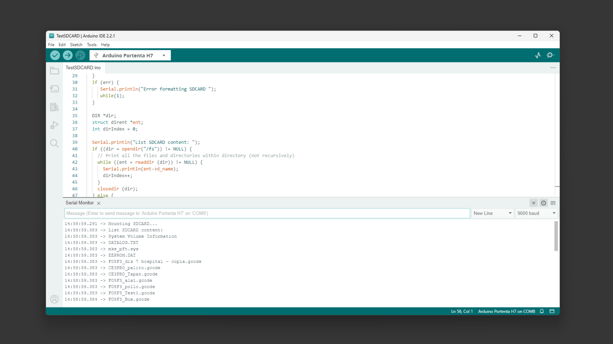

For Portenta C33, you can use the following Arduino IDE script:

This example can also be found on the Arduino IDE built-in examples on **File > Examples > Storage > TestSDCARD**.

```arduino
#include <vector>
#include <string>
#include "SDCardBlockDevice.h"
#include "FATFileSystem.h"

#define TEST_FS_NAME "fs"
#define TEST_FOLDER_NAME "TEST_FOLDER"
#define TEST_FILE "test.txt"
#define DELETE_FILE_DIMENSION 150


SDCardBlockDevice block_device(PIN_SDHI_CLK, PIN_SDHI_CMD, PIN_SDHI_D0, PIN_SDHI_D1, PIN_SDHI_D2, PIN_SDHI_D3, PIN_SDHI_CD, PIN_SDHI_WP);
FATFileSystem fs(TEST_FS_NAME);

std::string root_folder       = std::string("/") + std::string(TEST_FS_NAME);
std::string folder_test_name  = root_folder + std::string("/") + std::string(TEST_FOLDER_NAME);
std::string file_test_name    = folder_test_name + std::string("/") + std::string(TEST_FILE); 

void setup() {
  /*
   *  SERIAL INITIALIZATION
   */
  Serial.begin(9600);
  while(!Serial) {
     
  }

  /* list to store all directory in the root */
  std::vector<std::string> dir_list;

  Serial.println();
  Serial.println("##### TEST SD CARD with FAT FS");
  Serial.println();

  /* 
   *  MOUNTING SDCARD AS FATFS filesystem
   */
  Serial.println("Mounting SDCARD...");
  int err =  fs.mount(&block_device);
  if (err) {
    // Reformat if we can't mount the filesystem
    // this should only happen on the first boot
    Serial.println("No filesystem found, formatting... ");
    err = fs.reformat(&block_device);
  }
  if (err) {
     Serial.println("Error formatting SDCARD ");
     while(1);
  }

  /* 
   *  READING root folder
   */
  
  DIR *dir;
  struct dirent *ent;
  int dirIndex = 0;

  Serial.println("*** List SD CARD content: ");
  if ((dir = opendir(root_folder.c_str())) != NULL) {
    while ((ent = readdir (dir)) != NULL) {
      
      if(ent->d_type == DT_REG) {
        Serial.print("- [File]: ");
      }
      
      else if(ent->d_type == DT_DIR) {
        Serial.print("- [Fold]: ");
        dir_list.push_back(ent->d_name);
      }
      Serial.println(ent->d_name);
      dirIndex++;
    }
    closedir (dir);
  } 
  else {
    // Could not open directory
    Serial.println("Error opening SDCARD\n");
    while(1);
  }

  if(dirIndex == 0) {
    Serial.println("Empty SDCARD");
  }

  bool found_test_folder = false;

  /* 
   *  LISTING CONTENT of the first level folders (the one immediately present in root folder)
   */

  if(dir_list.size()) {
    Serial.println();
    Serial.println("Listing content of folders in root: ");
  }
  for(unsigned int i = 0; i < dir_list.size(); i++) {
    if(dir_list[i] == TEST_FOLDER_NAME) {
      found_test_folder = true;
    }
    Serial.print("- ");
    Serial.print(dir_list[i].c_str());
    Serial.println(":");
    
    std::string d = root_folder + std::string("/") + dir_list[i];
    if ((dir = opendir(d.c_str())) != NULL) {
      while ((ent = readdir (dir)) != NULL) {
        if(ent->d_type == DT_REG) {
          Serial.print("   - [File]: ");
        }
        else if(ent->d_type == DT_DIR) {
          Serial.print("   - [Fold]: ");
        }
        Serial.println(ent->d_name);
      }
      closedir (dir);
    }
    else {
      Serial.print("ERROR OPENING SUB-FOLDER ");
      Serial.println(d.c_str());
    }
  }

  /* 
   *  CREATING TEST FOLDER (if does not exist already)
   */

  err = 0;
  if(!found_test_folder) {
    Serial.println("TEST FOLDER NOT FOUND... creating folder test"); 
    err = mkdir(folder_test_name.c_str(), S_IRWXU | S_IRWXG | S_IRWXO);
    if(err != 0) {
      Serial.print("FAILED folder creation with error ");
      Serial.println(err);
    }
  }

  /* 
   *  READING TEST FILE CONTENT
   */
  
  if(err == 0) {
    int file_dimension = 0; 
    FILE* fp = fopen(file_test_name.c_str(), "r");
    if(fp != NULL) {
      Serial.print("Opened file: ");
      Serial.print(file_test_name.c_str());
      Serial.println(" for reading");
      
      fseek(fp, 0L, SEEK_END);
      int numbytes = ftell(fp);
      fseek(fp, 0L, SEEK_SET);  

      Serial.print("Bytes in the file: ");
      Serial.println(numbytes);
      file_dimension = numbytes;

      if(numbytes > 0) {
        Serial.println();
        Serial.println("-------------------- START FILE CONTENT --------------------");
      }
      
      for(int i = 0; i < numbytes; i++) {
        char ch;
        fread(&ch, sizeof(char), 1, fp);
        Serial.print(ch);
      }

      if(numbytes > 0) {
        Serial.println("--------------------- END FILE CONTENT ---------------------");
        Serial.println();
      }
      else {
        Serial.println("File is EMPTY!");
        Serial.println();
      }
    
      fclose(fp);
    }
    else {
      Serial.print("FAILED open file ");
      Serial.println(file_test_name.c_str());
    }

    /*
     * DELETE FILE IF THE File dimension is greater than 150 bytes
     */

    if(file_dimension > DELETE_FILE_DIMENSION) {
      Serial.println("Test file reached the delete dimension... deleting it!");
      if(remove(file_test_name.c_str()) == 0) {
        Serial.println("TEST FILE HAS BEEN DELETED!");
      }
    }
    
    /*
     * APPENDING SOMETHING TO FILE 
     */
     
    fp = fopen(file_test_name.c_str(), "a");
    if(fp != NULL) {
      Serial.print("Opened file: ");
      Serial.print(file_test_name.c_str());
      Serial.println(" for writing (append)");
      char text[] = "This line has been appended to file!\n";
      fwrite(text, sizeof(char), strlen(text), fp);
      fclose(fp); 
    }
    else {
      Serial.print("FAILED open file for appending ");
      Serial.println(file_test_name.c_str());
    }
    
    /*
     * READING AGAIN FILE CONTENT
     */
    
    fp = fopen(file_test_name.c_str(), "r");
    if(fp != NULL) {
      Serial.print("Opened file: ");
      Serial.print(file_test_name.c_str());
      Serial.println(" for reading");
      
      fseek(fp, 0L, SEEK_END);
      int numbytes = ftell(fp);
      fseek(fp, 0L, SEEK_SET);  

      Serial.print("Bytes in the file: ");
      Serial.println(numbytes);

      if(numbytes > 0) {
        Serial.println();
        Serial.println("-------------------- START FILE CONTENT --------------------");
      }
      
      for(int i = 0; i < numbytes; i++) {
        char ch;
        fread(&ch, sizeof(char), 1, fp);
        Serial.print(ch);
      }

      if(numbytes > 0) {
        Serial.println("--------------------- END FILE CONTENT ---------------------");
        Serial.println();
      }
      else {
        Serial.println("File is EMPTY!");
        Serial.println();
      }
    
      fclose(fp);
      
    }
    else {
      Serial.print("FAILED open file for appending ");
      Serial.println(file_test_name.c_str());
    }
  }  
  
}

void loop() {
  // Empty
}

```

With this code, the Portenta C33 will scan all the files and directories names on the micro SD card and list them on the Arduino IDE Serial Monitor, also create a test file and read it back.


## JTAG Pins
For developers aiming to investigate and understand the intricate details of development, the Portenta Max Carrier features a built-in JTAG interface. This tool is crucial for hardware debugging, offering real-time observation. Through the JTAG pins, users can smoothly debug and program, guaranteeing accurate and optimal device performance.

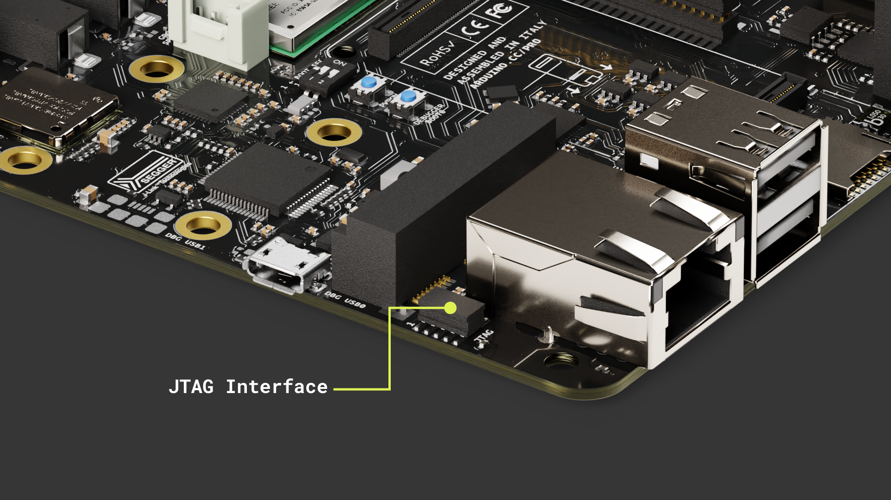

The pins used for the JTAG debug port on the Portenta Max Carrier are the following:

| **Pin number** | **Power Net** | **Portenta HD Standard Pin** |                         **High-Density Pin**                         | **Interface** |
|:--------------:|:-------------:|:----------------------------:|:--------------------------------------------------------------------:|:-------------:|
|        1       | +3V3_PORTENTA |              VCC             |                      J2-23, J2-34, J2-43, J2-69                      |               |
|        2       |               |           JTAG_SWD           |                                 J1-75                                |    JTAG SWD   |
|        3       |      GND      |              GND             | J1-22, J1-31, J1-42, J1-47, J1-54, J2-24, J2-33, J2-44, J2-57, J2-70 |               |
|        4       |               |           JTAG_SCK           |                                 J1-77                                |    JTAG SCK   |
|        5       |      GND      |              GND             | J1-22, J1-31, J1-42, J1-47, J1-54, J2-24, J2-33, J2-44, J2-57, J2-70 |               |
|        6       |               |           JTAG_SWO           |                                 J1-79                                |    JTAG SWO   |
|        7       |               |              NC              |                                  NC                                  |               |
|        8       |               |           JTAG_TDI           |                                 J1-78                                |    JTAG TDI   |
|        9       |               |           JTAG_TRST          |                                 J1-80                                |   JTAG TRST   |
|       10       |               |           JTAG_RST           |                                 J1-73                                |    JTAG RST   |

## Communication

### CAN Bus

The CAN bus, short for Controller Area Network bus, is a resilient communication protocol created by Bosch® in the 1980s for vehicles. It lets microcontrollers and devices interact without a central computer. Using a multi-master model, any system device can send data when the bus is available.

This approach ensures system continuity even if one device fails and is especially effective in electrically noisy settings like in vehicles, where various devices need reliable communication.

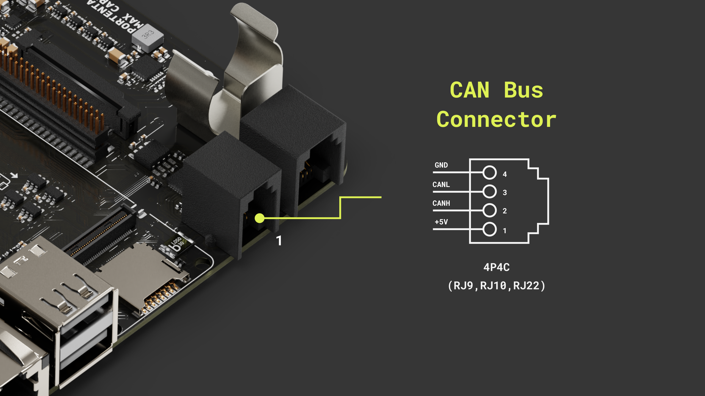

The Portenta Max Carrier is equipped with CAN bus communication capabilities, powered by the TJA1049 module - a high-speed CAN FD transceiver. With this, developers can leverage the robustness and efficiency of CAN communication in their projects.

#### Using Linux

As a practical example, we are going to implement a communication between the __Max Carrier__ using a Portenta X8 and a __Portenta Machine Control__ using CAN.


***For stable CAN bus communication, it is recommended to install 120 Ω termination resistors between CANH and CANL lines.***

For the Portenta X8, when you have admin (root) access, you can execute the following lines of code within the shell to control the CAN bus interface. The CAN transceiver can be enabled using the following command:

`echo 186 > /sys/class/gpio/export && echo out > /sys/class/gpio/gpio186/direction && echo 0 > /sys/class/gpio/gpio186/value`

This command sequence activates the CAN transceiver. It does so by exporting GPIO 186 (`pwm3`), setting its direction to "`out`", and then writing a value of "`0`" to it. Writing 0 as a value to GPIO 186 means that it will set the GPIO to a LOW state.

It is possible to use the following commands:

```bash
sudo modprobe can-dev
```

The necessary modules for __CAN__ (Controller Area Network) support on the Portenta X8 are loaded. The `can-dev` module is added to the system configuration, after which the system is rebooted to apply the changes.

```bash
echo "can-dev" | sudo tee > /etc/modules-load.d/can-dev.conf
sudo systemctl reboot
```
Within the Portenta X8's shell, Docker containers offer a streamlined environment for specific tasks, such as command-based CAN bus operations. The `cansend` command facilitates sending CAN frames. 

To use the `cansend` command, it is crucial to set up the appropriate environment. First, clone the following container repository.

```bash
git clone https://github.com/pika-spark/pika-spark-containers
```
Navigate to the _can-utils-sh_ directory:

```bash
cd pika-spark-containers/can-utils-sh
```
Build the Docker container:

```bash
./docker-build.sh
```
Run the Docker container with the desired bitrate:

```bash
sudo ./docker-run.sh can0 [bitrate]
```
As an example, the command can be structured as follows for a 500 kbit/s communication:

```bash
sudo ./docker-run.sh can0 500000
```
Now, you can send CAN messages using the `cansend` command as shown below:

```bash
cansend can0 123#CA
```
The command follows the format:

`cansend <CAN Interface [can0 | can1]> <CAN ID>#<Data_Payload>`

- `<CAN Interface [can0 | can1]>`: defines the CAN interface (can0 to use the onboard transeiver).
- `<CAN ID>`: is the identifier of the message and is used for message prioritization. The identifier can be in 11-bit or 29-bit format both HEX.
- `<Data_Payload>`: is the data payload of the CAN message and ranges from 0 to 8 bytes in standard CAN frames.

This is how the communication is done between the Max Carrier with the Portenta X8 and the Machine Control.

For the __Portenta Machine Control__: Install the `Arduino_PortentaMachineControl` library from the Library Manager and use the following example sketch that can also be found on **File > Examples > Arduino_PortentaMachineControl > CAN > ReadCan**.

```arduino
#include <Arduino_PortentaMachineControl.h>

void setup() {
  Serial.begin(9600);
  while (!Serial) {
    ; // wait for serial port to connect.
  }

  if (!MachineControl_CANComm.begin(CanBitRate::BR_500k)) {
    Serial.println("CAN init failed.");
    while(1) ;
  }
}

void loop() {
  if (MachineControl_CANComm.available()) {
    CanMsg const msg = MachineControl_CANComm.read();
    // Print the sender ID
    Serial.print("ID: ");
    Serial.println(msg.id, HEX);

    // Print the first Payload Byte
    Serial.print("Message received: ");
    Serial.println(msg.data[0], HEX);
  }
}
```


Moreover, if your goal is to monitor and dump all received CAN frames, a slightly different procedure has to be followed. When the container repository is ready with its components, navigate to the _candump_ directory:

```bash
cd pika-spark-containers/candump
```

Build the Docker container:

```bash
./docker-build.sh
```
Now, you are able to receive CAN messages running this command:

```bash
sudo ./docker-run.sh can0 500000 # last parameter is the bitrate
```
This is how the communication is done between the Max Carrier with the Portenta X8 and the Machine Control.

For the __Portenta Machine Control__: Install the `Arduino_PortentaMachineControl` library from the Library Manager and use the following example sketch that can also be found on **File > Examples > Arduino_PortentaMachineControl > CAN > WriteCan**.

```arduino
#include <Arduino_MachineControl.h>
#include <CAN.h>
using namespace machinecontrol;

#define DATARATE_500KB   500000

void setup() {
  Serial.begin(9600);
  while (!Serial) {
    ; // wait for serial port to connect.
  }

  Serial.println("Start CAN initialization");
  comm_protocols.enableCAN();
  comm_protocols.can.frequency(DATARATE_500KB);
  Serial.println("Initialization done");
}

int counter = 0;
unsigned char payload = 0x49;
int payload_size = 1;

void loop() {

  mbed::CANMessage msg = mbed::CANMessage(13ul, &payload, payload_size);
  if (comm_protocols.can.write(msg)) {
    Serial.println("Message sent");
  } else {
    Serial.println("Transmission Error: ");
    Serial.println(comm_protocols.can.tderror());
    comm_protocols.can.reset();
  }

  delay(1000);
}
```


#### Using Arduino IDE

For users working with the **Portenta C33**, the following simple examples can be used to test the CAN bus protocol's capabilities.

***CAN communication is not supported for the Portenta H7 on the Max Carrier.***

The _CAN Read_ example for Portenta C33 starts CAN communication at a rate of _500 kbps_ and continuously listens for incoming messages, displaying such information upon receipt.

```arduino
#include <Arduino_CAN.h>

void setup()
{
  Serial.begin(115200);

  while (!Serial) { }   // open the serial monitor to start receiving

  if (!CAN.begin(CanBitRate::BR_500k))
  {
    Serial.println("CAN.begin(...) failed.");
    for (;;) {}
  }
  Serial.println("CAN.begin(...) Successful.");
}

void loop()
{
  if (CAN.available())
  {
    CanMsg const msg = CAN.read();
    Serial.println(msg);
  }
}
```

The _CAN Write_ example, also set at _500 kbps_, builds and sends a specific message format. This message includes a fixed preamble followed by an incrementing counter value that updates with each loop iteration.

```arduino
#include <Arduino_CAN.h>

static uint32_t const CAN_ID = 0x20;

void setup()
{
  Serial.begin(115200);

  while (!Serial) { }   // open the serial monitor to start sending

  if (!CAN.begin(CanBitRate::BR_500k))
  {
    Serial.println("CAN.begin(...) failed.");
    for (;;) {}
  }
  Serial.println("CAN.begin(...) Successful.");
}

static uint32_t msg_cnt = 0;

void loop()
{
  /* Assemble a CAN message with the format of
   * 0xCA 0xFE 0x00 0x00 [4 byte message counter]
   */
  uint8_t const msg_data[] = {0xCA,0xFE,0,0,0,0,0,0};
  memcpy((void *)(msg_data + 3), &msg_cnt, sizeof(msg_cnt));
  CanMsg const msg(CanStandardId(CAN_ID), sizeof(msg_data), msg_data);

  /* Transmit the CAN message, capture and display an
   * error core in case of failure.
   */
  if (int const rc = CAN.write(msg); rc < 0)
  {
    Serial.print  ("CAN.write(...) failed with error code ");
    Serial.println(rc);
    for (;;) { }
  }

  /* Increase the message counter. */
  msg_cnt++;

  /* Only send one message per second. */
  delay(1000);
}
```

As a practical example, we are going to implement the communication between the __Max Carrier__ with a Portenta C33 and a __Portenta Machine Control__ using CAN.


***For stable CAN bus communication, it is recommended to install 120 Ω termination resistors between CANH and CANL lines.***

- __For the Portenta C33:__ Use the writing example from above.
- __For the Portenta Machine Control:__ Install the `Arduino_PortentaMachineControl.h` library from the Library Manager and use the following example sketch:

```arduino
#include <Arduino_PortentaMachineControl.h>

void setup() {
  Serial.begin(9600);
  while (!Serial) {
    ; // wait for serial port to connect.
  }

  if (!MachineControl_CANComm.begin(CanBitRate::BR_500k)) {
    Serial.println("CAN init failed.");
    while(1) ;
  }
}

void loop() {
  if (MachineControl_CANComm.available()) {
    CanMsg const msg = MachineControl_CANComm.read();
    // Print the sender ID
    Serial.print("ID: ");
    Serial.println(msg.id, HEX);

    // Print the Payload Bytes
    Serial.print("Message received: ");
    for (int i = 0; i < 4; i++) {
      Serial.print("0x");
      Serial.print(msg.data[i], HEX);
      Serial.print('\t');
    }
    Serial.println();
  }
}
```
Remember that the Portenta Machine Control must be programmed by selecting the `Portenta H7` as the target in the Arduino IDE.

After uploading the code to the Max Carrier and the Machine Control, open both Serial Monitors and you will see the CAN messages exchange.


### Serial RS-232/RS-485

The Portenta Max Carrier includes a multi-protocol transceiver supporting RS-232, RS-485, and RS-422 serial standards (configurable) based on the SP335 IC.

Default configuration:
- Full Duplex
- 232 protocol
- No data rate limit
- Enabled

Here is the connector pinout for reference:

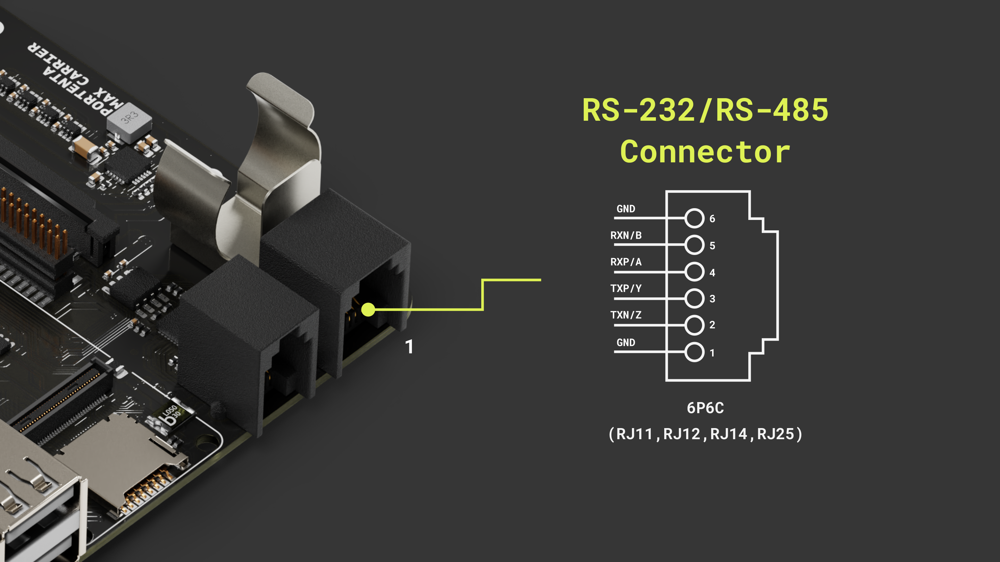

We are going to implement the communication between the Portenta Max Carrier and the Machine Control leveraging two different protocols, `RS-485` and `RS-232`. Use the following wiring respectively.


#### Using Linux

In the Portenta Max Carrier, the UART used for the RS-232/485 transceiver is the `UART0` and its designation on the **Portenta X8** is `ttyX0`.

To set up the serial communication so it matches the link requirements, we can configure the port baud rate, parity and stop bit as desired.

```bash
stty -F /dev/ttyX0 115200 -parity cs8 -cstopb
```

The serial transceiver default configuration is set to __RS-232__, so we are going to use this protocol for the Linux example. Make sure to follow the respective wiring shown above. 

We configured the __Portenta Machine Control__ used for this example leveraging the code included with the `Arduino_PortentaMachineControl` library called `RS232` which can be found on **File > Examples > Arduino_PortentaMachineControl**. This sketch will continuously send a message and wait to receive one using RS-232.

After setting up the serial communication parameters, we can start receiving from the Machine Control with the following command:

```bash
cat /dev/ttyX0
```


For sending we can use the following command instead:

```bash
echo "Hello World" > /dev/ttyX0
```

As a containerized example, here we used Minicom as a serial communication tool. 

First, run the container with the following options:

```bash
docker run --privileged -it -u 0 --network host -v /dev:/dev debian:stable-slim bash
```

Install __Minicom__:

```bash
apt-get update && apt-get install minicom -y
```
Once installed, run it with `minicom -s`, configure the serial port to `/dev/ttyX0` and verify the baud rate is set to `115200`.

Now, you should be able to send and receive data through the RS-232 serial transceiver using the Portenta X8, the Max Carrier and the Machine Control.


#### Using Arduino IDE

For users working with the **Portenta H7** or **Portenta C33**, the following simple examples can be used to test the RS-232/485 communication.

To use these protocols some libraries are needed and you can install them by searching for `ArduinoRS485` and `Arduino_PortentaMachineControl` on the library manager and clicking on install.

Here is the example code for the **Max Carrier** with the **Portenta H7**, it will continuously send a message and wait for one. If a message arrives, it will be printed in the Serial Monitor.

__RS-485 Example Code__

```arduino
/*
  Circuit:
   - Portenta H7
   - Max Carrier
   - A Slave device with RS485 interface (Tested with a Machine Control)
   - Connect PMC TXP/Y to Max Carrier RXP/A and TXN/Z to Max Carrier RXN/B
   - Connect PMC RXP/A to Max Carrier TXP/Y and RXN/B to Max Carrier TXN/Z

  created 21 Nov 2023
  by Christopher Mendez
*/

#include <ArduinoRS485.h>

constexpr unsigned long sendInterval{ 1000 };
unsigned long sendNow{ 0 };
int counter = 0;

arduino::UART _UART4_{ PA_0, PI_9, NC, NC };

RS485Class rs485{ _UART4_, PA_0, PI_10, PJ_10 };  //  UART4, TX, CTS, RTS


void setup() {
  // Set the Max Carrier Communication Protocols to default config
  RS485init();
  // RS485/RS232 default config is:
  // - RS485 mode
  // - Half Duplex
  // - No A/B and Y/Z 120 Ohm termination enabled
  delay(1000);
  // Enable the RS485/RS232 system
  rs485Enable(true);
  // Enable Full Duplex mode
  // This will also enable A/B and Y/Z 120 Ohm termination resistors
  rs485FullDuplex(true);
  // Specify baudrate, and preamble and postamble times for RS485 communication
  rs485.begin(115200, 0, 500);
  // Start in receive mode
  rs485.receive();
}

void loop() {

  if (rs485.available()) {
    Serial.write(rs485.read());
  }

  if (millis() > sendNow) {

    // Disable receive mode before transmission
    rs485.noReceive();

    rs485.beginTransmission();
    rs485.print("hello I'm Max ");
    rs485.println(counter++);
    rs485.endTransmission();

    // Re-enable receive mode after transmission
    rs485.receive();
    sendNow = millis() + sendInterval;
  }
}

void RS485init() {
  rs485Enable(false);
  rs485ModeRS232(false);
  rs485FullDuplex(false);
  rs485YZTerm(false);
  rs485ABTerm(false);
}

void rs485Enable(bool enable) {
  digitalWrite(PC_7, enable ? HIGH : LOW);
}
void rs485ModeRS232(bool enable) {
  digitalWrite(PC_6, enable ? LOW : HIGH);
}
void rs485YZTerm(bool enable) {
  digitalWrite(PG_3, enable ? HIGH : LOW);
}
void rs485ABTerm(bool enable) {
  digitalWrite(PJ_7, enable ? HIGH : LOW);
}

void rs485FullDuplex(bool enable) {
  digitalWrite(PA_8, enable ? LOW : HIGH);
  if (enable) {
    // RS485 Full Duplex require YZ and AB 120 Ohm termination enabled
    rs485YZTerm(true);
    rs485ABTerm(true);
  }
}
```
For the __Portenta Machine Control__, use the library's built-in example code. You can find it on **File > Examples > Arduino_PortentaMachineControl > RS485_fullduplex**.

Remember that the Portenta Machine Control must be programmed by selecting the `Portenta H7` as the target in the Arduino IDE.

After uploading the code to the Max Carrier and the Machine Control, open both Serial Monitors and you will see the message exchange with a counter.


__RS-232 Example Code__
```arduino
/*
  Circuit:
   - Portenta H7 + Max Carrier
   - Arduino Portenta Machine Control (PMC)
   - Connect PMC TXN/Z to Max Carrier RXP/A
   - Connect PMC RXP/A to Max Carrier TXP/Z

  created 21 Nov 2023
  by Christopher Mendez
*/

#include <ArduinoRS485.h>

constexpr unsigned long sendInterval{ 1000 };
unsigned long sendNow{ 0 };
int counter = 0;

arduino::UART _UART4_{ PA_0, PI_9, NC, NC };  // TX, RX

RS485Class rs485{ _UART4_, PA_0, PI_10, PJ_10 };  //  UART4, TX, CTS, RTS


void setup() {
  // Set the Max Carrier Communication Protocols to default config
  RS485init();
  // RS485/RS232 default config is:
  // - RS485 mode
  // - Half Duplex
  // - No A/B and Y/Z 120 Ohm termination enabled
  delay(1000);
  // Enable the RS485/RS232 system
  rs485Enable(true);
  // Enable the RS232 mode
  rs485ModeRS232(true);
  // Specify baudrate for RS232 communication
  rs485.begin(115200);
  // Start in receive mode
  rs485.receive();
}

void loop() {

  if (rs485.available()) {
    Serial.write(rs485.read());
  }

  if (millis() > sendNow) {
    String log = "[";
    log += sendNow;
    log += "] ";

    String msg = "hello I'm Max ";
    msg += counter++;

    log += msg;
    Serial.println(log);

    // Disable receive mode before transmission
    rs485.noReceive();

    rs485.beginTransmission();
    rs485.println(msg);
    rs485.endTransmission();

    // Re-enable receive mode after transmission
    rs485.receive();
    sendNow = millis() + sendInterval;
  }
}

void RS485init() {
  rs485Enable(false);
  rs485ModeRS232(false);
  rs485FullDuplex(false);
  rs485YZTerm(false);
  rs485ABTerm(false);
}

void rs485Enable(bool enable) {
  digitalWrite(PC_7, enable ? HIGH : LOW);
}
void rs485ModeRS232(bool enable) {
  digitalWrite(PC_6, enable ? LOW : HIGH);
}
void rs485YZTerm(bool enable) {
  digitalWrite(PG_3, enable ? HIGH : LOW);
}
void rs485ABTerm(bool enable) {
  digitalWrite(PJ_7, enable ? HIGH : LOW);
}

void rs485FullDuplex(bool enable) {
  digitalWrite(PA_8, enable ? LOW : HIGH);
  if (enable) {
    // RS485 Full Duplex require YZ and AB 120 Ohm termination enabled
    rs485YZTerm(true);
    rs485ABTerm(true);
  }
}
```

For the __Portenta Machine Control__, use the library's built-in example code. You can find it on **File > Examples > Arduino_PortentaMachineControl > RS232**.

Remember that the Portenta Machine Control must be programmed by selecting the `Portenta H7` as the target in the Arduino IDE.

After uploading the code to the Max Carrier and the Machine Control, open both Serial Monitors and you will see the message exchange with a counter and a time stamp.


## Support

If you encounter any issues or have questions while working with the Portenta Max Carrier, we provide various support resources to help you find answers and solutions.

### Help Center

Explore our Help Center, which offers a comprehensive collection of articles and guides for the Portenta Max Carrier. The Arduino Help Center is designed to provide in-depth technical assistance and help you make the most of your device.

- [Portenta Max Carrier help center page](https://support.arduino.cc/hc)

### Forum

Join our community forum to connect with other Portenta Max Carrier users, share your experiences, and ask questions. The forum is an excellent place to learn from others, discuss issues, and discover new ideas and projects related to the Portenta Max Carrier.

- [Portenta Max Carrier category in the Arduino Forum](https://forum.arduino.cc/c/hardware/portenta/portenta-max-carrier/175)

### Contact Us

Please get in touch with our support team if you need personalized assistance or have questions not covered by the help and support resources described before. We're happy to help you with any issues or inquiries about the Portenta Max Carrier.

- [Contact us page](https://www.arduino.cc/pro/contact-us)