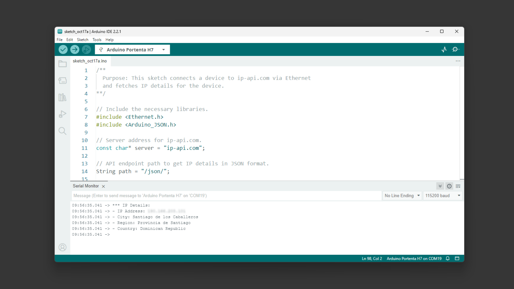

## Overview

This user manual offers a detailed guide on the Portenta Max Carrier, consolidating all its features for easy reference. It will show how to set up, adjust, and assess its main functionalities. This manual will guide as a key to proficiently operate the Portenta Max Carrier, making it suitable for project developments related to industrial automation, manufacturing automation, robotics, and prototyping.


## Hardware and Software Requirements

### Hardware Requirements

* [Portenta Max Carrier](https://store.arduino.cc/products/portenta-max-carrier) (x1)
* [Portenta X8](https://store.arduino.cc/products/portenta-x8) (x1)
* [Portenta C33](https://store.arduino.cc/products/portenta-c33) (x1)
* [Portenta H7](https://store.arduino.cc/products/portenta-h7) (x1)
* USB-C® cable (either USB-C® to USB-A or USB-C® to USB-C®) (x1)
* Wi-Fi® Access Point or Ethernet with Internet access (x1)

### Software Requirements

- [Arduino IDE 1.8.10+](https://www.arduino.cc/en/software), [Arduino IDE 2.0+](https://www.arduino.cc/en/software), or [Arduino Web Editor](https://create.arduino.cc/editor)

## Product Overview

Max Carrier transforms Portenta modules into single-board computers that enable edge AI for high-performance industrial, building automation and robotics applications.
Thanks to dedicated high-density connectors, it can be paired with Portenta X8, H7 or C33, allowing you to easily prototype and deploy your industrial projects.

This Arduino Pro carrier further augments Portenta connectivity options with Fieldbus, LoRa®, Cat-M1 and NB-IoT.
Among the many available plug-and-play connectors there are Gigabit Ethernet, USB-A, audio jacks, microSD, mini-PCIe, MIPI camera, FD-CAN and Serial RS-232/422/485.
Max Carrier can be powered via external supply (6-36V) or battery via the onboard 18650 Li-ion battery connector.


### Carrier Architecture Overview


Here is an overview of the board's architecture's main components shown in the image above:

- **Compatible core**: The board is compatible with Portenta X8 (ABX00049), Portenta H7 (ABX00042/ABX00045/ABX00046), and Portenta C33 (ABX00074). The Portenta H7 and C33 are limited in camera support and the Ethernet speed to 100 Mbit.
  
- **Power management**: The Portenta Max Carrier can either be powered through the power jack (6 ~ 36V DC) or a 18650 Li-ion/LiPo battery (3.7V) that can be used as backup power source if the external power supply fails.

The battery is charged while the minimum input voltage to the power jack is met.

- **USB connectivity**: The Portenta Max Carrier also includes a USB 2.0 Hi-Speed Hub controller based on the USB2514B/M2 that manages the 2 USB devices from the USB type A connector plus the LoRa® and PCIe modules. J15 is protected by a NCP383LMUAJAATXG power switch and current limiter.

  A USB-A female connector is used for data logging and the connection of external peripherals like keyboards, mice, hubs, and similar devices.
  
- **Ethernet connectivity**: The Gigabit Ethernet physical interface (J17) is directly connected to the high density connector to the Portenta board. The connector includes an activity LED indication (orange) and speed indication (green). __Note:__ Gigabit Ethernet functionality is only supported on the Portenta X8.

- **Serial Transceiver**: The Portenta Max Carrier includes a multi-protocol transceiver supporting RS-232, RS-485, and RS-422 serial standards (configurable) based on the SP335 IC. It is connected to a 6P6C Connector (RJ11, RJ12, RJ14, RJ25).

- **CAN Transceiver**: The Portenta Max Carrier includes a high speed CAN transceiver based on the TJA1049T/3J IC. It is connected to a 4P4C connector (RJ9, RJ10, RJ22).

- **Mini PCIe**: The Portenta Max Carrier includes one female mini PCI Express card slot. The connector is right angled and the board includes 2 removable standoffs for external module support. The Max Carrier supports two different Mini PCIe sizes. Pins 8, 10, 12 and 14 are reserved for UIM (in this case SIM).
__Note:__ USB, I2C and SIM functionality over PCIe is available only for the X8. Full PCIe functionality not provided at this time.

- **Cell Modem**: The SARA-R412M-02B is a multi-region modem capable of connecting to 2G/Cat-M1/NB-IoT networks worldwide. A dedicated SMA connector allows for an external antenna. The chip operates over the 1V8 power line. A microSIM slot is available, the corresponding SIM card slot for the cell modem is on the top side of the board, directly adjacent to the module.

- **Audio**: The Portenta Max Carrier enables connections to analog audio channels. This is done through the low power CS42L52 stereo CODEC providing ADC/DAC between analog signals and the I2S protocol. An internal Class D amplifier eliminates the need for external audio amplification circuitry. 

- **LoRa® Module**: The Portenta Max Carrier provides long range wireless connectivity for low bandwidth applications with the onboard Murata CMWX1ZZABZ-078 LoRa® transceiver module. This module operates on 3V3. A dedicated SMA connector allows for an external antenna. 

- **Storage**: The board has a MicroSD card slot for data logging operation and bootloading operation from external memory.

- **Debug interface**: Debugging capabilities are integrated directly into the Portenta Max Carrier and are accessible via microUSB. The J-link debugger is compatible with the Segger® J-Link OB and Blackmagic probes, driven by the STM32F405RGT6 controller. In addition to providing access to the Portenta board JTAG ports, different sniffer channels for I2C, CAN and UART lines. The debugger firmware can be updated via SWD on CN3. Additionally, headers for debugging the LoRa® are accessible via CN2 with SWD
   
- **DIP switch**: The carrier has a DIP switch with two position and allows different profiles depending on the paired Portenta board. The DIP switch has ETH CENTER TAP and BTSEL switches.
  
  when paired with **Portenta X8**, the ETH CENTER TAP will control 1 Gbit Ethernet capacity, while the BTSEL will make the system boot from SD Card memory if turned on or from MMC memory if selected in off position.
  
  The **Portenta H7/C33** will have the 100 Mbit Ethenet capacity controlled by ETH CENTER TAP, but BTSEL does not modify any settings.

### Carrier Topology


| **Ref.** | **Description**                                        | **Ref.**       | **Description**                                           |
| -------- | ------------------------------------------------------ | -------------- | --------------------------------------------------------- |
| U1       | SARA-R412M-02B 4G LTE/Cat-M1/NB-IoT Modem IC           | U2             | CS42L52-CNZ Stereo Codec IC                               |
| U3       | USB2514Bi/M2 4-port USB 2.0 Hub IC                     | U4             | SP335EER1-L RS232/RS485/RS422 Transceiver IC              |
| U5       | TJA1049 CAN Transceiver IC                             | U6             | MPM3550EGLE Non-isolated DC-DC IC                         |
| U7       | NCP383 Current Limiting IC                             | U8,U20,U21,U22 | SN74LVC1T45 Bi-directional logic level converter IC       |
| U9       | DSC6111HI2B 12MHz MEMS Oscillator IC                   | U10            | SN74LVC1G125 Single Bus Buffer Gate IC                    |
| U11      | BQ24195RGET 4.5A Single Cell Charger IC                | U12            | AP7311 1.8V 150mA LDO Linear Regulator IC                 |
| U13      | TPS54620 6A Buck Regulator IC                          | U14            | AP2112K-3.3TRG1 3.3V 600mA LDO Regulator IC               |
| U15      | STM32F405RG 168MHz 32 bit Arm® Cortex®-M4 MCU IC         | U16-U19        | 74LVC1G157 Single 2-input multiplexer IC                  |
| U23      | CMWX1ZZABZ-078 Murrata LoRa® module                    | U24, U25       | LM73100 Ideal Diode with Reverse Polarity Protection      |
| J1, J2   | DF40HC(3.5)-80DS-0.4V(51) High Density Connectors      | J3             | Right-Angle SMA Connector for Modem                       |
| J4       | 2-1734248-0 FPC Connector                              | J5             | FW-20-05-G-D-254-150 Signal Break                         |
| J6       | 615006138421 RS232/RS485 Connector                     | J7             | 615006138421 CAN Connector                                |
| J8       | 1759546-1 Mini PCIe Connector                          | J9             | Right-Angle SMA Connector for LoRa®                       |
| J10      | ZX62-AB-5PA(31) Micro USB Debugger Connector with VBUS | J11            | 114-00841-68 Micro SD Connector                           |
| J12      | SJ-3524-SMT-TR 3.5mm Headphone Out                     | J13            | SJ-3524-SMT-TR 3.5mm Line In Right                        |
| J14      | SJ-3524-SMT-TR 3.5mm Line In Left                      | J15            | 61400826021 2-port USB 2.0 Female Connector               |
| J16      | 254TR Positive Li-ion Terminal                         | J17            | TRJK7003A97NL Gigabit Ethernet Connector                  |
| J18      | 254TR Negative Li-ion Terminal                         |             |  |
| J20      | 110990030 Connector for Speaker                  | X1             | PJ-102A 5.5mm Power Jack Adapter                          |
| CN1      | FTSH-105-01-F-DV 10-pin JTAG Header                    | CN2            | Debug Header                                              |
| CN3      | LoRa® Debug Header                                     | SIM1           | 2199337-5 microSIM Card Holder (for on-board modem)       |
| SW1      | 218-2LPST Boot Select Switch                           | SW2            | 218-2LPST Switch *(2)*                                    |
| PB1      | PTS820J25KSMTRLFS Power On Button                      | PB2            | PTS820J25KSMTRLFS Reset Button                            |

### Pinout

* 

The full __pinout__ is available and downloadable as PDF from the link below:

* [Portenta Max Carrier Full Pinout](https://docs.arduino.cc/resources/pinouts/ABX00043-full-pinout.pdf)

### Datasheet

The full __datasheet__ is available and downloadable as PDF from the link below:

* [Portenta Max Carrier Datasheet](https://docs.arduino.cc/resources/datasheets/ABX00043-datasheet.pdf)

### Schematics

The full __schematics__ are available and downloadable as PDF from the link below:

* [Portenta Max Carrier Schematics](https://docs.arduino.cc/resources/schematics/ABX00043-schematics.pdf)

### STEP Files

The full __STEP__ files are available and downloadable from the link below:

* [Portenta Max Carrier STEP files](assets/ABX00043-step.zip)

## First Use Of Your Portenta Max Carrier
### Stack The Carrier

The Portenta Max Carrier design allows to stack the Portenta board with ease. The following figure shows how the Portenta boards pairs via the High-Density connectors.


With the Portenta mounted to the carrier, you can proceed to power the carrier and begin prototyping.

### Power The Board

The Portenta Max Carrier can be powered using the following methods:

- Using an external **6 to 36V power supply** connected to the `Power Jack` of the board.
- Using a **3.7V 18650 Li-ion battery** inserted in the on-board battery socket.
- Using a USB-C® cable connected to the Portenta core board of your choice. (This option does not power the Modem and Mini PCIe connector).


### Carrier Characteristics Highlight

The Portenta Max Carrier provides its platform to the Portenta X8, H7, and C33 with different capabilities. The following table summarizes the carrier's features depending on the combination of the paired Portenta.

| Function                 | Portenta H7 Support | Portenta X8 Support | Notes                                                                   |
| ------------------------ | ------------------- | ------------------- | ----------------------------------------------------------------------- |
| USB Host                 | USB 1.0             | USB 2.0             | Max Speed: USB 1.0 - 12 Mbps, USB 2.0 - 480 Mbps                        |
| Ethernet                 | Fast Ethernet       | 1 Gbps              | Fast Ethernet - 100 Mbps                                                |
| CAN                      | Yes                 | Yes                 |                                                                         |
| Mini PCIe (USB)          | USB 1.0             | USB 2.0             | Max Speed: USB 1.0 - 12 Mbps, USB 2.0 - 480 Mbps                        |
| Mini PCIe (PCIe)         | No                  | PCIe 2.0            | Portenta H7 only supports USB based PCIe cards                          |
| Battery Charger          | Yes                 | Yes                 |                                                                         |
| LoRa®                    | Yes                 | Yes                 |                                                                         |
| NBIoT/CatM1/2G           | No                  | Yes                 | Communication with the modem is via USB, no firmware support for the H7 |
| Camera                   | No                  | MIPI up to 4 lanes  | No MIPI camera support on H7                                            |
| Audio                    | Limited             | Yes                 | No firmware support for the H7                                          |
| RS232/422/485            | Yes                 | Yes                 |                                                                         |
| on board JTAG  debugging | Yes                 | No                  |                                                                         |
| on board console to USB  | Yes                 | Yes                 |                                                                         |
| on board bus sniffing    | Limited             | Limited             | Only hardware support                                                   |

This provides a general idea how the Portenta Max Carrier will perform depending on the paired Portenta board. Each feature is explained in the following section after quick guide covering how to properly interface the Portenta boards.

### Using Portenta X8 with Linux

### Using Portenta X8 with Arduino
### Using Portenta H7 with Arduino
### Using Portenta C33 with Arduino

## Hello World Carrier
### Hello World Using Linux
A 'Hello World' example will be used to verify the Portenta Max Carrier is correctly operating with the paired Portenta X8. It will use an example to trigger user programmable LED connected to GPIO3.

The user programmable LED can be controlled using commands within the Portenta X8's shell. The following commands will help you set and control the GPIO3, which connects to the user programmable LED.

### Hello World Using Arduino
## High-Density Connectors

## Configuration and Control

Configuration and control features allows customize the device's behavior to their specific needs. Whether it's setting up network connectivity or adjusting switch configurations, this sub-section will guide you through the carrier connectivity and profile setup processes.

### DIP Switch Configuration

The Portenta Max Carrier incorporates two DIP switches, giving users ability to manage the behavior of the board. The configuration parameters of this switches differ based on which Portenta board it is paired with.


For configurations when the Portenta Max Carrier is combined with the __Portenta X8__, the DIP switch governs these settings:

| **Ethernet DIP Switch Designation** |      **Position: ON**     |    **Position: OFF**   |
|:-----------------------------------:|:-------------------------:|:----------------------:|
| 1 - 2                               | Ethernet Disabled         | Ethernet Enabled       |

| **Boot DIP Switch Designation** |      **Position: ON**     |    **Position: OFF**   |
|:-------------------------------:|:-------------------------:|:----------------------:|
| BOOT SEL                        | Reserved for future applications | Reserved for future applications|
| BOOT                            | Boot from SD card Memory  | Boot from MMC Memory   |

When the Portenta Max Carrier is combined with either the __Portenta H7 or C33__, the DIP switch adjustments are as follows:

| **Ethernet DIP Switch Designation** |      **Position: ON**     |    **Position: OFF**   |
|:-----------------------------------:|:-------------------------:|:----------------------:|
| 1 - 2                               | Ethernet Enabled          | Ethernet Disabled      |

| **Boot DIP Switch Designation** |      **Position: ON**     |    **Position: OFF**   |
|:-------------------------------:|:-------------------------:|:----------------------:|
| BOOT SEL                        | Not used                  | Not used               |
| BOOT                            | Enter Boot mode           | Normal Boot (Run)      |

This flexibility ensures that the Portenta Max Carrier remains adaptable to the unique needs of each paired Portenta board.

## Network Connectivity
### Ethernet
The Portenta Max Carrier is equipped with an Ethernet interface, specifically an RJ45 connector supporting 1000 Base-T.


Ethernet performance differs based on the associated Portenta board:

- With the Portenta X8: The system supports 1 Gbit Ethernet.
- When combined with the Portenta H7 or C33: The performance is limited at 100 Mbit Ethernet.

To configure the Ethernet settings, depending on the paired Portenta board, one must use the provided DIP switch located on the Portenta Max Carrier. For an in-depth understanding of the DIP switch, kindly refer to [this section](#dip-switch-configuration).

#### Using a Portenta X8 (Linux)

Using the Portenta X8 in combination with the Max Carrier allows you to evaluate the Ethernet speed. First, ensure the Portenta X8 is mounted on the Max Carrier, and then connect them using a __LAN cable__.

To measure the bandwidth, use the `iperf3` tool, which is available [here](https://github.com/userdocs/iperf3-static).

Enter to your Portenta X8 using `adb shell` and access to root (admin) typing `sudo su -`, the password is `fio` by default.

First, you need an internet connection to download the tool. You can stablish one using the following commands:

```bash
nmcli connection show  # To find the ethernet device name ("eth0" in this case)

nmcli conn add con-name <NtwrkName> type ethernet ifname <DevName> ipv4.method auto # Create a DHCP network. <NtwrkName> will be the custom network alias and <DevName> must be the device name found with the past command.

nmcli conn up <NtwrkName> # Initiate the connection
```

To test if we are successfully connected, let's make a `ping` using:

```bash
ping -c 4 arduino.cc  # ping 4 times to Arduino's webpage
```
If you have a working internet connection, the ping should shows the latency as follows:


To install the `iperf3` tool, we can use the following commands:

```bash
mkdir -p ~/bin && source ~/.profile
wget -qO ~/bin/iperf3 https://github.com/userdocs/iperf3-static/releases/latest/download/iperf3-arm64v8
chmod 700 ~/bin/iperf3
```

To verify the installation, type `~/bin/iperf3 -v` and the tool version should be printed on the terminal.


As the speed test must be done between two devices to measure the link speed, we need to install `iperf3` on a second device, in this case on my PC. You can download it from [here](https://iperf.fr/iperf-download.php) for your preferred OS.

Once installed on both devices, we should set one as a `server` and the other one as a `client` with the following commands respectively:

```bash
~/bin/iperf3 -s # run this on the Portenta X8 (Server)
```
```bash
iperf3.exe -c <Server IP Address> # run this on your PC (Windows) and use the Portenta X8 IP address.
```


***The speed results could be affected by your Ethernet cables quality or your PC Ethernet card.***

#### Using a Portenta H7 (Arduino)

To test the Ethernet connection using a Portenta H7 we are going to use an example sketch that will retrieve your City information from the internet and show it through the Serial Monitor.

```arduino
/**
  Purpose: This sketch connects a device to ip-api.com via Ethernet
  and fetches IP details for the device.
**/

// Include the necessary libraries.
#include <PortentaEthernet.h> // for Portenta H7 
//#include <EthernetC33.h>  // for Portenta C33
#include <Arduino_JSON.h>

// Server address for ip-api.com.
const char* server = "ip-api.com";

// API endpoint path to get IP details in JSON format.
String path = "/json/";

// Ethernet client instance for the communication.
EthernetClient client;

// JSON variable to store and process the fetched data.
JSONVar doc;

// Variable to ensure we fetch data only once.
bool dataFetched = false;

void setup() {
  // Begin serial communication at a baud rate of 115200.
  Serial.begin(115200);

  // Wait for the serial port to connect,
  // This is necessary for boards that have native USB.
  while (!Serial);

  // Attempt to start Ethernet connection via DHCP,
  // If DHCP failed, print a diagnostic message.
  if (Ethernet.begin() == 0) {
    Serial.println("- Failed to configure Ethernet using DHCP!");

  }
  printIPAddress();
  delay(2000);
}

void loop() {
  // Ensure we haven't fetched data already,
  // ensure the Ethernet link is active,
  // establish a connection to the server,
  // compose and send the HTTP GET request.
  if (!dataFetched) {
    if (Ethernet.linkStatus() == LinkON) {
      if (client.connect(server, 80)) {
        client.print("GET ");
        client.print(path);
        client.println(" HTTP/1.1");
        client.print("Host: ");
        client.println(server);
        client.println("Connection: close");
        client.println();

        // Wait and skip the HTTP headers to get to the JSON data.
        char endOfHeaders[] = "\r\n\r\n";
        client.find(endOfHeaders);

        // Read and parse the JSON response.
        String payload = client.readString();
        doc = JSON.parse(payload);

        // Check if the parsing was successful.
        if (JSON.typeof(doc) == "undefined") {
          Serial.println("- Parsing failed!");
          return;
        }

        // Extract and print the IP details.
        Serial.println("*** IP Details:");
        Serial.print("- IP Address: ");
        Serial.println((const char*)doc["query"]);
        Serial.print("- City: ");
        Serial.println((const char*)doc["city"]);
        Serial.print("- Region: ");
        Serial.println((const char*)doc["regionName"]);
        Serial.print("- Country: ");
        Serial.println((const char*)doc["country"]);
        Serial.println("");

        // Mark data as fetched.
        dataFetched = true;
      }
      // Close the client connection once done.
      client.stop();
    } else {
      Serial.println("- Ethernet link disconnected!");
    }
  }
}

void printIPAddress()
{
  Serial.print("Connected to: ");
  for (byte thisByte = 0; thisByte < 4; thisByte++) {
    // print the value of each byte of the IP address:
    Serial.print(Ethernet.localIP()[thisByte], DEC);
    Serial.print(".");
  }

  Serial.println();
}
```



### LTE CAT.M1 NB-IoT

### LoRa®

One feature that boosts Portenta's Max Carrier possibilities is its onboard LoRa® module, the CMWX1ZZABZ-078 from Murata®. LoRaWAN® is a Low Power Wide Area Network (LPWAN) designed to connect low power devices to the Internet. It was developed to meet and fulfill Internet of Things (IoT) devices' requirements, such as low-power consumption and low data throughput.

A dedicated SMA connector (J9) allows for an external antenna.


To learn how leverage LoRa® capabilities with this carrier, follow this detailed tutorial on [How to Connect the Portenta Max Carrier with The Things Network using a Portenta H7](https://docs.arduino.cc/tutorials/portenta-max-carrier/connecting-to-ttn)

## Mini PCIe
## MIPI Camera
## Audio Interface
## USB Interface
## MicroSD Storage

The available microSD card slot offers the advantage of expanded storage. This is especially beneficial for processing large volumes of log data, whether from sensors or the onboard computer registry. For the Portenta X8, the microSD can also serve as an external boot source.


### Using Linux

To begin using a microSD card, enter to your Portenta X8 using `adb shell` and access to root (admin) typing `sudo su -`, the password is `fio` by default.

Use the following command to pull a Docker container that assists in setting up the necessary elements for interacting with the microSD card:

```bash
docker run -it --cap-add SYS_ADMIN --device /dev/mmcblk1p1 debian:stable-slim bash
```

The command above will run the image immediately after the container image has been successfully pulled. You will find yourself inside the container once it is ready for use.

You will need to identify the partition scheme where the microSD card is located. If a partition table does not exist for the microSD card, you will have to use the `fdisk` command to create its partitions.

Inside the container, you can use the following commands.

To determine if the Portenta X8 has recognized the microSD card, you can use one of the following commands:

```bash
lsblk

# or
fdisk -l
```

The microSD card usually appears as `/dev/mmcblk0` or `/dev/sdX`. Where X can be a, b, c, etc. depending on other connected storage devices.

Before accessing the contents of the microSD card, it needs to be mounted. For convenient operation, create a directory that will serve as the mount point:

```bash
mkdir -p /tmp/sdcard
```

Use the following command to mount the microSD card to the previously created directory. Ensure you replace `XX` with the appropriate partition number (e.g., p1 for the first partition):

```bash
mount /dev/mmcblk1p1 /tmp/sdcard
```

Navigate to the mount point and list the contents of the SD card:

```bash
cd /tmp/sdcard
ls
```


To write data to the microSD card, you can use the `echo` command. For example, type the following code to create a file named `hello.txt` with the content `"Hello World Carrier!"`:

```bash
echo "Hello World Carrier!" > hello.txt
```

To read the contents of the file you have just created:

```bash
cat hello.txt
```

This will print on your shell the contents that were saved to the `hello.txt` file.

Once you are done with the operations related to microSD card, it is important to unmount it properly:

```bash
umount /tmp/sdcard
```


***Warning: If you need to format the micro SD card to the _ext4_ filesystem, use the following command.***

Please be cautious, since this command will erase all the existing data on the microSD card.
```bash
mkfs.ext4 /dev/mmcblk1p1  #Warning: this will erase everything on your micro SD
```

### Using Arduino IDE
For Portenta H7, you can use the following Arduino IDE script to test mounted SD card within Portenta Hat Carrier:

This example can also be found on the Arduino IDE builtin examples on **File > Examples > Portenta_SDCARD > TestSDCARD**

```arduino
#include "SDMMCBlockDevice.h"
#include "FATFileSystem.h"

SDMMCBlockDevice block_device;
mbed::FATFileSystem fs("fs");

void setup() {
  Serial.begin(9600);
  while (!Serial);

  Serial.println("Mounting SDCARD...");
  int err =  fs.mount(&block_device);
  if (err) {
    // Reformat if we can't mount the filesystem
    // this should only happen on the first boot
    Serial.println("No filesystem found, formatting... ");
    err = fs.reformat(&block_device);
  }
  if (err) {
     Serial.println("Error formatting SDCARD ");
     while(1);
  }
  
  DIR *dir;
  struct dirent *ent;
  int dirIndex = 0;

  Serial.println("List SDCARD content: ");
  if ((dir = opendir("/fs")) != NULL) {
    // Print all the files and directories within directory (not recursively)
    while ((ent = readdir (dir)) != NULL) {
      Serial.println(ent->d_name);
      dirIndex++;
    }
    closedir (dir);
  } else {
    // Could not open directory
    Serial.println("Error opening SDCARD\n");
    while(1);
  }
  if(dirIndex == 0) {
    Serial.println("Empty SDCARD");
  }
}

void loop() {
  // Empty
}

```

With this code the Portenta H7 will scan all the files and directories names on the micro SD card and list them on the Arduino IDE Serial Monitor.


For Portenta C33, you can use the following Arduino IDE script:

This example can also be found on the Arduino IDE builtin examples on **File > Examples > Storage > TestSDCARD**.

```arduino
#include <vector>
#include <string>
#include "SDCardBlockDevice.h"
#include "FATFileSystem.h"

#define TEST_FS_NAME "fs"
#define TEST_FOLDER_NAME "TEST_FOLDER"
#define TEST_FILE "test.txt"
#define DELETE_FILE_DIMENSION 150


SDCardBlockDevice block_device(PIN_SDHI_CLK, PIN_SDHI_CMD, PIN_SDHI_D0, PIN_SDHI_D1, PIN_SDHI_D2, PIN_SDHI_D3, PIN_SDHI_CD, PIN_SDHI_WP);
FATFileSystem fs(TEST_FS_NAME);

std::string root_folder       = std::string("/") + std::string(TEST_FS_NAME);
std::string folder_test_name  = root_folder + std::string("/") + std::string(TEST_FOLDER_NAME);
std::string file_test_name    = folder_test_name + std::string("/") + std::string(TEST_FILE); 

void setup() {
  /*
   *  SERIAL INITIALIZATION
   */
  Serial.begin(9600);
  while(!Serial) {
     
  }

  /* list to store all directory in the root */
  std::vector<std::string> dir_list;

  Serial.println();
  Serial.println("##### TEST SD CARD with FAT FS");
  Serial.println();

  /* 
   *  MOUNTING SDCARD AS FATFS filesystem
   */
  Serial.println("Mounting SDCARD...");
  int err =  fs.mount(&block_device);
  if (err) {
    // Reformat if we can't mount the filesystem
    // this should only happen on the first boot
    Serial.println("No filesystem found, formatting... ");
    err = fs.reformat(&block_device);
  }
  if (err) {
     Serial.println("Error formatting SDCARD ");
     while(1);
  }

  /* 
   *  READING root folder
   */
  
  DIR *dir;
  struct dirent *ent;
  int dirIndex = 0;

  Serial.println("*** List SD CARD content: ");
  if ((dir = opendir(root_folder.c_str())) != NULL) {
    while ((ent = readdir (dir)) != NULL) {
      
      if(ent->d_type == DT_REG) {
        Serial.print("- [File]: ");
      }
      
      else if(ent->d_type == DT_DIR) {
        Serial.print("- [Fold]: ");
        dir_list.push_back(ent->d_name);
      }
      Serial.println(ent->d_name);
      dirIndex++;
    }
    closedir (dir);
  } 
  else {
    // Could not open directory
    Serial.println("Error opening SDCARD\n");
    while(1);
  }

  if(dirIndex == 0) {
    Serial.println("Empty SDCARD");
  }

  bool found_test_folder = false;

  /* 
   *  LISTING CONTENT of the first level folders (the one immediately present in root folder)
   */

  if(dir_list.size()) {
    Serial.println();
    Serial.println("Listing content of folders in root: ");
  }
  for(unsigned int i = 0; i < dir_list.size(); i++) {
    if(dir_list[i] == TEST_FOLDER_NAME) {
      found_test_folder = true;
    }
    Serial.print("- ");
    Serial.print(dir_list[i].c_str());
    Serial.println(":");
    
    std::string d = root_folder + std::string("/") + dir_list[i];
    if ((dir = opendir(d.c_str())) != NULL) {
      while ((ent = readdir (dir)) != NULL) {
        if(ent->d_type == DT_REG) {
          Serial.print("   - [File]: ");
        }
        else if(ent->d_type == DT_DIR) {
          Serial.print("   - [Fold]: ");
        }
        Serial.println(ent->d_name);
      }
      closedir (dir);
    }
    else {
      Serial.print("ERROR OPENING SUB-FOLDER ");
      Serial.println(d.c_str());
    }
  }

  /* 
   *  CREATING TEST FOLDER (if does not exist already)
   */

  err = 0;
  if(!found_test_folder) {
    Serial.println("TEST FOLDER NOT FOUND... creating folder test"); 
    err = mkdir(folder_test_name.c_str(), S_IRWXU | S_IRWXG | S_IRWXO);
    if(err != 0) {
      Serial.print("FAILED folder creation with error ");
      Serial.println(err);
    }
  }

  /* 
   *  READING TEST FILE CONTENT
   */
  
  if(err == 0) {
    int file_dimension = 0; 
    FILE* fp = fopen(file_test_name.c_str(), "r");
    if(fp != NULL) {
      Serial.print("Opened file: ");
      Serial.print(file_test_name.c_str());
      Serial.println(" for reading");
      
      fseek(fp, 0L, SEEK_END);
      int numbytes = ftell(fp);
      fseek(fp, 0L, SEEK_SET);  

      Serial.print("Bytes in the file: ");
      Serial.println(numbytes);
      file_dimension = numbytes;

      if(numbytes > 0) {
        Serial.println();
        Serial.println("-------------------- START FILE CONTENT --------------------");
      }
      
      for(int i = 0; i < numbytes; i++) {
        char ch;
        fread(&ch, sizeof(char), 1, fp);
        Serial.print(ch);
      }

      if(numbytes > 0) {
        Serial.println("--------------------- END FILE CONTENT ---------------------");
        Serial.println();
      }
      else {
        Serial.println("File is EMPTY!");
        Serial.println();
      }
    
      fclose(fp);
    }
    else {
      Serial.print("FAILED open file ");
      Serial.println(file_test_name.c_str());
    }

    /*
     * DELETE FILE IF THE File dimension is greater than 150 bytes
     */

    if(file_dimension > DELETE_FILE_DIMENSION) {
      Serial.println("Test file reached the delete dimension... deleting it!");
      if(remove(file_test_name.c_str()) == 0) {
        Serial.println("TEST FILE HAS BEEN DELETED!");
      }
    }
    
    /*
     * APPENDING SOMETHING TO FILE 
     */
     
    fp = fopen(file_test_name.c_str(), "a");
    if(fp != NULL) {
      Serial.print("Opened file: ");
      Serial.print(file_test_name.c_str());
      Serial.println(" for writing (append)");
      char text[] = "This line has been appended to file!\n";
      fwrite(text, sizeof(char), strlen(text), fp);
      fclose(fp); 
    }
    else {
      Serial.print("FAILED open file for appending ");
      Serial.println(file_test_name.c_str());
    }
    
    /*
     * READING AGAIN FILE CONTENT
     */
    
    fp = fopen(file_test_name.c_str(), "r");
    if(fp != NULL) {
      Serial.print("Opened file: ");
      Serial.print(file_test_name.c_str());
      Serial.println(" for reading");
      
      fseek(fp, 0L, SEEK_END);
      int numbytes = ftell(fp);
      fseek(fp, 0L, SEEK_SET);  

      Serial.print("Bytes in the file: ");
      Serial.println(numbytes);

      if(numbytes > 0) {
        Serial.println();
        Serial.println("-------------------- START FILE CONTENT --------------------");
      }
      
      for(int i = 0; i < numbytes; i++) {
        char ch;
        fread(&ch, sizeof(char), 1, fp);
        Serial.print(ch);
      }

      if(numbytes > 0) {
        Serial.println("--------------------- END FILE CONTENT ---------------------");
        Serial.println();
      }
      else {
        Serial.println("File is EMPTY!");
        Serial.println();
      }
    
      fclose(fp);
      
    }
    else {
      Serial.print("FAILED open file for appending ");
      Serial.println(file_test_name.c_str());
    }
  }  
  
}

void loop() {
  // Empty
}

```

With this code the Portenta C33 will scan all the files and directories names on the micro SD card and list them on the Arduino IDE Serial Monitor, also create a test file and read it back.


## CAN Bus (Onboard Transceiver)

## JTAG Pins
For developers aiming to investigate and understand the intricate details of development, the Portenta Hat Carrier features a built-in JTAG interface. This tool is crucial for hardware debugging, offering real-time observation. Through the JTAG pins, users can smoothly debug and program, guaranteeing accurate and optimal device performance.


The pins used for the JTAG debug port on the Portenta Hat Carrier are the following:

| **Pin number** | **Power Net** | **Portenta HD Standard Pin** |                         **High-Density Pin**                         | **Interface** |
|:--------------:|:-------------:|:----------------------------:|:--------------------------------------------------------------------:|:-------------:|
|        1       | +3V3_PORTENTA |              VCC             |                      J2-23, J2-34, J2-43, J2-69                      |               |
|        2       |               |           JTAG_SWD           |                                 J1-75                                |    JTAG SWD   |
|        3       |      GND      |              GND             | J1-22, J1-31, J1-42, J1-47, J1-54, J2-24, J2-33, J2-44, J2-57, J2-70 |               |
|        4       |               |           JTAG_SCK           |                                 J1-77                                |    JTAG SCK   |
|        5       |      GND      |              GND             | J1-22, J1-31, J1-42, J1-47, J1-54, J2-24, J2-33, J2-44, J2-57, J2-70 |               |
|        6       |               |           JTAG_SWO           |                                 J1-79                                |    JTAG SWO   |
|        7       |               |              NC              |                                  NC                                  |               |
|        8       |               |           JTAG_TDI           |                                 J1-78                                |    JTAG TDI   |
|        9       |               |           JTAG_TRST          |                                 J1-80                                |   JTAG TRST   |
|       10       |               |           JTAG_RST           |                                 J1-73                                |    JTAG RST   |

## Communication
### SPI
### I2C
### CAN Bus

The CAN bus, short for Controller Area Network bus, is a resilient communication protocol created by Bosch® in the 1980s for vehicles. It lets microcontrollers and devices interact without a central computer. Using a multi-master model, any system device can send data when the bus is available.

This approach ensures system continuity even if one device fails and is especially effective in electrically noisy settings like in vehicles, where various devices need reliable communication.

The Portenta Max Carrier is equipped with CAN bus communication capabilities, powered by the TJA1049 module - a high-speed CAN FD transceiver. With this, developers can leverage the robustness and efficiency of CAN communication in their projects.

#### Using Linux
#### Using Arduino IDE

For users working with the Portenta H7 or Portenta C33, the following simple examples can be used to test the CAN bus protocol's capabilities.

The CAN interface on the Portenta Max Carrier must be enabled before using it. To do it, turning an specific pin to `LOW` is neccessary:

__For the Portenta H7__:
```arduino
  pinMode(PG_7, OUTPUT);
  digitalWrite(PG_7, LOW);  // enable the CAN interface
```

__For the Portenta C33__:
```arduino
  pinMode(PIN_CAN1_STBY, OUTPUT);
  digitalWrite(PIN_CAN1_STBY, LOW); // enable the CAN interface
```

The _CAN Read_ example for Portenta H7/C33 starts CAN communication at a rate of _500 kbps_ and continuously listens for incoming messages, displaying such information upon receipt.

```arduino
#include <Arduino_CAN.h>

void setup()
{
  Serial.begin(115200);

  // Enabling the CAN bus interface
#ifdef ARDUINO_PORTENTA_C33
  pinMode(PIN_CAN1_STBY, OUTPUT);
  digitalWrite(PIN_CAN1_STBY, LOW);
#elif ARDUINO_PORTENTA_H7_M7
  pinMode(PG_7, OUTPUT);
  digitalWrite(PG_7, LOW);
#endif

  while (!Serial) { }   // open the serial monitor to start receiving

  if (!CAN.begin(CanBitRate::BR_500k))
  {
    Serial.println("CAN.begin(...) failed.");
    for (;;) {}
  }
  Serial.println("CAN.begin(...) Successful.");
}

void loop()
{
  if (CAN.available())
  {
    CanMsg const msg = CAN.read();
    Serial.println(msg);
  }
}
```

The _CAN Write_ example, also set at _500 kbps_, builds and sends a specific message format. This message includes a fixed preamble followed by an incrementing counter value that updates with each loop iteration.

```arduino
#include <Arduino_CAN.h>

static uint32_t const CAN_ID = 0x20;

void setup()
{
  Serial.begin(115200);

  // Enabling the CAN bus interface
#ifdef ARDUINO_PORTENTA_C33
  pinMode(PIN_CAN1_STBY, OUTPUT);
  digitalWrite(PIN_CAN1_STBY, LOW);
#elif ARDUINO_PORTENTA_H7_M7
  pinMode(PG_7, OUTPUT);
  digitalWrite(PG_7, LOW);
#endif

  while (!Serial) { }   // open the serial monitor to start sending

  if (!CAN.begin(CanBitRate::BR_500k))
  {
    Serial.println("CAN.begin(...) failed.");
    for (;;) {}
  }
  Serial.println("CAN.begin(...) Successful.");
}

static uint32_t msg_cnt = 0;

void loop()
{
  /* Assemble a CAN message with the format of
   * 0xCA 0xFE 0x00 0x00 [4 byte message counter]
   */
  uint8_t const msg_data[] = {0xCA,0xFE,0,0,0,0,0,0};
  memcpy((void *)(msg_data + 3), &msg_cnt, sizeof(msg_cnt));
  CanMsg const msg(CanStandardId(CAN_ID), sizeof(msg_data), msg_data);

  /* Transmit the CAN message, capture and display an
   * error core in case of failure.
   */
  if (int const rc = CAN.write(msg); rc < 0)
  {
    Serial.print  ("CAN.write(...) failed with error code ");
    Serial.println(rc);
    for (;;) { }
  }

  /* Increase the message counter. */
  msg_cnt++;

  /* Only send one message per second. */
  delay(1000);
}
```

As a pratical example, we are going to communicate the __Max Carrier__ using a Portenta C33 with a __Portenta Machine Control__ using CAN.


- __For the Portenta C33:__ Use the writing example from above.
- __For the Portenta Machine Control:__ Install the `Arduino_MachineControl.h` library from the Library Manager and use the following example sketch:

```arduino
#include <Arduino_MachineControl.h>
#include <CAN.h>

using namespace machinecontrol;

#define DATARATE_500KB 500000

void setup() {
  Serial.begin(9600);
  while (!Serial) {
    ;  // wait for serial port to connect.
  }

  Serial.println("Start CAN initialization");
  comm_protocols.enableCAN();
  comm_protocols.can.frequency(DATARATE_500KB);
  Serial.println("Initialization done");
}


void loop() {
  mbed::CANMessage msg;
  if (comm_protocols.can.read(msg)) {

    // Print the sender ID
    Serial.print("ID: ");
    Serial.println(msg.id, HEX);

    // Print the Payload Bytes
    Serial.print("Message received: ");
    for (int i = 0; i < 4; i++) {
      Serial.print("0x");
      Serial.print(msg.data[i], HEX);
      Serial.print('\t');
    }
    Serial.println();
  }

  delay(100);
}

```


### Serial RS-232 / RS-422 / RS-485
### UART

## Support

If you encounter any issues or have questions while working with the Portenta Max Carrier, we provide various support resources to help you find answers and solutions.

### Help Center

Explore our Help Center, which offers a comprehensive collection of articles and guides for the Portenta Max Carrier. The Arduino Help Center is designed to provide in-depth technical assistance and help you make the most of your device.

- [Portenta Max Carrier help center page](https://support.arduino.cc/hc)

### Forum

Join our community forum to connect with other Portenta Max Carrier users, share your experiences, and ask questions. The forum is an excellent place to learn from others, discuss issues, and discover new ideas and projects related to the Portenta Max Carrier.

- [Portenta Max Carrier category in the Arduino Forum](https://forum.arduino.cc/c/hardware/portenta/portenta-max-carrier/175)

### Contact Us

Please get in touch with our support team if you need personalized assistance or have questions not covered by the help and support resources described before. We're happy to help you with any issues or inquiries about the Portenta Max Carrier.

- [Contact us page](https://www.arduino.cc/pro/contact-us)