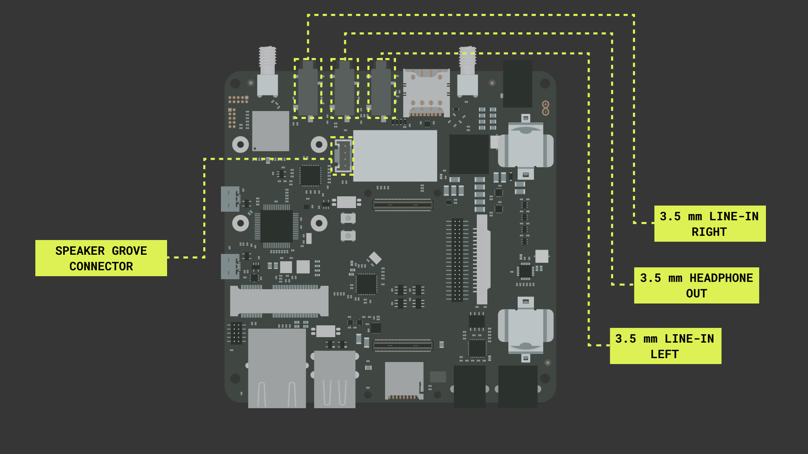
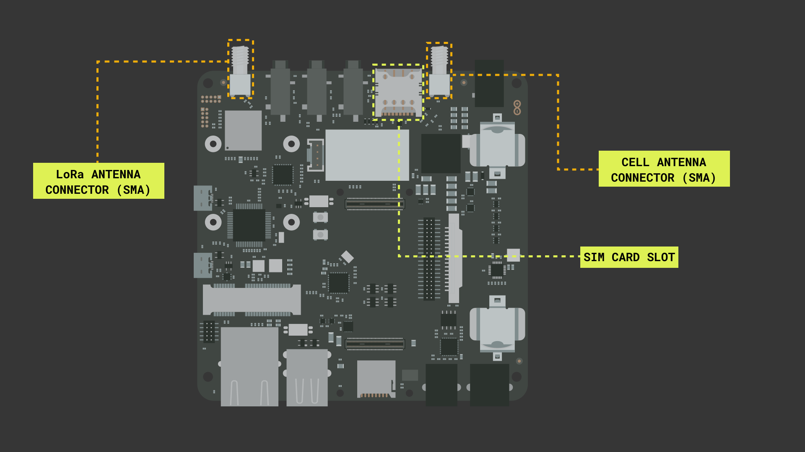
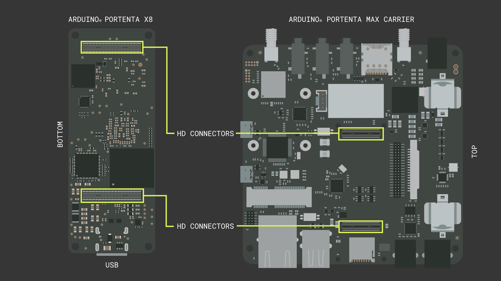

## Introduction 

Using the Portenta X8 with the Portenta Max Carrier enables a large suite of peripherals and features. With the Portenta X8 it is possible to use Linux containers and Python® scripts, it is also possible to use the M4 core on the board to interface with the Portenta Max Carrier. In this tutorial we will focus on the peripherals and features that are available to us.

## Goals

The goals of this project are:

- Learn how to connect the Portenta X8 and Portenta Max Carrier
- Learn about the Portenta Max Carrier's headers, peripherals and connectors

### Required Hardware and Software

- [Arduino® Portenta X8](https://store.arduino.cc/products/portenta-x8)
- [Arduino® Portenta Max Carrier](https://store.arduino.cc/products/portenta-max-carrier)

## The Portenta Max Carrier

The Arduino® Portenta Max Carrier was designed to add capabilities to the Arduino® Portenta X8 board and provide easy access to its on-board peripherals. It is designed to enable research and develop industrial grade advanced applications, from fast prototyping to deployable robust single board computer.

To make use of the Portenta Max Carrier you will need to power it through either the barrel jack connector or with a 3.7V 18650 Li-Ion battery, connected to the Portenta Max Carriers battery clips.

| Function                 | Supported on the Portenta X8 M4 Core | Supported on Portenta X8's NXP® i.MX 8M Mini Processor |
| ------------------------ | ------------------------------------ | ------------------------------------------------------ |
| USB Host                 | USB 1.0                              | USB 2.0                                                |
| Ethernet                 | Fast Ethernet                        | 1 Gbps                                                 |
| CAN                      | Yes                                  | Yes                                                    |
| Mini PCIe (USB)          | USB 1.0                              | USB 2.0                                                |
| Mini PCIe (PCIe)         | No                                   | PCIe 2.0                                               |
| Battery Charger          | Yes                                  | Yes                                                    |
| LoRa®                    | Yes (additional software required)   | Yes (additional software required)                     |
| NBIoT/CatM1/2G           | Yes (additional software required)   | Yes (additional software required)                     |
| Camera                   | No                                   | MIPI up to 4 lanes                                     |
| Audio                    | Limited                              | Yes                                                    |
| RS232/422/485            | Yes                                  | Yes                                                    |
| on board JTAG  debugging | Yes                                  | No                                                     |
| on board console to USB  | Yes                                  | Yes                                                    |
| on board bus sniffing    | Limited                              | Limited                                                |


## Peripherals

### Memory

The Portenta Max Carrier equips two different memory units on-board, a flash memory and a mini SD card slot. The Flash memory on-board the Portenta Max Carrier has 2 MB of storage via QSPI. The Mini SD card interface makes it possible to extend the storage size. It can be used to process log data, from sensors or programmed on-board computer registry.

If you have a sd card connected to the Max Carrier you can create a directory on the sd card by using the following command:
```python
mkdir -p /tmp/sdcard
```

### Audio Interfaces

The Portenta Max Carrier features the CS42L52 from Cirrus Logic®, a stereo CODEC. The CS42L52 is a 24-bit, low-power stereo CODEC that can provide up to 1W per channel of Class D stereo/mono amplification to external speakers or enough power to drive 44mW per channel into stereo headphones. There are four analog audio interfaces on the Portenta Max Carrier, these are marked on the image below.



To use this feature with Linux, you could use something like the [alsa-lib](https://github.com/alsa-project/alsa-lib). You can run it with this command:
```python
apk update && apk add alsa-utils alsa-utils-doc alsa-lib alsaconf alsa-ucm-conf && speaker-test -t sine -f 440 -c 2 -r 48000 -D hw:0,0
```

## Connectivity

### GSM Modem

The Portenta Max Carrier carries a cellular modem SARA-R412M-02B to carry out tasks requiring general network connectivity. This cellular modem is capable of establishing 2G / Cat-M1 / NB-IoT connections globally. It is powered by bidirectional logic level shifter SN74LVC1T45 and an internal regulator, implemented for the use of SIM card and I/O. The cellular modem requires a SIM card and an antenna connected to the SMA connector.



If you want to use this feature with Python® scripts, have a look at the [Modem Manager api](https://www.freedesktop.org/software/ModemManager/doc/latest/ModemManager/).

### LoRa®

One of the many features of the Portenta Max Carrier is the Murata CMWX1ZZABZ-078 that enables LoRaWAN® connectivity. LoRaWAN® is a Low Power Wide Area Network (LPWAN) designed to connect low power devices to the Internet. It was developed to meet and fulfill Internet of Things (IoT) devices' requirements, such as low-power consumption and low data throughput.

The appropriate antenna and frequencies depends on the region. The common frequencies are 915 MHz for North America and Australia, and 863 MHz for European region. Frequencies are on a range, so for example Australia region it is possible to use 928 MHz compatible antenna and configuration.

For more in-depth information about LoRa® and LoRaWAN®, please read [The Arduino Guide to LoRa® and LoRaWAN®](https://docs.arduino.cc/learn/communication/lorawan-101).

### Ethernet

The Gigabit Ethernet physical interface is directly connected to the high density connector to the Portenta X8 board. The connector includes a LED for indicating activity using the color orange, there is also a LED using the color green to indicate speed.

To access the 1 Gbps connection Ethernet peripheral on the Max Carrier you can use the following command:
```python
ETH_1G=`dmesg | grep "fec 30be0000.ethernet eth0: Link is Up - 1Gbps/Full"`
```

## Instructions

### Circuit

The Portenta Max Carrier and the Portenta X8 are connected with High Density connectors. The illustration below shows how to correctly connect the Portenta X8 and Portenta Max Carrier.



### Setting up Portenta X8

If you wish to use the Portenta X8 and Max Carrier with the Arduino IDE, please follow our [Uploading sketches to Arduino Portenta X8 tutorial](/tutorials/portenta-x8/uploading-sketches-m4). Also, make sure that you have the latest version of the Portenta Core installed. Go to **Tools > Boards > board manager...** and search for **Arduino Mbed OS Portenta boards**. When this is installed and your Portenta X8 board is connected to the computer, the board should be assigned a port in the Arduino IDE.

If you want to use the Portenta X8 and Max Carrier with a FoundriesFactory, Python® scripts and Linux containers, Please take a look at our [Portenta X8 User Manual](/tutorials/portenta-x8/01.user-manual). You may also find our tutorial on how to [manage dockers on the Portenta X8](/tutorials/portenta-x8/05.docker-container) useful.

## Quick Reference Tables for the Portenta Max Carrier

### Peripheral Table

| PERIPHERAL             | PIN                                                                | FUNCTION    | TYPE    | DESCRIPTION                             |
| ---------------------- | ------------------------------------------------------------------ | ----------- | ------- | --------------------------------------- |
| **LoRa® Header**       |                                                                    |             |         |                                         |
|                        | 1                                                                  | +3V3        | Power   | +3V3 Power Rail                         |
|                        | 2                                                                  | LoRa_SWDIO  | Digital | LoRa® SWD Data Line                     |
|                        | 3, 5, 9                                                            | GND         | Power   | Ground                                  |
|                        | 6 ~ 8                                                              | NC          | NC      | Not Connected                           |
|                        | 4                                                                  | LoRa_SWCLK  | Digital | LoRa® SWD Clock Line                    |
|                        | 10                                                                 | LORA_RST    | Digital | LoRa® module reset pin                  |
| **Debug Header**       |                                                                    |             |         |                                         |
|                        | 1                                                                  | 3V3_DBG     | Power   | +3V3 Power Rail                         |
|                        | 2                                                                  | DBG_SWDIO   | Digital | SWD Data Line                           |
|                        | 3, 5, 9                                                            | GND         | Power   | Ground                                  |
|                        | 4                                                                  | DBG_SWCLK   | Digital | SWD Clock Line                          |
|                        | 6 ~ 8                                                              | NC          | NC      | Not Connected                           |
|                        | 10                                                                 | RST         | Digital | Reset Pin                               |
| **JTAG Header**        |                                                                    |             |         |                                         |
|                        | 1                                                                  | 3V3         | Power   | +3V3 Power Rail                         |
|                        | 2                                                                  | JTAG_SWD    | Digital | JTAG SWD Data Line                      |
|                        | 3, 5                                                               | GND         | Power   | Ground                                  |
|                        | 4                                                                  | JTAG_SCK    | Digital | JTAG Clock Line                         |
|                        | 6                                                                  | JTAG_SWO    | Digital | JTAG Trace Data Line                    |
|                        | 7                                                                  | NC          | NC      | Not Connected                           |
|                        | 8                                                                  | JTAG_TDI    | Digital | JTAG Test Data In Line                  |
|                        | 9                                                                  | JTAG_TRST   | Digital | JTAG Test Reset Line                    |
|                        | 10                                                                 | JTAG_RST    | Digital | JTAG Reset Line                         |
| **Header Connector**   |                                                                    |             |         |                                         |
|                        | 1                                                                  | 3V3         | Power   | +3V3 Power Rail                         |
|                        | 2, 13, 14                                                          | GND         | Power   | Ground                                  |
|                        | 3                                                                  | VREF_P      | Analog  | Positive Analog Voltage Reference       |
|                        | 4                                                                  | VREF_N      | Analog  | Negative Analog Voltage Reference       |
|                        | 5 ~ 12                                                             | A0 ~ A7     | Analog  | Analog input 0 ~ 7                      |
|                        | 15                                                                 | SAI_CK      | Digital | SAI Clock Line                          |
|                        | 16                                                                 | CS          | Digital | SPI1 Clock Select                       |
|                        | 17                                                                 | SAI_FS      | Digital | SAI Frame Synchronization               |
|                        | 18                                                                 | CK          | Digital | SPI1 Clock Line                         |
|                        | 19                                                                 | SAI_D0      | Digital | SAI Data Line 0                         |
|                        | 20                                                                 | MISO        | Digital | SPI Main In Secondary Out               |
|                        | 21                                                                 | SAI_D1      | Digital | SAI Data Line 1                         |
|                        | 22                                                                 | MOSI        | Digital | SPI1 Main Out Secondary In              |
|                        | 23                                                                 | SPDIF_TX    | Digital | SPDIF Transmission                      |
|                        | 24                                                                 | TX          | Digital | Serial3 Transmission                    |
|                        | 25                                                                 | SPDIF_RX    | Digital | SPDIF Receive                           |
|                        | 26                                                                 | RX          | Digital | Serial3 Receive                         |
|                        | 27                                                                 | SDA         | Digital | I2C1 Data Line                          |
|                        | 28                                                                 | RTS         | Digital | Serial3 Ready to Send                   |
|                        | 29                                                                 | SCL         | Digital | I2C1 Clock Line                         |
|                        | 30                                                                 | CTS         | Digital | Serial3 Clear to Send                   |
|                        | 31                                                                 | 3V8         | Power   | +3V8 Power Rail                         |
|                        | 32                                                                 | SDA         | Digital | I2C2 Data Line                          |
|                        | 33                                                                 | PWM0        | Digital | PWM Output 0                            |
|                        | 34                                                                 | SCL         | Digital | I2C2 Clock Line                         |
|                        | 35                                                                 | PWM1        | Digital | PWM Output 1                            |
|                        | 36                                                                 | 5V          | Power   | +5V Power Rail                          |
|                        | 37                                                                 | PWM2        | Digital | PWM Output 2                            |
|                        | 38                                                                 | CAN1_TX     | Digital | CAN Transmission Line                   |
|                        | 39                                                                 | PWM3        | Digital | PWM Output 3                            |
|                        | 40                                                                 | CAN1_RX     | Digital | CAN Receive Line                        |
| **4P4C CAN Connector** |                                                                    |             |         |                                         |
|                        | 1                                                                  | 5V          | Power   | +5V (Fused)                             |
|                        | 2                                                                  | CANL        | Diff.   | CAN Differential Signal Low             |
|                        | 3                                                                  | CANH        | Diff.   | CAN Differential Signal High            |
|                        | 4                                                                  | GND         | Power   | Ground                                  |
| **6P6C Serial Conn.**  |                                                                    |             |         |                                         |
|                        | 1                                                                  | GND         | Power   | Ground                                  |
|                        | 2                                                                  | Z           | Digital | SP335 Out 1                             |
|                        | 3                                                                  | Y           | Digital | SP335 Out 2                             |
|                        | 4                                                                  | A           | Digital | SP335 In 2                              |
|                        | 5                                                                  | B           | Digital | SP335 In 1                              |
|                        | 6                                                                  | GND         | Power   | Ground                                  |
| **PCIe Connector**     |                                                                    |             |         |                                         |
|                        | 1, 3, 5, 6, 8, 10, 12, 14, 16, 17, 19, 20, 24, 28, 37, 42 ~ 49, 51 | NC          | NC      | Not Connected                           |
|                        | 2, 39, 41, 52                                                      | 3V3_PCIE    | Power   | +3V3 Power Rail                         |
|                        | 3, 9, 15, 18, 21, 26, 27, 29, 34, 35, 40, 50                       | GND         | Power   | Ground                                  |
|                        | 7                                                                  | PCIE_CLKREQ | Digital | PCIE Clock Request Signal               |
|                        | 11                                                                 | mPCIe_CK_N  | Diff.   | PCIe Clock Differential Negative        |
|                        | 13                                                                 | mPCIe_CK_P  | Diff.   | PCIe Clock Differential Positive        |
|                        | 22                                                                 | mPCIe_RST   | Digital | PCIe Reset Signal                       |
|                        | 23                                                                 | mPCIe_RX_N  | Diff.   | PCIe Receive Differential Negative      |
|                        | 25                                                                 | mPCIe_RX_N  | Diff.   | PCIe Receive Differential Positive      |
|                        | 30                                                                 | SCL         | Digital | I2C Clock Line                          |
|                        | 31                                                                 | mPCIe_TX_N  | Diff.   | PCIe Transmission Differential Negative |
|                        | 32                                                                 | SDA         | Digital | I2C Data  Line                          |
|                        | 33                                                                 | mPCIe_TX_P  | Diff.   | PCIe Transmission Differential Positive |
|                        | 36                                                                 | USB_DN      | Diff.   | USB Data Differential Negative          |
|                        | 38                                                                 | USB_DN      | Diff.   | USB Differential Positive               |
