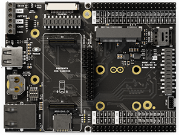
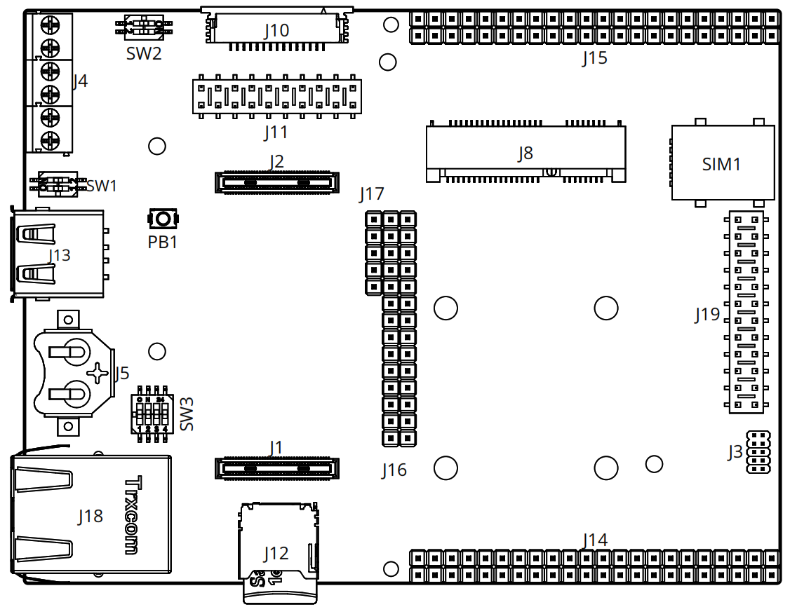
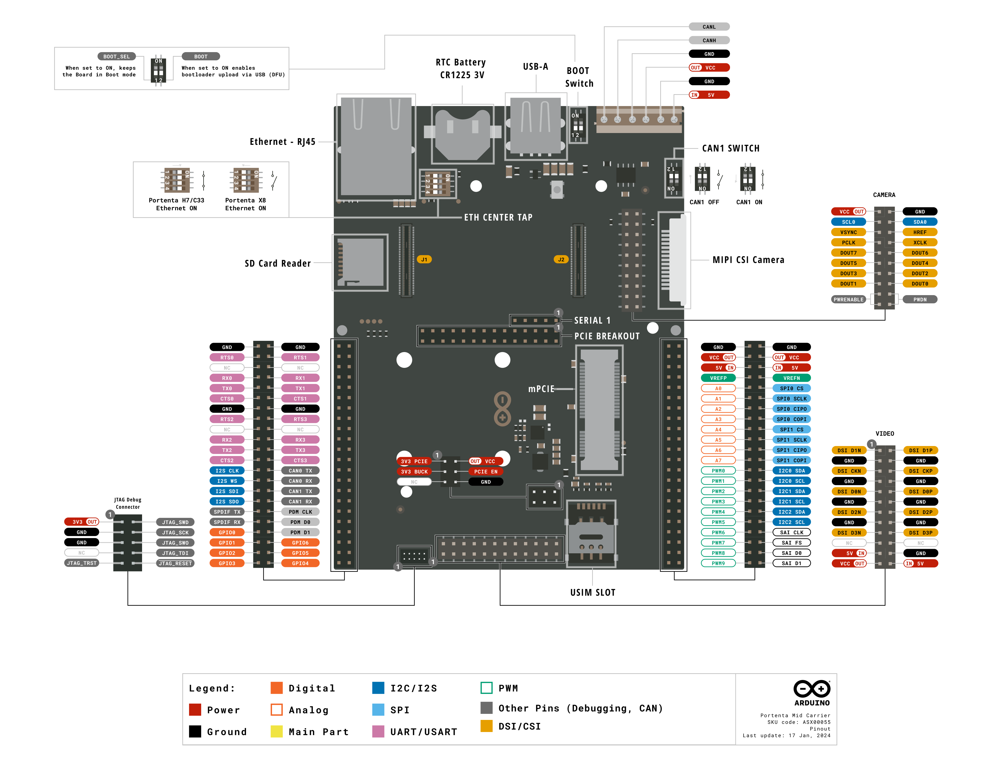
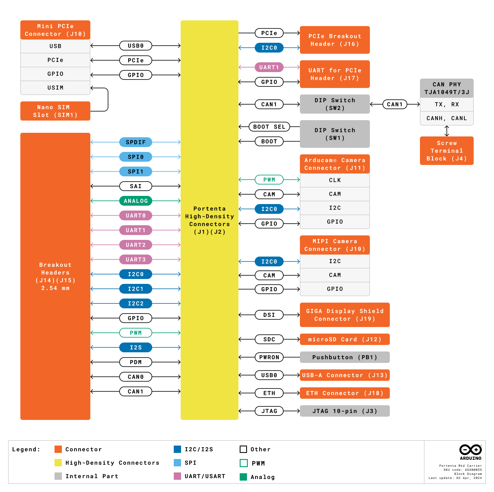
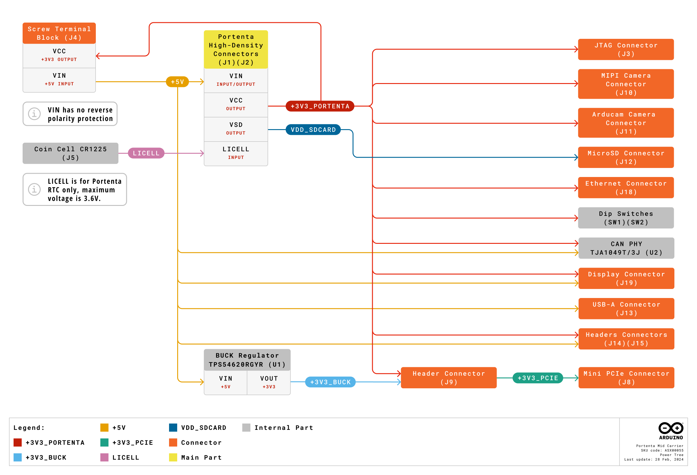
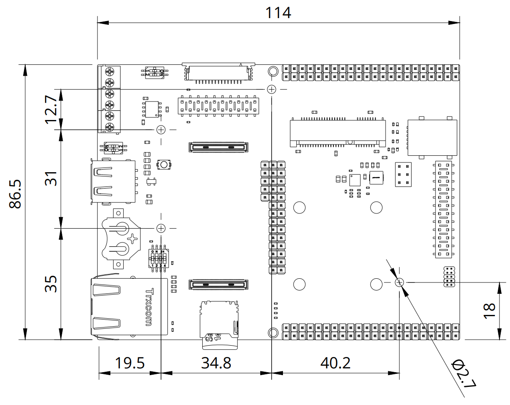
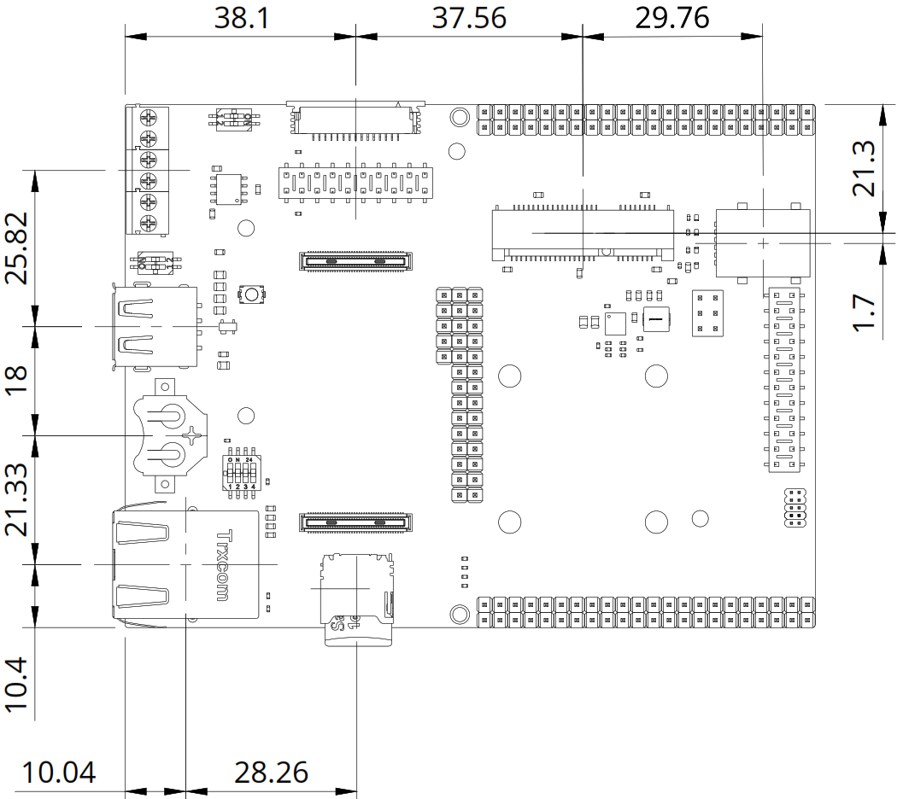

# Description 

The Arduino Portenta Mid Carrier streamlines project development for Portenta SOMs boards by offering easy access to high-density signals through specialized and dedicated headers. It is compatible with the Portenta C33, H7, and X8 boards and is perfect for many projects, including the Internet of Things applications, asset tracking, machine vision, robotics, and automation. This carrier boasts a variety of ports and interfaces like two CAN bus lines, Ethernet, microSD, and USB, along with camera and display connectors. It features debug pins and a real-time clock battery backup, easing development. Its onboard mini PCIe connector also enables quick cellular connectivity testing, ensuring reliable data transmission even in Wi-Fi® in scarce areas. These features make the Portenta Mid Carrier a vital tool for efficiently creating innovative, connected devices.

# About This Document

This document serves as the official reference for the technical specifications of the Portenta Mid Carrier. It provides a detailed overview of the board's capabilities, features and supported components. For additional information on using the board, including setup guides and practical applications, please visit [docs.arduino.cc](https://docs.arduino.cc/).

# Target Areas

Rapid prototyping, asset tracking, Internet of Things, machine vision, robotics, and automatization

# CONTENTS

## Application Examples

The Arduino Portenta Mid Carrier enhances various prototyping applications thanks to its flexible design. The Portenta Mid Carrier provides a robust platform for many projects, from industry-ready prototypes to machine vision and cellular connectivity testing. Here are some application examples:

- **Rapid testing of cellular connectivity**: Use the mini PCIe connector on the Portenta Mid Carrier for swift cellular connectivity testing. This feature is invaluable for applications in smart cities/buildings, remote maintenance, and fleet management, ensuring rapid data transmission even in locations lacking Wi-Fi® coverage.
- **Prototyping**: The Portenta Mid Carrier is a versatile tool for prototyping, merging seamlessly with Portenta family boards to unveil essential peripherals like microSD, Ethernet, and USB. This integration facilitates industry-ready prototyping and streamlines debugging and inspection processes through dedicated CAN bus lines. Moreover, its compatibility extends to a wide array of external hardware components and devices, enhancing your Portenta boards for projects that demand embedded sensing or straightforward actuation. This dual functionality ensures the Portenta Mid Carrier provides comprehensive support, simplifying the development process and elevating the potential for innovative project creation.
- **Frictionless machine vision prototyping**: Pair the Portenta Mid Carrier with an MIPI or Arducam® camera to effortlessly embark on machine vision projects. Whether for object detection and recognition, defect identification, or asset tracking, the Portenta Mid Carrier streamlines the creation of complex vision-based applications.
- **Reference design**: The Portenta Mid Carrier serves as an excellent reference design and aids in the development of custom products within the Portenta ecosystem. Arduino PRO's full development, production, and operation support provides a solid foundation for tailoring solutions to specific business needs.

## Features

### General Specifications Overview

The Arduino Portenta Mid Carrier is an excellent tool for building scalable projects based on the Portenta family boards. The Portenta Mid Carrier was designed to give quick access to all the essential signals of the Portenta family boards, simplifying the addition of new features to enterprise projects with its Ethernet and Mini PCIe connectors. With this connector, the Portenta Mid Carrier capabilities are notably enhanced by including cellular connectivity to the carrier, allowing for rapid testing and deployment of applications requiring remote communication. The carrier includes a microSD card slot starting from an external source, and it has two CAN bus lines for connecting to actuators, which helps manage devices easily. Moreover, its onboard camera connectors enable the development of machine vision applications. The Carrier is also a straightforward reference design for creating new custom hardware. 

The main features of the Portenta Mid Carrier are summarized and highlighted in the table below.

| **Feature**                | **Description**                                                                                                                                                                                                                                                             |
|----------------------------|-----------------------------------------------------------------------------------------------------------------------------------------------------------------------------------------------------------------------------------------------------------------------------|
| Ethernet                   | RJ45 connector (x1)                                                                                                                                                                                                                                                         |
| USB Connectivity           | USB-A 2.0 female connector for data logging operations (x1)                                                                                                                                                                                                                 |
| Power Supply               | Various options for easily powering the Carrier: onboard USB-C® port of the Portenta family board connected to the Carrier and external power supply connected through the onboard screw terminal block and dedicated pins of the breakout header connectors of the Carrier |
| Screw Terminal Block       | Used to power the Carrier and for the CAN bus interface (CAN1)                                                                                                                                                                                                              |
| Breakout Header Connectors | Available interfaces through the breakout headers are the following: UART (x4), I2S (x1), CAN bus (x2), SPDIF (x1), PDM (x1), GPIO (x7), SPI (x2), I2C (x3), SAI (x1), PWM (x10), ADC (x8)                                                                                  |
| Camera Connectors          | MIPI camera (x1), Digital Video Port (DVP) interface (x1)                                                                                                                                                                                                                   |
| Mini PCIe Interface        | Accessible through the Carrier's dedicated Mini PCIe connector, its High-Density connectors and the dedicated Mini PCIe breakout header                                                                                                                                     |
| Debugging                  | Onboard JTAG/SWD debug connector                                                                                                                                                                                                                                            |
| Battery Socket             | Onboard CR1225 battery socket used for Real-Time Clock (RTC) support                                                                                                                                                                                                        |
| Dimensions                 | 114 mm x 86.5 mm                                                                                                                                                                                                                                                            |
| Weight                     | 67 g                                                                                                                                                                                                                                                                        |
| Operating Temperature      | -40 °C to +85 °C                                                                                                                                                                                                                                                            |
| Certifications             | CE, FCC, IC, RoHS, REACH, UKCA, WEEE, Japan (No Radio)                                                                                                                                                                                                                      |

In the following sections, as well as the tables presented in those sections, the communication interfaces and other important features of the Carrier are further detailed.

### Communication Interfaces

| **Interfaces**                | **Connector**                                                                                                                                                                                                                                                                                                                                 |
|-------------------------------|-----------------------------------------------------------------------------------------------------------------------------------------------------------------------------------------------------------------------------------------------------------------------------------------------------------------------------------------------|
| Mini PCIe (x1)                | Mini PCIe connector (J8), High-Density connectors (J1-J2), and breakout header connector1 (J16)                                                                                                                                                                                                                                    |
| Ethernet (x1)                 | RJ45 connector (J18)                                                                                                                                                                                                                                                                                                                          |
| SPI (x2)                      | - **SPI0**: Breakout header connector (J15) and High-Density connector (J2)    - **SPI1**: Breakout header connector (J15) and High-Density connector (J2)                                                                                                                                                                                 |
| I2S (x1)                      | Breakout header connector (J14) and High-Density connector (J1)                                                                                                                                                                                                                                                                               |
| I2C (x3)                      | - **I2C0**: Breakout header connector (J15) and High-Density connector (J1)    - **I2C1**: Breakout header connector (J15) and High-Density connector (J1)    - **I2C2**: Breakout header connector (J15) and High-Density connector (J2)                                                                                               |
| CAN bus (x2)                  | - __CAN02__: Breakout header connector (J14) and High-Density connector (J1)    - __CAN13__: Breakout header connector (J14), High-Density connector (J1), and screw terminal block (J4)                                                                                                                             |
| UART (with flow control) (x4) | - **SERIAL0**: Breakout header connector (J14) and High-Density connector (J1)    - **SERIAL1**: Breakout header connector (J14) and High-Density connector (J1)    - **SERIAL2**: Breakout header connector (J14) and High-Density connector (J2)    - **SERIAL3**: Breakout header connector (J14) and High-Density connector (J2) |

1For debugging purposes only.  
2CAN0 has no CAN PHY; an external one is needed. 
3CAN1 has an onboard CAN PHY available through the Carrier's screw terminal block (J4); it can be enabled or disabled via a DIP switch (SW2). 

### Other Features

| **Feature**                | **Description**                                                                                                                                                                                                                                                                                             |
|----------------------------|-------------------------------------------------------------------------------------------------------------------------------------------------------------------------------------------------------------------------------------------------------------------------------------------------------------|
| Additional onboard storage | microSD card slot (J12) for data logging operations                                                                                                                                                                                                                                                         |
| SIM card support           | Yes, available through the Carrier's Mini PCIe interface                                                                                                                                                                                                                                                    |
| RTC Support                | Yes, available through the Carrier's onboard CR1225 battery socket                                                                                                                                                                                                                                          |
| USB support                | USB-A 2.0 female connector (J13) for data logging operations                                                                                                                                                                                                                                                |
| Camera support             | Yes, through the MIPI camera connector (J10) and the DVP interface connector (J11)                                                                                                                                                                                                                          |
| Display support            | Yes, available through the Carrier's GIGA Display Shield connector (J19) (x1)                                                                                                                                                                                                                               |
| Video support              | Only with the Portenta H7 and the Portenta X8 boards through its onboard USB-C® connector                                                                                                                                                                                                                   |
| Camera support4 | Yes, available through the MIPI camera connector (J10) and the DVP interface connector (J11)                                                                                                                                                                                                                |
| DIP switches               | - **ETH CENTER TAP (SW3)**: All positions OFF to enable Ethernet for the Portenta X8 board; for the Portenta C33 and H7 boards, Ethernet is always enabled regardless of the switch positions    - **BOOT SEL**: All positions ON to enable BOOT mode, all positions OFF to enable NORMAL operation mode |

4 MIPI cameras are only supported by the Portenta X8 board; DVP interface is compatible with Arducam® DVP camera modules. 

### Related Accessories (Not Included)

- MIPI camera
- microSD card
- CR1225 (3 VDC) coin cell
- Arducam® DVP camera modules
- SIM card (only data compatible)
- Pro 4G Module
- Portenta Mid Carrier Proto Shield

<strong>Note:</strong> The Portenta Mid Carrier requires a compatible Portenta family board to operate.

## Ratings

### Recommended Operating Conditions

The table below provides a comprehensive guideline for the optimal use of the Arduino Portenta Mid Carrier, outlining typical operating conditions and design limits. The operating conditions of the Portenta Mid Carrier are largely based on the specifications of its components.

|                 **Parameter**                |    **Symbol**   | **Min** | **Typ** | **Max** | **Unit** |
|:--------------------------------------------:|:---------------:|:-------:|:-------:|:-------:|:--------:|
|     USB Supply Input Voltage1     | VUSB |    -    |   5.0   |    -    |     V    |
|       Supply Input Voltage2       |  VIN |    -    |   5.0   |    -    |     V    |
| Current delivered by the Carrier3 |  IC  |    -    |    -    |   2.0   |     A    |
|             Operating Temperature            |  TOP |   -40   |    -    |    85   |    °C    |

1 Carrier powered through the USB-C® port of the connected Portenta family board to the carrier. 
2 Carrier powered through its onboard screw terminal block (J4, IN 5V terminal) or its breakout pin header connector (J15, IN 5V pins). 
3 Available only for the Mini PCIe card connected to the carrier.

<strong>Note:</strong> Remember to check out the power specifications of the Mini PCIe card intended to be connected to the carrier to avoid damage to both the card and the carrier. For more safety tips, refer to the carrier's user manual.

## Functional Overview

The Arduino Portenta Mid Carrier is a powerful tool for developing scalable Portenta-based applications, providing quick access to all high-density signals. It enables expansion with Ethernet and the onboard Mini PCIe connector, with the added capability of cellular connectivity through the Mini PCIe interface for applications that need remote access or communication. This makes it even more versatile for projects like smart cities and IoT. Booting projects from external sources is easy with the microSD card slot, and interacting with actuators is straightforward with onboard CAN bus lines. The carrier also supports industrial machine vision with dedicated camera connectors and offers a reliable foundation for creating proprietary hardware, streamlining the development process across various projects.

### Topology

An overview of the Portenta Mid Carrier topology is illustrated and described in the figure and table below.

| **Item** | **Feature**                                                 | **Item** | **Feature**                                                     |
|----------|-------------------------------------------------------------|----------|-----------------------------------------------------------------|
| J1, J2   | High-Density connectors of the Portenta family boards       | J3       | JTAG male connector for debugging                               |
| J4       | Screw terminal block for power supply and CAN bus interface | J5       | Battery socket                                                  |
| J8       | Mini PCIe connector                                         | J10      | MIPI camera connector (only compatible with Portenta X8 boards) |
| J11      | DVP interface connector                                     | J12      | microSD card slot                                               |
| J13      | USB-A 2.0 female connector for data logging operations      | J14, J15 | 2.54 mm breakout header connectors                              |
| J16      | Mini PCIe breakout header connector                         | J17      | 2.54 mm breakout header connectors                              |
| J18      | RJ45 connector for Ethernet                                 | J19      | GIGA Display Shield Connector                                   |
| SIM1     | Nano SIM card connector                                     | SW1      | Boot select switch                                              |
| SW2      | CAN bus interface enable/disable switch                     | SW3      | Ethernet enable/disable switch                                  |

### Simple Pinout 

The Portenta Mid Carrier simple pinout is shown in the figure below.

### Full Pinout

The Portenta Mid Carrier full pinout is shown in the following sections, sorted by the components and connectors of the carrier. 

#### Breakout Header Connector (J14)

The breakout header connector J14 is used in the Portenta Mid Carrier to expose the connected Portenta family board High-Density signals. J14 is a male header connector with a pin spacing of 2.54 mm.

| **Pin Number** | **Silkscreen** | **Power Net** | **Portenta HD Standard Pin** |                           **High-Density Pin**                           | **Interface** |
|:--------------:|:--------------:|:-------------:|:----------------------------:|:------------------------------------------------------------------------:|:-------------:|
|       1        |      GND       |      GND      |             GND              | J1-22, J1-31, J1-42, J1-47, J1-54   J2-24, J2-33, J2-44, J2-57, J2-70 |               |
|       2        |      GND       |      GND      |             GND              | J1-22, J1-31, J1-42, J1-47, J1-54   J2-24, J2-33, J2-44, J2-57, J2-70 |               |
|       3        |      RTS0      |               |         SERIAL0_RTS          |                                  J1-38                                   |  UART 0 RTS   |
|       4        |      RTS1      |               |         SERIAL1_RTS          |                                  J1-37                                   |  UART 1 RTS   |
|       5        |      VIN       |      +5V      |             VIN              |                    J1-21, J1-24, J1-32, J1-41, J1-48                     |               |
|       6        |      VIN       |      +5V      |             VIN              |                    J1-21, J1-24, J1-32, J1-41, J1-48                     |               |
|       8        |      RX0       |               |          SERIAL0_RX          |                                  J1-36                                   |   UART 0 RX   |
|       9        |      RX1       |               |          SERIAL1_RX          |                                  J1-35                                   |   UART 1 RX   |
|       10       |      TX0       |               |          SERIAL0_TX          |                                  J1-34                                   |   UART 0 TX   |
|       11       |      TX1       |               |          SERIAL1_TX          |                                  J1-33                                   |   UART 1 TX   |
|       12       |      CTS0      |               |         SERIAL0_CTS          |                                  J1-40                                   |  UART 0 CTS   |
|       13       |      CTS1      |               |         SERIAL1_CTS          |                                  J1-39                                   |  UART 1 CTS   |
|       14       |      GND       |      GND      |             GND              | J1-22, J1-31, J1-42, J1-47, J1-54   J2-24, J2-33, J2-44, J2-57, J2-70 |               |
|       15       |      GND       |      GND      |             GND              | J1-22, J1-31, J1-42, J1-47, J1-54   J2-24, J2-33, J2-44, J2-57, J2-70 |               |
|       16       |      RTS2      |               |         SERIAL2_RTS          |                                  J2-30                                   |  UART 2 RTS   |
|       17       |      RTS3      |               |         SERIAL3_RTS          |                                  J2-29                                   |  UART 3 RTS   |
|       18       |      VIN       |      +5V      |             VIN              |                    J1-21, J1-24, J1-32, J1-41, J1-48                     |               |
|       19       |      VIN       |      +5V      |             VIN              |                    J1-21, J1-24, J1-32, J1-41, J1-48                     |               |
|       20       |      RX2       |               |          SERIAL2_RX          |                                  J2-28                                   |   UART 2 RX   |
|       21       |      RX3       |               |          SERIAL3_RX          |                                  J2-27                                   |   UART 3 RX   |
|       22       |      TX2       |               |          SERIAL2_TX          |                                  J2-26                                   |   UART 2 TX   |
|       23       |      TX3       |               |          SERIAL3_TX          |                                  J2-25                                   |   UART 3 TX   |
|       24       |      CTS2      |               |         SERIAL2_CTS          |                                  J2-32                                   |  UART 2 CTS   |
|       25       |      CTS3      |               |         SERIAL3_CTS          |                                  J2-31                                   |  UART 3 CTS   |
|       26       |    I2S CLK     |               |            I2S_CK            |                                  J1-56                                   |    I2S CK     |
|       27       |    CAN0 TX     |               |           CAN0_TX            |                                  J1-50                                   |   CAN 0 TX    |
|       28       |     I2S WS     |               |            I2S_WS            |                                  J1-58                                   |    I2S WS     |
|       29       |    CAN0 RX     |               |           CAN0_RX            |                                  J1-52                                   |   CAN 0 RX    |
|       30       |    I2S SDI     |               |           I2S_SDI            |                                  J1-60                                   |    I2S SDI    |
|       31       |    CAN1 TX     |               |           CAN1_TX            |                                  J1-49                                   |   CAN 1 TX    |
|       32       |    I2S SDO     |               |           I2S_SDO            |                                  J1-62                                   |    I2S SDO    |
|       33       |    CAN1 RX     |               |           CAN1_RX            |                                  J1-51                                   |   CAN 1 RX    |
|       34       |    SPDIF TX    |               |           SPDIF_TX           |                                  J1-74                                   |   SPDIF TX    |
|       35       |    PDM CLK     |               |            PDM_CK            |                                  J1-66                                   |    PDM CK     |
|       36       |    SPDIF RX    |               |           SPDIF_RX           |                                  J1-76                                   |   SPDIF RX    |
|       37       |     PDM D0     |               |            PDM_D0            |                                  J1-68                                   |    PDM D0     |
|       37       |     GPIO0      |               |            GPIO_0            |                                  J2-46                                   |               |
|       38       |     PDM D1     |               |            PDM_D1            |                                  J1-70                                   |    PDM D1     |
|       39       |     GPIO1      |               |            GPIO_0            |                                  J2-48                                   |               |
|       40       |     GPIO6      |               |            GPIO_6            |                                  J2-58                                   |               |
|       41       |     GPIO2      |               |            GPIO_2            |                                  J2-50                                   |               |
|       42       |     GPIO5      |               |            GPIO_5            |                                  J2-56                                   |               |
|       43       |     GPIO3      |               |            GPIO_3            |                                  J2-52                                   |               |
|       44       |     GPIO4      |               |            GPIO_4            |                                  J2-54                                   |               |

#### Breakout Header Connector (J15)

The breakout header connector J15 is used in the Portenta Mid Carrier to expose the connected Portenta family board High-Density signals. J15 is a male header connector with a pin spacing of 2.54 mm.

| **Pin Number** | **Silkscreen** | **Power Net** | **Portenta HD Standard Pin** |                           **High-Density Pin**                           | **Interface** |
|:--------------:|:--------------:|:-------------:|:----------------------------:|:------------------------------------------------------------------------:|:-------------:|
|       1        |      GND       |      GND      |             GND              | J1-22, J1-31, J1-42, J1-47, J1-54   J2-24, J2-33, J2-44, J2-57, J2-70 |               |
|       2        |      GND       |      GND      |             GND              | J1-22, J1-31, J1-42, J1-47, J1-54   J2-24, J2-33, J2-44, J2-57, J2-70 |               |
|       3        |      VCC       | +3V3 Portenta |             VCC              |                        J2-23, J2-34, J2-43, J2-69                        |               |
|       4        |      VCC       | +3V3 Portenta |             VCC              |                        J2-23, J2-34, J2-43, J2-69                        |               |
|       5        |      VIN       |      +5V      |             VIN              |                    J1-21, J1-24, J1-32, J1-41, J1-48                     |               |
|       6        |      VIN       |      +5V      |             VIN              |                    J1-21, J1-24, J1-32, J1-41, J1-48                     |               |
|       7        |     VREFP      |               |        ANALOG_VREF_P         |                                  J2-71                                   |               |
|       8        |     VREFN      |               |        ANALOG_VREF_N         |                                  J2-72                                   |               |
|       9        |       A0       |               |          ANALOG_A0           |                                  J2-73                                   |               |
|       10       |    SPI0 CS     |               |           SPI0_CS            |                                  J2-53                                   |   SPI 0 CS    |
|       11       |       A1       |               |          ANALOG_A1           |                                  J2-75                                   |               |
|       12       |   SPI0 SCLK    |               |           SPI0_CK            |                                  J2-37                                   |   SPI 0 CK    |
|       13       |       A2       |               |          ANALOG_A2           |                                  J2-77                                   |               |
|       14       |   SPI0 CIPO    |               |          SPI0_MISO           |                                  J2-39                                   |  SPI 0 CIPO   |
|       15       |       A3       |               |          ANALOG_A3           |                                  J2-79                                   |               |
|       16       |   SPI0 COPI    |               |          SPI0_MOSI           |                                  J2-41                                   |  SPI 0 COPI   |
|       17       |       A4       |               |          ANALOG_A4           |                                  J2-74                                   |               |
|       18       |    SPI1 CS     |               |           SPI1_CS            |                                  J2-36                                   |   SPI 1 CS    |
|       19       |       A5       |               |          ANALOG_A5           |                                  J2-76                                   |               |
|       20       |   SPI1 SCLK    |               |           SPI1_CK            |                                  J2-38                                   |   SPI 1 CK    |
|       21       |       A6       |               |          ANALOG_A6           |                                  J2-78                                   |               |
|       22       |   SPI1 CIPO    |               |          SPI1_MISO           |                                  J2-40                                   |  SPI 1 CIPO   |
|       23       |       A7       |               |          ANALOG_A7           |                                  J2-80                                   |               |
|       24       |   SPI1 COPI    |               |          SPI1_MOSI           |                                  J2-42                                   |  SPI 1 COPI   |
|       25       |      PWM0      |               |            PWM_0             |                                  J2-59                                   |               |
|       26       |    I2C0 SDA    |               |           I2C0_SDA           |                                  J1-44                                   |   I2C 0 SDA   |
|       27       |      PWM1      |               |            PWM_1             |                                  J2-61                                   |               |
|       28       |    I2C0 SCL    |               |           I2C0_SCL           |                                  J1-46                                   |   I2C 0 SCL   |
|       29       |      PWM2      |               |            PWM_2             |                                  J2-63                                   |               |
|       30       |    I2C1 SDA    |               |           I2C1_SDA           |                                  J1-43                                   |   I2C 1 SDA   |
|       31       |      PWM3      |               |            PWM_3             |                                  J2-65                                   |               |
|       32       |    I2C1 SCL    |               |           I2C1_SCL           |                                  J1-45                                   |   I2C 1 SCL   |
|       33       |      PWM4      |               |            PWM_4             |                                  J2-67                                   |               |
|       34       |    I2C2 SDA    |               |           I2C2_SDA           |                                  J2-45                                   |   I2C 2 SDA   |
|       35       |      PWM5      |               |            PWM_5             |                                  J2-60                                   |               |
|       36       |    I2C2 SCL    |               |           I2C2_SCL           |                                  J2-47                                   |   I2C 2 SCL   |
|       37       |      PWM6      |               |            PWM_6             |                                  J2-62                                   |               |
|       38       |    SAI CLK     |               |            SAI_CK            |                                  J2-49                                   |    SAI CLK    |
|       39       |      PWM7      |               |            PWM_7             |                                  J2-64                                   |               |
|       40       |     SAI FS     |               |            SAI_FS            |                                  J2-51                                   |    SAI FS     |
|       41       |      PWM8      |               |            PWM_8             |                                  J2-66                                   |               |
|       42       |     SAI D0     |               |            SAI_D0            |                                  J2-53                                   |    SAI D0     |
|       43       |      PWM9      |               |            PWM_9             |                                  J2-68                                   |               |
|       44       |     SAI D1     |               |            SAI_D1            |                                  J2-55                                   |    SAI D1     |

<strong>Reverse polarity protection:</strong> IN 5V pins of the carrier's screw terminal block (J4) and breakout header connector (J15) <strong> do not have</strong> reverse polarity protection. Double-check the polarity of your power supply before connecting it to the carrier to avoid damaging it. 

#### Screw Terminal Block (J4) 

The screw terminal block connector J4 is used to power the Portenta Mid Carrier and to expose the CAN bus interface (CAN1) to the user. 

| **Pin Number** | **Silkscreen** | **Power Net** | **Portenta HD Standard Pin** |                           **High-Density Pin**                           |    **Interface**    |
|:--------------:|:--------------:|:-------------:|:----------------------------:|:------------------------------------------------------------------------:|:-------------------:|
|       1        |      VIN       |      +5V      |             VIN              |                    J1-21, J1-24, J1-32, J1-41, J1-48                     |                     |
|       2        |      GND       |      GND      |             GND              | J1-22, J1-31, J1-42, J1-47, J1-54   J2-24, J2-33, J2-44, J2-57, J2-70 |                     |
|       3        |      VCC       | +3V3 Portenta |             VCC              |                        J2-23, J2-34, J2-43, J2-69                        |                     |
|       4        |      GND       |      GND      |             GND              | J1-22, J1-31, J1-42, J1-47, J1-54   J2-24, J2-33, J2-44, J2-57, J2-70 |                     |
|       5        |      CANH      |               |           CAN1 TX            |                            J1-49 (through U2)                            | CAN BUS 1   CANH |
|       6        |      CANL      |               |           CAN1 RX            |                            J1-51 (through U2)                            | CAN BUS 1   CANL |

<strong>Reverse polarity protection:</strong> IN 5V pins of the carrier's screw terminal block (J4) and breakout header connector (J15) <strong> do not have</strong> reverse polarity protection. Double-check the polarity of your power supply before connecting it to the carrier to avoid damaging it. 

#### JTAG/SWD Connector (J3)

The JTAG/SWD connector J3 can be used in the Portenta Mid Carrier to test and debug the connected Portenta family board. 

| **Pin Number** | **Silkscreen** | **Power Net** | **Portenta HD Standard Pin** |                           **High-Density Pin**                           | **Interface** |
|:--------------:|:--------------:|:-------------:|:----------------------------:|:------------------------------------------------------------------------:|:-------------:|
|       1        |      N/A       | +3V3 Portenta |             VCC              |                        J2-23, J2-34, J2-43, J2-69                        |               |
|       2        |      N/A       |               |           JTAG_SWD           |                                  J1-75                                   |   JTAG SWD    |
|       3        |      N/A       |      GND      |             GND              | J1-22, J1-31, J1-42, J1-47, J1-54   J2-24, J2-33, J2-44, J2-57, J2-70 |               |
|       4        |      N/A       |               |           JTAG_SCK           |                                  J1-77                                   |   JTAG SCK    |
|       5        |      N/A       |      GND      |             GND              | J1-22, J1-31, J1-42, J1-47, J1-54   J2-24, J2-33, J2-44, J2-57, J2-70 |               |
|       6        |      N/A       |               |           JTAG_SWO           |                                  J1-79                                   |   JTAG SWO    |
|       7        |      N/A       |               |              NC              |                                    NC                                    |               |
|       8        |      N/A       |               |           JTAG_TDI           |                                  J1-78                                   |   JTAG TDI    |
|       9        |      N/A       |               |          JTAG_TRST           |                                  J1-80                                   |   JTAG TRST   |
|       10       |      N/A       |               |           JTAG_RST           |                                  J1-73                                   |   JTAG RST    |

#### MIPI Connector (J10)

The MIPI connector J10 of the Portenta Mid Carrier can be used to connect compatible MIPI cameras to the carrier. Notice that **MIPI cameras are only compatible with the Portenta X8 board**.

| **Pin Number** | **Silkscreen** | **Power Net** | **Portenta HD Standard Pin** |                           **High-Density Pin**                           | **Interface** |
|:--------------:|:--------------:|:-------------:|:----------------------------:|:------------------------------------------------------------------------:|:-------------:|
|       1        |      N/A       |      GND      |             GND              | J1-22, J1-31, J1-42, J1-47, J1-54   J2-24, J2-33, J2-44, J2-57, J2-70 |               |
|       2        |      N/A       |               |         CAM_D0_D0_N          |                                  J2-16                                   |               |
|       3        |      N/A       |               |         CAM_D1_D0_P          |                                  J2-14                                   |               |
|       4        |      N/A       |      GND      |             GND              | J1-22, J1-31, J1-42, J1-47, J1-54   J2-24, J2-33, J2-44, J2-57, J2-70 |               |
|       5        |      N/A       |               |         CAM_D2_D1_N          |                                  J2-12                                   |               |
|       6        |      N/A       |               |         CAM_D3_D1_P          |                                  J2-10                                   |               |
|       7        |      N/A       |      GND      |             GND              | J1-22, J1-31, J1-42, J1-47, J1-54   J2-24, J2-33, J2-44, J2-57, J2-70 |               |
|       8        |      N/A       |               |         CAM_CK_CK_N          |                                  J2-20                                   |               |
|       9        |      N/A       |               |         CAM_VS_CK_P          |                                  J2-18                                   |               |
|       10       |      N/A       |      GND      |             GND              | J1-22, J1-31, J1-42, J1-47, J1-54   J2-24, J2-33, J2-44, J2-57, J2-70 |               |
|       11       |      N/A       |               |            GPIO_5            |                                  J2-56                                   |               |
|       12       |      N/A       |               |              NC              |                                    NC                                    |               |
|       13       |      N/A       |               |           I2C1_SCL           |                                  J1-45                                   |   I2C 1 SCL   |
|       14       |      N/A       |               |           I2C1_SDA           |                                  J1-43                                   |   I2C 1 SDA   |
|       15       |      N/A       | +3V3 Portenta |             VCC              |                        J2-23, J2-34, J2-43, J2-69                        |               |

#### DVP Interface Connector (J11)

The DVP interface connector J11 of the Portenta Mid Carrier can be used to connect compatible Arducam® DVP camera modules to the carrier. 

| **Pin Number** | **Silkscreen** | **Power Net** | **Portenta HD Standard Pin** |                           **High-Density Pin**                           | **Interface** |
|:--------------:|:--------------:|:-------------:|:----------------------------:|:------------------------------------------------------------------------:|:-------------:|
|       1        |      VCC       | +3V3 Portenta |             VCC              |                        J2-23, J2-34, J2-43, J2-69                        |               |
|       2        |      GND       |      GND      |             GND              | J1-22, J1-31, J1-42, J1-47, J1-54   J2-24, J2-33, J2-44, J2-57, J2-70 |               |
|       3        |      SCL0      |               |           I2C0_SCL           |                                  J1-46                                   |   I2C 0 SCL   |
|       4        |      SDA0      |               |           I2C0_SDA           |                                  J1-44                                   |   I2C 0 SDA   |
|       5        |     VSYNC      |               |         CAM_VS_CK_P          |                                  J2-18                                   |               |
|       6        |      HREF      |               |            CAM_HS            |                                  J2-22                                   |               |
|       7        |      PCLK      |               |         CAM_CK_CK_N          |                                  J2-20                                   |               |
|       8        |      XCLK      |               |            PWM_0             |                                  J2-59                                   |               |
|       9        |     DOUT7      |               |         CAM_D7_D3_P          |                                   J2-2                                   |               |
|       10       |     DOUT6      |               |         CAM_D6_D3_N          |                                   J2-4                                   |               |
|       11       |     DOUT5      |               |         CAM_D5_D2_P          |                                   J2-6                                   |               |
|       12       |     DOUT4      |               |         CAM_D4_D2_N          |                                   J2-8                                   |               |
|       13       |     DOUT3      |               |         CAM_D3_D1_P          |                                  J2-10                                   |               |
|       14       |     DOUT2      |               |         CAM_D2_D1_N          |                                  J2-12                                   |               |
|       15       |     DOUT1      |               |         CAM_D1_D0_P          |                                  J2-14                                   |               |
|       16       |     DOUT0      |               |         CAM_D0_D0_N          |                                  J2-16                                   |               |
|       17       |   PWRENABLE    |               |            GPIO_3            |                                  J2-52                                   |               |
|       18       |      PWDN      |               |            GPIO_4            |                                  J2-54                                   |               |
|       19       |   PWRENABLE    |               |            GPIO_3            |                                  J2-52                                   |               |
|       20       |      PWDN      |               |            GPIO_4            |                                  J2-54                                   |               |

#### USB-A 2.0 Female Connector (J13)

The USB-A 2.0 female connector J13 of the Portenta Mid Carrier can be used for data logging operations and to manage external peripherals with the connected Portenta family board to the carrier. 

| **Pin Number** | **Silkscreen** | **Power Net** | **Portenta HD Standard Pin** |                           **High-Density Pin**                           | **Interface** |
|:--------------:|:--------------:|:-------------:|:----------------------------:|:------------------------------------------------------------------------:|:-------------:|
|       1        |      N/A       |      +5V      |             VIN              |                    J1-21, J1-24, J1-32, J1-41, J1-48                     |               |
|       2        |      N/A       |               |           USB0_D_N           |                                  J1-28                                   |    USB D-     |
|       3        |      N/A       |               |           USB0_D_P           |                                  J1-26                                   |    USB D+     |
|       4        |      N/A       |      GND      |             GND              | J1-22, J1-31, J1-42, J1-47, J1-54   J2-24, J2-33, J2-44, J2-57, J2-70 |               |

#### microSD Card Slot (J12)

The microSD card slot J12 of the Portenta Mid Carrier can be used for bootloading and data logging operations.

| **Pin Number** | **Silkscreen** | **Power Net** | **Portenta HD Standard Pin** |                           **High-Density Pin**                           | **Interface** |
|:--------------:|:--------------:|:-------------:|:----------------------------:|:------------------------------------------------------------------------:|:-------------:|
|       1        |      N/A       |               |            SDC_D2            |                                  J1-63                                   |               |
|       2        |      N/A       |               |            SDC_D3            |                                  J1-65                                   |               |
|       3        |      N/A       |               |           SDC_CMD            |                                  J1-57                                   |               |
|       4        |      N/A       |   VDDSDCARD   |             VSD              |                                  J1-72                                   |               |
|       5        |      N/A       |               |           SDC_CLK            |                                  J1-55                                   |               |
|       6        |      N/A       |      GND      |             GND              | J1-22, J1-31, J1-42, J1-47, J1-54   J2-24, J2-33, J2-44, J2-57, J2-70 |               |
|       7        |      N/A       |               |            SDC_D0            |                                  J1-59                                   |               |
|       8        |      N/A       |               |            SDC_D1            |                                  J1-61                                   |               |
|      CD1       |      N/A       |               |            SDC_CD            |                                  J1-67                                   |               |
|      CD2       |      N/A       |      GND      |             GND              | J1-22, J1-31, J1-42, J1-47, J1-54   J2-24, J2-33, J2-44, J2-57, J2-70 |               |

#### RJ45 Ethernet Connector (J18)

The RJ45 Ethernet connector J18 of the Portenta Mid Carrier can be used for Internet connectivity and networking via Ethernet.

| **Pin Number** | **Silkscreen** | **Power Net** | **Portenta HD Standard Pin** |                           **High-Density Pin**                           | **Interface** |
|:--------------:|:--------------:|:-------------:|:----------------------------:|:------------------------------------------------------------------------:|:-------------:|
|       1        |      N/A       |      VCC      |      VCC (through SW3)       |                        J2-23, J2-34, J2-43, J2-69                        |               |
|       2        |      N/A       |               |           ETH_C_N            |                                  J1-11                                   |               |
|       3        |      N/A       |               |           ETH_C_P            |                                   J1-9                                   |               |
|       4        |      N/A       |               |           ETH_B_P            |                                   J1-5                                   |               |
|       5        |      N/A       |               |           ETH_B_N            |                                   J1-7                                   |               |
|       6        |      N/A       |      VCC      |      VCC (through SW3)       |                        J2-23, J2-34, J2-43, J2-69                        |               |
|       7        |      N/A       |      VCC      |      VCC (through SW3)       |                        J2-23, J2-34, J2-43, J2-69                        |               |
|       8        |      N/A       |               |           ETH_D_P            |                                  J1-13                                   |               |
|       9        |      N/A       |               |           ETH_D_N            |                                  J1-15                                   |               |
|       10       |      N/A       |               |           ETH_A_N            |                                   J1-3                                   |               |
|       11       |      N/A       |               |           ETH_A_P            |                                   J1-1                                   |               |
|       12       |      N/A       |      VCC      |      VCC (through SW3)       |                        J2-23, J2-34, J2-43, J2-69                        |               |
|       13       |      N/A       |      GND      |             GND              | J1-22, J1-31, J1-42, J1-47, J1-54   J2-24, J2-33, J2-44, J2-57, J2-70 |               |
|       14       |      N/A       |               |           ETH_LED2           |                         J1-19 (through resistor)                         |               |
|       15       |      N/A       |               |           ETH_LED1           |                                  J1-17                                   |               |
|       16       |      N/A       |      VCC      |    VCC (through resistor)    |                        J2-23, J2-34, J2-43, J2-69                        |               |
|       17       |      N/A       |               |              NC              |                                    NC                                    |               |

#### GIGA Display Shield Connector (J19)

The GIGA Display Shield connector J19 of the Portenta Mid Carrier can connect the GIGA Display Shield (SKU: ASX00039) to the carrier and the connected Portenta family board.

| **Pin Number** | **Silkscreen** | **Power Net** | **Portenta HD Standard Pin** |                           **High-Density Pin**                           | **Interface** |
|:--------------:|:--------------:|:-------------:|:----------------------------:|:------------------------------------------------------------------------:|:-------------:|
|       1        |    DSI D1N     |               |           DSI_D1_N           |                                  J1-12                                   |   DSI D1 N    |
|       2        |    DSI D1P     |               |           DSI_D1_P           |                                  J1-10                                   |   DSI D1 P    |
|       3        |      GND       |      GND      |             GND              | J1-22, J1-31, J1-42, J1-47, J1-54   J2-24, J2-33, J2-44, J2-57, J2-70 |               |
|       4        |      GND       |      GND      |             GND              | J1-22, J1-31, J1-42, J1-47, J1-54   J2-24, J2-33, J2-44, J2-57, J2-70 |               |
|       5        |    DSI CKN     |               |           DSI_CK_N           |                                  J1-20                                   |   DSI CK N    |
|       6        |    DSI CKP     |               |           DSI_CK_P           |                                  J1-18                                   |   DSI CK P    |
|       7        |      GND       |      GND      |             GND              | J1-22, J1-31, J1-42, J1-47, J1-54   J2-24, J2-33, J2-44, J2-57, J2-70 |               |
|       8        |      GND       |      GND      |             GND              | J1-22, J1-31, J1-42, J1-47, J1-54   J2-24, J2-33, J2-44, J2-57, J2-70 |               |
|       9        |    DSI D0N     |               |           DSI_D0_N           |                                  J1-16                                   |   DSI D0 N    |
|       10       |    DSI D0P     |               |           DSI_D0_P           |                                  J1-14                                   |   DSI D0 P    |
|       11       |      GND       |      GND      |             GND              | J1-22, J1-31, J1-42, J1-47, J1-54   J2-24, J2-33, J2-44, J2-57, J2-70 |               |
|       12       |      GND       |      GND      |             GND              | J1-22, J1-31, J1-42, J1-47, J1-54   J2-24, J2-33, J2-44, J2-57, J2-70 |               |
|       13       |    DSI D2N     |               |           DSI_D2_N           |                                   J1-8                                   |   DSI D2 N    |
|       14       |    DSI D2P     |               |           DSI_D2_P           |                                   J1-6                                   |   DSI D2 P    |
|       15       |      GND       |      GND      |             GND              | J1-22, J1-31, J1-42, J1-47, J1-54   J2-24, J2-33, J2-44, J2-57, J2-70 |               |
|       16       |      GND       |      GND      |             GND              | J1-22, J1-31, J1-42, J1-47, J1-54   J2-24, J2-33, J2-44, J2-57, J2-70 |               |
|       17       |    DSI D3N     |               |           DSI_D3_N           |                                   J1-4                                   |   DSI D3 N    |
|       18       |    DSI D3P     |               |           DSI_D3_P           |                                   J1-2                                   |   DSI D3 P    |
|       19       |       NC       |               |              NC              |                                    NC                                    |               |
|       20       |       NC       |               |              NC              |                                    NC                                    |               |
|       21       |      VIN       |      +5V      |             VIN              |                    J1-21, J1-24, J1-32, J1-41, J1-48                     |               |
|       22       |      GND       |      GND      |             GND              | J1-22, J1-31, J1-42, J1-47, J1-54   J2-24, J2-33, J2-44, J2-57, J2-70 |               |
|       23       |      VCC       | +3V3 Portenta |             VCC              |                        J2-23, J2-34, J2-43, J2-69                        |               |
|       24       |      VIN       |      +5V      |             VIN              |                    J1-21, J1-24, J1-32, J1-41, J1-48                     |               |

#### Mini PCIe Connector (J8)

The Mini PCIe connector J8 of the Portenta Mid Carrier can connect compatible Mini PCie cards, for example, the Arduino® Pro 4G Module EMEA (SKU: TPX00201), to the carrier and the connected Portenta family board.

| **Pin Number** | **Silkscreen** | **Power Net** | **Portenta HD Standard Pin** |                           **High-Density Pin**                           | **Interface** |
|:--------------:|:--------------:|:-------------:|:----------------------------:|:------------------------------------------------------------------------:|:-------------:|
|       1        |      N/A       |               |                              |                                                                          |               |
|       2        |      N/A       |   +3V3 PCIE   |                              |                                                                          |               |
|       3        |      N/A       |               |                              |                                                                          |               |
|       4        |      N/A       |      GND      |             GND              | J1-22, J1-31, J1-42, J1-47, J1-54   J2-24, J2-33, J2-44, J2-57, J2-70 |               |
|       5        |      N/A       |               |                              |                                                                          |               |
|       6        |      N/A       |               |                              |                                                                          |               |
|       7        |      N/A       |               |            GPIO_1            |                                  J2-48                                   |               |
|       8        |      N/A       |               |                              |                                                                          |   USIM PWR    |
|       9        |      N/A       |      GND      |             GND              | J1-22, J1-31, J1-42, J1-47, J1-54   J2-24, J2-33, J2-44, J2-57, J2-70 |               |
|       10       |      N/A       |               |                              |                                                                          |   USIM DATA   |
|       11       |      N/A       |               |          PCIE_CK_N           |                                  J2-19                                   |   PCIE CK N   |
|       12       |      N/A       |               |                              |                                                                          |   USIM CLK    |
|       13       |      N/A       |               |          PCIE_CK_P           |                                  J2-17                                   |   PCIE CK P   |
|       14       |      N/A       |               |                              |                                                                          |   USIM RST    |
|       15       |      N/A       |      GND      |             GND              | J1-22, J1-31, J1-42, J1-47, J1-54   J2-24, J2-33, J2-44, J2-57, J2-70 |               |
|       16       |      N/A       |               |                              |                                                                          |               |
|       17       |      N/A       |               |                              |                                                                          |               |
|       18       |      N/A       |      GND      |             GND              | J1-22, J1-31, J1-42, J1-47, J1-54   J2-24, J2-33, J2-44, J2-57, J2-70 |               |
|       19       |      N/A       |               |                              |                                                                          |               |
|       20       |      N/A       |               |            GPIO_2            |                                  J2-50                                   |               |
|       21       |      N/A       |      GND      |             GND              | J1-22, J1-31, J1-42, J1-47, J1-54   J2-24, J2-33, J2-44, J2-57, J2-70 |               |
|       22       |      N/A       |               |           PCIE_RST           |                                  J2-21                                   |   PCIE RST    |
|       23       |      N/A       |               |          PCIE_RX_N           |                                  J2-15                                   |   PCIE RX N   |
|       24       |      N/A       |   +3V3 PCIE   |                              |                                                                          |               |
|       25       |      N/A       |               |          PCIE_RX_P           |                                  J2-13                                   |   PCIE RX P   |
|       26       |      N/A       |      GND      |             GND              | J1-22, J1-31, J1-42, J1-47, J1-54   J2-24, J2-33, J2-44, J2-57, J2-70 |               |
|       27       |      N/A       |      GND      |             GND              | J1-22, J1-31, J1-42, J1-47, J1-54   J2-24, J2-33, J2-44, J2-57, J2-70 |               |
|       28       |      N/A       |               |                              |                                                                          |               |
|       29       |      N/A       |      GND      |             GND              | J1-22, J1-31, J1-42, J1-47, J1-54   J2-24, J2-33, J2-44, J2-57, J2-70 |               |
|       30       |      N/A       |               |           I2C0_SCL           |                                  J1-46                                   |   I2C 0 SCL   |
|       31       |      N/A       |               |          PCIE_TX_N           |                                  J2-11                                   |   PCIE TX N   |
|       32       |      N/A       |               |           I2C0_SDA           |                                  J1-44                                   |   I2C 0 SDA   |
|       33       |      N/A       |               |          PCIE_TX_P           |                                   J2-9                                   |   PCIE TX P   |
|       34       |      N/A       |      GND      |             GND              | J1-22, J1-31, J1-42, J1-47, J1-54   J2-24, J2-33, J2-44, J2-57, J2-70 |               |
|       35       |      N/A       |      GND      |             GND              | J1-22, J1-31, J1-42, J1-47, J1-54   J2-24, J2-33, J2-44, J2-57, J2-70 |               |
|       36       |      N/A       |               |           USB0_D_N           |                                  J1-28                                   |   USB 0 D-    |
|       37       |      N/A       |      GND      |             GND              | J1-22, J1-31, J1-42, J1-47, J1-54   J2-24, J2-33, J2-44, J2-57, J2-70 |               |
|       38       |      N/A       |               |           USB0_D_P           |                                  J1-26                                   |   USB 0 D+    |
|       39       |      N/A       |   +3V3 PCIE   |                              |                                                                          |               |
|       40       |      N/A       |      GND      |             GND              | J1-22, J1-31, J1-42, J1-47, J1-54   J2-24, J2-33, J2-44, J2-57, J2-70 |               |
|       41       |      N/A       |   +3V3 PCIE   |                              |                                                                          |               |
|       42       |      N/A       |               |                              |                                                                          |               |
|       43       |      N/A       |      GND      |             GND              | J1-22, J1-31, J1-42, J1-47, J1-54   J2-24, J2-33, J2-44, J2-57, J2-70 |               |
|       44       |      N/A       |               |                              |                                                                          |               |
|       45       |      N/A       |               |                              |                                                                          |               |
|       46       |      N/A       |               |                              |                                                                          |               |
|       47       |      N/A       |               |                              |                                                                          |               |
|       48       |      N/A       |               |                              |                                                                          |               |
|       49       |      N/A       |               |                              |                                                                          |               |
|       50       |      N/A       |      GND      |             GND              | J1-22, J1-31, J1-42, J1-47, J1-54   J2-24, J2-33, J2-44, J2-57, J2-70 |               |
|       51       |      N/A       |               |                              |                                                                          |               |
|       52       |      N/A       |   +3V3 PCIE   |                              |                                                                          |               |

#### Mini PCIe Breakout Header Connector (J16)

The Mini PCIe breakout header connector J16 of the Portenta Mid Carrier can be used to debug the Mini PCIe interface. 

| **Pin Number** | **Silkscreen** | **Power Net** | **Portenta HD Standard Pin** |                           **High-Density Pin**                           | **Interface** |
|:--------------:|:--------------:|:-------------:|:----------------------------:|:------------------------------------------------------------------------:|:-------------:|
|       1        |      N/A       |               |          PCIE_CK_P           |                                  J2-17                                   |   PCIE CK P   |
|       2        |      N/A       |               |          PCIE_TX_P           |                                   J2-9                                   |   PCIE TX P   |
|       3        |      N/A       |               |          PCIE_CK_N           |                                  J2-19                                   |   PCIE CK N   |
|       4        |      N/A       |               |          PCIE_TX_N           |                                  J2-11                                   |   PCIE TX N   |
|       5        |      N/A       |               |          PCIE_RX_N           |                                  J2-15                                   |   PCIE RX N   |
|       6        |      N/A       |               |                              |                                                                          |               |
|       7        |      N/A       |               |          PCIE_RX_P           |                                  J2-13                                   |   PCIE RX P   |
|       8        |      N/A       |               |                              |                                                                          |               |
|       9        |      N/A       |               |           PCIE_RST           |                                  J2-21                                   |   PCIE RST    |
|       10       |      N/A       |               |                              |                                                                          |               |
|       11       |      N/A       |               |                              |                                                                          |               |
|       12       |      N/A       |               |                              |                                                                          |               |
|       13       |      N/A       |               |                              |                                                                          |               |
|       14       |      N/A       |               |                              |                                                                          |               |
|       15       |      N/A       |               |                              |                                                                          |               |
|       16       |      N/A       |               |                              |                                                                          |               |
|       17       |      N/A       |               |                              |                                                                          |               |
|       18       |      N/A       |               |                              |                                                                          |               |
|       19       |      N/A       |               |                              |                                                                          |               |
|       20       |      N/A       |               |                              |                                                                          |               |
|       21       |      N/A       |               |                              |                                                                          |               |
|       22       |      N/A       |               |                              |                                                                          |               |
|       23       |      N/A       |               |                              |                                                                          |               |
|       24       |      N/A       |      GND      |             GND              | J1-22, J1-31, J1-42, J1-47, J1-54   J2-24, J2-33, J2-44, J2-57, J2-70 |               |

#### Serial Breakout Header Connector (J17)

The serial breakout header connector J17 of the Portenta Mid Carrier can be used to debug the SERIAL1 interface. 

| **Pin Number** | **Silkscreen** | **Power Net** | **Portenta HD Standard Pin** | **High-Density Pin** | **Interface** |
|:--------------:|:--------------:|:-------------:|:----------------------------:|:--------------------:|:-------------:|
|       1        |      N/A       |               |          SERIAL1_RX          |        J1-35         |   UART 1 RX   |
|       2        |      N/A       |               |          SERIAL1_TX          |        J1-33         |   UART 1 TX   |
|       3        |      N/A       |               |         SERIAL1_RTS          |        J1-37         |  UART 1 RTS   |
|       4        |      N/A       |               |         SERIAL1_CTS          |        J1-39         |  UART 1 CTS   |
|       5        |      N/A       |               |            GPIO_6            |        J2-58         |               |

### Block Diagram

An overview of the high-level architecture of the Portenta Mid Carrier is illustrated in the figure below.

### Power Supply

The figure below shows the power options available on the Arduino Portenta Mod Carrier and illustrates the Carrier's power architecture.

The Portenta Mid Carrier can be powered through one of these interfaces:

- **Onboard USB-C® port of the Portenta board**: Provides a convenient way to power the board using standard USB-C® cables and adapters. 
- **External +5 VDC power supply**: This can be connected to the IN 5V pin of the carrier's screw terminal block J4; it can also be connected to the IN 5V pins of the breakout header connector J15. 

<strong>Reverse polarity protection:</strong> IN 5V pins of the carrier's screw terminal block (J4) and breakout header connector (J15) <strong> do not have</strong> reverse polarity protection. Double-check the polarity of your power supply before connecting it to the Carrier to avoid damaging it. 

<strong>Safety note:</strong> Disconnect power before modifying the carrier connections and configurations to avoid short-circuiting. For more safety tips, refer to the Carrier's user manual.

## Device Operation

### Getting Started - IDE

If you want to program your Arduino Portenta Mid Carrier with any of the Portenta family boards offline, install the Arduino® Desktop IDE **[1]**. To connect the Portenta family board to your computer, you will need a USB-C® cable.

### Getting Started - Arduino Web Editor

All Arduino® devices work out of the box on the Arduino® Web Editor **[2]** by installing a simple plugin. The Arduino® Web Editor is hosted online. Therefore, it will always be up-to-date with all the latest features and support for all boards and devices. Follow **[3]** to start coding on the browser and upload your sketches onto your device.

### Getting Started - Arduino Cloud

All Arduino® IoT-enabled products are supported on Arduino Cloud, which allows you to log, graph, and analyze sensor data, trigger events, and automate your home or business. Take a look at the official documentation to know more.

### Sample Sketches

Sample sketches for the Portenta family boards can be found either in the “Examples” menu in the Arduino® IDE or the “Portenta Family” section of Arduino documentation **[4]**.

### Online Resources

Now that you have gone through the basics of what you can do with the device, you can explore the endless possibilities it provides by checking exciting projects on ProjectHub **[5]**, the Arduino® Library Reference **[6]**, and the online store **[7]**, where you will be able to complement your Portenta Mid Carrier with additional extensions, sensors, and actuators.

### Mini PCIe

The Portenta Mid Carrier includes one mini PCI Express card slot (J8). The connector is right-angled and the board includes two removable standoffs for external module support. To use the spacer, add the plastic spacer on the top side of the board, then attach the M2.5 screw from the back together with the washer.

### Mini PCIe Connector and Cellular Capability

The Portenta Mid Carrier does not have built-in cellular capability but includes a Mini PCIe slot that allows for the integration of 4G modules with GNSS capabilities. This slot supports USB, I2C and USIM interfaces, allowing the system to add cellular connectivity and GNSS functionality. Users can install a compatible 4G module to provide cellular connectivity.

The Mini PCIe interface on the Portenta Mid Carrier is optimized for integrating cellular and GNSS modules, supporting multiple communication protocols and power management features. It allows IoT, remote monitoring and edge computing applications with reliable connectivity. An external power source of 5.0 V is required to use the Mini PCIe slot. 

The complete pinout characteristics of the onboard Mini PCIe slot of the Portenta Mid Carrier can be found in the [Mini PCIe Connector (J8) section](#mini-pcie-connector-j8). For detailed implementation process, please refer to the [user manual of the Portenta Mid Carrier](https://docs.arduino.cc/tutorials/portenta-mid-carrier/user-manual/).

### Nano SIM Card Slot Integration

The Portenta Mid Carrier features a nano SIM card slot designed for use with cellular modules installed via the Mini PCIe interface. Please note that the carrier itself does not provide cellular radio capability. Cellular functionality is available only when an appropriate 4G module is installed.

The nano SIM slot enables network connectivity for the cellular module and does not function independently. It works with compatible modems, providing access to LTE and GNSS networks. A dedicated SMA connector allows for the attachment of an external antenna to ensure stable signal reception and performance. For detailed implementation process, please refer to the [user manual of the Portenta Mid Carrier](https://docs.arduino.cc/tutorials/portenta-mid-carrier/user-manual/).

## Mechanical Information

The Arduino Portenta Mid Carrier is a one-sided 114 mm x 86.5 mm board with several connectors overhanging its edges. Portenta family boards and Mini PCIE cards are placed on the carrier using dedicated connectors. 

### Carrier Dimensions

The Portenta Mid Carrier board outline and mounting hole dimensions are shown in the figure below; all the dimensions are in millimeters (mm). 

The carrier has four 2.7 mm drilled mounting holes for mechanical fixing.

### Carrier Connectors

Connectors of the Portenta Mid Carrier are placed primarily on its edges, but there are also some connectors placed inside of the carrier;  their placement is shown in the figure below. All the dimensions are in millimeters (mm). 

## Product Compliance

### Product Compliance Summary

| **Product Compliance** |
| :--------------------: |
|  CE (European Union)   |
|          RoHS          |
|         REACH          |
|          WEEE          |
|       FCC (USA)        |
|      IC (Canada)       |
|       UKCA (UK)        |
|    Japan (No Radio)    |

### Declaration of Conformity CE DoC (EU)

We declare under our sole responsibility that the products above are in conformity with the essential requirements of the following EU Directives and therefore qualify for free movement within markets comprising the European Union (EU) and European Economic Area (EEA).

### Declaration of Conformity to EU RoHS & REACH 211 01/19/2021

Arduino boards are in compliance with RoHS 2 Directive 2011/65/EU of the European Parliament and RoHS 3 Directive 2015/863/EU of the Council of 4 June 2015 on the restriction of the use of certain hazardous substances in electrical and electronic equipment.

| **Substance**                          | **Maximum Limit (ppm)** |
|----------------------------------------|-------------------------|
| Lead (Pb)                              | 1000                    |
| Cadmium (Cd)                           | 100                     |
| Mercury (Hg)                           | 1000                    |
| Hexavalent Chromium (Cr6+)             | 1000                    |
| Poly Brominated Biphenyls (PBB)        | 1000                    |
| Poly Brominated Diphenyl ethers (PBDE) | 1000                    |
| Bis(2-Ethylhexyl) phthalate (DEHP)     | 1000                    |
| Benzyl butyl phthalate (BBP)           | 1000                    |
| Dibutyl phthalate (DBP)                | 1000                    |
| Diisobutyl phthalate (DIBP)            | 1000                    |

Exemptions: No exemptions are claimed.

Arduino Boards are fully compliant with the related requirements of European Union Regulation (EC) 1907 /2006 concerning the Registration, Evaluation, Authorization and Restriction of Chemicals (REACH). We declare none of the SVHCs (https://echa.europa.eu/web/guest/candidate-list-table), the Candidate List of Substances of Very High Concern for authorization currently released by ECHA, is present in all products (and also package) in quantities totaling in a concentration equal or above 0.1%. To the best of our knowledge, we also declare that our products do not contain any of the substances listed on the "Authorization List" (Annex XIV of the REACH regulations) and Substances of Very High Concern (SVHC) in any significant amounts as specified by the Annex XVII of Candidate list published by ECHA (European Chemical Agency) 1907 /2006/EC.

### Conflict Minerals Declaration

As a global supplier of electronic and electrical components, Arduino is aware of our obligations concerning laws and regulations regarding Conflict Minerals, specifically the Dodd-Frank Wall Street Reform and Consumer Protection Act, Section 1502. Arduino does not directly source or process conflict minerals such as Tin, Tantalum, Tungsten, or Gold. Conflict minerals are contained in our products in the form of solder, or as a component in metal alloys. As part of our reasonable due diligence, Arduino has contacted component suppliers within our supply chain to verify their continued compliance with the regulations. Based on the information received thus far we declare that our products contain Conflict Minerals sourced from conflict-free areas.

## FCC Caution

Any Changes or modifications not expressly approved by the party responsible for compliance could void the user’s authority to operate the equipment.

This device complies with part 15 of the FCC Rules. Operation is subject to the following two conditions:

1. This device may not cause harmful interference

2. This device must accept any interference received, including interference that may cause undesired operation.

**FCC RF Radiation Exposure Statement:**

1. This Transmitter must not be co-located or operating in conjunction with any other antenna or transmitter

2. This equipment complies with RF radiation exposure limits set forth for an uncontrolled environment

3. This equipment should be installed and operated with a minimum distance of 20 cm between the radiator and your body.

**Note:** This equipment has been tested and found to comply with the limits for a Class B digital
device, pursuant to part 15 of the FCC Rules. These limits are designed to provide
reasonable protection against harmful interference in a residential installation. This equipment
generates, uses and can radiate radio frequency energy and, if not installed and used in
accordance with the instructions, may cause harmful interference to radio communications.
However, there is no guarantee that interference will not occur in a particular installation. If
this equipment does cause harmful interference to radio or television reception, which can be
determined by turning the equipment off and on, the user is encouraged to try to correct the
interference by one or more of the following measures:
- Reorient or relocate the receiving antenna.
- Increase the separation between the equipment and receiver.
- Connect the equipment into an outlet on a circuit different from that to which the
receiver is connected.
- Consult the dealer or an experienced radio/TV technician for help.

English:
User manuals for license-exempt radio apparatus shall contain the following or equivalent notice in a conspicuous location in the user manual or alternatively on the device or both. This device complies with Industry Canada license-exempt RSS standard(s). Operation is subject to the following two conditions:

1. This device may not cause interference

2. This device must accept any interference, including interference that may cause undesired operation of the device.

French:
Le présent appareil est conforme aux CNR d’Industrie Canada applicables aux appareils radio exempts de licence. L’exploitation est autorisée aux deux conditions suivantes:

1. L’ appareil nedoit pas produire de brouillage

2. L’utilisateur de l’appareil doit accepter tout brouillage radioélectrique subi, même si le brouillage est susceptible d’en compromettre le fonctionnement.

**IC SAR Warning:**

English:
This equipment should be installed and operated with a minimum distance of 20 cm between the radiator and your body.

French:
Lors de l’ installation et de l’ exploitation de ce dispositif, la distance entre le radiateur et le corps est d ’au moins 20 cm.

**Important:** The operating temperature of the EUT can’t exceed 85 °C and shouldn’t be lower than -40 °C.

Hereby, Arduino S.r.l. declares that this product is in compliance with essential requirements and other relevant provisions of Directive 2014/53/EU. This product is allowed to be used in all EU member states.

## Company Information

| **Company name** |              **Arduino S.r.l.**              |
|:----------------:|:--------------------------------------------:|
|  Company address | Via Andrea Appiani, 25 - 20900 Monza (Italy) |

## Reference Documentation

|            **Reference**           | **Link**                                                                        |
|:----------------------------------:|---------------------------------------------------------------------------------|
|        Arduino IDE (Desktop)       | https://www.arduino.cc/en/Main/Software                                         |
|         Arduino IDE (Cloud)        | https://create.arduino.cc/editor                                                |
|   Arduino Cloud - Getting Started  | https://docs.arduino.cc/arduino-cloud/getting-started/iot-cloud-getting-started |
| Portenta Mid Carrier Documentation | https://docs.arduino.cc/hardware/portenta-mid-carrier/                          |
|             Project Hub            | https://create.arduino.cc/projecthub?by=part&part_id=11332&sort=trending        |
|          Library Reference         | https://www.arduino.cc/reference/en/                                            |
|            Online Store            | https://store.arduino.cc/                                                       |
         
## Document Revision History

|  **Date**  | **Revision** |       **Changes**        |
|:----------:|:------------:|:------------------------:|
| 12/02/2025 |      2       | General datasheet update |
| 27/03/2024 |      1       |      First release       |