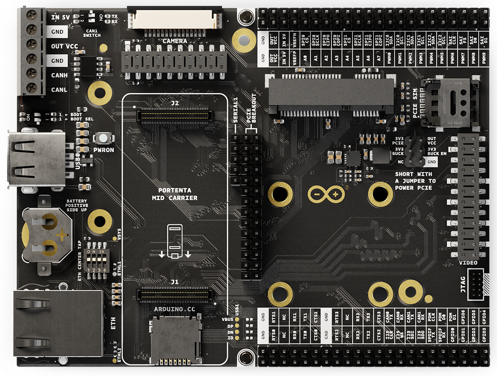

# Description 

The Arduino Portenta Mid Carrier speeds up project building for the Portenta board family, making connecting to High-Density signals through special headers easier. It works well with the Portenta C33, H7, and X8 boards, perfect for the Internet of Things, asset tracking, machine vision, robotics, and automation projects and applications. This carrier offers a variety of ports like CAN bus lines, Ethernet, microSD, and USB, plus connections for cameras and display shields. It also has special debug pins and a battery backup for real-time clocks, simplifying development. These key aspects make the Portenta Mid Carrier a vital tool for developing smart, connected devices quickly and effectively.

# Target Areas

Rapid prototyping, asset tracking, Internet of Things, machine vision, robotics, and automatization

# CONTENTS
## Application Examples

The Arduino Portenta Mid Carrier enhances various prototyping applications thanks to its flexible design. The Portenta Mid Carrier provides a robust platform for many projects, from industry-ready prototypes to machine vision and cellular connectivity testing. Here are some application examples:

- **Prototyping**: The Portenta Mid Carrier facilitates industry-ready prototyping by combining with Portenta family boards to expose essential peripherals such as microSD, Ethernet, and USB. It also simplifies debugging and inspection with dedicated pins for CAN bus lines, streamlining the development process.
- **Prototyping with external devices**: Enhance your Portenta boards with the Portenta Mid Carrier, which is ready for integration with a broad spectrum of external hardware components or devices. This adaptability makes it ideal for projects requiring embedded sensing or straightforward actuation, ensuring comprehensive support.
- **Reference design**: The Portenta Mid Carrier serves as an excellent reference design and aids in the development of custom products within the Portenta ecosystem. Arduino PRO's full development, production, and operation support provides a solid foundation for tailoring solutions to specific business needs.
- **Frictionless machine vision prototyping**: Pair the Portenta Mid Carrier with an MIPI or Arducam® camera to effortlessly embark on machine vision projects. Whether for object detection and recognition, defect identification, or asset tracking, the Portenta Mid Carrier streamlines the creation of complex vision-based applications.
- **Rapid testing of cellular connectivity**: Utilize the mini PCIe connector on the Portenta Mid Carrier for swift cellular connectivity testing. This feature is invaluable for applications in smart cities/buildings, remote maintenance, and fleet management, ensuring rapid data transmission even in locations lacking Wi-Fi® coverage.

## Features
### General Specifications Overview

The Arduino Portenta Mid Carrier is an excellent tool for building scalable projects based on the Portenta Family. The Carrier was designed to give quick access to all the essential signals of the Portenta family boards, making it easier to add new features to your projects with its Ethernet and mPCIe connectors. The board includes a microSD card slot starting from an external source, and it has CAN lines for connecting to actuators, which helps manage devices easily. You can also develop machine vision applications using the onboard camera connectors. The Mid Carrier is also a straightforward reference design for creating their hardware. 

The main features of the Portenta Mid Carrier are highlighted in the table below.

<table>
<thead>
  <tr>
    <th>Feature</th>
    <th>Description</th>
  </tr>
</thead>
<tbody>
  <tr>
    <td>Ethernet</td>
    <td>RJ45 connector (x1)</td>
  </tr>
  <tr>
    <td>USB Connectivity</td>
    <td>USB-A female connector for data logging and connection to external peripherals (x1)</td>
  </tr>
  <tr>
    <td>Power Supply</td>
    <td>Various options for easily powering the Carrier: onboard USB-C® port of the Portenta family board connected to the Carrier, and external power supply connected through the onboard screw terminal block and dedicated pins of the breakout header connectors of the Carrier</td>
  </tr>
  <tr>
    <td>Screw Terminal Block</td>
    <td>Used to power the carrier and for the CAN bus interface</td>
  </tr>
  <tr>
    <td>Breakout Header Connectors</td>
    <td>Available interfaces through the breakout headers are the following: UART (x4), I2S (x1), CAN bus (x2), SPDIF (x1), PDM (x1), GPIO (x7), SPI (x2), I2C (x3), SAI (x1), PWM (x10), analog channels (x8)</td>
  </tr>
  <tr>
    <td>Camera Connectors</td>
    <td>MIPI camera (x1), Digital Video Port (DVP) interface (x1)</td>
  </tr>
  <tr>
    <td>Debugging</td>
    <td>Onboard JTAG/SWD debug connector</td>
  </tr>
  <tr>
    <td>Dimensions</td>
    <td>114 mm x 86.5 mm</td>
  </tr>
  <tr>
    <td>Weight</td>
    <td>25 g</td>
  </tr>
  <tr>
    <td>Operating Temperature</td>
    <td>-40 °C to +85 °C</td>
  </tr>
</tbody>
</table>

### Related Accessories (Not Included)

- MIPI camera
- microSD card
- CR1225 (3 V) coin cell
- Arducam® DVP camera modules
- SIM card (only data compatible)

### Related Products

- Arduino® Portenta X8 (SKU: ABX00049)
- Arduino® Portenta C33 (SKU: ABX00074)
- Arduino® Portenta H7 (SKU: ABX00042/ABX00045/ABX00046)
- Arduino® Pro 4G Module EMEA (SKU: TPX00201)
- Arduino® Pro 4G GNSS Module Global (SKU: TPX00200)
- Arduino® GIGA Display Shield (SKU: ASX00039)
- Arduino USB Type-C® Cable 2-in-1 (SKU: TPX00094)

## Ratings

### Recommended Operating Conditions

The table below provides a comprehensive guideline for the optimal use of the Portenta Mid Carrier, outlining typical operating conditions and design limits. The operating conditions of the Portenta Mid Carrier are largely based on the specifications of its components.

|           **Parameter**          |    **Symbol**   | **Min** | **Typ** | **Max** | **Unit** |
|:--------------------------------:|:---------------:|:-------:|:-------:|:-------:|:--------:|
|     USB Supply Input Voltage     | VUSB |    -    |   5.0   |    -    |     V    |
| Supply Input Voltage1 |  VIN |    -    |   5.0   |    -    |     V    |
|       Operating Temperature      |  TOP |   -40   |    -    |    85   |    °C    |

1 Portenta Mid Carrier powered through its onboard screw terminal block (IN 5V terminal), or through its breakout pins header connector (IN 5V pins).
