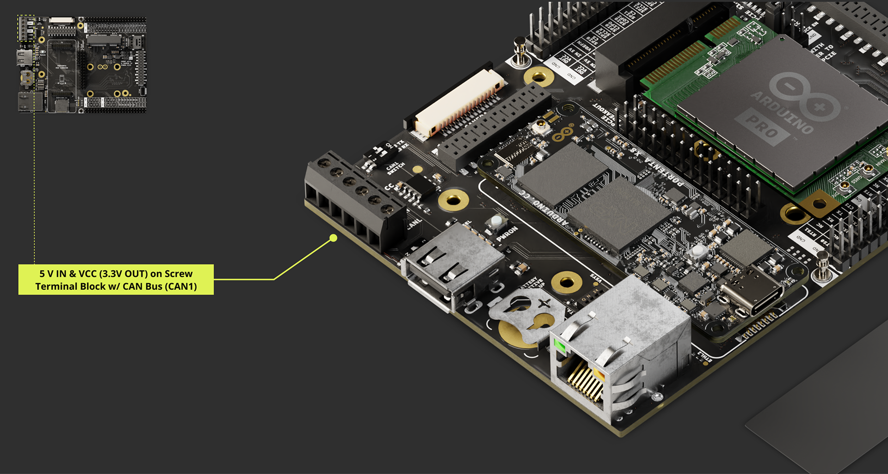
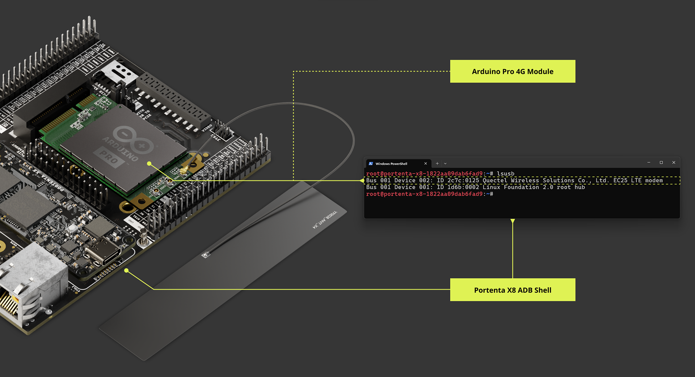
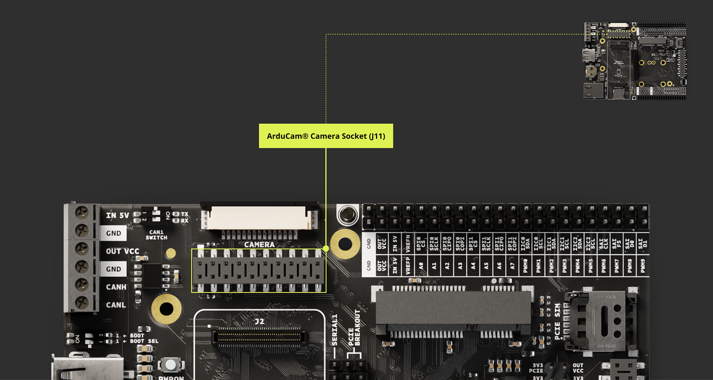
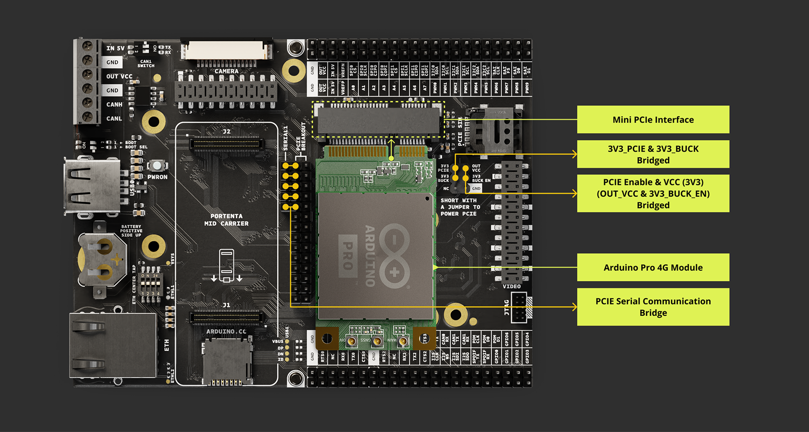
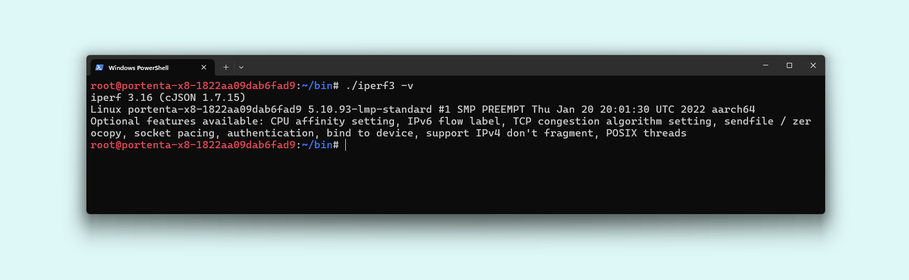
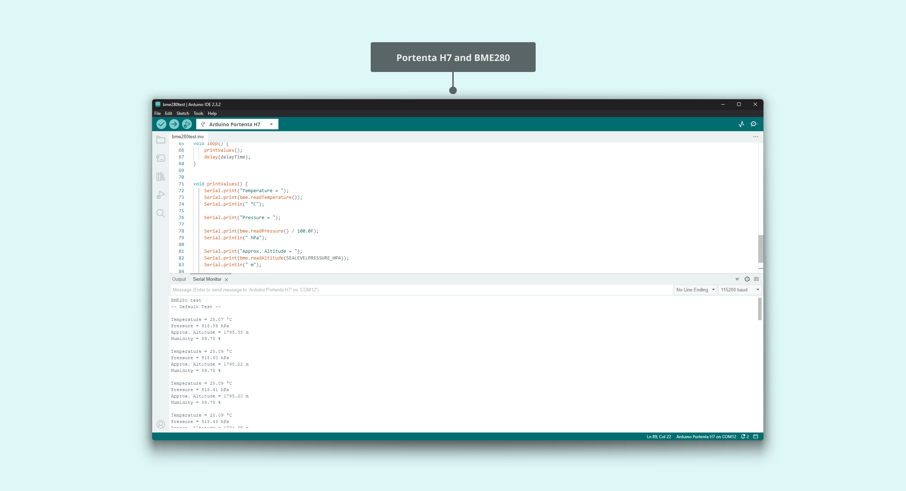
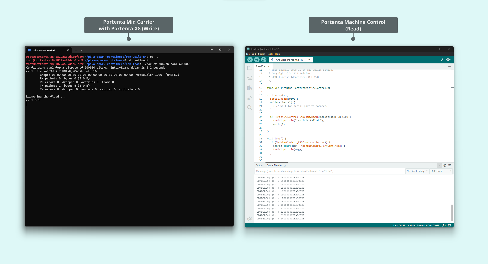

## Overview

The user manual comprehensively explains the **Arduino Portenta Mid Carrier**, compiling all its features in one place for easy accessibility. It includes instructions for setting up, testing, and using its various onboard functions.


This manual can help users deploy the Portenta Mid Carrier industrial prototyping, swift development of machine vision applications, control systems for active mechanical designs, and many more applications.

## Hardware and Software Requirements

### Hardware Requirements

The **Portenta Mid Carrier** requires one of the SOM boards from the Portenta Family for operation:

- [Portenta X8](https://store.arduino.cc/products/portenta-x8)
- [Portenta C33](https://store.arduino.cc/products/portenta-c33)
- [Portenta H7](https://store.arduino.cc/products/portenta-h7)

The following accessories are needed:

- USB-C® cable (either USB-C® to USB-A or USB-C® to USB-C®) (x1)
- Wi-Fi® Access Point or Ethernet with Internet access (x1)
- Compatible antennas like the [Arduino Pro 4G Module Antennas Kit](https://store.arduino.cc/products/4g-module-antenna) (x1)
- Power cables: Wires with a cross-sectional area ranging from 0.82 mm² to 1.3 mm², corresponding to AWG sizes 18 to 16

### Software Requirements

To use the Portenta Mid Carrier with a Portenta X8, please follow these guidelines:

- Ensure your Portenta X8 has the latest Linux image. Check [this section of Portenta X8's user manual](https://docs.arduino.cc/tutorials/portenta-x8/user-manual/#set-flashing-mode-with-carrier) to verify that your Portenta X8 is up-to-date.

***For the smooth functioning of the Portenta Mid Carrier with the Portenta X8, it is crucial to have at least Linux __image version > 746__ on the Portenta X8. To update your board to the latest image, use the [Portenta X8 Out-of-the-box](https://docs.arduino.cc/tutorials/portenta-x8/user-manual#out-of-the-box-experience) method or [manually flash it](https://docs.arduino.cc/tutorials/portenta-x8/user-manual#update-using-uuu-tool), downloading the most recent version from this [link](https://downloads.arduino.cc/portentax8image/image-latest.tar.gz).***

***To enter Flashing Mode with the Portenta X8 and the Portenta Mid Carrier, please consult the [BOOT DIP switch configuration](#boot-dip-switch) instructions within the present user manual.***

- You will need [Arduino IDE 1.8.10+](https://www.arduino.cc/en/software), [Arduino IDE 2.0+](https://www.arduino.cc/en/software), or the [Arduino Web Editor](https://create.arduino.cc/editor) if you plan to run Arduino code on the auxiliary microcontroller of the Portenta X8.

For using the Portenta Mid Carrier with a Portenta H7/C33:

- The [Arduino IDE 1.8.10+](https://www.arduino.cc/en/software), [Arduino IDE 2.0+](https://www.arduino.cc/en/software), or [Arduino Web Editor](https://create.arduino.cc/editor) is needed to use the Portenta H7/C33 to run the Arduino code.

## Product Overview


The **Portenta Mid Carrier** enhances the functionality of the Portenta family boards by providing a user-friendly platform for rapid prototyping. Designed for versatility, the carrier is fully compatible with all the Portenta SOM, making it a robust choice for a wide array of development and prototyping applications. It conveniently brings all high-density signals within reach through dedicated headers.


This carrier provides access to various peripherals. It highlights a Mini PCIe connector for Cat.4 cellular modules, suitable for solutions requiring extensive network coverage. It also includes two CAN lines, Ethernet, microSD, USB, camera connectors for DVP and MIPI interfaces, and a Display Serial Interface (DSI) compatible with GIGA Display Shield. Additionally, it features dedicated debug pins and an RTC battery backup, further enhancing the development experience by simplifying processes.


### Carrier Architecture Overview

The **Portenta Mid Carrier** is designed for the Portenta family of SOM boards and offers a versatile range of power supply options:

- Power input of 5.0 V via the screw terminal
- Power through USB-C® connection on Portenta SOM

Its extensive connectivity features include a USB-A port for peripheral devices, 1000 Mbit Base-T Ethernet, and various interfaces like SPI, I2C, I2S, and UART accessible through a dedicated male header. It also supports MIPI and ArduCam® camera connections. **The MIPI connector is specifically designed for the Portenta X8**.

The carrier integrates a microSD slot for data logging purposes. It has dedicated headers for diverse interface options, JTAG pins for debugging purposes, and a mini PCIe connector for Cat.4 cellular modules. The CAN bus can be used either via an onboard or external transceiver.


The Portenta Mid Carrier has the following characteristics:

- **Compatible SOM boards**: The carrier is compatible with the Portenta X8 (ABX00049), Portenta H7 (ABX00042/ABX00045/ABX00046) and Portenta C33 (ABX00074).

- **Power management**: The board can be powered up from different sources. The onboard screw terminal block allows a 5.0 V power supply to power the Portenta board, the carrier, and a mini PCIe module, if available.

  The USB-C® interface of the Portenta X8, H7, and C33 can supply the needed power to the board **when a 4G Module is not connected**. It will require a 5.0 V external power source when operating mPCIe modules to guarantee a consistent power supply for the Portenta SOM and its carrier.

The 5.0 V pin from the carrier's breakout male header can also power the board. **The carrier can deliver a maximum current of **2.0** A and therefore wires of at least 0.82 mm2 / 18 AWG are recommended.**

- **USB connectivity**: A USB-A female connector is used for data logging and supports 2.0 standard rates.

- **Communication**: The carrier supports Ethernet interface (X1) via RJ45 connector 1000 MBase-T connected to High-Density pins.

  The **SPI** (X2), **I2C** (x3), **I2S** (x1), and **UART** (x4) are accessible via dedicated breakout male header connectors (J14 - J15).

- Two **CAN** bus ports are available, and *CAN1* has an onboard transceiver controlled via *CAN1 DIP switch (SW2)*. The *CAN0* bus can be used with an external transceiver. *CAN0* and *CAN1* are available via the breakout pins header.
  
- The **MIPI** interface (high-speed differential serial interface) is compatible only with the Portenta X8. Examples of supported devices include the OmniVision OV5647 and the Sony IMX219 sensors. For Portenta MCU SOM, the ArduCam® connector is also available, providing a Display Video Port (DVP) parallel interface.

- **Storage**: The board has a microSD card slot and a USB-A female connector for data logging operation purposes.

- **Ethernet connectivity**: The carrier offers a Gigabit Ethernet interface through an RJ45 connector 1000 MBase-T. The Ethernet properties can be configured with a dedicated 4-way DIP switch. More information can be found in the [DIP switch configuration section](#dip-switch-configuration).

- **Mini PCIe Connector**: The carrier has a mini PCIe (Peripheral Component Interconnect Express) connector, i.e., an expansion card interface for modules compatible with its standard, such as Cat.4 modems as Arduino Pro 4G Modules.

- **PCIe Breakout Header**: Besides the standard breakout header, the carrier also features a specific PCIe breakout header. This header provides access to each pin, enabling manual probing or the creation of external extensions for prototyping purposes.

- **GIGA Display Shield Connector**: The Portenta Mid Carrier features a Display Serial Interface (DSI), which matches the Mobile Industry Processor Interface (MIPI) specifications, allowing it to connect displays that support MIPI DSI signals through its MIPI/DSI connector.

  The [GIGA Display Shield](#giga-display-shield-connector-j19) is compatible with the Portenta Mid Carrier. It is connected through the MIPI/DSI connector found on the carrier. This setup supports widely used frameworks like LVGL and GFX, enhancing its utility for various display applications.

- **Breakout Header**: The carrier eases access to all the high-density pins on the Portenta boards. It makes all pins associated with communication protocols, buses, and GPIOs easily accessible for various applications.

- **Screw terminal block**: The terminal block allows power supply line feed for the carrier and bus ports. It consists of VIN 5.0 VDC (x1), VCC 3.3 V (x1), CANH (CAN1) (x1), CANL (CAN1) (x1), and GND (x2).

- **Debug interface**: The carrier features an onboard 10x pin 1.27mm JTAG connector.

- **DIP switch**: The carrier features different DIP switches, allowing for different profiles for dedicated features or functionalities. The DIP switches are ETH CENTER TAP, BOOT, and CAN1. More information can be found in the [DIP switch configuration section](#dip-switch-configuration).

### Carrier Topology


| **Item**  | **Onboard modules**                                                              |
|:---------:|:---------------------------------------------------------------------------------|
|  J1 - J2  | High-Density connectors for Portenta boards                                      |
|    J3     | JTAG Interface                                                                   |
|    J4     | Screw Terminal Block with Onboard CAN Bus (CAN1) Transceiver                     |
|    J5     | RTC Li-Po battery slot                                                           |
|    J8     | Mini PCIe (Peripheral Component Interconnect Express) connector - (CELL Modules) |
|    J9     | Mini PCI Express Power breakout header                                           |
|    J10    | MIPI camera connector - exclusive for Portenta X8                                |
|    J11    | ArduCam® connector                                                               |
|    J12    | MicroSD slot for data logging operations                                         |
|    J13    | USB-A female connector                                                           |
| J14 - J15 | Breakout headers                                                                 |
|    J16    | Mini PCI Express Breakout Header                                                 |
|    J17    | Sub-series of Mini PCI Express Breakout Header                                   |
|    J18    | Gigabit Ethernet connector - RJ45                                                |
|    J19    | GIGA Display Shield connector (DSI)                                              |
|   SIM1    | Dedicated PCIe SIM Slot                                                          |
|    SW1    | BOOT DIP Switch                                                                  |
|    SW2    | CAN Bus - CAN1 - DIP Switch                                                      |
|    SW3    | ETH CENTER TAP DIP Switch                                                        |


### Pinout


### Datasheet

The complete datasheet is available and downloadable as PDF from the link below:

- [Portenta Mid Carrier Datasheet](https://docs.arduino.cc/resources/datasheets/ASX00055-datasheet.pdf)

### Schematics

The complete schematics are available and downloadable as PDF from the link below:

- [Portenta Mid Carrier Schematics](https://docs.arduino.cc/resources/schematics/ASX00055-schematics.pdf)

### STEP Files

The complete _STEP_ files are available and downloadable from the link below:

- [Portenta Mid Carrier STEP files](assets/ASX00055-step.zip)

### Mechanical Information

In this section, you can find mechanical information about the Portenta Mid Carrier. The board's dimensions are all specified here, within top and bottom views, including the placements of the components onboard.

Suppose you desire to design and manufacture a custom mounting device or create a custom enclosure for your carrier. In that case, the following image shows the dimensions for the mounting holes and general board layout. The given dimensions are all in **millimeters [mm]**.

You can also access the STEP files, available [here](assets/ASX00055-step.zip).


For reference, the following diagram outlines the dimensions measured between the connectors.


## First Use Of Your Portenta Mid Carrier

### Stack The Carrier

The design of the Portenta Mid Carrier enables effortless stacking of your preferred Portenta board.


The illustration below demonstrates the pairing of the Portenta Mid Carrier with Portenta boards via High-Density connectors.


Once the Portenta is mounted on the carrier, you can power the carrier and begin prototyping.

### Power The Board

The Portenta Mid Carrier offers several options for power supply:

- The most recommended method is using an **external 5.0 V power supply connected to the VIN pin on the screw terminal block of the board**. This approach ensures that the Portenta Mid Carrier, the SOM (System on Module), and any connected PCIe modules are adequately powered.

  ***To ensure the power demands are met, especially for the PMIC modules' external power, we recommend using cables that conform to appropriate electrical standards, such as ASTM B 258 standard, and can carry currents up to 2.0 A. __Cables with a cross-sectional area ranging from 0.82 mm² to 1.3 mm², corresponding to AWG 18-16, should be adequate to manage 2.0 A of current.__***

  For detailed information about connection points, please refer to the [board pinout section](#pinout) in the user manual. It is essential to ensure that the current provided meets the requirements of all components, as specified in the operating conditions table provided later.

- An external **5.0 V power supply** can also be used, connected to the 5.0 V pin on the dedicated breakout header.

  This method can power the Portenta Mid Carrier, the SOM, and any connected PCIe modules.

  For further information on this type of connection, consult the [board pinout section](#pinout) in the user manual. Ensure the power supply’s maximum current adheres to the specifications of all components.

- Using a USB-C® cable (not included) connected to the Portenta core board of your choice (like the Portenta X8, H7, or C33) also powers the selected core board and the Portenta Mid Carrier. **When a mPCIe module is attached, a 5.0 V external power source will be needed to ensure all connected boards receive a steady power supply.**

***The Portenta Mid Carrier can deliver a maximum current of __2.0 A__.***

The following diagram provides an overview of the power connection options available on the Portenta Mid Carrier, illustrating the different ways it can be powered:


***Please use a 5.0 V external power source when using an Arduino Pro 4G Module (EMEA / GNSS Global) or any other mPCIe modules due to their high power consumption. This is important for maintaining a stable power supply to the Portenta SOM and the carrier, particularly for extended periods of use.***

The image below focuses on the terminal block area of the Portenta Mid Carrier. This close-up view highlights the specific position for connecting the 5 V power sources within the terminal block:



Refer to the power tree diagram to understand how power is distributed within the Portenta Mid Carrier. This diagram visually represents the allocation of power resources within the carrier:


### Recommended Operating Conditions

To ensure the safety and longevity of the board, it is important to be aware of the Portenta Mid Carrier's operating conditions. The table provided below outlines the recommended operating conditions for the carrier:

|                     **Parameter**                     | **Min** | **Typ** | **Max** | **Unit** |
|:-----------------------------------------------------:|:-------:|:-------:|:-------:|:--------:|
|  5.0 V from onboard screw terminal\* of the Carrier   |    -    |   5.0   |    -    |    V     |
| USB-C® input from the connected Portenta family board |    -    |   5.0   |    -    |    V     |
|   +5 VDC from the carrier's onboard Breakout header   |    -    |   5.0   |    -    |    V     |
|            Current supplied by the carrier            |    -    |    -    |   2.0   |    A     |
|             Ambient operating temperature             |   -40   |    -    |   85    |    °C    |

***The onboard screw terminal powers both the carrier and the connected Portenta board.***

To ensure the power demands are met, and connectivity is reliable, especially for the PMIC modules' external power, we recommend using cables that conform to the appropriate electrical standards, such as ASTM B 258 standard and can carry currents up to 2.0 A. **Cables with a cross-sectional area ranging from 0.82 mm² to 1.3 mm², corresponding to AWG 18-16, should be adequate to manage 2.0 A of current.**

### Carrier Characteristics Highlight

The Portenta Mid Carrier's functionality varies depending on which Portenta family board it is paired with. The table below outlines these differences:

|             **Features**             | **Portenta X8** |                  **Portenta H7**                  | **Portenta C33** |
|:------------------------------------:|:---------------:|:-------------------------------------------------:|:----------------:|
|             MIPI Camera              |   Compatible    |                         -                         |        -         |
|               ArduCam®               |        -        |                     Available                     |    Available     |
|         GIGA Display Shield          |        -        | Compatible (Touchscreen Enabled w/ External Pins) |        -         |
|               Ethernet               |     1 Gbit      |                    10/100 Mbit                    |   10/100 Mbit    |
|              JTAG Debug              |    Available    |                     Available                     |    Available     |
|          Storage Expansion           |  MicroSD slot   |                   MicroSD slot                    |   MicroSD slot   |
|            Mini PCIe Slot            |    Available    |                     Available                     |    Available     |
| CAN FD (CAN1 - Onboard Transceiver)  |    Available    |                     Available                     |    Available     |
| CAN FD (CAN0 - External Transceiver) |    Available    |                         -                         |    Available     |
|            USB-A Support             |    Available    |                     Available                     |    Available     |

This table provides a quick overview of the Portenta Mid Carrier's performance when paired with different Portenta boards. Each feature will be detailed in the subsequent section, and a guide on properly connecting the Portenta boards will be provided.

## Hello World Carrier

### Hello World Using Linux

#### Using Portenta X8 with Linux

To effectively use the Portenta Mid Carrier with the Portenta X8, align the High-Density connectors and the USB-C® port facing outside the carrier. The accompanying diagrams illustrate how to stack the board onto the carrier.


***For optimal operation of the Portenta Mid Carrier with the Portenta X8, ensure you have at least version __> 746__ of the Linux image on the Portenta X8. The latest version can be downloaded [here]](https://downloads.arduino.cc/portentax8image/image-latest.tar.gz).***

#### Hello World With Portenta X8 Shell

To verify the correct functioning of the Portenta Mid Carrier with the Portenta X8, we will use several _Hello World_ examples with different approaches. These examples use Linux commands, Python® scripts, and the Arduino IDE to demonstrate various debugging methods and provide a basic introduction.

Starting with a _Hello World_ example using Linux commands, we control GPIO through the Portenta X8's shell. Instructions for connecting to the Portenta X8 shell can be found [here](https://docs.arduino.cc/tutorials/portenta-x8/user-manual#first-use-of-your-portenta-x8).

The commands below will help you set and control _GPIO3_, which can be linked to an LED or similar accessory.

Access the Portenta X8's shell using:

```bash
adb shell
sudo su -
```

Upon executing the `sudo su -` command, you will be prompted for a password:

***The default password is `fio`***

These grants root user access and the corresponding environment settings like `$HOME` and `$PATH.`

These commands provide elevated access to the Portenta X8's shell, enabling system configuration changes that require administrative rights.

Use the following command to activate the GPIO device in `/sys/class/`. Here, _GPIO3_ is identified as _GPIO 163_.

```bash
echo 163 > /sys/class/gpio/export
```

Check available GPIO elements with:

```bash
ls /sys/class/gpio
```

This lists all initialized GPIOs. To view details of _GPIO 163_ (or _GPIO3_), use:

```bash
ls /sys/class/gpio/gpio163
```

Once the GPIO3 elements are exported, configure the GPIO using this command to set the I/O state of the pin. It can be set as Input (`in`) or Output (`out`).

```bash
echo <I/O> >/sys/class/gpio/gpio163/direction
```

For our example, we set the pin as _Output_:

```bash
echo out >/sys/class/gpio/gpio163/direction
```

To confirm the pin's setting, use:

```bash
cat /sys/class/gpio/gpio163/direction
```

After setting the GPIO as an output, control its state by setting it to _High_ or _Low_.

To set the pin to _HIGH_:

```bash
echo 1 >/sys/class/gpio/gpio163/value
```

To set the pin to _LOW_:

```bash
echo 0 >/sys/class/gpio/gpio163/value
```

To stop controlling the GPIO, you can use the following command to _unexport_ it, ensuring it no longer appears in the userspace:

```bash
echo 163 >/sys/class/gpio/unexport
```

To confirm that the specified GPIO has been properly unexported, you can use the following command:

```bash
ls /sys/class/gpio
```

This step helps you to prevent unintentional modifications to the GPIO element configuration.

#### Hello World Using Linux and Python® Scripts

Instead of manually toggling the *GPIO3* on the Portenta X8 via the command line, we can use a Python® script for automation and extended control logic.

Here is a compatible script for the ADB shell on the Portenta X8:

```python
#!/usr/bin/env python3
import time

class GPIOController:
    def __init__(self, gpio_number):
        self.gpio_number = gpio_number
        self.gpio_path = f"/sys/class/gpio/gpio{gpio_number}/"

    def export(self):
        with open("/sys/class/gpio/export", "w") as f:
            f.write(str(self.gpio_number))

    def unexport(self):
        with open("/sys/class/gpio/unexport", "w") as f:
            f.write(str(self.gpio_number))

    def set_direction(self, direction):
        with open(f"{self.gpio_path}direction", "w") as f:
            f.write(direction)

    def read_direction(self):
        with open(f"{self.gpio_path}direction", "r") as f:
            return f.read().strip()

    def set_value(self, value):
        with open(f"{self.gpio_path}value", "w") as f:
            f.write(str(value))

    def read_value(self):
        with open(f"{self.gpio_path}value", "r") as f:
            return int(f.read().strip())

def main():
    print("============================================")
    print("Hello World!")
    print("============================================")

    gpio = GPIOController(163)

    # Export GPIO
    gpio.export()

    # Set as output
    gpio.set_direction("out")
    if gpio.read_direction() == "out":
        print("GPIO set as output.")
        print("GPIO3 blinking 20 times")


    # Turn on (set to 1) and then off (set to 0)
    for i in range(1,20,1):
        gpio.set_value(1)
        time.sleep(1)
        gpio.set_value(0)
        time.sleep(1)


    print("GPIO Unexport")
    gpio.unexport()
    print("End of the program")
    exit()

if __name__ == "__main__":
    main()
```

The script can be named `hello_world_python.py`, for example. To transfer it to the Portenta X8, use the following command on your computer's terminal:

```bash
adb push hello_world_python.py /home/fio
```

This uploads the file to the `/home/fio` directory. Navigate to the directory via the ADB shell:

```bash
cd /home/fio
```

Use the following command to run the script:

```bash
python3 hello_world_python.py
```

When the script runs, the Portenta Mid Carrier's GPIO3 will begin to toggle its state.

For more information on how the board operates and to maximize its use with the Portenta Mid Carrier, refer to the [Portenta X8 user manual](https://docs.arduino.cc/tutorials/portenta-x8/user-manual). 

The Portenta X8 works in a Linux environment based on the Yocto Linux distribution. It is recommendable to read how the Portenta X8 works in terms of Linux environment [here](https://docs.arduino.cc/tutorials/portenta-x8/user-manual#linux-environment).

### Hello World Using Arduino

#### Using Portenta X8 / H7 / C33 with Arduino

The Portenta X8 can also operate within the Arduino environment and retains the same hardware setup as explained [here](#using-portenta-x8-with-linux). It can become a handy tool when opting for the Remote Procedure Call (RPC) mechanism within development. You can find more information on RPC in the ["Data Exchange Between Python® on Linux & Arduino Sketch"](https://docs.arduino.cc/tutorials/portenta-x8/python-arduino-data-exchange/) tutorial.

The Portenta H7 and C33 boards have hardware setups identical to the Portenta X8. To mount them on the Mid Carrier, please align the High-Density connectors along with the USB-C® port orientation facing outside the carrier.

The diagrams below show how the Portenta H7 and C33 stack on the carrier:

- _Portenta H7_


- _Portenta C33_


#### Hello World With Arduino

In this section, you will learn how to use the Portenta X8, Portenta H7, or Portenta C33 with the Portenta Mid Carrier. You will interact with the GPIO3 pin within the Arduino environment.

Upon connecting a compatible Portenta board to the Portenta Mid Carrier, launch the Arduino IDE and set up the following code:

```arduino
// the setup function runs once when you press reset or power the board
void setup() {
  // Initialize the digital pin of the chosen SOM as an output
  pinMode(<DIGITAL_PIN>, OUTPUT);
}

// the loop function runs over and over again forever
void loop() {
  digitalWrite(<DIGITAL_PIN>, HIGH);         // turn the select pin on (HIGH is the voltage level)
  delay(1000);                               // wait for a second
  digitalWrite(<DIGITAL_PIN>, LOW);          // turn the select pin off by making the voltage LOW
  delay(1000);                               // wait for a second
}
```

Make sure to substitute `<DIGITAL_PIN>` with the specific value corresponding to the *GPIO3* for your Portenta board:

- **Portenta X8**: PF_4
- **Portenta H7**: PD_5
- **Portenta C33**: 30

For instance, with the Portenta X8, the script will be:

```arduino
// the setup function runs once when you press reset or power the board
void setup() {
  // Initialize the digital pin of the chosen SOM as an output
  pinMode(PF_4, OUTPUT);
}

// the loop function runs over and over again forever
void loop() {
  digitalWrite(PF_4, HIGH);         // turn the select pin on (HIGH is the voltage level)
  delay(1000);                      // wait for a second
  digitalWrite(PF_4, LOW);          // turn the select pin off by making the voltage LOW
  delay(1000);                      // wait for a second
}
```

Upon uploading the sketch to the board, *GPIO3* will be driven to switch its state. The image below shows the anticipated outcome if an oscilloscope probe is connected to *GPIO3*, exemplifying a blinking LED or any actuator that imitates signal switching.


Please check out the following documentation below to better understand each board and optimize its use with the Portenta Mid Carrier:

- [Portenta C33 user manual](https://docs.arduino.cc/tutorials/portenta-c33/user-manual).
- [Portenta H7 set-up guide](https://docs.arduino.cc/tutorials/portenta-h7/setting-up-portenta).
- [Portenta X8 user manual](https://docs.arduino.cc/tutorials/portenta-x8/user-manual#arduino-environment). Additionally, [here](https://docs.arduino.cc/tutorials/portenta-x8/uploading-sketches-m4) is a tutorial for a detailed guide on uploading sketches to the M4 Core on Arduino Portenta X8.

## Carrier Features and Interfaces

The carrier presents various features and interfaces to meet needs and applications. This section summarizes the key hardware interfaces, storage alternatives, and configuration methods incorporated into the carrier.

The following sub-sections offer a detailed examination of each feature's specifications, providing thorough information for the most effective use of the carrier.

## Hardware Interfaces

The present sub-section delves into the fundamental hardware connection points and interfaces on the Portenta Mid Carrier. It covers a variety of components, from the mini PCIe interface to the connectors and camera interfaces.

### High-Density Connectors

The Portenta X8, H7, and C33 models expand their capabilities using High-Density connectors. To fully grasp the functionality and layout of these connectors, it is recommended that you consult the detailed pinout documentation available for each Portenta model.

This documentation provides an in-depth view of the connectors, ensuring a comprehensive understanding of how they enhance the functionality of these devices.

- [Complete Portenta X8 pinout information](/resources/pinouts/ABX00049-full-pinout.pdf)
- [Complete Portenta H7 pinout information](https://docs.arduino.cc/resources/pinouts/ABX00042-full-pinout.pdf)
- [Complete Portenta C33 pinout information](https://docs.arduino.cc/resources/pinouts/ABX00074-full-pinout.pdf)

### Mini PCI Express Interface (J8)

**Mini PCIe**, short for Mini Peripheral Component Interconnect Express, is a compact version of the PCIe interface, predominantly used in laptops and small devices for adding functionalities like Wi-Fi®, Bluetooth®, and cellular modems.

These cards are significantly smaller than standard PCIe cards, typically measuring around 30 mm x 50.95 mm, and are designed to fit into the limited spaces of compact systems. They connect to a motherboard via a dedicated Mini PCIe slot, supporting PCIe and USB 2.0 interfaces. They are available in full-size and half-size variants.

In its portfolio, Arduino has two mini PCIe modules compatible with Portenta Mid Carrier, the **Arduino Pro 4G Module**, a Cat.4 modem mini PCIe card available in two variants: **EMEA** and **GNSS Global**.


The onboard Mini PCIe slot of the Portenta Mid Carrier has the following pin layout:

| **Pin Number** | **Silkscreen Pin** |  **Power Net**  | **Portenta Standard Pin** |                         **High-Density Pin**                         |                  **Pin Detail**                   |
|:--------------:|:------------------:|:---------------:|:-------------------------:|:--------------------------------------------------------------------:|:-------------------------------------------------:|
|       1        |        N/A         |                 |                           |                                                                      |       Connected to pin 23 of J16 connector        |
|       2        |        N/A         | +3V3 PCIE (Out) |                           |                                                                      | From PCIE dedicated high current 3V3 power supply |
|       3        |        N/A         |                 |                           |                                                                      |       Connected to pin 21 of J16 connector        |
|       4        |        N/A         |     Ground      |            GND            | J1-22, J1-31, J1-42, J1-47, J1-54, J2-24, J2-33, J2-44, J2-57, J2-70 |                                                   |
|       5        |        N/A         |                 |                           |                                                                      |       Connected to pin 19 of J16 connector        |
|       6        |        N/A         |                 |                           |                                                                      |       Connected to pin 17 of J16 connector        |
|       7        |        N/A         |                 |          GPIO_1           |                                J2-48                                 |                                                   |
|       8        |        N/A         |                 |                           |                                                                      |         Connected to pin C1 of SIM1 slot          |
|       9        |        N/A         |     Ground      |            GND            | J1-22, J1-31, J1-42, J1-47, J1-54, J2-24, J2-33, J2-44, J2-57, J2-70 |                                                   |
|       10       |        N/A         |                 |                           |                                                                      |         Connected to pin C7 of SIM1 slot          |
|       11       |        N/A         |                 |         PCIE_CK_N         |                                J2-19                                 |                                                   |
|       12       |        N/A         |                 |                           |                                                                      |         Connected to pin C3 of SIM1 slot          |
|       13       |        N/A         |                 |         PCIE_CK_P         |                                J2-17                                 |                                                   |
|       14       |        N/A         |                 |                           |                                                                      |         Connected to pin C2 of SIM1 slot          |
|       15       |        N/A         |     Ground      |            GND            | J1-22, J1-31, J1-42, J1-47, J1-54, J2-24, J2-33, J2-44, J2-57, J2-70 |                                                   |
|       16       |        N/A         |                 |                           |                                                                      |       Connected to pin 15 of J16 connector        |
|       17       |        N/A         |                 |                           |                                                                      |       Connected to pin 13 of J16 connector        |
|       18       |        N/A         |     Ground      |            GND            | J1-22, J1-31, J1-42, J1-47, J1-54, J2-24, J2-33, J2-44, J2-57, J2-70 |                                                   |
|       19       |        N/A         |                 |                           |                                                                      |       Connected to pin 11 of J16 connector        |
|       20       |        N/A         |                 |          GPIO_2           |                                J2-50                                 |                                                   |
|       21       |        N/A         |     Ground      |            GND            | J1-22, J1-31, J1-42, J1-47, J1-54 J2-24, J2-33, J2-44, J2-57, J2-70  |                                                   |
|       22       |        N/A         |                 |         PCIE_RST          |                                J2-21                                 |        Connected to pin 9 of J16 connector        |
|       23       |        N/A         |                 |         PCIE_RX_N         |                                J2-15                                 |                                                   |
|       24       |        N/A         | +3V3 PCIE (Out) |                           |                                                                      | From PCIE dedicated high current 3V3 power supply |
|       25       |        N/A         |                 |         PCIE_RX_P         |                                J2-13                                 |                                                   |
|       26       |        N/A         |     Ground      |            GND            | J1-22, J1-31, J1-42, J1-47, J1-54, J2-24, J2-33, J2-44, J2-57, J2-70 |                                                   |
|       27       |        N/A         |     Ground      |            GND            | J1-22, J1-31, J1-42, J1-47, J1-54, J2-24, J2-33, J2-44, J2-57, J2-70 |                                                   |
|       28       |        N/A         |                 |                           |                                                                      |       Connected to pin 22 of J16 connector        |
|       29       |        N/A         |     Ground      |            GND            | J1-22, J1-31, J1-42, J1-47, J1-54, J2-24, J2-33, J2-44, J2-57, J2-70 |                                                   |
|       30       |        N/A         |                 |         I2C0_SCL          |                                J1-46                                 |       Connected to pin 28 of J15 connector        |
|       31       |        N/A         |                 |         PCIE_TX_N         |                                J2-11                                 |                                                   |
|       32       |        N/A         |                 |         I2C0_SDA          |                                J1-44                                 |       Connected to pin 26 of J15 connector        |
|       33       |        N/A         |                 |         PCIE_TX_P         |                                 J2-9                                 |                                                   |
|       34       |        N/A         |     Ground      |            GND            | J1-22, J1-31, J1-42, J1-47, J1-54, J2-24, J2-33, J2-44, J2-57, J2-70 |                                                   |
|       35       |        N/A         |     Ground      |            GND            | J1-22, J1-31, J1-42, J1-47, J1-54, J2-24, J2-33, J2-44, J2-57, J2-70 |                                                   |
|       36       |        N/A         |                 |         USB0_D_N          |                                J1-28                                 |         Connected to USB-A connector J13          |
|       37       |        N/A         |     Ground      |            GND            | J1-22, J1-31, J1-42, J1-47, J1-54, J2-24, J2-33, J2-44, J2-57, J2-70 |                                                   |
|       38       |        N/A         |                 |         USB0_D_P          |                                J1-26                                 |         Connected to USB-A connector J13          |
|       39       |        N/A         | +3V3 PCIE (Out) |                           |                                                                      | From PCIE dedicated high current 3V3 power supply |
|       40       |        N/A         |     Ground      |            GND            | J1-22, J1-31, J1-42, J1-47, J1-54, J2-24, J2-33, J2-44, J2-57, J2-70 |                                                   |
|       41       |        N/A         | +3V3 PCIE (Out) |                           |                                                                      | From PCIE dedicated high current 3V3 power supply |
|       42       |        N/A         |                 |                           |                                                                      |       Connected to pin 20 of J16 connector        |
|       43       |        N/A         |     Ground      |            GND            | J1-22, J1-31, J1-42, J1-47, J1-54, J2-24, J2-33, J2-44, J2-57, J2-70 |                                                   |
|       44       |        N/A         |                 |                           |                                                                      |       Connected to pin 18 of J16 connector        |
|       45       |        N/A         |                 |                           |                                                                      |       Connected to pin 12 of J16 connector        |
|       46       |        N/A         |                 |                           |                                                                      |       Connected to pin 16 of J16 connector        |
|       47       |        N/A         |                 |                           |                                                                      |       Connected to pin 10 of J16 connector        |
|       48       |        N/A         |                 |                           |                                                                      |       Connected to pin 14 of J16 connector        |
|       49       |        N/A         |                 |                           |                                                                      |        Connected to pin 8 of J16 connector        |
|       50       |        N/A         |     Ground      |            GND            | J1-22, J1-31, J1-42, J1-47, J1-54, J2-24, J2-33, J2-44, J2-57, J2-70 |                                                   |
|       51       |        N/A         |                 |                           |                                                                      |        Connected to pin 6 of J16 connector        |
|       52       |        N/A         | +3V3 PCIE (Out) |                           |                                                                      | From PCIE dedicated high current 3V3 power supply |

#### Mini PCIe Power Breakout Header (J9)

The Mini PCIe slot of the Portenta Mid Carrier has a dedicated breakout pin to control the power distribution of its interface.

| **Pin Number** | **Silkscreen Pin** |    **Power Net**    | **Portenta Standard Pin** | **High-Density Pin** |
|:--------------:|:------------------:|:-------------------:|:-------------------------:|:--------------------:|
|       1        |      3V3 PCIE      |   +3V3 PCIE (Out)   |                           |                      |
|       2        |        VCC         | +3V3 Portenta (Out) |                           |                      |
|       3        |      3V3 BUCK      |   +3V3 Buck (Out)   |                           |                      |
|       4        |    PCIE ENABLE     |       PCIE_EN       |          GPIO_5           |        J2-56         |
|       5        |         NC         |                     |            NC             |                      |
|       6        |        GND         |       Ground        |                           |                      |

To accommodate the power requirements and ensure reliable connectivity, jumper cables with appropriate electrical standards, such as ASTM B 258 standard, should be used to support a current of up to 2A. **Jumper cables with a cross-sectional area of 0.82 mm² to 1.3 mm² (approximately equivalent to AWG 18-16) should support 2.0 A of current**.

This precaution is necessary to prevent wire overheating and ensure reliable power transmission for the connected Mini PCIe-compatible module, such as Cat.4 modems. A minimum requirement to set the mini PCIe interface with the Portenta Mid Carrier consists of:

- **3V3 PCIE** pin connected to **3V3 BUCK** pin
- Properly inserted mini PCIe module, e.g., Pro 4G GNSS Module Global / Pro 4G EMEA Module

***Please use a 5.0 V external power source when using an Arduino Pro 4G Module (EMEA / GNSS Global) or any other mPCIe modules due to their high power consumption. This is important for maintaining a stable power supply to the Portenta SOM and the carrier, particularly for extended periods of use.***


The following animation shows the assembly process using a mini PCIe slot compatible with the Pro 4G module.


***To immediately jump to the Pro 4G Module integration with the Portenta Mid Carrier, you can go to the [Cat.4 Modem (Cellular Connectivity)](#cat4-modem-cellular-connectivity) subsection within the [Network Connectivity](#network-connectivity) section.***

#### Accessing Mini PCIe Interface

It is possible to know if the compatible mini PCIe module has been correctly set up and detected using the Portenta X8. The Portenta Mid Carrier's mini PCIe lanes contain USB lines, and the Pro 4G Module is recognized as a USB module.

Thus, to verify that the Pro 4G Module has been correctly powered up and recognized by the Portenta X8 with the Portenta Mid Carrier, the following command is used instead of the `lspci` command:

```bash
lsusb
```

The above command will list the devices that the Portenta X8 has recognized. The following image shows similar results if the Pro 4G Module is detected.



***To learn about implementing the Pro 4G Module with the Portenta Mid Carrier immediately, you can jump to the [Cat.4 Modem (Cellular Connectivity)](#cat4-modem-cellular-connectivity) section under the [Network Connectivity](#network-connectivity) section.***

### MIPI Camera Connector(J10)

The Portenta Mid Carrier integrates a dedicated camera connector, enabling the Portenta X8 to interface with MIPI cameras. However, it is important to note that the out-of-the-box Alpine shell does not support specific commands directly through the ADB shell.

In contrast, the Portenta H7 and C33 models do not support the MIPI interface and thus cannot use the camera connector.


The MIPI connector's pin distribution is as follows:

| **Pin number** | **Power Net** | **Portenta HD Standard Pin** |                         **High-Density Pin**                         | **Interface** |
|:--------------:|:-------------:|:----------------------------:|:--------------------------------------------------------------------:|:-------------:|
|       1        |      GND      |             GND              | J1-22, J1-31, J1-42, J1-47, J1-54, J2-24, J2-33, J2-44, J2-57, J2-70 |               |
|       2        |               |         CAM_D0_D0_N          |                                J2-16                                 |               |
|       3        |               |         CAM_D1_D0_P          |                                J2-14                                 |               |
|       4        |      GND      |             GND              | J1-22, J1-31, J1-42, J1-47, J1-54, J2-24, J2-33, J2-44, J2-57, J2-70 |               |
|       5        |               |         CAM_D2_D1_N          |                                J2-12                                 |               |
|       6        |               |         CAM_D3_D1_P          |                                J2-10                                 |               |
|       7        |      GND      |             GND              | J1-22, J1-31, J1-42, J1-47, J1-54, J2-24, J2-33, J2-44, J2-57, J2-70 |               |
|       8        |               |         CAM_CK_CK_N          |                                J2-20                                 |               |
|       9        |               |         CAM_VS_CK_P          |                                J2-18                                 |               |
|       10       |      GND      |             GND              | J1-22, J1-31, J1-42, J1-47, J1-54, J2-24, J2-33, J2-44, J2-57, J2-70 |               |
|       11       |               |            GPIO_5            |                                J2-56                                 |               |
|       12       |               |              NC              |                                  NC                                  |               |
|       13       |               |           I2C1_SCL           |                                J1-45                                 |   I2C 1 SCL   |
|       14       |               |           I2C1_SDA           |                                J1-43                                 |   I2C 1 SDA   |
|       15       | +3V3_PORTENTA |             VCC              |                      J2-23, J2-34, J2-43, J2-69                      |               |

The Portenta Mid Carrier supports MIPI cameras when paired with the Portenta X8, allowing for a flexible connection to compatible cameras via a flex cable. 


The following camera devices are compatible:

- OmniVision OV5647 sensor (Raspberry Pi® Camera Module 1)
- Sony IMX219 sensor (Raspberry Pi® Camera Module 2)


#### Using Linux

To initialize the Raspberry Pi Camera v1.3, based on the **OV5647 CMOS** sensor, follow these steps using the Portenta X8 environment, which will set environment variables and specify camera and board overlays:

```bash
fw_setenv carrier_custom 1
```

```bash
fw_setenv is_on_carrier yes
```

```bash
fw_setenv carrier_name mid
```

```bash
fw_setenv overlays 'ov_som_lbee5kl1dx ov_som_x8h7 ov_carrier_breakout_usbfs ov_carrier_mid_pcie_mini ov_carrier_mid_ov5647_camera_mipi'
```

Then, you can consider proceeding to start the camera to capture beginning with the runtime directory definition for `Wayland` and load the _OV5647_ camera module:

```bash
export XDG_RUNTIME_DIR=/run # location of wayland-0 socket
modprobe ov5647_mipi
```

Check the supported formats and controls of the connected video device:

```bash
v4l2-ctl --list-formats-ext --device /dev/video0
v4l2-ctl -d /dev/video0 --list-ctrls
```

Capture a single frame in _JPEG_ format using __GStreamer__:

```bash
export GST_DEBUG=3
gst-top-1.0 gst-launch-1.0 -v v4l2src device=/dev/video0 num-buffers=1 ! "video/x-bayer, format=bggr, width=640, height=480, bpp=8, framerate=30/1"  ! bayer2rgbneon reduce-bpp=t ! jpegenc ! filesink location=/tmp/test.jpg
```

This command allows to capture one frame and save the file as `/tmp/test.jpg`. To stream video at 30FPS for approximately 10 seconds using `GStreamer`, the following command is used:

```bash
gst-top-1.0 gst-launch-1.0 -v v4l2src device=/dev/video0 num-buffers=300 ! "video/x-bayer, format=bggr, width=640, height=480, bpp=8, framerate=30/1"  ! bayer2rgbneon reduce-bpp=t ! queue ! waylandsink
```

Following these instructions, you can capture and stream video from the Raspberry Pi Camera v1.3 with the OV5647 sensor.

***For improved image quality, consider using a MIPI camera module with an integrated Image Signal Processor (ISP).***

### ArduCam® Compatibility Via Camera Socket (J11)

The Portenta Mid Carrier is also characterized for compatibility with the ArduCam® via the Digital Video Port (DVP) interface. Its compatibility can go with HM01B0, HM0360, GC2145, or OV7675 modules.



The connection is accomplished via the Camera socket (J11), and it is specified as follows:

| **Pin Number** | **Silkscreen Pin** |    **Power Net**    | **Portenta Standard Pin** |                         **High-Density Pin**                         |
|:--------------:|:------------------:|:-------------------:|:-------------------------:|:--------------------------------------------------------------------:|
|       1        |        VCC         | +3V3 Portenta (Out) |            VCC            |                      J2-23, J2-34, J2-43, J2-69                      |
|       2        |        GND         |       Ground        |            GND            | J1-22, J1-31, J1-42, J1-47, J1-54, J2-24, J2-33, J2-44, J2-57, J2-70 |
|       3        |        SCL0        |                     |         I2C0_SCL          |                                J1-46                                 |
|       4        |        SDA0        |                     |         I2C0_SDA          |                                J1-44                                 |
|       5        |       VSYNC        |                     |        CAM_VS_CK_P        |                                J2-18                                 |
|       6        |        HREF        |                     |          CAM_HS           |                                J2-22                                 |
|       7        |        PCLK        |                     |        CAM_CK_CK_N        |                                J2-20                                 |
|       8        |        XCLK        |                     |           PWM_0           |                                J2-59                                 |
|       9        |       DOUT7        |                     |        CAM_D7_D3_P        |                                 J2-2                                 |
|       10       |       DOUT6        |                     |        CAM_D6_D3_N        |                                 J2-4                                 |
|       11       |       DOUT5        |                     |        CAM_D5_D2_P        |                                 J2-6                                 |
|       12       |       DOUT4        |                     |        CAM_D4_D2_N        |                                 J2-8                                 |
|       13       |       DOUT3        |                     |        CAM_D3_D1_P        |                                J2-10                                 |
|       14       |       DOUT2        |                     |        CAM_D2_D1_N        |                                J2-12                                 |
|       15       |       DOUT1        |                     |        CAM_D1_D0_P        |                                J2-14                                 |
|       16       |       DOUT0        |                     |        CAM_D0_D0_N        |                                J2-16                                 |
|       17       |     PWRENABLE      |                     |          GPIO_3           |                                J2-52                                 |
|       18       |        PWDN        |                     |          GPIO_4           |                                J2-54                                 |
|       19       |     PWRENABLE      |                     |          GPIO_3           |                                J2-52                                 |
|       20       |        PWDN        |                     |          GPIO_4           |                                J2-54                                 |

The following image shows the camera socket close-up of the Portenta Mid Carrier with an ArduCam® module that may be used to stack on the carrier.


As well as the following clip shows *Arducam-F Shield V2 Camera module shield with OV2640*, which is compatible with the Portenta Mid Carrier when paired with the Portenta H7 and C33.


#### Using Arduino

The [arducam_dvp](https://www.arduino.cc/reference/en/libraries/arducam_dvp/) library provides an example that supports three types of camera models: OV7670, Himax HM0360, Himax HM01B0, and GC2145. It captures pixel data and stores it in a frame buffer. These stored frames can subsequently be accessed continuously for further processing. It is compatible with the Portenta H7, and the *CameraCaptureRawBytes* example looks as follows:

```arduino
#include "arducam_dvp.h"

#define ARDUCAM_CAMERA_HM01B0

#ifdef ARDUCAM_CAMERA_HM01B0
    #include "Himax_HM01B0/himax.h"
    HM01B0 himax;
    Camera cam(himax);
    #define IMAGE_MODE CAMERA_GRAYSCALE
#elif defined(ARDUCAM_CAMERA_HM0360)
    #include "Himax_HM0360/hm0360.h"
    HM0360 himax;
    Camera cam(himax);
    #define IMAGE_MODE CAMERA_GRAYSCALE
#elif defined(ARDUCAM_CAMERA_OV767X)
    #include "OV7670/ov767x.h"
    // OV7670 ov767x;
    OV7675 ov767x;
    Camera cam(ov767x);
    #define IMAGE_MODE CAMERA_RGB565
#elif defined(ARDUCAM_CAMERA_GC2145)
    #include "GC2145/gc2145.h"
    GC2145 galaxyCore;
    Camera cam(galaxyCore);
    #define IMAGE_MODE CAMERA_RGB565
#endif

FrameBuffer fb;

void blinkLED(uint32_t count = 0xFFFFFFFF,uint32_t t_delay = 50)
{
    while (count--)
    {
        digitalWrite(LED_BUILTIN, LOW);  // turn the LED on (HIGH is the voltage level)
        delay(t_delay);                  // wait for a second
        digitalWrite(LED_BUILTIN, HIGH); // turn the LED off by making the voltage LOW
        delay(t_delay);                  // wait for a second
    }
}


void setup()
{
    pinMode(LED_BUILTIN, OUTPUT);
    // Init the cam QVGA, 30FPS
    if (!cam.begin(CAMERA_R320x240, IMAGE_MODE, 30))
    {
        blinkLED();
    }
    blinkLED(5);
    Serial.begin(921600);
}

void loop()
{
    if(Serial.read() != 0x01)
    {
        blinkLED(1,10);
        return;
    }
    // Grab frame and write to serial
    if (cam.grabFrame(fb, 3000) == 0)
    {
        Serial.write(fb.getBuffer(), cam.frameSize());
     }
    else
    {
        blinkLED(20,100);
        delay(1000);
    }
}
```

For the Portenta C33, given it has a different architecture, it is possible to navigate using the official ArduCam® source known as [Arducam_Mega](https://github.com/ArduCAM/Arducam_Mega) library.

### GIGA Display Shield Connector (J19)

The [Arduino GIGA Display Shield](https://docs.arduino.cc/hardware/giga-display-shield) is an add-on that can be used with the Portenta Mid Carrier, offering an 800x480 display with touch support. The display shield can be connected via MIPI DSI (Display Serial Interface).


The shield also features a camera connector, built-in IMU, microphone, and an RGB pixel. The video display connector (J19) of the carrier is specified in the following table:

| **Pin Number** | **Silkscreen Pin** |    **Power Net**    | **Portenta Standard Pin** |                         **High-Density Pin**                         |
|:--------------:|:------------------:|:-------------------:|:-------------------------:|:--------------------------------------------------------------------:|
|       1        |      DSI D1N       |                     |         DSI_D1_N          |                                J1-12                                 |
|       2        |      DSI D1P       |                     |         DSI_D1_P          |                                J1-10                                 |
|       3        |        GND         |       Ground        |            GND            | J1-22, J1-31, J1-42, J1-47, J1-54, J2-24, J2-33, J2-44, J2-57, J2-70 |
|       4        |        GND         |       Ground        |            GND            | J1-22, J1-31, J1-42, J1-47, J1-54, J2-24, J2-33, J2-44, J2-57, J2-70 |
|       5        |      DSI CKN       |                     |         DSI_CK_N          |                                J1-20                                 |
|       6        |      DSI CKP       |                     |         DSI_CK_P          |                                J1-18                                 |
|       7        |        GND         |       Ground        |            GND            | J1-22, J1-31, J1-42, J1-47, J1-54, J2-24, J2-33, J2-44, J2-57, J2-70 |
|       8        |        GND         |       Ground        |            GND            | J1-22, J1-31, J1-42, J1-47, J1-54, J2-24, J2-33, J2-44, J2-57, J2-70 |
|       9        |      DSI D0N       |                     |         DSI_D0_N          |                                J1-16                                 |
|       10       |      DSI D0P       |                     |         DSI_D0_P          |                                J1-14                                 |
|       11       |        GND         |       Ground        |            GND            | J1-22, J1-31, J1-42, J1-47, J1-54, J2-24, J2-33, J2-44, J2-57, J2-70 |
|       12       |        GND         |       Ground        |            GND            | J1-22, J1-31, J1-42, J1-47, J1-54, J2-24, J2-33, J2-44, J2-57, J2-70 |
|       13       |      DSI D2N       |                     |         DSI_D2_N          |                                 J1-8                                 |
|       14       |      DSI D2P       |                     |         DSI_D2_P          |                                 J1-6                                 |
|       15       |        GND         |       Ground        |            GND            | J1-22, J1-31, J1-42, J1-47, J1-54, J2-24, J2-33, J2-44, J2-57, J2-70 |
|       16       |        GND         |       Ground        |            GND            | J1-22, J1-31, J1-42, J1-47, J1-54, J2-24, J2-33, J2-44, J2-57, J2-70 |
|       17       |      DSI D3N       |                     |         DSI_D3_N          |                                 J1-4                                 |
|       18       |      DSI D3P       |                     |         DSI_D3_P          |                                 J1-2                                 |
|       19       |         NC         |                     |            NC             |                                  NC                                  |
|       20       |         NC         |                     |            NC             |                                  NC                                  |
|       21       |        VIN         |    +5V (In/Out)     |            VIN            |                      J1-21, J1-32, J1-41, J1-48                      |
|       22       |        GND         |       Ground        |            GND            | J1-22, J1-31, J1-42, J1-47, J1-54, J2-24, J2-33, J2-44, J2-57, J2-70 |
|       23       |        VCC         | +3V3 Portenta (Out) |            VCC            |                      J2-23, J2-34, J2-43, J2-69                      |
|       24       |        VIN         |    +5V (In/Out)     |            VIN            |                      J1-21, J1-32, J1-41, J1-48                      |

The *MIPI DSI (Mobile Industry Processor Interface Display Serial Interface)* connector provides a high-speed interface that supports complex display functionalities like high resolutions and color depths. Its design is suitable for compact and mobile devices, making it ideal for applications where space and power efficiency are critical.

The following image shows the orientation of the connection between the GIGA Display Shield and the Portenta Mid Carrier.


For a more detailed connection orientation with a brief pinout designation, the following diagram might help you understand how to stack the GIGA Display Shield to the Portenta Mid Carrier.


Once you have aligned and connected the Portenta Mid Carrier with the GIGA Display Shield, you should have a similar setup as in the following image:


#### Using Linux

To review the current device tree overlay configurations, which are crucial for hardware feature management and system customization, to interface with the GIGA Display Shield, use the following command:

```bash
fw_printenv overlays
```

This command invokes the `fw_printenv` utility to display overlays from the U-Boot firmware settings. Overlays are instrumental in defining modifications or additions to the device's hardware configuration without altering the base device tree.

This can include enabling additional peripherals, configuring pin mappings, or activating specific hardware features, providing a flexible approach to hardware customization. From this, the following overlay should be available:

```bash
ov_carrier_mid_dsi_panel
```

If it is not present, the following steps will help you to set the needed overlays to use the GIGA Display Shield. Access the docker container named **x8-devel** with the following command:

```bash
docker exec -it x8-devel sh
```

This command uses **docker exec** to begin a new shell session inside the running **x8-devel** container. The `-it` flags ensure an interactive terminal session, providing direct command execution within the container's environment. This is particularly useful for development purposes, enabling code editing, process monitoring, or debugging tasks within the isolated context of the container.

We need to search for **tenta_runner** Python script, and the following command can help to locate the script:

```bash
find / -name *.py
```

Starting from the root directory, this command recursively searches for files ending in `.py`, indicating Python scripts. This search aids in locating Python-based utilities, scripts, or applications scattered across the system.

Having located the **tenta_runner.py**, navigate to the directory using the following command:

```bash
cd /root/examples/tenta-config
```

Run the **tenta_runner.py** script using the following command:

```bash
python tenta_runner.py
```

The script will bring up a GUI within the `tenta` framework. When the **tenta-config** window is up, please select **Portenta Mid Carrier**.


It will then show a list of available options that can be executed within the Portenta Mid Carrier platform. Here, the **Enable alternative overlays** option will be selected.


Because the GIGA Display Shield will be used, **Removes video output on USB-C enables video output on DSI connector** configuration will be selected. This configuration will disable video output via the USB-C connector and switch the video output to be available to the DSI connector. 


Once selected, it will prompt a message showing differences that overlays will have after the change.


Proceed to accept with **Ok**, and the device will now be ready with the overlays to enable video output on the DSI connector.


We can now observe if the GIGA Display Shield is powered on and ready for use, having the shield connected to the Portenta Mid Carrier.

#### Using Arduino IDEs

With the Portenta H7, it is possible to use the following example:

```arduino
/*
  ArduinoLogo

  created 17 Apr 2023
  by Leonardo Cavagnis
*/

#include "Arduino_H7_Video.h"
#include "ArduinoGraphics.h"

#include "img_arduinologo.h"
// Alternatively, any raw RGB565 image can be included on demand using this macro
// Online image converter: https://lvgl.io/tools/imageconverter (Output format: Binary RGB565)
/*
#define INCBIN_PREFIX
#include "incbin.h"
INCBIN(test, "/home/user/Downloads/test.bin");
*/

Arduino_H7_Video Display(800, 480, GigaDisplayShield);
//Arduino_H7_Video Display(1024, 768, USBCVideo);

Image img_arduinologo(ENCODING_RGB16, (uint8_t *) texture_raw, 300, 300);

void setup() {
  Display.begin();

  Display.beginDraw();
  Display.image(img_arduinologo, (Display.width() - img_arduinologo.width())/2, (Display.height() - img_arduinologo.height())/2);
  Display.endDraw();
}

void loop() { }
```

It will require the **ArduinoGraphics** library installed to compile the code without any issues. 

The example can be found within the Arduino IDE, and it is located under **File -> Examples -> Portenta_H7_Video**. The name of the example is **ArduinoLogo**.

Once the example has been compiled and uploaded to the Portenta H7, you will be able to see the Arduino logo drawn on the GIGA Display Shield.

### CAN FD (Onboard Transceiver)

The Portenta Mid Carrier is equipped with a CAN bus port that connects to a screw terminal block. This bus incorporates the *TJA1049* module. This high-speed CAN FD transceiver is integral to the Portenta Mid Carrier.

The TJA1049 module complies with various standards, including ISO 11898-2:2016, SAE J2284-1, and SAE J2284-5. These standards pertain to the CAN physical layer, ensuring reliable communication, especially during the fast phase of CAN FD.


Since CAN FD is accessible within the screw terminal block, we have highlighted the CAN bus ports within the screw terminal block pinout for reference. It is important to know that the onboard transceiver is attached for **CAN1**. The CAN bus port is controlled via the DIP switch for *CANH* and *CANL* lines. The following table shows the Screw Terminal Block (J4) with *CAN1* Bus that is connected to the onboard transceiver of the Portenta Mid Carrier:

| **Pin Number** | **Silkscreen Pin** |    **Power Net**    | **Portenta Standard Pin** |                         **High-Density Pin**                         |
|:--------------:|:------------------:|:-------------------:|:-------------------------:|:--------------------------------------------------------------------:|
|       1        |        VIN         |    +5V (In/Out)     |            VIN            |                      J1-21, J1-32, J1-41, J1-48                      |
|       2        |        GND         |       Ground        |            GND            | J1-22, J1-31, J1-42, J1-47, J1-54, J2-24, J2-33, J2-44, J2-57, J2-70 |
|       3        |        VCC         | +3V3 Portenta (Out) |            VCC            |                      J2-23, J2-34, J2-43, J2-69                      |
|       4        |        GND         |       Ground        |            GND            | J1-22, J1-31, J1-42, J1-47, J1-54, J2-24, J2-33, J2-44, J2-57, J2-70 |
|       5        |      **CANH**      |                     |                           |                          J1-49 (Through U2)                          |
|       6        |      **CANL**      |                     |                           |                          J1-51 (Through U2)                          |

**_For stable CAN bus communication, it is recommended to install a 120 Ω termination resistor between CANH and CANL lines._**

***For more information on implementing the CAN Bus protocol, you can go directly to the [CAN Bus section](#can-bus) in the [Communication section](#communication).***

### CAN FD (External Transceiver)

In addition to the onboard _TJA1049_ transceiver, the Portenta Mid Carrier allows for the integration of external CAN FD transceivers. This flexibility is crucial for applications requiring multiple CAN networks or specific transceiver characteristics not provided by the onboard module.

Integrating an external CAN FD transceiver involves connecting it to the Portenta Mid Carrier's I/O ports. Ensuring the external transceiver is compatible with the CAN FD protocol and adheres to relevant standards such as _ISO 11898-2:2016_.

The connection typically involves linking the transceiver's _CANH_ and _CANL_ lines to the respective pins **(CAN0 TX/RX)** on the Mid Carrier. Power and ground connections must be established according to the transceiver's specifications.

Some technical considerations must be taken into account as well:

- **Compatibility**: Ensure the external transceiver is compatible with the Portenta Mid Carrier's voltage levels and pin configurations.

- **Termination Resistors**: Like the onboard transceiver, it is recommended to use a **120 Ω termination resistor between the CANH and CANL lines** of the external transceiver to ensure signal integrity.

- **Software Configuration**: Depending on the external transceiver used, software configuration might be necessary to establish communication between the Portenta Mid Carrier and the external module.
  
  This could involve setting up the correct CAN baud rate, configuring the CAN controller, and defining message filters.

There are some advantages to using an external transceiver:

- **Customization**: Users can select a transceiver with specific features such as higher fault tolerance, different voltage levels, or advanced diagnostics capabilities.

- **Enhanced Performance**: Some external transceivers might offer better performance regarding data rates or reliability in specific environmental conditions.

- **Redundancy and Multiple Networks**: External transceivers provide an effective solution for systems that require redundancy or need to connect to multiple CAN networks simultaneously.

Using an external CAN FD transceiver with the Portenta Mid Carrier makes it possible to customize the CAN network setup to specific requirements, ensuring both flexibility and robust application performance.

***For detailed information about the CAN Bus protocol implementation, please refer to the [CAN Bus section](#can-bus) in the [Communication section](#communication).***

## Storage Options

The Portenta Mid Carrier enhances its capabilities by offering storage options for data logging operations, allowing for effective data storage management. This sub-section provides insights into the onboard storage options and how to access and use them.

### MicroSD Storage (J12)

The carrier features a microSD card slot, offering the option to expand storage capacity significantly. This is particularly useful for handling large volumes of data, such as sensor logs or onboard computer registries.


The detailed connector designation for the microSD slot is as follows:

| **Pin number** | **Silkscreen** | **Power Net** | **Portenta HD Standard Pin** |                         **High-Density Pin**                         |
|:--------------:|:--------------:|:-------------:|:----------------------------:|:--------------------------------------------------------------------:|
|       1        |      N/A       |               |            SDC_D2            |                                J1-63                                 |
|       2        |      N/A       |               |            SDC_D3            |                                J1-65                                 |
|       3        |      N/A       |               |           SDC_CMD            |                                J1-57                                 |
|       4        |      N/A       |  VDD_SDCARD   |             VSD              |                                J1-72                                 |
|       5        |      N/A       |               |           SDC_CLK            |                                J1-55                                 |
|       6        |      N/A       |      GND      |             GND              | J1-22, J1-31, J1-42, J1-47, J1-54, J2-24, J2-33, J2-44, J2-57, J2-70 |
|       7        |      N/A       |               |            SDC_D0            |                                J1-59                                 |
|       8        |      N/A       |               |            SDC_D1            |                                J1-61                                 |
|      CD1       |      N/A       |               |            SDC_CD            |                                J1-67                                 |
|      CD2       |      N/A       |      GND      |             GND              | J1-22, J1-31, J1-42, J1-47, J1-54, J2-24, J2-33, J2-44, J2-57, J2-70 |

#### Using Linux

To use a microSD card with the Portenta X8, run the following command to fetch a Docker container. This container eases the setup of elements essential for the microSD card interaction:

```bash
docker run -it --cap-add SYS_ADMIN --device /dev/mmcblk1p1 debian:stable-slim bash
```

The command launches the image immediately after successfully downloading the container image. You will be directed inside the container once it is operational.

First, locate the partition scheme of the microSD card. If it lacks a partition table, create partitions using the `fdisk` command.

To check if the Portenta X8 has detected the microSD card, enter either of these commands:

```bash
lsblk

# or
fdisk -l
```

The microSD card typically appears as `/dev/mmcblk0` or `/dev/sdX`, where X varies based on other connected storage devices.

Before accessing the microSD card's contents, mount it. Create a directory to use as a mount point:

```bash
mkdir -p /tmp/sdcard
```

Mount the microSD card to the previously defined directory with the correct partition number (e.g., `p1` for the first partition):

```bash
mount /dev/mmcblk1p1 /tmp/sdcard
```

You can navigate to the mount point and view the contents of the microSD card:

```bash
cd /tmp/sdcard
ls
```

The' echo' command is useful for writing data on the microSD card. For instance, to make a _hello.txt_ file with `"Hello World Carrier!"` text:

```bash
echo "Hello World Carrier!" > hello.txt
```

To read the contents of the file you have just created:

```bash
cat hello.txt
```

This displays the saved content in _hello.txt_ on your present shell.


Once you are done with the operations related to the microSD card, proceed to unmount its partition properly:

```bash
umount /tmp/sdcard
```

If you need to format the SD card to the _ext4_ filesystem, use the following command. Please be cautious, as this will remove all data on the microSD card.

```bash
# Please be aware that this command will erase all data on the microSD card.
mkfs.ext4 /dev/mmcblk1p1
```

With this, you could write and read a text file on a microSD card using the Portenta X8 and Mid Carrier.

#### Using Arduino IDE

To learn how the microSD card slot works for enhanced storage with the Arduino IDE, please follow this [guide](https://docs.arduino.cc/learn/programming/sd-guide).

For Portenta H7, you can use the following Arduino IDE script to test the mounted SD card within the Portenta Mid Carrier:

```arduino
#include "SDMMCBlockDevice.h"
#include "FATFileSystem.h"

SDMMCBlockDevice block_device;
mbed::FATFileSystem fs("fs");

void setup() {
  Serial.begin(9600);
  while (!Serial);

  Serial.println("Mounting SDCARD...");
  int err =  fs.mount(&block_device);
  if (err) {
    // Reformat if we can't mount the filesystem
    // this should only happen on the first boot
    Serial.println("No filesystem found, formatting... ");
    err = fs.reformat(&block_device);
  }
  if (err) {
     Serial.println("Error formatting SDCARD ");
     while(1);
  }

  DIR *dir;
  struct dirent *ent;
  int dirIndex = 0;

  Serial.println("List SDCARD content: ");
  if ((dir = opendir("/fs")) != NULL) {
    // Print all the files and directories within directory (not recursively)
    while ((ent = readdir (dir)) != NULL) {
      Serial.println(ent->d_name);
      dirIndex++;
    }
    closedir (dir);
  } else {
    // Could not open directory
    Serial.println("Error opening SDCARD\n");
    while(1);
  }
  if(dirIndex == 0) {
    Serial.println("Empty SDCARD");
  }
}

void loop() {
  // Empty
}
```

If the micro SD card has been successfully detected and mounted, you will be able to see the list of the files printed on the Arduino IDE's Serial Monitor:


For Portenta C33, consider the following script for testing a mounted SD card.

```arduino
#include <vector>
#include <string>
#include "SDCardBlockDevice.h"
#include "FATFileSystem.h"

#define TEST_FS_NAME "fs"
#define TEST_FOLDER_NAME "TEST_FOLDER"
#define TEST_FILE "test.txt"
#define DELETE_FILE_DIMENSION 150


SDCardBlockDevice block_device(PIN_SDHI_CLK, PIN_SDHI_CMD, PIN_SDHI_D0, PIN_SDHI_D1, PIN_SDHI_D2, PIN_SDHI_D3, PIN_SDHI_CD, PIN_SDHI_WP);
FATFileSystem fs(TEST_FS_NAME);

std::string root_folder       = std::string("/") + std::string(TEST_FS_NAME);
std::string folder_test_name  = root_folder + std::string("/") + std::string(TEST_FOLDER_NAME);
std::string file_test_name    = folder_test_name + std::string("/") + std::string(TEST_FILE);

void setup() {
  /*
   *  SERIAL INITIALIZATION
   */
  Serial.begin(9600);
  while(!Serial) {

  }

  /* list to store all directory in the root */
  std::vector<std::string> dir_list;

  Serial.println();
  Serial.println("##### TEST SD CARD with FAT FS");
  Serial.println();

  /*
   *  MOUNTING SDCARD AS FATFS filesystem
   */
  Serial.println("Mounting SDCARD...");
  int err =  fs.mount(&block_device);
  if (err) {
    // Reformat if we can't mount the filesystem
    // this should only happen on the first boot
    Serial.println("No filesystem found, formatting... ");
    err = fs.reformat(&block_device);
  }
  if (err) {
     Serial.println("Error formatting SDCARD ");
     while(1);
  }

  /*
   *  READING root folder
   */

  DIR *dir;
  struct dirent *ent;
  int dirIndex = 0;

  Serial.println("*** List SD CARD content: ");
  if ((dir = opendir(root_folder.c_str())) != NULL) {
    while ((ent = readdir (dir)) != NULL) {

      if(ent->d_type == DT_REG) {
        Serial.print("- [File]: ");
      }

      else if(ent->d_type == DT_DIR) {
        Serial.print("- [Fold]: ");
        dir_list.push_back(ent->d_name);
      }
      Serial.println(ent->d_name);
      dirIndex++;
    }
    closedir (dir);
  }
  else {
    // Could not open directory
    Serial.println("Error opening SDCARD\n");
    while(1);
  }

  if(dirIndex == 0) {
    Serial.println("Empty SDCARD");
  }

  bool found_test_folder = false;

  /*
   *  LISTING CONTENT of the first level folders (the one immediately present in root folder)
   */

  if(dir_list.size()) {
    Serial.println();
    Serial.println("Listing content of folders in root: ");
  }
  for(unsigned int i = 0; i < dir_list.size(); i++) {
    if(dir_list[i] == TEST_FOLDER_NAME) {
      found_test_folder = true;
    }
    Serial.print("- ");
    Serial.print(dir_list[i].c_str());
    Serial.println(":");

    std::string d = root_folder + std::string("/") + dir_list[i];
    if ((dir = opendir(d.c_str())) != NULL) {
      while ((ent = readdir (dir)) != NULL) {
        if(ent->d_type == DT_REG) {
          Serial.print("   - [File]: ");
        }
        else if(ent->d_type == DT_DIR) {
          Serial.print("   - [Fold]: ");
        }
        Serial.println(ent->d_name);
      }
      closedir (dir);
    }
    else {
      Serial.print("ERROR OPENING SUB-FOLDER ");
      Serial.println(d.c_str());
    }
  }

  /*
   *  CREATING TEST FOLDER (if does not exist already)
   */

  err = 0;
  if(!found_test_folder) {
    Serial.println("TEST FOLDER NOT FOUND... creating folder test");
    err = mkdir(folder_test_name.c_str(), S_IRWXU | S_IRWXG | S_IRWXO);
    if(err != 0) {
      Serial.print("FAILED folder creation with error ");
      Serial.println(err);
    }
  }

  /*
   *  READING TEST FILE CONTENT
   */

  if(err == 0) {
    int file_dimension = 0;
    FILE* fp = fopen(file_test_name.c_str(), "r");
    if(fp != NULL) {
      Serial.print("Opened file: ");
      Serial.print(file_test_name.c_str());
      Serial.println(" for reading");

      fseek(fp, 0L, SEEK_END);
      int numbytes = ftell(fp);
      fseek(fp, 0L, SEEK_SET);

      Serial.print("Bytes in the file: ");
      Serial.println(numbytes);
      file_dimension = numbytes;

      if(numbytes > 0) {
        Serial.println();
        Serial.println("-------------------- START FILE CONTENT --------------------");
      }

      for(int i = 0; i < numbytes; i++) {
        char ch;
        fread(&ch, sizeof(char), 1, fp);
        Serial.print(ch);
      }

      if(numbytes > 0) {
        Serial.println("--------------------- END FILE CONTENT ---------------------");
        Serial.println();
      }
      else {
        Serial.println("File is EMPTY!");
        Serial.println();
      }

      fclose(fp);
    }
    else {
      Serial.print("FAILED open file ");
      Serial.println(file_test_name.c_str());
    }

    /*
     * DELETE FILE IF THE File dimension is greater than 150 bytes
     */

    if(file_dimension > DELETE_FILE_DIMENSION) {
      Serial.println("Test file reached the delete dimension... deleting it!");
      if(remove(file_test_name.c_str()) == 0) {
        Serial.println("TEST FILE HAS BEEN DELETED!");
      }
    }

    /*
     * APPENDING SOMETHING TO FILE
     */

    fp = fopen(file_test_name.c_str(), "a");
    if(fp != NULL) {
      Serial.print("Opened file: ");
      Serial.print(file_test_name.c_str());
      Serial.println(" for writing (append)");
      char text[] = "This line has been appended to file!\n";
      fwrite(text, sizeof(char), strlen(text), fp);
      fclose(fp);
    }
    else {
      Serial.print("FAILED open file for appending ");
      Serial.println(file_test_name.c_str());
    }

    /*
     * READING AGAIN FILE CONTENT
     */

    fp = fopen(file_test_name.c_str(), "r");
    if(fp != NULL) {
      Serial.print("Opened file: ");
      Serial.print(file_test_name.c_str());
      Serial.println(" for reading");

      fseek(fp, 0L, SEEK_END);
      int numbytes = ftell(fp);
      fseek(fp, 0L, SEEK_SET);

      Serial.print("Bytes in the file: ");
      Serial.println(numbytes);

      if(numbytes > 0) {
        Serial.println();
        Serial.println("-------------------- START FILE CONTENT --------------------");
      }

      for(int i = 0; i < numbytes; i++) {
        char ch;
        fread(&ch, sizeof(char), 1, fp);
        Serial.print(ch);
      }

      if(numbytes > 0) {
        Serial.println("--------------------- END FILE CONTENT ---------------------");
        Serial.println();
      }
      else {
        Serial.println("File is EMPTY!");
        Serial.println();
      }

      fclose(fp);

    }
    else {
      Serial.print("FAILED open file for appending ");
      Serial.println(file_test_name.c_str());
    }
  }

}

void loop() {
  // Empty
}
```

Once the micro SD card is recognized and accessed, its files will be shown in the Arduino IDE's Serial Monitor:


### USB Interface (J13)

The Portenta Mid Carrier is equipped with a USB interface, which is USB 2.0, designed for data logging purposes.


For those interested in the specifics of the USB-A port's pinout, the table below provides detailed information on how the connections are distributed:

| **Pin Number** | **Silkscreen Pin** | **Power Net** | **Portenta Standard Pin** |                         **High-Density Pin**                         |
|:--------------:|:------------------:|:-------------:|:-------------------------:|:--------------------------------------------------------------------:|
|       1        |        N/A         | +5V (In/Out)  |            VIN            |                      J1-21, J1-32, J1-41, J1-48                      |
|       2        |        N/A         |               |         USB0_D_N          |                                J1-28                                 |
|       3        |        N/A         |               |         USB0_D_P          |                                J1-26                                 |
|       4        |        N/A         |    Ground     |            GND            | J1-22, J1-31, J1-42, J1-47, J1-54, J2-24, J2-33, J2-44, J2-57, J2-70 |

This USB-A interface can accommodate devices such as storage drives for data logging.

#### Using Linux

To demonstrate a write operation on a USB memory drive using the Portenta X8's shell, follow this sequence of commands:

```bash
sudo su -
```

First, switch to root mode to obtain necessary permissions for mounting and unmounting peripherals, such as a USB memory drive.

```bash
lsblk
```

The `lsblk` command displays all available block devices like hard drives and USB drives. This helps identify the device name, for instance, `/dev/sda1`, which is likely your USB drive's partition.

A helpful tip to pinpoint the newly connected USB drive is to run `lsblk` before and after connecting the USB, then compare the outputs. The `lsusb` command can provide additional details about the connected USB drive.

```bash
mkdir -p /mnt/USBmount
```

Here, `mkdir -p` is used to create the directory `/mnt/USBmount`, which will serve as the mount point for the USB drive.

```bash
mount -t vfat /dev/sda1 /mnt/USBmount
```

This command mounts the USB drive (presumed to have a _FAT_ filesystem, _vfat_) at `/dev/sda1` to the `/mnt/USBmount` directory. After mounting, you can access the USB drive's contents from the `/mnt/USBmount` directory:

```bash
cd /mnt/USBmount
```

An `ls` command will display the contents of the connected USB drive.

```bash
ls
```

To create a simple text file with the message `Hello, World!` on the USB drive, use:

```bash
dd if=<(echo -n "Hello, World!") of=/mnt/USBmount/helloworld.txt
```

This command uses `dd` and process substitution. It redirects the output of the `echo` command, which generates `Hello, World!` as an input to `dd`. The message is then written to **helloworld.txt** in the `/mnt/USBmount` directory.

To read and display the file's contents in the shell:

```bash
cat helloworld.txt
```

The `cat` command will show the content of **helloworld.txt**, in this case, `Hello, World!`.


With these steps, you can effectively manage external storage devices like USB sticks or hard drives, expanding the storage capabilities of your solution with the Portenta Mid Carrier.

#### Using Arduino IDE

The following example illustrates the process of using the USB interface on the Portenta Mid Carrier with the Portenta C33 to interface with a **Mass Storage Device (MSD)**.

By implementing this example, you can connect with and access data on a USB storage device, thus simplifying managing external storage through the USB interface.

```arduino
#include <vector>
#include <string>
#include "UsbHostMsd.h"
#include "FATFileSystem.h"

#define TEST_FS_NAME "usb"
#define TEST_FOLDER_NAME "TEST_FOLDER"
#define TEST_FILE "test.txt"
#define DELETE_FILE_DIMENSION 150


USBHostMSD block_device;
FATFileSystem fs(TEST_FS_NAME);

std::string root_folder       = std::string("/") + std::string(TEST_FS_NAME);
std::string folder_test_name  = root_folder + std::string("/") + std::string(TEST_FOLDER_NAME);
std::string file_test_name    = folder_test_name + std::string("/") + std::string(TEST_FILE);

/* this callback will be called when a Mass Storage Device is plugged in */
void device_attached_callback(void) {
  Serial.println();
  Serial.println("++++ Mass Storage Device detected ++++");
  Serial.println();
}

void setup() {
  /*
   *  SERIAL INITIALIZATION
   */
  Serial.begin(9600);
  while(!Serial) {

  }

  Serial.println();
  Serial.println("*** USB HOST Mass Storage Device example ***");
  Serial.println();

  /* attached the callback so that when the device is inserted the device_attached_callback
     will be automatically called */
  block_device.attach_detected_callback(device_attached_callback);
  /* list to store all directory in the root */
  std::vector<std::string> dir_list;

  /*
   *  Check for device to be connected
   */

  int count = 0;
  while (!block_device.connect()) {
        if(count == 0) {
          Serial.println("Waiting for Mass Storage Device");
        }
        else {
          Serial.print(".");
          if(count % 30 == 0) {
            Serial.println();
          }
        }
        count++;
        delay(1000);
  }

  Serial.println("Mass Storage Device connected.");

  /*
   *  MOUNTIN SDCARD AS FATFS filesystem
   */

  Serial.println("Mounting Mass Storage Device...");
  int err =  fs.mount(&block_device);
  if (err) {
    // Reformat if we can't mount the filesystem
    // this should only happen on the first boot
    Serial.println("No filesystem found, formatting... ");
    err = fs.reformat(&block_device);
  }

  if (err) {
     Serial.println("Error formatting USB Mass Storage Device");
     while(1);
  }

  /*
   *  READING root folder
   */

  DIR *dir;
  struct dirent *ent;
  int dirIndex = 0;

  Serial.println("*** List USB Mass Storage Device content: ");
  if ((dir = opendir(root_folder.c_str())) != NULL) {
    while ((ent = readdir (dir)) != NULL) {
      if(ent->d_type == DT_REG) {
        Serial.print("- [File]: ");
      }
      else if(ent->d_type == DT_DIR) {
        Serial.print("- [Fold]: ");
        if(ent->d_name[0] != '.') { /* avoid hidden folders (.Trash might contain a lot of files) */
          dir_list.push_back(ent->d_name);
        }
      }
      Serial.println(ent->d_name);
      dirIndex++;
    }
    closedir (dir);
  }
  else {
    // Could not open directory
    Serial.println("Error opening USB Mass Storage Device\n");
    while(1);
  }

  if(dirIndex == 0) {
    Serial.println("Empty SDCARD");
  }

  bool found_test_folder = false;

  /*
   *  LISTING CONTENT of the first level folders (the one immediately present in root folder)
   */

  if(dir_list.size()) {
    Serial.println();
    Serial.println("Listing content of folders in root: ");
  }
  for(unsigned int i = 0; i < dir_list.size(); i++) {
    if(dir_list[i] == TEST_FOLDER_NAME) {
      found_test_folder = true;
    }
    Serial.print("- ");
    Serial.print(dir_list[i].c_str());
    Serial.println(":");

    std::string d = root_folder + std::string("/") + dir_list[i];
    if ((dir = opendir(d.c_str())) != NULL) {
      while ((ent = readdir (dir)) != NULL) {
        if(ent->d_type == DT_REG) {
          Serial.print("   - [File]: ");
        }
        else if(ent->d_type == DT_DIR) {
          Serial.print("   - [Fold]: ");
        }
        Serial.println(ent->d_name);
      }
      closedir (dir);
    }
    else {
      Serial.print("ERROR OPENING SUB-FOLDER ");
      Serial.println(d.c_str());
    }
  }

  /*
   *  CREATING TEST FOLDER (if does not exist already)
   */

  err = 0;
  if(!found_test_folder) {
    Serial.println("TEST FOLDER NOT FOUND... creating folder test");
    err = mkdir(folder_test_name.c_str(), S_IRWXU | S_IRWXG | S_IRWXO);
    if(err != 0) {
      Serial.print("FAILED folder creation with error ");
      Serial.println(err);
    }
  }

  /*
   *  READING TEST FILE CONTENT
   */

  if(err == 0) {
    int file_dimension = 0;
    FILE* fp = fopen(file_test_name.c_str(), "r");
    if(fp != NULL) {
      Serial.print("Opened file: ");
      Serial.print(file_test_name.c_str());
      Serial.println(" for reading");

      fseek(fp, 0L, SEEK_END);
      int numbytes = ftell(fp);
      fseek(fp, 0L, SEEK_SET);

      Serial.print("Bytes in the file: ");
      Serial.println(numbytes);
      file_dimension = numbytes;

      if(numbytes > 0) {
        Serial.println();
        Serial.println("-------------------- START FILE CONTENT --------------------");
      }

      for(int i = 0; i < numbytes; i++) {
        char ch;
        fread(&ch, sizeof(char), 1, fp);
        Serial.print(ch);
      }

      if(numbytes > 0) {
        Serial.println("--------------------- END FILE CONTENT ---------------------");
        Serial.println();
      }
      else {
        Serial.println("File is EMPTY!");
        Serial.println();
      }

      fclose(fp);
    }
    else {
      Serial.print("FAILED open file ");
      Serial.println(file_test_name.c_str());
    }

    /*
     * DELETE FILE IF THE File dimension is greater than 150 bytes
     */

    if(file_dimension > DELETE_FILE_DIMENSION) {
      Serial.println("Test file reached the delete dimension... deleting it!");
      if(remove(file_test_name.c_str()) == 0) {
        Serial.println("TEST FILE HAS BEEN DELETED!");
      }
    }

    /*
     * APPENDING SOMETHING TO FILE
     */

    fp = fopen(file_test_name.c_str(), "a");
    if(fp != NULL) {
      Serial.print("Opened file: ");
      Serial.print(file_test_name.c_str());
      Serial.println(" for writing (append)");
      char text[] = "This line has been appended to file!\n";
      fwrite(text, sizeof(char), strlen(text), fp);
      fclose(fp);
    }
    else {
      Serial.print("FAILED open file for appending ");
      Serial.println(file_test_name.c_str());
    }

    /*
     * READING AGAIN FILE CONTENT
     */

    fp = fopen(file_test_name.c_str(), "r");
    if(fp != NULL) {
      Serial.print("Opened file: ");
      Serial.print(file_test_name.c_str());
      Serial.println(" for reading");

      fseek(fp, 0L, SEEK_END);
      int numbytes = ftell(fp);
      fseek(fp, 0L, SEEK_SET);

      Serial.print("Bytes in the file: ");
      Serial.println(numbytes);

      if(numbytes > 0) {
        Serial.println();
        Serial.println("-------------------- START FILE CONTENT --------------------");
      }

      for(int i = 0; i < numbytes; i++) {
        char ch;
        fread(&ch, sizeof(char), 1, fp);
        Serial.print(ch);
      }

      if(numbytes > 0) {
        Serial.println("--------------------- END FILE CONTENT ---------------------");
        Serial.println();
      }
      else {
        Serial.println("File is EMPTY!");
        Serial.println();
      }

      fclose(fp);

    }
    else {
      Serial.print("FAILED open file for appending ");
      Serial.println(file_test_name.c_str());
    }
  }

}

void loop() {
  // Empty
}
```

The image below shows a list of the files contained within the mounted USB storage device:


## Configuration and Control

Configuration and control features allow users to customize the device's behavior for specific needs. If you want to learn how to set up network connectivity or adjust switch configurations, follow the section below.

### DIP Switch Configuration

The Portenta Mid Carrier features DIP switches, enabling users to customize the board's behavior. These switches are designated for specific functions:

- Flashing mode
- Ethernet behavior
- CAN FD (CAN1)


#### BOOT DIP Switch

For setting **Flashing** mode, the **BOOT** DIP switch is used. Adjustments to this switch enable the following behaviors:

| **DIP Switch Designation** | **Position: ON** | **Position: OFF** |
|:--------------------------:|:----------------:|:-----------------:|
|            BOOT            |  Flashing Mode   |    Normal Mode    |
|          BOOT SEL          |  Flashing Mode   |    Normal Mode    |

Setting the __BOOT SEL__ and __BOOT__ DIP switch to the `ON` position puts the board into __Flashing Mode__, which allows for the Portenta X8's OS Image update using [_`uuu`_ tool](https://docs.arduino.cc/tutorials/portenta-x8/user-manual/#update-using-uuu-tool).

***For more information on how to flash an OS image of the Portenta X8, please check [this](https://docs.arduino.cc/tutorials/portenta-x8/image-flashing/) tutorial.***

#### ETH CENTER TAP DIP Switch

The configuration for Ethernet is managed using the **ETH CENTER TAP** DIP switch. Such switch adjustments provide the following behaviors:

| **DIP Switch Designation** | **Position: ON**  | **Position: OFF** |
|:--------------------------:|:-----------------:|:-----------------:|
|             1              | Ethernet Disabled | Ethernet Enabled  |
|             2              | Ethernet Disabled | Ethernet Enabled  |
|             3              |         -         | Ethernet Enabled  |
|             4              |         -         | Ethernet Enabled  |

This configuration applies to the **Portenta X8**. The **Portenta H7 and C33**, on the other hand, remain unaffected regardless of the switch positions.

Ethernet connection speeds differ based on the associated Portenta board:

- Portenta X8: 1 Gbit Ethernet
- Portenta H7 or C33: 10/100 Mbit Ethernet

#### CAN1 DIP Switch Configuration

The CAN FD (CAN1) configuration relies on the **CAN1 SWITCH**. Adjustments to this switch control the following behaviors:

| **DIP Switch Designation** |             **Position: ON**              |              **Position: OFF**              |
|:--------------------------:|:-----------------------------------------:|:-------------------------------------------:|
|             TX             | Onboard CAN Transceiver **Active** (CAN1) | Onboard CAN Transceiver **Inactive** (CAN1) |
|             RX             | Onboard CAN Transceiver **Active** (CAN1) | Onboard CAN Transceiver **Inactive** (CAN1) |

***For optimal performance, it is recommended to use a 120 Ω termination resistor between the CANH and CANL lines.***

### Network Connectivity

The Portenta Mid Carrier enhances the networking capabilities of the Portenta family devices with its integrated Ethernet port and Cat.4 Module compatibility support via a Mini PCIe interface. This addition complements the existing Wi-Fi® and Bluetooth® features of the Portenta devices designed for use with this carrier.

This integration fully leverages wired and wireless communication methods in project developments. The Portenta devices' built-in wireless capabilities and adaptable protocol options, including the Mini PCIe interface for Cat.4 Module compatibility, create a comprehensive suite of communication solutions.

These features make the carrier ideal for a broad spectrum of applications with long-range coverage.

#### Cat.4 Modem (Cellular Connectivity)

The **Cat.4 modem**, designed for [mPCIe interfaces](#mini-pci-express-interface-j8), uses LTE (Long Term Evolution) standards. These modems are crucial for achieving high-speed data transmission in various electronic devices.

Cat.4 modems can deliver robust data speeds, with peak download rates of up to 150 Mbps and upload rates reaching 50 Mbps. This performance level is well-suited to various online activities, including high-definition video streaming and expedient large file transfers.

The mPCIe form factor of these modems ensures compatibility with compact devices, including laptops, tablets, and IoT (Internet of Things) systems. Furthermore, these modems maintain backward compatibility with 3G and 2G networks, offering comprehensive network connectivity in diverse locations.

The Portenta Mid Carrier takes advantage of this modem via an onboard mini PCIe interface and provides reliable 4G connectivity with backward compatibility for 3G and 2G networks. The **Arduino Pro 4G Module (EMEA / GNSS Global)**, a Cat.4 modem mini PCIe card using PCI Express Mini Card 1.2 Standard Interface, will be the main protagonist of this section.

The following image represents the **Arduino Pro 4G Module**:


It is available in two variants, **EMEA** and **Global (covering the US)**. This module can be integrated with various Portenta boards to create expansive smart cities/buildings and implement remote maintenance and fleet management systems.


***Make sure to attach external antennas to the Pro 4G Module to work correctly with wireless signals. There are three external antenna connectors: a main antenna connector, an Rx-diversity antenna connector, and a GNSS antenna connector. The impedance of the antenna connectors is 50 Ω.***

#### Setting Up Via Out-Of-The-Box Experience

You can easily set up the modem through the Out-Of-The-Box process using the Portenta X8 and the Portenta Mid Carrier.

Please ensure the mini PCIe power configuration is set as outlined in the [Mini PCIe Power Breakout Header](#mini-pcie-power-breakout-header-j9) section. The Portenta X8 needs the **PCIE Enable (GPIO5)** pin to be connected to a **VCC (3V3)** pin.

***Please use a 5.0 V external power source when using an Arduino Pro 4G Module (EMEA / GNSS Global) or any other mPCIe modules due to their high power consumption. This is important for maintaining a stable power supply to the Portenta SOM and the carrier, particularly for extended periods of use.***

Below is an image illustrating the expected setup, showing the Portenta X8 and Pro 4G Module combined with the Portenta Mid Carrier and mini PCIe power configuration:


***If you are not familiar with the Out-Of-The-Box experience of the Portenta X8, it is recommended to read the [Out-Of-The-Box Experience section of the Portenta X8 User Manual](https://docs.arduino.cc/tutorials/portenta-x8/user-manual/#out-of-the-box-experience) to gain a better understanding before proceeding.***

Navigate to the Out-Of-The-Box dashboard of the Portenta X8.


In this dashboard, you will find the **Settings** option. Please click on this option to proceed to the next step.


You will see three setup options in the **Settings** section. Select the **LTE/4G Sim** option to begin the modem setup.

Make sure the Pro 4G Module is connected to the mini PCIe slot at this stage, with the **3V3_PCIE** pin of the Mini PCIe power breakout connected to the **3V3_BUCK** of the same breakout header. 


In the **LTE/4G Sim** setting, it will require you to provide the following:

- **APN**
- **PIN** (if available)

Additionally, it is necessary to select an **Authentication Protocol**, which could be either:

- **PAP/CHAP**
- **NONE**

Briefly, PAP (Password Authentication Protocol) sends credentials in plain text, suitable for low-security or legacy environments. At the same time, CHAP (Challenge-Handshake Authentication Protocol) improves security with three-way handshake and hash functions, protecting against replay attacks and providing a more secure option than PAP.

Make sure to provide these details according to your SIM card settings. After completing these steps, the bottom left of the Out-Of-The-Box interface will display the **4G/LTE Network** connection status.


A notification will also appear briefly to inform you that the Portenta X8 has successfully established a network connection if it finds an available network. By selecting **SYSTEM INFO**, you can view detailed information about the established network connection.


With this, you now have the Portenta X8 connected to a 4G/LTE network using the Portenta Mid Carrier through the Pro 4G Module.

#### Using Linux

The Pro 4G Module can be managed via ADB shell on the Portenta X8's Linux environment.

Make sure the mini PCIe power configuration is configured as described in the [Mini PCIe Power Breakout Header](#mini-pcie-power-breakout-header-j9) section. The Portenta X8 requires the **PCIE Enable (GPIO5)** pin to be connected to a **VCC (3V3)** pin.

***Please use a 5.0 V external power source when using an Arduino Pro 4G Module (EMEA / GNSS Global) or any other mPCIe modules due to their high power consumption. This is important for maintaining a stable power supply to the Portenta SOM and the carrier, particularly for extended periods of use.***

The image below shows the anticipated configuration, featuring the Portenta X8 and Pro 4G Module integrated with the Portenta Mid Carrier, including the mini PCIe power configuration:


Once the setup is ready, the following sequence of commands is used to set the overlays required for the Portenta X8 and the Portenta Mid Carrier:

```bash
fw_setenv carrier_custom 1
```

```bash
fw_setenv is_on_carrier yes
```

```bash
fw_setenv carrier_name mid
```

```bash
fw_setenv overlays 'ov_som_lbee5kl1dx ov_som_x8h7 ov_carrier_breakout_usbfs ov_carrier_mid_pcie_mini'
```

Alternatively, it is possible to use the **tenta-config** process implemented in the [GIGA Display Connector's Linux Setup](#using-linux-1) section to apply the overlays to enable mini PCIe for the Portenta Mid Carrier with the Portenta X8.

***Please check out the guidelines in the [GIGA Display Connector's Linux Setup](#using-linux-1) section for detailed information on how the __tenta-config__ works if you have yet to become familiar with the usage.***

Access the docker container named **x8-devel** with the following command:

```bash
docker exec -it x8-devel sh
```

Navigate to the directory using the following command:

```bash
cd /root/examples/tenta-config
```

Run the **tenta_runner.py** script using the following command:

```bash
python tenta_runner.py
```

The script will activate a user interface within the `tenta` framework. Once the **tenta-config** window appears, please choose **Portenta Mid Carrier**. Next, opt for the **Enable alternative overlays** option.

It will open a new window displaying the **Adds Mini-PCIE support** option. Please select the **Adds Mini-PCIE support** option.


It will prompt a message showing a new set of overlays that will be applied once modified.


Select **Ok** to confirm, and the device will be configured with the overlays for mini PCIe support.

The module must be enabled, and this can be accomplished either by putting the GPIO 5 (iMX8 Pin 165) manually via the 3.3V line or by command as follows: 

```bash
echo 165 > /sys/class/gpio/export
```

```bash
echo out > /sys/class/gpio/gpio165/direction
```

```bash
echo 1 > /sys/class/gpio/gpio165/value
```

Afterward, the setup process involves bringing down the `wwan0` interface, setting it to raw IP mode, and then bringing it back up:

```bash
ip link set dev wwan0 down
```

```bash
echo Y > /sys/class/net/wwan0/qmi/raw_ip
```

```bash
ip link set dev wwan0 up
```

The following steps include using `qmicli` commands to check the card status and start a network connection:

```bash
qmicli --device=/dev/cdc-wdm0 --device-open-proxy --uim-get-card-status
```


```bash
qmicli --device=/dev/cdc-wdm0 --device-open-proxy --wds-start-network="ip-type=4,apn=iot.1nce.net" --client-no-release-cid
```


After establishing the network connection, you can use `udhcpc` to manage dynamic IP configuration:

```bash
udhcpc -q -f -n -i wwan0
```


A speed test can be performed to test the speed and performance of the connection. It involves downloading the `speedtest-cli` script, converting it to an executable, and running it inside a Docker container:

```bash
wget -O speedtest-cli https://raw.githubusercontent.com/sivel/speedtest-cli/master/speedtest.py
```

```bash
chmod +x speedtest-cli
```

```bash
docker run python:3.8-slim-buster
```

```bash
docker run -it --mount type=bind,source="$(pwd)",target=/app python:3.8-slim-buster /bin/bash
```

```bash
/app/speedtest-cli
```

Once the speed test concludes, you can see similar behavior to the following image.


***The download and upload speed may vary depending on the region.***

This comprehensive setup shows how Mini PCIe cards can be integrated and used in compact systems as carriers, leveraging their ability to provide additional functionalities while maintaining a small footprint.

To compress into a single line of command, the following format is also suggested:

```bash
nmcli c add type gsm ifname cdc-wdm0 con-name wwan0 apn hologram connection.autoconnect yes
```

In case the SIM card requires a PIN number, the format is modified slightly as follows:

```bash
nmcli c add type gsm ifname cdc-wdm0 con-name wwan0 apn mobile.vodafone.it gsm.pin <PIN>
```

#### Using Arduino IDE

The Portenta H7 and C33 are compatible with the Mini PCIe interface and can leverage the Pro 4G Module's capability. Enable and using the modem with the Portenta H7 or C33 will require a library named **Arduino_4GModem**.

The *Arduino_4GModem* library packs two sources:

- Arduino_4G_Module
- ArduinoProModem

Each source is included for the correct compilation and operation of the modem with either Portenta H7 or C33. The library manager within the Arduino IDE can access the library by navigating to **Sketch -> Include Library -> Manage Libraries**.

The library provides functionality for setting up a 4G connection, handling GPS/A-GPS location services, and uninterrupted SMS transactions.

Please ensure the mini PCIe power configuration is set as outlined in the [Mini PCIe Power Breakout Header](#mini-pcie-power-breakout-header-j9) section. The Portenta H7 or C33 requires **SERIAL1 Breakout** pins to be connected to designated **PCIe Breakout** pins :

| **SERIAL1 Breakout Pins (17)** | **PCIe Breakout Pins (16)** |
|--------------------------------|-----------------------------|
| SERIAL1 RX                     | mPCIe_CK_P                  |
| SERIAL1 TX                     | mPCIe_CK_N                  |
| SERIAL1 RTS                    | mPCIe_RX_N                  |
| SERIAL1 CTS                    | mPCIe_RX_P                  |
| mPCIE_GPIO_RST (GPIO6)         | mPCIe_RST                   |

***Please use a 5.0 V external power source when using an Arduino Pro 4G Module (EMEA / GNSS Global) or any other mPCIe modules due to their high power consumption. This is important for maintaining a stable power supply to the Portenta SOM and the carrier, particularly for extended periods of use.***

The image below shows the setup, featuring the Portenta H7 and Pro 4G Module connected to the Portenta Mid Carrier along with a mini PCIe power configuration:



The Portenta H7 can be replaced with the Portenta C33, maintaining the same setup.

Once the setup is ready, we can use the following example from the library called **HTTPClient**:

```arduino
#define TINY_GSM_DEBUG
#define LOGGING
#define DEBUGSERIAL Serial

#include "ArduinoProModem.h"

const char apn[]      = "APN";
const char gprsUser[] = "GPRSUSER";
const char gprsPass[] = "GPRSPASS";

const char server[]   = "vsh.pp.ua";
const char resource[] = "/TinyGSM/logo.txt";
const int  port       = 80;

ArduinoCellularModem fourgee = ArduinoCellularModem();
HttpClient http = fourgee.getHTTPClient(server, port);

//HttpClient http = HttpClient(&fourgee.getNetworkClient(), server, port);

void setup(){
    Serial.begin(115200);
    while (!Serial);
    fourgee.begin();
    fourgee.connect(apn, gprsUser, gprsPass);
}

void loop(){

  Serial.print(F("Performing HTTP GET request... "));
  int err = http.get(resource);
  if (err != 0) {
    Serial.println(F("failed to connect"));
    delay(10000);
    return;
  }

  int status = http.responseStatusCode();
  Serial.print(F("Response status code: "));
  Serial.println(status);
  if (!status) {
    delay(10000);
    return;
  }

  Serial.println(F("Response Headers:"));
  while (http.headerAvailable()) {
    String headerName  = http.readHeaderName();
    String headerValue = http.readHeaderValue();
    Serial.println("    " + headerName + " : " + headerValue);
  }

  int length = http.contentLength();
  if (length >= 0) {
    Serial.print(F("Content length is: "));
    Serial.println(length);
  }
  if (http.isResponseChunked()) {
    Serial.println(F("The response is chunked"));
  }

  String body = http.responseBody();
  Serial.println(F("Response:"));
  Serial.println(body);

  Serial.print(F("Body length is: "));
  Serial.println(body.length());

  // Shutdown

  http.stop();
  Serial.println(F("Server disconnected"));

}
```

The example above connects to the web and fetches resources via HTTP. The script will require defining the following parameter fields:

- APN
- GPRS User
- GPRS Password

These three parameters will always be required to be defined to use the SIM functionalities within the modem. The image below shows an anticipated initial result of the modem detected and connecting to a 4G network:


You may find additional examples as well within the library, each dedicated to different purposes as follows:

- **MQTTClient:** Stream sensor information via MQTT
- **SMSReceive:** Send and receive SMS messages
- **TimeAndLocation:** Get time and location using GPS and GSM as a fallback process for the EU version

#### Ethernet

The Portenta Mid Carrier features an Ethernet port with an RJ45 connector model _TRJK7003A97NL_ with integrated magnetics. These magnetics are crucial for voltage isolation, noise suppression, signal quality maintenance, and rejecting common mode noise, ensuring adherence to waveform standards.

The connector supports the _1000MBASE-T_ standard, complying with _IEEE 802.3ab_, guaranteeing high-speed, reliable network connections for data-intensive industrial applications.


The following table shows an in-depth connector (J18) designation:

| **Pin Number** | **Silkscreen Pin** | **Power Net** | **Portenta Standard Pin** |                         **High-Density Pin**                         |
|:--------------:|:------------------:|:-------------:|:-------------------------:|:--------------------------------------------------------------------:|
|       2        |                    |               |          ETH_C_N          |                                J1-11                                 |
|       3        |        N/A         |               |          ETH_C_P          |                                 J1-9                                 |
|       4        |        N/A         |               |          ETH_B_P          |                                 J1-5                                 |
|       5        |        N/A         |               |          ETH_B_N          |                                 J1-7                                 |
|       8        |        N/A         |               |          ETH_D_P          |                                J1-13                                 |
|       9        |        N/A         |               |          ETH_D_N          |                                J1-15                                 |
|       10       |        N/A         |               |          ETH_A_N          |                                 J1-3                                 |
|       11       |        N/A         |               |          ETH_A_P          |                                 J1-1                                 |
|       13       |        N/A         |    Ground     |            GND            | J1-22, J1-31, J1-42, J1-47, J1-54, J2-24, J2-33, J2-44, J2-57, J2-70 |
|       14       |        N/A         |               |         ETH_LED2          |                                J1-19                                 |
|       15       |        N/A         |               |         ETH_LED1          |                                J1-17                                 |
|       16       |        N/A         |               |            VCC            |                                                                      |
|       17       |         NC         |               |            NC             |                                  NC                                  |

Ethernet connection speeds differ based on the associated Portenta board:

- With the Portenta X8: The system supports 1 Gbit Ethernet.
- When combined with the Portenta H7 or C33: The performance is limited to 100 Mbit Ethernet.

To configure the Ethernet settings, depending on the paired Portenta board, one must use the provided DIP switch on the Portenta Mid Carrier. The following table shows the specific DIP switch configuration needed to enable Ethernet on the carrier:

| **DIP Switch Designation** | **Position: ON**  | **Position: OFF** |
|:--------------------------:|:-----------------:|:-----------------:|
|             1              | Ethernet Disabled | Ethernet Enabled  |
|             2              | Ethernet Disabled | Ethernet Enabled  |
|             3              |         -         | Ethernet Enabled  |
|             4              |         -         | Ethernet Enabled  |

***For an in-depth understanding of the DIP switch, kindly refer to [this section](#dip-switch-configuration).***

Connecting the Portenta X8 via the Portenta Mid Carrier to a DHCP-enabled device like a network router is recommended. This setup automatically assigns an IP address to the Portenta X8, simplifying communication with other network devices without needing manual IP configuration. Using DHCP eases device management, supports dynamic reconfiguration, and benefits applications involving numerous devices.

Suppose you manually assign an IP to your device or establish a direct network between your computer and the board. Depending on your network devices and operating system, various methods are available.

#### Using Linux

Using the Portenta X8 in combination with the Mid Carrier allows you to evaluate the Ethernet speed between your device and your computer in your network. First, ensure that the Portenta X8 is mounted on the Mid Carrier, and then connect them using an RJ45 LAN cable to your local network.

Ensure that your computer and your devices are connected to the same network, on the same IP range, and can see each other.

Subsequently, open a terminal to access the shell of the Portenta X8 with admin (root) privileges.

```bash
adb shell
sudo su -
```

When prompted, enter the password `fio`. We will use the _iperf3_ tool to measure the bandwidth, which is available [here](https://github.com/userdocs/iperf3-static).

To use the _iperf3_ tool, we will set the Portenta X8 and Mid Carrier as the Server and the controlling computer as the Client. The commands will measure the bandwidth between the Portenta Mid Carrier with Portenta X8 and the computer. For a deeper understanding of _iperf3_, refer to its [official documentation](https://iperf.fr/iperf-doc.php).

Begin by setting up the Portenta Mid Carrier with Portenta X8 as the Server. For the configuration of the necessary files to establish _iperf3_ on the device, follow the steps for _Linux and Cygwin_ under _General Build Instructions_ available [here](https://github.com/userdocs/iperf3-static). In this case, we need the _aarch64 / arm64_ version. Thus, we need to execute the following commands:

```bash
mkdir -p ~/bin && source ~/.profile
```

```bash
wget -qO ~/bin/iperf3 https://github.com/userdocs/iperf3-static/releases/latest/download/iperf3-arm64v8
```

```bash
chmod 700 ~/bin/iperf3
```

Once installed, _iperf3_ will be ready on your device. To ensure it operates without issues, run:

```bash
chmod +x iperf3
```

By following the provided instructions, the tool should be located in the Linux shell at:

```bash
# ~bin/
```

Check the tool's version using the following command within the `bin` directory where *iperf3* is located:

```bash
./iperf3 -v
```



It should display the version information for the _iperf3_ tool.

Activate the Portenta Mid Carrier with Portenta X8 as a Server using the command:

```bash
./iperf3 -s
```

This will set the Server to wait for connections via its IP address. It listens on port `5201` by default. To use an alternative port, append `-p` and your chosen port number:

```bash
./iperf3 -s -p <Port Number>
```

To identify the IP address of the Portenta X8, you can use either of the following commands and search for `eth0`, which provides the network information related to the Ethernet connection:

```bash
ifconfig

# Or
ip addr show
```

Next, set up your computer as a Client. In this shared [repository](https://github.com/userdocs/iperf3-static), select and download a version suitable for your system, like Windows x64.

Once you extract the content, you will notice the _iperf3_ file structure as follows:

```
iperf3
    |___bin
    |___include
    |___lib
    |___share
```

Navigate to _bin_ and launch a terminal to prepare to use the tool. You can now begin a simple speed test using the following command.

```bash
# For Linux shell
iperf3 -c <Server IP>

# For Windows
.\iperf3.exe -c <Server IP>
```

This will set the computer as a Client and connect to the configured IP address. If a specific Port needs to be assigned, the following command will allow you to make such a configuration:

```bash
.\iperf3.exe -c <Server IP> -p <Port Number>
```

Upon starting the test, you will see the amount of data transferred and the corresponding bandwidth rate. With this, you can verify the Ethernet connection and its performance.


Going forward, we can use the following examples to test Ethernet connectivity.

If you desire to use Portenta X8 paired with Portenta Mid Carrier, please consider following Python® scripts. These scripts use the _`socket`_ library to create the socket and establish a computer network.

The below script would be used for **Server side (TCP/IP)** operations:

```python
#!/usr/bin/env python3

import socket

def start_server():
  HOST = '127.0.0.1'  # Localhost
  PORT = 65432        # Port to listen on

  with socket.socket(socket.AF_INET, socket.SOCK_STREAM) as s:
    s.bind((HOST, PORT))
    s.listen()
    print('Server is listening...')
    conn, addr = s.accept()
    with conn:
      print('Connected by', addr)
      while True:
        data = conn.recv(1024)
        if not data:
            break
        conn.sendall(data)

if __name__ == "__main__":
    start_server()
```

The Server-side script is set to wait for incoming connections on `127.0.0.1` (localhost) at port `65432`. These two properties can be modified later at your preference. When a Client connects, the server waits for incoming data. It simply sends back whatever it receives, behaving as an echo server.

The script below will be used for **Client side (TCP/IP)** operations:

```python
#!/usr/bin/env python3

import socket

def start_client():
  HOST = '127.0.0.1'  # The server's hostname or IP address
  PORT = 65432        # The port used by the server

  with socket.socket(socket.AF_INET, socket.SOCK_STREAM) as s:
      s.connect((HOST, PORT))
      s.sendall(b'Hello, server!')
      data = s.recv(1024)

  print('Received', repr(data))

if __name__ == "__main__":
    start_client()
```

The Client-side script connects to the server specified by the `HOST` and `PORT`. These are properties that you change to your preferences. Once connected, it sends a message `"Hello, server!"` and waits for a response.

Suppose you would like to have a single script running both instances. In that case, the following script can perform the task using Python®'s built-in *`threading`* component.

```python
import socket
import threading

def server_function():
  HOST = '127.0.0.1'
  PORT = 65432

  with socket.socket(socket.AF_INET, socket.SOCK_STREAM) as s:
    s.bind((HOST, PORT))
    s.listen()
    print('Server is listening...')
    conn, addr = s.accept()
    with conn:
      print('Connected by', addr)
      data = conn.recv(1024)
      if data:
        print('Server received:', repr(data))
        conn.sendall(data)

def client_function():
  HOST = '127.0.0.1'
  PORT = 65432

  with socket.socket(socket.AF_INET, socket.SOCK_STREAM) as s:
    s.connect((HOST, PORT))
    s.sendall(b'Hello, server!')
    data = s.recv(1024)
    print('Client received:', repr(data))

if __name__ == "__main__":
  # Start server thread
  server_thread = threading.Thread(target=server_function)
  server_thread.start()

  # Wait a bit to ensure server is up before starting client
  threading.Event().wait(1)

  # Start client function
  client_function()

  # Join server thread
  server_thread.join()
```

The script makes the server start in a separate thread, adding a brief pause using `threading.Event().wait(1)` to confirm it successfully started. It ensures the server is ready to accept connections before the client attempts to connect and send any data.

The client runs on the main thread. Using `server_thread.join()`, the main script waits for the server thread to finish its tasks before exiting.

#### Using Arduino IDE

The following is a *WebClient* example that can be used to test Ethernet connectivity with Portenta H7:

```arduino
#include <PortentaEthernet.h>
#include <Ethernet.h>
#include <SPI.h>

// Enter a MAC address for your controller below.
// Newer Ethernet shields have a MAC address printed on a sticker on the shield
// byte mac[] = { 0xDE, 0xAD, 0xBE, 0xEF, 0xFE, 0xED };

// if you don't want to use DNS (and reduce your sketch size)
// use the numeric IP instead of the name for the server:
//IPAddress server(74,125,232,128);  // numeric IP for Google (no DNS)
char server[] = "www.google.com"; // name address for Google (using DNS)

// Set the static IP address to use if the DHCP fails to assign
IPAddress ip(192, 168, 2, 177);
IPAddress myDns(192, 168, 2, 1);

// Initialize the Ethernet client library
// with the IP address and port of the server
// that you want to connect to (port 80 is default for HTTP):
EthernetClient client;

// Variables to measure the speed
unsigned long beginMicros, endMicros;
unsigned long byteCount = 0;
bool printWebData = true; // set to false for better speed measurement

void setup()
{

    // Open serial communications and wait for port to open:
    Serial.begin(9600);
    while (!Serial) {
        ; // wait for serial port to connect. Needed for native USB port only
    }

    // start the Ethernet connection:
    Serial.println("Initialize Ethernet with DHCP:");
    if (Ethernet.begin() == 0) {
        Serial.println("Failed to configure Ethernet using DHCP");
        // Check for Ethernet hardware present
        if (Ethernet.hardwareStatus() == EthernetNoHardware) {
            Serial.println("Ethernet shield was not found.  Sorry, can't run without hardware");
            while (true) {
                delay(1); // do nothing, no point running without Ethernet hardware
            }
        }
        if (Ethernet.linkStatus() == LinkOFF) {
            Serial.println("Ethernet cable is not connected.");
        }
        // try to configure using IP address instead of DHCP:
        Ethernet.begin(ip, myDns);
    } else {
        Serial.print("  DHCP assigned IP ");
        Serial.println(Ethernet.localIP());
    }
    // give the Ethernet shield a second to initialize:
    delay(1000);
    Serial.print("connecting to ");
    Serial.print(server);
    Serial.println("...");

    // if you get a connection, report back via serial:
    if (client.connect(server, 80)) {
        Serial.print("connected to ");
        Serial.println(client.remoteIP());
        // Make a HTTP request:
        client.println("GET /search?q=arduino HTTP/1.1");
        client.println("Host: www.google.com");
        client.println("Connection: close");
        client.println();
    } else {
        // if you didn't get a connection to the server:
        Serial.println("connection failed");
    }
    beginMicros = micros();
}

void loop()
{
    // if there are incoming bytes available
    // from the server, read them and print them:
    int len = client.available();
    if (len > 0) {
        byte buffer[80];
        if (len > 80)
            len = 80;
        client.read(buffer, len);
        if (printWebData) {
            Serial.write(buffer, len); // show in the serial monitor (slows some boards)
        }
        byteCount = byteCount + len;
    }

    // if the server's disconnected, stop the client:
    if (!client.connected()) {
        endMicros = micros();
        Serial.println();
        Serial.println("disconnecting.");
        client.stop();
        Serial.print("Received ");
        Serial.print(byteCount);
        Serial.print(" bytes in ");
        float seconds = (float)(endMicros - beginMicros) / 1000000.0;
        Serial.print(seconds, 4);
        float rate = (float)byteCount / seconds / 1000.0;
        Serial.print(", rate = ");
        Serial.print(rate);
        Serial.print(" kbytes/second");
        Serial.println();

        // do nothing forevermore:
        while (true) {
            delay(1);
        }
    }
}
```

Once the connection has been established, you will be able to see similar results shown in the Serial Monitor in the image below:


The *WebClient* example below can be used to test Ethernet connectivity for Portenta C33:

```arduino
#include <EthernetC33.h>

// if you don't want to use DNS (and reduce your sketch size)
// use the numeric IP instead of the name for the server:
//IPAddress server(74,125,232,128);  // numeric IP for Google (no DNS)
char server[] = "www.google.com";    // name address for Google (using DNS)

// Set the static IP address to use if the DHCP fails to assign
IPAddress ip(10, 130, 22, 84);

// Initialize the Ethernet client library
// with the IP address and port of the server
// that you want to connect to (port 80 is default for HTTP):
EthernetClient client;

void setup() {
  // Open serial communications and wait for port to open:
  Serial.begin(115200);

  while (!Serial) {
    ; // wait for serial port to connect. Needed for native USB port only
  }

  bool use_dns = true;

  // start the Ethernet connection:
  if (Ethernet.begin() == 0) {
    Serial.println("Failed to configure Ethernet using DHCP");
    // try to configure using IP address instead of DHCP:
    // IN THAT CASE YOU SHOULD CONFIGURE manually THE DNS or USE the IPAddress Server variable above
    // that is what is automatically done here...
    Ethernet.begin(ip);
    use_dns = false;
  }
  // give the Ethernet shield a second to initialize:
  delay(2000);
  Serial.println("connecting...");

  Serial.print("Your DNS server is: ");
  Serial.println(Ethernet.dnsServerIP());

  bool connect_result = false;

  if(use_dns) {
    connect_result = client.connect(server, 80);
  }
  else {
    connect_result = client.connect(IPAddress(74,125,232,128), 80);
  }

  // if you get a connection, report back via serial:
  if (client.connect(server, 80)) {
    Serial.println("connected");
    // Make a HTTP request:
    client.println("GET /search?q=arduino HTTP/1.1");
    client.println("Host: www.google.com");
    client.println("Connection: close");
    client.println();
  } else {
    // if you didn't get a connection to the server:
    Serial.println("connection failed");
  }
}

/* just wrap the received data up to 80 columns in the serial print*/
void read_request() {
  uint32_t received_data_num = 0;
  while (client.available()) {
    /* actual data reception */
    char c = client.read();
    /* print data to serial port */
    Serial.print(c);
    /* wrap data to 80 columns*/
    received_data_num++;
    if(received_data_num % 80 == 0) {
      Serial.println();
    }
  }
}

void loop() {

  read_request();

  // if the server's disconnected, stop the client:
  if (!client.connected()) {
    Serial.println();
    Serial.println("disconnecting.");
    client.stop();

    // do nothing forevermore:
    while (true);
  }
}
```

After establishing the connection, similar outcomes will be shown in the Serial Monitor, as depicted in the following image:


#### Wi-Fi® & Bluetooth®

The Portenta Mid Carrier can be complemented with the wireless capabilities of Portenta models like the X8, H7, or C33. It enhances the use of Wi-Fi® and Bluetooth® technologies integrated into these boards. Activating these wireless features allows them to synergize with the carrier's core functionalities, creating a more versatile and rich solution for various projects.

This integration expands the range of possible applications for the Portenta Mid Carrier, allowing developers to use wireless communications in their projects. Combining the carrier's onboard capabilities with these wireless technologies makes the Portenta Mid Carrier a valuable asset for developers seeking flexible and powerful connectivity options.

For detailed information on the connectivity features of each Portenta model, please refer to their specific documentation:

- For Portenta X8 connectivity details, see [Wi-Fi® configuration](https://docs.arduino.cc/tutorials/portenta-x8/user-manual#wi-fi-configuration) and [Bluetooth®](https://docs.arduino.cc/tutorials/portenta-x8/user-manual#bluetooth)
- For Portenta H7 connectivity information, visit the [Wi-Fi® access point](https://docs.arduino.cc/tutorials/portenta-h7/wifi-access-point) and [BLE connectivity](https://docs.arduino.cc/tutorials/portenta-h7/ble-connectivity)
- For Portenta C33, refer to the User Manual for [Wi-Fi®](https://docs.arduino.cc/tutorials/portenta-c33/user-manual#wi-fi) and [Bluetooth®](https://docs.arduino.cc/tutorials/portenta-c33/user-manual#bluetooth) details

## Pins

The Portenta Mid Carrier is a versatile platform, and a significant feature of this carrier is its extensive pin availability. These pins provide a range of functionalities, including power, I/Os, communication, and more.


This section will examine the **Breakout** and **PCIe breakout header** of the Portenta Mid Carrier. These headers are integral to the carrier's interfacing capabilities, providing diverse connectivity options for various applications.

### Portenta Mid Carrier Breakout Header (J14 - J15)


The following table constitutes details for the **J14 Breakout Header**:

| **Pin Number** | **Silkscreen Pin** | **Power Net** | **Portenta Standard Pin** |                         **High-Density Pin**                         |
|:--------------:|:------------------:|:-------------:|:-------------------------:|:--------------------------------------------------------------------:|
|       1        |        GND         |    Ground     |            GND            | J1-22, J1-31, J1-42, J1-47, J1-54, J2-24, J2-33, J2-44, J2-57, J2-70 |
|       2        |        GND         |    Ground     |            GND            | J1-22, J1-31, J1-42, J1-47, J1-54, J2-24, J2-33, J2-44, J2-57, J2-70 |
|       3        |        RTS0        |               |        SERIAL0_RTS        |                                J1-38                                 |
|       4        |        RTS1        |               |        SERIAL1_RTS        |                                J1-37                                 |
|       5        |         NC         |               |            NC             |                                                                      |
|       6        |         NC         |               |            NC             |                                                                      |
|       7        |        RX0         |               |        SERIAL0_RX         |                                J1-36                                 |
|       8        |        RX1         |               |        SERIAL1_RX         |                                J1-35                                 |
|       9        |        TX0         |               |        SERIAL0_TX         |                                J1-34                                 |
|       10       |        TX1         |               |        SERIAL1_TX         |                                J1-33                                 |
|       11       |        CTS0        |               |        SERIAL0_CTS        |                                J1-40                                 |
|       12       |        CTS1        |               |        SERIAL1_CTS        |                                J1-39                                 |
|       13       |        GND         |    Ground     |            GND            | J1-22, J1-31, J1-42, J1-47, J1-54, J2-24, J2-33, J2-44, J2-57, J2-70 |
|       14       |        GND         |    Ground     |            GND            | J1-22, J1-31, J1-42, J1-47, J1-54, J2-24, J2-33, J2-44, J2-57, J2-70 |
|       15       |        RTS2        |               |        SERIAL2_RTS        |                                J2-30                                 |
|       16       |        RTS3        |               |        SERIAL3_RTS        |                                J2-29                                 |
|       17       |         NC         |               |            NC             |                                                                      |
|       18       |         NC         |               |            NC             |                                                                      |
|       19       |        RX2         |               |        SERIAL2_RX         |                                J2-28                                 |
|       20       |        RX3         |               |        SERIAL3_RX         |                                J2-27                                 |
|       21       |        TX2         |               |        SERIAL2_TX         |                                J2-26                                 |
|       22       |        TX3         |               |        SERIAL3_TX         |                                J2-25                                 |
|       23       |        CTS2        |               |        SERIAL2_CTS        |                                J2-32                                 |
|       24       |        CTS3        |               |        SERIAL3_CTS        |                                J2-31                                 |
|       25       |      I2S CLK       |               |          I2S_CK           |                                J1-56                                 |
|       26       |      CAN0 TX       |               |          CAN0_TX          |                                J1-50                                 |
|       27       |       I2S WS       |               |          I2S_WS           |                                J1-58                                 |
|       28       |      CAN0 RX       |               |          CAN0_RX          |                                J1-52                                 |
|       29       |      I2S SDI       |               |          I2S_SDI          |                                J1-60                                 |
|       30       |      CAN1 TX       |               |          CAN1_TX          |                                J1-49                                 |
|       31       |      I2S SDO       |               |          I2S_SDO          |                                J1-62                                 |
|       32       |      CAN1 RX       |               |          CAN1_RX          |                                J1-51                                 |
|       33       |      SPDIF TX      |               |         SPDIF_TX          |                                J1-74                                 |
|       34       |      PDM CLK       |               |          PDM_CK           |                                J1-66                                 |
|       35       |      SPDIF RX      |               |         SPDIF_RX          |                                J1-76                                 |
|       36       |       PDM D0       |               |          PDM_D0           |                                J1-68                                 |
|       37       |       GPIO0        |               |          GPIO_0           |                                J2-46                                 |
|       38       |       PDM D1       |               |          PDM_D1           |                                J1-70                                 |
|       39       |       GPIO1        |               |          GPIO_1           |                                J2-48                                 |
|       40       |       GPIO6        |               |          GPIO_6           |                                J2-58                                 |
|       41       |       GPIO2        |               |          GPIO_2           |                                J2-50                                 |
|       42       |       GPIO5        |               |          GPIO_5           |                                J2-56                                 |
|       43       |       GPIO3        |               |          GPIO_3           |                                J2-52                                 |
|       44       |       GPIO4        |               |          GPIO_4           |                                J2-54                                 |

The following table constitutes details for the **J15 Breakout Header**:

| **Pin Number** | **Silkscreen Pin** |    **Power Net**    | **Portenta Standard Pin** |                         **High-Density Pin**                         |
|:--------------:|:------------------:|:-------------------:|:-------------------------:|:--------------------------------------------------------------------:|
|       1        |        GND         |       Ground        |            GND            | J1-22, J1-31, J1-42, J1-47, J1-54, J2-24, J2-33, J2-44, J2-57, J2-70 |
|       2        |        GND         |       Ground        |            GND            | J1-22, J1-31, J1-42, J1-47, J1-54, J2-24, J2-33, J2-44, J2-57, J2-70 |
|       3        |        VCC         | +3V3 Portenta (Out) |            VCC            |                      J2-23, J2-34, J2-43, J2-69                      |
|       4        |        VCC         | +3V3 Portenta (Out) |            VCC            |                      J2-23, J2-34, J2-43, J2-69                      |
|       5        |        VIN         |    +5V (In/Out)     |            VIN            |                      J1-21, J1-32, J1-41, J1-48                      |
|       6        |        VIN         |    +5V (In/Out)     |            VIN            |                      J1-21, J1-32, J1-41, J1-48                      |
|       7        |       VREFP        |                     |       ANALOG_VREF_P       |                                J2-71                                 |
|       8        |       VREFN        |                     |       ANALOG_VREF_N       |                                J2-72                                 |
|       9        |         A0         |                     |         ANALOG_A0         |                                J2-73                                 |
|       10       |      SPI0 CS       |                     |          SPI0_CS          |                                J2-53                                 |
|       11       |         A1         |                     |         ANALOG_A1         |                                J2-75                                 |
|       12       |     SPI0 SCLK      |                     |          SPI0_CK          |                                J2-37                                 |
|       13       |         A2         |                     |         ANALOG_A2         |                                J2-77                                 |
|       14       |     SPI0 CIPO      |                     |         SPI0_MISO         |                                J2-39                                 |
|       15       |         A3         |                     |         ANALOG_A3         |                                J2-79                                 |
|       16       |     SPI0 COPI      |                     |         SPI0_MOSI         |                                J2-41                                 |
|       17       |         A4         |                     |         ANALOG_A4         |                                J2-74                                 |
|       18       |      SPI1 CS       |                     |          SPI1_CS          |                                J2-36                                 |
|       19       |         A5         |                     |         ANALOG_A5         |                                J2-76                                 |
|       20       |     SPI1 SCLK      |                     |          SPI1_CK          |                                J2-38                                 |
|       21       |         A6         |                     |         ANALOG_A6         |                                J2-78                                 |
|       22       |     SPI1 CIPO      |                     |         SPI1_MISO         |                                J2-40                                 |
|       23       |         A7         |                     |         ANALOG_A7         |                                J2-80                                 |
|       24       |     SPI1 COPI      |                     |         SPI1_MOSI         |                                J2-42                                 |
|       25       |        PWM0        |                     |           PWM_0           |                                J2-59                                 |
|       26       |      I2C0 SDA      |                     |         I2C0_SDA          |                                J1-44                                 |
|       27       |        PWM1        |                     |           PWM_1           |                                J2-61                                 |
|       28       |      I2C0 SCL      |                     |         I2C0_SCL          |                                J1-46                                 |
|       29       |        PWM2        |                     |           PWM_2           |                                J2-63                                 |
|       30       |      I2C1 SDA      |                     |         I2C1_SDA          |                                J1-43                                 |
|       31       |        PWM3        |                     |           PWM_3           |                                J2-65                                 |
|       32       |      I2C1 SCL      |                     |         I2C1_SCL          |                                J1-45                                 |
|       33       |        PWM4        |                     |           PWM_4           |                                J2-67                                 |
|       34       |      I2C2 SDA      |                     |         I2C2_SDA          |                                J2-45                                 |
|       35       |        PWM5        |                     |           PWM_5           |                                J2-60                                 |
|       36       |      I2C2 SCL      |                     |         I2C2_SCL          |                                J2-47                                 |
|       37       |        PWM6        |                     |           PWM_6           |                                J2-62                                 |
|       38       |      SAI CLK       |                     |          SAI_CK           |                                J2-49                                 |
|       39       |        PWM7        |                     |           PWM_7           |                                J2-64                                 |
|       40       |       SAI FS       |                     |          SAI_FS           |                                J2-51                                 |
|       41       |        PWM8        |                     |           PWM_8           |                                J2-66                                 |
|       42       |       SAI D0       |                     |          SAI_D0           |                                J2-53                                 |
|       43       |        PWM9        |                     |           PWM_9           |                                J2-68                                 |
|       44       |       SAI D1       |                     |          SAI_D1           |                                J2-55                                 |

### PCIe Breakout Header (J16)

| **Pin Number** | **Silkscreen Pin** | **Power Net** | **Portenta Standard Pin** |                        **High-Density Pin**                         |              **Pin Detail**               |
|:--------------:|:------------------:|:-------------:|:-------------------------:|:-------------------------------------------------------------------:|:-----------------------------------------:|
|       1        |        N/A         |               |         PCIE_CK_P         |                                J2-17                                |                                           |
|       2        |        N/A         |               |         PCIE_TX_P         |                                J2-9                                 |                                           |
|       3        |        N/A         |               |         PCIE_CK_N         |                                J2-19                                |                                           |
|       4        |        N/A         |               |         PCIE_TX_N         |                                J2-11                                |                                           |
|       5        |        N/A         |               |         PCIE_RX_N         |                                J2-15                                |                                           |
|       6        |        N/A         |               |                           |                                                                     | Connected to pin 51 of mPCIE J8 connector |
|       7        |        N/A         |               |         PCIE_RX_P         |                                J2-13                                |                                           |
|       8        |        N/A         |               |                           |                                                                     | Connected to pin 49 of mPCIE J8 connector |
|       9        |        N/A         |               |         PCIE_RST          |                                J2-21                                | Connected to pin 22 of mPCIE J8 connector |
|       10       |        N/A         |               |                           |                                                                     | Connected to pin 47 of mPCIE J8 connector |
|       11       |        N/A         |               |                           |                                                                     | Connected to pin 19 of mPCIE J8 connector |
|       12       |        N/A         |               |                           |                                                                     | Connected to pin 45 of mPCIE J8 connector |
|       13       |        N/A         |               |                           |                                                                     | Connected to pin 17 of mPCIE J8 connector |
|       14       |        N/A         |               |                           |                                                                     | Connected to pin 48 of mPCIE J8 connector |
|       15       |        N/A         |               |                           |                                                                     | Connected to pin 16 of mPCIE J8 connector |
|       16       |        N/A         |               |                           |                                                                     | Connected to pin 46 of mPCIE J8 connector |
|       17       |        N/A         |               |                           |                                                                     | Connected to pin 6 of mPCIE J8 connector  |
|       18       |        N/A         |               |                           |                                                                     | Connected to pin 44 of mPCIE J8 connector |
|       19       |        N/A         |               |                           |                                                                     | Connected to pin 5 of mPCIE J8 connector  |
|       20       |        N/A         |               |                           |                                                                     | Connected to pin 42 of mPCIE J8 connector |
|       21       |        N/A         |               |                           |                                                                     | Connected to pin 3 of mPCIE J8 connector  |
|       22       |        N/A         |               |                           |                                                                     | Connected to pin 28 of mPCIE J8 connector |
|       23       |        N/A         |               |                           |                                                                     | Connected to pin 1 of mPCIE J8 connector  |
|       24       |        N/A         |    Ground     |            GND            | J1-22, J1-31, J1-42, J1-47, J1-54 J2-24, J2-33, J2-44, J2-57, J2-70 |                                           |
|       25       |        N/A         |               |         I2C0_SCL          |                                J1-46                                |                                           |
|       26       |        N/A         |               |                           |                                                                     | Connected to pin 30 of mPCIE J8 connector |
|       27       |        N/A         |               |         I2C0_SDA          |                                J1-44                                |                                           |
|       28       |        N/A         |               |                           |                                                                     | Connected to pin 32 of mPCIE J8 connector |


The mini PCIe breakout header also has sub-series pins (J17) detailed in the following table:

| **Pin Number** | **Silkscreen Pin** | **Portenta Standard Pin** | **High-Density Pin** |            **Pin Detail**            |
|:--------------:|:------------------:|:-------------------------:|:--------------------:|:------------------------------------:|
|       1        |        N/A         |        SERIAL1_RX         |        J1-35         | Connected to pin 8 of J14 connector  |
|       2        |        N/A         |        SERIAL1_TX         |        J1-33         | Connected to pin 10 of J14 connector |
|       3        |        N/A         |        SERIAL1_RTS        |        J1-37         | Connected to pin 4 of J14 connector  |
|       4        |        N/A         |        SERIAL1_CTS        |        J1-39         | Connected to pin 12 of J14 connector |
|       5        |        N/A         |          GPIO_6           |        J2-58         | Connected to pin 40 of J14 connector |

### GPIO Pins

Understanding and managing your device's General-Purpose Input/Output (GPIO) pins can be crucial for many applications. The following script is designed to display all the GPIOs available on the breakout connector of the Portenta Mid Carrier paired with Portenta X8.

The __Portenta.GPIO__ library, officially supported and compatible with the Portenta Mid Carrier and Portenta X8, can be found [here](https://github.com/SuMere/portenta-gpio).

The GPIO configuration register for the STM32 microcontroller is structured with various fields that control different aspects of GPIO functionality:

| 8  |  7  |  6  |  5  | 4 3  | 2 1 0 |
|:--:|:---:|:---:|:---:|:----:|:-----:|
| PE | HYS | PUE | ODE | FSEL |  DSE  |

- __PE (Pull Resistors Enable)__: Controls the use of pull resistors. 0 disables them, while 1 enables them.
- __HYS (Hysteresis Enable Field)__: Sets the input type. 0 selects CMOS input, and 1 selects Schmitt input.
- __PUE (Control IO ports PS)__: Determines the type of pull resistors used. 0 selects pull-down resistors, and 1 selects pull-up resistors.
- __ODE (Open Drain Enable Field)__: Configures the pin for open-drain mode. 0 turns off, 1 enables.
- __FSEL (Slew Rate Field)__: Controls the slew rate. 0X is slow, 1X is fast.
- __DSE (Drive Strength Field)__: Adjusts the drive strength. Options range from X1 to X6, with varying levels of strength.

To control a desired GPIO within the Linux environment of the Portenta X8, the following GPIO chip formula can help get the required number designation:

```
[(<GPIO group> -1) * 32] + <GPIO number>
```

For example, __PA0__ is one available GPIO pin from __Port A__ within i.MX8M Mini found with the Portenta X8. Its GPIO designation is defined as `GPIO1_IO07`. Such port relationship can be found within the provided [schematics of the Portenta X8](https://docs.arduino.cc/resources/schematics/ABX00049-schematics.pdf), that can be exposed to be used with the Portenta Mid Carrier.

Applying the formula to the GPIO designation, the formula field is seen as follows:

```
# Illustrative form
[(GPIO1 - 1) * 32] + IO07

# Numeric form
[(1 - 1) * 32] + 7 = 7
```

With this, it is possible to recognize that __PA0__, known as `GPIO1_IO07`, can be accessed as __`7`__, representing a numeric designation for this specific GPIO.

Each GPIO chip manages a specific range of GPIO numbers, facilitating organized and efficient access to the GPIO functionality of the STM32 microcontroller. The GPIO groups for the Portenta X8 are segmented in the following manner:

| **GPIO Chip** | **Corresponding GPIO Number** |
|---------------|-------------------------------|
| _gpiochip0_   | GPIOs 0-31                    |
| _gpiochip1_   | GPIOs 32-63                   |
| _gpiochip2_   | GPIOs 64-95                   |
| _gpiochip3_   | GPIOs 96-127                  |
| _gpiochip4_   | GPIOs 128-159                 |
| _gpiochip5_   | GPIOs 160-193 (H7 GPIOs)      |

The STM32 microcontroller includes various GPIO ports, each with a specific set of pins. The enumeration of these GPIO ports is as follows:

- __Port A__: PA6, PA8, PA9, PA10, PA11, PA12
- __Port B__: PB1, PB5, PB6, PB10
- __Port C__: PC4, PC6, PC7, PC8
- __Port D__: PD0, PD1, PD3, PD4, PD5, PD6, PD15
- __Port E__: PE10, PE11
- __Port F__: PF3, PF4, PF5, PF6, PF7, PF8, PF9, PF11, PF12, PF13

Each pin is identified by its port and a unique port number. The following table shows the numeric designations of the GPIOs handled by the STM32 microcontroller.

| **Port** | **Port Number** | **Port Name** | **Function / Role** |
|----------|-----------------|---------------|---------------------|
| _Port A_ |                 |               |                     |
|          | 168             | PA6           | ADC_CH1 (A1)        |
|          | 189             | PA8           | PWM_6               |
|          | 184             | PA9           | PWM_1               |
|          | 185             | PA10          | PWM_2               |
|          | 187             | PA11          | PWM_4               |
|          | 191             | PA12          | PWM_8               |
| _Port B_ |                 |               |                     |
|          | 170             | PB1           | ADC_CH3 (A3)        |
|          | 178             | PB5           | FDCAN2_RX           |
|          | 177             | PB6           | FDCAN2_TX           |
|          | 186             | PB10          | PWM_3               |
| _Port C_ |                 |               |                     |
|          | 171             | PC4           | ADC_CH4 (A4)        |
|          | 190             | PC6           | PWM_7               |
|          | 183             | PC7           | PWM_0               |
|          | 192             | PC8           | PWM_9               |
| _Port D_ |                 |               |                     |
|          | 176             | PD0           | FDCAN1_RX           |
|          | 175             | PD1           | FDCAN1_TX           |
|          | 182             | PD3           | USART2_CTS          |
|          | 181             | PD4           | USART2_RTS          |
|          | 189             | PD5           | USART2_TX           |
|          | 180             | PD6           | USART2_RX           |
|          | 188             | PD15          |                     |
| _Port E_ |                 |               |                     |
|          | 165             | PE10          | GPIO_5              |
|          | 166             | PE11          | GPIO_6              |
| _Port F_ |                 |               |                     |
|          | 162             | PF3           | GPIO_2              |
|          | 163             | PF4           | GPIO_3              |
|          | 174             | PF5           | ADC_CH7 (A7)        |
|          | 161             | PF6           | GPIO_1              |
|          | 172             | PF7           | ADC_CH5 (A5)        |
|          | 160             | PF8           | GPIO_0              |
|          | 173             | PF9           | ADC_CH6 (A6)        |
|          | 167             | PF11          | ADC_CH0 (A0)        |
|          | 164             | PF12          | GPIO_4              |
|          | 169             | PF13          | ADC_CH2 (A2)        |

The breakout header offers access directly to GPIOs:

| **Pin Number** | **Silkscreen Pin** | **Portenta Standard Pin** | **High-Density Pin** |
|:--------------:|:------------------:|:-------------------------:|:--------------------:|
|       37       |       GPIO0        |          GPIO_0           |        J2-46         |
|       39       |       GPIO1        |          GPIO_1           |        J2-48         |
|       40       |       GPIO6        |          GPIO_6           |        J2-58         |
|       41       |       GPIO2        |          GPIO_2           |        J2-50         |
|       42       |       GPIO5        |          GPIO_5           |        J2-56         |
|       43       |       GPIO3        |          GPIO_3           |        J2-52         |
|       44       |       GPIO4        |          GPIO_4           |        J2-54         |


#### Using Linux With Shell

The General Purpose Input/Output (GPIO) pins of the Portenta X8 can be managed using the ADB shell. Initially, you need to gain administrative access to the Portenta X8's shell. This is a crucial step to modify settings that require higher privileges.

Once you have administrative access, use the following command to make a specific GPIO available. Here, we are using _GPIO3_ as an example, which corresponds to _163_:

```bash
echo 163 > /sys/class/gpio/export
```

To check which GPIOs are ready for use, execute this command:

```bash
ls /sys/class/gpio
```

It lists all the GPIOs that the system has initialized. For more details about _GPIO3_ (or _163_), which you just made available, run:

```bash
ls /sys/class/gpio/gpio163
```

After exporting GPIO3, you can set it up as an _Input_ or _Output_. The command below is used to define the pin's mode. Replace `<I/O>` with either `in` for input or `out` for output:

```bash
echo <I/O> >/sys/class/gpio/gpio163/direction
```

For this example, the `<I/O>` field will use `out`:

```bash
echo out >/sys/class/gpio/gpio163/direction
```

The `cat` command can confirm the pin's configuration. If the configuration is correct, the command will display the set value.

```bash
cat /sys/class/gpio/gpio163/direction
```

Once the GPIO is set as an output, you can change its state. To set the pin to High (active), use `1`; to set it to Low (inactive), use `0`. The following command allows you to change the pin's state.

To set to **High**:

```bash
echo 1 >/sys/class/gpio/gpio163/value
```

To set to **Low**:

```bash
echo 0 >/sys/class/gpio/gpio163/value
```

After using the GPIO, it is an excellent practice to unexport it, which removes it from the userspace and prevents accidental changes. The following command allows making such change:

```bash
echo 163 >/sys/class/gpio/unexport
```

To ensure the GPIO has been unexported properly and is no longer available for use, run:

```bash
ls /sys/class/gpio
```

By following these steps, you can manage the GPIO settings on the Portenta X8, from gaining administrative access to safely unexporting the GPIO after use with the carrier.

#### Using Linux With Library

The General-Purpose Input/Output (GPIO) features of the Portenta X8 can be effectively controlled using the [**python-periphery**](https://python-periphery.readthedocs.io/en/latest/index.html). The library offers a user-friendly way to manage GPIOs, which is especially useful when integrating GPIO control into Python® scripts.

***The [__Portenta.GPIO__ library](https://pypi.org/project/Portenta.GPIO/) will be available soon to offer dedicated yet simplified processes to control all available GPIOs within the Portenta Mid Carrier.***

The example below demonstrates how to check the status of all GPIOs on a Portenta X8 mounted on the Portenta Mid Carrier. This script is part of the *`x8-devel`* container, where the necessary environment is already set up.

The following conditions are recommended to ensure the hardware is correctly configured for testing GPIO controls:

1. Attach the Portenta-X8 securely to the Portenta Mid Carrier, ensuring the High-Density connectors are correctly connected.

2. Each GPIO on the Portenta Mid Carrier is versatile, safely accommodating input voltages from 0.0 V to 3.3 V. This range ensures compatibility with various sensors and devices.

3. To maintain stable and predictable behavior, internal pull-ups are enabled by default on all input pins, meaning they will read as high (3.3 V) unless actively driven low.

When all conditions are set and in place, access the Portenta X8's shell with administrative privileges:

```bash
adb shell
sudo su -
```

Enter the password `fio` when prompted. Then, enter the x8-devel Docker container:

```bash
docker exec -it x8-devel sh
```

Navigate to the directory with the `gpios.py` script:

```bash
cd root/examples/
```

Before running the example script, and to ensure the container environment is adequately configured, please use the following command:

```bash
export $(grep -v '^#' /run/arduino_hw_info.env | xargs)
```

Run the `gpios.py` script to check the status of all GPIOs on the breakout header. The command would be as follows:

```bash
python gpios.py
```

The code below is compatible with the Portenta Mid carrier, as the Portenta X8 is the core used to control the GPIOs over High-Density pins:

```python
#!/usr/bin/env python3

# Read all gpios

# A simple script to print all the gpios on
# the corresponding connector of the Breakout carrier

# Circuit:
# * Place Portenta-X8 on a Breakout carrier
# * All gpios accepts 0.0v - 3.3v input range
# * Internal pull up are enabled by default on all input pins

# created 18 March 2022
# by Massimo Pennazio

import os
from periphery import GPIO

if os.environ['CARRIER_NAME'] != "breakout":
    print("This script requires Breakout carrier")
    exit(1)

gpio0 = GPIO("/dev/gpiochip5", 0, "in")
gpio1 = GPIO("/dev/gpiochip5", 1, "in")
gpio2 = GPIO("/dev/gpiochip5", 2, "in")
gpio3 = GPIO("/dev/gpiochip5", 3, "in")
gpio4 = GPIO("/dev/gpiochip5", 4, "in")
gpio5 = GPIO("/dev/gpiochip5", 5, "in")
gpio6 = GPIO("/dev/gpiochip5", 6, "in")

value0 = int(gpio0.read())
value1 = int(gpio1.read())
value2 = int(gpio2.read())
value3 = int(gpio3.read())
value4 = int(gpio4.read())
value5 = int(gpio5.read())
value6 = int(gpio6.read())

print("GPIO0 = %d" % value0)
print("GPIO1 = %d" % value1)
print("GPIO2 = %d" % value2)
print("GPIO3 = %d" % value3)
print("GPIO4 = %d" % value4)
print("GPIO5 = %d" % value5)
print("GPIO6 = %d" % value6)
```

This script consolidates and displays the status of all GPIOs, saving time and reducing error risk.


It is beneficial for debugging, prototyping, or setting up new projects on the Portenta Mid Carrier. Such considerations involve:

- Avoid manually checking each pin by having a consolidated overview of all GPIOs' statuses.

- By staying within the specified voltage range, you ensure the longevity of your device and prevent potential damages.

- With the default pull-ups, you can be confident in your readings, knowing unintentional fluctuations are minimized.

***The [__Portenta.GPIO__ library](https://pypi.org/project/Portenta.GPIO/) will soon be released to add compatibility to the Portenta Mid Carrier, providing a dedicated and streamlined approach to managing all GPIOs on the carrier.***

For a quick overview of available GPIOs on the Portenta X8, this shell command can be used:

```bash
cat /sys/kernel/debug/gpio
```

This command provides a convenient way to view the GPIO setup and status directly from the shell.

### Analog Pins

The Portenta Mid Carrier's breakout header connector includes analog channels, providing access to the analog pins `A0`, `A1`, `A2`, `A3`, `A4`, `A5`, `A6`, and `A7`. These pins are accessible through the breakout header.


The table below details the pin assignments for these analog channels:

| **Pin Number** | **Silkscreen Pin** | **Power Net** | **Portenta Standard Pin** | **High-Density Pin** |
|:--------------:|:------------------:|:-------------:|:-------------------------:|:--------------------:|
|       7        |       VREFP        |               |       ANALOG_VREF_P       |        J2-71         |
|       8        |       VREFN        |               |       ANALOG_VREF_N       |        J2-72         |
|       9        |         A0         |               |         ANALOG_A0         |        J2-73         |
|       11       |         A1         |               |         ANALOG_A1         |        J2-75         |
|       13       |         A2         |               |         ANALOG_A2         |        J2-77         |
|       15       |         A3         |               |         ANALOG_A3         |        J2-79         |
|       17       |         A4         |               |         ANALOG_A4         |        J2-74         |
|       19       |         A5         |               |         ANALOG_A5         |        J2-76         |
|       21       |         A6         |               |         ANALOG_A6         |        J2-78         |
|       23       |         A7         |               |         ANALOG_A7         |        J2-80         |

To interact with these analog input pins, you can use the built-in functionalities of the Arduino programming language, precisely the [`analogRead()` function](https://reference.arduino.cc/reference/en/language/functions/analog-io/analogread/), available in the Arduino IDE.

To locate these analog pins on the board, please consult the [board pinout section](#pinout) of the user manual.

#### Using Linux

When using the Portenta X8, you can measure voltage within a range of _0 to 65535_, which correlates to a real-world voltage range of 0 to 3.3 V. To obtain this voltage reading, you can use the following command within the ADB shell:

```bash
cat /sys/bus/iio/devices/iio\:device0/in_voltage<adc_pin>_raw
```

Here, `<adc_pin>` should be replaced with the specific number of the analog pin you wish to read. For instance, to read from pin `A0`, the command would be:

```bash
cat /sys/bus/iio/devices/iio\:device0/in_voltage0_raw
```

For those working with Python®, you can incorporate this command into your script as demonstrated in the example script below:

```python
def read_adc_value(adc_pin):
  try:
    with open(f'/sys/bus/iio/devices/iio:device0/in_voltage{adc_pin}_raw', 'r') as file:
        return int(file.read().strip())
  except FileNotFoundError:
    print(f"ADC pin {adc_pin} not found!")
    return None

if __name__ == "__main__":
  adc_pin = input("Enter ADC pin number: ")
  value = read_adc_value(adc_pin)

  if value is not None:
    print(f"Value from ADC pin {adc_pin}: {value}")

    # Mapping between 0-3.3 V
    new_value = (float) (value/65535)*3.3
    print(f"Value mapped between 0-3.3 V: {new_value}")
```

#### Using Arduino IDE

The example code below, designed for the Portenta H7, exemplifies the voltage readings obtained from a potentiometer connected to `A0`. The obtained values will subsequently be displayed on the Serial Monitor within the Arduino IDE.

```arduino
// Define the potentiometer pin and variable to store its value
int potentiometerPin = A0;
int potentiometerValue = 0;

void setup() {
  // Initialize Serial communication
  Serial.begin(9600);
}

void loop() {
  // Read the voltage value from the potentiometer
  potentiometerValue = analogRead(potentiometerPin);

  // Print the potentiometer voltage value to the Serial Monitor
  Serial.print("- Potentiometer voltage value: ");
  Serial.println(potentiometerValue);

  // Wait for 1000 milliseconds
  delay(1000);
}
```

The following example can be used with the Portenta C33:

```arduino
#include "analogWave.h" // Include the library for analog waveform generation

analogWave wave(DAC);   // Create an instance of the analogWave class, using the DAC pin

int freq = 10;  // in hertz, change accordingly

void setup() {
  Serial.begin(115200);  // Initialize serial communication at a baud rate of 115200
  wave.sine(freq);       // Generate a sine wave with the initial frequency
}

void loop() {
  // Read an analog value from pin XX and map it to a frequency range
  freq = map(analogRead(XX), 0, 1024, 0, 10000);

  // Print the updated frequency to the serial monitor
  Serial.println("Frequency is now " + String(freq) + " hz");

  wave.freq(freq);  // Set the frequency of the waveform generator to the updated value
  delay(1000);      // Delay for one second before repeating
}
```

### PWM Pins

The Portenta Mid Carrier has ten digital pins with PWM functionality, mapped as follows:

| **Pin Number** | **Silkscreen Pin** | **Power Net** | **Portenta Standard Pin** | **High-Density Pin** |
|:--------------:|:------------------:|:-------------:|:-------------------------:|:--------------------:|
|       25       |        PWM0        |       -       |           PWM_0           |        J2-59         |
|       27       |        PWM1        |       -       |           PWM_1           |        J2-61         |
|       29       |        PWM2        |       -       |           PWM_2           |        J2-63         |
|       31       |        PWM3        |       -       |           PWM_3           |        J2-65         |
|       33       |        PWM4        |       -       |           PWM_4           |        J2-67         |
|       35       |        PWM5        |       -       |           PWM_5           |        J2-60         |
|       37       |        PWM6        |       -       |           PWM_6           |        J2-62         |
|       39       |        PWM7        |       -       |           PWM_7           |        J2-64         |
|       41       |        PWM8        |       -       |           PWM_8           |        J2-66         |
|       43       |        PWM9        |       -       |           PWM_9           |        J2-68         |


Please refer to the [board pinout section](#pinout) of the user manual to find them on the board. All these pins must be configured on the corresponding Portenta.

#### Using Linux

The following Python® script is designed to control the brightness of a device, such as an LED, by varying the duty cycle of a PWM signal in a Linux environment on Portenta X8.

The script sets up the PWM channel, defines its period, and then, within a loop, modulates the brightness by adjusting the duty cycle. Consider the script below as an example:

```python
#!/usr/bin/env python3

import time
import subprocess

# Define the PWM chip, channel, and other parameters
PWM_CHIP = 0
PWM_CHANNEL = 9  # Replace with the correct channel if necessary
BASE_PATH = f"/sys/class/pwm/pwmchip{PWM_CHIP}/pwm{PWM_CHANNEL}"
PERIOD = 1000000000  # 1 second in nanoseconds
FADE_DURATION = 0.03  # 30 milliseconds

# Define brightness and fade amount variables
brightness = 0
fadeAmount = 5 * (PERIOD // 255)  # Scale fadeAmount for our period

def setup_pwm():
  subprocess.run(f"echo {PWM_CHANNEL} | sudo tee /sys/class/pwm/pwmchip{PWM_CHIP}/export", shell=True)
  subprocess.run(f"echo {PERIOD} | sudo tee {BASE_PATH}/period", shell=True)
  subprocess.run(f"echo 0 | sudo tee {BASE_PATH}/duty_cycle", shell=True)
  subprocess.run(f"echo 1 | sudo tee {BASE_PATH}/enable", shell=True)

def set_pwm_brightness(brightness_value):
  duty_cycle = brightness_value * (PERIOD // 255)
  subprocess.run(f"echo {duty_cycle} | sudo tee {BASE_PATH}/duty_cycle", shell=True)

if __name__ == "__main__":
  setup_pwm()
  try:
    while True:
      set_pwm_brightness(brightness)
      brightness += fadeAmount
      if brightness <= 0 or brightness >= 255:
        fadeAmount = -fadeAmount
      time.sleep(FADE_DURATION)
  except KeyboardInterrupt:
      print("Exiting")
```

#### Using Arduino IDE

The [`analogWrite()` [function](https://www.arduino.cc/reference/en/language/functions/analog-io/analogwrite), a feature of the Arduino programming language, allows interaction with PWM-compatible pins.

In the example code below, a PWM-capable pin is used to adjust the luminosity of an LED that is attached to it:

```arduino
const int ledPin = <PWM_X>;  // Use a pin that supports PWM

void setup() {
  pinMode(ledPin, OUTPUT);  // Configure the pin as OUTPUT
}

void loop() {
  // Increase brightness
  for (int brightness = 0; brightness <= 255; brightness++) {
    analogWrite(ledPin, brightness);
    delay(10);
  }

  // Decrease brightness
  for (int brightness = 255; brightness >= 0; brightness--) {
    analogWrite(ledPin, brightness);
    delay(10);
  }
}
```

### JTAG Pins (J3)

The Portenta Mid Carrier features a built-in JTAG interface to get detailed insight and log the elaborate development details. It provides hardware debugging, offering real-time observation. Through the JTAG pins, users can debug and program, guaranteeing accurate and optimal device performance.


The pins used for the JTAG debug port on the Portenta Mid Carrier are the following:

| **Pin Number** | **Silkscreen Pin** |    **Power Net**    | **Portenta Standard Pin** |                         **High-Density Pin**                         |
|:--------------:|:------------------:|:-------------------:|:-------------------------:|:--------------------------------------------------------------------:|
|       1        |        N/A         | +3V3 Portenta (Out) |            VCC            |                      J2-23, J2-34, J2-43, J2-69                      |
|       2        |        N/A         |                     |         JTAG_SWD          |                                J1-75                                 |
|       3        |        N/A         |       Ground        |            GND            | J1-22, J1-31, J1-42, J1-47, J1-54, J2-24, J2-33, J2-44, J2-57, J2-70 |
|       4        |        N/A         |                     |         JTAG_SCK          |                                J1-77                                 |
|       5        |        N/A         |       Ground        |            GND            | J1-22, J1-31, J1-42, J1-47, J1-54, J2-24, J2-33, J2-44, J2-57, J2-70 |
|       6        |        N/A         |                     |         JTAG_SWO          |                                J1-79                                 |
|       7        |         NC         |                     |            NC             |                                  NC                                  |
|       8        |        N/A         |                     |         JTAG_TDI          |                                J1-78                                 |
|       9        |        N/A         |                     |         JTAG_TRST         |                                J1-80                                 |
|       10       |        N/A         |                     |         JTAG_RST          |                                J1-73                                 |

For further guidance on managing and using the debugging process, the following resources may be of assistance:

- [Debugging with the Arduino IDE 2](https://docs.arduino.cc/software/ide-v2/tutorials/ide-v2-debugger/)
- [Debugging Fundamentals](https://docs.arduino.cc/learn/microcontrollers/debugging/)
- [Debugging with Lauterbach TRACE32 GDB Front-End Debugger](https://docs.arduino.cc/tutorials/nano-33-ble/lauterbach-debugger/)

## Understanding Device Tree Blobs (DTB) Overlays

### Device Tree Blobs (DTB) And DTB Overlays

In embedded systems, a key concept used by _U-boot_ and the _Linux kernel_ is the **Device Tree Blobs (DTB)**. This is a method for detailing the hardware configuration of a board. The idea is to have a standard format that works across various board types, providing consistency and compatibility.

Consider these board platforms, such as carriers, to which you can attach different peripherals, like sensors or accelerometers. _DTB_ makes it easier to manage these connections, offering flexibility for adding or removing components.

**DTB overlays** are an extension of this concept. They allow the hardware configuration to be modular, breaking it into smaller files. Each file represents a specific peripheral or feature. When the system boots, these overlays are combined into a single DTB in the memory, enabling customizable configurations. However, modifying the hardware setup requires a system reboot for stability.

### Handling DTB Overlays

The following steps may help you adapt the DTB overlays for your Portenta X8 to support diverse hardware and devices.

### Custom DTB Overlays

There may be situations where the existing DTB overlays do not meet your specific needs. In such cases, you can create custom DTB overlays. They are derived from source files called _DTS files_. With the respective experience, you can modify these DTS files and compile them into unique overlays customized to particular requirements.

### Automated Load And Carrier Detection

U-boot can automatically select appropriate DTB overlays based on the detected carrier board, like the Portenta Mid Carrier. This detection can be hardware-based or involve reading an ID from an EEPROM.

For example, with a Portenta-X8 on a Portenta Mid Carrier, specific settings can be observed and modified through shell commands. U-boot sets these during the boot process in a step known as _auto carrier detection_. These settings are temporary and reset after a reboot unless you use the `carrier_custom` setting configured to `1`.

```bash
fw_printenv overlays
overlays=ov_som_lbee5kl1dx ov_som_x8h7 ov_carrier_xxxx

fw_printenv carrier_name
carrier_name=xxxx

fw_printenv is_on_carrier
is_on_carrier=yes

fw_setenv carrier_custom 1
```

This serves as an escape mechanism to enable user-based configurations.

### Hardware Configuration Layers

Hardware configuration is organized into layers:

- **Layer 0**: System on Module (SoM), prefixed with `ov_som_`.
- **Layer 1**: Carrier boards, prefixed with `ov_carrier_`.
- **Layer 2**: Cameras, for example, usually concatenate the carrier name and the element name or functionality.

EEPROMs storing identification IDs are usually found on _Layer 1_ and communicate via _I2C1_. Some add-ons may include EEPROMs following the respective standard accessible via a compatible protocol.

Overlays add specific functionalities. For instance:

- `ov_som_lbee5kl1dx`: Adds Wi-Fi®
- `ov_som_x8h7`: Adds the H7 external microcontroller

Without a recognized carrier, with the Portenta X8 as the main board, the system defaults to the first two overlays.

#### Distinction Between System And Hardware Configuration

It is vital to understand the difference between system configuration (like user setup and Wi-Fi® passwords) and hardware configuration, defined via the device tree. Custom device tree overlays are restricted to ensure system integrity and security in a production environment.

## Communication

The Portenta Mid Carrier amplifies the Portenta core board's connectivity options by providing support for multiple communication standards, including Serial Peripheral Interface (SPI), Inter-Integrated Circuit (I2C), Universal Asynchronous Receiver-Transmitter (UART), JTAG interface, and MIPI, which is specifically adapted for use with the Portenta X8 camera. Detailed information on these communication protocols is provided in this section.

Dedicated connectors for each communication protocol are available on the Portenta Mid Carrier for ease of use. These connectors are readily accessible through the breakout male header, easing connection with various devices, peripherals, and sensors.

### SPI

The Portenta Mid Carrier offers two SPI communication ports, designated _SPI0_ and _SPI1_. These ports are linked via High-Density connectors to the breakout male header.

This configuration helps transfer data between the board and other devices compatible with SPI. The Portenta Mid Carrier uses specific pins for SPI protocol, which are outlined in the table below:

| **Pin Number** | **Silkscreen Pin** | **Power Net** | **Portenta Standard Pin** | **High-Density Pin** |
|:--------------:|:------------------:|:-------------:|:-------------------------:|:--------------------:|
|       10       |      SPI0 CS       |               |          SPI0_CS          |        J2-53         |
|       12       |     SPI0 SCLK      |               |          SPI0_CK          |        J2-37         |
|       14       |     SPI0 CIPO      |               |         SPI0_MISO         |        J2-39         |
|       16       |     SPI0 COPI      |               |         SPI0_MOSI         |        J2-41         |
|       18       |      SPI1 CS       |               |          SPI1_CS          |        J2-36         |
|       20       |     SPI1 SCLK      |               |          SPI1_CK          |        J2-38         |
|       22       |     SPI1 CIPO      |               |         SPI1_MISO         |        J2-40         |
|       24       |     SPI1 COPI      |               |         SPI1_MOSI         |        J2-42         |


Please refer to the [board pinout section](#pinout) of the user manual to find them on the board.

#### Using Linux

With root privileges, enter the following commands for the Portenta X8. To enable the SPI device interface on the Portenta X8, load the spidev module using the following:

```
sudo modprobe spidev
```

Enable the `spidev` module within the system's module configuration and reboot to activate the changes:

```
echo "spidev" | sudo tee > /etc/modules-load.d/spidev.conf
sudo systemctl reboot
```

To configure a service named `my_spi_service` that uses the SPI device at `/dev/spidev0.0`, include the following in your service configuration:

```
services:
    my_spi_service:
       devices:
          - '/dev/spidev0.0'
```

Such service configuration, for example, is made within the _docker-compose.yml_ file.

### I2S

I2S stands for Inter-IC Sound and is an electrical serial bus interface standard for connecting digital audio devices.

The interface operates with three main signals:

- **SCK (Serial Clock) or BCLK**: This clock signal synchronizes the data transmission.
- **WS (Word Select) or FS (Frame Select)**: This signal indicates whether the data is for the Right or Left audio channel.
- **SD (Serial Data)**: This line carries the transmitted audio data.

In an I2S system, one device is a _Controller_, generating the `SCK` and `WS` signals. The frequency of these signals depends on the product of the Sample Rate, Bits Per Channel, and the Number of Channels.

While one device functions as a Controller, others are set to _Peripheral_ mode. The audio data can range from 4 to 32 bits per sample, with the understanding that higher sample rates and bit depths can yield better audio quality.

For the I2S communication on the Portenta Mid Carrier, the following pins are designated:

| **Pin Number** | **Silkscreen Pin** | **Power Net** | **Portenta Standard Pin** | **High-Density Pin** |
|:--------------:|:------------------:|:-------------:|:-------------------------:|:--------------------:|
|       25       |      I2S CLK       |               |          I2S_CK           |        J1-56         |
|       27       |       I2S WS       |               |          I2S_WS           |        J1-58         |
|       29       |      I2S SDI       |               |          I2S_SDI          |        J1-60         |
|       31       |      I2S SDO       |               |          I2S_SDO          |        J1-62         |


### SAI - Serial Audio Interface

**Serial Audio Interface (SAI)** is a protocol for transmitting audio data between digital devices. It is more flexible than the I2S standard, allowing for different audio data formats and configurations. The following are the data lines that the carrier utilizes for SAI:

- **D0**: The main data line for sending or receiving audio data.
- **CK (BCLK)**: The Bit Clock line controls the timing for sending or receiving each bit of audio data.
- **FS**: _Frame Sync_ signal indicates the start of an audio data frame and is often used to switch between channels in stereo audio streams.

The SAI protocol can work synchronously and asynchronously, making it versatile enough to handle complex audio applications, such as systems requiring multiple audio channels or specific audio formats.

SAI's adaptability makes it suitable for elaborate audio processing tasks and use in systems requiring more complex configurations.

For the SAI communication on the Portenta Mid Carrier, the assigned pins are:

| **Pin Number** | **Silkscreen Pin** | **Power Net** | **Portenta Standard Pin** | **High-Density Pin** |
|:--------------:|:------------------:|:-------------:|:-------------------------:|:--------------------:|
|       38       |      SAI CLK       |               |          SAI_CK           |        J2-49         |
|       40       |       SAI FS       |               |          SAI_FS           |        J2-51         |
|       42       |       SAI D0       |               |          SAI_D0           |        J2-53         |
|       44       |       SAI D1       |               |          SAI_D1           |        J2-55         |


### I2C

The Portenta Mid Carrier provides I2C communication, allowing data exchange with I2C-compatible devices. It uses specific pins for I2C protocol, detailed below:

| **Pin Number** | **Silkscreen Pin** | **Power Net** | **Portenta Standard Pin** | **High-Density Pin** |
|:--------------:|:------------------:|:-------------:|:-------------------------:|:--------------------:|
|       26       |      I2C0 SDA      |               |         I2C0_SDA          |        J1-44         |
|       28       |      I2C0 SCL      |               |         I2C0_SCL          |        J1-46         |
|       30       |      I2C1 SDA      |               |         I2C1_SDA          |        J1-43         |
|       32       |      I2C1 SCL      |               |         I2C1_SCL          |        J1-45         |
|       34       |      I2C2 SDA      |               |         I2C2_SDA          |        J2-45         |
|       36       |      I2C2 SCL      |               |         I2C2_SCL          |        J2-47         |


Refer to the user manual's [pinout section](#pinout) for pin locations.

#### Using Linux

With administrative (root) privileges on the Portenta X8, the following shell commands are applicable:

```
sudo modprobe i2c-dev
```

The following command sequence activates the I2C device interface on the Portenta X8. To integrate the `i2c-dev` module into the system's configuration, a reboot is required:

```
echo "i2c-dev" | sudo tee > /etc/modules-load.d/i2c-dev.conf
sudo systemctl reboot
```

These commands ensure the I2C device interface is enabled and properly set up in the system. The following section sets up I2C services by defining under `my_i2c_service` within _docker-compose.yml_ file:

```
services:
    my_i2c_service:
       devices:
          - `/dev/i2c-0`
          - `/dev/i2c-1`
          - `/dev/i2c-2`
          - `/dev/i2c-3`
```

All I2C services can be added from 0 to 3 or as specific services if desired.

The Portenta Mid Carrier fearures three I2C ports accessible via ADB shell. The following list shows the corresponding I2C bus for I2C port connected:

| **Physical I2C Port** | **I2C Bus Designation** |
|:---------------------:|:-----------------------:|
|         I2C0          |            2            |
|         I2C1          |            1            |
|         I2C2          |            3            |

Within the Portenta X8 shell, you can use specific commands to test I2C communication with compatible devices quickly. The command below lists all the connected I2C devices:

```bash
i2cdetect -y <I2C bus>
```

To interface with a specific I2C device and retrieve information, the command format is:

```bash
i2cget -y <I2C bus> <device address> <register address>
```

An example command format would be as follows:

```bash
# i2cdetect -y <I2C bus>
i2cdetect -y 2

# i2cget -y <I2C bus> <device address> <register address>
i2cget -y 2 0x77 0xD0
```

Suppose you have a BME280 sensor connected to the *I2C0* and used the above commands. In that case, the Portenta X8 should return similar results as in the image below:


Below are simple examples of implementing I2C with the Portenta X8 and Portenta Mid Carrier. It is shown as an example of implementation within Python®.

Here, the SMBus (System Management Bus) communication, with SMBus-compatible [libraries](https://github.com/kplindegaard/smbus2), is established with the device on `/dev/i2c-3`. A data byte is read from the device at address 80 and offset 0, then printed.

```python
from smbus2 import SMBus

# Connect to /dev/i2c-3
bus = SMBus(3)
b = bus.read_byte_data(80, 0)
print(b)
```

The following code initializes the I2C bus using the _smbus2 library_ and reads multiple bytes from the device. The `read_i2c_block_data` function reads a block of bytes from the I2C device at a given address.

```python
from smbus2 import SMBus

# Initialize the I2C bus
bus = SMBus(3)  # 3 indicates /dev/i2c-3

device_address = 0x1
num_bytes = 2

# Read from the I2C device
data = bus.read_i2c_block_data(device_address, 0, num_bytes)  # Starting address is 0 to read from

# Now data is a list of bytes
for byte in data:
    print(byte)

```

The following code shows how to write data to an I2C device using the _smbus2 library_. A data byte (`value`) is written to a specific address (`device_address`) with a given instruction.

```python
from smbus2 import SMBus

# Initialize the I2C bus
bus = SMBus(3)  # 3 indicates /dev/i2c-3

device_address = 0x1
instruction = 0x00
value = 0xFF

# Write to the I2C device
bus.write_byte_data(device_address, instruction, value)
```

In the following code, the [python-periphery](https://python-periphery.readthedocs.io/en/latest/index.html) library interacts with the I2C device. This is useful if a broad spectrum of protocols are required within the same script. The `I2C.transfer()` method performs write and read operations on the I2C bus.

A byte is read from the EEPROM at address `0x50` and offset `0x100`, then printed.

```python
from periphery import I2C

# Open i2c-0 controller
i2c = I2C("/dev/i2c-3")

# Read byte at address 0x100 of EEPROM at 0x50
msgs = [I2C.Message([0x01, 0x00]), I2C.Message([0x00], read=True)]
i2c.transfer(0x50, msgs)
print("0x100: 0x{:02x}".format(msgs[1].data[0]))

i2c.close()
```

To go a step further, setting up a Docker container for capturing data from the BME280 sensor through the **I2C0** channel is one implementation example. This configuration uses SMBus-compatible [libraries](https://github.com/kplindegaard/smbus2) and the [RPi.bme280](https://pypi.org/project/RPi.bme280/) library, which conveniently includes the necessary sensor calibration routines. The connection setup between the BME280 sensor and the Portenta Mid Carrier is outlined as follows:

| **Portenta Mid Carrier w/ Portenta X8** | **BME280** |
|:---------------------------------------:|:----------:|
|                   VCC                   |    VIN     |
|                   GND                   |    GND     |
|                I2C0 SDA                 |    SDI     |
|                I2C0 SCL                 |    SCK     |

***For instructions on deploying a custom Docker container on the Portenta board, please see the detailed guide in the ["Deploy a Custom Container with Portenta X8 Manager"](https://docs.arduino.cc/tutorials/portenta-x8/custom-container/) tutorial.***

Next, download the docker files from [here](assets/bme28.zip) and extract them to a directory of your choice within the Portenta X8. To build the Docker image required for establishing a connection and reading data from the BME280 sensor, use the following command:

```bash
sudo docker build . -t bme28
```

After the build is complete, you can run the container. Use the command below to start the container, which will then display results similar to the image shown:

```bash
sudo docker compose up
```


#### Using Arduino IDE

To enable I2C communication using the Portenta H7 or C33, begin by including the [`Wire` library](https://reference.arduino.cc/reference/en/language/functions/communication/wire/) at the top of your sketch. This library offers a range of functions tailored for I2C communication:

```arduino
#include <Wire.h>
```

In the `setup()` function, initialize the I2C library:

```arduino
// Initialize the I2C communication
Wire.begin();
```

The following commands are available to transmit or write with an I2C-compatible device.

```arduino
// Replace with the target device's I2C address
byte deviceAddress = 0x1;

// Replace with the appropriate instruction byte
byte instruction = 0x00;

// Replace with the value to send
byte value = 0xFF;

// Begin transmission to the target device
Wire.beginTransmission(deviceAddress);

// Send the instruction byte
Wire.write(instruction);

// Send the value
Wire.write(value);

// End transmission
Wire.endTransmission();
```

The following commands are available to request or read with an I2C-compatible device.

```arduino
// The target device's I2C address
byte deviceAddress = 0x1;

// The number of bytes to read
int numBytes = 2;

// Request data from the target device
Wire.requestFrom(deviceAddress, numBytes);

// Read while there is data available
while (Wire.available()) {
  byte data = Wire.read();
}
```

For example, just as we have implemented with the Portenta X8, this setup can be replicated with the Portenta H7 and C33 models. In this context, the [Adafruit BME280 library](https://www.arduino.cc/reference/en/libraries/adafruit-bme280-library/), which works in conjunction with the [`Wire` library](https://reference.arduino.cc/reference/en/language/functions/communication/wire/), is suitable for similar objectives of already implementing calibration functions.

This library is accessible through the Library Manager in the Arduino IDE, and the *`bme280test`* example from it will be used to obtain readings from the BME280 sensor. 

After uploading the example onto the Portenta H7 paired with the Portenta Mid Carrier, you will notice the following behavior:



A similar outcome is expected when the setup involves the Portenta C33:


### CAN Bus

The CAN bus, an acronym for Controller Area Network bus, is a robust communication system initially developed by Bosch® in the 1980s primarily for automotive applications. It enables microcontrollers and devices to communicate with each other without the need for a host computer. The protocol uses a multi-master design, allowing any network device to transmit data whenever the bus is available.

This decentralized approach is designed to maintain network integrity even if a component fails, making it exceptionally reliable in environments with significant electrical noise, such as vehicles. This reliability ensures consistent communication among the various electronic devices within such settings.

The Portenta Mid Carrier incorporates CAN bus functionality, featuring the _TJA1049_, a high-speed CAN FD transceiver module. This addition helps developers to integrate the dependable and efficient CAN bus communication protocol.


The CAN bus interface on the Portenta Mid Carrier is available through High-Density connectors. It is easily accessible via the screw terminal connectors and breakout male header provided on the carrier.

| **Pin Number** | **Silkscreen Pin** | **Portenta Standard Pin** | **High-Density Pin** | **Interface** |
|:--------------:|:------------------:|:-------------------------:|:--------------------:|:-------------:|
|       26       |      CAN0 TX       |          CAN0_TX          |        J1-50         |     CANH      |
|       28       |      CAN0 RX       |          CAN0_RX          |        J1-52         |     CANL      |
|       30       |      CAN1 TX       |          CAN1_TX          |        J1-49         |     CANH      |
|       32       |      CAN1 RX       |          CAN1_RX          |        J1-51         |     CANL      |

For instance, the Portenta Mid Carrier can communicate with a Portenta Machine Control via **CAN1** found within the screw terminal block. The image below shows what the connection would look like between these two devices.


If the Breakout Header (J14) is selected as the desired port to establish CAN bus communication, the following image shows the connection example that can either use **CAN0** or **CAN1**


If two Portenta Mid Carriers are available, for example, and were to be used to communicate between themselves via CAN bus. The Portenta Machine Control is replaced with a Portenta Mid Carrier, which applies the same wiring setup.

**Please do remember to enable the CAN1 port using the dedicated CAN1 switch (SW2) by positioning both levers to the ON state if it is to be connected via the screw terminal block (J4).**

***For stable CAN bus communication, it is recommended to install a 120 Ω termination resistor between CANH and CANL lines.***

#### Using Linux

For the Portenta X8, administrative (root) privileges are preferably required to enter commands in the shell to manage the CAN bus protocol. To enable the CAN transceiver, the following command can be used:

```bash
echo 164 > /sys/class/gpio/export && echo out > /sys/class/gpio/gpio164/direction && echo 0 > /sys/class/gpio/gpio164/value
```

This sequence of commands initializes the CAN transceiver by exporting _GPIO 164_, configuring its direction as output, and setting its value to `LOW (0)`.

On the Portenta X8, the following command helps verify and load the necessary CAN modules:

```bash
sudo modprobe can-dev
```

After loading the `can-dev` module, the system must reboot for the changes to take effect:

```bash
echo "can-dev" | sudo tee > /etc/modules-load.d/can-dev.conf
sudo systemctl reboot
```

Docker containers provide a specialized environment for command-based operations on the Portenta X8's shell, such as sending CAN frames using the _cansend_ command:

```bash
cansend
```

To send a specific CAN frame with the _cansend_ command, the syntax is as follows:

```bash
cansend <CAN Interface [can0 | can1]> <CAN ID>#<Data_Payload>
```

- `<CAN Interface [can0 | can1]>`: Defines the CAN interface on the Portenta X8 that will be used.
- `<CAN ID>`: This is the message's identifier, crucial for prioritization within the network, and can be an 11-bit or 29-bit number.
- `<Data_Payload>`: The actual transmitted data can be up to 8 bytes for standard frames.

For example, to send a standard message on the `can0` interface with an ID of `123` and a payload of `DEADBEEF`:

```bash
cansend can0 123#DEADBEEF
```
Or to send an extended frame with a 29-bit ID defined with `1F334455` and a data payload of `1122334455667788`.

```bash
cansend can0 1F334455#1122334455667788
```

The image below shows an example illustrating the Portenta X8 sending data over *CAN1* to a Portenta Machine Control programmed to receive any incoming information within the CAN bus.


***If you would like to know about using CAN bus on a Portenta Machine Control, you can check within its user manual [here](https://docs.arduino.cc/tutorials/portenta-machine-control/user-manual/#can-bus).***

To prepare the environment for the _cansend_ command, clone the following Docker container repository:

```bash
git clone https://github.com/pika-spark/pika-spark-containers
```

Navigate to the _can-utils-sh_ directory:

```bash
cd pika-spark-containers/can-utils-sh
```

Build the Docker container:

```bash
./docker-build.sh
```

Run the Docker container with the desired CAN interface and bitrate:

```bash
sudo ./docker-run.sh can0 | can1 [bitrate]
```

It is also possible to use the *canflood* script, which writes data continuously over the CAN bus. The following image shows the Portenta Mid Carrier with the Portenta X8 sending a continuous stream of data over *CAN1* to a receiving Portenta Machine Control.



For monitoring and dumping received CAN frames, navigate to the _candump_ directory after cloning the repository:

```bash
cd pika-spark-containers/candump
```

Build the Docker container:

```bash
./docker-build.sh
```

Run it with the specified CAN interface and bitrate:

```bash
sudo ./docker-run.sh can0 | can1 [bitrate]
```

As an example, the command to start monitoring on `can0` with a bitrate of `500,000` is as follows:

```bash
sudo ./docker-run.sh can0 500000
```

The image below shows the Portenta X8 receiving data from a Portenta Machine Control over the *CAN1* line.


***If you would like to know about using CAN bus on a Portenta Machine Control, you can check within its user manual [here](https://docs.arduino.cc/tutorials/portenta-machine-control/user-manual/#can-bus).***

For more information regarding this container utility, please check _can-utils-sh_ and [_candump_](https://github.com/pika-spark/pika-spark-containers/tree/main/can-utils-sh).

The following are the `bustype` options available in the _python-can_ library, which cater to various CAN interfaces and devices:

- **socketcan**: Used for the SocketCAN interface native to the Linux environment.
- **virtual**: Establishes a virtual CAN bus for simulation or testing without physical CAN bus hardware.
- **pcan**: Applicable for Peak-System PCAN-USB adapters.
- **canalystii**: For Canalyst II CAN interface modules.
- **kvaser**: For interfacing with Kvaser CAN hardware.
- **systec**: Meant for SYS TEC electronic's CAN interfaces.
- **vector**: For CAN interfaces by Vector that use the XL Driver Library.
- **usb2can**: Compatible with 8devices' USB2CAN converter.
- **ixxat**: For IXXAT devices that utilize the VCI driver.
- **nican**: For National Instruments' range of CAN hardware.
- **iscan**: For Intrepid Control Systems (ICS) neoVI tools.

Each bus type aligns with a specific CAN interface or hardware type, ranging from generic Linux interfaces to proprietary devices.

Below is a Python® script that includes functions to send standard and extended CAN messages. The `main()` function sets up a virtual CAN bus for demonstration. It sends a sequence of standard and extended CAN messages:

```python
import can
import time

def send_standard_can_message(channel, message_id, data):
  msg = can.Message(arbitration_id=message_id, data=data, is_extended_id=False)
  channel.send(msg)

def send_extended_can_message(channel, message_id, data):
  msg = can.Message(arbitration_id=message_id, data=data, is_extended_id=True)
  channel.send(msg)

def main():
  # Assuming you're using a virtual channel for the CAN bus for testing.
  # If you're using real hardware like the SocketCAN interface, change 'virtual' to 'socketcan'.
  bus = can.interface.Bus(channel='virtual', bustype='virtual')

  while True:
    print("Sending packet ... ", end="")
    send_standard_can_message(bus, 0x12, [ord('h'), ord('e'), ord('l'), ord('l'), ord('o')])
    print("done")

    time.sleep(1)

    print("Sending extended packet ... ", end="")
    send_extended_can_message(bus, 0xabcdef, [ord('w'), ord('o'), ord('r'), ord('l'), ord('d')])
    print("done")

    time.sleep(1)

if __name__ == "__main__":
    main()
```

The continuing script defines functions to receive and display CAN messages.

```python
import can

def receive_can_messages(bus):
    while True:
        message = bus.recv()  # Blocks until a message is received
        print_received_message(message)

def print_received_message(message):
    print("Received ", end="")

    if message.is_extended_id:
        print("extended ", end="")

    if message.is_remote_frame:
        print("RTR ", end="")

    print("packet with id 0x{:X}".format(message.arbitration_id), end="")

    if message.is_remote_frame:
        print(" and requested length {}".format(message.dlc))
    else:
        print(" and length {}".format(len(message.data)))

        # Only print packet data for non-RTR packets
        for byte in message.data:
            print(chr(byte), end="")
        print()

    print()

def main():
    # Assuming you're using a virtual channel for testing.
    # If you're using real hardware like the SocketCAN interface, change 'virtual' to 'socketcan'.
    bus = can.interface.Bus(channel='virtual', bustype='virtual')
    print("CAN Receiver Callback")
    receive_can_messages(bus)

if __name__ == "__main__":
    main()
```

The `main()` function in the second script initiates the CAN bus using a 'virtual' channel for demonstration purposes and begins receiving and displaying CAN messages.

It can also be tested with a dedicated USB stick that drives the CAN bus and connects to the Portenta Mid Carrier.

The following image resembles when it sends data from the USB CAN hosted device to the Portenta Mid Carrier.


The image below resembles when data is received on the USB CAN hosted device sent from the Portenta Mid Carrier using the *canflood* script.


These methodologies, or setup, are helpful in debugging and analyzing the CAN bus communication between devices.

#### Using Arduino IDE

For Portenta C33, the following examples are provided to explore the functionality of the CAN bus protocol on Arduino IDE.

The *CAN Read* example tailored for Portenta C33 begins CAN communication at *500 kbps*. It remains in constant vigilance for incoming messages, showing the received data as it arrives.

```arduino
#include <Arduino_CAN.h>

/**************************************************************************************
 * SETUP/LOOP
 **************************************************************************************/

void setup()
{
  Serial.begin(115200);
  while (!Serial) { }

  if (!CAN.begin(CanBitRate::BR_500k))
  {
    Serial.println("CAN.begin(...) failed.");
    for (;;) {}
  }
}

void loop()
{
  if (CAN.available())
  {
    CanMsg const msg = CAN.read();
    Serial.println(msg);
  }
}
```

The _CAN Write_ example, also set at _500 kbps_, builds and sends a specific message format. This message includes a fixed preamble followed by an incrementing counter value that updates with each loop iteration.

```arduino
/**************************************************************************************
 * INCLUDE
 **************************************************************************************/

#include <Arduino_CAN.h>

/**************************************************************************************
 * CONSTANTS
 **************************************************************************************/

static uint32_t const CAN_ID = 0x20;

/**************************************************************************************
 * SETUP/LOOP
 **************************************************************************************/

void setup()
{
  Serial.begin(115200);
  while (!Serial) { }

  if (!CAN.begin(CanBitRate::BR_500k))
  {
    Serial.println("CAN.begin(...) failed.");
    for (;;) {}
  }
}

static uint32_t msg_cnt = 0;

void loop()
{
  /* Assemble a CAN message with the format of
   * 0xCA 0xFE 0x00 0x00 [4 byte message counter]
   */
  uint8_t const msg_data[] = {0xCA,0xFE,0,0,0,0,0,0};
  memcpy((void *)(msg_data + 4), &msg_cnt, sizeof(msg_cnt));
  CanMsg const msg(CanStandardId(CAN_ID), sizeof(msg_data), msg_data);

  /* Transmit the CAN message, capture and display an
   * error core in case of failure.
   */
  if (int const rc = CAN.write(msg); rc < 0)
  {
    Serial.print  ("CAN.write(...) failed with error code ");
    Serial.println(rc);
    for (;;) { }
  }

  /* Increase the message counter. */
  msg_cnt++;

  /* Only send one message per second. */
  delay(1000);
}
```
If *CAN1* is the desired CAN bus port, the examples change to adapt such configurations. The example to write via CAN bus on *CAN1* would be as follows:

```arduino
/**************************************************************************************
 * COMPILE TIME CHECKS
 **************************************************************************************/

#ifndef ARDUINO_PORTENTA_C33
# error "CAN1 is only available on Portenta C33."
#endif /* ARDUINO_PORTENTA_C33 */

/**************************************************************************************
 * INCLUDE
 **************************************************************************************/

#include <Arduino_CAN.h>

/**************************************************************************************
 * CONSTANTS
 **************************************************************************************/

static uint32_t const CAN_ID = 0x20;

/**************************************************************************************
 * SETUP/LOOP
 **************************************************************************************/

void setup()
{
  Serial.begin(115200);
  while (!Serial) { }

  /* You need to enable the CAN transceiver
   * by commenting in below code when using
   * a Portenta H33 on a Portenta Max Carrier.
   * Note: Only CAN1 is available on the Portenta
   * Max Carrier's RJ10 CAN connector.
   */
#if (PIN_CAN1_STBY >= 0)
  pinMode(PIN_CAN1_STBY, OUTPUT);
  digitalWrite(PIN_CAN1_STBY, LOW);
#endif

  if (!CAN1.begin(CanBitRate::BR_500k))
  {
    Serial.println("CAN.begin(...) failed.");
    for (;;) {}
  }
}

static uint32_t msg_cnt = 0;

void loop()
{
  /* Assemble a CAN message with the format of
   * 0xCA 0xFE 0x00 0x00 [4 byte message counter]
   */
  uint8_t const msg_data[] = {0xCA,0xFE,0,0,0,0,0,0};
  memcpy((void *)(msg_data + 4), &msg_cnt, sizeof(msg_cnt));
  CanMsg const msg(CanStandardId(CAN_ID), sizeof(msg_data), msg_data);

  /* Transmit the CAN message, capture and display an
   * error core in case of failure.
   */
  if (int const rc = CAN1.write(msg); rc < 0)
  {
    Serial.print  ("CAN.write(...) failed with error code ");
    Serial.println(rc);
    for (;;) { }
  }

  /* Increase the message counter. */
  msg_cnt++;

  /* Only send one message per second. */
  delay(1000);
}
```

To read on the *CAN1* port would be as follows:

```arduino
/**************************************************************************************
 * COMPILE TIME CHECKS
 **************************************************************************************/

#ifndef ARDUINO_PORTENTA_C33
# error "CAN1 is only available on Portenta C33."
#endif /* ARDUINO_PORTENTA_C33 */

/**************************************************************************************
 * INCLUDE
 **************************************************************************************/

#include <Arduino_CAN.h>

/**************************************************************************************
 * SETUP/LOOP
 **************************************************************************************/

void setup()
{
  Serial.begin(115200);
  while (!Serial) { }

  /* You need to enable the CAN transceiver
 * by commenting in below code when using
 * a Portenta H33 on a Portenta Max Carrier.
 * Note: Only CAN1 is available on the Portenta
 * Max Carrier's RJ10 CAN connector.
 */
#if (PIN_CAN1_STBY >= 0)
  pinMode(PIN_CAN1_STBY, OUTPUT);
  digitalWrite(PIN_CAN1_STBY, LOW);
#endif

  if (!CAN1.begin(CanBitRate::BR_500k))
  {
    Serial.println("CAN.begin(...) failed.");
    for (;;) {}
  }
}

void loop()
{
  if (CAN1.available())
  {
    CanMsg const msg = CAN1.read();
    Serial.println(msg);
  }
}
```

All these examples can be found within Arduino IDE by navigating to **File -> Examples -> Arduino_CAN**.

***More information on using CAN bus on a Portenta Machine Control can be checked within its user manual [here](https://docs.arduino.cc/tutorials/portenta-machine-control/user-manual/#can-bus).***

The next image shows an expected communication outcome between a Portenta Mid Carrier paired with the Portenta C33 and a Portenta Machine Control.


The following image shows an expected communication outcome with roles inversed between a Portenta Mid Carrier paired with the Portenta C33 and a Portenta Machine Control.


### UART

The Portenta Mid Carrier supports UART communication, accommodating multiple UART interfaces. The following table outlines the available pins on the Portenta Mid Carrier designated for UART communication protocols:

| **Pin Number** | **Silkscreen Pin** | **Portenta Standard Pin** | **High-Density Pin** |
|:--------------:|:------------------:|:-------------------------:|:--------------------:|
|       3        |        RTS0        |        SERIAL0_RTS        |        J1-38         |
|       4        |        RTS1        |        SERIAL1_RTS        |        J1-37         |
|       7        |        RX0         |        SERIAL0_RX         |        J1-36         |
|       8        |        RX1         |        SERIAL1_RX         |        J1-35         |
|       9        |        TX0         |        SERIAL0_TX         |        J1-34         |
|       10       |        TX1         |        SERIAL1_TX         |        J1-33         |
|       11       |        CTS0        |        SERIAL0_CTS        |        J1-40         |
|       12       |        CTS1        |        SERIAL1_CTS        |        J1-39         |
|       15       |        RTS2        |        SERIAL2_RTS        |        J2-30         |
|       16       |        RTS3        |        SERIAL3_RTS        |        J2-29         |
|       19       |        RX2         |        SERIAL2_RX         |        J2-28         |
|       20       |        RX3         |        SERIAL3_RX         |        J2-27         |
|       21       |        TX2         |        SERIAL2_TX         |        J2-26         |
|       22       |        TX3         |        SERIAL3_TX         |        J2-25         |
|       23       |        CTS2        |        SERIAL2_CTS        |        J2-32         |
|       24       |        CTS3        |        SERIAL3_CTS        |        J2-31         |


Refer to the [board pinout section](#pinout) in the user manual for pin location. To interact with these UART pins, you can use the ([Serial](https://www.arduino.cc/reference/en/language/functions/communication/serial/)) library functions.

#### Using Linux

With root access on the Portenta X8, it is possible to list the serial ports available within Linux using the command:

```
ls /dev/ttyUSB* /dev/ttyACM* /dev/ttymxc*

// Similar to following
/dev/ttyUSB0   /dev/ttyUSB2   /dev/ttymxc1   /dev/ttymxc3
/dev/ttyUSB1   /dev/ttyUSB3   /dev/ttymxc2
```

Typical serial devices might be listed as _/dev/ttyUSBx_, _/dev/ttyACMx_, or _/dev/ttymxcx_, with an example output being _/dev/ttymxc2_.

The Python® script below demonstrates how to employ the _pyserial_ library for UART communication. The _processData_ function is defined to handle the incoming data, which you can customize for your specific application.

```python
import serial
import time

# Define the processData function (you'll need to fill this in based on your requirements)
def processData(data):
    print("Received:", data)  # For now, just print the data. Modify as needed.

# Set up the serial port
ser = serial.Serial('/dev/ttymxc2', 9600)  # Use the appropriate port and baud rate for your device

incoming = ""

while True:
  # Check for available data and read individual characters
  while ser.in_waiting:
    c = ser.read().decode('utf-8')  # Read a single character and decode from bytes to string

    # Check if the character is a newline (line-ending)
    if c == '\n':
      # Process the received data
      processData(incoming)

      # Clear the incoming data string for the next message
      incoming = ""
    else:
      # Add the character to the incoming data string
      incoming += c

    time.sleep(0.002)  # Delay for data buffering, equivalent to Arduino's delay(2);
```

This script maintains a serial connection on port _/dev/ttymxc2_ with a baud rate of _9600_. It reads incoming data character by character until a newline (`\n`) is encountered, signaling the end of a data packet.

After processing the data, it resets in preparation for the next message. The `time.sleep(0.002)` ensures a buffer period for incoming data, akin to `delay(2);` used in the Arduino environment.

#### Using Arduino IDE

The examples provided below show UART communication for using Portenta H7 or C33. Establishing the baud rate (bits per second) in the `setup()` function is crucial for effective UART communication.

```arduino
// Start UART communication at 9600 baud
Serial.begin(9600);
```

The `Serial1.available()` and `Serial1.read()` functions read incoming data. This is done by employing a `while()` loop to monitor for new data continuously and to read characters one at a time.

When a character indicating the end of a line is detected, the following code segment processes and compiles the received characters into a *String* variable:

```arduino
void loop() {
  while (Serial1.available()) {
    delay(2);
    char c = Serial1.read();
    if (c == '\n') {
      processData(incoming);
      incoming = "";
    } else {
      incoming += c;
    }
  }
}

void processData(String data) {
  Serial.println("Received: " + data);  // Print on Serial Monitor
}
```

Consequently, the following provides a complete example illustrating the reception of incoming data via UART:

```arduino
String incoming = "";

void setup() {
  Serial1.begin(9600);  // For communication with Arduino using RX1 and TX1
  Serial.begin(9600);   // For debugging over USB
}

void loop() {
  while (Serial1.available()) {
    delay(2);
    char c = Serial1.read();
    if (c == '\n') {
      processData(incoming);
      incoming = "";
    } else {
      incoming += c;
    }
  }
}

void processData(String data) {
  Serial.println("Received: " + data);  // Print on Serial Monitor
}
```

To ease data transmission over UART, which can complement the receiving board as depicted above, consider the example below:

```arduino
void setup() {
  Serial1.begin(9600);
}

void loop() {
  Serial1.println("Hello from Portenta!");
  delay(1000);
}
```

By using these codes, you will notice the message `"Hello from Portenta!"` being sent to the recipient Portenta board when used with a Portenta Mid Carrier.

The `Serial.write()` function is instrumental for UART (Universal Asynchronous Receiver-Transmitter) data transmission, particularly when sending raw or an array of bytes.

```arduino
// Transmit the string "Hello world!
Serial.write("Hello world!");
```

The example code above dispatches the string `"Hello world!"` to another device via UART using the `Serial.write()` method.

To transmit strings through UART, the following methods can be used:

```arduino
// Transmit the string "Hello world!"
Serial.print("Hello world!");

// Transmit the string "Hello world!" followed by a newline character
Serial.println("Hello world!");
```

The key difference is that `Serial.println()` appends a newline character (`\n`) after transmitting the string, leading the cursor to shift to the following line, whereas `Serial.print()` does not include this newline character.

So, using the example provided above for the Portenta X8 and assigning the Portenta H7, each attached to the Portenta Mid Carrier, the result may look as follows:


## Support

If you encounter any issues or have questions while working with the Portenta Mid Carrier, we provide various support resources to help you find answers and solutions.

### Help Center

Explore our Help Center, which offers a comprehensive collection of articles and guides for the Portenta Mid Carrier. The Arduino Help Center is designed to provide in-depth technical assistance and help you make the most of your device.

- [Portenta Mid Carrier help center page](https://support.arduino.cc/hc)

### Forum

Join our community forum to connect with other Portenta Mid Carrier users, share your experiences, and ask questions. The forum is an excellent place to learn from others, discuss issues, and discover new ideas and projects related to the Portenta Mid Carrier.

- [Portenta Mid Carrier category in the Arduino Forum](https://forum.arduino.cc/c/hardware/portenta/91)

### Contact Us

Please get in touch with our support team if you need personalized assistance or have questions not covered by the help and support resources described before. We're happy to help you with any issues or inquiries about the Portenta Mid Carrier.

- [Contact us page](https://www.arduino.cc/pro/contact-us)
