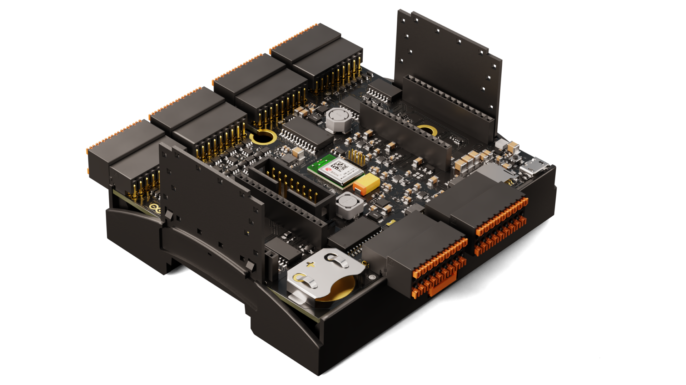

## Introduction 

The enclosure kit features a LCD screen on top and a perfectly fitted case for the Portenta Machine Control.

### Required Hardware and Software

- [Arduino® Portenta Machine Control](https://store.arduino.cc/products/arduino-portenta-machine-control)
- [Arduino® Enclosure Kit]()

## Assemble the kit

<video width="100%" controls="true">
<source src="assets/edge-control-kit-assembly-animation.mp4" type="video/mp4"/>
</video>

Once you got all the parts and a Portenta Machine Control, we can start with placing the Portenta Machine Control into the bottom part of the enclosure kit.

Next place the LCD screen cover over the screen.

Now place the LCD screen into the top part of the enclosure kit.

To connect the screen to the carrier, plug one end of the cord into the under side of the LCD screen, the other end of the cord goes into the connector slot on the Carrier.

Finally you can put the upper part that holds the screen on the bottom part that holds the Carrier.

There you go, a perfectly fitted enclosure for your Portenta Machine Control with an LCD screen!
