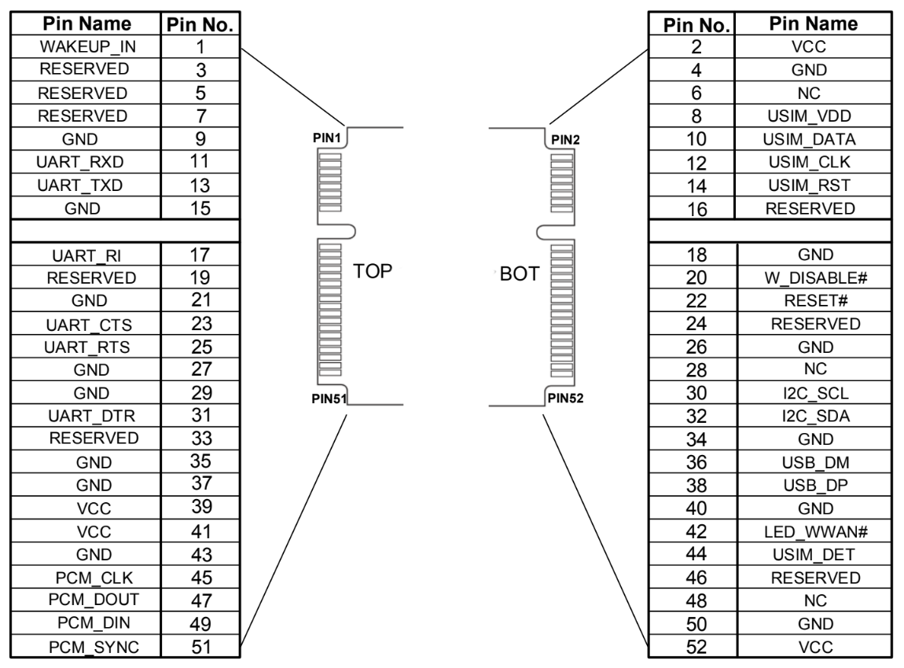
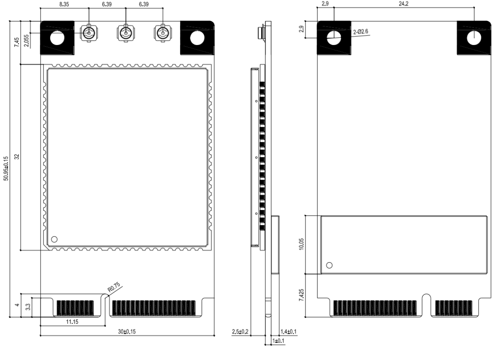
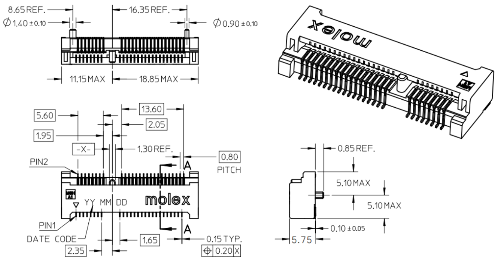
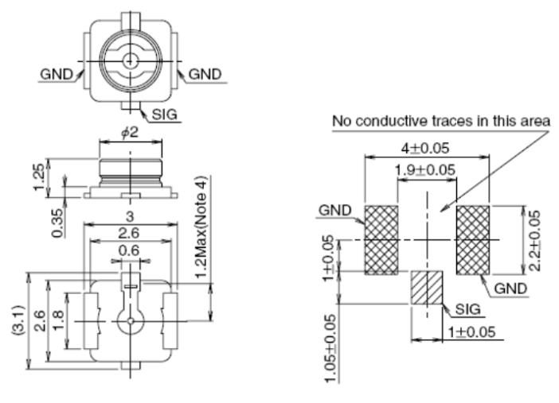
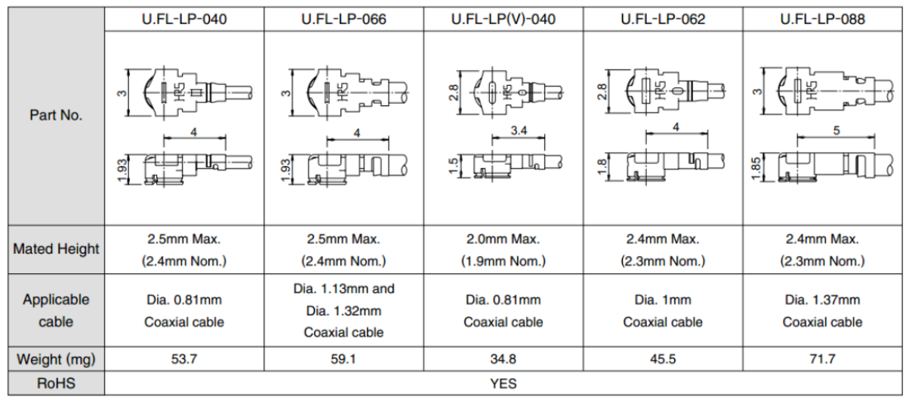
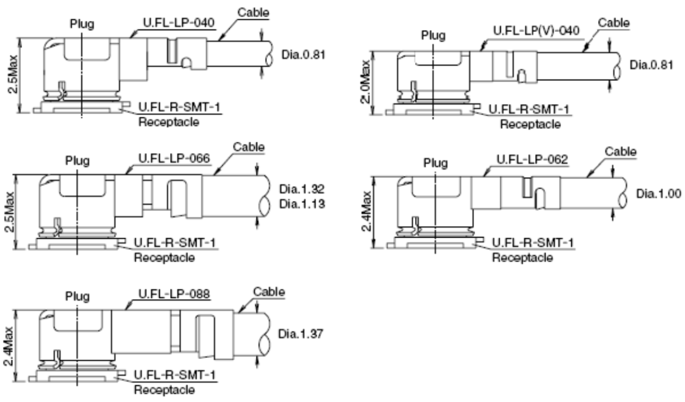

# Description 

Start benefit of the fast data throughput and high bandwidths of the Arduino Pro 4G Module. Developed in the widely adopted Mini PCIe form factor, the Pro 4G Module leverages a powerful LTE Cat 4 modem from Quectel® to guarantee reliable 4G connectivity and backward compatibility with existing 2G and 3G networks. Available in two variants, EMEA (Europe, Middle East, and Africa) and Global (including the United States), the Pro 4G Module module can be combined with multiple Portenta family boards to develop endless applications in several scenarios, such as smart cities, smart buildings, vending machines, remote maintenance, and fleet management applications.

# Target Areas

Remote maintenance, fleet management, pipeline monitoring, smart cities, smart buildings, smart parking, and waste management

# CONTENTS

## Application Examples

The Arduino Pro 4G Module, with its advanced LTE capabilities and GNSS functionality (Global variant only), opens the door to various innovative applications across different sectors. Beyond its core feature of providing robust cellular connectivity, this module facilitates deploying solutions in urban and industrial environments where reliability and precision are paramount. Whether for real-time monitoring, asset tracking, or enhancing operational efficiencies, the Pro 4G Module is a versatile foundation for IoT development. Here are some practical examples showcasing the module's potential to transform various applications:

- **Remote maintenance**: Connect to all your Portenta-based machines remotely and guarantee on-time support with the Pro 4G Module, regardless of location. Perform error analysis directly from your office, leveraging a reliable 4G connection and updating the firmware of your products thanks to the Arduino Cloud compatibility.
- **Fleet management**: Start tracking all your vehicle's location, movement history, and geofencing by integrating the Pro 4G GNSS Module. Calculate run hours and traveled distance to understand and optimize heavy equipment and vehicle utilization.
- **Pipeline monitoring**: Detect leaks, ensure accurate gas flow measurement, and predict the behavior of your pipeline without the need for other network infrastructure by simply combining a Portenta family board with the Pro 4G GNSS Module.

**Smart cities:** The Pro 4G Module can be used in different smart cities applications such as:

- **Smart lighting**: Integrate the Pro 4G Module into the urban light system to properly balance lighting and optimize energy consumption.
- **Smart city security**: By adding the Pro 4G Module to CCTV infrastructures, cities become more secure. Leverage machine vision and 4G to detect thieves, vandalism, or street accidents even in areas out of Wi-Fi® range and notify the police in time.
- **Smart parking**: Combine a Portenta family board with a Pro 4G GNSS Module to map parking lot occupancy. In this way drivers may check in advance for free slots, reducing overall traffic jams and improving environmental conditions.
- **Waste management**: Deploy a Portenta family board with the Pro 4G GNSS Module into waste bins to establish the level of filling and report anomalies so that recycling rate, collection timing, and waste volume are improved.

**Smart buildings**: The Pro 4G Module can be used in different smart building applications such as:

- **Smart vending machines**: Let your customers purchase what they need, when and where they need it, by integrating the Pro 4G GNSS Module into your vending machine or smart kiosk. Install your vending machine without location constraints and monitor its usage and performance remotely.
- **Building safety inspection**: Even in remote areas, combine a Portenta family board with the Pro 4G Module to allow building owners or inspectors to remotely control deformation, temperature, moisture level, and other buildings chemical, mechanical and physical parameters.
- **Smart building security**: Leverage the integrated 4G connectivity of the Pro 4G Module to build your own Wi-Fi® independent alarm infrastructures. Monitor gas leakages, fires and glass breaking from anywhere and receive on-time SMS notifications in case of unauthorized entrances.

## Features

### Module Description 

Adding 4G connectivity to the Portenta family opens up new possibilities for reliable data communication, especially in remote areas. This feature ensures devices can maintain strong indoor and outdoor signal coverage, making it versatile for a wide range of applications. Significantly, it simplifies global deployment across various countries without necessitating changes to the board itself, thereby reducing infrastructure costs compared to traditional connectivity solutions. The Mini PCIe form factor facilitates easy integration and broad compatibility while offering capabilities like SMS alerts for real-time notification in critical situations. This enhancement broadens the scope for innovative projects and streamlines the development and deployment process.

The supported frequency bands, and digital audio functions of the EMEA variant (SKU: TPX00201) of the Pro 4G Module are shown in the table below.

|        **Feature**         | **Description**        |
| :------------------------: | ---------------------- |
|          Variant           | EMEA (SKU: TPX00201)   |
|           Modem            | Quectel® EC200A        |
|          LTE-FDD           | B1/B3/B5/B7/B8/B20/B28 |
|          LTE-TDD           | B38/B40/B41            |
|           WCDMA            | B1/B5/B8               |
|            GSM             | EGSM900/DCS1800        |
|    Digital Audio (PCM)     | Supported              |
| Type Allocation Code (TAC) | 86194007               |

The supported frequency bands, GNSS, and digital audio functions of the Global variant (SKU: TPX00200) of the Pro 4G Module are shown in the table below.

|        **Feature**         | **Description**                                      |
| :------------------------: | ---------------------------------------------------- |
|          Variant           | Global (SKU: TPX00200)                               |
|           Modem            | Quectel® EG25-G                                      |
|          LTE-FDD           | B1/B2/B3/B4/B5/B7/B8/B12/B13/B18/B19/B20/B25/B26/B28 |
|          LTE-TDD           | B38/B39/B40/B41                                      |
|           WCDMA            | B1/B2/B4/B5/B6/B8/B19                                |
|            GSM             | 850/900/1800/1900                                    |
|      GNSS (Optional)       | GPS, GLONASS, BeiDou (COMPASS), Galileo, QZSS        |
|    Digital Audio (PCM)     | Supported                                            |
| Type Allocation Code (TAC) | 86340907                                             |
|        FCC ID (USA)        | 2AN9S-TPX00200                                       |

<strong>Note:</strong> Both Pro 4G Module variants are compatible with the Arduino Portenta Mid Carrier and can work with any Portenta Family board. The Arduino Portenta Max Carrier is compatible with both Pro 4G Module variants but only with the Portenta X8 board.

### Key Features

The main features of the Pro 4G Module, both variants, are summarized and highlighted in the table below.

|         **Feature**        | **Details**                                                                                                                                                                                                                                                                                                                                                                                                                                                                                       |
|:--------------------------:|---------------------------------------------------------------------------------------------------------------------------------------------------------------------------------------------------------------------------------------------------------------------------------------------------------------------------------------------------------------------------------------------------------------------------------------------------------------------------------------------------|
|            Modem           | EMEA (SKU: TPX00201): Quectel® EC200A  Global (SKU: TPX00200): Quectel® EG25-G                                                                                                                                                                                                                                                                                                                                                                                                                  |
|     Function Interface     | PCI Express Mini Card 1.2 Standard Interface                                                                                                                                                                                                                                                                                                                                                                                                                                                      |
|        Power Supply        | - Supply voltage: 3.0–3.6 VDC  - Typical supply voltage: 3.3 VDC                                                                                                                                                                                                                                                                                                                                                                                                                                |
|     Transmitting Power     | - Class 4 (33 dBm ±2 dB) for GSM850  - Class 4 (33 dBm ±2 dB) for EGSM900  - Class 1 (30 dBm ±2 dB) for DCS1800  - Class 1 (30 dBm ±2 dB) for PCS1900  - Class E2 (27 dBm ±3 dB) for GSM850 8-PSK  - Class E2 (27 dBm ±3 dB) for EGSM900 8-PSK  - Class E2 (26 dBm ±3 dB) for DCS1800 8-PSK  - Class E2 (26 dBm ±3 dB) for PCS1900 8-PSK  - Class 3 (24 dBm +1/-3 dB) for WCDMA bands  - Class 3 (23 dBm ±2 dB) for LTE-FDD bands  - Class 3 (23 dBm ±2 dB) for LTE-TDD bands |
|        LTE Features        | - Supports up to non-CA Cat 4 FDD and TDD  - Supports 1.4/3/5/10/15/20 MHz RF bandwidth  - Supports MIMO in DL direction  - Max. transmission data rates:    LTE-FDD: 150 Mbps (DL), 50 Mbps (UL)    LTE-TDD: 130 Mbps (DL), 30 Mbps (UL)                                                                                                                                                                                                                                               |
|        UMTS Features       | - Supports 3GPP Rel-8 DC-HSDPA, HSPA+, HSDPA, HSUPA, and WCDMA  - Supports QPSK,16QAM and 64QAM modulation  - Max. transmission data rates:    DC-HSDPA: 42 Mbps (DL)    HSUPA: 5.76 Mbps (UL)    WCDMA: 384 kbps (DL), 384 kbps (UL)                                                                                                                                                                                                                                                   |
|        GSM Features        | - GPRS: Supports GPRS multi-slot class 33 (33 by default), Coding scheme: CS-1, CS-2, CS-3 and CS-4, Max. 107 kbps (DL), Max. 85.6 kbps (UL)  - EDGE: Supports EDGE multi-slot class 33 (33 by default), Supports GMSK and 8-PSK for different MCS (Modulation and Coding Scheme), Downlink coding schemes: MCS 1-9, Uplink coding schemes: MCS 1-9, Max. 296 kbps (DL), Max. 236.8 kbps (UL)                                                                                                   |
| Internet Protocol Features | Supports TCP/UDP/PPP/FTP/FTPS/HTTP/HTTPS/NTP/PING/QMI/NITZ/SMTP/SSL/MQTT/CMUX/SMTPS/FILE/MMS protocols, Supports PAP and CHAP for PPP connections                                                                                                                                                                                                                                                                                                                                                 |
|             SMS            | - Text and PDU modes  - Point-to-point MO and MT  - SMS cell broadcast  - SMS storage: ME by default                                                                                                                                                                                                                                                                                                                                                                                        |
|      (U)SIM Interface      | Supports USIM/SIM card: 1.8 V, 3.0 V                                                                                                                                                                                                                                                                                                                                                                                                                                                              |
|       UART Interface       | - Main UART: Supports RTS and CTS hardware flow control  - Baud rate can reach up to 230400 bps, 115200 bps by default  - Used for AT command communication and data transmission                                                                                                                                                                                                                                                                                                             |
|       Audio Features       | - Supports one digital audio interface: PCM interface  - GSM: HR/FR/EFR/AMR/AMR-WB  - WCDMA: AMR/AMR-WB  - LTE: AMR/AMR-WB  - Supports echo cancellation and noise suppression                                                                                                                                                                                                                                                                                                            |
|        PCM Interface       | - Supports 16-bit linear data format  - Supports long frame synchronization and short frame synchronization  - Supports master and slave modes, but must be the master for long frame synchronization                                                                                                                                                                                                                                                                                         |
|        USB Interface       | - Compliant with USB 2.0 specification (slave only); the data transfer rate can reach up to 480 Mbps  - Used for AT command communication, data transmission, firmware upgrade, software debugging and GNSS NMEA output  - Supports USB serial drivers for: Windows 7/8/8.1/10, Linux 2.6–5.12, Android 4.x–11.x, etc.                                                                                                                                                                        |
|     Antenna Connectors     | Includes main antenna, diversity antenna, and GNSS antenna receptacle connectors                                                                                                                                                                                                                                                                                                                                                                                                                  |
|   Rx-diversity (Optional)  | Supports LTE/WCDMA Rx-diversity                                                                                                                                                                                                                                                                                                                                                                                                                                                                   |
| GNSS (Global variant only) | GPS, GLONASS, BeiDou (COMPASS), Galileo, QZSS                                                                                                                                                                                                                                                                                                                                                                                                                                                     |

## Functional Overview

### Pinout

The following figure shows the top and bottom pinout of the Arduino Pro 4G Module for both variants.

### Full Pinout

The following tables show the full pinout of the Pro 4G Module, beginning with the definition and description of the 52 pins.

#### I/O Parameters Definition

| **Pin Type** |    **Description**   |
|:------------:|:--------------------:|
|      AIO     |  Analog Input/Output |
|      DI      |     Digital Input    |
|      DO      |    Digital Output    |
|      DIO     | Digital Input/Output |
|      OC      |    Open Collector    |
|      OD      |      Open Drain      |
|      PI      |      Power Input     |
|      PO      |     Power Output     |

#### Pin Description

| **Pin Number** | **Mini PCI Express Standard Pin Name** | **Pro 4G Module Mini PCIe Pin Name** | **Pin Type** |                      **Description**                       |                          **Details**                           |
| :------------: | :------------------------------------: | :----------------------------------: | :----------: | :--------------------------------------------------------: | :------------------------------------------------------------: |
|       1        |                 WAKE#                  |                WAKE#                 |      OC      |                      Wake up the host                      |                                                                |
|       2        |                3.3Vaux                 |               VCC_3V3                |      PI      |              3.0–3.6 V, typ. 3.3 V DC supply               | It is prohibited to be pulled up to high level before startup. |
|       3        |                 COEX1                  |               RESERVED               |              |                          Reserved                          |                                                                |
|       4        |                  GND                   |                 GND                  |              |                      Mini card ground                      |                                                                |
|       5        |                 COEX2                  |               RESERVED               |              |                          Reserved                          | It is prohibited to be pulled up to high level before startup. |
|       6        |                  1.5V                  |                  NC                  |              |                       Not connected                        |                                                                |
|       7        |                CLKREQ#                 |               RESERVED               |              |                          Reserved                          |                                                                |
|       8        |                UIM_PWR                 |               USIM_VDD               |      PO      |                  (U)SIM card power supply                  |                                                                |
|       9        |                  GND                   |                 GND                  |              |                      Mini card ground                      |                                                                |
|       10       |                UIM_DATA                |              USIM_DATA               |     DIO      |                      (U)SIM card data                      |                                                                |
|       11       |                REFCLK-                 |               UART_RX                |      DI      |                        UART receive                        |                      Connect to DTE's Tx.                      |
|       12       |                UIM_CLK                 |               USIM_CLK               |      DO      |                     (U)SIM card clock                      |                                                                |
|       13       |                REFCLK+                 |               UART_TX                |      DO      |                       UART transmit                        |                      Connect to DTE's Rx.                      |
|       14       |               UIM_RESET                |               USIM_RST               |      DO      |                     (U)SIM card reset                      |                                                                |
|       15       |                  GND                   |                 GND                  |              |                      Mini card ground                      |                                                                |
|       16       |                UIM_VPP                 |               RESERVED               |              |                          Reserved                          |                                                                |
|       17       |                RESERVED                |                  RI                  |      DO      |                      Ring indication                       |                                                                |
|       18       |                  GND                   |                 GND                  |              |                      Mini card ground                      |                                                                |
|       19       |                RESERVED                |               RESERVED               |              |                          Reserved                          |                                                                |
|       20       |               W_DISABLE#               |              W_DISABLE#              |      DI      |                   Airplane mode control                    |               Pulled up by default. Active LOW.                |
|       21       |                  GND                   |                 GND                  |              |                      Mini card ground                      |                                                                |
|       22       |                 PERST#                 |                PERST#                |      DI      |                     Fundamental reset                      |               Pulled up by default. Active LOW.                |
|       23       |                 PERnO                  |               UART_CTS               |      DI      |             DCE clear to send signal from DTE              |                     Connects to DTE's RTS.                     |
|       24       |                3.3Vaux                 |               RESERVED               |              |                          Reserved                          |                                                                |
|       25       |                 PERpO                  |               UART_RTS               |      DO      |            DCE request to send signal from DTE             |                     Connects to DTE's CTS.                     |
|       26       |                  GND                   |                 GND                  |              |                      Mini card ground                      |                                                                |
|       27       |                  GND                   |                 GND                  |              |                      Mini card ground                      |                                                                |
|       28       |                  1.5V                  |                  NC                  |              |                       Not connected                        |                                                                |
|       29       |                  GND                   |                 GND                  |              |                      Mini card ground                      |                                                                |
|       30       |                SMB_CLK                 |               I2C_SCL                |      DO      |           I2C serial clock (for external Codec)            |              Requires external pull-up to 1.8 V.               |
|       31       |                 PETnO                  |                 DTR                  |      DI      |                     Sleep mode control                     |                                                                |
|       32       |                SMB_DATA                |               I2C_SDA                |     DIO      |            I2C serial data (for external Codec)            |              Requires external pull-up to 1.8 V.               |
|       33       |                 PETpO                  |               RESERVED               |              |                          Reserved                          |                                                                |
|       34       |                  GND                   |                 GND                  |              |                      Mini card ground                      |                                                                |
|       35       |                  GND                   |                 GND                  |              |                      Mini card ground                      |                                                                |
|       36       |                 USB_D-                 |                USB_DM                |     AIO      |                 USB differential data (-)                  |            Requires differential impedance of 90 Ω.            |
|       37       |                  GND                   |                 GND                  |              |                      Mini card ground                      |                                                                |
|       38       |                 USB_D+                 |                USB_DP                |     AIO      |                 USB differential data (+)                  |            Requires differential impedance of 90 Ω.            |
|       39       |                3.3Vaux                 |               VCC_3V3                |      PI      |              3.0–3.6 V, typ. 3.3 V DC supply               |                                                                |
|       40       |                  GND                   |                 GND                  |              |                      Mini card ground                      |                                                                |
|       41       |                3.3Vaux                 |               VCC_3V3                |      PI      |              3.0–3.6 V, typ. 3.3 V DC supply               |                                                                |
|       42       |               LED_WWAN#                |              LED_WWAN#               |      OC      | LED signal for indicating the network status of the module |                          Active LOW.                           |
|       43       |                  GND                   |                 GND                  |              |                      Mini card ground                      |                                                                |
|       44       |               LED_WLAN#                |            USIM_PRESENCE             |      DI      |                (U)SIM card hot-plug detect                 |                                                                |
|       45       |                RESERVED                |               PCM_CLK                |     DIO      |                         PCM clock                          |                                                                |
|       46       |               LED_WPAN#                |               RESERVED               |              |                          Reserved                          |                                                                |
|       47       |                RESERVED                |               PCM_DOUT               |      DO      |                      PCM data output                       |                                                                |
|       48       |                  1.5V                  |                  NC                  |              |                       Not connected                        |                                                                |
|       49       |                RESERVED                |               PCM_DIN                |      DI      |                       PCM data input                       |                                                                |
|       50       |                  GND                   |                 GND                  |              |                      Mini card ground                      |                                                                |
|       51       |                RESERVED                |               PCM_SYNC               |     DIO      |                       PCM frame sync                       |                                                                |
|       52       |                3.3Vaux                 |               VCC_3V3                |      PI      |              3.0–3.6 V, typ. 3.3 V DC supply               |                                                                |

### GNSS (Only for Global Variant)

The Arduino Pro 4G Module Global variant (SKU: TPX00200) includes a fully integrated global navigation satellite system solution that supports GPS, GLONASS, BeiDou (COMPASS), Galileo and QZSS. Additionally, it supports standard NMEA 0183 protocol, and outputs NMEA sentences at 1 Hz data update rate via USB interface by default. By default, the GNSS engine of the module is switched off and can only be switched on via the dedicated Arduino library.

#### GNSS Performance and Frequency

The following table shows the GNSS performance of the Pro 4G Module Global variant (SKU: TPX00200).

|    **Parameter**   |    **Description**    |     **Conditions**    | **Typical** | **Unit** |
|:------------------:|:---------------------:|:---------------------:|:-----------:|:--------:|
| Sensitivity (GNSS) |       Cold start      |       Autonomous      |     -146    |    dBm   |
|                    |     Reacquisition     |       Autonomous      |     -156    |    dBm   |
|                    |        Tracking       |       Autonomous      |     -157    |    dBm   |
|     TTFF(GNSS)     | Cold start @ open sky |       Autonomous      |      35     |     s    |
|                    |                       |      XTRA enabled     |      15     |     s    |
|                    | Warm start @ open sky |       Autonomous      |      28     |     s    |
|                    |                       |      XTRA enabled     |      3      |     s    |
|                    |  Hot start @ open sky |       Autonomous      |      2      |     s    |
|                    |                       |      XTRA enabled     |     1.6     |     s    |
|   Accuracy (GNSS)  |         CEP-50        | Autonomous @ open sky |    < 2.5    |     m    |

The following table shows the GNSS frequency of the Pro 4G Module Global variant. 

|     **Type**     |  **Frequency**  | **Unit** |
|:----------------:|:---------------:|:--------:|
|        GPS       |  1575.42 ±1.023 |    MHz   |
|      GLONASS     |  1597.5–1605.8  |    MHz   |
|      Galileo     |  1575.42 ±2.046 |    MHz   |
| BeiDou (COMPASS) | 1561.098 ±2.046 |    MHz   |
|       QZSS       |     1575.42     |    MHz   |

## Ratings

### Power Supply Requirements

Below is a table summarizing the power supply requirements and digital I/O characteristics for the Arduino Pro 4G Module, both variants, outlining the key electrical parameters critical for integrating and operating the module effectively.

|          **Parameter**          |       **Description**       |  **Min**  |  **Typ**  |  **Max**  | **Unit** |
|:-------------------------------:|:---------------------------:|:---------:|:---------:|:---------:|:--------:|
|         **Power Supply**        |                             |           |           |           |          |
|               VCC               | Power supply for the module |    3.0    |    3.3    |    3.6    |     V    |
| **Digital I/O Characteristics** |                             |           |           |           |          |
|               VIH               |      Input High Voltage     | 0.7 × VCC |           | VCC + 0.3 |     V    |
|               VIL               |      Input Low Voltage      |    -0.3   |           | 0.3 × VCC |     V    |
|               VOH               |     Output High Voltage     |           | VCC - 0.5 |    VCC    |     V    |
|               VOL               |      Output Low Voltage     |     0     |           |    0.4    |     V    |

### TX Power

The following table show the conducted Tx power of the Pro 4G Module EMEA variant (SKU: TPX00201).

|            **Frequency Bands**           | **Maximum Tx power** | **Minimum Tx Power** |
|:----------------------------------------:|:--------------------:|:--------------------:|
|                  GSM850                  |     33 dBm ±2 dB     |      5 dBm ±5 dB     |
|                  EGSM900                 |     33 dBm ±2 dB     |      5 dBm ±5 dB     |
|                  DCS1800                 |     30 dBm ±2 dB     |      0 dBm ±5 dB     |
|                  PCS1900                 |     30 dBm ±2 dB     |      0 dBm ±5 dB     |
|              GSM850 (8-PSK)              |     27 dBm ±3 dB     |      5 dBm ±5 dB     |
|              EGSM900 (8-PSK)             |     27 dBm ±3 dB     |      5 dBm ±5 dB     |
|              DCS1800 (8-PSK)             |     26 dBm ±3 dB     |      0 dBm ±5 dB     |
|              PCS1900 (8-PSK)             |     26 dBm ±3 dB     |      0 dBm ±5 dB     |
|           WCDMA B1/B2/B4/B5/B8           |    24 dBm +1/-3 dB   |       < -49 dBm      |
| LTE-FDD B1/B2/B3/B4/B5/B7/B8/B20/B28/B66 |     23 dBm ±2 dB     |       < -39 dBm      |
|        LTE-TDD B34/B38/B39/B40/B41       |     23 dBm ±2 dB     |       < -39 dBm      |

The following table show the Rx sensitivity of the Pro 4G Module EMEA variant (SKU: TPX00201).

|  **Frequency Bands** | **Primary** | **Diversity** | **SIMO 4** | **3GPP (SIMO)** |
|:--------------------:|:-----------:|:-------------:|:----------:|:---------------:|
|        EGSM900       | -108.7 dBm  |       -       |      -     |    -102.0 dBm   |
|        DCS1800       | -107 dBm    |       -       |      -     |    -102.0 dBm   |
|       WCDMA B1       | -109.7 dBm  |       -       |      -     |    -106.7 dBm   |
|       WCDMA B5       | -110.6 dBm  |       -       |      -     |    -104.7 dBm   |
|       WCDMA B8       | -110.3 dBm  |       -       |      -     |    -103.7 dBm   |
|  LTE-FDD B1 (10 MHz) | -96.9 dBm   |    -97 dBm    | -100.8 dBm |    -96.3 dBm    |
|  LTE-FDD B3 (10 MHz) | -95.9 dBm   |   -96.8 dBm   | -100.4 dBm |    -93.3 dBm    |
|  LTE-FDD B5 (10 MHz) | -98.3 dBm   |    -99 dBm    | -102.2 dBm |    -94.3 dBm    |
|  LTE-FDD B7 (10 MHz) | -94.4 dBm   |   -95.8 dBm   |   -98 dBm  |    -94.3 dBm    |
|  LTE-FDD B8 (10 MHz) | -96.7 dBm   |   -98.9 dBm   | -100.1 dBm |    -93.3 dBm    |
| LTE-FDD B20 (10 MHz) | -98.1 dBm   |   -99.3 dBm   | -101.4 dBm |    -93.3 dBm    |
| LTE-FDD B28 (10 MHz) | -98.9 dBm   |   -99.5 dBm   | -102.6 dBm |    -94.8 dBm    |
| LTE-TDD B38 (10 MHz) | -96.5 dBm   |   -95.2 dBm   |  -99.3 dBm |    -96.3 dBm    |
| LTE-TDD B40 (10 MHz) | -97.3 dBm   |   -97.3 dBm   | -100.5 dBm |    -96.3 dBm    |
| LTE-TDD B41 (10 MHz) | -94.9 dBm   |   -95.1 dBm   |  -97.8 dBm |    -94.3 dBm    |

The following table show the conducted Tx power of the Pro 4G Module Global variant (SKU: TPX00200).

|   **Frequency Bands**   | **Maximum RF Output Power** | **Minimum RF Output Power** |
|:-----------------------:|:---------------------------:|:---------------------------:|
|      GSM850/EGSM900     |         33 dBm ±2 dB        |         5 dBm ±5 dB         |
|     DCS1800/PCS1900     |         30 dBm ±2 dB        |         0 dBm ±5 dB         |
|  GSM850/EGSM900 (8-PSK) |         27 dBm ±3 dB        |         5 dBm ±5 dB         |
| DCS1800/PCS1900 (8-PSK) |         26 dBm ±3 dB        |         0 dBm ±5 dB         |
|       WCDMA bands       |       24 dBm +1/-3 dB       |          < -49 dBm          |
|      LTE-FDD bands      |         23 dBm ±2 dB        |          < -39 dBm          |
|      LTE-TDD bands      |         23 dBm ±2 dB        |          < -39 dBm          |

The following table show the Rx sensitivity of the Pro 4G Module EMEA variant (SKU: TPX00201).

|  **Frequency Bands** | **Primary** | **Diversity** | **SIMO 3** | **3GPP (SIMO)** |
|:--------------------:|:-----------:|:-------------:|:----------:|:---------------:|
|        GSM850        |   -108 dBm  |       -       |      -     |     -102 dBm    |
|        EGSM900       |   -108 dBm  |       -       |      -     |     -102 dBm    |
|        DCS1800       |  -107.5 dBm |       -       |      -     |     -102 dBm    |
|        PCS1900       |  -107.5 dBm |       -       |      -     |     -102 dBm    |
|       WCDMA B1       |  -108.2 dBm |   -108.5 dBm  | -109.2 dBm |    -106.7 dBm   |
|       WCDMA B2       |  -109.5 dBm |    -109 dBm   |  -110 dBm  |    -104.7 dBm   |
|       WCDMA B4       |  -109.5 dBm |       -       |      -     |    -103.7 dBm   |
|       WCDMA B5       |   -109 dBm  |   -109.5 dBm  |  -110 dBm  |    -104.7 dBm   |
|       WCDMA B6       |   -109 dBm  |   -109.5 dBm  | -110.5 dBm |    -106.7 dBm   |
|       WCDMA B8       |  -109.2 dBm |       -       |      -     |    -103.7 dBm   |
|       WCDMA B19      |   -109 dBm  |   -109.5 dBm  | -110.5 dBm |    -106.7 dBm   |
|  LTE-FDD B1 (10 MHz) |  -97.3 dBm  |   -98.3 dBm   |  -99.5 dBm |    -96.3 dBm    |
|  LTE-FDD B2 (10 MHz) |   -98 dBm   |    -99 dBm    |  -99.9 dBm |    -94.3 dBm    |
|  LTE-FDD B3 (10 MHz) |  -97.4 dBm  |   -98.1 dBm   |  -99.8 dBm |    -93.3 dBm    |
|  LTE-FDD B4 (10 MHz) |  -97.7 dBm  |   -98.2 dBm   |  -99.7 dBm |    -96.3 dBm    |
|  LTE-TDD B5 (10 MHz) |   -98 dBm   |   -98.5 dBm   |  -99.9 dBm |    -94.3 dBm    |
|  LTE-TDD B7 (10 MHz) |  -97.3 dBm  |   -97.3 dBm   |  -99.1 dBm |    -94.3 dBm    |
|  LTE-TDD B8 (10 MHz) |   -98 dBm   |   -98.1 dBm   |  -99.8 dBm |    -93.3 dBm    |
| LTE-TDD B12 (10 MHz) |   -98 dBm   |   -98.1 dBm   |  -99.9 dBm |    -93.3 dBm    |
| LTE-TDD B13 (10 MHz) |   -98 dBm   |   -98.1 dBm   | -100.1 dBm |    -93.3 dBm    |
| LTE-TDD B18 (10 MHz) |   -98 dBm   |   -99.5 dBm   |  -100 dBm  |    -96.3 dBm    |
| LTE-TDD B19 (10 MHz) |   -98 dBm   |    -99 dBm    |  -99.8 dBm |    -96.3 dBm    |
| LTE-TDD B20 (10 MHz) |   -98 dBm   |   -98.8 dBm   |  -99.7 dBm |    -93.3 dBm    |
| LTE-TDD B25 (10 MHz) |   -98 dBm   |    -98 dBm    | -100.2 dBm |    -92.8 dBm    |
| LTE-TDD B26 (10 MHz) |   -98 dBm   |   -98.8 dBm   |  -100 dBm  |    -93.8 dBm    |
| LTE-TDD B28 (10 MHz) |  -98.1 dBm  |   -98.9 dBm   |  -99.8 dBm |    -94.8 dBm    |
| LTE-TDD B38 (10 MHz) |  -96.8 dBm  |   -96.9 dBm   |  -98.3 dBm |    -96.3 dBm    |
| LTE-TDD B39 (10 MHz) |   -98 dBm   |   -98.2 dBm   |  -99.8 dBm |    -96.3 dBm    |
| LTE-TDD B40 (10 MHz) |  -97.7 dBm  |   -97.5 dBm   |  -99.7 dBm |    -96.3 dBm    |
| LTE-TDD B41 (10 MHz) |  -96.8 dBm  |   -96.0 dBm   |   -98 dBm  |    -94.3 dBm    |

### ESD Characteristics

If the static electricity generated by various ways discharges to the module, the module maybe damaged to a certain extent. Thus, please take proper ESD countermeasures and handling methods.

The following table shows the ESD characteristics of the Pro 4G Module, both variants.

| **Tested Interfaces** | **Contact Discharge** | **Air Discharge** | **Unit** |
|:---------------------:|:---------------------:|:-----------------:|:--------:|
|  Power Supply and GND |           ±5          |        ±10        |    kV    |
|   Antenna Interfaces  |           ±4          |         ±8        |    kV    |
|     USB Interface     |           ±4          |         ±8        |    kV    |
|    (U)SIM Interface   |           ±4          |         ±8        |    kV    |
|         Others        |          ±0.5         |         ±1        |    kV    |

### Power Consumption

The following table show the power consumption of the Pro 4G Module EMEA variant (SKU: TPX00201).

|            **Conditions**             | **Typ** | **Unit** |
| :-----------------------------------: | :-----: | :------: |
|            **Sleep Mode**             |         |          |
|     AT+CFUN=0 (USB disconnected)      |  3.25   |    mA    |
| EGSM900 @ DRX = 2 (USB disconnected)  |  5.59   |    mA    |
| EGSM900 @ DRX = 5 (USB disconnected)  |  4.26   |    mA    |
|    EGSM900 @ DRX = 5 (USB suspend)    |  4.58   |    mA    |
| EGSM900 @ DRX = 9 (USB disconnected)  |  3.99   |    mA    |
| DCS1800 @ DRX = 2 (USB disconnected)  |  5.71   |    mA    |
| DCS1800 @ DRX = 5 (USB disconnected)  |  4.24   |    mA    |
|    DCS1800 @ DRX = 5 (USB suspend)    |  4.64   |    mA    |
| DCS1800 @ DRX = 9 (USB disconnected)  |  3.73   |    mA    |
|  WCDMA @ PF = 64 (USB disconnected)   |  5.94   |    mA    |
|     WCDMA @ PF = 64 (USB suspend)     |  6.15   |    mA    |
|  WCDMA @ PF = 128 (USB disconnected)  |  4.45   |    mA    |
|  WCDMA @ PF = 256 (USB disconnected)  |  3.72   |    mA    |
|  WCDMA @ PF = 512 (USB disconnected)  |  3.45   |    mA    |
| LTE-FDD @ PF = 32 (USB disconnected)  |  7.29   |    mA    |
| LTE-FDD @ PF = 64 (USB disconnected)  |  5.94   |    mA    |
|    LTE-FDD @ PF = 64 (USB suspend)    |  6.12   |    mA    |
| LTE-FDD @ PF = 128 (USB disconnected) |  4.71   |    mA    |
| LTE-FDD @ PF = 256 (USB disconnected) |  4.24   |    mA    |
|             **Idle Mode**             |         |          |
|  EGSM900 DRX = 5 (USB disconnected)   |  48.69  |    mA    |
|    EGSM900 DRX = 5 (USB connected)    |  73.96  |    mA    |
|  WCDMA @ PF = 64 (USB disconnected)   |  54.88  |    mA    |
|    WCDMA @ PF = 64 (USB connected)    |  74.74  |    mA    |
| LTE-FDD @ PF = 64 (USB disconnected)  |  52.94  |    mA    |
|   LTE-FDD @ PF = 64 (USB connected)   |  73.83  |    mA    |
| LTE-TDD @ PF = 64 (USB disconnected)  |  51.45  |    mA    |
|   LTE-TDD @ PF = 64 (USB connected)   |  74.27  |    mA    |
|        **GPRS Data Transfer**         |         |          |
|      EGSM900 4DL/1UL @ 33.01 dBm      |   199   |    mA    |
|      EGSM900 3DL/2UL @ 32.93 dBm      |   372   |    mA    |
|      EGSM900 2DL/3UL @ 30.91 dBm      |   478   |    mA    |
|      EGSM900 1DL/4UL @ 28.95 dBm      |   533   |    mA    |
|      DCS1800 4DL/1UL @ 29.74 dBm      |   136   |    mA    |
|      DCS1800 3DL/2UL @ 29.82 dBm      |   244   |    mA    |
|      DCS1800 2DL/3UL @ 28.35 dBm      |   293   |    mA    |
|      DCS1800 1DL/4UL @ 26.35 dBm      |   309   |    mA    |
|        **EDGE Data Transfer**         |         |          |
|      EGSM900 4DL/1UL @ 26.09 dBm      |   137   |    mA    |
|      EGSM900 3DL/2UL @ 25.45 dBm      |   246   |    mA    |
|      EGSM900 2DL/3UL @ 23.43 dBm      |   315   |    mA    |
|      EGSM900 1DL/4UL @ 20.82 dBm      |   375   |    mA    |
|      DCS1800 4DL/1UL @ 26.53 dBm      |   121   |    mA    |
|      DCS1800 3DL/2UL @ 26.27 dBm      |   215   |    mA    |
|      DCS1800 2DL/3UL @ 24.69 dBm      |   289   |    mA    |
|      DCS1800 1DL/4UL @ 22.00 dBm      |   360   |    mA    |
|        **WCDMA Data Transfer**        |         |          |
|      WCDMA B1 HSDPA @ 23.63 dBm       |   520   |    mA    |
|      WCDMA B1 HSUPA @ 22.45 dBm       |   474   |    mA    |
|      WCDMA B5 HSDPA @ 23.08 dBm       |   496   |    mA    |
|      WCDMA B5 HSUPA @ 21.56 dBm       |   504   |    mA    |
|      WCDMA B8 HSDPA @ 22.47 dBm       |   454   |    mA    |
|      WCDMA B8 HSUPA @ 21.17 dBm       |   497   |    mA    |
|         **LTE Data Transfer**         |         |          |
|        LTE-FDD B1 @ 23.08 dBm         |   607   |    mA    |
|        LTE-FDD B3 @ 23.69 dBm         |   636   |    mA    |
|        LTE-FDD B5 @ 23.70 dBm         |   568   |    mA    |
|        LTE-FDD B7 @ 23.98 dBm         |   813   |    mA    |
|        LTE-FDD B8 @ 23.16 dBm         |   591   |    mA    |
|        LTE-FDD B20 @ 23.18 dBm        |   592   |    mA    |
|        LTE-FDD B28 @ 23.21 dBm        |   559   |    mA    |
|        LTE-TDD B38 @ 23.13 dBm        |   230   |    mA    |
|        LTE-TDD B40 @ 22.72 dBm        |   233   |    mA    |
|        LTE-TDD B41 @ 23.29 dBm        |   242   |    mA    |
|          **GSM Voice call**           |         |          |
|      EGSM900 PCL = 5 @ 32.34 dBm      |   206   |    mA    |
|     EGSM900 PCL = 12 @ 19.11 dBm      |   76    |    mA    |
|      EGSM900 PCL = 19 @ 6.05 dBm      |   48    |    mA    |
|      DCS1800 PCL = 0 @ 29.50 dBm      |   136   |    mA    |
|      DCS1800 PCL = 7 @ 16.07 dBm      |   61    |    mA    |
|     DCS1800 PCL = 15 @ -1.14 dBm      |   48    |    mA    |
|         **WCDMA Voice call**          |         |          |
|         WCDMA B1 @ 22.29 dBm          |   543   |    mA    |
|         WCDMA B5 @ 22.26 dBm          |   496   |    mA    |
|         WCDMA B8 @ 22.25 dBm          |   533   |    mA    |

The following table show the power consumption of the Pro 4G Module Global variant (SKU: TPX00200).

|             **Conditions**            | **Typ** | **Unit** |
|:-------------------------------------:|:-------:|:--------:|
|             **Sleep Mode**            |         |          |
|      AT+CFUN=0 (USB Disconnected)     |   2.1   |    mA    |
|  EGSM900 @ DRX = 2 (USB Disconnected) |   4.2   |    mA    |
|  EGSM900 @ DRX = 5 (USB Disconnected) |   3.6   |    mA    |
|    EGSM900 @ DRX = 5 (USB Suspend)    |   3.9   |    mA    |
|  EGSM900 @ DRX = 9 (USB Disconnected) |   3.4   |    mA    |
|  DCS1800 @ DRX = 2 (USB Disconnected) |   3.6   |    mA    |
|  DCS1800 @ DRX = 5 (USB Disconnected) |   3.0   |    mA    |
|    DCS1800 @ DRX = 5 (USB Suspend)    |   3.2   |    mA    |
|  DCS1800 @ DRX = 9 (USB Disconnected) |   2.8   |    mA    |
|     WCDMA @ PF = 64 (USB Suspend)     |   3.9   |    mA    |
|  WCDMA @ PF = 128 (USB Disconnected)  |   3.2   |    mA    |
|  WCDMA @ PF = 256 (USB Disconnected)  |   2.9   |    mA    |
|  WCDMA @ PF = 512 (USB Disconnected)  |   2.7   |    mA    |
|  LTE-FDD @ PF = 32 (USB Disconnected) |   5.4   |    mA    |
|  LTE-FDD @ PF = 64 (USB Disconnected) |   3.9   |    mA    |
|    LTE-FDD @ PF = 64 (USB Suspend)    |   4.1   |    mA    |
| LTE-FDD @ PF = 128 (USB Disconnected) |   3.2   |    mA    |
| LTE-FDD @ PF = 256 (USB Disconnected) |   2.8   |    mA    |
|  LTE-TDD @ PF = 32 (USB Disconnected) |   5.4   |    mA    |
|  LTE-TDD @ PF = 64 (USB Disconnected) |   3.8   |    mA    |
|    LTE-TDD @ PF = 64 (USB Suspend)    |   4.1   |    mA    |
| LTE-TDD @ PF = 128 (USB Disconnected) |   3.2   |    mA    |
| LTE-TDD @ PF = 256 (USB Disconnected) |   2.8   |    mA    |
|   **GPRS Data Transfer (GNSS OFF)**   |         |          |
|       GSM850 1UL/4DL @ 32.1 dBm       |  376.8  |    mA    |
|       GSM850 2UL/3DL @ 30.0 dBm       |   547   |    mA    |
|       GSM850 3UL/2DL @ 28.9 dBm       |   701   |    mA    |
|       GSM850 4UL/1DL @ 27.6 dBm       |   794   |    mA    |
|       EGSM900 1UL/4DL @ 32.2 dBm      |  344.4  |    mA    |
|       EGSM900 2UL/3DL @ 31.2 dBm      |  560.4  |    mA    |
|       EGSM900 3UL/2DL @ 29.2 dBm      |  649.4  |    mA    |
|       EGSM900 4UL/1DL @ 27.9 dBm      |  741.2  |    mA    |
|       DCS1800 1UL/4DL @ 29.2 dBm      |  205.2  |    mA    |
|       DCS1800 2UL/3DL @ 28.5 dBm      |  333.7  |    mA    |
|       DCS1800 3UL/2DL @ 26.5 dBm      |  400.2  |    mA    |
|       DCS1800 4UL/1DL @ 25.7 dBm      |   480   |    mA    |
|       PCS1900 1UL/4DL @ 29.2 dBm      |  227.7  |    mA    |
|       PCS1900 2UL/3DL @ 28.1 dBm      |  363.8  |    mA    |
|       PCS1900 3UL/2DL @ 26.3 dBm      |   440   |    mA    |
|       PCS1900 4UL/1DL @ 24.9 dBm      |  507.2  |    mA    |
|   **EDGE Data Transfer (GNSS OFF)**   |         |          |
|       GSM850 1UL/4DL @ 26.3 dBm       |   212   |    mA    |
|       GSM850 2UL/3DL @ 25.1 dBm       |   337   |    mA    |
|       GSM850 3UL/2DL @ 23.3 dBm       |   415   |    mA    |
|       GSM850 4UL/1DL @ 22.2 dBm       |   487   |    mA    |
|       EGSM900 1UL/4DL @ 26.6 dBm      |   195   |    mA    |
|       EGSM900 2UL/3DL @ 25.3 dBm      |   312   |    mA    |
|       EGSM900 3UL/2DL @ 23.7 dBm      |  392.7  |    mA    |
|       EGSM900 4UL/1DL @ 22.5 dBm      |  463.5  |    mA    |
|       DCS1800 1UL/4DL @ 25.5 dBm      |  156.8  |    mA    |
|       DCS1800 2UL/3DL @ 25.0 dBm      |   260   |    mA    |
|       DCS1800 3UL/2DL @ 23.8 dBm      |   334   |    mA    |
|       DCS1800 4UL/1DL @ 22.6 dBm      |   405   |    mA    |
|       PCS1900 1UL/4DL @ 25.4 dBm      |   169   |    mA    |
|       PCS1900 2UL/3DL @ 24.6 dBm      |   272   |    mA    |
|       PCS1900 3UL/2DL @ 23.3 dBm      |   350   |    mA    |
|       PCS1900 4UL/1DL @ 22.0 dBm      |   418   |    mA    |
|   **WCDMA Data Transfer (GNSS OFF)**  |         |          |
|       WCDMA B1 HSDPA @ 22.5 dBm       |  735.9  |    mA    |
|       WCDMA B2 HSDPA @ 22.6 dBm       |  740.6  |    mA    |
|       WCDMA B4 HSDPA @ 22.6 dBm       |  776.8  |    mA    |
|       WCDMA B5 HSDPA @ 22.3 dBm       |  670.8  |    mA    |
|       WCDMA B6 HSDPA @ 22.4 dBm       |  675.3  |    mA    |
|       WCDMA B8 HSDPA @ 22.5 dBm       |  748.3  |    mA    |
|       WCDMA B19 HSDPA @ 22.4 dBm      |  676.8  |    mA    |
|       WCDMA B1 HSUPA @ 22.3 dBm       |  730.8  |    mA    |
|       WCDMA B2 HSUPA @ 22.3 dBm       |  730.5  |    mA    |
|       WCDMA B4 HSUPA @ 22.0 dBm       |  742.6  |    mA    |
|       WCDMA B5 HSUPA @ 22.3 dBm       |  713.9  |    mA    |
|       WCDMA B6 HSUPA @ 22.4 dBm       |  717.9  |    mA    |
|       WCDMA B8 HSUPA @ 22.0 dBm       |   712   |    mA    |
|       WCDMA B19 HSUPA @ 22.3 dBm      |  710.9  |    mA    |
|    **LTE Data Transfer (GNSS OFF)**   |         |          |
|         LTE-FDD B1 @ 22.8 dBm         |  966.8  |    mA    |
|         LTE-FDD B2 @ 22.7 dBm         |  1021.8 |    mA    |
|         LTE-FDD B3 @ 23.0 dBm         |  1017.7 |    mA    |
|         LTE-FDD B4 @ 23.4 dBm         |  1052.3 |    mA    |
|         LTE-FDD B5 @ 23.5 dBm         |  886.3  |    mA    |
|         LTE-FDD B7 @ 23.6 dBm         |   1114  |    mA    |
|         LTE-FDD B8 @ 23.6 dBm         |  988.7  |    mA    |
|         LTE-FDD B12 @ 23.1 dBm        |  811.4  |    mA    |
|         LTE-FDD B13 @ 23.7 dBm        |  910.7  |    mA    |
|         LTE-FDD B18 @ 23.5 dBm        |  1038.5 |    mA    |
|         LTE-FDD B19 @ 23.5 dBm        |  938.8  |    mA    |
|         LTE-FDD B20 @ 23.3 dBm        |   1014  |    mA    |
|         LTE-FDD B25 @ 22.7 dBm        |  1001.3 |    mA    |
|         LTE-FDD B26 @ 23.4 dBm        |  999.4  |    mA    |
|         LTE-FDD B28 @ 23.6 dBm        |  1004.7 |    mA    |
|         LTE-TDD B38 @ 23.3 dBm        |  573.8  |    mA    |
|         LTE-TDD B39 @ 23.2 dBm        |  482.8  |    mA    |
|         LTE-TDD B40 @ 22.7 dBm        |  508.2  |    mA    |
|         LTE-TDD B41 @ 23.3 dBm        |  561.9  |    mA    |
|           **GSM Voice Call**          |         |          |
|       GSM850 PCL = 5 @ 31.8 dBm       |  375.6  |    mA    |
|       EGSM900 PCL = 5 @ 32.2 dBm      |   366   |    mA    |
|       DCS1800 PCL = 0 @ 29.2 dBm      |   221   |    mA    |
|       PCS1900 PCL = 0 @ 29.0 dBm      |  236.6  |    mA    |
|          **WCDMA Voice Call**         |         |          |
|          WCDMA B1 @ 23.0 dBm          |  780.3  |    mA    |
|          WCDMA B2 @ 23.1 dBm          |  796.3  |    mA    |
|          WCDMA B4 @ 23.2 dBm          |  846.2  |    mA    |
|          WCDMA B5 @ 23.2 dBm          |   731   |    mA    |
|          WCDMA B6 @ 23.2 dBm          |  739.4  |    mA    |
|          WCDMA B8 @ 23.1 dBm          |  822.6  |    mA    |
|          WCDMA B19 @ 23.0 dBm         |  720.9  |    mA    |

The following table show the current consumption of the onboard GNSS of the Pro 4G Module EMEA variant (SKU: TPX00201) GNSS.

|      **Description**      |     **Conditions**     | **Typ** | **Unit** |
|:-------------------------:|:----------------------:|:-------:|:--------:|
| **Searching (AT+CFUN=0)** |                        |         |          |
|         Cold start        |    @ Passive antenna   |    67   |    mA    |
|         Lost state        |    @ Passive antenna   |    66   |    mA    |
|  **Tracking (AT+CFUN=0)** | Instrument environment |    46   |    mA    |

### Antenna Connection

The Arduino Pro 4G Module, both variants, is mounted with three antenna connectors for external antenna connection: a main antenna connector, an Rx-diversity antenna connector, and a GNSS antenna connector (present only in the Global variant of the module). And Rx-diversity function is enabled by default. The impedance of the antenna connectors is 50 Ω.

#### Operating Frequency

The following table shows the operating frequencies of the Pro 4G Module Global (TPX00200).

| **3GPP Band** | **Transmit** | **Receive** | **Unit** |
|:-------------:|:------------:|:-----------:|:--------:|
|     GSM850    |    824–849   |   869–894   |    MHz   |
|    EGSM900    |    880–915   |   925–960   |    MHz   |
|    DCS1800    |   1710–1785  |  1805–1880  |    MHz   |
|    PCS1900    |   1850–1910  |  1930–1990  |    MHz   |
|    WCDMA B1   |   1920–1980  |  2110–2170  |    MHz   |
|    WCDMA B2   |   1850–1910  |  1930–1990  |    MHz   |
|    WCDMA B4   |   1710–1755  |  2110–2155  |    MHz   |
|    WCDMA B5   |    824–849   |   869–894   |    MHz   |
|    WCDMA B6   |    830–840   |   875–885   |    MHz   |
|    WCDMA B8   |    880–915   |   925–960   |    MHz   |
|   WCDMA B19   |    830–845   |   875–890   |    MHz   |
|   LTE-FDD B1  |   1920–1980  |  2110–2170  |    MHz   |
|   LTE-FDD B2  |   1850–1910  |  1930–1990  |    MHz   |
|   LTE-FDD B3  |   1710–1785  |  1805–1880  |    MHz   |
|   LTE-FDD B4  |   1710–1755  |  2110–2155  |    MHz   |
|   LTE-FDD B5  |    824–849   |   869–894   |    MHz   |
|   LTE-FDD B7  |   2500–2570  |  2620–2690  |    MHz   |
|   LTE-FDD B8  |    880–915   |   925–960   |    MHz   |
|  LTE-FDD B12  |    699–716   |   729–746   |    MHz   |
|  LTE-FDD B13  |    777–787   |   746–756   |    MHz   |
|  LTE-FDD B18  |    815–830   |   860–875   |    MHz   |
|  LTE-FDD B19  |    830–845   |   875–890   |    MHz   |
|  LTE-FDD B20  |    832–862   |   791–821   |    MHz   |
|  LTE-FDD B25  |   1850–1915  |  1930–1995  |    MHz   |
|  LTE-FDD B26  |    814–849   |   859–894   |    MHz   |
|  LTE-FDD B28  |    703–748   |   758–803   |    MHz   |
|  LTE-TDD B38  |   2570–2620  |  2570–2620  |    MHz   |
|  LTE-TDD B39  |   1880–1920  |  1880–1920  |    MHz   |
|  LTE-TDD B40  |   2300–2400  |  2300–2400  |    MHz   |
|  LTE-TDD B41  |   2496–2690  |  2496–2690  |    MHz   |

The following table shows the operating frequencies of the Pro 4G Module EMEA (TPX00201).

| **3GPP Band** | **Transmit** | **Receive** | **Unit** |
| :-----------: | :----------: | :---------: | :------: |
|    EGSM900    |   880–915    |   925–960   |   MHz    |
|    DCS1800    |  1710–1785   |  1805–1880  |   MHz    |
|   WCDMA B1    |  1922–1978   |  2112–2168  |   MHz    |
|   WCDMA B5    |   826–847    |   871–892   |   MHz    |
|   WCDMA B8    |   882–913    |   927–958   |   MHz    |
|  LTE-FDD B1   |  1920–1980   |  2110–2170  |   MHz    |
|  LTE-FDD B3   |  1710–1785   |  1805–1880  |   MHz    |
|  LTE-FDD B5   |   824–849    |   869–894   |   MHz    |
|  LTE-FDD B7   |  2500–2570   |  2620–2690  |   MHz    |
|  LTE-FDD B8   |   880–915    |   925–960   |   MHz    |
|  LTE-FDD B20  |   832–862    |   791–821   |   MHz    |
|  LTE-FDD B28  |   703–748    |   758–803   |   MHz    |
|  LTE-TDD B38  |  2570–2620   |  2570–2620  |   MHz    |
|  LTE-TDD B40  |  2300–2400   |  2300–2400  |   MHz    |
|  LTE-TDD B41  |  2535–2675   |  2535–2675  |   MHz    |

#### Antenna Design Requirements

The following table shows the requirements on main antenna, Rx-diversity antenna and GNSS antenna.

|     **Type**     |              **Requirements**             |
|:----------------:|:-----------------------------------------:|
|     **GNSS**     |       Frequency range: 1559–1609 MHz      |
|                  |        Polarization: RHCP or linear       |
|                  |              VSWR: < 2 (typ.)             |
|                  |       Passive antenna gain: > 0 dBi       |
|                  |    Active antenna noise figure: <1.5 dB   |
|                  |        Active antenna gain: > 0 dBi       |
|                  | Active antenna embedded LNA gain: < 17 dB |
| **GSM/UMTS/LTE** |                 VSWR: ≤ 2                 |
|                  |             Efficiency: > 30 %            |
|                  |           Max input power: 50 W           |
|                  |           Input impedance: 50 Ω           |
|                  |           Cable insertion loss:           |
|                  |            < 1 dB: LB (< 1 GHz)            |
|                  |          < 1.5 dB: MB (1–2.3 GHz)         |
|                  |           < 2 dB: HB (> 2.3 GHz)          |

## Module Operation

Both variants of the Arduino Pro 4G Module are designed for use with the Portenta family. To operate, these modules require a compatible carrier and a board from the Portenta family. The specific compatibilities are:

- **Arduino Portenta Mid Carrier**: Compatible with all boards from the Portenta family.
- **Arduino Portenta Max Carrier**: Only compatible with the Portenta X8 board.

The use of the Pro 4G Modules is facilitated through a dedicated Arduino library. For detailed instructions on how to implement and use these modules, refer to the user manual of the Portenta Mid Carrier. This user manual provides all necessary guidelines to ensure proper setup and functionality.

## Mechanical Information

This section mainly describes the mechanical dimensions of the Arduino Pro 4G Module, both variants. All dimensions are measured in millimeters (mm), and the dimensional tolerances are ±0.15 mm unless otherwise specified.

### Module Dimensions

### Standard Dimensions of Mini PCI Express Connector

Both Pro 4G Module variants adopt a standard Mini PCI Express connector which compiles with the directives and
standards listed in the PCI Express Mini Card Electromechanical Specification Revision 1.2. The following figure takes the Molex 679105700 connector as an example.

</img>

### Recommended Mating Plugs for Antenna Connection

Both Pro 4G Module variants are mounted with RF connectors (receptacles) for convenient antenna connection. The dimensions of the module antenna connectors are shown below.

</img>

U.FL-LP mating plugs listed in the following figure can be used to match the receptacles.

The following figure describes the space factor of mating plugs.

## Certifications

### Certifications Summary

| **Certification** | **EMEA Variant (SKU: TPX00201)** | **Global variant (SKU: TPX00200)** |
| :---------------: | :------------------------------: | :--------------------------------: |
|  CE/RED (Europe)  |               Yes                |                Yes                 |
|     UKCA (UK)     |               Yes                |                Yes                 |
|     FCC (USA)     |                No                |                Yes                 |
|    IC (Canada)    |                No                |                Yes                 |
|       RoHS        |               Yes                |                Yes                 |
|       REACH       |               Yes                |                Yes                 |

### Declaration of Conformity CE DoC (EU)

We declare under our sole responsibility that the products above are in conformity with the essential requirements of the following EU Directives and therefore qualify for free movement within markets comprising the European Union (EU) and European Economic Area (EEA).

### Declaration of Conformity to EU RoHS & REACH 211 01/19/2021

Arduino boards are in compliance with RoHS 2 Directive 2011/65/EU of the European Parliament and RoHS 3 Directive 2015/863/EU of the Council of 4 June 2015 on the restriction of the use of certain hazardous substances in electrical and electronic equipment.

| **Substance**                          | **Maximum Limit (ppm)** |
|----------------------------------------|-------------------------|
| Lead (Pb)                              | 1000                    |
| Cadmium (Cd)                           | 100                     |
| Mercury (Hg)                           | 1000                    |
| Hexavalent Chromium (Cr6+)             | 1000                    |
| Poly Brominated Biphenyls (PBB)        | 1000                    |
| Poly Brominated Diphenyl ethers (PBDE) | 1000                    |
| Bis(2-Ethylhexyl) phthalate (DEHP)     | 1000                    |
| Benzyl butyl phthalate (BBP)           | 1000                    |
| Dibutyl phthalate (DBP)                | 1000                    |
| Diisobutyl phthalate (DIBP)            | 1000                    |

Exemptions: No exemptions are claimed.

Arduino Boards are fully compliant with the related requirements of European Union Regulation (EC) 1907 /2006 concerning the Registration, Evaluation, Authorization and Restriction of Chemicals (REACH). We declare none of the SVHCs (https://echa.europa.eu/web/guest/candidate-list-table), the Candidate List of Substances of Very High Concern for authorization currently released by ECHA, is present in all products (and also package) in quantities totaling in a concentration equal or above 0.1%. To the best of our knowledge, we also declare that our products do not contain any of the substances listed on the "Authorization List" (Annex XIV of the REACH regulations) and Substances of Very High Concern (SVHC) in any significant amounts as specified by the Annex XVII of Candidate list published by ECHA (European Chemical Agency) 1907 /2006/EC.

### Conflict Minerals Declaration

As a global supplier of electronic and electrical components, Arduino is aware of our obligations concerning laws and regulations regarding Conflict Minerals, specifically the Dodd-Frank Wall Street Reform and Consumer Protection Act, Section 1502. Arduino does not directly source or process conflict minerals such as Tin, Tantalum, Tungsten, or Gold. Conflict minerals are contained in our products in the form of solder, or as a component in metal alloys. As part of our reasonable due diligence, Arduino has contacted component suppliers within our supply chain to verify their continued compliance with the regulations. Based on the information received thus far we declare that our products contain Conflict Minerals sourced from conflict-free areas.

## FCC Caution

Any Changes or modifications not expressly approved by the party responsible for compliance could void the user’s authority to operate the equipment.

This device complies with part 15 of the FCC Rules. Operation is subject to the following two conditions:

1. This device may not cause harmful interference

2. This device must accept any interference received, including interference that may cause undesired operation.

**FCC RF Radiation Exposure Statement:**

1. This Transmitter must not be co-located or operating in conjunction with any other antenna or transmitter

2. This equipment complies with RF radiation exposure limits set forth for an uncontrolled environment

3. This equipment should be installed and operated with a minimum distance of 20 cm between the radiator and your body.

**Note:** This equipment has been tested and found to comply with the limits for a Class B digital
device, pursuant to part 15 of the FCC Rules. These limits are designed to provide
reasonable protection against harmful interference in a residential installation. This equipment
generates, uses and can radiate radio frequency energy and, if not installed and used in
accordance with the instructions, may cause harmful interference to radio communications.
However, there is no guarantee that interference will not occur in a particular installation. If
this equipment does cause harmful interference to radio or television reception, which can be
determined by turning the equipment off and on, the user is encouraged to try to correct the
interference by one or more of the following measures:
- Reorient or relocate the receiving antenna.
- Increase the separation between the equipment and receiver.
- Connect the equipment into an outlet on a circuit different from that to which the
receiver is connected.
- Consult the dealer or an experienced radio/TV technician for help.

English:
User manuals for license-exempt radio apparatus shall contain the following or equivalent notice in a conspicuous location in the user manual or alternatively on the device or both. This device complies with Industry Canada license-exempt RSS standard(s). Operation is subject to the following two conditions:

1. This device may not cause interference

2. This device must accept any interference, including interference that may cause undesired operation of the device.

French:
Le présent appareil est conforme aux CNR d’Industrie Canada applicables aux appareils radio exempts de licence. L’exploitation est autorisée aux deux conditions suivantes:

1. L’ appareil nedoit pas produire de brouillage

2. L’utilisateur de l’appareil doit accepter tout brouillage radioélectrique subi, même si le brouillage est susceptible d’en compromettre le fonctionnement.

**IC SAR Warning:**

English:
This equipment should be installed and operated with a minimum distance of 20 cm between the radiator and your body.

French:
Lors de l’ installation et de l’ exploitation de ce dispositif, la distance entre le radiateur et le corps est d ’au moins 20 cm.

**Important:** The operating temperature of the EUT can’t exceed 85 °C and shouldn’t be lower than -40 °C.

Hereby, Arduino S.r.l. declares that this product is in compliance with essential requirements and other relevant provisions of Directive 2014/53/EU. This product is allowed to be used in all EU member states.

## Company Information

| **Company name** |              **Arduino S.r.l.**              |
| :--------------: | :------------------------------------------: |
| Company address  | Via Andrea Appiani, 25 - 20900 Monza (Italy) |

## Reference Documentation

|        **Ref**                     | **Link**                                                                                    |
|:----------------------------------:|---------------------------------------------------------------------------------------------|
| Arduino IDE (Desktop)              | https://www.arduino.cc/en/Main/Software                                                     |
| Arduino IDE (Cloud)                | https://create.arduino.cc/editor                                                            |
| Arduino Cloud - Getting started    | https://docs.arduino.cc/arduino-cloud/getting-started/iot-cloud-getting-started             |
| Project Hub                        | https://create.arduino.cc/projecthub?by=part&part_id=11332&sort=trending                    |
| Library Reference                  | https://www.arduino.cc/reference/en/                                                        |
| Online Store                       | https://store.arduino.cc/                                                                   |

## Document Revision History

|  **Date**  | **Revision** |                      **Changes**                      |
| :--------: | :----------: | :---------------------------------------------------: |
| 16/01/2025 |      3       |          TAC and FCC ID information updated           |
| 23/12/2024 |      2       | TAC, FCC/NCC ID and frequency range information added |
| 09/04/2024 |      1       |                     First release                     |