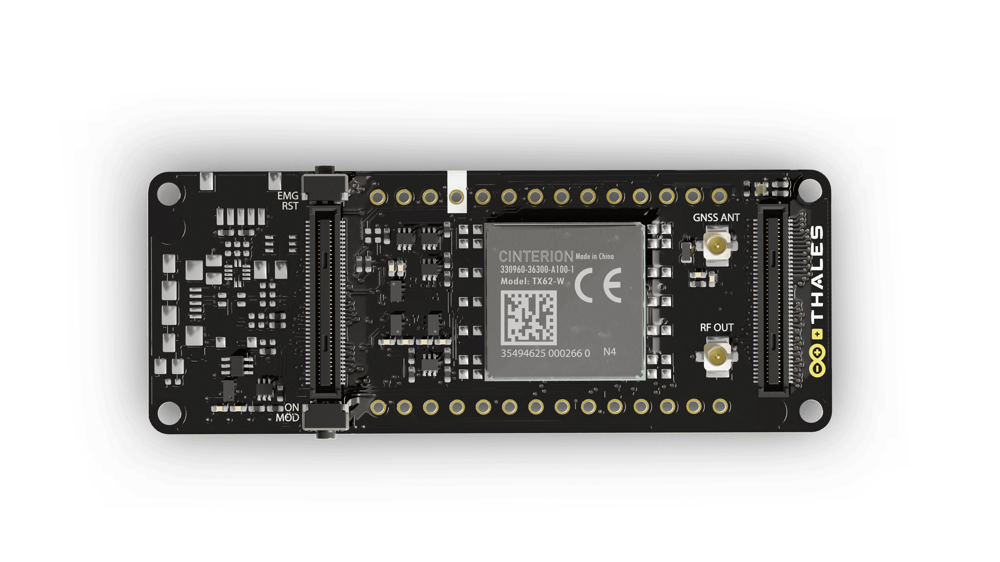
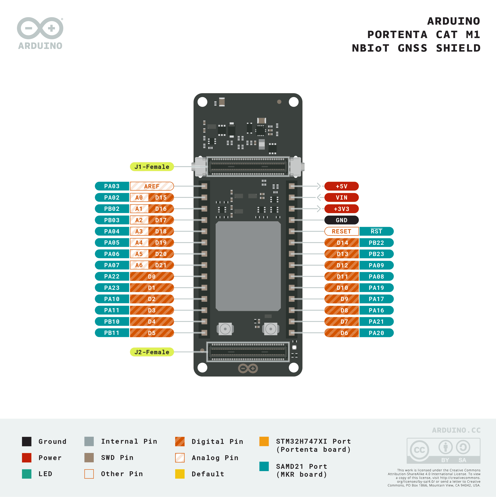
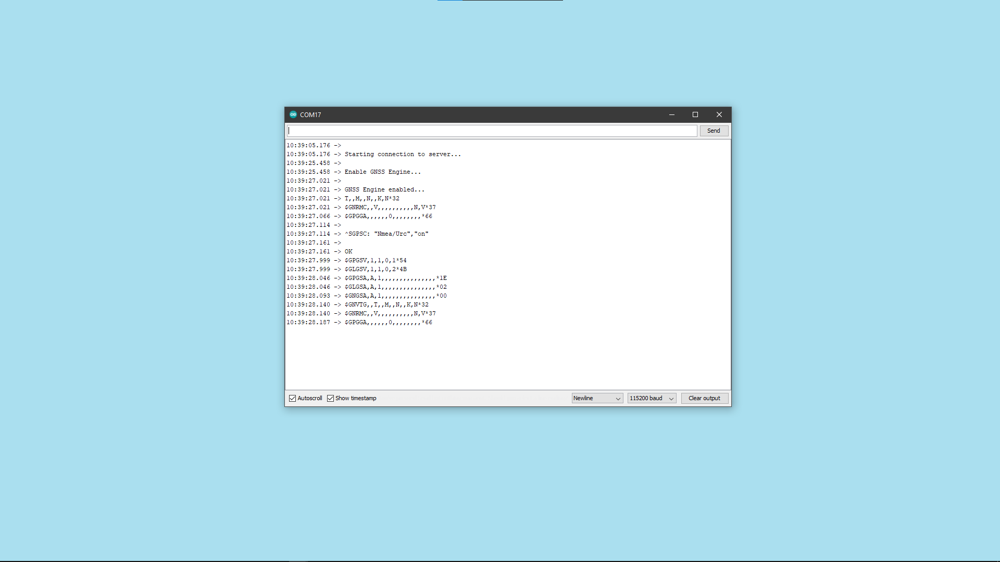

The **Arduino® Portenta Cat. M1/NB IoT GNSS Shield** is a board that enables cellular connectivity with both Cat. M1 and NB-IoT networks. Easily track your valuable assets across the city or worldwide by choosing among GPS, GLONASS, Galileo or BeiDou Satellite navigation system.

This article is a collection of guides, API calls and tutorials that can help you get started with the Arduino® Portenta Cat. M1/NB IoT GNSS Shield board. You can also visit the [documentation product page for the Arduino® Portenta Cat. M1/NB IoT GNSS Shield](/hardware/portenta-cat-m1-nb-iot-gnss-shield) for more in-depth tutorials about the different features.

## Core

The Arduino® Portenta Cat. M1/NB IoT GNSS Shield uses the libraries from the [Arduino Mbed OS Portenta core](https://github.com/arduino/ArduinoCore-mbed).

***The libraries are included in the mbed Core version greater than 2.6.1***

## Installation

### Arduino IDE 1.8.X

The Portenta Cat. M1/NB IoT GNSS Shield can be programmed through the **Classic Arduino IDE 1.8.X**. To install your board, you can check out the guide below:

- [Installing the Arduino Mbed OS Portenta Boards core](/software/ide-v1/tutorials/getting-started/cores/arduino-mbed_portenta)

### Arduino IDE 2 

The Portenta Cat. M1/NB IoT GNSS Shield can be programmed through the **Arduino IDE 2**. To install your board, you can check out the guide below:

- [How to use the board manager with the Arduino IDE 2](https://www.arduino.cc/en/Tutorial/getting-started-with-ide-v2/ide-v2-board-manager)

### Web Editor

The board can be programmed through the **Web Editor**. To get started with your board, you will only need to install a plug-in, which is explained in the guide below:

- [Getting started with the Web Editor](/cloud/web-editor/tutorials/getting-started/getting-started-web-editor)

## Pins
As a Portenta family shield, it uses High Density Connectors to interface with the Portenta board which is connected to.



## GSM

### Requirements

The GSM feature requires:

* An antenna (e.g [Dipole antenna, at the Arduino store](https://store.arduino.cc/products/dipole-pentaband-waterproof-antenna) connected to the **RF OUT** antenna connector on the top side of the shield
* SIM card capable of running according to Cat. M1 specifications (check with your provider if your SIM card has this feature)

To check if your setup is properly working, you can open an example sketch from the GSM library inside the Mbed Portenta Core. Under **Examples > GSM > GSMClient**, open a sketch that allows you to connect to the SIM card provider, then connect to a webpage, download its content and display it inside the Serial Monitor.

Make sure you go to the `arduino_secrets.h` tab and:

* Enter the PIN of your SIM card and store it in the variable `SECRET_PIN`.
* Check the mobile APN of your SIM card provider, e.g "online.provider.com", and save it inside the `SECRET_APN`. You can find this information by searching online for APN + provider name.

APN stands for 'Access Point Name'. An APN is a gateway between a cellular network and the Internet.

After finishing this setup, compile and upload the program. If everything went fine, you should see the HTML content of the webpage printed in the Serial Monitor.

***Sometimes it takes time to connect to the provider's APN, please be patient, it can take up to 30 minutes. If you cannot connect after that time, make sure you entered the correct SIM pin and the APN. If the issue persists, contact your provider and verify whether Cat. M1 is enabled on your SIM card.***

### API

To get familiar with the commands, you can take a look at the [GSM library](https://www.arduino.cc/en/Reference/GSM) which uses the same API.

This library contains some commands that are quite different, because it leverages mbed APIs. In this case, it uses the NetworkInterface, CellularContext and CellularDevice classes. For more information about API visit [https://os.mbed.com/docs/mbed-os/v6.14/apis/network-interface-apis.html](https://os.mbed.com/docs/mbed-os/v6.14/apis/network-interface-apis.html).


| Command | Information |
| :----------------------------------------------------: | :----------------------------------------------------------: |
| `GSM.begin(PIN, APN, USERNAME, PASSWORD, CATNB/CATM1)` | Unlock the SIM card using the PIN parameter and connects to the provider. |
| `GSMClient`| Client constructor, on the examples we define it as client  |
| `GSM.getTime()`|Returns the time, you can set a new one with setTime()|
| `GSM.getLocalTime()`| Returns the local time|
| `GSM.setTime()`| Set the time, it will be saved and it can be read with getTime() |
| `GSM.debug()`| After this command, the Serial Monitor will output more detailed info about the GSM class commands, connections, etc... |
| `GSMClient.connect(server,port)` | Connect to a remote server |
| `GSMClient.available()` | Check if the server that is connected to has some bytes ready to be read |
| `GSMClient.read()` | Returns data from the server |
| `GSMClient.stop()` | Disconnects from the server |

#### Connect to Your Provider

You need to enter the Pin code and the APN link of your provider.
The user name and password depend on your provider; they are required to authenticate with the APN gateway. These values can usually be found by searching online for APN credentials + provider name. Sometimes they can be left blank.

This sketch will initialize the SIM card and connect to your provider network

```cpp
#include <GSM.h>

char pin[]      = SECRET_PIN; 		//example "1234"
char apn[]      = SECRET_APN;		//example "live.provider.com"
char username[] = SECRET_USERNAME;
char pass[]     = SECRET_PASSWORD;

void setup() {
  Serial.begin(115200);
  while(!Serial) {}

	if(GSM.begin(pin, apn, username, pass, CATM1)){
		Serial.println("connected");
    // ...
	}
}
```

#### Send a HTTP GET Request and Receive Data

The following sketch will connect to your provider and use a HTTP GET request to get data from the server you are connected to. In this case, it connects to "example.com" and prints out the content through the Serial Monitor.

```cpp
#include <GSM.h>

REDIRECT_STDOUT_TO(Serial);

char pin[]      = SECRET_PIN; 		//example "1234"
char apn[]      = SECRET_APN;		  //example "live.provider.com"
char username[] = SECRET_USERNAME;
char pass[]     = SECRET_PASSWORD;

const char  server[] = "www.example.com";
const char* ip_address;
int port = 80;

GSMClient client;

void setup() {
  Serial.begin(115200);
  while(!Serial) {}

  GSM.begin(pin, apn, username, pass, CATNB);
  
  Serial.println("\nStarting connection to server...");
  // if you get a connection, report back via serial:
  if (client.connect(server, port)) {
    Serial.println("connected to server");
    // Make a HTTP request:
    client.println("GET / HTTP/1.1");
    client.print("Host: ");
    client.println(server);
    client.println("Connection: close");
    client.println();
  } else {
    Serial.println("unable to connect to server");
  }
  
}

void loop() {

  // if there are incoming bytes available
  // from the server, read them and print them:
  while (client.available()) {
    char c = client.read();
    Serial.write(c);
  }

  // if the server's disconnected, stop the client:
  if (!client.connected()) {
    Serial.println();
    Serial.println("disconnecting from server.");
    client.stop();

    // do nothing forevermore:
    while (true);
  }

}
```

## GPS

### Requirements

The GPS feature requires:

* A GPS active antenna (e.g [GPS active antenna 28dB](https://www.digikey.com/en/products/detail/adafruit-industries-llc/960/5353630)) connected to the **GNS ANT** antenna connector on the top side of the shield.
* You may need a connector converter from the active GPS antenna, we used this one [Coaxial to SMA](https://www.digikey.com/en/products/detail/taoglas-limited/CAB.719/3664639)

To check if your setup is properly working, you can open an example inside the GSM library from the Mbed Portenta Core, going to **Examples > GSM > GNSSClient**. You will open an sketch that connects to the SIM card provider and initializes the active GPS antenna. At this point, it will print out GPS readings.

Make sure you go to the `arduino_secrets.h` tab and:

* Add the PIN of the SIM card you are using and store it in the variable `SECRET_PIN`.
* Browse your IT provider and check the mobile APN link, e.g "online.provider.com" save it inside the `SECRET_APN`

***Sometimes it takes time to connect to the provider's APN, please be patient, it can take up to 30 minutes. If you cannot connect after that time, make sure you added the correct SIM pin and the APN. If the issue continues, contact your provider and verify whether Cat. M1 is enabled on your SIM card.***

### API


| Command | Information |
| :--------------------------------------------------: | :----------------------------------------------------------: |
| `GPS.begin()` | Initialize the GPS modem |
| `GPS.end()` | Turn OFF the GPS modem. |
| `GPS.available()` | Check if the GPS has new data to be read. |
| `GPS.read()` | Returns a `char` with the reading from the GPS module. |
| `GPS.readAndPrint()` | Output data on the Serial Monitor, only if there is new data.|
| `GPS.readAndDrop()` | Read the data and do nothing with it. |
| `GPS.checkGNSSEngine()` | Check if the GNSS modem is receiving data correctly. |


#### Get GPS Data

The following example connects to the GSM provider, then initializes the GPS antenna, gets data and prints them out on the Serial Monitor. As done previously, you need to provide the GSM data by filling the secrets in `arduino_secrets.h`

Open the example by going to **Examples > GSM > GNSSClient**.

```arduino
  #include <GPS.h>
  #include <GSM.h>

  REDIRECT_STDOUT_TO(Serial);

  #include "arduino_secrets.h"
  char pin[]      = SECRET_PIN;
  char apn[]      = SECRET_APN;
  char username[] = SECRET_USERNAME;
  char pass[]     = SECRET_PASSWORD;

  void setup() {
    Serial.begin(115200);
    while (!Serial) {}
    //GSM.debug(Serial);
    Serial.println("\nStarting connection to GSM...");
    GSM.begin(pin, apn, username, pass, CATNB);

    Serial.println("\nEnable GNSS Engine..."); 
    GPS.begin();  //start and enable the GNSS engine
    Serial.println("\nGNSS Engine enabled...");
  }

  void loop() {
    while(GPS.available()){
      Serial.print((char) GPS.read());
      delay(1);
    }

    delay(1000);
  }
```

***Remember to connect to the GSM provider first and secondly connect to the GNSS (mandatory).***

You will see the **NMEA** data in the Serial Monitor.



#### Parse NMEA GPS Sentences

Previously we went through how to show the GPS data in the Serial Monitor, but it was not possible to evaluate those messages (NMEA sentences).

To do so, you can use an **NMEA parser**. This will convert messages received from the GPS modem, parsing and saving them into variables. You can use the **107-Arduino-NMEA-Parser** library. This library can be found in the library manager inside the Arduino IDE.

In this way, it is possible to interact with the data that you need for your application, for instance getting only latitude and longitude. You will be able to save those values into variables, instead of having the whole NMEA messages.

Open the example from the library at **Examples > 107-Arduino-NMEA-Parser > NMEA-Basic** and add the following: 

Include the needed libraries.

```cpp
  #include "GPS.h"
  #include "GSM.h"
  #include "ArduinoNmeaParser.h"
  #include "Arduino_secrets.h"

  char pin[]      = SECRET_PIN;
  char apn[]      = SECRET_APN;
  char username[] = SECRET_LOGIN;
  char pass[]     = SECRET_PASS;
```

Inside the `setup()` initialize the GSM and GPS modules.

```cpp
  void setup(){
    Serial.begin(115200);
    while (!Serial) {}
    Serial.println("GSM...");
    GSM.begin(pin, apn, username, pass, CATNB);
    Serial.println("GPS...");
    GPS.begin();
    Serial.println("Success");
  }
```

Edit the loop to parse the `GPS` readings instead of the `Serial1`.

```cpp
  void loop(){
    while(GPS.available()){
      parser.encode((char)GPS.read());
    }
  }
```

***You will see the output data as various "-1" until the GPS has enough visible satellites to get the correct data. Make sure the GPS antenna is pointing at the sky.***

#### Low Power GPS

The GPS antenna is active, that means that it needs power to function as it has electronics inside of it.

One way to save power on your project is to enable the GPS module only when it needs to read data:

```cpp
  //Start the GPS module
  GPS.begin();    

  // Print data
  while(GPS.available()){
    Serial.print((char) GPS.read());
    delay(1);
  }

  //stop and disable the GNSS engine
  GPS.end();
```
By using this method, you don't need to initialize the GPS inside the `setup()`.

## Conclusion

This cheat sheet is written as a quick reference to look up the GSM and GPS feature of this product. For a more in-depth walk through experience, please have a look at the other tutorials.

## Troubleshooting

### Getting Compiling Errors Using GPS and GSM

Make sure you included first the `GPS.h` library and then the `GSM.h`

### Can't Upload the Sketch

Sometimes, while the GPS module is getting readings, you will not be able to upload a new sketch. Double tap the reset button on your Portenta H7 and upload the new sketch.
