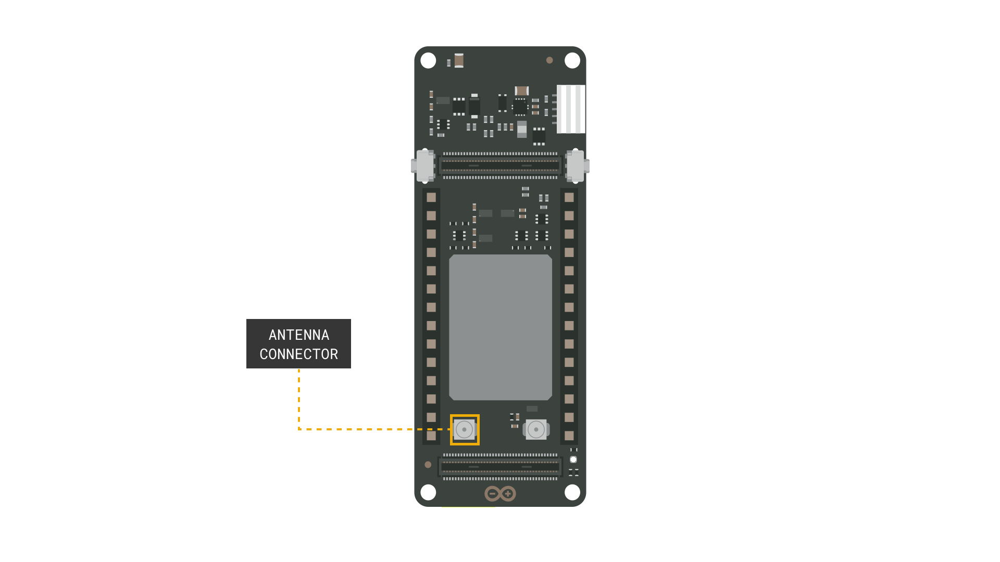
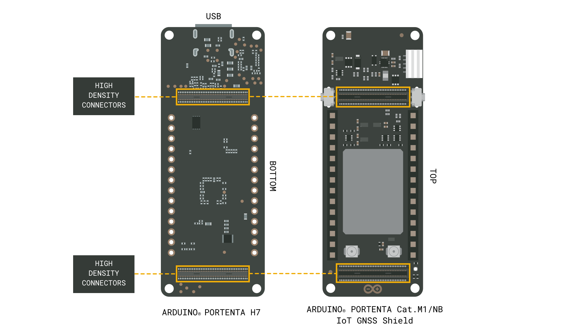
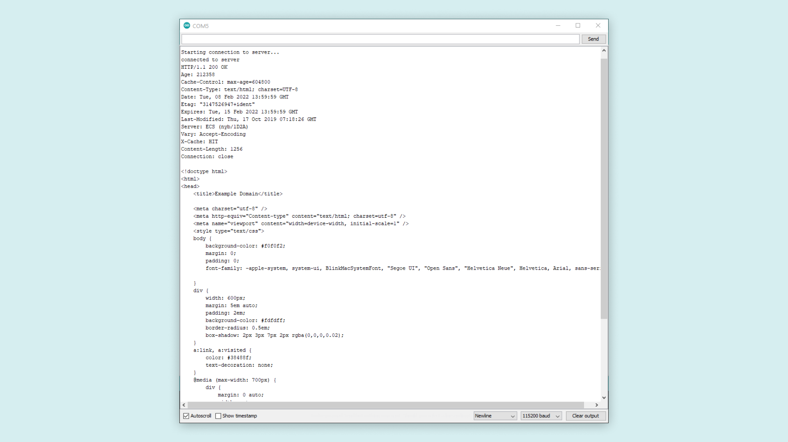

## Introduction 

This tutorial will show how to connect the Arduino® Portenta Cat. M1/NB IoT GNSS shield to the Arduino® Portenta H7, connect to a website using NB IoT or Cat. M1 technology and print the website's HTML content in the Serial Monitor. This will help you quickly find out if the setup successfully connects to mobile networks.

***Note: This tutorial was created in Sweden, and, as a result, the available networks are only Swedish network operators. Results may vary depending on what location you are in.***

## Goals

The goals of this project are:

- Learn how to connect the board and the shield.
- Connect to the GSM network with Cat. M1 or NB IoT.
- Print HTML content in the Serial Monitor.

## Hardware & Software Needed

- [Portenta H7](https://store.arduino.cc/products/portenta-h7)
- [Portenta Cat. M1/NB IoT GNSS Shield](https://store.arduino.cc/products/portenta-catm1)
- [USB-C® cable](https://store.arduino.cc/products/usb-cable2in1-type-c)
- [Dipole Antenna](https://store.arduino.cc/antenna) (or equivalent product with the same frequency range)
- [Arduino IDE 1.8.10+](https://www.arduino.cc/en/software) or [Arduino IDE 2.0+](https://www.arduino.cc/en/software)

## Instructions

### Circuit

First insert the SIM card into the SIM card slot at the bottom of the Portenta Cat. M1/NB IoT GNSS Shield. The image below shows where to connect the [dipole antenna](https://store.arduino.cc/antenna) to the shield. It should connect to the antenna connector marked **RF OUT**.



Now connect the shield to the Portenta H7. Do this by attaching it to the HD connectors at the bottom of the Portenta H7 board. Like the image shows below, the top and bottom high density connectors on the shield are connected to the corresponding ones on the lower side of the H7 board. Press firmly to let it snap in. Once attached, plug the Portenta H7 into your computer using a USB-C® cable.



### Arduino IDE

Make sure that you have the latest **Arduino Mbed OS Portenta core** installed. You can install it with the board manager under **Tools > Board > Board Manager...**. With the core installed and the board selected, navigate to **File > Examples > GSM > GSMClient**. This is the example sketch we will use to test out the Cat. M1 or NB IoT connection.

### Programming the Board

Go to the **arduino_secrets.h** tab that opens with the example and enter the PIN of the SIM card you are using into the `SECRET_PIN` variable. Check your SIM card provider's mobile APN, e.g "online.provider.com" and save it inside `SECRET_APN`.

***Note: A standard pre-paid SIM card typically have 0000 or 1234 as a pin code. This varies from operator to operator, it is important to find out your pin before uploading the code. Otherwise, too many unsuccessful attempts may block the SIM card.***

Using `GSM.begin()` will make the GSM module to start with the pin and APN entered in **arduino_secrets.h**. To decide whether to use NB IoT or Cat. M1 technology, you need to change the last argument. Use either `CATNB` for NB IoT or `CATM1` for Cat. M1. If you are unsure what technology to use, check with your SIM card provider what technology they support.

```arduino
GSM.begin(pin, apn, username, pass, CATNB);
```

When the GSM module starts, you can connect to a remote server using the server url defined in the example. The port to connect to is also defined: it is set to `80` as default.

```arduino
client.connect(server,port)
```

***__Please be aware that the Portenta Cat. M1/NB IoT GNSS Shield is not certified as an End-Device by all cellular network providers__. If you encounter difficulties with network connection, we recommend checking with your service provider to verify if End-Device certification is required for network access. Switching to a provider that does not have such requirements may resolve these issues. We advise reviewing this compatibility information during setup to ensure optimal device performance and to prevent potential service interruptions.***

### Result of Sketch

After finishing this setup, compile and upload the program. You should see the HTML content of the server printed in the Serial Monitor. The server is set as `example.com` as default. Feel free to change this and take a look at how it prints different webpages. Below you can see what will be printed in the Serial Monitor when connecting to `example.com`.



### Troubleshoot

If the code is not working, there are some common issues we can troubleshoot:

- We have entered the wrong pin number.
- We are out of coverage (no signal).
- SIM card may not be activated.

## Next Step

This is a basic example showing what the Portenta Cat. M1/NB IoT GNSS Shield is capable of. A good next step could be to try out the GNSS functionality. To use the GNSS functionality you will need a different antenna from the one used in this tutorial (e.g. ECHO19/0.1M/UFL/S/S/17). If you would rather use the same set up as in this tutorial, but with more advanced functionality, try to send an SMS to a cellphone using the GSM connection.

## Conclusion

This tutorial showed how to connect the Portenta Cat. M1/NB IoT GNSS Shield to the Portenta H7. It also showed how to upload an example sketch that helps to confirm the set up is properly working. The website to connect to can easily be changed in the sketch. Make sure to take a look at our other tutorials for this product.
