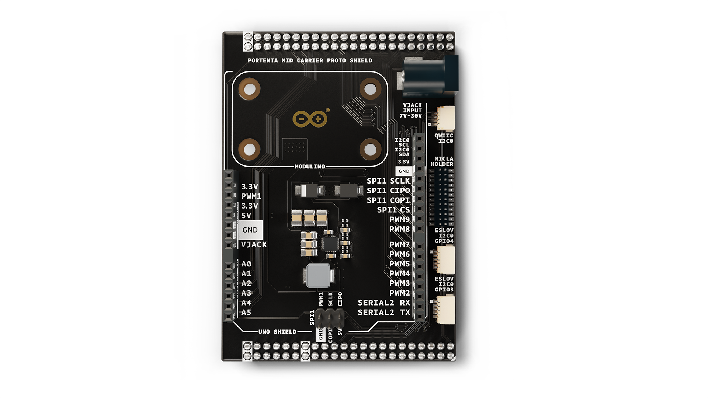
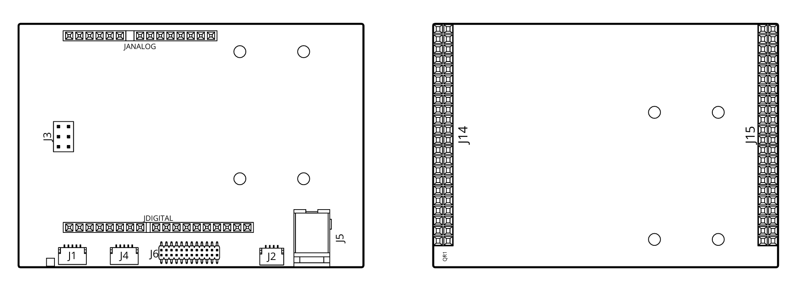
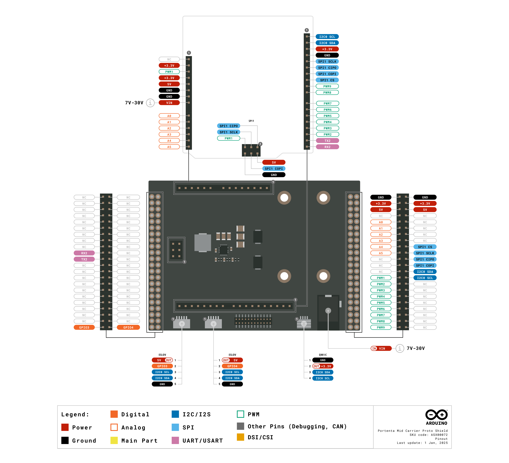
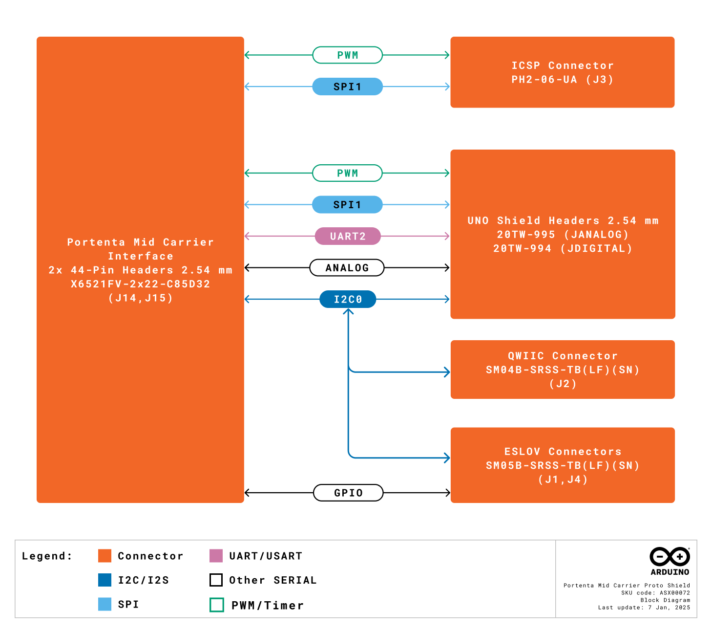
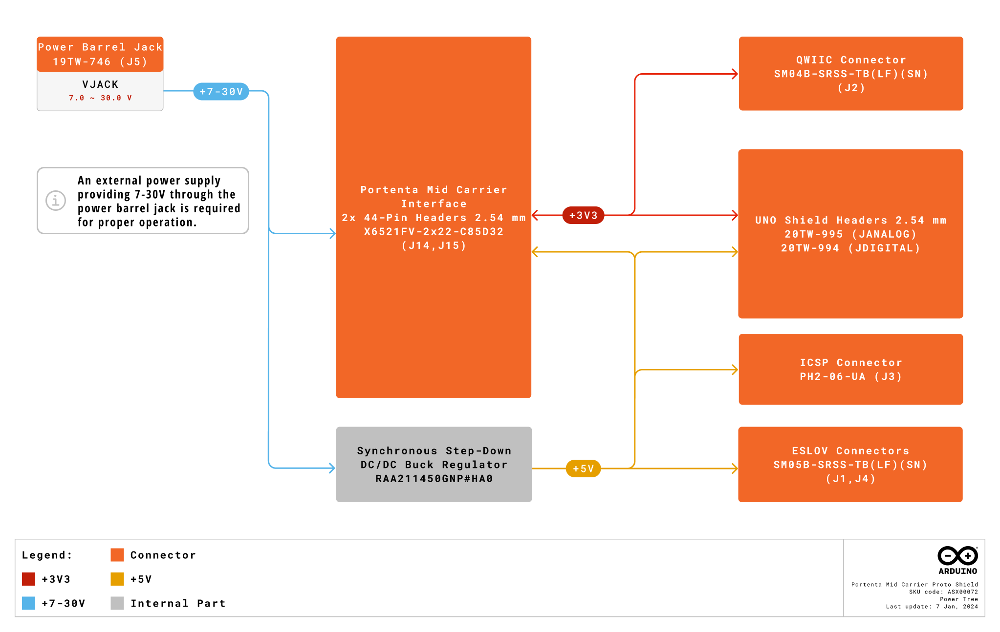
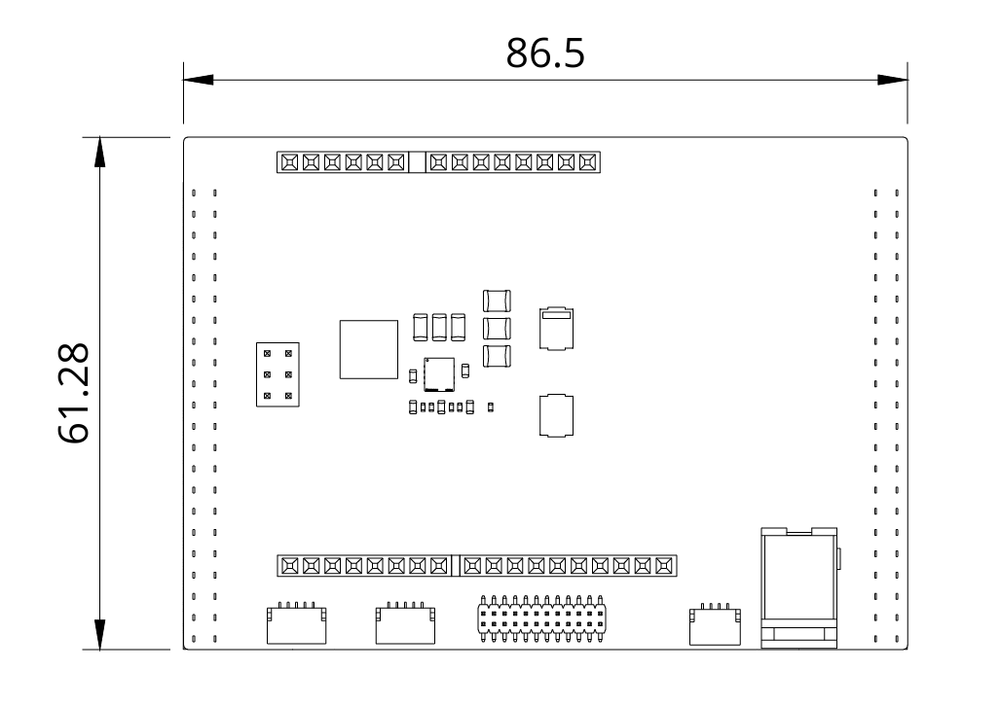
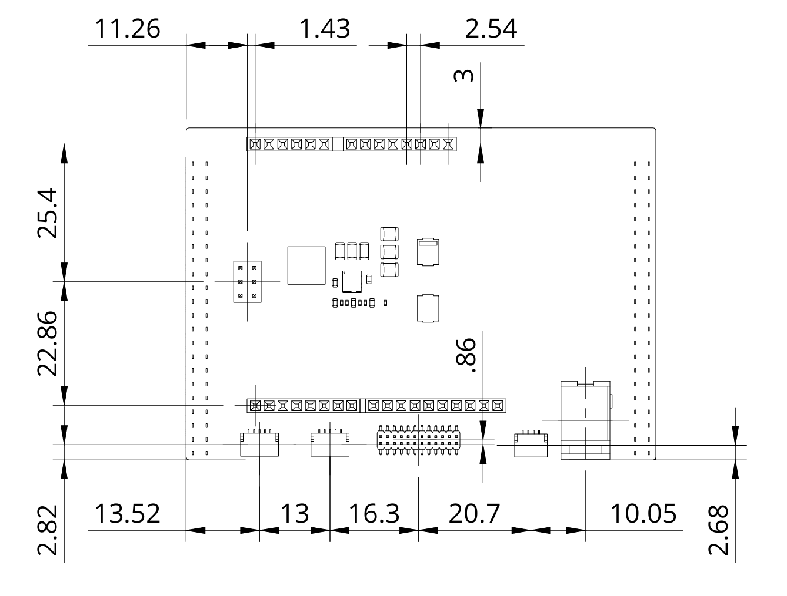
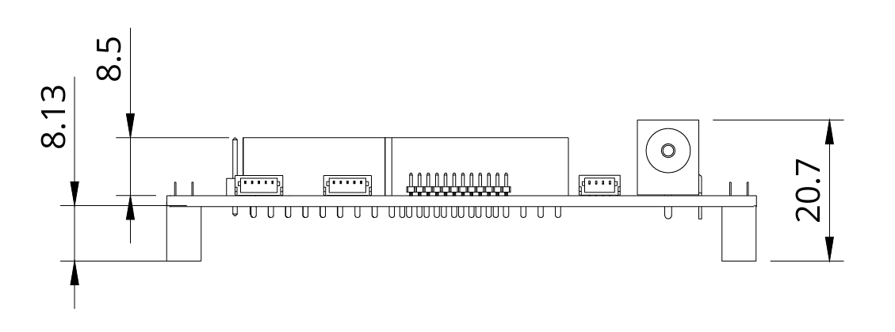
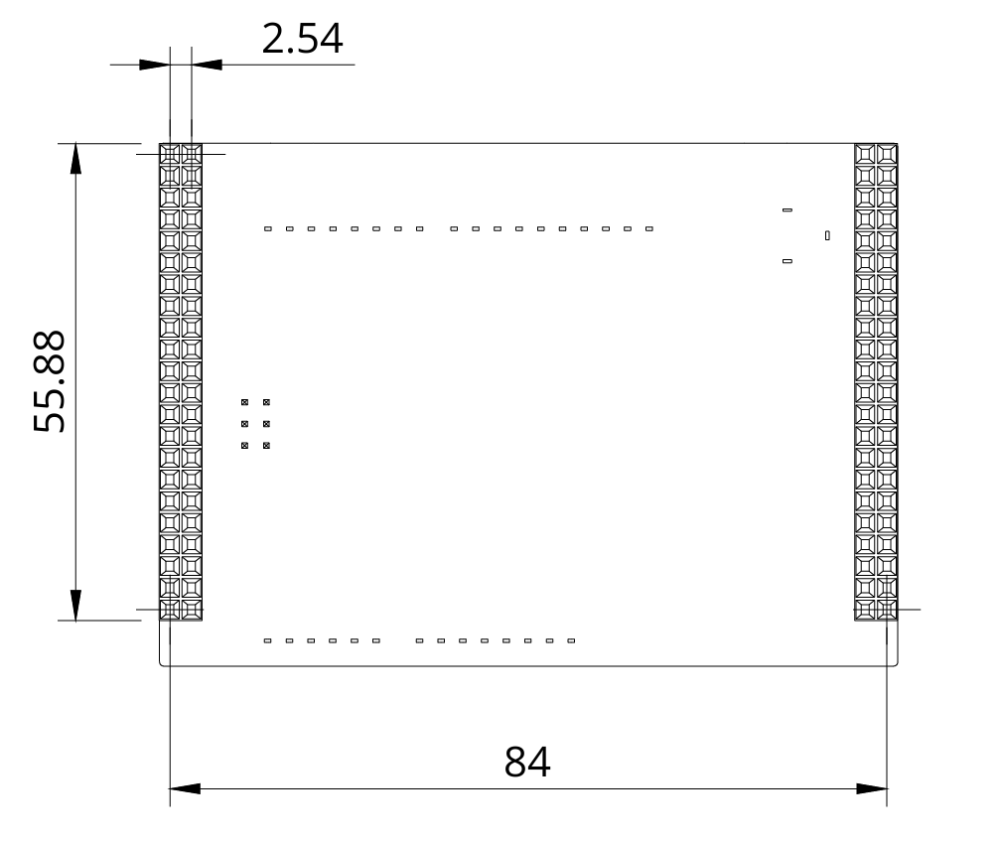

# Description

The Arduino Portenta Mid Carrier Proto Shield is a versatile platform designed for advanced prototyping within the Arduino ecosystem. It integrates seamlessly with Portenta boards, Nicla modules, Modulino® and Arduino UNO shields to enable environmental monitoring, motion detection, machine vision and air quality analysis. The shield features QWIIC and ESLOV connectors, supporting modular and scalable development with compatible devices. It is also compatible with Modulino® nodes, providing additional flexibility for sensor integration and component expansion. The Proto Shield is the central hub, offering compatibility and adaptability for diverse IoT, industrial and electronics projects. This design ensures a robust and accessible development experience for beginners and advanced users.

# Target Areas:

Industrial automation, building automation, smart cities

# CONTENTS

## Application Examples

The Arduino Portenta Mid Carrier Proto Shield, when combined with the Portenta, Nicla, Modulino®, or UNO Shield, provides a comprehensive solution for diverse applications across industries. Below are some examples demonstrating its potential:

**Industrial automation:** The Portenta Mid Carrier Proto Shield enables advanced monitoring, control, and data processing, enhancing efficiency and reliability in industrial processes. Some examples are described below:
- **Predictive maintenance prototyping:** Develop prototypes for industrial machinery using Nicla Vision for real-time equipment inspection and Nicla Sense ME and Sense Env for environmental monitoring. The Portenta H7 processes data, while Cloud integration enables predictive algorithms for proactive maintenance and reduced downtime.
- **EV charging station prototyping:** Prototype EV charging stations with features like real-time data collection, anomaly detection, and power load management. Integrate Cloud connectivity via a Portenta family board for remote management and performance analytics.
- **Remotely controlled machine prototyping:** Establish machine control networks with Portenta Mid Carrier and CAN communication. Enable real-time data exchange, remote monitoring, and control via the Cloud to optimize machine performance and reduce downtime.
- **High-speed test rigs:** Build scalable test rigs for sensor calibration, load testing, and functional validation. Use the Portenta Mid Carrier Proto Shield for central control, environmental monitoring, anomaly detection, and real-time Cloud data transmission.

**Building automation / Smart cities:** The Portenta Mid Carrier Proto Shield facilitates innovative solutions for environmental monitoring and security systems in smart environments.
- **Environmental monitoring prototypes:** Use Nicla and Modulino® sensors with the Portenta H7 to monitor air quality, noise, and other parameters in real time, supporting informed decision-making.
- **Intruder detection prototypes:** Leverage Nicla Vision’s motion detection and face recognition for robust security monitoring. Integrate with Portenta H7 and the Arduino Pro 4G module for real-time alerts and remote monitoring.
- **Asset tracking prototypes:** Create logistics solutions to monitor environmental conditions such as temperature and humidity during transit. Use 4G network and GNSS for seamless Cloud data transmission and analytics to ensure goods integrity.

The Arduino Portenta Mid Carrier Proto Shield provides a ready-to-use platform for developers, enabling rapid prototyping and scalability for production, with intuitive tools like Arduino IDE and seamless Cloud integration.

## Features
### General Specifications Overview

The Portenta Mid Carrier Proto Shield is a versatile solution for prototyping and automation applications. It integrates seamlessly with Portenta and Nicla family boards, Modulino® and UNO Shields offering, advanced sensing, data processing and connectivity support. Boards like Nicla Vision for machine vision and Nicla Sense ME for environmental monitoring enable real-time analysis and cloud integration, making it ideal for industrial automation, building automation and smart city solutions.

The main features of the shield are detailed in the table shown below.

| **Feature**                            | **Description**                                                                               |
| -------------------------------------- | --------------------------------------------------------------------------------------------- |
| Compatible Modules                     | Nicla sensorized nodes  Modulino®  Arduino® UNO Shields                         |
| Connectors                             | 2x ESLOV connectors  1x QWIIC connector  1x Nicla Holder (Mechanical Interface) |
| Arduino UNO Shields Headers Interfaces | ADC  GPIO  SPI  I2C                                                      |
| Power                                  | 7-30 VDC via dedicated power jack                                                             |
| Operating Temperatures                 | -40° C to +85° C (-40° F to 185° F)                                                           |
| Dimensions                             | 61.28 mm x 86.5 mm                                                                            |

### Communication Interfaces

The communication interfaces and other important features of the shield are detailed in the table shown below.

| **Interface**                       | **Details**                                                                                                    |
| ----------------------------------- | -------------------------------------------------------------------------------------------------------------- |
| Portenta Mid Carrier Headers        | 2x 44-pin female headers  Provides high-density connectivity with Portenta family board                 |
| Modulino® Mounting Holes            | Supports Modulino® mounting                                                                                    |
| Arduino UNO Shield Headers          | ADC, GPIO, SPI, I2C  Expands functionality with standard Arduino UNO Shields                            |
| QWIIC Connector                     | 1x QWIIC  Enables quick and simple sensor integration with daisy-chain capabilities                     |
| ESLOV Connector                     | 2x ESLOV  Supports scalable module integration and communication                                        |
| Nicla Holder (Mechanical Interface) | Dedicated connectors for Nicla modules  Enables advanced sensing and processing with Nicla family board |

### Related Accessories

- ESLOV cable
- Qwiic cable

### Related Products

- Arduino® Portenta Mid Carrier (ASX00055)
- Arduino® Nicla Voice (ABX00061)
- Arduino® Nicla Vision (ABX00051)
- Arduino® Nicla Sense ME (ABX00050)
- Arduino® 4 Relays Shield (A000110)
- Arduino® 9 Axis Motion Shield (A000070)
- Arduino® Ethernet Shield Rev 2 (A000024)
- Arduino® Motor Shield Rev 3 (A000079)

<strong>Note:</strong> The Portenta Mid Carrier Proto Shield requires the Portenta Mid Carrier with a a compatible Portenta family board to operate.

## Ratings

### Recommended Operating Conditions

The table below provides a comprehensive guideline for the optimal use of the Portenta Mid Carrier Proto Shield, outlining typical operating conditions and design limits. The operating conditions of the Portenta Mid Carrier Proto Shield are largely based on the specifications of its components.

|            **Parameter**             |    **Symbol**    | **Min** | **Typ** | **Max** | **Unit** |
|:------------------------------------:|:----------------:|:-------:|:-------:|:-------:|:--------:|
| Power Jack Input Voltage1 | VJACK |   7.0   |    -    |  30.0   |    V     |
|        Operating Temperature         |  TOP  |   -40   |    -    |   85    |    °C    |

1 The Portenta Mid Carrier Proto Shield is powered via the power barrel jack (J5), supporting an input voltage range of 7.0 to 30.0 VDC.

<strong>The onboard barrel jack is the only regulated way to power the Portenta Mid Carrier Proto Shield.</strong> While it is possible to supply power through the shield's pin, <strong>caution is advised as these pins are not regulated</strong>. Their functionality depends on the components connected to them. Using the <strong>onboard barrel jack (J5)</strong> ensures stable and reliable operation of the shield.

## Functional Overview

The Portenta Mid Carrier Proto Shield is designed for modular integration and advanced prototyping within the Arduino ecosystem. It features dual 44-pin Portenta Mid Carrier headers, offering high-density connectivity for advanced applications and integration with the Portenta ecosystem. It has two ESLOV connectors and one QWIIC connector for I2C communication, ensuring uninterrupted connectivity with sensors and peripherals.

The shield also features Arduino UNO headers that provide ADC, GPIO, SPI, and I2C interfaces compatible with standard Arduino shields. Dedicated mechanical interfaces for Nicla and Modulino® modules enable specialized sensing and data acquisition. These features make the Portenta Mid Carrier Proto Shield a robust, functional, and scalable platform for project development.

### Shield Topology

An overview of the Portenta Mid Carrier Proto Shield topology is illustrated and described in the gure and table below.

| **Ref.** | **Description**                                                                  | **Ref.** | **Description**                                                                                                              |
|----------|----------------------------------------------------------------------------------|----------|------------------------------------------------------------------------------------------------------------------------------|
| J1, J4   | ESLOV connector (P/N: SM05B-SRSS-TB(LF)(SN))                                     | J2       | QWIIC connector (P/N: SM04B-SRSS-TB(LF)(SN))                                                                                 |
| J3       | Through-hole header, 6 position, 2.54 mm pitch (P/N: PH2-06-UA)                  | J5       | Power jack connector, 2.1 x 5.5 mm, DC 30 V 0.5 A (P/N: 19TW-746)                                                            |
| J6       | SMD header connector, 24 position, 2x12, 1.27 mm pitch (P/N: 10166143-00024C1LF) | J14, J15 | Portenta Mid Carrier interface, through-hole vertical female header, 2x22 position, 2.54 mm pitch (P/N: X6521FV-2x22-C85D32) |
| JANALOG  | UNO Shield connector strip, female, single pin, 14 V rated (P/N: 20TW-995)       | JDIGITAL | UNO Shield connector strip, female, single pin, 18 V rated (P/N: 20TW-994)                                                   |

### Pinout

The Portenta Mid Carrier Proto Shield connectors pinout is shown in the figure below.

### Block Diagram

An overview of the high-level architecture of the Portenta Mid Carrier Proto Shield is illustrated in the figure below.

### Power Supply

The Portenta Mid Carrier Proto Shield requires external power through the onboard power barrel jack:

- **Power Barrel Jack (J5):** Accepts an external power supply with an input voltage range of 7.0 to 30.0 VDC.

<strong>The onboard barrel jack is the only regulated way to power the Portenta Mid Carrier Proto Shield.</strong> While it is possible to supply power through the shield's pin, <strong>caution is advised as these pins are not regulated</strong>. Their functionality depends on the components connected to them. Using the <strong>onboard barrel jack (J5)</strong> ensures stable and reliable operation of the shield.

The figure below provides a detailed overview of the power option and the main system power architecture of the Portenta Mid Carrier Proto Shield.

## Device Operation

### Getting Started - IDE

To program your Portenta Mid Carrier Proto Shield offline with a Portenta family board, install the Arduino Desktop IDE **[1]**. You will need a compatible USB cable to connect the Portenta board to your computer.

### Getting Started - Arduino Web Editor

All Arduino devices work out of the box on the Arduino Cloud Editor **[2]** by installing a simple plugin. The Arduino Cloud Editor is hosted online. Therefore, it will always be up-to-date with all the latest features and support for all boards and devices. Follow **[3]** to start coding on the browser and upload your sketches onto your device.

### Getting Started - Arduino Cloud

All Arduino IoT-enabled products are supported on Arduino Cloud, which allows you to log, graph, and analyze sensor data, trigger events, and automate your home or business. Refer to the official documentation for more details.

### Sample Sketches

Sample sketches for the Portenta Mid Carrier Proto Shield are available in the **Examples** menu in the Arduino IDE or the **Portenta Mid Carrier Proto Shield Documentation** section of Arduino documentation **[4]**.

### Online Resources

Now that you have gone through the basics of what you can do with the device, you can explore the endless possibilities it provides by checking exciting projects on Arduino Project Hub **[5]**, the Arduino Library Reference **[6]**, and the online store **[7]** where you will be able to complement your Portenta Mid Carrier Proto Shield board with additional extensions, sensors, and actuators.

## Mechanical Information

The Portenta Mid Carrier Proto Shield is a double-sided board measuring 61.28 mm x 86.5 mm. It includes two ESLOV connectors, one QWIIC connector, a Modulino®, a Nicla mechanical interface, an Arduino UNO Shield interface, and a Portenta Mid Carrier interface with two 44-pin female headers.

### Shield Dimensions

The outline of the Portenta Mid Carrier Proto Shield is shown in the figure below, with all dimensions provided in millimeters (mm).

The shield includes mounting holes for the Modulino®.

### Shield Connectors

The connectors of the Portenta Mid Carrier Proto Shield are mainly found along its edges, with additional connectors positioned within the shield’s interior. Their placement is illustrated in the figures below, with all dimensions provided in millimeters (mm).

## Product Compliance

### Product Compliance Summary

| **Product Compliance** |
| :--------------------: |
|  CE (European Union)   |
|       FCC (USA)        |
|      IC (Canada)       |
|       UKCA (UK)        |
|          RoHS          |
|         REACH          |
|          WEEE          |

### Declaration of Conformity CE DoC (EU)

We declare under our sole responsibility that the products above are in conformity with the essential requirements of the following EU Directives and therefore qualify for free movement within markets comprising the European Union (EU) and European Economic Area (EEA).

### Declaration of Conformity to EU RoHS & REACH 211 01/19/2021

Arduino boards are in compliance with RoHS 2 Directive 2011/65/EU of the European Parliament and RoHS 3 Directive 2015/863/EU of the Council of 4 June 2015 on the restriction of the use of certain hazardous substances in electrical and electronic equipment.

| **Substance**                          | **Maximum Limit (ppm)** |
|----------------------------------------|-------------------------|
| Lead (Pb)                              | 1000                    |
| Cadmium (Cd)                           | 100                     |
| Mercury (Hg)                           | 1000                    |
| Hexavalent Chromium (Cr6+)             | 1000                    |
| Poly Brominated Biphenyls (PBB)        | 1000                    |
| Poly Brominated Diphenyl ethers (PBDE) | 1000                    |
| Bis(2-Ethylhexyl) phthalate (DEHP)     | 1000                    |
| Benzyl butyl phthalate (BBP)           | 1000                    |
| Dibutyl phthalate (DBP)                | 1000                    |
| Diisobutyl phthalate (DIBP)            | 1000                    |

Exemptions: No exemptions are claimed.

Arduino Boards are fully compliant with the related requirements of European Union Regulation (EC) 1907 /2006 concerning the Registration, Evaluation, Authorization and Restriction of Chemicals (REACH). We declare none of the SVHCs (https://echa.europa.eu/web/guest/candidate-list-table), the Candidate List of Substances of Very High Concern for authorization currently released by ECHA, is present in all products (and also package) in quantities totaling in a concentration equal or above 0.1%. To the best of our knowledge, we also declare that our products do not contain any of the substances listed on the "Authorization List" (Annex XIV of the REACH regulations) and Substances of Very High Concern (SVHC) in any significant amounts as specified by the Annex XVII of Candidate list published by ECHA (European Chemical Agency) 1907 /2006/EC.

### Conflict Minerals Declaration

As a global supplier of electronic and electrical components, Arduino is aware of our obligations concerning laws and regulations regarding Conflict Minerals, specifically the Dodd-Frank Wall Street Reform and Consumer Protection Act, Section 1502. Arduino does not directly source or process conflict minerals such as Tin, Tantalum, Tungsten, or Gold. Conflict minerals are contained in our products in the form of solder, or as a component in metal alloys. As part of our reasonable due diligence, Arduino has contacted component suppliers within our supply chain to verify their continued compliance with the regulations. Based on the information received thus far we declare that our products contain Conflict Minerals sourced from conflict-free areas.

## Company Information

| **Company Information** | **Details**                                |
|-------------------------|--------------------------------------------|
| **Company Name**        | Arduino S.r.l.                             |
| **Company Address**     | Via Andrea Appiani, 25-20900 Monza (Italy) |

## Reference Documentation

| **No.** | **Reference**                                   | **Link**                                                            |
|:-------:|-------------------------------------------------|---------------------------------------------------------------------|
|    1    | Arduino IDE (Desktop)                           | https://www.arduino.cc/en/Main/Software                             |
|    2    | Arduino IDE (Cloud)                             | https://create.arduino.cc/editor                                    |
|    3    | Arduino Cloud - Getting Started                 | https://docs.arduino.cc/arduino-cloud/guides/overview/              |
|    4    | Portenta Mid Carrier Proto Shield Documentation | https://docs.arduino.cc/hardware/portenta-mid-carrier-proto-shield/ |
|    5    | Project Hub                                     | https://create.arduino.cc/projecthub                                |
|    6    | Library Reference                               | https://www.arduino.cc/reference/en/                                |
|    7    | Online Store                                    | https://store.arduino.cc/                                           |

## Document Revision History

|  **Date**  | **Revision** |     **Changes**     |
|:----------:|:------------:|:-------------------:|
| 07/01/2025 |       1      |    First release    |