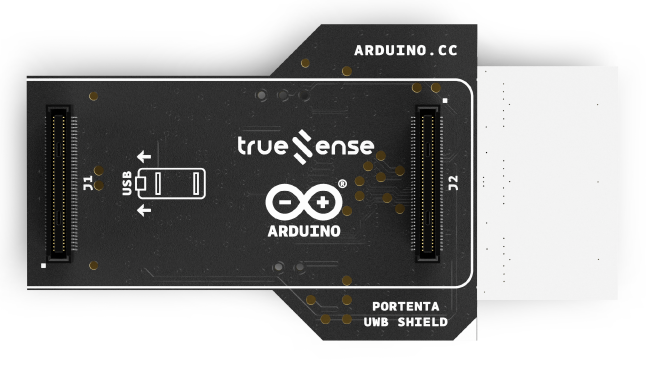
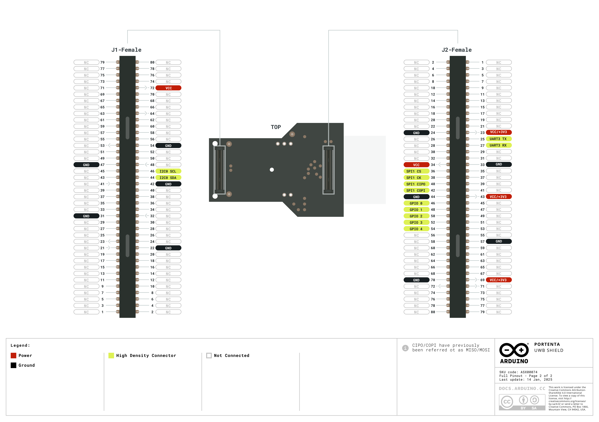
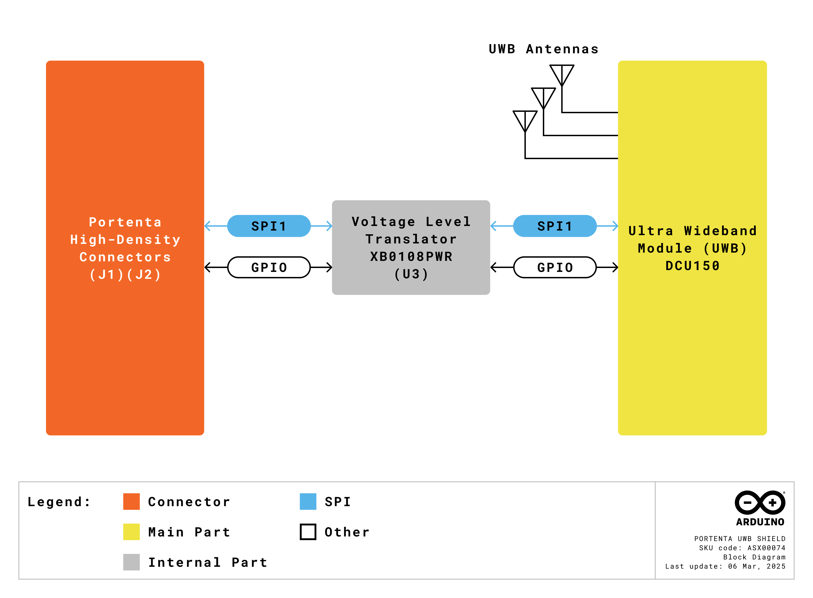
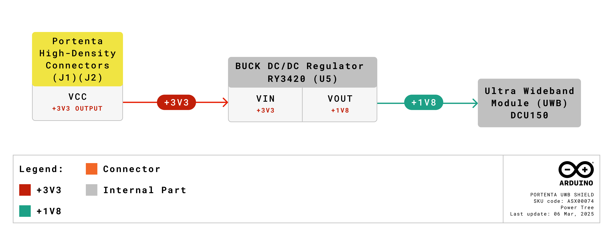
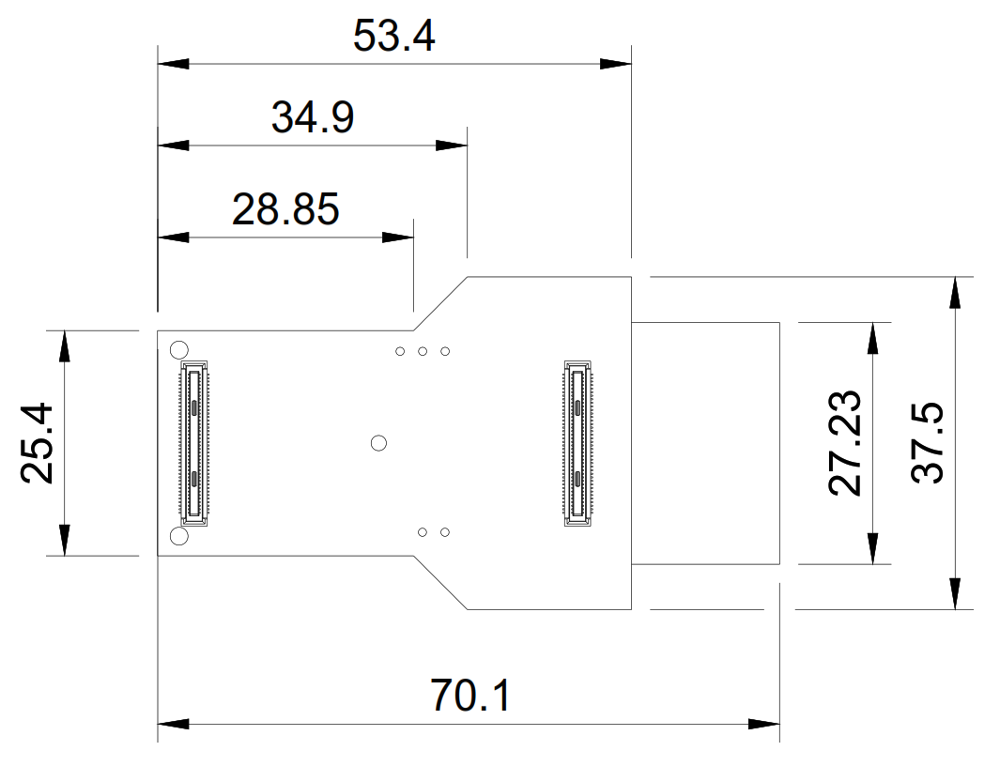
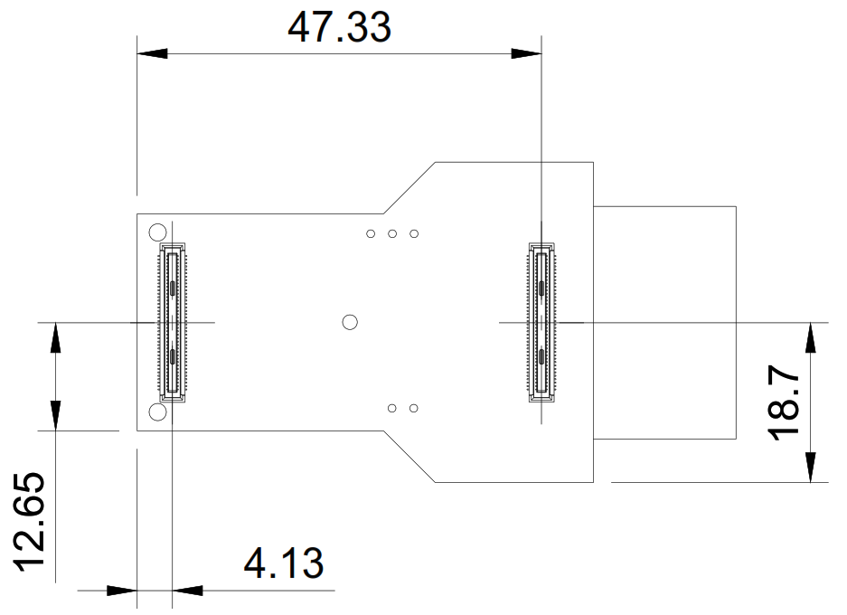

# Description

The Portenta UWB Shield, based on the Truesense DCU150 module, is a versatile Ultra-Wideband (UWB) communication solution. It integrates with the Arduino Portenta C33 board via its High-Density connectors and functions as a base station for two-way ranging and real-time location services (RTLS). The shield features the Truesense DCU150 module, which incorporates the NXP® Trimension™ SR150 UWB integrated circuit (IC), three embedded PCB antennas, onboard power management, clock control, filters and peripheral components. With 1.8 to 3.3 VDC level shifters and dual High-Density board-to-board connectors, it plugs directly into the Portenta C33 board.

# Target Areas

Smart logistics, precision proximity sensing, high precision RTLS, industrial applications, access control and secure payments

# CONTENTS

## Application Examples

The Portenta UWB Shield is a versatile tool for developing Ultra-Wideband (UWB) communication solutions in various industries. Explore the possibilities of integrating advanced positioning and real-time location services into your projects with the following application examples:

- **Smart logistics:** Optimize your supply chain and asset tracking solutions with the Portenta UWB Shield, enabling precise location monitoring for:
  - 
<strong>Warehouse management:</strong> Deploy the Portenta UWB Shield as fixed anchor points throughout warehouses to track inventory, forklifts, and other assets with centimeter-level accuracy, significantly improving inventory management and reducing search times.

  - 
<strong>Container tracking:</strong> Use the Portenta UWB Shield to create a network for real-time monitoring of shipping containers, pallets, and high-value assets throughout the logistics chain, ensuring visibility and reducing loss.

  - 
<strong>Last-mile delivery:</strong> Implement UWB-based systems for precise navigation in delivery vehicles and drones, facilitating accurate drop-off locations and improving delivery efficiency in complex environments.

- **Industrial applications:** Transform your industrial operations with the Portenta UWB Shield, providing robust location-based solutions for:
  - 
<strong>Personnel safety:</strong> Create safety zones with UWB anchors to monitor worker proximity to hazardous machinery or areas, triggering automatic shutdowns when unauthorized personnel enter restricted zones.

  - 
<strong>Tool tracking:</strong> Deploy the Portenta UWB Shield to track critical tools and equipment in manufacturing facilities, ensuring proper utilization and reducing search time and replacement costs.

  - 
<strong>Process optimization:</strong> Analyze movement patterns of materials and workers through production lines using UWB positioning data, identifying bottlenecks and optimizing industrial workflows.

- **Precision proximity sensing:** Implement high-accuracy distance measurement solutions with the Portenta UWB Shield for:
  - 
<strong>Social distancing applications:</strong> Create wearable tags that communicate with UWB anchors to monitor and enforce precise distance requirements between individuals in workplaces, public venues, or healthcare settings.

  - 
<strong>Collision avoidance:</strong> Integrate the Portenta UWB Shield into autonomous robots or vehicles to detect obstacles and other moving objects with precise distance measurements, enabling safe navigation in dynamic environments.

  - 
<strong>Gesture recognition:</strong> Leverage the UWB technology's precise ranging capabilities to detect subtle hand movements and gestures, creating touchless interfaces for various control applications.

- **Access control and secure transactions:** Enhance security systems with the reliable and secure UWB technology of the Portenta UWB Shield for:
  - 
<strong>Contactless access control:</strong> Implement UWB-based authentication for doors, gates, and secure areas that automatically grant access when authorized personnel approach without requiring physical contact or explicit actions.

  - 
<strong>Secure vehicle access:</strong> Create passive entry systems for vehicles that authenticate users based on precise UWB positioning, providing better security than traditional RF technologies that are vulnerable to relay attacks.

  - 
<strong>Point-of-sale systems:</strong> Enable secure, direction-aware payment systems that can precisely identify which customer is making a transaction, even in crowded environments, improving both security and user experience.

## Features

### General Specifications Overview

The Portenta UWB Shield is a specialized 2D Angle of Arrival (AOA) Ultra-Wideband (UWB) technology board engineered specifically for anchor applications in positioning systems.

Below is a summary of the shield's key features. 

| **Feature**   | **Description**                                                                                 |
|---------------|-------------------------------------------------------------------------------------------------|
| Connectivity  | UWB CH5, CH6, CH8, CH9                                                                          |
| Level Shifter | 1.8 to 3.3 VDC                                                                                  |
| Power Supply  | External 3.3 VDC power supply connected through the dual High-Density board-to-board connectors |
| Shielding Can | On the top of DCU150 module, enhancing the anti-interference performance of the module          |
| Dimensions    | 70.1 mm x 37.5 mm                                                                               |

Below is a summary of the onboard UWB module's (DCU150) key features.

| **Feature**             | **Description**                                                                                                                                          |
| ----------------------- | -------------------------------------------------------------------------------------------------------------------------------------------------------- |
| Transceiver             | NXP® SR150 UWB transceiver, IEEE 802.15.4z HRP UWB standard, 6.24–8.24 GHz, CH5, CH6, CH8, CH9                                                           |
| Ranging Capabilities    | Supports two-way ranging and one-way ranging (TDoA)                                                                                                      |
| Max Output Power (EIRP) | 14.1 dBm @ CH9                                                                                                                                           |
| Angle Measurement       | Supports Angle of Arrival (AoA) measurement                                                                                                              |
| Processor               | Arm® Cortex®-M33 32-bit processor running at 125 MHz with 128 kB code RAM, 128 kB data RAM, 128 kB ROM, Arm® TrustZone technology and S-DMA for security |
| DSP                     | Onboard programmable DSP (BSP32 CoolFlux DSP core), 32 kB RAM for code, 2x 16kB RAM for data                                                             |
| Clock                   | Onboard Real Time Clock (RTC)                                                                                                                            |

### Included Accessories

- No accessories are included

### Related Products

- Portenta C33 (SKU: ABX00074)
- Arduino Stella (SKU: ABX00131) 
- Arduino USB Type-C® Cable 2-in-1 (SKU: TPX00094)

## Ratings

### Recommended Operating Conditions

The table below provides a comprehensive guideline for the optimal use of the Portenta UWB Shield, outlining typical operating conditions and design limits. The operating conditions of the Portenta UWB Shield are largely a function based on its component's specifications.

|                             **Parameter**                            |   **Symbol**   | **Min** | **Typ** | **Max** | **Unit** |
|:--------------------------------------------------------------------:|:--------------:|:-------:|:-------:|:-------:|:--------:|
| External power supply input voltage from the High-Density connectors | VIN |   3.0   |   3.3   |   3.6   |     V    |
|                         Operating temperature                        | TOP |   -30   |    -    |    85   |    °C    |

### Current Consumption

The table below summarizes the power consumption of the Portenta UWB Shield on different test cases. Notice that the operating current of the board will depend greatly on the application.

|                       **Parameter**                       |    **Symbol**   | **Min** | **Typ** | **Max** | **Unit** |
|:---------------------------------------------------------:|:---------------:|:-------:|:-------:|:-------:|:--------:|
| Normal mode with UWB 200 ms ranging round, including DPD¹ |  INM |    -    |    5    |    -    |    mA    |
|                       UWB DPD mode²                       | IDPD |    -    |    30   |    -    |    μA    |

1 SR150 DS-TWR frame: responder, dual RX, 2 ms slot duration. 2 DPD: Deep Power Down mode. 

## Functional Overview

The core of the Portenta UWB Shield is the DCU150 module from Truesense. The board also contains two High-Density connectors which can be used to connect the Portenta C33 board to the shield.

### Pinout

The two High-Density connectors pinout of the Portenta UWB Shield is shown in the figure below.

### Block Diagram

An overview of the Portenta UWB Shield high-level architecture is illustrated in the figure below.

### Power Supply

The Portenta UWB Shield is powered exclusively through the VCC pins (+3.3 VDC) of its High-Density Connectors. These connectors are designed to be used with boards from the Portenta family, such as the Portenta C33 board. The power is supplied directly from the connected Portenta family board, which acts as the power source for the Portenta UWB Shield.

## Device Operation

### Getting Started - IDE

If you want to use your Portenta UWB Shield with a supported Portenta family board while offline you need to install the Arduino® Desktop IDE <strong>[1]</strong>. To connect the supported Portenta family board to your computer, you will need a USB-C® cable.

### Getting Started - Arduino Cloud Editor

All Arduino devices work out of the box on the Arduino Cloud Editor <strong>[2]</strong> by installing a simple plugin. The Arduino Cloud Editor is hosted online. Therefore, it will always be up-to-date with all the latest features and support for all boards and devices. Follow <strong>[3]</strong> to start coding on the browser and upload your sketches onto your device.

### Getting Started - Arduino Cloud

All Arduino IoT-enabled products are supported on Arduino Cloud, which allows you to log, graph, and analyze sensor data, trigger events, and automate your home or business. Take a look at the official documentation <strong>[3]</strong> to know more.

### Sample Sketches

Sample sketches for the Portenta UWB Shield can be found either in the “Examples” menu in the Arduino IDE or the “Portenta UWB Shield Documentation” section of Arduino documentation <strong>[4]</strong>.

### Online Resources

Now that you have gone through the basics of what you can do with the device, you can explore the endless possibilities it provides by checking exciting projects on Arduino Project Hub <strong>[5]</strong>, the Arduino Library Reference <strong>[6]</strong> and the Arduino online store <strong>[7]</strong>, where you will be able to complement your project with additional extensions, sensors and actuators.

## Mechanical Information

The Portenta UWB Shield is a double-sided 70.1 mm x 37.5 mm board with the DCU150 UWB module overhanging the bottom edge and two High-Density connectors on the top side of the board.

### Board Dimensions

The Portenta UWB Shield board outline dimensions can be seen in the figure below.

### Board Connectors

The connectors of the Portenta UWB Shield are placed on the top side of the board, their placement can be seen in the figure below.

## Certifications

### Certifications Summary

| **Certification** | **Status** |
|:-----------------:|:----------:|
|  CE/RED (Europe)  |     Yes    |
|     UKCA (UK)     |     Yes    |
|     FCC (USA)     |     Yes    |
|        RoHS       |     Yes    |
|       REACH       |     Yes    |
|        WEEE       |     Yes    |

### Declaration of Conformity CE DoC (EU)

We declare under our sole responsibility that the products above are in conformity with the essential requirements of the following EU Directives and therefore qualify for free movement within markets comprising the European Union (EU) and European Economic Area (EEA).

### Declaration of Conformity to EU RoHS & REACH 191 11/26/2018

Arduino boards are in compliance with Directive 2011/65/EU of the European Parliament and Directive 2015/863/EU of the Council of 4 June 2015 on the restriction of the use of certain hazardous substances in electrical and electronic equipment.

| **Substance**                          | **Maximum Limit (ppm)** |
| -------------------------------------- | ----------------------- |
| Lead (Pb)                              | 1000                    |
| Cadmium (Cd)                           | 100                     |
| Mercury (Hg)                           | 1000                    |
| Hexavalent Chromium (Cr6+)             | 1000                    |
| Poly Brominated Biphenyls (PBB)        | 1000                    |
| Poly Brominated Diphenyl ethers (PBDE) | 1000                    |
| Bis(2-Ethylhexyl) phthalate (DEHP)     | 1000                    |
| Benzyl butyl phthalate (BBP)           | 1000                    |
| Dibutyl phthalate (DBP)                | 1000                    |
| Diisobutyl phthalate (DIBP)            | 1000                    |

Exemptions: No exemptions are claimed.

Arduino boards are fully compliant with the related requirements of European Union Regulation (EC) 1907 /2006 concerning the Registration, Evaluation, Authorization and Restriction of Chemicals (REACH). We declare none of the SVHCs (https://echa.europa.eu/web/guest/candidate-list-table), the Candidate List of Substances of Very High Concern for authorization currently released by ECHA, is present in all products (and also package) in quantities totaling in a concentration equal or above 0.1%. To the best of our knowledge, we also declare that our products do not contain any of the substances listed on the "Authorization List" (Annex XIV of the REACH regulations) and Substances of Very High Concern (SVHC) in any significant amounts as specified by the Annex XVII of Candidate list published by ECHA (European Chemical Agency) 1907 /2006/EC.

### Conflict Minerals Declaration

As a global supplier of electronic and electrical components, Arduino is aware of our obligations with regards to laws and regulations regarding Conflict Minerals, specifically the Dodd-Frank Wall Street Reform and Consumer Protection Act, Section 1502. Arduino does not directly source or process conflict minerals such as Tin, Tantalum, Tungsten, or Gold. Conflict minerals are contained in our products in the form of solder, or as a component in metal alloys. As part of our reasonable due diligence Arduino has contacted component suppliers within our supply chain to verify their continued compliance with the regulations. Based on the information received thus far we declare that our products contain Conflict Minerals sourced from conflict-free areas.

## FCC Caution

Any changes or modifications not expressly approved by the party responsible for compliance could void the user's authority to operate the equipment.

This device complies with part 15 of the FCC Rules. Operation is subject to the following two conditions:

1. This device may not cause harmful interference.
2. This device must accept any interference received, including interference that may cause undesired operation.

**FCC RF Radiation Exposure Statement:**

1. This Transmitter must not be co-located or operating in conjunction with any other antenna or transmitter.
2. This equipment complies with RF radiation exposure limits set forth for an uncontrolled environment.
3. This equipment should be installed and operated with a minimum distance of 20 cm between the radiator and your body.

<strong>Note:</strong> This equipment has been tested and found to comply with the limits for a Class B digital device, pursuant to part 15 of the FCC Rules. These limits are designed to provide reasonable protection against harmful interference in a residential installation. This equipment generates, uses and can radiate radio frequency energy and, if not installed and used in accordance with the instructions, may cause harmful interference to radio communications. However, there is no guarantee that interference will not occur in a particular installation. If this equipment does cause harmful interference to radio or television reception, which can be determined by turning the equipment off and on, the user is encouraged to try to correct the interference by one or more of the following measures:

- Reorient or relocate the receiving antenna.
- Increase the separation between the equipment and receiver.
- Connect the equipment into an outlet on a circuit different from that to which the receiver is connected.
- Consult the dealer or an experienced radio/TV technician for help.

English: User manuals for license-exempt radio apparatus shall contain the following or equivalent notice in a conspicuous location in the user manual or alternatively on the device or both. This device complies with Industry Canada license-exempt RSS standard(s). Operation is subject to the following two conditions:

1. This device may not cause interference
2. This device must accept any interference, including interference that may cause undesired operation of the device.

French: Le présent appareil est conforme aux CNR d'Industrie Canada applicables aux appareils radio exempts de licence. L'exploitation est autorisée aux deux conditions suivantes:

1. L'appareil ne doit pas produire de brouillage
2. L'utilisateur de l'appareil doit accepter tout brouillage radioélectrique subi, même si le brouillage est susceptible d'en compromettre le fonctionnement.

**IC SAR Warning:**

English: This equipment should be installed and operated with a minimum distance of 20 cm between the radiator and your body.

French: Lors de l'installation et de l'exploitation de ce dispositif, la distance entre le radiateur et le corps est d'au moins 20 cm.

<strong>Important:</strong> The operating temperature of the EUT can't exceed 70 °C and shouldn't be lower than -20 °C.

Hereby, Arduino S.r.l. declares that this product is in compliance with essential requirements and other relevant provisions of Directive 2014/53/EU. This product is allowed to be used in all EU member states.

## Company Information

| **Company name** | **Arduino S.r.l.**                           |
|------------------|----------------------------------------------|
| Company address  | Via Andrea Appiani, 25 - 20900 Monza (Italy) |

## Reference Documentation

| **No.** |             **Reference**            | **Link**                                                |
|:-------:|:------------------------------------:|---------------------------------------------------------|
|    1    |         Arduino IDE (Desktop)        | https://www.arduino.cc/en/software                      |
|    2    |          Arduino IDE (Cloud)         | https://create.arduino.cc/editor                        |
|    3    |       Cloud IDE Getting Started      | https://docs.arduino.cc/arduino-cloud/guides/overview   |
|    4    |   Portenta UWB Shield Documentation  | https://docs.arduino.cc/hardware/portenta-uwb-shield    |
|    5    |              Project Hub             | https://projecthub.arduino.cc/                          |
|    6    |           Library Reference          | https://www.arduino.cc/reference/en/                    |
|    7    |             Arduino Store            | https://store.arduino.cc/                               |

## Document Revision History

|  **Date**  | **Revision** | **Changes**                            |
|:----------:|:------------:|----------------------------------------|
| 21/03/2025 |       4      | Trademarks check                       |
| 20/03/2025 |       3      | Shield pinout updated                  |
| 17/03/2025 |       2      | Mechanical drawings updated            |
| 14/03/2025 |       1      | First release                          |