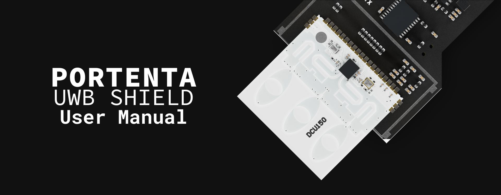
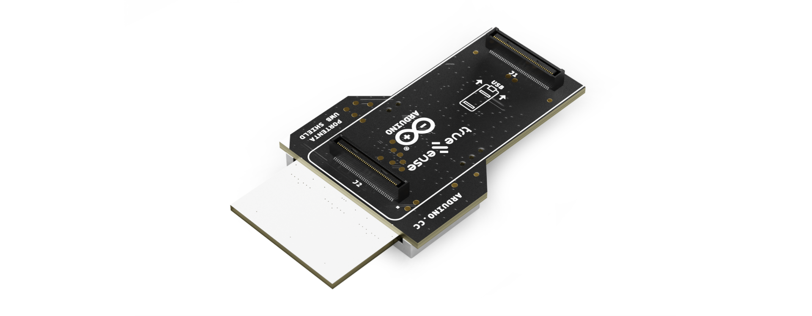
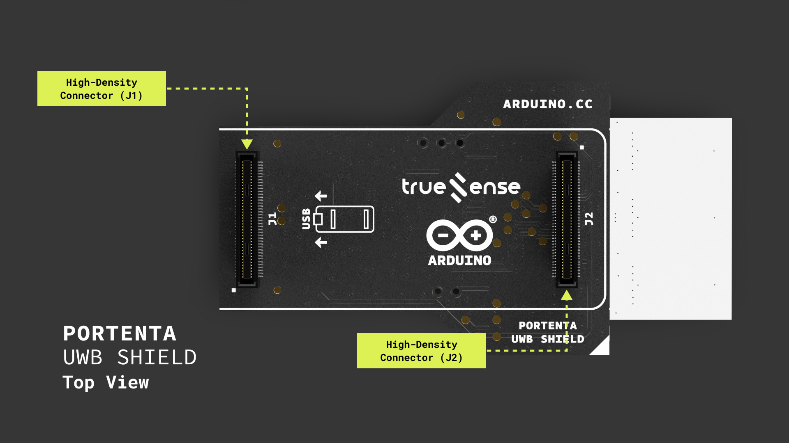
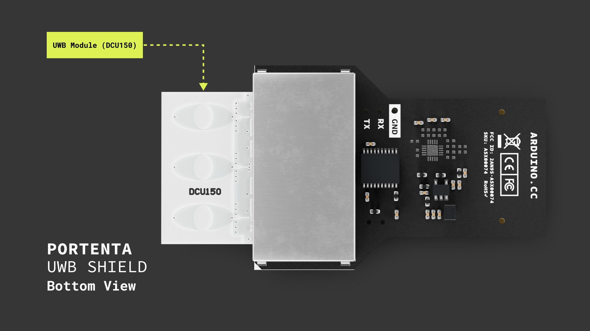
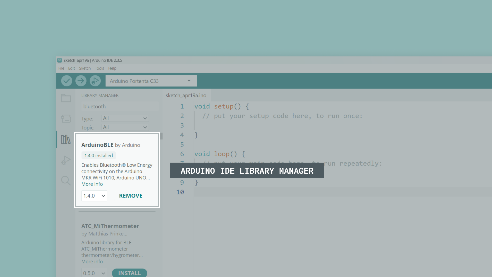
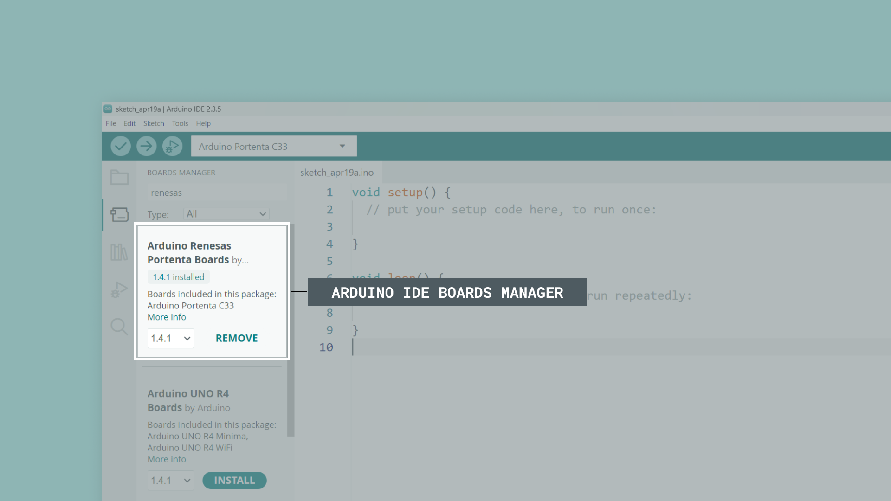
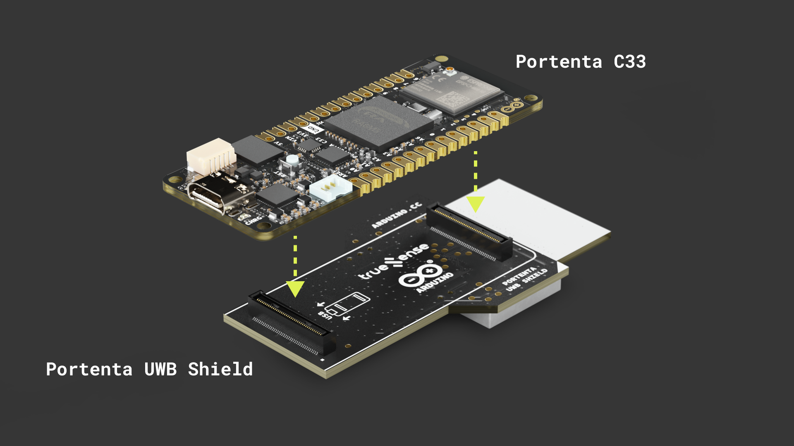
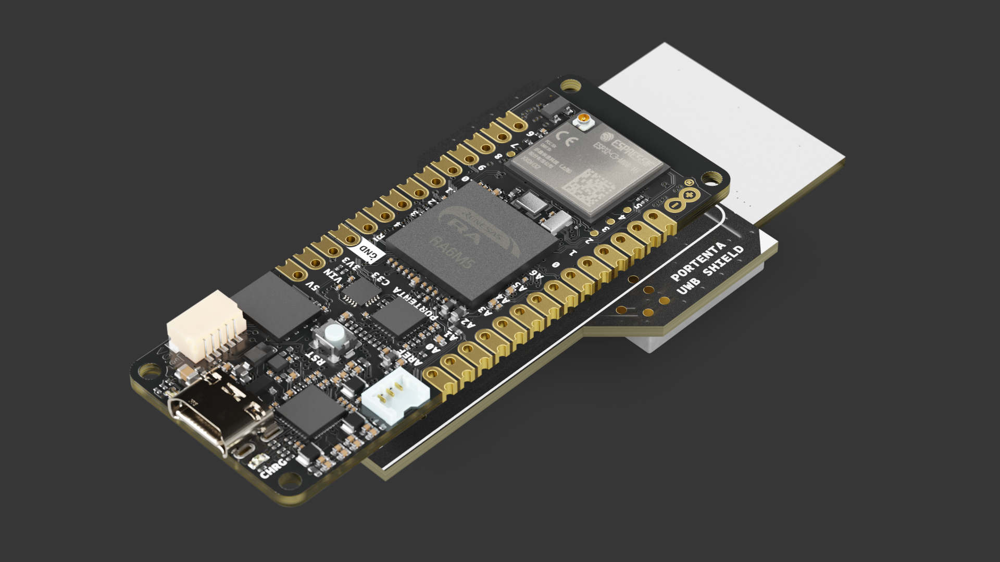

This user manual provides a comprehensive overview of the Portenta UWB Shield, highlighting its hardware and software elements. With it, you will learn how to set up, configure, and use all the main features of the Portenta UWB Shield.



## Hardware and Software Requirements

### Hardware Requirements

- [Portenta UWB Shield (SKU: ASX00074)](https://store.arduino.cc/products/portenta-uwb-shield) (x1)
- [Portenta C33 (SKU: ABX00074)](https://store.arduino.cc/products/portenta-c33) (x1)
- [Arduino Stella (SKU: ABX00131)](https://store.arduino.cc/products/arduino-stella) (x1)
- [USB-C® cable (SKU: TPX00094)](https://store.arduino.cc/products/usb-cable2in1-type-c) (x2)

### Software Requirements

- [Arduino IDE 2.0+](https://www.arduino.cc/en/software)
- [`ardUWBSr150` library](https://github.com/arduino-libraries/ardUWBSr150) (designed for the Portenta UWB Shield)
- [`ardUWBSr040` library](https://github.com/arduino-libraries/ardUWBSr040) (designed for the Arduino Stella)
- [`ArduinoBLE` library](https://github.com/arduino/ArduinoBLE) 
- [Arduino Renesas Portenta Boards core](https://github.com/arduino/ArduinoCore-renesas) (required to work with the Portenta C33 board)

***The Portenta UWB Shield is not intended as a standalone device but as a shield to work alongside a Portenta family board. In this user manual, we will use the Portenta C33 as the main board and show how to use the Portenta UWB Shield with it.***

## Portenta UWB Shield Overview

Enhance your positioning and real-time location capabilities with the Portenta UWB Shield. Based on the Truesense DCU150 module, this versatile Ultra-Wideband (UWB) communication solution integrates with the Portenta C33 board via its High-Density connectors and functions as a base station for two-way ranging and real-time location services (RTLS).



The Portenta UWB Shield incorporates the NXP® Trimension™ SR150 UWB integrated circuit (IC) within the DCU150 module, three embedded PCB antennas, onboard power management, clock control, filters and peripheral components. With +1.8 to +3.3 VDC level shifters and dual High-Density board-to-board connectors, it plugs directly into the Portenta C33 board, making it an excellent choice for projects that require precise positioning and real-time location tracking.

### Understanding UWB Technology

Ultra-Wideband (UWB) is a radio technology that uses very low energy levels for short-range, high-bandwidth communications over a large portion of the radio spectrum. Unlike traditional narrowband radio systems like Bluetooth® or Wi-Fi®, which operate in specific frequency bands, UWB transmits across a wide range of frequency bands (typically 500 MHz or more), allowing for greater precision in location tracking and higher data throughput.

#### UWB vs. Traditional Narrowband Technologies

The fundamental difference between UWB and traditional wireless technologies (Wi-Fi, Bluetooth, Zigbee® and Cellular) lies in their transmission methods:

|   **Feature**  |   **Traditional Narrowband Radio**   |  **Ultra-Wideband Impulse Radio**  |
|:--------------:|:------------------------------------:|:----------------------------------:|
| Transmit Power |         Higher transmit power        |        Lower transmit power        |
| Initialization |      Slow startup/initialization     |     Fast startup/initialization    |
|     Latency    |             High latency             |          Very low latency          |
|     Ranging    | Poor ranging (signal strength based) | Excellent ranging (time of flight) |
|    Multipath   |       Poor multipath robustness      |   Very good multipath robustness   |

Traditional narrowband systems use frequency or amplitude modulation to send data, requiring a reference carrier frequency between the transmitter and the receiver. This slows down the initialization process and restricts data transmission speed. UWB, in contrast, uses impulse radio technology. This technology consists of short pulses of energy (typically less than 5 nanoseconds) spread across a wide frequency band, allowing quick link initialization and extremely fast data transmission.

#### Key Characteristics of UWB

- **High precision**: UWB can determine the relative position of devices with centimeter-level accuracy (typically 5-10 cm), far more precise than GPS (meters), Bluetooth (1-3 meters) or Wi-Fi (2-15 meters).
- **Low-power consumption**: Despite its high data rates, UWB consumes very little power, making it suitable for battery-operated devices and long-term deployments.
- **Short range**: Typically effective within 10-30 meters, making it ideal for indoor positioning applications where GPS signals are weak or unavailable.
- **Strong security**: The unique physical layer characteristics of UWB, including its wide bandwidth and low power spectral density, make it more resistant to jamming, eavesdropping, and relay attacks compared to other wireless technologies.
- **Immunity to multipath fading**: The wide bandwidth of UWB signals makes them highly resistant to multipath interference, where signals bounce off surfaces and create echoes.
- **Coexistence with other standards**: Due to its low output spectral power, UWB can operate alongside other wireless technologies without causing interference—other radio systems interpret UWB signals simply as background noise.

#### Spectrum and Frequencies

UWB operates in specific frequency bands regulated by telecommunications authorities worldwide. The Portenta UWB Shield specifically uses channels in the 6.0 to 8.5 GHz range (channels CH5 and CH9), allowing for high bandwidth communication while minimizing interference with other wireless technologies. In general, UWB can operate in the 3.1-10.6 GHz range, with channel widths of 500 MHz or greater.

#### How UWB Technology Works

UWB primarily uses a technique called "Time of Flight" (ToF) or "Time Difference of Arrival" (TDoA) to determine the distance between UWB-enabled devices with extraordinary precision. In a nutshell, this technique consists of the following steps:

1. An UWB transmitter sends a signal with a precise timestamp.
2. An UWB receiver detects the signal and calculates the time it took to arrive.
3. Since radio waves travel at the speed of light (approximately 30 cm per nanosecond), the system can calculate the distance with high precision.

For even greater accuracy, UWB can use the "Two-Way Ranging" (TWR) technique, where devices exchange several messages to account for clock synchronization issues. In a nutshell, this technique consists of the following steps:

1. Device A sends a message to device B and records the time (T1).
2. Device B receives the message and sends a response after a known delay.
3. Device A receives the response and records the time (T2).
4. The round-trip time, minus processing delays, determines the distance.

The Portenta UWB Shield goes beyond basic distance measurements by supporting Angle of Arrival (AoA) capability. This enhances positioning by not only determining distance but also calculating the angle from which a signal arrives, enabling more accurate 2D or 3D positioning. With multiple UWB devices, a full positioning system can triangulate exact locations in space.

#### Low Latency Advantage

The impulse radio technology of UWB provides an inherent advantage in terms of latency. Since each pulse is extremely short (5 nanoseconds or less), the data latency is very low. Narrowband systems must modulate their carrier signals more slowly to maintain their frequency allocation, resulting in longer data latency and startup times.

In UWB systems, there's no need to establish a stable carrier signal for the receiver to lock onto, allowing data transmission to start immediately, representing a significant advantage for time-sensitive applications.

#### UWB System Components

In an UWB positioning system, devices typically operate in one of two roles:

- **Anchors**: Fixed-position devices (like the Portenta UWB Shield with a Portenta C33) that provide reference points for the positioning system. A minimum of three anchors is typically needed for 2D positioning and four for 3D positioning.
- **Tags**: Mobile devices that communicate with anchors to determine their position in space. Tags can be standalone devices like the Arduino Stella or integrated into smartphones, wearables, or other IoT devices.

#### Applications of UWB Technology

UWB's unique combination of precision, low latency, and security opens up numerous applications:

- **Asset tracking**: Monitor the location of valuable items in warehouses, hospitals, or construction sites with centimeter-level accuracy.
- **Secure access**: Implement contactless entry systems that unlock only when an authorized device is in proximity, with resistance to relay attacks that plague other wireless technologies.
- **Precision navigation**: Guide robots, vehicles, or drones in environments where GPS is unavailable, such as indoor spaces or underground facilities.
- **Social distancing**: Measure precise distances between individuals in workplaces or public venues to maintain safe separation.
- **Smart homes**: Enable context-aware automation based on the precise location of people within a space.
- **Augmented reality**: Provide accurate spatial mapping and tracking for immersive experiences.
- **Industrial safety**: Create geofencing solutions that can trigger alerts or machinery shutdowns when personnel enter dangerous areas.
- **High-speed data transfer**: Leverage UWB's high data rates for wireless communications in personal area networks (PANs), outperforming Bluetooth and Zigbee for short-range data transmission.

### Portenta UWB Shield Architecture Overview

The Portenta UWB Shield features a secure, certified and durable design that suits various applications, such as smart logistics, precision proximity sensing, high precision RTLS, industrial applications, access control and secure payments.

The top view of the Portenta UWB Shield is shown in the image below:



The bottom view of the Portenta UWB Shield is shown in the image below:



Here's an overview of the shield's main components shown in the images:

- **UWB module**: At the heart of the Portenta UWB Shield is the DCU150 module from Truesense, which incorporates the NXP Trimension SR150 UWB IC. This module supports UWB channels CH5 and CH9 in the 6.0-8.5 GHz range and complies with the IEEE 802.15.4 HRP UWB standard.
- **UWB antennas**: The DCU150 module features three embedded PCB antennas for optimal signal reception and transmission.
- **Processor**: The DCU150 module features an Arm® Cortex®-M33 32-bit processor running at 125 MHz with 128 kB code RAM, 128 kB data RAM, 128 kB ROM, TrustZone® technology and S-DMA for security.
- **DSP**: The DCU150 module features an onboard programmable DSP (BSP32 CoolFlux DSP core) with 32 kB RAM for code and 2x 16kB RAM for data enhances signal processing capabilities.
- **Level shifters**: The shield includes +1.8 to +3.3 VDC level shifters for compatible communication with Portenta family boards.
- **High-Density connectors**: Dual High-Density board-to-board connectors allow the shield to plug directly into the Portenta family boards.
- **Shielding can**: Located on top of the DCU150 module, it enhances anti-interference performance.

### Board Libraries

The Portenta UWB Shield and the Arduino Stella use different libraries and board cores due to their different microcontrollers and onboard UWB modules:

#### Portenta UWB Shield Library

The [`ardUWBSr150` library](https://github.com/arduino-libraries/ardUWBSr150) contains an application programming interface (API) to read data from the Portenta UWB Shield and control its parameters and behavior. This library is designed to work with the DCU150 module on the shield and supports the following:

- One-way ranging (Time Difference of Arrival - TDoA) and two-way ranging (TWR).
- Angle of Arrival (AoA) measurement for 2D and 3D positioning.
- SPI and GPIO communication with the host board through dedicated level translators.

***The [Arduino Renesas Portenta Boards core](https://github.com/arduino/ArduinoCore-renesas) is required to work with the Portenta C33 board that hosts the UWB Shield in this User Manual.***

#### Arduino Stella Library

For two-way ranging experiments between the Portenta UWB Shield and Arduino Stella, you'll also need the [`ardUWBSr040` library](https://github.com/arduino-libraries/ardUWBSr040). This library provides similar functionality but is specifically optimized for the DCU040 module in the Stella board.

***The Arduino mbed OS Boards core is required to work with Stella's nRF52840 microcontroller.***

#### Bluetooth Communication

For examples that use Bluetooth Low Energy (BLE) communication (like the Nearby Demo), you'll also need the [`ArduinoBLE` library](https://github.com/arduino/ArduinoBLE). This library enables BLE functionality for device discovery and initial connection setup before UWB ranging begins.

#### Installing the Libraries and Board Cores

To install the required libraries:

1. Navigate to `Tools > Manage libraries...` or click the **Library Manager** icon in the left tab of the Arduino IDE.
2. In the Library Manager tab, search for the library name (`ardUWBSr150`, `ardUWBSr040`, or `ArduinoBLE`).
3. Click "Install" to install the latest version of each library.



To install the required board cores:

1. Navigate to `Tools > Board > Boards Manager...`
2. For the Portenta C33: Search for "Arduino Renesas Boards" and install the latest version.
3. For the Arduino Stella (if using two-way ranging examples): Search for `Arduino mbed OS Boards` and install the latest version.



***<strong>Important note:</strong> Make sure to install both the appropriate library and board core for your specific hardware. The Portenta UWB Shield with Portenta C33 requires the `ardUWBSr150` library and Arduino Renesas Boards core. For examples involving Arduino Stella, you'll need the `ardUWBSr040` library and Arduino mbed OS Boards core. For examples involving BLE communication, both devices will need the `ArduinoBLE` library installed.***

### Pinout

The full pinout is available and downloadable as PDF from the link below:

- [Portenta UWB Shield pinout](https://docs.arduino.cc/resources/pinouts/ASX00074-full-pinout.pdf)

### Datasheet

The complete datasheet is available and downloadable as PDF from the link below:

- [Portenta UWB Shield datasheet](https://docs.arduino.cc/resources/datasheets/ASX00074-datasheet.pdf)

### Schematics

The complete schematics are available and downloadable as PDF from the link below:

- [Portenta UWB Shield schematics](https://docs.arduino.cc/resources/schematics/ASX00074-schematics.pdf)

### STEP Files 

The complete STEP files are available and downloadable from the link below:

- [Portenta UWB Shield STEP files](../../downloads/ASX00074-step.zip)

## First Use

### Unboxing the Product

When you open the box of the Portenta UWB Shield, you will find the shield itself featuring two High-Density connectors designed to interface with compatible boards from the Portenta family. The shield also includes three pins for UART communications, which can be used primarily for debugging purposes.

**It's important to note that the Portenta UWB Shield is not designed to function as a standalone device. It works as a shield that must be paired with a compatible Arduino board from the Portenta family.**

Throughout this user manual, we will use the Portenta C33 as the main (host) board and the Portenta UWB Shield as the client board, connected via the High-Density pins.

***When properly configured, the combined Portenta C33 and Portenta UWB Shield function as a <strong>UWB anchor node</strong> in a positioning system. This anchor can receive signals from UWB tags (mobile devices with UWB capability), precisely calculate their distance using time-of-flight principles, and determine their exact position in space when used in a network of anchors.***

### Connecting the Shield

Connect the Portenta UWB Shield directly to a Portenta C33 board through its High-Density connectors as shown in the image below:



To connect the shield to the board, align first the shield's High-Density connectors with those on the Portenta C33 board. Then, gently press the shield onto the Portenta C33 until it is firmly seated as shown in the image below:



***<strong>Important note:</strong> Ensure that the Portenta C33 is powered off before connecting or disconnecting the shield to prevent potential damage to either of the boards.***

### Powering the Shield

The Portenta UWB Shield is powered exclusively through the `VCC` pins (+3.3 VDC) of its High-Density Connectors. These connectors are designed to be used with boards from the Portenta family, such as the Portenta C33 board. The power is supplied directly from the connected Portenta family board, which acts as the power source for the Portenta UWB Shield.

***<strong>Important note:</strong> The Portenta UWB Shield does not have an independent power input. It receives power only through the High-Density connectors when properly connected to a Portenta C33 board. Additionally, if you plan to use Bluetooth Low Energy (BLE) functionality, make sure to connect an antenna to the Wi-Fi/Bluetooth module of the Portenta C33 for optimal wireless performance.***

### Nearby World Example

Let's use the Portenta UWB Shield with the Portenta C33 to create a real-time distance measurement system using UWB technology. We will implement what we call the `Nearby World` example (based on the `NearbyDemo` sketch), which serves as our `Hello World` sketch for UWB technology. This example will verify the Portenta UWB Shield's connection to the host board, the host board's connection to the Arduino IDE and that the `ardUWBSr150` library and both the board and the shield are working as expected.

***This example sketch leverages Apple's Nearby Interaction protocol and similar UWB implementations on Android devices to establish a communication channel between the Portenta UWB Shield and a UWB-enabled smartphone, allowing precise distance and angle measurements.***

#### How It Works

The `Nearby World` example demonstrates the core functionality of UWB technology through a simple example sketch that can be described in the following key steps:

1. **BLE connection setup**: The Portenta UWB Shield establishes a Bluetooth Low Energy (BLE) connection with a compatible smartphone app.
2. **Configuration exchange**: The BLE connection is used to exchange necessary UWB configuration parameters.
3. **UWB ranging**: Once configured, the actual UWB ranging session begins, providing precise distance measurements.
4. **Real-time feedback**: Distance data is continuously updated and can be viewed both on the IDE's Serial Monitor and on the smartphone app.

This process demonstrates the working principle of many UWB applications, where BLE is used primarily for discovery and configuration, while UWB handles the precise ranging.

#### Uploading the Sketch

First, connect the Portenta UWB Shield to the Portenta C33 as described in the [Connecting the Shield section](#connecting-the-shield). Now, connect the Portenta C33 to your computer using a USB-C cable, open the Arduino IDE and connect the board to it.

***If you are new to the Portenta C33, please refer to the board's [user manual](https://docs.arduino.cc/tutorials/portenta-c33/user-manual/) for more detailed information.***

Copy and paste the example sketch below into a new sketch in the Arduino IDE:

```arduino 
/**
  Nearby Demo Example for Portenta UWB Shield
  Name: portenta_uwb_nearby.ino
  Purpose: This sketch demonstrates how to use the Portenta UWB Shield
  to measure distance between the shield and a UWB-enabled smartphone.
  
  @author Pierpaolo Lento from Truesense, modified by the Arduino Product Experience Team
  @version 1.0 15/04/25
*/

// Include required libraries
#include <ArduinoBLE.h>
#include <ardUWBSr150.h>

// Track the number of connected BLE clients
uint16_t numConnected = 0;

/**
  Processes ranging data received from UWB communication.
  @param rangingData Reference to UWB ranging data object.
*/
void rangingHandler(UWBRangingData &rangingData) {
  Serial.print("- GOT RANGING DATA - Type: ");
  Serial.println(rangingData.measureType());
  
  // Nearby interaction uses Double-sided Two-way Ranging method
  if(rangingData.measureType()==MEASUREMENT_TYPE_TWOWAY) {
    // Get the TWR (Two-Way Ranging) measurements
    RangingMeasures twr = rangingData.twoWayRangingMeasure();
    
    // Loop through all available measurements
    for(int j=0; j<rangingData.available(); j++) {
      // Only process valid measurements
      if(twr[j].status==0 && twr[j].distance!=0xFFFF) {
        // Display the distance measurement in millimeters
        Serial.print("- Distance: ");
        Serial.println(twr[j].distance);
      }
    }
  }
}

/**
  Handles new BLE client connection events.
  @param dev The connecting BLE device.
*/
void clientConnected(BLEDevice dev) {
  // Initialize UWB stack on first connection
  if (numConnected == 0) {
    // Start the UWB engine
    UWB.begin(); 
  }
  // Increment connected clients counter
  numConnected++;
}

/**
  Handles BLE client disconnection events.
  @param dev The disconnecting BLE device.
*/
void clientDisconnected(BLEDevice dev) {
  // Decrement connected clients counter
  numConnected--;
  // Shut down UWB when no clients are connected
  if(numConnected==0) {
    UWB.end();
  }
}

/**
  Handles UWB session start events.
  @param dev The BLE device starting the session.
*/
void sessionStarted(BLEDevice dev) {
  Serial.println("- Session started!");
}

/**
  Handles UWB session termination events.
  @param dev The BLE device ending the session.
*/
void sessionStopped(BLEDevice dev) {
  Serial.println("- Session stopped!");
}

void setup() {
  // Initialize serial communication at 115200 bits per second
  Serial.begin(115200);
  
  // On the Portenta C33, initialize the onboard RGB LED
  #if defined(ARDUINO_PORTENTA_C33)
    pinMode(LEDR, OUTPUT);
    digitalWrite(LEDR, LOW);
  #endif

  Serial.println("- Nearby interaction app start...");
  
  // Register callback handlers
  UWB.registerRangingCallback(rangingHandler);
  UWBNearbySessionManager.onConnect(clientConnected);
  UWBNearbySessionManager.onDisconnect(clientDisconnected);
  UWBNearbySessionManager.onSessionStart(sessionStarted);
  UWBNearbySessionManager.onSessionStop(sessionStopped);
  
  // Initialize BLE services and start advertising as "Portenta UWB Shield"
  UWBNearbySessionManager.begin("Portenta UWB Shield");
}

void loop() {
  // Small delay to prevent CPU overload
  delay(100);
  
  // Process BLE events
  UWBNearbySessionManager.poll();
}
```

To upload the sketch to the Portenta C33, click the Verify button to compile the sketch and check for errors, then click the Upload button to program the device with the sketch.

Once the sketch is uploaded, open the Serial Monitor by clicking on the icon in the top right corner of the Arduino IDE. You should see the message `- Nearby interaction app start...` in the IDE's Serial Monitor.

#### Try It Yourself

To complete the test, you will need an UWB-enabled smartphone with one of the compatible applications installed:

**For iPhone (iPhone 11 or newer with UWB capability):**

- [NXP Trimensions AR](https://apps.apple.com/us/app/nxp-trimensions-ar/id1606143205)
- [Qorvo Nearby Interaction](https://apps.apple.com/us/app/qorvo-nearby-interaction/id1615369084)

**For Android (UWB-enabled Android devices):**

- [Truesense Android demo](https://github.com/Truesense-it/TSUwbDemo-Android) (recommended)
- [NXP Android demo](https://github.com/nxp-uwb/UWBJetpackExample)

***<strong>Important note for Android devices:</strong> It is recommended to enable Developer Mode to ensure proper UWB functionality. To activate Developer Mode, go to Settings > About phone and tap "Build number" seven times. Some UWB features may require additional developer permissions that can be granted through this menu.***

Install one of these apps on your smartphone and follow these steps:

1. Open the app on your smartphone.
2. Look for a device named `Portenta UWB Shield` in the app's device list.
3. Connect to the device.
4. Once connected, the app will begin an UWB ranging session.
5. Move your phone closer to and further from the Portenta UWB Shield.

You should see the distance measurements updating in real-time both on your smartphone app and in the IDE's Serial Monitor. The distances are shown in millimeters, providing centimeter-level accuracy characteristic of the UWB technology.

## NearbyDemo Example

### About the NearbyDemo Example

The NearbyDemo example sketch is a fundamental demonstration of the Portenta UWB Shield's core capabilities. This example showcases how to implement a direct distance measurement system between a stationary UWB device (the Portenta UWB Shield, acting as an UWB anchor) and a mobile UWB device (the UWB-enabled smartphone, acting as an UWB tag).

This example sketch demonstrates the following:

- **Hybrid communication protocol:** It shows the integration of BLE for device discovery and configuration with UWB for precise distance measurements, a common pattern in production UWB applications.
- **Standards compatibility:** The implementation is compatible with Apple's Nearby Interaction API and similar Android standards, demonstrating how the Arduino ecosystem can interact with mainstream consumer devices.
- **Foundation for advanced applications:**: The ranging capability demonstrated is the building block for more sophisticated applications such as indoor positioning systems, geofencing, secure access and proximity-based automation.

Some of the real-life applications for this example sketch are the following:

- **Industrial automation:** Creating safety zones around machinery that can detect when workers approach with centimeter precision.
- **Smart buildings:** Enabling location-aware services within facilities where GPS is unavailable.
- **Healthcare:** Tracking the movement of patients, staff and equipment with high accuracy.
- **Retail:** Implementing contactless payment systems with a higher degree of security than current NFC solutions.
- **Consumer electronics:** Enabling precise "Find My Device" features and spatial awareness between gadgets.

Now, let's take a closer look at the sketch:

```arduino
/**
  Nearby Demo Example for Portenta UWB Shield
  Name: portenta_uwb_nearby.ino
  Purpose: This sketch demonstrates how to use the Portenta UWB Shield
  to measure distance between the shield and an UWB-enabled smartphone.
  
  @author Pierpaolo Lento from Truesense, modified by the Arduino Product Experience Team
  @version 1.0 15/04/25
*/

// Include required libraries
#include <ArduinoBLE.h>
#include <ardUWBSr150.h>

// Track the number of connected BLE clients
uint16_t numConnected = 0;

/**
  Processes ranging data received from UWB communication.
  @param rangingData Reference to UWB ranging data object.
*/
void rangingHandler(UWBRangingData &rangingData) {
  Serial.print("- GOT RANGING DATA - Type: ");
  Serial.println(rangingData.measureType());
  
  // Nearby interaction uses Double-sided Two-way Ranging method
  if(rangingData.measureType()==MEASUREMENT_TYPE_TWOWAY) {
    // Get the TWR (Two-Way Ranging) measurements
    RangingMeasures twr = rangingData.twoWayRangingMeasure();
    
    // Loop through all available measurements
    for(int j=0; j<rangingData.available(); j++) {
      // Only process valid measurements
      if(twr[j].status==0 && twr[j].distance!=0xFFFF) {
        // Display the distance measurement in millimeters
        Serial.print("- Distance: ");
        Serial.println(twr[j].distance);
      }
    }
  }
}

/**
  Handles new BLE client connection events.
  @param dev The connecting BLE device.
*/
void clientConnected(BLEDevice dev) {
  // Initialize UWB stack on first connection
  if (numConnected == 0) {
    // Start the UWB engine
    UWB.begin(); 
  }
  // Increment connected clients counter
  numConnected++;
}

/**
  Handles BLE client disconnection events.
  @param dev The disconnecting BLE device.
*/
void clientDisconnected(BLEDevice dev) {
  // Decrement connected clients counter
  numConnected--;
  // Shut down UWB when no clients are connected
  if(numConnected==0) {
    UWB.end();
  }
}

/**
  Handles UWB session start events.
  @param dev The BLE device starting the session.
*/
void sessionStarted(BLEDevice dev) {
  Serial.println("- Session started!");
}

/**
  Handles UWB session termination events.
  @param dev The BLE device ending the session.
*/
void sessionStopped(BLEDevice dev) {
  Serial.println("- Session stopped!");
}

void setup() {
  // Initialize serial communication at 115200 bits per second
  Serial.begin(115200);
  
  // On the Portenta C33, initialize the onboard RGB LED
  #if defined(ARDUINO_PORTENTA_C33)
    pinMode(LEDR, OUTPUT);
    digitalWrite(LEDR, LOW);
  #endif

  Serial.println("- Nearby interaction app start...");
  
  // Register callback handlers
  UWB.registerRangingCallback(rangingHandler);
  UWBNearbySessionManager.onConnect(clientConnected);
  UWBNearbySessionManager.onDisconnect(clientDisconnected);
  UWBNearbySessionManager.onSessionStart(sessionStarted);
  UWBNearbySessionManager.onSessionStop(sessionStopped);
  
  // Initialize BLE services and start advertising as "Portenta UWB Shield"
  UWBNearbySessionManager.begin("Portenta UWB Shield");
}

void loop() {
  // Small delay to prevent CPU overload
  delay(100);
  
  // Process BLE events
  UWBNearbySessionManager.poll();
}
```

### Key Components of the Example Sketch

The `NearbyDemo` code follows an event-driven architecture that employs callback functions to handle various events in the UWB communication process. Here is an explanation of the most important parts of the example sketch:

1. **Libraries and Global Variables**
   
```arduino
#include <ArduinoBLE.h>
#include <ardUWBSr150.h>

uint16_t numConnected = 0;
```

The code includes two essential libraries:

- `ArduinoBLE`: Provides Bluetooth Low Energy (BLE) functionality for device discovery and initial connection.
- `ardUWBSr150`: The core library that enables interaction with the UWB hardware on the Portenta UWB Shield.

The `numConnected` variable tracks how many BLE clients are currently connected to the Portenta UWB Shield.

2. **Ranging Data Handler**

```arduino
void rangingHandler(UWBRangingData &rangingData) {
  // ...
  if(rangingData.measureType()==MEASUREMENT_TYPE_TWOWAY) {
    RangingMeasures twr = rangingData.twoWayRangingMeasure();
    // ...
    if(twr[j].status==0 && twr[j].distance!=0xFFFF) {
      Serial.print("- Distance: ");
      Serial.println(twr[j].distance);
    }
  }
}
```

This callback function is the heart of the UWB functionality:

- It's triggered whenever new ranging data is received from the UWB subsystem.
- It checks if the measurement type is Two-Way Ranging (TWR).
- It validates the measurement (`status = 0` indicates a valid measurement, while `distance = 0xFFFF` is a reserved value indicating an invalid distance).
- It extracts the distance measurements in millimeters and prints them to the IDE's Serial Monitor.

1. **Connection Management**

```arduino
void clientConnected(BLEDevice dev) {
  if (numConnected == 0) {
    UWB.begin(); 
  }
  numConnected++;
}

void clientDisconnected(BLEDevice dev) {
  numConnected--;
  if(numConnected==0) {
    UWB.end();
  }
}
```

These functions handle BLE connection events:

- `clientConnected` initializes the UWB subsystem when the first client connects.
- `clientDisconnected` shuts down the UWB subsystem when no clients are connected.

This approach saves power by only running the shield's UWB hardware when it's actually needed.

4. **Session Management**

```arduino
void sessionStarted(BLEDevice dev) {
  Serial.println("- Session started!");
}

void sessionStopped(BLEDevice dev) {
  Serial.println("- Session stopped!");
}
```

These callbacks track the UWB session state:

- A session begins after the BLE connection is established and the UWB configuration is exchanged.
- A session ends when the UWB communication is terminated, either by the client disconnecting or other factors.

5. **Setup and Initialization**

```arduino
void setup() {
  // ...
  UWB.registerRangingCallback(rangingHandler);
  UWBNearbySessionManager.onConnect(clientConnected);
  UWBNearbySessionManager.onDisconnect(clientDisconnected);
  UWBNearbySessionManager.onSessionStart(sessionStarted);
  UWBNearbySessionManager.onSessionStop(sessionStopped);
  
  UWBNearbySessionManager.begin("Portenta UWB Shield");
}
```

The setup function:

- Registers all the callback functions with the UWB subsystem.
- Initializes the BLE advertising with the name `Portenta UWB Shield`. This name is what will appear in the smartphone app's device list.

6. **Main Loop**

```arduino
void loop() {
  delay(100);
  UWBNearbySessionManager.poll();
}
```

The main loop is quite simple:

- It calls the `UWBNearbySessionManager.poll()` function to process BLE events.
- The actual UWB ranging happens asynchronously through the callback system.
  
This event-driven architecture allows the system to respond quickly to UWB and BLE events without blocking the main program flow.

### Extending the Example Sketch

The `NearbyDemo` example sketch provides a great foundation that you can build upon for more complex projects. Some possible extensions of this sketch include the following:

- **Adding visual feedback:** Using LEDs or displays to indicate distance ranges.
- **Implementing proximity alerts:** Triggering actions when devices come within a certain distance.
- **Data logging:** Recording distance measurements for analysis and visualization.
- **Integrating with other sensors:** Combining UWB data with other environmental sensors for context-aware applications.

***<strong>Note:</strong> If you want to try this example yourself, please follow the same steps described in the [Nearby World Example](#nearby-world-example) section. The process for uploading the sketch and testing it with a smartphone is the same.***

## Two-Way Ranging Example

### About the Two-Way Ranging Example

The Two-Way Ranging example demonstrates direct UWB communication between two Arduino devices: the Portenta UWB Shield (acting as a Controlee/Responder) and the Arduino Stella (acting as a Controller/Initiator). This example showcases the fundamental distance measurement capabilities of UWB technology in a dedicated device-to-device setup without requiring external UWB-enabled consumer devices such as smartphones.

***<strong>Note:</strong> In UWB communication, the terms "Controller" and "Controlee" refer to specific roles within a ranging session. A Controller (also called an Initiator) is the device that initiates and controls the ranging process, sending the initial signal and managing the timing of exchanges. A Controlee (also called a Responder) is the device that responds to the Controller's signals. These terms are used interchangeably in UWB documentation: Controller/Initiator and Controlee/Responder refer to the same roles. In positioning systems, Controllers/Initiators often correspond to mobile "tags" while Controlees/Responders often serve as stationary "anchors".***

This example demonstrates the following:

- **Direct device-to-device communication:** Unlike the `NearbyDemo` example, which requires a smartphone, this example establishes direct UWB communication between two UWB-enabled Arduino devices.
- **Controller-Controlee architecture:** It shows how to configure one device as a Controller (initiator of the ranging) and another as a Controlee (responder).
- **Double-Sided Two-Way Ranging (DS-TWR):** This technique provides higher accuracy in distance measurements by accounting for clock drift between devices.
- **Simple MAC addressing:** The implementation shows how to use short MAC addresses for device identification in UWB networks.

Some of the real-life applications for this example include:

- **Multi-node positioning systems:** Creating networks of UWB nodes for advanced indoor positioning.
- **Robot navigation:** Enabling precise distance measurements between robots or between robots and fixed stations.
- **Asset tracking:** Building custom tracking solutions with multiple Arduino-based UWB anchors.
- **Proximity detection systems:** Creating safety systems that can detect precise distances between industrial equipment and personnel.
- **Interactive installations:** Enabling position-based interactive exhibits in museums or public spaces.

Here's the code for the Portenta UWB Shield, which acts as the Controlee (Responder) in this Two-Way Ranging scenario:

```arduino
/**
  Two-Way Ranging Controlee Example for Portenta UWB Shield
  Name: portenta_uwb_twr_controlee.ino
  Purpose: This sketch configures the Portenta UWB Shield as a Controlee (Responder)
  for Two-Way Ranging with an Arduino Stella configured as Controller.
  
  @author Pierpaolo Lento from Truesense, modified by the Arduino Product Experience Team
  @version 1.0 15/04/25
*/

// Include required UWB library
#include <ardUWBSr150.h>

/**
  Processes ranging data received from UWB communication.
  @param rangingData Reference to UWB ranging data object.
*/
void rangingHandler(UWBRangingData &rangingData) {
  Serial.print("- GOT RANGING DATA - Type: ");
  Serial.println(rangingData.measureType());
  if(rangingData.measureType()==MEASUREMENT_TYPE_TWOWAY) {
    // Get the TWR (Two-Way Ranging) measurements
    RangingMeasures twr=rangingData.twoWayRangingMeasure();
    
    // Loop through all available measurements
    for(int j=0;j<rangingData.available();j++) {
      // Only process valid measurements
      if(twr[j].status==0 && twr[j].distance!=0xFFFF) {
        // Display the distance measurement in millimeters
        Serial.print("- Distance: ");
        Serial.println(twr[j].distance);  
      }
    }
  }
}

void setup() {
  // Initialize serial communication at 115200 bits per second
  Serial.begin(115200);

  #if defined(ARDUINO_PORTENTA_C33)
    // Only the Portenta C33 has an RGB LED
    pinMode(LEDR, OUTPUT);
    digitalWrite(LEDR, LOW);
  #endif

  // Define MAC addresses for this device and the target
  // This device (Controlee) has address 0x2222
  // Target device (Controller) has address 0x1111
  uint8_t devAddr[]={0x22,0x22};
  uint8_t destination[]={0x11,0x11};
  UWBMacAddress srcAddr(UWBMacAddress::Size::SHORT,devAddr);
  UWBMacAddress dstAddr(UWBMacAddress::Size::SHORT,destination);
  
  // Register the callback and start UWB
  UWB.registerRangingCallback(rangingHandler);
  UWB.begin();
  Serial.println("- Starting UWB ...");

  // Wait until UWB stack is initialized
  while(UWB.state()!=0)
    delay(10);

  // Configure the UWB session
  Serial.println("- Starting session ...");
  UWBSession session1;
  session1.sessionID(0x11223344);
  session1.sessionType(UWBD_RANGING_SESSION);
    
  // Set application parameters
  if(!session1.appParams.addOrUpdateParam(UWB_SET_APP_PARAM_VALUE(NO_OF_CONTROLEES,1)))
    Serial.println("- Could not add to app params!");
  if(!session1.appParams.destinationMacAddr(dstAddr))
    Serial.println("- Could not add to app params!");
    
  // Apply default values for measurement repetition rate and antenna config
  session1.applyDefaults();

  // Configure ranging parameters
  session1.rangingParams.deviceMacAddr(srcAddr);
  session1.rangingParams.deviceRole(kUWB_DeviceRole_Responder);
  session1.rangingParams.deviceType(kUWB_DeviceType_Controlee);
  session1.rangingParams.multiNodeMode(kUWB_MultiNodeMode_UniCast);
  session1.rangingParams.rangingRoundUsage(kUWB_RangingRoundUsage_DS_TWR);
  session1.rangingParams.scheduledMode(kUWB_ScheduledMode_TimeScheduled);
  
  // Add the session to the manager and start it
  UWBSessionManager.addSession(session1);
  session1.init();
  session1.start();
}

void loop() {
  // Toggle the LED to show the system is running
  #if defined(ARDUINO_PORTENTA_C33)
    // Only the Portenta C33 has an RGB LED
    digitalWrite(LEDR, !digitalRead(LEDR));
  #else
    Serial.println(millis());
  #endif
  
  // Small delay using FreeRTOS scheduler
  vTaskDelay(configTICK_RATE_HZ/4);
}
```

Here's the code for the Arduino Stella, which acts as the Controller (Initiator) in this Two-Way Ranging scenario:

```arduino
/**
  Two-Way Ranging Controller Example for Arduino Stella
  Name: stella_uwb_twr_controller.ino
  Purpose: This sketch configures the Arduino Stella as a Controller (Initiator)
  for Two-Way Ranging with a Portenta UWB Shield configured as Controlee.
  
  @author Pierpaolo Lento from Truesense, modified by the Arduino Product Experience Team
  @version 1.0 15/04/25
*/

// Include required UWB library
#include "ardUWBSr040.h"

/**
  Processes ranging data received from UWB communication.
  @param rangingData Reference to UWB ranging data object.
*/
void rangingHandler(UWBRangingData &rangingData) {
  Serial.print("- GOT RANGING DATA - Type: ");
  Serial.println(rangingData.measureType());
  if(rangingData.measureType()==MEASUREMENT_TYPE_TWOWAY) {
    // Get the TWR (Two-Way Ranging) measurements
    RangingMeasures twr=rangingData.twoWayRangingMeasure();
    
    // Loop through all available measurements
    for(int j=0;j<rangingData.available();j++) {
      // Only process valid measurements
      if(twr[j].status==0 && twr[j].distance!=0xFFFF) {
        // Display the distance measurement in millimeters
        Serial.print("- Distance: ");
        Serial.println(twr[j].distance);
      }
    }
  }
}

void setup() {
  // Initialize serial communication at 115200 bits per second
  Serial.begin(115200);
  
  // Define MAC addresses for this device and the target
  // This device (Controller) has address 0x1111
  // Target device (Controlee) has address 0x2222
  uint8_t devAddr[]={0x11,0x11};
  uint8_t destination[]={0x22,0x22};
  UWBMacAddress srcAddr(UWBMacAddress::Size::SHORT,devAddr);
  UWBMacAddress dstAddr(UWBMacAddress::Size::SHORT,destination);
  
  // Register the ranging notification handler before starting
  UWB.registerRangingCallback(rangingHandler);
  
  // Start the UWB stack
  UWB.begin();
  Serial.println("- Starting UWB ...");
  
  // Wait until the stack is initialized
  while(UWB.state()!=0)
    delay(10);
  
  // Setup and start the UWB session
  Serial.println("- Starting session ...");
  
  // Create a tracker with session ID 0x11223344
  // This automatically configures the device as Controller/Initiator
  UWBTracker myTracker(0x11223344,srcAddr,dstAddr);
  
  // Add the session to the manager
  UWBSessionManager.addSession(myTracker);
  
  // Initialize with default parameters
  myTracker.init();
  
  // Start the ranging session
  myTracker.start();
}

void loop() {
  // Simple delay, the ranging happens asynchronously via callbacks
  delay(1000);
}
```

### Key Components of the Example Sketch

The Two-Way Ranging example demonstrates a more direct approach to UWB communication compared to the `NearbyDemo`. Let's analyze the key components of both example sketches:

1. **Libraries and MAC Addressing**

Both devices use their respective UWB libraries:

- The Portenta UWB Shield uses `ardUWBSr150.h` (for the DCU150 module)
- The Stella uses ardUWBSr040.h (for the DCU040 module)

Both sketches configure MAC addresses for identification:

```arduino
// On Portenta UWB Shield
uint8_t devAddr[]={0x22,0x22};
uint8_t destination[]={0x11,0x11};

// On Arduino Stella
uint8_t devAddr[]={0x11,0x11};
uint8_t destination[]={0x22,0x22};
```

***<strong>Important note:</strong> Notice how the MAC addresses are reversed between the two devices; this is critical for proper communication. In UWB communication, each device must know both its own address (`devAddr`) and the address of the device it is communicating with (`destination`). The Portenta UWB Shield identifies itself as `0x2222` and expects to communicate with `0x1111`, while the Arduino Stella identifies itself as `0x1111` and expects to communicate with `0x2222`. If these addresses don't match correctly, the devices won't be able to establish a ranging session. The prefix `0x` indicates these are hexadecimal values, which is a common notation in programming for representing memory addresses and identifiers.***

The MAC addresses used in this example are short (2-byte) addresses for simplicity, but UWB also supports extended (8-byte) addressing for larger networks where unique identification is required. For basic two-device setups, these short addresses are enough, but for multi-node positioning systems, you may want to use extended addressing to avoid conflicts.

2. **Setup and Initialization**

The setup process for UWB communication differs between the two devices due to their different roles in the ranging session:

**Portenta UWB Shield (Controlee/Responder):**

```arduino
// Configure the UWB session
UWBSession session1;
session1.sessionID(0x11223344);  // Unique identifier for this session
session1.sessionType(UWBD_RANGING_SESSION);
    
// Set application parameters
if(!session1.appParams.addOrUpdateParam(UWB_SET_APP_PARAM_VALUE(NO_OF_CONTROLEES,1)))
  Serial.println("could not add to app params");
if(!session1.appParams.destinationMacAddr(dstAddr))
  Serial.println("could not add to app params");
    
// Apply default values for measurement repetition rate and antenna config
session1.applyDefaults();

// Configure ranging parameters
session1.rangingParams.deviceMacAddr(srcAddr);
session1.rangingParams.deviceRole(kUWB_DeviceRole_Responder);
session1.rangingParams.deviceType(kUWB_DeviceType_Controlee);
session1.rangingParams.multiNodeMode(kUWB_MultiNodeMode_UniCast);
session1.rangingParams.rangingRoundUsage(kUWB_RangingRoundUsage_DS_TWR);
session1.rangingParams.scheduledMode(kUWB_ScheduledMode_TimeScheduled);
  
// Add the session to the manager and start it
UWBSessionManager.addSession(session1);
session1.init();
session1.start();
```

**Arduino Stella (Controller/Initiator):**

```arduino
// Create a tracker with session ID 0x11223344
// This automatically configures the device as Controller/Initiator
UWBTracker myTracker(0x11223344,srcAddr,dstAddr);
  
// Add the session to the manager
UWBSessionManager.addSession(myTracker);
  
// Initialize with default parameters
myTracker.init();
  
// Start the ranging session
myTracker.start();
```

***<strong>Important note:</strong> The session configuration is more detailed for the Portenta UWB Shield because it explicitly defines all the ranging parameters. The Arduino Stella uses the simplified `UWBTracker` class which automatically sets up the device as a Controller/Initiator with appropriate defaults. However, both devices must use the same session ID (`0x11223344` in this example) to communicate with each other. This session ID acts as a shared identifier for the ranging session between these specific devices.***

Let's examine some of the key configuration parameters:

- `sessionID`: A unique 32-bit identifier (`0x11223344`) that must match between devices in the same session.
- `deviceRole`: Defines whether the device is a Responder (Controlee) or Initiator (Controller).
- `multiNodeMode`: Set to UniCast for direct device-to-device communication.
- `rangingRoundUsage`: Set to DS_TWR (Double-Sided Two-Way Ranging) for the highest accuracy.
- `scheduledMode`: `TimeScheduled` mode allows the Controller to manage the timing of ranging exchanges.

The initialization follows a specific sequence on both devices:

- Register the ranging callback.
- Start the UWB subsystem.
- Configure the session parameters.
- Initialize the session (apply the configuration).
- Start the session (begin the ranging process).

This process ensures both devices are properly configured before ranging begins, establishing a synchronized communication channel for precise distance measurements.

1. **Ranging Data Handler**

Both devices use nearly identical callback functions to process ranging data:

```arduino
void rangingHandler(UWBRangingData &rangingData) {
  // ...
  if(rangingData.measureType()==MEASUREMENT_TYPE_TWOWAY) {
    RangingMeasures twr=rangingData.twoWayRangingMeasure();
    for(int j=0;j<rangingData.available();j++) {
      if(twr[j].status==0 && twr[j].distance!=0xFFFF) {
        Serial.print("Distance: ");
        Serial.println(twr[j].distance);
      }
    }
  }
}
```

This function:

- Is triggered whenever new ranging data is available.
- Checks if the measurement type is *Two-Way Ranging (TWR)*.
- Validates the data (`status = 0` indicates a valid measurement, while `distance = 0xFFFF` is a reserved value indicating an invalid distance).
- Outputs the distance measurements in millimeters and prints them to the IDE's Serial Monitor.

4. **Main Loop**

The main loops of the two devices have different behaviors:

**Portenta UWB Shield (Controlee/Responder):**

```arduino
void loop() {
  digitalWrite(LEDR, !digitalRead(LEDR)); // Toggle LED
  vTaskDelay(configTICK_RATE_HZ/4);       // Delay using FreeRTOS scheduler
}
```

**Arduino Stella (Controller/Initiator):**

```arduino
void loop() {
  delay(1000); // Simple 1-second delay
}
```

The actual ranging operations happen asynchronously through the callback system, so the main loop primarily handles visual feedback and timing.

### Try It Yourself

To test this two-device ranging setup:

1. Connect the Portenta UWB Shield to your Portenta C33.
2. Upload the Controlee/Responder example sketch to the Portenta C33.
3. Connect the Arduino Stella to your computer.
4. Upload the Controller/Initiator example sketch to the Arduino Stella.
5. Open two separate Serial Monitor windows (one for each device) set to 115200 baud.

You should see distance measurements on both Serial Monitors. Try moving the devices closer together and further apart to see the distance values change in real time.

**Tips for optimal performance:**

- For best results, position the devices so their antennas have a clear line-of-sight to each other.
- Keep the devices at least 20 cm away from large metal objects, as these can reflect UWB signals and interfere with measurements.
- Maintain the devices in a similar orientation (parallel to each other) for more consistent results, as antenna positioning affects signal strength.
- Start testing at distances between 0.5 to 3 meters, as extremely close or far distances might produce less reliable measurements.

The distances are reported in millimeters, providing centimeter-level accuracy. For example, a reading of `- Distance: 1234` indicates the devices are approximately 1.234 meters apart.

### Extending the Two-Way Ranging Example

This basic example can be extended in several ways for more advanced applications:

- **Adding multiple nodes:** Modify the example sketch to support multiple anchors or tags for triangulation and full positioning.
- **Integrating additional sensors:** Combine UWB ranging with IMU data for more robust positioning.
- **Implementing position calculation:** Add algorithms to convert distance measurements to coordinates.
- **Creating a visualization interface:** Develop a graphical interface to display the relative positions of devices.
- **Adding data communication:** Use UWB not just for ranging but also for data exchange between devices.

## Support

If you encounter any issues or have questions while working with your Portenta UWB Shield, we provide various support resources to help you find answers and solutions.

### Help Center

Explore our Help Center, which offers a comprehensive collection of articles and guides for the Portenta family boards and shields. The Help Center is designed to provide in-depth technical assistance and help you make the most of your device.

  - [Portenta family help center page](https://support.arduino.cc/hc/en-us/sections/360004767859-Portenta-Family)

### Forum

Join our community forum to connect with other Nicla family board users, share your experiences, and ask questions. The Forum is an excellent place to learn from others, discuss issues, and discover new ideas and projects related to the Portenta UWB Shield.

- [Portenta UWB shield in the Arduino Forum](https://forum.arduino.cc/c/official-hardware/portenta-family/91)

### Contact Us

Please get in touch with our support team if you need personalized assistance or have questions not covered by the help and support resources described before. We're happy to help you with any issues or inquiries about the Portenta family boards and shields.

- [Contact us page](https://www.arduino.cc/en/contact-us/)