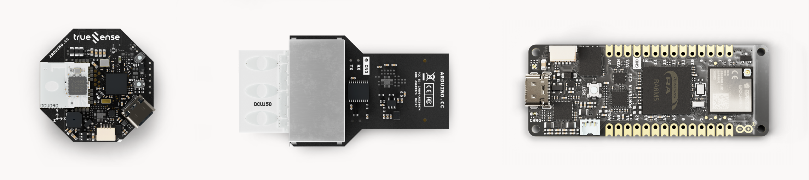
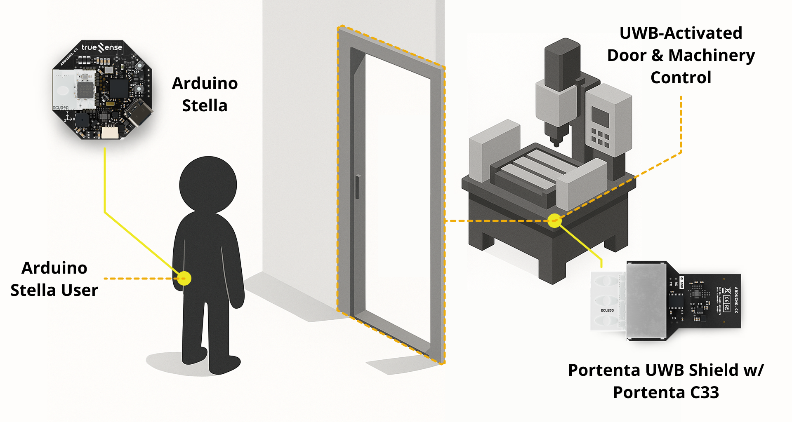
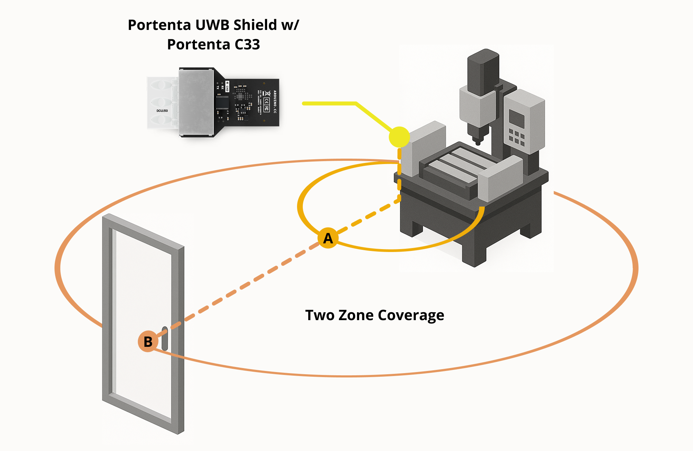
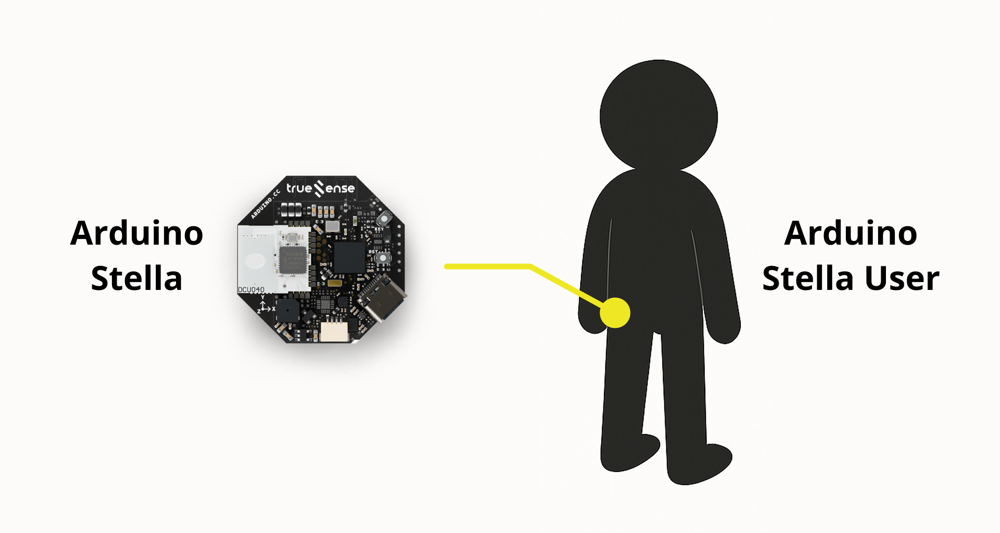
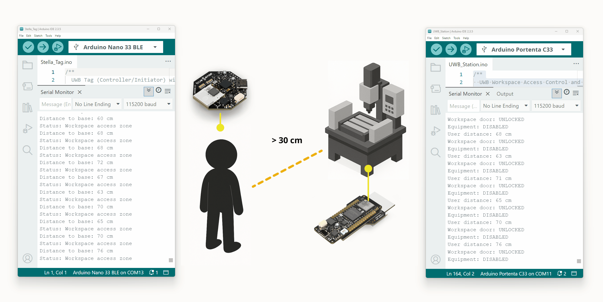

This application note shows how to create a UWB-based workspace access control and equipment safety system. You will learn how to build a system where users carry an Arduino Stella as a personal keychain, enabling automatic workspace access and equipment operation based on precise proximity detection.


## Introduction

Industrial workspaces require controlled access and equipment safety systems to ensure that only authorized personnel can enter specific areas and operate machinery that may require specialized care and capabilities. Traditional solutions, such as RFID cards or key fobs, require manual interaction and lack the precision necessary for advanced safety features in some remote or keyless activations. Ultra-wideband (UWB) technology offers an approach that provides hands-free, centimeter-accurate proximity detection.

In this application note, we will create a UWB-based workspace control system where users carry Arduino Stella devices as personal tags. These tags automatically unlock workspace doors when users approach within the defined radius and enable machinery operation when they are within a separately defined radius, for example. When users move away, the system automatically secures the workspace and disables equipment, ensuring both security and safety.

This implementation demonstrates the ability of UWB technology to create responsive industrial environments that enhance productivity and safety through customizable capabilities. The application note example demonstrates two distinct proximity zones: a larger access zone for workspace entry and a precise safety zone for equipment operation, highlighting UWB's attractive range and accuracy capabilities.

## Goals

This application note has the following objectives:

- Create a UWB-based workspace access control system using Arduino Stella as personal tags
- Implement dual-zone proximity detection for workspace access and equipment operation with Portenta UWB Shield 
- Configure automated door control and machine safety systems with hands-free, secure access control without manual interaction
- Showcase UWB technology's precision for industrial safety applications

## Hardware and Software Requirements



### Hardware Requirements

- [Portenta UWB Shield (SKU: ASX00074)](https://store.arduino.cc/products/portenta-uwb-shield) (x1)
- [Portenta C33 (SKU: ABX00074)](https://store.arduino.cc/products/portenta-c33) (x1)
- [Arduino Stella (SKU: ABX00131)](https://store.arduino.cc/products/stella) (x1)
- [USB-C® cable (SKU: TPX00094)](https://store.arduino.cc/products/usb-cable2in1-type-c) (x2)
- Relay modules (If implemented in real world scenario) (x2)

### Software Requirements

- [Arduino IDE 2.0+](https://www.arduino.cc/en/software)
- [Portenta UWB Shield library](https://github.com/Truesense-it/PortentaUWBShield) (for the Portenta UWB Shield)
- [Arduino Stella library](https://github.com/Truesense-it/StellaUWB) (for the Arduino Stella)
- [Arduino Renesas Portenta Boards core](https://github.com/arduino/ArduinoCore-renesas) (for the Portenta C33)
- [Arduino mbed OS Boards core](https://github.com/arduino/ArduinoCore-mbed) (for the Arduino Stella)

## System Overview

### UWB Technology for Industrial Access Control

Ultra-Wideband technology can provide the precision and reliability for industrial access control applications. Unlike traditional proximity technologies that may require additional technical and hardware considerations, UWB's centimeter-level accuracy ensures that access and equipment control only occur when the user or personnel are in the correct physical location, in a compact form factor.

The system works on two different proximity zones:

**Workspace Access Zone**: When an authorized user carrying an Arduino Stella approaches within a particularly programmed distance of the UWB Shield base station, the workspace door automatically unlocks, granting access to the authorized area. Otherwise, the workspace door remains locked.

**Equipment Operation Zone**: When the authorized user approaches machinery or equipment within the defined operational safety radius, the equipment becomes enabled for operation. This proximity requirement helps the user be positioned safely near the controls, and the machine is enabled only when the user is present within the operating radius.

The system automatically reverses these actions when the authorized user moves away, providing continuous safety monitoring and access control without requiring manual interaction. It also helps to prevent accidental access to the workspace and the equipment.

### System Architecture

The system consists of the following elements:



- **Arduino Stella (Personal Tag)**: Worn by users as a keychain or badge, providing unique identification and proximity detection
- **Portenta C33 + UWB Shield (Base Station)**: Installed in the workspace, monitoring proximity and controlling access systems
- **Door and Equipment Control System**: Connected to the Portenta C33 and Portenta UWB Shield station's GPIO output, managing workspace access and controlling machinery operation
- **Visual Feedback**: LED indicators on both devices show system status and proximity zones

## Hardware Setup

### UWB Shield Station Installation

The Portenta C33, equipped with the Portenta UWB Shield, will be configured as the workspace control hub and installed in the workspace. Connect the UWB Shield to the Portenta C33 using the High-Density connectors, ensuring proper alignment and secure connection.

Position the Portenta UWB Shield station strategically within the workspace to provide optimal coverage of the entrance area and the equipment location. The coverage area can be customized, and for the present application note example, we will use:

- **30 cm (A)** for machinery/equipment control
- **1 meter (B)** for workspace door control

These values define the activation zones based on user proximity. Ensure the station has a clear line of sight to all areas where users are expected to move.



The station will be programmed to control external systems using two GPIO outputs from the Portenta C33. We can use:

- **Pin D2** for the door control relay, which activates within 1 meter
- **Pin D3** for the machine control relay, which activates within 30 cm

Use these pins with appropriate relay modules that interface with your door locks and equipment control systems. Ensure proper electrical isolation and safety protocols when connecting to industrial equipment in a real-world implementation.

In this application note example, we can use these two pins to turn on LEDs to simulate activation status.

### Arduino Stella Configuration

The Arduino Stella requires no hardware modification and can be modeled as a keychain, clipped to clothing or integrated into user identification badges. The device's compact size and battery operation make it ideal for personal carrying without interfering with activities.



## Implementing the Workspace Control System

### Portenta UWB Shield Station Implementation

The base station manages all proximity detection and control system activation. The base station is configured as a **Controlee/Responder** in the UWB protocol, meaning it responds to ranging requests initiated by the Arduino Stella.

Below is the complete code implementing dual zone proximity control for the Portenta UWB Shield:

```arduino
/**
  UWB Workspace Access Control and Equipment Safety System
  Base Station (Controlee/Responder)
*/

// Include required UWB library for the Portenta UWB Shield
#include <PortentaUWBShield.h>

// Define proximity thresholds (centimeters)
#define WORKSPACE_ACCESS_THRESHOLD 100            // 1 meter for door unlock
#define EQUIPMENT_OPERATION_THRESHOLD 30          // 30 cm for machine enable

// GPIO pin definitions
#define DOOR_CONTROL_PIN 2                        // Pin D2 for door lock control
#define MACHINE_CONTROL_PIN 3                     // Pin D3 for machine enable control

// Variables for LED status indication
unsigned long lastRedLedBlink = 0;
const int RED_LED_BLINK_INTERVAL = 500;

// Variables for proximity control
unsigned long lastProximityStateChange = 0;
#define DEBOUNCE_TIME 200                         // 200ms debounce to prevent flickering

// System state tracking
bool doorUnlocked = false;
bool machineEnabled = false;
bool lastDoorState = false;
bool lastMachineState = false;

/**
  Processes ranging data and controls access systems
  @param rangingData Reference to UWB ranging data object
*/
void rangingHandler(UWBRangingData &rangingData) {
  Serial.print("GOT RANGING DATA - Type: ");
  Serial.println(rangingData.measureType());
  
  if(rangingData.measureType() == (uint8_t)uwb::MeasurementType::TWO_WAY) {
    RangingMeasures twr = rangingData.twoWayRangingMeasure();
    
    for(int j = 0; j < rangingData.available(); j++) {
      if(twr[j].status == 0 && twr[j].distance != 0xFFFF) {
        // Display current distance
        Serial.print("User distance: ");
        Serial.print(twr[j].distance);
        Serial.println(" cm");

        Serial.print("Workspace door: ");
        Serial.println(doorUnlocked ? "UNLOCKED" : "LOCKED");

        Serial.print("Equipment: ");
        Serial.println(machineEnabled ? "ENABLED" : "DISABLED");
        
        // Determine new system states based on proximity
        bool newDoorState = (twr[j].distance <= WORKSPACE_ACCESS_THRESHOLD);
        bool newMachineState = (twr[j].distance <= EQUIPMENT_OPERATION_THRESHOLD);
        
        // Apply debouncing to prevent rapid state changes
        if((newDoorState != doorUnlocked || newMachineState != machineEnabled) && 
           (millis() - lastProximityStateChange > DEBOUNCE_TIME)) {
          
          // Update door control
          if(newDoorState != doorUnlocked) {
            doorUnlocked = newDoorState;
            digitalWrite(DOOR_CONTROL_PIN, doorUnlocked ? HIGH : LOW);
            #if defined(ARDUINO_PORTENTA_C33)
            digitalWrite(LEDG, doorUnlocked ? LOW : HIGH); // Green LED for door status
            #endif
          }
          
          // Update machine control
          if(newMachineState != machineEnabled) {
            machineEnabled = newMachineState;
            digitalWrite(MACHINE_CONTROL_PIN, machineEnabled ? HIGH : LOW);
            #if defined(ARDUINO_PORTENTA_C33)
            digitalWrite(LEDB, machineEnabled ? LOW : HIGH); // Blue LED for machine status
            #endif
          }
          
          lastProximityStateChange = millis();
        }
      }
    }
  }
}

void setup() {
  Serial.begin(115200);
  
  // Initialize GPIO pins for control outputs
  pinMode(DOOR_CONTROL_PIN, OUTPUT);
  pinMode(MACHINE_CONTROL_PIN, OUTPUT);
  digitalWrite(DOOR_CONTROL_PIN, LOW);                // Start with door locked
  digitalWrite(MACHINE_CONTROL_PIN, LOW);             // Start with machine disabled
  
#if defined(ARDUINO_PORTENTA_C33)
  // Initialize RGB LEDs for status indication (only on Portenta C33)
  pinMode(LEDR, OUTPUT);                              // Red: System status
  pinMode(LEDG, OUTPUT);                              // Green: Door status
  pinMode(LEDB, OUTPUT);                              // Blue: Machine status
  digitalWrite(LEDR, LOW);                            // System initializing
  digitalWrite(LEDG, HIGH);                           // Door locked (OFF)
  digitalWrite(LEDB, HIGH);                           // Machine disabled (OFF)
#endif
  
  Serial.println("UWB Workspace Control System");
  Serial.println("Initializing...");

  // Define the source (this device) and destination MAC addresses, using 2-bytes MACs
  // This device is the controlee/responder, so it uses 0x11,0x11
  // and expects the controller/initiator at 0x22,0x22
  uint8_t devAddr[] = {0x11, 0x11};
  uint8_t destination[] = {0x22, 0x22};
  UWBMacAddress srcAddr(UWBMacAddress::Size::SHORT, devAddr);
  UWBMacAddress dstAddr(UWBMacAddress::Size::SHORT, destination);
  
  // Register the ranging notification handler before starting
  UWB.registerRangingCallback(rangingHandler);
  
  UWB.begin(); // Start the UWB stack, use Serial for the log output
  Serial.println("Starting UWB ...");
  
  // Wait until the stack is initialized
  while(UWB.state() != 0)
    delay(10);

  Serial.println("Starting session ...");
  // Setup a session with ID 0x11223344
  UWBRangingControlee myControlee(0x11223344, srcAddr, dstAddr);
  
  // Add the session to the session manager
  UWBSessionManager.addSession(myControlee);

  // Prepare the session applying the default parameters
  myControlee.init();
  
  // Start the session
  myControlee.start();
  
#if defined(ARDUINO_PORTENTA_C33)
  digitalWrite(LEDR, HIGH); // System ready (RED OFF)
#endif
  
  Serial.println("System ready!");
  Serial.println("Door unlocks at: " + String(WORKSPACE_ACCESS_THRESHOLD) + " cm");
  Serial.println("Machine enables at: " + String(EQUIPMENT_OPERATION_THRESHOLD) + " cm");
  
#if defined(ARDUINO_PORTENTA_C33)
  // Initialization complete signal
  for(int i = 0; i < 3; i++) {
    digitalWrite(LEDR, LOW);
    digitalWrite(LEDG, LOW);
    digitalWrite(LEDB, LOW);
    delay(100);
    digitalWrite(LEDR, HIGH);
    digitalWrite(LEDG, HIGH);
    digitalWrite(LEDB, HIGH);
    delay(100);
  }
#endif
}

void loop() {
#if defined(ARDUINO_PORTENTA_C33)
  unsigned long currentTime = millis();
  
  // Blink red LED to indicate system is running
  if(currentTime - lastRedLedBlink >= RED_LED_BLINK_INTERVAL) {
    lastRedLedBlink = currentTime;
    digitalWrite(LEDR, !digitalRead(LEDR));
  }
#endif
  
  delay(10);
}
```

In this code, you can adjust the perimeters and the pins to use as triggers in the following lines:

```arduino
// Define proximity thresholds (centimeters)
#define WORKSPACE_ACCESS_THRESHOLD 100            // 1 meter for door unlock
#define EQUIPMENT_OPERATION_THRESHOLD 30          // 30 cm for machine enable

// GPIO pin definitions
#define DOOR_CONTROL_PIN 2                        // Pin D2 for door lock control
#define MACHINE_CONTROL_PIN 3                     // Pin D3 for machine enable control
```

### Personal Stella Implementation

The Arduino Stella provides user identification and proximity sensing. It is configured as a **Controller/Initiator**, meaning it initiates the ranging requests and processes the distance information. The Arduino Stella controls its built-in LED (`p37`) based on its proximity to the base station, with dynamic blinking rates based on distance.

Below is the complete code for the Arduino Stella. To compile and upload the code to Arduino Stella, please select **Arduino Nano 33 BLE** as the target board:

```arduino
/**
  UWB Tag (Controller/Initiator) with Dynamic Proximity Detection
*/

// Include required UWB library for Arduino Stella
#include <StellaUWB.h>

// Define proximity thresholds (centimeters)
#define WORKSPACE_ACCESS_THRESHOLD 100        // 1 meter for door unlock
#define EQUIPMENT_OPERATION_THRESHOLD 30      // 30 cm for machine enable

// Variables for LED feedback
int blinkInterval = 0;
bool ledState = false;
bool lastLedPhysicalState = true;
unsigned long lastStateChange = 0;
unsigned long lastBlinkTime = 0;
#define DEBOUNCE_TIME 200

// Stella's built-in LED
#define LED_PIN p37

/**
  Processes ranging data and provides visual feedback
  @param rangingData Reference to UWB ranging data object
*/
void rangingHandler(UWBRangingData &rangingData) {
  Serial.print("GOT RANGING DATA - Type: ");
  Serial.println(rangingData.measureType());
  
  if(rangingData.measureType() == (uint8_t)uwb::MeasurementType::TWO_WAY) {
    RangingMeasures twr = rangingData.twoWayRangingMeasure();
    
    for(int j = 0; j < rangingData.available(); j++) {
      if(twr[j].status == 0 && twr[j].distance != 0xFFFF) {
        Serial.print("Distance to base: ");
        Serial.print(twr[j].distance);
        Serial.println(" cm");
        
        // Determine LED behavior based on proximity zones
        int newBlinkInterval;
        if(twr[j].distance > WORKSPACE_ACCESS_THRESHOLD) {
          newBlinkInterval = 0;                                 // Outside workspace - LED off
          Serial.println("Status: Outside workspace");
        }
        else if(twr[j].distance <= EQUIPMENT_OPERATION_THRESHOLD) {
          newBlinkInterval = 100;                               // Equipment zone - very fast blink
          Serial.println("Status: Equipment operation zone");
        }
        else if(twr[j].distance <= WORKSPACE_ACCESS_THRESHOLD) {
          newBlinkInterval = 500;                               // Workspace zone - slow blink
          Serial.println("Status: Workspace access zone");
        }
        
        // Apply debouncing
        if(newBlinkInterval != blinkInterval && (millis() - lastStateChange > DEBOUNCE_TIME)) {
          blinkInterval = newBlinkInterval;
          lastStateChange = millis();
          lastBlinkTime = millis();
        }
      }
    }
  }
}

void setup() {
  Serial.begin(115200);
  
  pinMode(LED_PIN, OUTPUT);
  digitalWrite(LED_PIN, HIGH);  // Start with LED off
  lastLedPhysicalState = true;
  
  Serial.println("UWB Personal Access Tag - Stella");

  // Define the source (this device) and destination MAC addresses, using 2-bytes MACs
  // This device is the controller/initiator, so it uses 0x22,0x22
  // and targets the responder/controlee at 0x11,0x11
  uint8_t devAddr[] = {0x22, 0x22};
  uint8_t destination[] = {0x11, 0x11};
  UWBMacAddress srcAddr(UWBMacAddress::Size::SHORT, devAddr);
  UWBMacAddress dstAddr(UWBMacAddress::Size::SHORT, destination);
  
  // Register the ranging notification handler before starting
  UWB.registerRangingCallback(rangingHandler);
  
  UWB.begin(); // Start the UWB stack, use Serial for the log output
  Serial.println("Starting UWB ...");
  
  // Wait until the stack is initialized
  while(UWB.state() != 0)
    delay(10);
  
  Serial.println("Starting session ...");
  
  // Setup a session with ID 0x11223344 as Controller/Initiator (default role)
  UWBTracker myTracker(0x11223344, srcAddr, dstAddr);
  
  // Add the session to the session manager
  UWBSessionManager.addSession(myTracker);
  
  // Prepare the session applying the default parameters
  myTracker.init();
  
  // Start the session
  myTracker.start();
  
  Serial.println("Personal tag ready!");
  Serial.println("Proximity zones:");
  Serial.println("- Outside workspace: LED off");
  Serial.println("- Workspace zone (≤" + String(WORKSPACE_ACCESS_THRESHOLD) + "cm): Slow blink");
  Serial.println("- Equipment zone (≤" + String(EQUIPMENT_OPERATION_THRESHOLD) + "cm): Fast blink");
  
  // Initialization complete signal
  for(int i = 0; i < 3; i++) {
    digitalWrite(LED_PIN, LOW);
    delay(100);
    digitalWrite(LED_PIN, HIGH);
    delay(100);
  }
}

void loop() {
  unsigned long currentTime = millis();
  
  // Handle LED control based on proximity zones
  if(blinkInterval == 0) {
    // Outside workspace - LED off
    if(lastLedPhysicalState != true) {
      digitalWrite(LED_PIN, HIGH);
      lastLedPhysicalState = true;
      ledState = false;
    }
  } else {
    // Inside workspace - blink at appropriate interval
    if(currentTime - lastBlinkTime >= blinkInterval) {
      lastBlinkTime = currentTime;
      ledState = !ledState;
      
      bool newPhysicalState = !ledState;
      if(newPhysicalState != lastLedPhysicalState) {
        digitalWrite(LED_PIN, newPhysicalState ? HIGH : LOW);
        lastLedPhysicalState = newPhysicalState;
      }
    }
  }
  
  delay(10);
}
```

In this code, you can adjust the perimeters in the following lines:

```arduino
// Define proximity thresholds (centimeters)
#define WORKSPACE_ACCESS_THRESHOLD 100        // 1 meter for door unlock
#define EQUIPMENT_OPERATION_THRESHOLD 30      // 30 cm for machine enable
```

## System Operation & Deployment

Once you have uploaded the corresponding code to the **Arduino Stella** and the **Portenta C33** with the **Portenta UWB Shield**, you will have a UWB workspace control system operating with dual zone proximity detection to provide automated access control and equipment safety management. With this, the system will do the following tasks:


**Workspace Access Zone:** When an authorized user approaches within 1 meter of the Portenta UWB Shield station, the system automatically unlocks the workspace door by activating the door control relay connected to pin D2.

The base station's **green LED** illuminates to confirm the unlocked status. At the same time, the user's Arduino Stella begins slow blinking at 500 ms intervals to indicate workspace access authorization.



**Equipment Operation Zone (30 centimeters):** When the user moves within 30 centimeters of the Portenta UWB Shield station, the pin D3 connected to the machine control relay is activated, enabling connected equipment for operation.

The base station's **blue LED** illuminates to show that the equipment is enabled. At the same time, the Arduino Stella switches to rapid blinking at 100 ms intervals to indicate the equipment operation zone.

The system provides comprehensive visual feedback through multiple LED indicators, allowing users and supervisors to quickly understand the current system status.

The Portenta UWB Shield station uses three different colored LEDs to indicate different aspects of system operation.

- **Red LED** continuously blinks to indicate that the UWB system is operational and actively monitoring user proximity.
- **Green LED** provides visual confirmation of workspace door status, remaining illuminated when the workspace is unlocked and turning off when the area is secured.
- **Blue LED** indicates equipment status, glowing when machinery is enabled for operation and turning off when equipment is disabled.

The user's Arduino Stella also provides visual feedback about their authorization status. The LED remains off when the user is outside the workspace beyond the 1 meter threshold, indicating they are beyond the authorization required area.

Upon entering the workspace zone within 1 meter of the base station, the LED begins slow blinking at 500 ms intervals to confirm workspace access authorization.

When the user approaches equipment within the 30 centimeter operation zone, the LED switches to fast blinking at 100 ms intervals, providing feedback that they are in position to operate the machinery.

## System Testing

The following animation illustrates a workflow where an Arduino Stella user approaches the workspace, operates machinery, completes their task and leaves. The system automatically manages workspace access and equipment control and then secures everything when the authorized user leaves.


You can test out the UWB-activated workspace and equipment control by following these testing steps:

**Workspace Access Testing:** approach the workspace from multiple directions while monitoring the 1 meter activation zone. Verify that the door control pin activates consistently at the correct distance and test action reversal when you move beyond the threshold. The LED indicators should represent door status throughout these movements.

**Equipment Operation Testing:** test the 30 cm equipment activation zone from various approach angles and verify immediate equipment shutdown when you move beyond the safety radius. Check that equipment control only activates when workspace access is already granted and test quick entry and exit movements to verify that debouncing prevents false activations.

**System Integration Testing:** Validate the operations visually from approach to operation to departure. Test system responsiveness during quick zone transitions, check LED feedback to ensure it matches control outputs, and check system behavior with multiple approach patterns.

With this, you will have tested an example of the UWB technology's centimeter level precision through immediate response to proximity changes and visual feedback of operational status, showing its intuitive implementation for industrial applications.

## Complete UWB Activated Workspace & Equipment Control Example

All the necessary files to test this application note example can be downloaded [here](assets/uwb-access-control-system.zip).

[](assets/uwb-access-control-system.zip)

## Conclusion

In this application note, you have learned to create a basic UWB-based workspace control system that can provide security and safety improvement in industrial environments requiring quick area transitions. By implementing the centimeter level precision of UWB technology, we have made a system that provides uninterrupted automatic access control and equipment operation management using Arduino Stella and the Portenta UWB Shield as a base station.

The application note's dual-zone implementation example shows UWB's capability to create multiple control levels within a single system, from broad workspace access to precise equipment operation zones. You can extend this system to support multiple users, additional equipment zones, and integration with existing industrial control systems.

