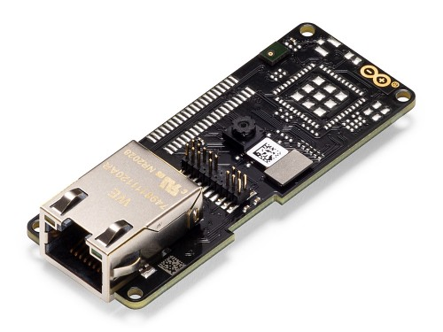
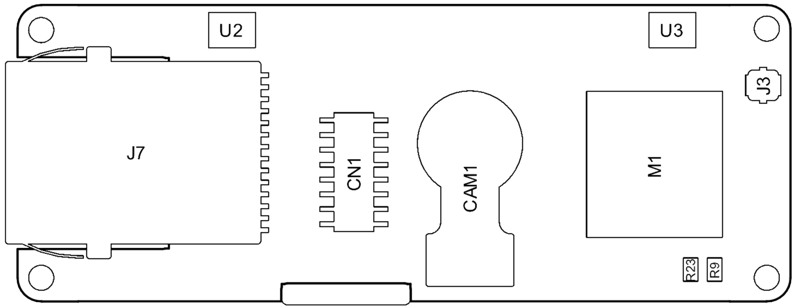
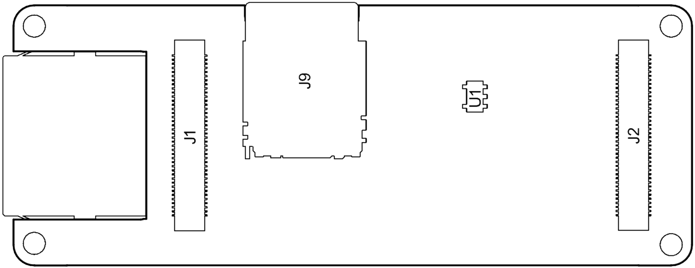
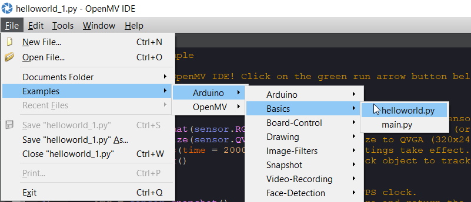
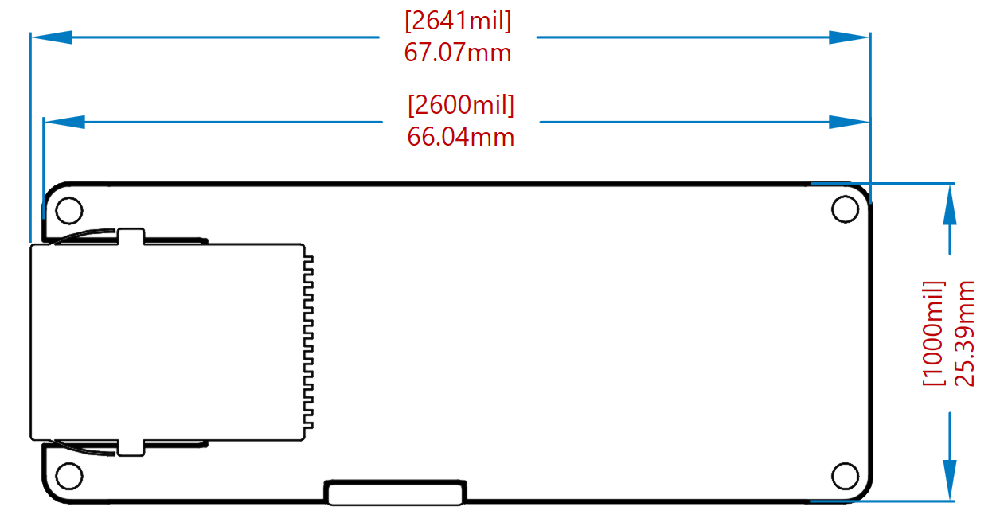
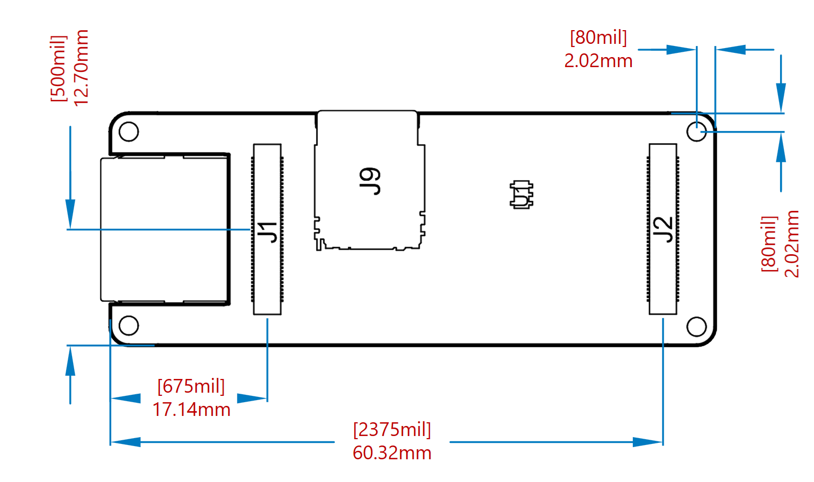

# Description
The Arduino Portenta Vision Shield is an add-on board providing machine vision capabilities and additional connectivity to the Portenta family of Arduino boards, designed to meet the needs of industrial automation. The Portenta Vision Shield connects via a high-density connector to the Portenta boards with minimal hardware and software setup.

# Target Areas
Industry, Surveillance

# Features
Note: This board needs the Arduino Portenta H7 or Portenta C33 to function.

-   **Himax HM-01B0 camera module**
    -   Ultra Low Power Image Sensor designed for Always-on vision devices and applications
    -   High sensitivity 3.6μ BrightSenseTM pixel technology
    -   Window, vertical flip and horizontal mirror readout
    -   Programmable black level calibration target, frame size, frame rate, exposure, analog gain (up to 8x) and digital gain (up to 4x)
    -   Automatic exposure and gain control loop with support for 50Hz / 60Hz flicker avoidance
    -   Motion Detection circuit with programmable ROI and detection threshold with digital output to serve as an interrupt

    -   **Supported resolutions**
        -   QQVGA (160x120) at 15, 30, 60 and 120 FPS
        -   QVGA (320x240) at 15, 30 and 60 FPS

    -   **Power**
        -   \<1.1mW QQVGA resolution at 30FPS,
        -   \< 2mW QVGA resolution at 30FPS

-   **2x MP34DT06JTR MEMS PDM Digital Microphone**

    -   AOP = 122.5 dB SPL
    -   64 dB signal-to-noise ratio
    -   Omnidirectional sensitivity
    -   –26 dBFS ± 1 dB sensitivity

-   **MIPI 20-pin compatible JTAG Connector**

-   **Memory**

    -   Micro SD Card Slot

# Contents
## The Board
The included HM-01B0 camera module has been pre-configured to work with the OpenMV libraries provided by Arduino. Based on the specific application requirements, the Portenta Vision Shield is available in two configurations with either Ethernet or LoRa® connectivity. Ethernet is designed for integration of the Portenta into wired networks and providing high bandwidth. In situations requiring long-range operation at low bandwidth, LoRa® connectivity is the way to go. The multi-core processor of the Portenta H7 makes embedded vision possible by minimizing the data bandwidth required.

**Note:** The Portenta Vision Shield is available in two SKUs, Ethernet (ASX00021) and LoRa® (ASX00026)

### Application Examples
Thanks to the low power consumption of the Vision Shield, it is well suited for bringing machine learning to a wide range of Industry 4.0 and IoT applications.

- **Industrial production:** The included HM-01B0 camera along with the OpenMV libraries allows for quality control of items within a manufacturing or packaging plant. The small footprint, low power consumption and LoRa®/Ethernet connectivity allow for the module to be deployed essentially anywhere so that defects are identified quickly and removed from the production environment.

- **Predictive maintenance:** The combination of machine vision and machine learning capabilities of the Vision Shield and the Portenta H7 opens up possibilities for predictive maintenance based on subtle differences in the visual representation of machinery. These capabilities are further enhanced with the two MP34DT05 MEMS microphones included in the Vision Shield.

- **Surveillance:** The Vision Shield is able to provide surveillance capabilities in areas with low Wi-Fi® penetration (e.g. warehouses) and large areas (e.g. shopping centers). The OpenMV libraries enable the Vision Shield to identify objects and alert the operator via LoRa® while saving a snapshot on the microSD storage slot.

### Related Products
The Vision Shield is developed as an add-on shield that requires the Portenta H7.

## Ratings

### Absolute Maximum

| **Symbol** | **Description**                  | **Min** | **Typ** | **Max** | **Unit** |
| ---------- | -------------------------------- | ------- | ------- | ------- | -------- |
| VINMax     | Input voltage from HD Connectors | -0.3    | -       | 3.3     | V        |

### Thermal

| **Symbol** | **Description**       | **Min** | **Typ** | **Max** | **Unit** |
| ---------- | --------------------- | ------- | ------- | ------- | -------- |
| TST        | Storage Temperature   | -30     |         | 85      | °C       |
| TOP        | Operating Temperature | -40     |         | 85      | °C       |

## Functional Overview

### Board Topology

| Ref.   | Description                                    | Ref. | Description                                        |
| ------ | ---------------------------------------------- | ---- | -------------------------------------------------- |
| U1     | Voltage Regulator                              | J3   | LoRa® Radio Antenna U.FL Connector (ASX00026 Only) |
| U2,U3  | ST MP34DT06JTR Digital Microphone              | J7   | Ethernet Connector (ASX00021 Only)                 |
| M1     | Murata CMWX1ZZABZ LoRa® Module (ASX00026 Only) | J9   | Micro SD Card Connector                            |
| J1, J2 | High Density Connectors                        | CN1  | JTAG Connector                                     |

### Camera Module

The Himax HM-01B0 Module is a very low-power camera with 324x324 resolution and a maximum of 60 FPS depending on the operating mode. Video data is transferred over a configurable 8-bit interconnect with support for frame and line synchronization. The module delivered with the Vision Shield is the monochrome version. Configuration is achieved via an I2C connection with the compatible Portenta boards microcontrollers.

HM-01B0 offers very low-power image acquisition and provides the possibility to perform motion detection without main processor interaction. The “Always-on” operation provides the ability to turn on the main processor when movement is detected with minimal power consumption.

### Digital Microphones

The dual MP34DT05 digital MEMS microphones are omnidirectional and operate via a capacitive sensing element with a high (64 dB) signal-to-noise ratio. The microphones have been configured to provide separate left and right audio over a single PDM stream.

The sensing element, capable of detecting acoustic waves, is manufactured using a specialized silicon micromachining process dedicated to produce audio sensors

### Micro SD Card Slot

A micro SD card slot is available under the Vision Shield board. Available libraries allow reading and writing to FAT16/32 formatted cards.

### Ethernet (ASX00021 Only)

Ethernet connector allows connecting to 10/100 Base TX networks using the Ethernet PHY available on the Portenta board.

### LoRa® Module (ASX00026 Only)

LoRa® connectivity is provided by the Murata CMWX1ZZABZ module. This module contains an STM32L0 processor along with a Semtech SX1276 Radio. The processor is running on Arduino open-source firmware based on Semtech code.

### Power
The Portenta H7 supplies 3.3V power to the LoRa® module (ASX00026 only), microSD slot and dual microphones via the 3.3V output via the high-density connector. An onboard LDO regulator supplies a 2.8V output (300mA) for the camera module.

## Board Operation

### Getting Started – IDE

If you want to program your Arduino board while offline you need to install the Arduino Desktop IDE **[1]** To connect the board to your computer, you’ll need a USB cable. This also provides power to the board, as indicated by the LED.

### Getting Started – Arduino Web Editor (Create)

All Arduino and Genuino boards, including this one, work out-of-the-box on the Arduino Web Editor **[2]**, by just installing a simple plugin.

The Arduino Web Editor is hosted online, therefore it will always be up-to-date with the latest features and support for all boards. Follow **[3]** to start coding on the browser and upload your sketches onto your board.

### Getting Started – Arduino IoT Cloud

All Arduino IoT-enabled products are supported on Arduino IoT Cloud which allows you to Log, graph and analyze sensor data, trigger events, and automate your home or business.

### Getting Started – OpenMV
**NOTE!
** It is highly recommended that you ensure you have the latest bootloader on your Portenta H7 before loading OpenMV firmware.

Arduino Vision Shield and Portenta H7 are supported under OpenMV. In order to easily use OpenMV download the latest OpenMV IDE **[5] **set up Portenta H7 in boot mode by double tapping reset and connecting via the connection button.

Once connected you will receive a message like the following:

Click on “OK” and the latest OpenMV firmware will be automatically loaded. To open the “Hello World” example, under the **File** menu select **Examples **-> **Arduino **->_ Basics _and click on **helloworld.py**.

Click on the green square underneath the connection button to run.

### Online Resources
Now that you have gone through the basics of what you can do with the board you can explore the endless possibilities it provides by checking exciting projects on ProjectHub **[6]**, the Arduino Library Reference **[7]** and the online store **[8]** where you will be able to complement your board with sensors, actuators and more.

### Board Recovery
All Arduino boards have a built-in bootloader which allows flashing the board via USB. In case a sketch locks up the processor and the board is not reachable anymore via USB it is possible to enter bootloader mode by double-tapping the reset button right after the power-up.

## Connector Pinouts
### JTAG

| Pin                          | Function | Type          | Description                                    |
| ---------------------------- | -------- | ------------- | ---------------------------------------------- |
| 1                            | VDDIO    | Power         | Positive Reference voltage for debug interface |
| 2                            | SWD      | I/O           | Single Wire Debug Data                         |
| 3,5,9                        | GND      | Power         | Negative reference voltage for debug interface |
| 4                            | SCK      | Output        | Single Wire Debug Clock                        |
| 6                            | SWO      | I/O           | Single Wire Debug Trace                        |
| 10                           | RESET    | Input         | CPU Reset                                      |
| 7,11,12,13,14,15,17,18,19,20 | NC       | Not Connected |                                                |

### High-Density Connector

## Mechanical Information
### Board Outline

### Mounting Holes

### Connector and Component Positions

### Mounting Instructions

## Certifications
### Declaration of Conformity CE/RED DoC (EU)
We declare under our sole responsibility that the products above are in conformity with the essential requirements of the following EU Directives and therefore qualify for free movement within markets comprising the European Union (EU) and European Economic Area (EEA).

### Declaration of Conformity to EU RoHS & REACH 191 11/26/2018
Arduino boards are in compliance with Directive 2011/65/EU of the European Parliament and Directive 2015/863/EU of the Council of 4 June 2015 on the restriction of the use of certain hazardous substances in electrical and electronic equipment.

| **Substance**                          | **Maximum Limit (ppm)** |
| -------------------------------------- | ----------------------- |
| Lead (Pb)                              | 1000                    |
| Cadmium (Cd)                           | 100                     |
| Mercury (Hg)                           | 1000                    |
| Hexavalent Chromium (Cr6+)             | 1000                    |
| Poly Brominated Biphenyls (PBB)        | 1000                    |
| Poly Brominated Diphenyl ethers (PBDE) | 1000                    |
| Bis(2-Ethylhexyl} phthalate (DEHP)     | 1000                    |
| Benzyl butyl phthalate (BBP)           | 1000                    |
| Dibutyl phthalate (DBP)                | 1000                    |
| Diisobutyl phthalate (DIBP)            | 1000                    |

Exemptions : No exemptions are claimed.

Arduino Boards are fully compliant with the related requirements of European Union Regulation (EC) 1907 /2006 concerning the Registration, Evaluation, Authorization and Restriction of Chemicals (REACH). We declare none of the SVHCs (https://echa.europa.eu/web/guest/candidate-list-table), the Candidate List of Substances of Very High Concern for authorization currently released by ECHA, is present in all products (and also package) in quantities totaling in a concentration equal or above 0.1%. To the best of our knowledge, we also declare that our products do not contain any of the substances listed on the "Authorization List" (Annex XIV of the REACH regulations) and Substances of Very High Concern (SVHC) in any significant amounts as specified by the Annex XVII of Candidate list published by ECHA (European Chemical Agency) 1907 /2006/EC.

### Conflict Minerals Declaration
As a global supplier of electronic and electrical components, Arduino is aware of our obligations with regards to laws and regulations regarding Conflict Minerals, specifically the Dodd-Frank Wall Street Reform and Consumer Protection Act, Section 1502. Arduino does not directly source or process conflict minerals such as Tin, Tantalum, Tungsten, or Gold. Conflict minerals are contained in our products in the form of solder, or as a component in metal alloys. As part of our reasonable due diligence Arduino has contacted component suppliers within our supply chain to verify their continued compliance with the regulations. Based on the information received thus far we declare that our products contain Conflict Minerals sourced from conflict-free areas.

## FCC Caution

Any Changes or modifications not expressly approved by the party responsible for compliance could void the user's authority to operate the equipment. 
This device complies with part 15 of the FCC Rules. Operation is subject to the following two conditions: (1) This device may not cause harmful interference, and (2) this device must accept any interference received, including interference that may cause undesired operation.
FCC RF Radiation Exposure Statement:

1. This Transmitter must not be co-located or operating in conjunction with any other antenna or transmitter.

2. This equipment complies with RF radiation exposure limits set forth for an uncontrolled environment.

3. This equipment should be installed and operated with a minimum distance 20 cm between the radiator& your body.

<table>
  <tr>
   <td>Antenna manufacturer:
   </td>
   <td>Dynaflex
   </td>
  </tr>
  <tr>
   <td>Antenna Model:
   </td>
   <td>2G-3G-4G ADHESIVE MOUNT ANTENNA DIPOLE
   </td>
  </tr>
  <tr>
   <td>Antenna type:
   </td>
   <td>External omnidirectional dipole antenna
   </td>
  </tr>
  <tr>
   <td>Antenna gain:
   </td>
   <td>-1 dBi
   </td>
  </tr>
</table>

**Important:** The operating temperature of the EUT can’t exceed 85℃ and shouldn’t be lower than -40℃.

Hereby, Arduino S.r.l. declares that this product is in compliance with essential requirements and other relevant provisions of Directive 201453/EU. This product is allowed to be used in all EU member states.

| Frequency bands | Maximum Output Power (ERP) |
| --------------- | -------------------------- |
| 863-870 MHz     | 0.73 dBm                   |

## Company Information

| Company name    | Arduino S.r.l                              |
| --------------- | ------------------------------------------ |
| Company Address | Via Andrea Appiani, 25 20900 MONZA (Italy) |

## Reference Documentation

| **Ref**                   | **Link**                                                     |
| ------------------------- | ------------------------------------------------------------ |
| Arduino IDE (Desktop)     | https://www.arduino.cc/en/Main/Software                      |
| Arduino IDE (Cloud)       | https://create.arduino.cc/editor                             |
| Cloud IDE Getting Started | https://create.arduino.cc/projecthub/Arduino_Genuino/getting-started-with-arduino-web-editor-4b3e4a |
| Forum                     | http://forum.arduino.cc/                                     |
| OpenMV IDE                | https://openmv.io/pages/download                             |
| ProjectHub                | https://create.arduino.cc/projecthub?by=part&part_id=11332&sort=trending |
| Library Reference         | https://www.arduino.cc/reference/en/                         |
| Arduino Store             | https://store.arduino.cc/                                    |

## Change Log

| **Date**   | **Revision** | **Changes**                       |
| ---------- | ------------ | --------------------------------- |
| 15/11/2023 | 3            | Updates as a Collective Datasheet |
| 13/01/2022 | 2            | Information update                |
| 03/03/2021 | 1            | First Release                     |
