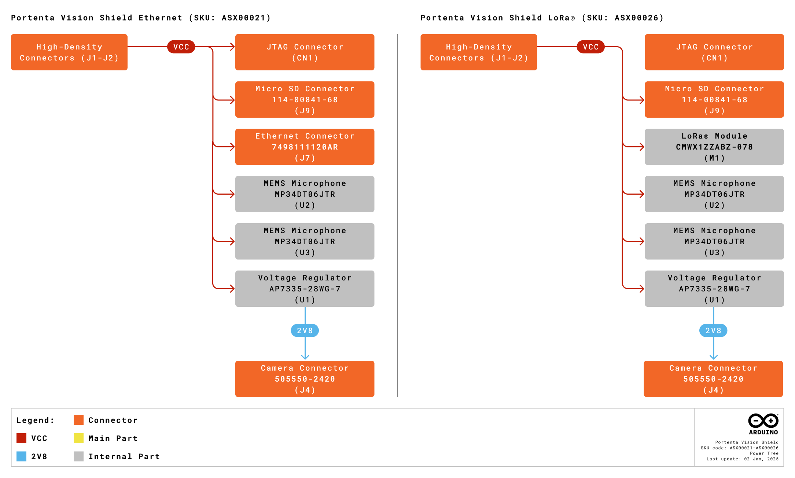

# Description

Enhance your industrial automation and surveillance projects with the Arduino Portenta Vision Shield. This add-on board integrates with the Portenta family, offering advanced machine vision capabilities and extended connectivity. The Portenta Vision Shield's compact design and High-Density connector ensure a quick and efficient setup. It transforms your Portenta family board into a powerful tool for real-time image processing and edge computing, suitable for demanding industrial environments.

# Target Areas
Industrial automation, surveillance, machine vision and edge computing

# CONTENTS
## Application Examples

The Portenta Vision Shield is an add-on and a gateway to innovative solutions in various industries. Explore the possibilities of integrating advanced machine vision and edge computing into your projects with the following application examples:

- **Industrial automation:** Elevate your automation systems with the Portenta Vision Shield, enabling precise and real-time image processing for:
  - 
<strong>Quality control:</strong> Use the Portenta Vision Shield in production lines to automatically detect product defects and ensure that only high-quality items pass through.

  - 
<strong>Predictive maintenance:</strong> Use machine vision to monitor equipment and identify early signs of wear or failure, reducing downtime and maintenance costs.

  - 
<strong>Automated sorting:</strong> Integrate the Portenta Vision Shield into conveyor systems to automatically sort items based on color, shape, or size, improving efficiency and accuracy.

- **Surveillance:** Enhance security and monitoring systems with advanced visual capabilities provided by the Portenta Vision Shield for:
  - 
<strong>Real-time threat detection:</strong> Deploy the Portenta Vision Shield in security systems to identify and alert authorities of potential threats, such as unauthorized access or suspicious activities, in real-time.

  - 
<strong>Perimeter surveillance:</strong> Implement the Portenta Vision Shield in perimeter security to detect intrusions or breaches, triggering immediate responses and minimizing risks.

- **Machine vision and edge computing:** Unlock the potential of edge computing with the Portenta Vision Shield, bringing powerful processing capabilities directly to the field for:
  - 
<strong>Smart agriculture:</strong> Use the Portenta Vision Shield to monitor crops and soil conditions, identifying issues such as pest infestations or nutrient deficiencies, and enabling precise interventions to optimize yield.

  - 
<strong>Autonomous vehicles:</strong> Integrate the Portenta Vision Shield into autonomous systems to enhance navigation and obstacle detection, ensuring safe and efficient operation in various environments.

  - 
<strong>Robotics:</strong> Empower robots with the ability to see and interpret their surroundings using the Portenta Vision Shield, enabling complex tasks such as object recognition and manipulation in dynamic settings.

- **Audio analysis and sound-based applications:** Leverage the high-performance microphone of the Portenta Vision Shield for advanced audio processing and sound recognition in various scenarios:
  - 
<strong>Acoustic monitoring:</strong> Monitor environments for specific sounds, such as machinery noise patterns, to detect anomalies or predict maintenance needs in industrial settings.

  - 
<strong>Voice-activated systems:</strong> Integrate the microphone into hands-free control systems, enabling voice commands for enhanced accessibility and convenience in smart devices.

  - 
<strong>Anomaly detection:</strong> Use the microphone for real-time detection of unusual sounds, such as breaking glass or alarms in security or safety systems.

## Features

### General Specifications Overview

The Portenta Vision Shield expands the capabilities of the Portenta H7 (any variant) or Portenta C33 family boards, adding advanced vision and audio processing features to them.

<strong>Important note:</strong> The Portenta Vision Shield has <strong>two hardware revisions</strong>, distinguished only by the onboard camera sensor; all other features of the shield remain identical across both revisions.

Below is a summary of the shield's key components and their specifications.

| **Feature**            | **Description**                                                                     |
|------------------------|-------------------------------------------------------------------------------------|
| Onboard Camera (Rev 1) | 1/11″ 320 x 320 QVGA 60FPS CMOS image sensor (HM01B0)                               |
| Onboard Camera (Rev 2) | 1/6″ 640 x 480 VGA 60FPS CMOS image sensor (HM0360)                                 |
| Onboard Microphone     | Ultra-compact, low-power, omnidirectional, digital MEMS microphone (x2) (MP34DT06J) |
| External Memory        | Onboard microSD card slot                                                           |
| Onboard LoRa® Module   | CMWX1ZZABZ-078 (only in LoRa® variant, SKU: ASX00026)                               |
| Onboard RJ45 Connector | For Ethernet capabilities (only in Ethernet variant, SKU: ASX00021)                 |
| Dimensions             | 66.04 x 25.40 mm                                                                    |
| Weight                 | 8 g                                                                                 |
| Pinout Features        | Onboard High-Density connectors easily connect the shield to Portenta family boards |

<strong>The Portenta C33 board is not compatible with the onboard camera of the Portenta Vision Shield</strong>, it is only compatible with the shield's advanced audio and connectivity features (Ethernet or LoRa® depending of the variant).

### Included Accessories

- No accessories are included

### Related Products

- Portenta H7 (SKU: ABX00042)
- Portenta H7 Lite (SKU: ABX00045)
- Portenta H7 Lite Connected (SKU: ABX00046)
- Portenta C33 (SKU: ABX00074)
- Arduino USB Type-C® Cable 2-in-1 (SKU: TPX00094)

## Ratings

### Recommended Operating Conditions

The table below provides a comprehensive guideline for the optimal use of the Portenta Vision Shield, outlining typical operating conditions and design limits. The operating conditions of the Portenta Vision Shield are largely a function based on its component's specifications.

|          **Parameter**           |   **Symbol**    | **Min** | **Typ** | **Max** | **Unit** |
|:--------------------------------:|:---------------:|:-------:|:-------:|:-------:|:--------:|
| Supply Input Voltage1 | VIN  |    -    |   3.3   |   3.3   |    V     |
|      Operating Temperature       | TOP  |   -40   |    -    |   85    |    °C    |

1 Portenta Vision Shield powered through a Portenta family board.

The Portenta Vision Shield can be only powered through its High-Density Connectors (VCC pin).

## Functional Overview

The core of the Portenta Vision Shield is its integration with the Portenta family boards, leveraging their processing power for advanced vision and audio applications. The Portenta Vision Shield is equipped with key peripherals, such as dual MEMS microphones (MP34DT06J) and a high-performance camera module (HM01B0 on Rev 1 and HM0360 on Rev 2), all directly interfaced with the main Portenta family board. Two different variants of the shield offer advanced connectivity capabilities, via Ethernet (variant SKU: ASX00021) and via LoRa® variant (SKU: ASX00026).

### Pinout

The pinout for the Portenta Vision Shield Ethernet is shown in the figure below.

The pinout for the Portenta Vision Shield LoRa® is shown in the figure below.

### Block Diagram

An overview of the high-level architecture of the Portenta Vision Shield (Ethernet variant in the left and LoRa® variant on the right) is illustrated in the figure below.

### Power Supply

The Portenta Vision Shield is powered exclusively through the VCC pins (+3V3) of its High Density Connectors (J1-J2). These connectors are designed to be used with boards from the Portenta family, such as the Portenta H7 board (any variant) or the Portenta C33 board. The power is supplied directly from the connected Portenta family board, which acts as the power source for the Portenta Vision Shield.

The detailed figure below illustrates the power architecture of the Portenta Vision Shield (Ethernet variant in the left and LoRa® variant on the right).

## Device Operation

### Getting Started – OpenMV IDE

The Portenta Vision Shield and the Portenta H7 boards are supported under OpenMV. In order to easily use OpenMV download the latest OpenMV IDE version <strong>[1]</strong> and follow the Portenta Vision Shield official documentation <strong>[2]</strong> to learn how to create OpenMV vision applications.

### Getting Started - Arduino IDE

If you want to program your Portenta family board offline, install the Arduino Desktop IDE <strong>[3]</strong>. To connect the Portenta family board to your computer, you will need a USB-C® cable.

### Getting Started - Arduino Cloud Editor

All Arduino devices work out of the box on the Arduino Cloud Editor <strong>[4]</strong> by installing a simple plugin. The Arduino Cloud Editor is hosted online. Therefore, it will always be up-to-date with all the latest features and support for all boards and devices. Follow <strong>[5]</strong> to start coding on the browser and upload your sketches onto your device.

### Getting Started - Arduino Cloud

All Arduino IoT-enabled products are supported on Arduino Cloud, which allows you to log, graph, and analyze sensor data, trigger events, and automate your home or business. Take a look at the official documentation <strong>[5]</strong> to know more.

### Sample Sketches

Sample sketches for the Portenta Vision Shield can be found either in the “Examples” menu in the Arduino IDE or the “Portenta Vision Shield Documentation” section of Arduino documentation <strong>[2]</strong>.

### Online Resources

Now that you have gone through the basics of what you can do with the device, you can explore the endless possibilities it provides by checking exciting projects on Arduino Project Hub <strong>[6]</strong>, the Arduino Library Reference <strong>[7]</strong>, and the online store <strong>[8]</strong> where you will be able to complement your Portenta family board with additional extensions, sensors, and actuators.

## Mechanical Information

The Portenta Vision Shield is a double-sided board measuring 66.04 x 25.40 mm. It features an RJ45 connector that overhangs the top edge (present only in the Ethernet variant, SKU: ASX00021), an onboard camera positioned near the center of the board, and a LoRa® module located near the bottom edge (only in the LoRa® variant, SKU: ASX00026). The Portenta Vision Shield also includes two High-Density connectors at the bottom edge, enabling quick and efficient integration with Portenta Family boards.

### Board Dimensions

The outline and mounting hole dimensions of the Portenta Vision Shield are shown in the figure below, with all measurements in millimeters (mm). The board shown below is the Ethernet variant of the Portenta Vision Shield (SKU: ASX00021).

</img>

The Portenta Vision Shield has four 2.25 mm drilled mounting holes for mechanical fixing.

### Board Connectors

The connectors of the Portenta Vision Shield are placed on the top and bottom side of the shield; their placement are shown in the figures below; all the dimensions are in mm. The shield shown below is the Ethernet variant (SKU: ASX00021).

The Portenta Vision Shield was designed to be used with a Portenta family board. However, you can also design your own hardware and use the Portenta Vision Shield via its High-Density connectors by following to the Portenta family standard.

## Certifications

### Declaration of Conformity CE/RED DoC (EU)

We declare under our sole responsibility that the products above are in conformity with the essential requirements of the following EU Directives and therefore qualify for free movement within markets comprising the European Union (EU) and European Economic Area (EEA).

### Declaration of Conformity to EU RoHS & REACH 191 11/26/2018

Arduino boards are in compliance with Directive 2011/65/EU of the European Parliament and Directive 2015/863/EU of the Council of 4 June 2015 on the restriction of the use of certain hazardous substances in electrical and electronic equipment.

| **Substance**                          | **Maximum Limit (ppm)** |
| -------------------------------------- | ----------------------- |
| Lead (Pb)                              | 1000                    |
| Cadmium (Cd)                           | 100                     |
| Mercury (Hg)                           | 1000                    |
| Hexavalent Chromium (Cr6+)             | 1000                    |
| Poly Brominated Biphenyls (PBB)        | 1000                    |
| Poly Brominated Diphenyl ethers (PBDE) | 1000                    |
| Bis(2-Ethylhexyl) phthalate (DEHP)     | 1000                    |
| Benzyl butyl phthalate (BBP)           | 1000                    |
| Dibutyl phthalate (DBP)                | 1000                    |
| Diisobutyl phthalate (DIBP)            | 1000                    |

Exemptions: No exemptions are claimed.

Arduino boards are fully compliant with the related requirements of European Union Regulation (EC) 1907 /2006 concerning the Registration, Evaluation, Authorization and Restriction of Chemicals (REACH). We declare none of the SVHCs (https://echa.europa.eu/web/guest/candidate-list-table), the Candidate List of Substances of Very High Concern for authorization currently released by ECHA, is present in all products (and also package) in quantities totaling in a concentration equal or above 0.1%. To the best of our knowledge, we also declare that our products do not contain any of the substances listed on the "Authorization List" (Annex XIV of the REACH regulations) and Substances of Very High Concern (SVHC) in any significant amounts as specified by the Annex XVII of Candidate list published by ECHA (European Chemical Agency) 1907 /2006/EC.

### Conflict Minerals Declaration

As a global supplier of electronic and electrical components, Arduino is aware of our obligations with regards to laws and regulations regarding Conflict Minerals, specifically the Dodd-Frank Wall Street Reform and Consumer Protection Act, Section 1502. Arduino does not directly source or process conflict minerals such as Tin, Tantalum, Tungsten, or Gold. Conflict minerals are contained in our products in the form of solder, or as a component in metal alloys. As part of our reasonable due diligence Arduino has contacted component suppliers within our supply chain to verify their continued compliance with the regulations. Based on the information received thus far we declare that our products contain Conflict Minerals sourced from conflict-free areas.

## FCC Caution

Any changes or modifications not expressly approved by the party responsible for compliance could void the user's authority to operate the equipment. This device complies with part 15 of the FCC Rules. Operation is subject to the following two conditions: (1) This device may not cause harmful interference, and (2) this device must accept any interference received, including interference that may cause undesired operation.

FCC RF Radiation Exposure Statement:

1. This Transmitter must not be co-located or operating in conjunction with any other antenna or transmitter.

2. This equipment complies with RF radiation exposure limits set forth for an uncontrolled environment.

3. This equipment should be installed and operated with a minimum distance 20 cm between the radiator and your body.

| **Feature**              | **Description**                             |
|--------------------------|---------------------------------------------|
| **Antenna Manufacturer** | Dynaflex                                    |
| **Antenna Model**        | 2G-3G-4G ADHESIVE MOUNT ANTENNA DIPOLE      |
| **Antenna Type**         | External omnidirectional dipole antenna     |
| **Antenna Gain**         | -1 dBi                                      |

**Important:** The operating temperature of the EUT can’t exceed 85℃ and shouldn’t be lower than -40℃.

Hereby, Arduino S.r.l. declares that this product is in compliance with essential requirements and other relevant provisions of Directive 201453/EU. This product is allowed to be used in all EU member states.

| **Frequency bands** | **Maximum Output Power (ERP)** |
|---------------------|--------------------------------|
| 863-870 MHz         | 0.73 dBm                       |

## Company Information

| **Company name** | **Arduino S.r.l.**                           |
|------------------|----------------------------------------------|
| Company address  | Via Andrea Appiani, 25 - 20900 Monza (Italy) |

## Reference Documentation

| **No.** |             **Reference**            | **Link**                                                |
|:-------:|:------------------------------------:|---------------------------------------------------------|
|    1    |              OpenMV IDE              | https://openmv.io/pages/download                        |
|    2    | Portenta Vision Shield Documentation | https://docs.arduino.cc/hardware/portenta-vision-shield |
|    3    |         Arduino IDE (Desktop)        | https://www.arduino.cc/en/software                      |
|    4    |          Arduino IDE (Cloud)         | https://create.arduino.cc/editor                        |
|    5    |       Cloud IDE Getting Started      | https://docs.arduino.cc/arduino-cloud/guides/overview   |
|    6    |              Project Hub             | https://projecthub.arduino.cc/                          |
|    7    |           Library Reference          | https://www.arduino.cc/reference/en/                    |
|    8    |             Arduino Store            | https://store.arduino.cc/                               |

## Document Revision History

|  **Date**  | **Revision** | **Changes**                            |
|:----------:|:------------:|----------------------------------------|
|  17/01/25  |       7      | Revamp fixes                           |
| 30/12/2024 |       6      | Datasheet structure revamp             |
| 03/09/2024 |       5      | Cloud Editor updated from Web Editor   |
| 20/11/2023 |       4      | Structure Updates, FCC Caution updated |
| 15/11/2023 |       3      | Updates as a collective datasheet      |
| 13/01/2022 |       2      | Information update                     |
| 03/03/2021 |       1      | First release                          |