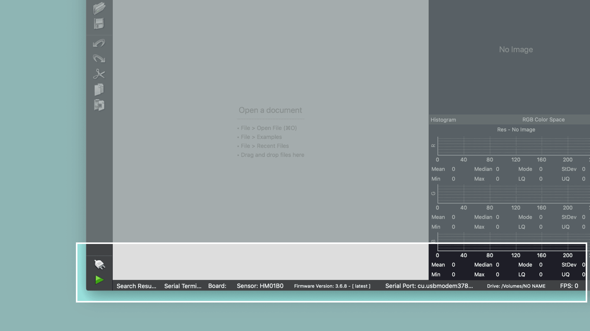
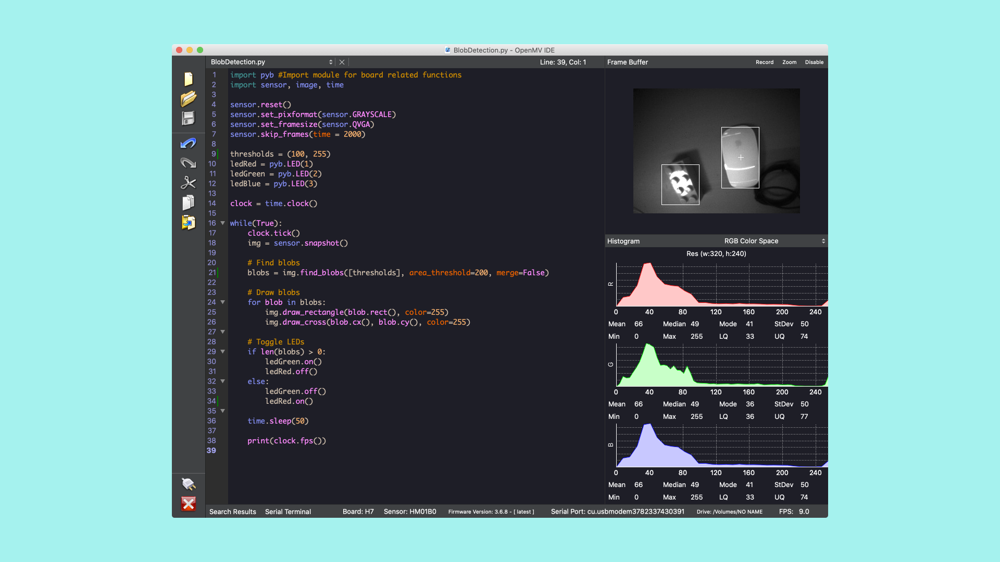

## Overview
In this tutorial you will use the Portenta Vision Shield to detect the presence and the position of objects in a camera image. To achieve this goal, you will use a technique that is often referred to as blob detection. You will write a MicroPython script and run it on the Portenta H7 with the help of the OpenMV IDE.

## Goals

- How to use the OpenMV IDE to run MicroPython on Portenta
- How to use the built-in blob detection OpenMV algorithm
- How to use MicroPython to toggle the built-in LEDs

### Required Hardware and Software

- [Portenta H7 board](https://store.arduino.cc/portenta-h7)
- [Arduino Portenta Vision Shield - Ethernet](https://store.arduino.cc/products/arduino-portenta-vision-shield-ethernet)
- [USB-C® cable](https://store.arduino.cc/products/usb-cable2in1-type-c)
- [Arduino IDE 1.8.10+](https://www.arduino.cc/en/software) or [Arduino IDE 2.0+](https://www.arduino.cc/en/software)
- Portenta Bootloader Version 20+
- OpenMV IDE 2.6.4+

## Portenta and the OpenMV IDE
The OpenMV IDE is built for Machine Vision applications. It is meant to provide an Arduino like experience for simple computer vision tasks using a camera sensor. OpenMV comes with its own firmware that is built on MicroPython. Among other hardware, it supports the Portenta board. A statement from the creators of OpenMV on the reason why they built it:

>Currently, doing anything serious involving computer vision requires a computer running an operating system running many layers of software and requiring much setup before you can get computer vision code working. This is all well and fine if you need to do many other things than just processing images, like connecting to the internet, running many different applications concurrently, etc.
>
>But, what if, I just want to make an LED turn on if a red object appears in front of a white wall. Why do a need to build up a complex system for that? Or, what if I just want to turn on an LED when a face is in view?

This is where OpenMV comes in. [Here](https://openmv.io/) you can read more about the OpenMV IDE.

## Instructions

### Configuring the Development Environment
Before you can start programming OpenMV scripts for the Portenta you need to download and install the OpenMV IDE.

***IMPORTANT: Before you connect the Portenta to the OpenMV IDE make sure you update the bootloader as explained in the "Flashing the OpenMV Firmware" section!***

### 1. Downloading the OpenMV IDE
Open the [OpenMV download](https://openmv.io/pages/download) page in your browser and download the version that you need for your operating system. Alternatively you may use the following direct download links of the OpenMV IDE 2.6.5:

- [For Windows Xp, Vista, 7, 8, 10 or Later](https://github.com/openmv/openmv-ide/releases/download/v2.6.5/openmv-ide-windows-2.6.5.exe)
- [For OsX Snow Leopard 10.6 or Later](https://github.com/openmv/openmv-ide/releases/download/v2.6.5/openmv-ide-mac-2.6.5.dmg)
- [For Ubuntu 12.04 Lts 32-Bit or Later](https://github.com/openmv/openmv-ide/releases/download/v2.6.5/openmv-ide-linux-x86-2.6.5.run)
- [For Ubuntu 12.04 Lts 64-Bit or Later](https://github.com/openmv/openmv-ide/releases/download/v2.6.5/openmv-ide-linux-x86_64-2.6.5.run)
- [For Raspberry Pi 0, 1, 2, 3, and 4 or Later](https://github.com/openmv/openmv-ide/releases/download/v2.6.5/openmv-ide-linux-arm-2.6.5.tar.gz)


Follow the instructions of the installer.

### 2. Flashing the OpenMV Firmware

Connect the Portenta to your computer via the USB-C® cable if you haven't done so yet. Make sure you first update the bootloader to the latest version using the **STM32H747_updateBootloader** sketch in the examples menu in the Arduino IDE. 

Instructions on how to update the bootloader can be found in the [Updating the Portenta Bootloader](https://docs.arduino.cc/tutorials/portenta-h7/updating-the-bootloader) tutorial.

***In bootloader versions 17 and older, there was a bug that could put the Portenta in a boot loop when the transmission aborted while flashing a large firmware file. This was fixed in the bootloader version 18. We strongly advise to update the bootloader before you proceed with the next step of this tutorial!***

After updating the bootloader, put the Portenta in bootloader mode by double pressing the reset button on the board. The built-in green LED will start fading in and out. Now open the OpenMV IDE.


Click on the "connect" symbol at the bottom of the left toolbar. 


A pop-up will ask you how you would like to proceed: "DFU bootloader(s) found. What would you like to do?". Select "Reset Firmware to Release Version". This will install the latest OpenMV firmware on the Portenta. If it asks you whether it should erase the internal file system you can click "No".


Portenta's green LED will start flashing while the OpenMV firmware is being uploaded on the board. A terminal window will open showing you the upload progress. Wait until the green LED stops flashing and fading. You will see a message saying "DFU firmware update complete!" when the process is done.

***Installing the OpenMV firmware will overwrite any existing sketches in the internal Flash of Portenta. As a result the M7 port will not be exposed in the Arduino IDE anymore. To re-flash the M7 with an Arduino firmware, you need to put the board into bootloader mode. To do so, double press the reset button on the Portenta H7 board. The built-in green LED will start fading in and out. In bootloader mode you will see the Portenta M7 port again in the Arduino IDE.***

The Portenta will start flashing its blue LED when it is ready to be connected. After confirming the completion dialog, the Portenta should already be connected to the OpenMV IDE, otherwise click the "connect" button once again.




## Blob Detection

In this section you will learn how to use the built-in blob detection algorithm to detect the location of objects in an image. That algorithm allows to detect areas in a digital image that differ in properties, such as brightness or color compared to surrounding areas. These areas are called blobs.

To do so, you need to feed an image from the camera to the algorithm. It will then analyze it and output the coordinates of the found blobs. You will visualize these coordinates directly on the image and indicate whether a blob was found by using the red and green LED.

### 1. Prepare the Script

Create a new script by clicking the "New File" button in the toolbar on the left side. Import the required modules:

```python
import pyb # Import module for board related functions
import sensor # Import the module for sensor related functions
import image # Import module containing machine vision algorithms
import time # Import module for tracking elapsed time
```

A module in Python® is a confined bundle of functionality. By importing it into the script, it gets made available.

### 2. Preparing the Sensor

In order to take a snapshot with the camera, it has to be configured in the script.

```python
sensor.reset() # Resets the sensor
sensor.set_pixformat(sensor.GRAYSCALE) # Sets the sensor to grayscale
sensor.set_framesize(sensor.QVGA) # Sets the resolution to 320x240 px
sensor.skip_frames(time = 2000) # Skip some frames to let the image stabilize
```

The most relevant functions in this snipped are `set_pixformat` and `set_framesize`. The camera that comes with the Portenta Vision Shield only supports grey scale images. Therefore, you need to set it via the `sensor.GRAYSCALE` parameter.

The resolution of the camera needs to be set to a supported format both by the sensor and the algorithm. Algorithms which use a neural network are usually trained on a specific image resolution, to make them sensitive to the provided image snapshot resolution. The Portenta Vision Shield supports `QVGA`, which you will use in this tutorial.

### 3. Detecting Blobs

In order to feed the blob detection algorithm with an image, you have to take a snapshot from the camera or load the image from memory (e.g. SD card or internal Flash). In this case, you will take a snapshot using the `snapshot()` function. The resulting image needs then to be fed to the algorithm using the `find_blobs` function. You will notice that a list of tuples gets passed to the algorithm. In this list, you can specify the grey scale values (brightness) that are mostly contained in the object that you would like to track. For instance, if you wanted to detect white objects on a black background, the resulting range of brightness would be very narrow (e.g. from 200 - 255). Remember that 255 denotes the maximum brightness / white and 0 corresponds to the minimum brightness / black. If you are interested in a wider range of grey scale values to detect various objects, you can set the threshold range for example to (100, 255).

```python
thresholds = (100, 255) # Define the min/max gray scale values you are looking for
img = sensor.snapshot() # Takes a snapshot and saves it in the memory

# Find blobs with a minimal area of 15x15 = 200 px
# Overlapping blobs will not be merged
blobs = img.find_blobs([thresholds], area_threshold=225, merge=False)
```

Once the blobs are detected, you may be interested to see where they have been found in the images. This can be done by drawing directly on the camera image.

```python
# Draw blobs
for blob in blobs:
    # Draw a rectangle where the blob was found
    img.draw_rectangle(blob.rect(), color=255)
    # Draw a cross in the middle of the blob
    img.draw_cross(blob.cx(), blob.cy(), color=255)
```

The result of that will be visible in the Frame Buffer preview panel on the right side of the OpenMV IDE.

### 4. Toggling LEDs

What if you want some visual feedback from the blob detection without any computer connected to your Portenta? You could use for example the built-in LEDs to indicate whether or not a blob was found in the camera image. Let's initialize the red and the green LEDs with the following code:

```python
ledRed = pyb.LED(1) # Initializes the red LED
ledGreen = pyb.LED(2) # Initializes the green LED
```

And then add the logic that will turn on the appropriate LED if a blob is present. This part of the code will be added after the "Draw Blobs" logic.

```python
# Turn the green LED on if a blob was found
if len(blobs) > 0:
    ledGreen.on()
    ledRed.off()
else:
# Turn the red LED on if no blob was found
    ledGreen.off()
    ledRed.on()
```

In this example, the green LED will light up when there is at least one blob found in the image. The red LED will light up if no blob could be found.

### 5. Uploading the Script
Let's program the Portenta with the complete script and test if the algorithm works. Copy the following script and paste it into the new script file that you created.

```python
import pyb # Import module for board related functions
import sensor # Import the module for sensor related functions
import image # Import module containing machine vision algorithms
import time # Import module for tracking elapsed time

sensor.reset() # Resets the sensor
sensor.set_pixformat(sensor.GRAYSCALE) # Sets the sensor to grayscale
sensor.set_framesize(sensor.QVGA) # Sets the resolution to 320x240 px
sensor.skip_frames(time = 2000) # Skip some frames to let the image stabilize

thresholds = (100, 255) # Define the min/max gray scale values we're looking for
ledRed = pyb.LED(1) # Initializes the red LED
ledGreen = pyb.LED(2) # Initializes the green LED

clock = time.clock() # Instantiates a clock object

while(True):
    clock.tick() # Advances the clock
    img = sensor.snapshot() # Takes a snapshot and saves it in memory

    # Find blobs with a minimal area of 15x15 = 225 px
    # Overlapping blobs won't be merged
    blobs = img.find_blobs([thresholds], area_threshold=225, merge=False)

    # Draw blobs
    for blob in blobs:
        # Draw a rectangle where the blob was found
        img.draw_rectangle(blob.rect(), color=255)
        # Draw a cross in the middle of the blob
        img.draw_cross(blob.cx(), blob.cy(), color=255)

    # Turn the green LED on if a blob was found
    if len(blobs) > 0:
        ledGreen.on()
        ledRed.off()
    else:
    # Turn the red LED on if no blob was found
        ledGreen.off()
        ledRed.on()

    pyb.delay(50) # Pauses the execution for 50ms
    print(clock.fps()) # Prints the framerate to the serial console


```

Click on the "Play" button at the bottom of the left toolbar. Place some objects on your desk and check if the Portenta can detect them.

***The MicroPython script does not get compiled and linked into an actual firmware. Instead it gets copied to the internal Flash of the Portenta where it gets compiled and executed on the fly.***



## Conclusion

In this tutorial you learned how to use the OpenMV IDE to develop MicroPython scripts that can run on the Portenta board. You also learned how to configure the camera of the Portenta Vision Shield for machine vision applications in OpenMV. Last but not least, you learned how to interact with the built-in LEDs in MicroPython on the OpenMV firmware.  

### Next Steps

-   Familiarize yourself with the OpenMV IDE. There are many other features that have not been mentioned in this tutorial (e.g. the Serial Terminal).
-   Try out other machine vision examples that come with the OpenMV IDE (e.g. Face Detection). You can find them in the "Examples" menu.

## Troubleshooting

### OpenMV Firmware Flashing Issues

- If the upload of the OpenMV firmware fails during the download, put the board back in bootloader mode and try again. Give it a few trials until the firmware gets successfully uploaded.
- If the upload of the OpenMV firmware fails without even starting, try uploading the latest firmware using the "Load Specific Firmware File" option. You can find the latest firmware on the [OpenMV Github repository](https://github.com/openmv/openmv/releases). Look for a file called **firmware.bin** in the PORTENTA folder.
- If you experience issues putting the board into bootloader mode, make sure you first updated the bootloader to the latest version using the **STM32H747_updateBootloader** sketch from the examples menu in the Arduino IDE.
- If the camera cannot get recognized by the OpenMV IDE or if you see a "No OpenMV Cams found!" message, press the reset button on the Portenta once and wait until you see the blue LED flashing. Then try again connecting to the board.
- If you see a "OSError: Reset Failed" message, reset the board by pressing the reset button. Wait until you see the blue LED flashing, connect the board to the OpenMV IDE and try running the script again.
