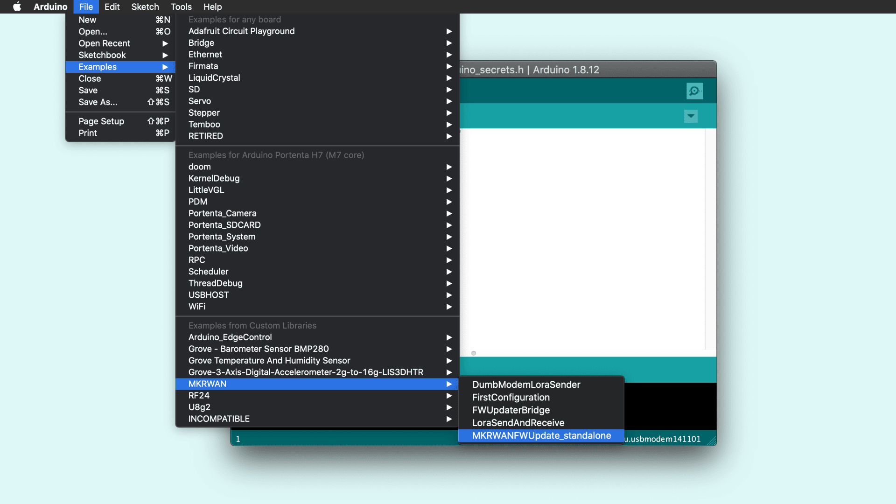
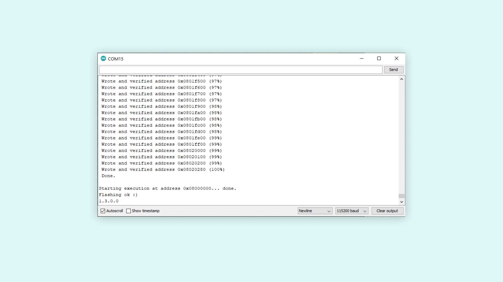
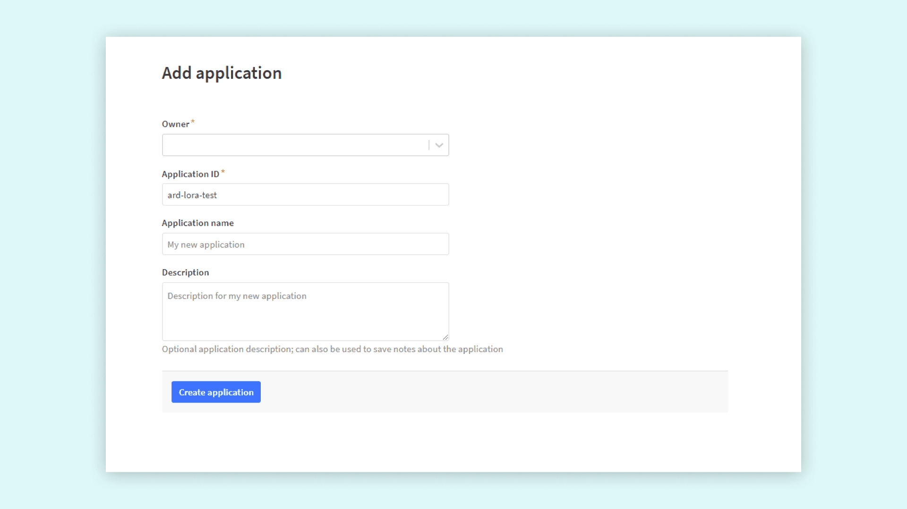
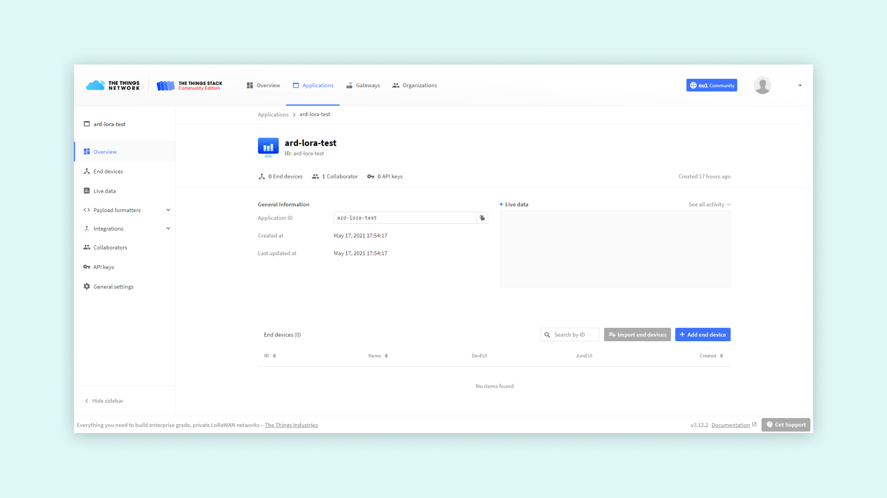
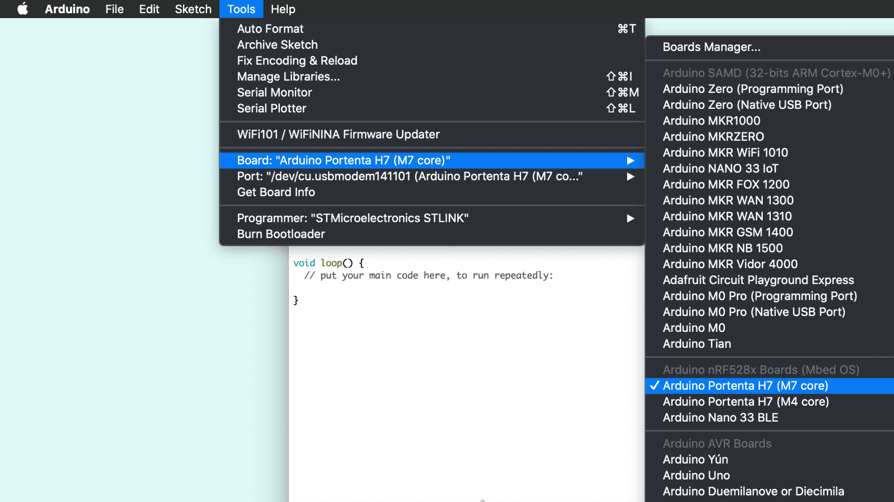
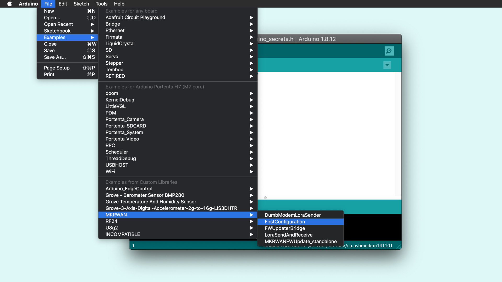
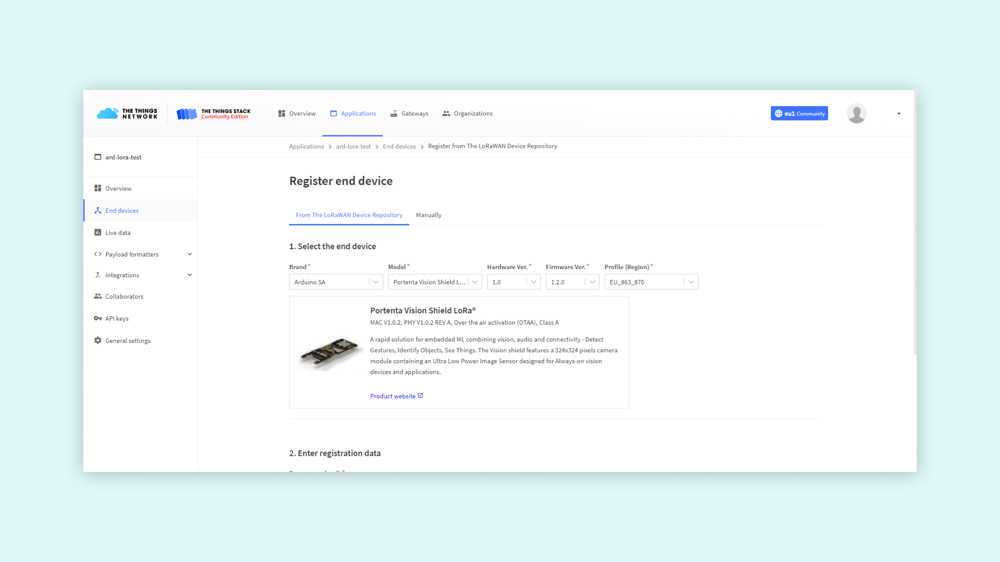
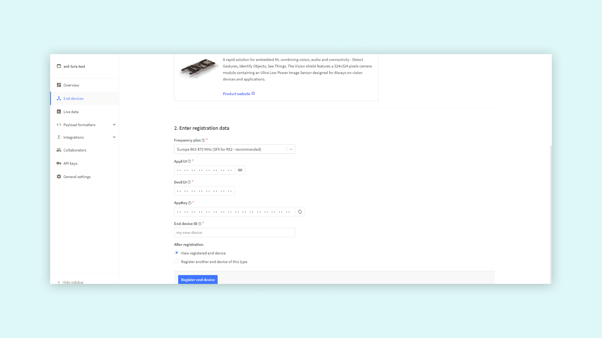
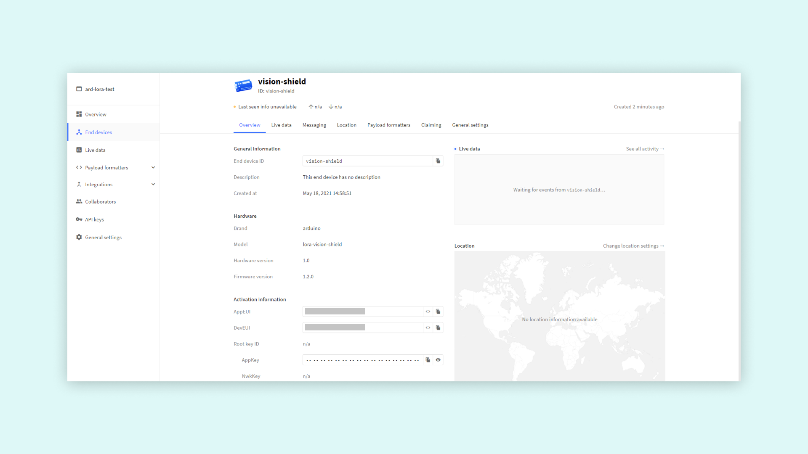

## Overview 

This tutorial explains how to connect your Portenta H7 to The Things Network (TTN) using the the Portenta Vision Shield's LoRa® Connectivity feature. A data communication channel will be enabled between the H7 and a TTN application that will be configured on your TTN console.

***In order to connect your Portenta to the TTN, make sure you are within the range (max. 10 Km) from an available LoRa® Gateway. Indoor gateways will have a much shorter range. It is recommended that you check LoRa Gateway availability on [The Things Network map](https://www.thethingsnetwork.org/map) before you try this tutorial.***

## Goals

- About LoRa® technology and The Things Network,
- About creating a TTN application,
- How to establish a connection between the Portenta H7 and the TTN.

### Required Hardware and Software

- [Portenta H7](https://store.arduino.cc/portenta-h7)
- [Portenta Vision Shield with LoRa® technology](https://store.arduino.cc/portenta-vision-shield-lora)
- [Dipole Pentaband antenna](https://store.arduino.cc/antenna) or a UFL Antenna of the H7 (x1)
- [Arduino IDE 1.8.10+](https://www.arduino.cc/en/software), [Arduino IDE 2.0+](https://www.arduino.cc/en/software), or the [Arduino Cloud Editor](https://create.arduino.cc/editor)
- [USB-C® cable](https://store.arduino.cc/products/usb-cable2in1-type-c)
- An [account](https://console.cloud.thethings.network/) with The Things Network

### Updating the LoRa® Module Firmware
To be able to use the LoRa® functionality, we need to first update the firmware on the LoRa modem. This can be done through Arduino IDE by running a sketch included in the examples from the MKRWAN library.

1. Connect the Portenta H7 and the Portenta Vision Shield - LoRa® to your computer and open the Arduino IDE. 
2. Install/update the **MKRWAN** library from Arduino IDE menu  **Tools > Manage Libraries**. Type "MKRWAN" to find the library and click 'Install' or 'Update' if necessary. This library provides all the APIs to establish LoRa® connectivity.
3. Open the **MKRWANFWUpdate_standalone** sketch from the Arduino IDE  menu: **File > Examples > MKRWAN**.

4. Upload the sketch.




5. Open the Serial Monitor and wait for the update to be confirmed.



## Connecting to the TTN

The Portenta Vision Shield with LoRa® technology can be connected to the TTN and can transmit data to other devices connected to this network through a secure channel. This channel is nothing but an application on the TTN network dedicated for your board. In this tutorial, you will be guided through a step-by-step process of setting up your Portenta board and the Vision Shield with LoRa technology to communicate with a TTN application. As stated before, to be able to follow this guide, you need to be under coverage of one of the TTN gateways. You can check for [the coverage](https://www.thethingsnetwork.org/map) now if you have not done so yet.

### 1. Setting up the Environment

Start by going [here](https://console.cloud.thethings.network/). First choose your region. Next, sign in with your The Things Network account. If you do not have an account, create a new one on the login page. Then fill all the required fields to complete a new registration.


### 2. Creating an App on TTN

Once you have created an account with TTN, you need to create a TTN [application](https://www.thethingsnetwork.org/docs/applications/). An application provides a way to aggregate data from different devices, and then use these data with other 3rd party integrations. After signing in, click on **Create an application**, or **Go to applications** if you already have created one.


Here you will have a list of all your applications. Now create your first app by pressing the **Create an application** button.

You have now to fill only the first two fields:

- The first one is the **Owner** of your app, it will automatically have you as the owner.
- The second one is the **ID** of your app: this must be lowercase and without spaces.



After completing these two fields, press the "Create application" button located at the bottom left corner of the page. The dashboard will then show you an overview of the newly created app.



Let's take a closer look at these sections:

- **Application Overview**: in order to use this app, you will need the Application ID and a device specific AppKey. An EUI is a globally unique identifier for networks, gateways applications and devices. The EUIs are used to identify all parts of the LoRa®-based network inside the backend server.
- **End devices**: here you can see and manage all the associated devices (e.g. your Portenta H7 with Portenta Vision Shield with LoRa® technology, Arduino MKR WAN 1300 or MKR WAN 1310), or proceed with the registration of a new one. Registering a new device lets you generate an AppEUI and an AppKey.
- **Collaborators**: here you can see and manage all the app collaborators, to integrate with other collaborative platforms or to manage access rights to the app with other TTN registered profiles.
- **API keys**: here you can create an API key, it is the most sensible information. It is basically the key to gain access to your app, so keep it safe.

### 3. Configuring the Portenta Vision Shield

It iss now time to connect your Portenta H7 and  Portenta Vision Shield with LoRa® technology to TTN. You will need to upload code to the board, so, as you probably already know, there are two options:

- Use the [Arduino Cloud Editor](https://create.arduino.cc/editor) 
- Use the [Arduino IDE](https://www.arduino.cc/en/software), (this is the option this guide will follow)

Plug the Portenta Vision Shield with LoRa® technology to the Portenta H7 and them to your PC through the USB port. Be sure to have selected the right board "Arduino Portenta H7 (M7 core)" and the right port.



The LoRa® module on the Portenta Vision Shield with LoRa technology can be accessed by using the [MKRWAN library](https://github.com/arduino-libraries/MKRWAN)(if you cannot find it in your examples list, you can go to **Tools > Library Manager** and type "MKRWAN library" to install it). This library provides all the APIS to establish LoRa connectivity and can be installed from the library Manager. The first code you need to upload and run is from the **MKRWAN** library, and its name is **FirstConfiguration**.



The only line you may need to change before uploading the code is the one that sets the frequency. Set the frequency code according to your country if needed. You can find more information about frequency by country at [this TTN link](https://www.thethingsnetwork.org/docs/lorawan/frequency-plans/).

```cpp
// change this to your regional band (eg. US915, AS923, ...)
 if (!modem.begin(EU868)) {    ...
```
***Consider that in Australia the boards connect correctly to TTN gateways on AS923 frequencies; AU915 frequencies requires the selection of sub band 2, not yet implemented in the firmware.***

Once you have added to the sketch the frequency according to your country, you can upload it to the board. Then, when the upload is completed, open the Serial Monitor. The following details will show up:

```
Your module version is: ARD-078 1.2.1
Your device EUI is: a8xxxxxxxxxxxxxx
Are you connecting via OTAA (1) or ABP (2)?
```

In order to select the way in which the board is going to connect with TTN  (OTAA or ABP), you need to configure it on the TTN portal. You will see which option you should select in the following steps.

### 4. Registering the Portenta on TTN

Before your Portenta H7 can start communicating with the TTN, you need to [register](https://www.thethingsnetwork.org/docs/devices/registration/) the board with an application. Go back to the TTN portal and scroll to **End devices** section on your Application dashboard, then click **Add end device**.


On the registration page, first you have to fill in information about your board. Select brand Arduino SA, and Portenta Vision Shield with LoRa® technology as the model. Hardware and firmware versions will automatically be set to the newest ones. Then set your preferred region.



In the second step of device registration, enter the **JoinEUI** as a sequence of zeros or enter your own **JoinEUI**. Then, fill in the **DevEUI** with the device ID obtained from the serial monitor. You can click the Generate button next to the AppKey field to generate an application key for this device. The end device ID is automatically prefilled using the **DevEUI**. Finally, click **Register** on the end device to validate the registration.

***__Note__: The Device ID must be lowercase and without spaces. The __DevEUI__ should be copied from the IDE's Serial Monitor.***



After pressing the Register button, your board will show up on the **Device Overview** page. You can now see all the information needed to complete the Arduino setup.



### 5. Connecting to TTN

Once your board has been registered you can send information to TTN. Let's come back to the Serial Monitor and proceed. It will ask for:

- Activation mode (that, in this case, is OTAA),
- The Application EUI
- The App Key.

Lets start by making a connection Over-The-Air (OTA). Enter "1" in the Serial Monitor input box and press ENTER. Then, find the EUI and the App key from TTN **Device Overview** page. You can read more into OTA vs ABP activation mode [here](https://www.thethingsindustries.com/docs/).

```
Your module version is: ARD-078 1.1.9
Your device EUI is: a8xxxxxxxxxxxx0a
Are you connecting via OTAA (1) or ABP (2)?
Enter your APP EUI
Enter your APP KEY
```

Next, introduce the **APP EUI** and the **APP KEY** in the Serial Monitor. If this process is done successfully, you will see this message:

```
Message sent correctly!
```

## Conclusion

If you receive this message, you have managed to configure the Portenta H7 and the Portenta Vision Shield with LoRa® technology on TTN.

You have retrieved the device EUI, used it to register the device in the TTN console, and programmed the board using the data provided by TTN. Now, you can send data over the LoRa®-based network which can be viewed from anywhere in the world (as long as we have an Internet connection and your device is in the range of a TTN gateway).

### Next Steps

- Try sending uplink and downlink messages between Portenta and your TTN application with **LoraSendAndReceive** sketch from the MKRWAN library.
- Experiment your board's capabilities with OpenMV and the examples from the dedicated library for Arduino. You can continue with [this tutorial](https://docs.arduino.cc/tutorials/portenta-h7/getting-started-openmv-micropython) from the Arduino Documentation site.
-  Combine LoRa® protocol with an OpenMV example to develop your own IoT application. Take advantage of the board's camera to detect, filter, classify images, read QR codes or more.     

## Troubleshooting

The most common issue is that the device cannot connect to a TTN gateway. Again, it is a good idea to check if you have coverage in the area you are conducting this tutorial, by checking out [this map](https://www.thethingsnetwork.org/map).

If you are within good range of a gateway, you should also try to move your device and antenna to a window, and even hold it out the window and move it around. This has proven successful on numerous accounts, as the signal can travel less obstructed.

## Trademark Acknowledgments

- **LoRa®** is a registered trademark of Semtech Corporation.