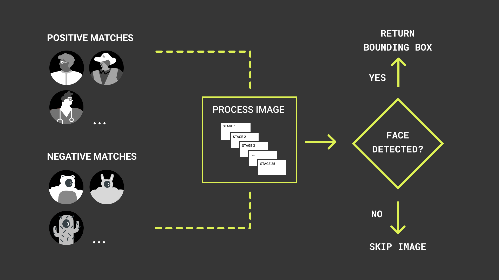
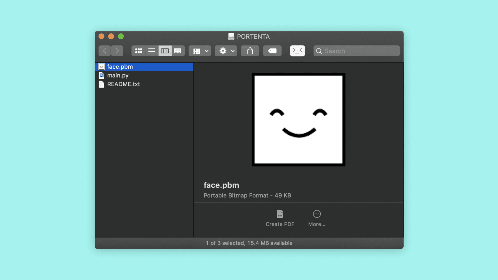
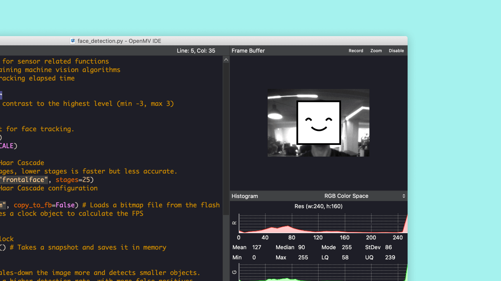

## Overview
In this tutorial you will build a MicroPython application with OpenMV, to use the Portenta Vision Shield to detect faces and overlay them with a custom bitmap image. Think of it as building your own camera filter that puts a smile on every face it detects. This tutorial is based on the face detection example that comes with the OpenMV IDE.

## Goals

- How to use the OpenMV IDE to run MicroPython on Portenta
- How to use the built-in face detection algorithm of OpenMV
- Copying files to the internal Flash of the Portenta
- Using MicroPython to read files from the internal Flash

### Required Hardware and Software

- [Portenta H7](https://store.arduino.cc/portenta-h7)
- [Portenta Vision Shield](https://store.arduino.cc/portenta-vision-shield)
- USB-C® cable (either USB-A to USB-C® or USB-C® to USB-C®)
- Arduino IDE 1.8.10+  or Arduino Pro IDE 0.0.4+ 
- Portenta Bootloader Version 20+
- OpenMV IDE 2.6.4+

## The Haar Cascade Algorithm

By harnessing the power of machine vision algorithms, objects can be detected in a camera stream. Those algorithms can be trained to detect the desired type of object. In this tutorial, you will use a machine learning based approach called Haar Cascade to detect faces.



This approach uses a cascade algorithm that has multiple stages, where the output from one stage acts as additional information for the next stage in the cascade. The different stages are responsible for detecting edges, lines, contrast checks and calculating pixel values in a given image. Larger areas of the image are checked first in the earlier stages, followed by more numerous and smaller area checks in later stages. The Haar Cascade function provided by OpenMV allows to specify the amount of stages. Fewer stages make the detection faster, while leading to more false positives.

The built-in Haar Cascade model for faces was trained with hundreds of images containing faces that are labeled as such and images that do not contain faces labeled differently. That allows the algorithm to distinguish such images after it is being trained.

## Instructions

### Creating the Face Detection Script

For this tutorial, you will be using the OpenMV IDE along with the OpenMV firmware on your Portenta H7 to build the face detection script. If this is your first time using the Portenta Vision Shield and OpenMV, we recommend you to take a look at the "Configuring the Development Environment" section inside the [Blob Detection tutorial](https://docs.arduino.cc/tutorials/portenta-vision-shield/blob-detection) to configure the development environment. 

### 1. The Basic Setup

Attach your Portenta Vision Shield to your Portenta H7 and open the **OpenMV** Editor. For this tutorial, you will create a new script that is based on the face detection example provided by OpenMV. Create a new script by clicking the "New File" button in the toolbar on the left side and save it as **face_detection.py**.

### 2. Importing the Modules

The script starts by importing the  `sensor`, `image` and  `time` modules for handling the camera sensor, using machine vision algorithms and time tracking functions.

```python
import sensor # Import the module for sensor related functions
import image # Import module containing machine vision algorithms
import time # Import module for tracking elapsed time
```

### 3. Preparing the Sensor

The next step is to calibrate the camera sensor to achieve the best results using the `sensor` module. You can use the `set_contrast()` function to set the contrast of the sensor to its highest value (3). This can help the algorithm identifying lines and edges more easily. `set_gainceiling()` controls the amplification of the signal from the camera sensor including any associated background noise. For maximizing the detection success rate, it is recommended to set the camera frame size to `HQVGA`.

```python
# Sensor settings
sensor.set_contrast(3)
sensor.set_gainceiling(16)
sensor.set_framesize(sensor.HQVGA)
sensor.set_pixformat(sensor.GRAYSCALE)
```

### 4. Finding the Face Features

OpenMV provides a Haar Cascade class ready to be used with the Portenta Vision Shield's camera. The function [`image.HaarCascade(path, number of stages)`](https://docs.openmv.io/library/omv.image.html#class-Haarcascade-feature-descriptor) is used to load a Haar Cascade model into memory. The `path` parameter can be used to either specify the location of a custom Haar Cascade model or to use the built-in `frontalface` model. The `stages` parameter is use to specify the desired Haar Cascade stages.

***Remember: Fewer stages make the detection faster while leading to more false positives.***

```python
face_cascade = image.HaarCascade("frontalface", stages=25)
print(face_cascade) # Prints the Haar Cascade configuration
```

### 5. Displaying a Bitmap Image

Once you know the location of the faces in the camera image, you can overlay them with an image of your choice. OpenMV currently supports bmp, pgm or ppm image formats. Image formats with an alpha layer such as PNG are not supported yet.

In this tutorial you will use a preloaded smiley image in the monochrome [Portable Bitmap Image](https://en.wikipedia.org/wiki/Netpbm) (.pbm) format. This format consists of a matrix of zeroes and ones denoting black and white pixels. 1 stands for a black pixel, 0 for a white one. If you want to create your custom image, make sure you save it in one of the supported bitmap formats (bmp, pgm or ppm). You may use an image editor of your choice which supports exporting images in one of these formats. For this tutorial Adobe Photoshop was used.

Connect your Portenta board to your computer if you have not done so yet. Make sure you are running the OpenMV firmware on the Portenta. If you have not installed the OpenMV firmware yet, take a look at the "Configuring the Development Environment" section which explains how to proceed in that case. 

Download [this file](assets/face.pbm) containing the smiley bitmap and copy it to the Flash drive that was mounted when you connected the Portenta running the OpenMV firmware.

***The on-board memory gets mounted as a Flash drive. Therefore this will work even if you have not inserted an SD card.***



Load the image into a variable called `faceImage` using the `Image()` function from the `image` module. The initial slash refers to the root directory of the Flash drive. In order to use the image as an overlay to the camera stream, instead of directly displaying it, set the `copy_to_fb` to False such that it does not get copied into the frame buffer automatically.

```python
faceImage = image.Image("/face.pbm", copy_to_fb=False)
```

Before drawing the image on top of the camera stream you need to figure out the scale ratio to match the detected face size in the camera stream. The provided bitmap image comes in a 128x128 px resolution. You can calculate the correct scale ratio with the following formula:

```python
faceX = boundingBox[0]
faceY = boundingBox[1]
faceWidth = boundingBox[2]

# Calculates the scale ratio to scale the bitmap image to match the bounding box
scale_ratio = faceWidth / faceImage.width()        
```

You can then draw the scaled bitmap image on top of the camera image using the `draw_image` function:

```python
# Draws the bitmap on top of the camera stream
cameraImage.draw_image(faceImage, faceX, faceY, x_scale=scale_ratio, y_scale=scale_ratio)
```

### 6. Uploading the Script
Let's program the Portenta with the complete script and test if the algorithm works. Copy the following script and paste it into the new script file that you created.

```python
import sensor # Import the module for sensor related functions
import image # Import module containing machine vision algorithms
import time # Import module for tracking elapsed time

sensor.reset() # Resets the sensor
sensor.set_contrast(3) # Sets the contrast to the highest level (min -3, max 3)
sensor.set_gainceiling(16) # Sets the amplification of camera sensor signal

# HQVGA and GRAYSCALE are the best for face tracking.
sensor.set_framesize(sensor.HQVGA)
sensor.set_pixformat(sensor.GRAYSCALE)

# Load the built-in frontal face Haar Cascade
# By default this will use all stages, lower stages is faster but less accurate.
face_cascade = image.HaarCascade("frontalface", stages=25)
print(face_cascade) # Prints the Haar Cascade configuration

faceImage = image.Image("/face.pbm", copy_to_fb=False) # Loads a bitmap file from the flash storage
clock = time.clock() # Instantiates a clock object to calculate the FPS

while (True):
    clock.tick() # Advances the clock
    cameraImage = sensor.snapshot() # Takes a snapshot and saves it in memory

    # Find objects.
    # Note: Lower scale factor scales-down the image more and detects smaller objects.
    # Higher threshold results in a higher detection rate, with more false positives.
    boundingBoxes = cameraImage.find_features(face_cascade, threshold=1, scale_factor=1.5)

    # Draw objects
    for boundingBox in boundingBoxes:
        faceX = boundingBox[0]
        faceY = boundingBox[1]
        faceWidth = boundingBox[2]

        # Calculates the scale ratio to scale the bitmap image to match the bounding box
        scale_ratio = faceWidth / faceImage.width()
        # Draws the bitmap on top of the camera stream
        cameraImage.draw_image(faceImage, faceX, faceY, x_scale=scale_ratio, y_scale=scale_ratio)


    # Print FPS.
    # Note: The actual FPS is higher when not displaying a frame buffer preview in the IDE
    print(clock.fps())
```

Click on the "Play" button at the bottom of the left toolbar. Point the camera on the Portenta Vision Shield towards your face and check if the Portenta can detect it. Once it detects your face, it should be covered with a smiley. 



## Conclusion

In this tutorial you learned how to use OpenMV's built-in face detection algorithm which is based on Haar Cascade. Furthermore, you learned how to copy a file to the internal flash and how to load an image from the Flash into the memory. You have also learned how to draw an image on top of a snapshot from the camera stream.

### Next Steps
The [HaarCascade](https://docs.openmv.io/library/omv.image.html#class-Haarcascade-feature-descriptor) class provided by OpenMV can also detect other facial features such as eyes. For example you could tweak your **face_detection.py** script to detect your eyes simply by changing the `path` parameter from `frontalface ` to `eye` which is also a built-in model. Go ahead and replace the following line in your script and try to figure out how to overlay your eyes with a bitmap image of an eye. 

```python 
face_cascade = image.HaarCascade("eye", stages=25)
```

## Troubleshooting

### Face Detection Issues

- If OpenMV cannot detect your face, try moving the camera further away or position yourself in front of a wall or another plain background.

### Bitmap Loading Issues

- If you have troubles loading a custom bitmap image, try with the pbm format and try scaling it down to a smaller size such as 128x128 pixels.
