## Overview 

This tutorial teaches you how to train a custom machine learning model with Edge Impulse® and how to run it using the Portenta Vision Shield. The Machine Learning (ML) model will use the TensorFlow Lite format and the classification example will run on OpenMV.

## You Will Learn

- To create datasets to be used for classification
- How to train a ML model in Edge Impulse®
- To use OpenMV to run a classification example

## Required Hardware and Software

- [Portenta H7 board](https://store.arduino.cc/portenta-h7)
- [Portenta Vision Shield - LoRa](https://store.arduino.cc/portenta-vision-shield-lora) or [Portenta Vision Shield - Ethernet](https://store.arduino.cc/products/arduino-portenta-vision-shield-ethernet)
- USB-C® cable (either USB-A to USB-C® or USB-C® to USB-C®)
- An [Edge Impulse®](https://studio.edgeimpulse.com/) account for training the ML model
- Fruits (or other objects) to create the classification model 🍏🍌🍐

## Machine Learning on the Edge

Machine learning on powerful computers has been around for a while. On microcontrollers, this is a rather new territory. Microcontrollers might not be able to run ML models to process high resolution images at high frame rates, but there are some interesting aspects. On one side, microcontrollers can run at very low power on batteries for a long time. You could even put the processor to sleep and only wake it up when the camera or one of the attached sensors registers activity. On the other side, ML models on a microcontroller can run without Internet connection as they do not need to upload data to the Cloud. This means that you can install distributed ML solutions in places where there is no Internet connection (Edge Computing). Additionally processing data locally means that data stay on the device, so that data privacy is ensured.

## The Edge Impulse® Platform

Edge Impulse® is a platform that simplifies the process of creating machine learning models, by choosing reasonable defaults for the countless parameters you need to set when creating a ML model. It provides a simple user interface that not only allows to train a ML model, but also to inspect the data and test the model.

## Training the ML Model

To train a ML model to classify an image we need to feed it with image data of that object. During the training process, the model will be trained using a concept called [supervised learning](https://en.wikipedia.org/wiki/Supervised_learning). This means that we train the model with known data and tell whether its predictions are correct or not while it is "practicing". This is similar to what happens when you tell a toddler who is pointing at a donkey saying "horse" and you tell them that it is actually a donkey. The next few times they see a donkey they may still get it wrong, but over time, under your supervision, they will learn to correctly identify a donkey. Conceptually, that is also how our ML model learns.

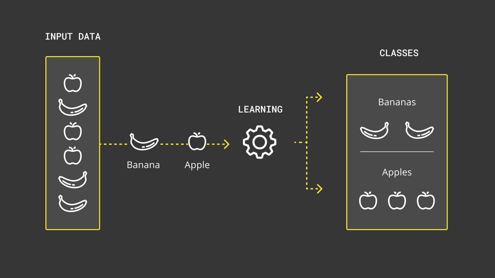

### 1. Creating a Data Set

The first step is to create a representative dataset of objects the ML model is supposed to identify. The key is to have as much diversity in the models as possible. If you show for example only one specific apple that has a certain size, shape and peel, then it will not be very good at recognizing other apples that look different. This is referred to as a bias and should be avoided as much as possible. In addition, you need to teach the model what an apple is not. For that purpose, you feed it random image data of things that are not an apple. You could name that class of image data "unknown". If you do not have such a class and the model has only seen an apple, it will not know what to do if there is no apple in the image.

Creating data sets in OpenMV is simple as there is a built-in function to create them. Before you proceed, connect your Portenta H7 board with the Portenta Vision Shield mounted. Click on the connect button in the OpenMV IDE. If you haven't set up your board with OpenMV yet, please consult the [getting started tutorial](https://docs.arduino.cc/tutorials/portenta-h7/getting-started-openmv-micropython).

Create a new dataset by using the menu command **Tools > Dataset Editor > New Dataset** and name it `Dataset-Fruits`.

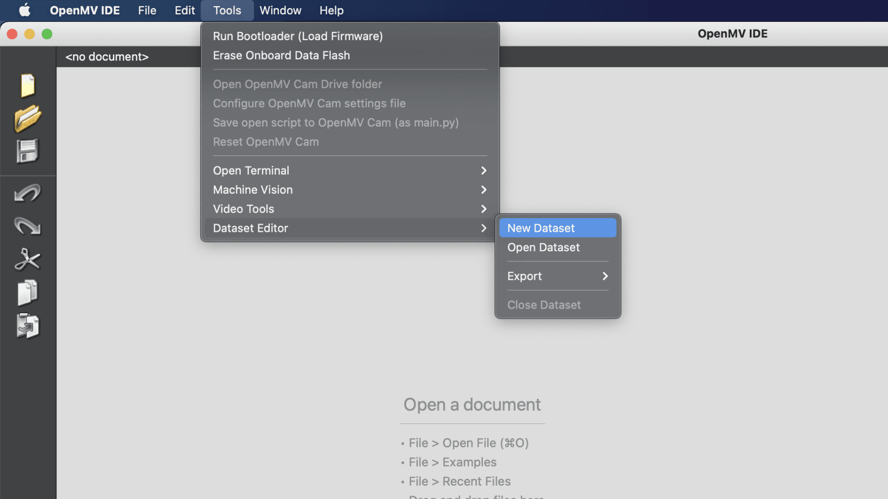

The next step is to create image classes. A class represents a unique type of object, in this case the type of fruit.

First, create a new image class and name it `apple` by clicking on "New Class Folder" in the toolbar. Now run the image capturing script that is already open by clicking the play button. Focus the apple with the camera and click on **Capture Data** to snap a picture of it. Capture it from different angles and with different backgrounds to make the recognition more robust later on. Repeat this for other fruits that you would like to classify (e.g. a pear and a banana). Add an `unknown` class and capture some images of different backgrounds that you would like to use during the classification later on.

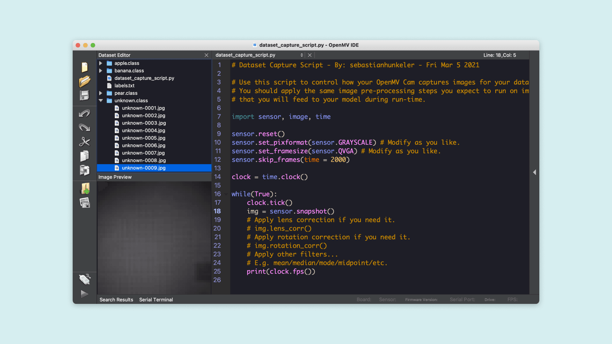

You may have also noticed that there is a label text file. This file is used to store a textual representation of the classes to later classify the objects and print the class names. The classes are added to that automatically.

### 2. Uploading the Data to Edge Impulse®
Now that all data is ready to be uploaded, you need to create a new Edge Impulse® project. If you have not registered an Edge Impulse® account yet, you may create one on [their website](https://studio.edgeimpulse.com/login). Log in to the Edge Impulse® Studio and create a new project named `Fruit-Detector`.

After that, you can go back to the OpenMV IDE and select **Tools > Dataset Editor > Export > Log in to Edge Impulse® Account and Upload to Project**. The OpenMV IDE will ask you for your Edge Impulse® login credentials. Select the project that you just created and click OK. Leave the data set split setting at the default. This will keep 20% of the images aside for testing the model once it has been trained. That allows you to assess how well your model performs at detecting the objects with data that it has not seen yet.

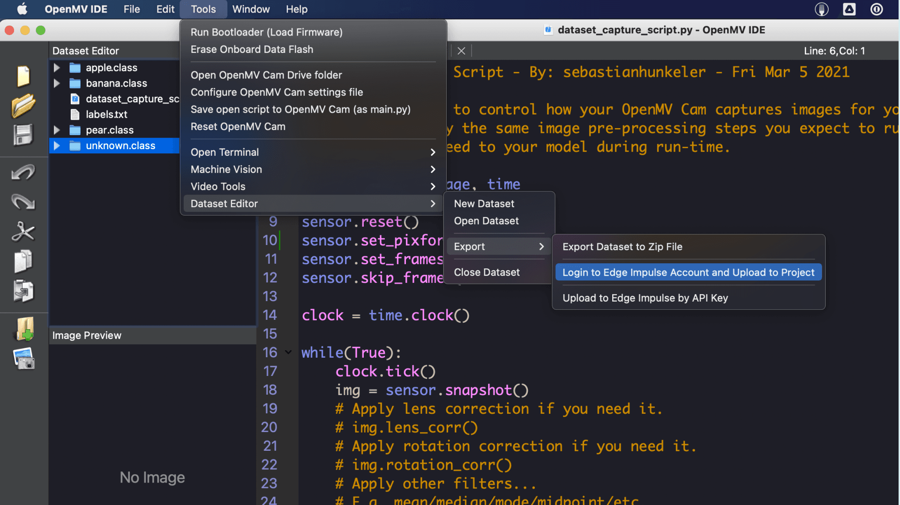


### 3. Acquire Data

Open your project in the Edge Impulse® studio and navigate to "Data Acquisition". You can see that the images have been uploaded and labeled according to the classes that you created. With this tool, you can browse through the image samples and remove the ones which you do not deem valuable for the training (e.g. if one of the images is too blurry).

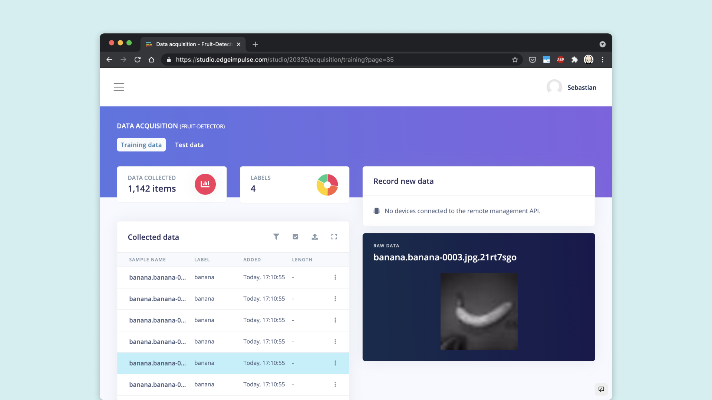

### 4. Create an Impulse

If you are happy with the data samples, you can move on to designing your impulse. An impulse is, in a nutshell, a recipe which the model is being trained with. It defines actions that are performed on your input data to make them better suited for machine learning and a learning block that defines the algorithm for the classification. In the menu, navigate to "Create Impulse" under "Impulse Design" and add an **Image** processing block as well as a **Transfer Learning** learning block.

It is recommended to adjust the image size to 48x48 for improved performance. You can try with higher resolutions, but you will notice that the frame rate during the classification will drop significantly. Click on Save Impulse to apply the adjusted settings.

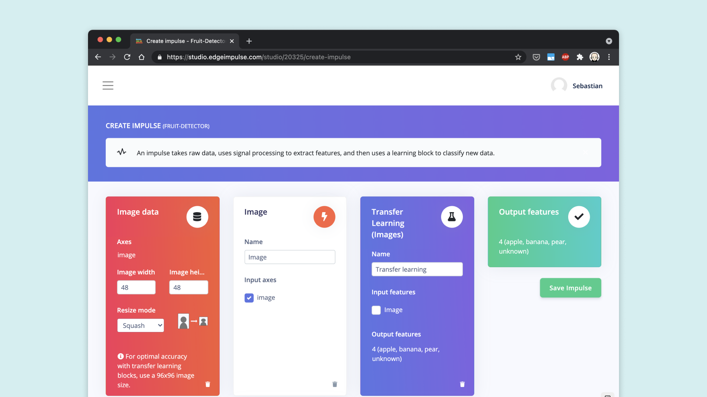


### 5. Generate Features

In this step, you will adjust the image settings and generate the features from the input data. Features are unique properties that will be used by the classification algorithm to detect the objects. A feature can be the round shape of an apple or the fact that an image of a banana has many bright pixels as bananas are mostly yellow.
In the menu, navigate to "Image" under "Impulse Design". Set the color depth to "Grayscale" and save the parameters as the Portenta Vision Shield features a grayscale camera. 

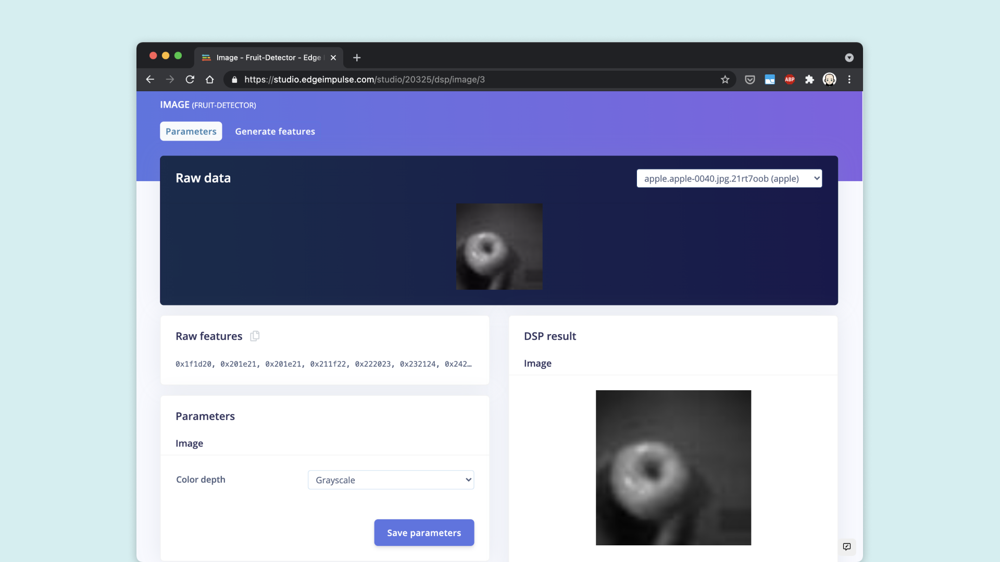

Then click on "Generate Features". The analysis process will take a while to complete depending on the amount of images that you uploaded. When it is done, you can inspect the results. On the right hand side you can see a visualization of the features in a 3D space. You can see that apples (blue dots) and pears (green dots) are somewhat hard to tell apart due to their round shape and therefore they have some overlapping data points in that visualization. A banana, on the other hand, is easier to distinguish as it looks quite different.

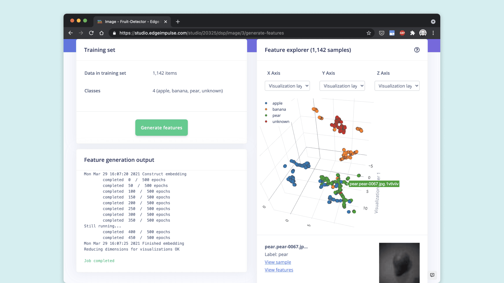

### 6. Train the Model

Now that the features of your image data are ready to be used for the actual training, you can navigate to "Transfer Learning" in the menu. In this example, you can leave the settings at their default value except of "Number of training cycles" which has to be increased to 60. This defines how many times the model is being trained. The model gets better with each cycle the same way you get better when learning how to ride a bike and you practice it the first couple of times. 

Click on "Start Training" to train the machine learning model. A small amount of images, the **validation set**, are put aside before the training starts to validate the trained model. Do not be confused with the **test set** which can be used to evaluate the final model. Once the training finishes, you will see some statistics on how well the model performed during validation. Ideally you get an accuracy of 100% for each object. If you get poor results, you may have some images which are not representative of the objects you are trying to classify and should be removed from the data set.

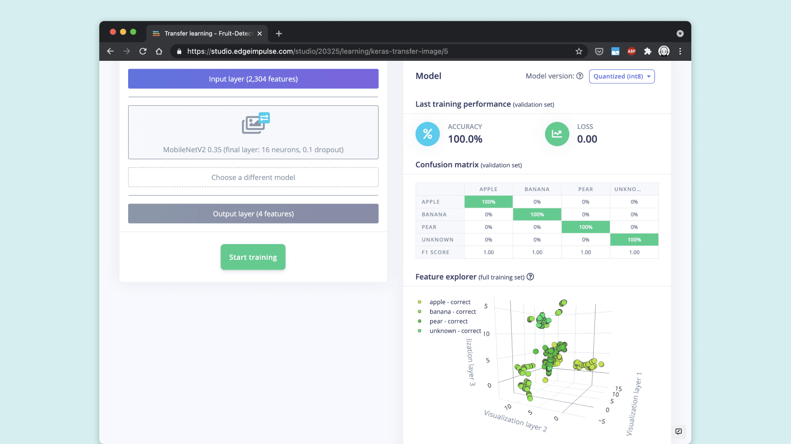

## Using the ML Model

The ML model is trained and already optimized to be used with microcontrollers. This is done automatically in the background through quantization. This is a process where the numbers in the machine learning models are constrained in their value range for improved performance, while sacrificing a bit of accuracy.

### Deploy

Deploying the ML model to the Portenta H7 is very simple. The Edge Impulse® Studio provides an export feature for OpenMV. Switch to the deployment section in the menu, select OpenMV under "Build firmware" and click "build". This will create an OpenMV compatible library that you can download as a zip file. Unzip it and copy **trained.tflite** and **labels.txt** to Portenta's Flash drive.

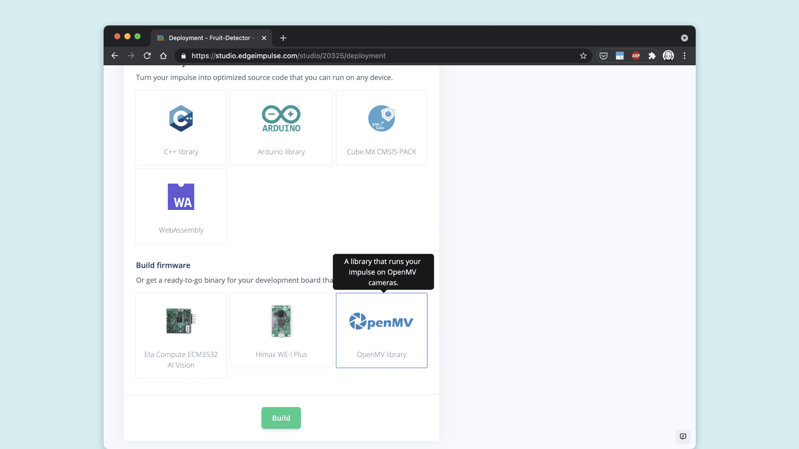

### Run the Script

The final step concerns running the **ei_image_classification.py** script. Open it in the OpenMV and replace the print statement in the innermost for loop with the following code:

```python
confidence = predictions_list[i][1]
label = predictions_list[i][0]
print("%s = %f" % (label[2:], confidence))

if confidence > 0.9 and label != "unknown":
    print("It's a ", label, "!")
```

This code will print a message saying e.g. "It's an apple!" in case the confidence is above 90%. In the following screenshot, you can see that the apple was detected with a confidence level of 1.0, which corresponds to 100%.

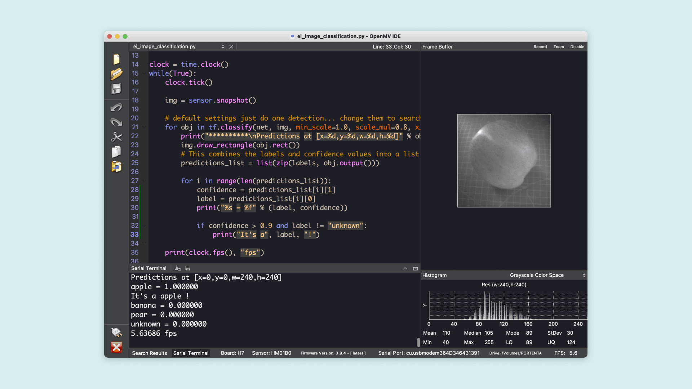

Try pointing the camera of the Portenta Vision Shield at any of your fruits or other objects that you used for the training and check if it can be recognized successfully.

The complete script of the classification example is as follows:

```python
import sensor, image, time, os, tf

sensor.reset()                         # Reset and initialize the sensor.
sensor.set_pixformat(sensor.GRAYSCALE) # Set pixel format to RGB565 (or GRAYSCALE)
sensor.set_framesize(sensor.QVGA)      # Set frame size to QVGA (320x240)
sensor.set_windowing((240, 240))       # Set 240x240 window.
sensor.skip_frames(time=2000)          # Let the camera adjust.

net = "trained.tflite"
labels = [line.rstrip('\n') for line in open("labels.txt")]

clock = time.clock()
while(True):
    clock.tick()

    img = sensor.snapshot()

    # default settings just do one detection... change them to search the image...
    for obj in tf.classify(net, img, min_scale=1.0, scale_mul=0.8, x_overlap=0.5, y_overlap=0.5):
        print("**********\nPredictions at [x=%d,y=%d,w=%d,h=%d]" % obj.rect())
        img.draw_rectangle(obj.rect())
        # This combines the labels and confidence values into a list of tuples
        predictions_list = list(zip(labels, obj.output()))

        for i in range(len(predictions_list)):
            confidence = predictions_list[i][1]
            label = predictions_list[i][0]
            print("%s = %f" % (label, confidence))

            if confidence > 0.9 and label != "unknown":
                print("It's a", label, "!")

    print(clock.fps(), "fps")
```

## Conclusion

You have learned about classification as a machine learning concept which categorizes a set of data into classes. You have also learned how supervised learning works and what model quantization means. Furthermore, you have learned to train a custom TFLite machine learning model and deploy it to your Portenta H7.

### Next Steps

One thing that we did not have a look at is testing the final model. In Edge Impulse® Studio there is a section for this called "Model Testing". It allows you to test the accuracy of your model with additional data that it has not seen yet. This gives you an opportunity to find out for which images the classification accuracy falls short. You can inspect individual images that are not correctly detected and decide whether additional data needs to be created to re-train the model for better accuracy on those images. You can also decide to move the images that were not recognized correctly to the training set and try again with that setup.

## Troubleshooting

If you see the error message `OSError: [Errno 2] ENOENT` in OpenMV when running the classification script, make sure that you copied both the ML model file and the labels file to Portenta H7's Flash drive.
