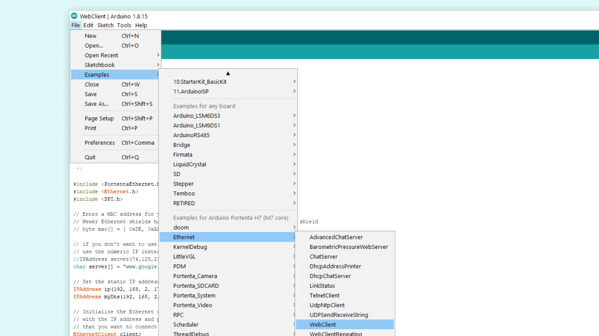
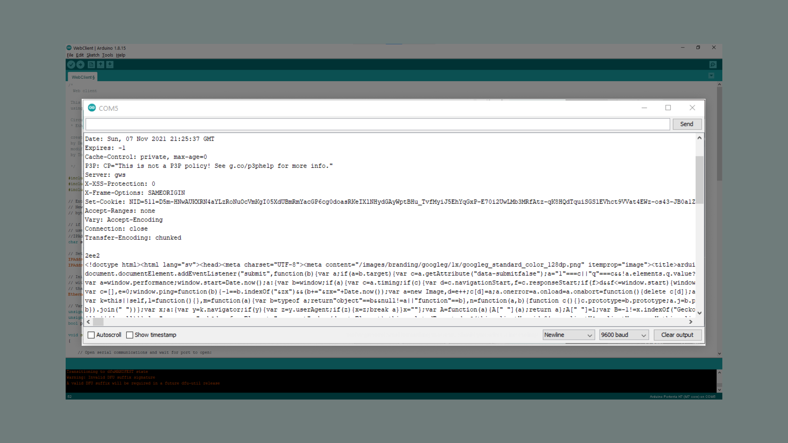

## Introduction 

With the Ethernet version of the Portenta Vision Shield it is possible to connect the board to the Internet using an Ethernet cable. In this tutorial, we will go through useful scenarios for using Ethernet and how to connect the board to the Internet with the Arduino IDE.

## Goals

The goals of this project are:

- Learn how to use the Portenta H7 and Portenta Vision Shield - Ethernet with a Ethernet cable

### Hardware & Software Needed

- [Portenta H7](https://store.arduino.cc/portenta-h7)
- [Portenta Vision Shield - Ethernet](https://store.arduino.cc/products/arduino-portenta-vision-shield-ethernet)
- Arduino [offline IDE](https://www.arduino.cc/en/main/software) or Arduino [Web Editor](https://create.arduino.cc/)
- Ethernet cable
- USB-C® cable

## Ethernet Connection

Ethernet is best described as a collection of computer networking technologies used in different type of networks, such as LAN (Local Area Network) and WAN (Wide Area Network). As one of the main carriers of the Internet Protocol, it is considered to be one of the major technologies that makes up the Internet.

Ethernet is an incredibly useful technology to understand and work with. Often, when we refer to the Internet, or IoT, we typically think wireless, such as Wi-Fi and mobile networks. While our smartphones, laptops and smart objects do not physically connect to the Internet, it is very common that our router does. Wi-Fi operates on a very local scale, such as your home and office, and mobile networks covers as much as the radio tower can reach. But behind it all, cables are connected everywhere, and Ethernet is often the key technology here.

If we are building something that requires a very stable Internet connection, in a rough environment (e.g. outside, garage, industrial environment), an Ethernet connection would be a good fit. Another scenario for Ethernet use could be in a larger industrial facility that may have several sensors, machines or other electronic equipment. This could be disturb Wi-Fi signals from the device to the gateway, making Ethernet better suited for this scenario. It is always guaranteed a higher speed through an Ethernet cable than Wi-Fi, as there are little to no disturbance, as it ignores surrounding elements.

Now let's look at how to connect everything we need.

## Instructions

### Connecting the Board

Connect the Portenta Vision Shield - Ethernet to the Portenta H7. Now connect the USB-C® cable to the Portenta H7 and your computer. Lastly connect the Ethernet cable to the Portenta Vision Shield's Ethernet port and your router or modem.

### Programming the Board

After everything is connected, make sure that you have the latest Portenta H7 core installed in the Arduino IDE. After the right board and port is selected, you can open an example that will help you make sure everything is working as it should.

In the Arduino IDE go to: **File > Examples > Ethernet > WebClient**.



Next you can look at some of the code in the example sketch.

### Testing It Out

Now let's take a look at some important parts of the code.

The sketch will make the board connect to a website. This line in the code decides what website it connects to. The example uses `www.google.com`, but feel free to change it and experiment with different websites.

```arduino
char server[] = "www.google.com";
```

The sketch will also give the board a specific IP address and DNS for ease of use. This also helps you eliminate the error of failing to set a dynamic IP address for the board.

```arduino
IPAddress ip(192, 168, 2, 177);
IPAddress myDns(192, 168, 2, 1);
```

The sketch will check if the Portenta Vision Shield - Ethernet is connected to the Portenta H7. It will also check if an Ethernet cable is connected. If any of these are not connected correctly, it will be shown in the serial monitor when the sketch runs.

```arduino
if (Ethernet.hardwareStatus() == EthernetNoHardware) {
  Serial.println("Ethernet shield was not found.  Sorry, can't run without hardware. :(");
  while (true) {
    delay(1);
  }
}
if (Ethernet.linkStatus() == LinkOFF) {
  Serial.println("Ethernet cable is not connected.");
}
```

The main part of the code inside the `loop()` will read bytes from the website and print them in the Serial Monitor. 

```arduino
int len = client.available();
if (len > 0) {
  byte buffer[80];
  if (len > 80)
    len = 80;
    client.read(buffer, len);
    if (printWebData) {
      Serial.write(buffer, len);
    }
    byteCount = byteCount + len;
}
```

After the board has printed all of the websites content, it will automatically disconnect. The sketch will at the end calculate the speed at which bytes were received and print the results in the Serial Monitor.

### Sketch Result

After uploading the sketch, open the Serial Monitor. The board will connect to a website. Then print the website content in the Serial Monitor. If everything went correctly, your Serial Monitor should look like the image below.



First, some connection tests are made and printed in the Serial Monitor. After the connection has been checked, the html code of the website entered into the sketch will be printed in the Serial Monitor. 

## Conclusion

This tutorial showed how to connect the Portenta H7 with a Portenta Vision Shield - Ethernet to the Internet, with an example sketch in the Arduino IDE. The sketch allowed the board to connect to a website and print its content in the Serial Monitor. The Portenta H7 and Portenta Vision Shield can also be used with OpenMV, have a look at the [OpenMV Ethernet tutorial](https://docs.arduino.cc/tutorials/portenta-vision-shield/ethernet-with-openmv) if you want to see a similar example with Python®.

### Next Steps

Now that you know the basics of how to establish a connection to the Internet with Ethernet, you can try to create more advanced sketches with this connection. An Ethernet connection allows you to send HTTP methods to another device, communicate with another device, API, or even another Portenta. A good next step would be to take a look at the other examples listed under Ethernet in the Arduino IDE.
