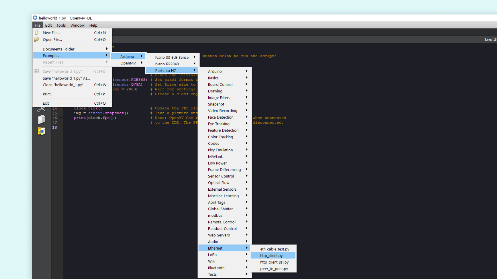
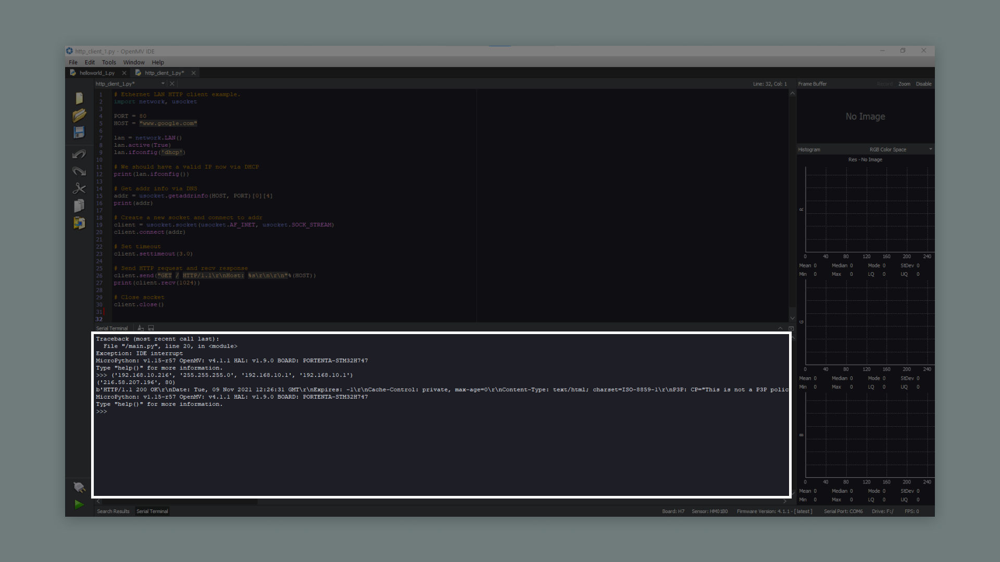

## Introduction 

With the Ethernet version of the Arduino Portenta Vision Shield it is possible to connect the board to the Internet using an Ethernet cable. In this tutorial we will go through useful scenarios for using Ethernet and how to connect the board to the Internet with OpenMV.

## Goals

- Learn how to use the Portenta H7 and Portenta Vision Shield - Ethernet with a Ethernet cable

### Hardware & Software Needed

- [Portenta H7 board](https://store.arduino.cc/portenta-h7)
- [Portenta Vision Shield - Ethernet](https://store.arduino.cc/products/arduino-portenta-vision-shield-lora®)
- [OpenMV](https://openmv.io/pages/download)
- Ethernet cable
- USB-C® cable

***If you want to know more about the ethernet connection please go to the [Arduino IDE ethernet tutorial](https://docs.arduino.cc/tutorials/portenta-vision-shield/ethernet-with-ide#ethernet-connection)***

## Instructions

### Connecting the Board

Connect the Portenta Vision Shield - Ethernet to the Portenta H7. Now connect the USB-C® cable to the Portenta H7 and your computer. Lastly connect the Ethernet cable to the Portenta Vision Shield's Ethernet port and your router or modem.

### Programming the Board

After everything is connected, connect the board to OpenMV to install the latest firmware. Once it is connected, you can open the example we are going to upload. In OpenMV go to: **File > Examples > Arduino > Portenta H7 > Ethernet > http_client.py**.



Next you can have a look at some of the code in the example script.

### Testing It Out

Now let's take a look at some important parts of the code.

First you are making use of some micropython libraries, [network](http://docs.micropython.org/en/latest/library/network.html) and [usocket](http://docs.micropython.org/en/v1.14/library/usocket.html). 

```arduino
import network, usocket
```

The script will make the board connect to a website and set a port for later use. This line in the code decides what website it connects to. The example uses `www.google.com`, but feel free to change it and experiment with different websites.

```arduino
PORT = 80
HOST = "www.google.com"
```

The `usocket.getaddrinfo(HOST, PORT)[0][4]` function will translate the host/port argument into a sequence of 5-tuples that contains all the necessary arguments for creating a socket connected to that service. Then, you can create a socket object with `usocket.socket(usocket.AF_INET, usocket.SOCK_STREAM)`. You can combine these variables you have created to connect the socket to your desired address. 

```arduino
addr = usocket.getaddrinfo(HOST, PORT)[0][4]
print(addr)

client = usocket.socket(usocket.AF_INET, usocket.SOCK_STREAM)
client.connect(addr)
```

This will print the websites content in the serial terminal in OpenMV. The argument inside the `client.recv()` call determines the maximum amount of data to be received at once.

```arduino
print(client.recv(1024))
```

After the board has printed all of the websites content, it will automatically disconnect with a simple `close()` call. Now let's take a look at what the output should look like if everything went correctly.

### Sketch Result

After uploading the sketch, open the serial terminal. The board will connect to a website. Then print the websites content in the serial terminal. If everything went correctly, your serial terminal should look like the image below.



After the connection has been made, the html code of the website entered into the sketch will be printed in the Serial Monitor. 

## Conclusion

This tutorial showed how to connect the Portenta H7 with a Portenta Vision Shield - Ethernet to the Internet, with an example script in the OpenMV. The sketch allowed the board to connect to a website and print its content. The Portenta H7 and Portenta Vision Shield can also be used with the Arduino IDE, have a look at the [Arduino IDE Ethernet tutorial](https://docs.arduino.cc/tutorials/portenta-vision-shield/ethernet-with-ide) if you want to see a similar example.

### Next Steps

Now that you know the basics of how to establish a connection to the Internet with Ethernet, you can try to create more advanced scripts with this connection. An Ethernet connection allows you to send HTTP methods to another device, communicate with another device, API, or even another Portenta. A good next step would be to take a look at the other examples listed under Ethernet in OpenMV, or take a look at the library documentation.
