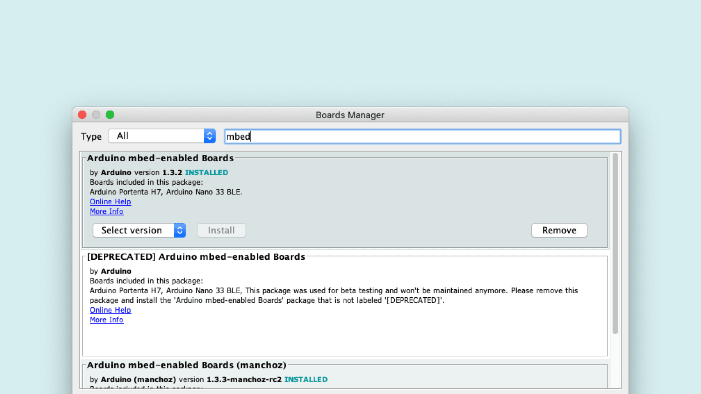
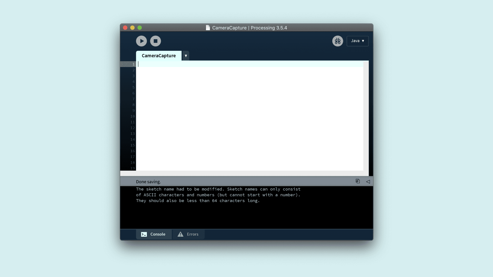
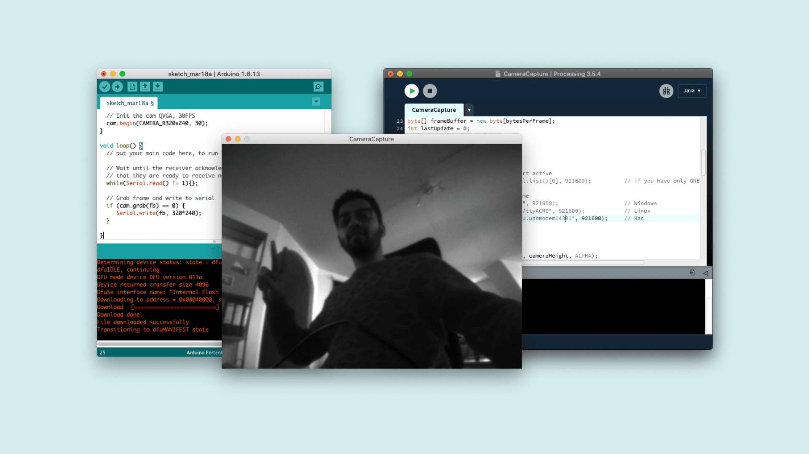

## Overview
This tutorial shows you how to capture frames from the Arduino Portenta Vision Shield Camera module and visualize the video output through a Processing sketch.

## Goals

- Capturing the frames from the camera
- Sending the frames as a byte stream through a Serial connection
- Visualising the frames in Processing 

### Required Hardware and Software

- [Portenta H7](https://store.arduino.cc/portenta-h7)
- Portenta Vision Shield ([LoRa](https://store.arduino.cc/portenta-vision-shield-lora) or [Ethernet](https://store.arduino.cc/portenta-vision-shield))
- 1x USB-C® cable (either USB-A to USB-C® or USB-C® to USB-C®)
- Arduino IDE 1.8.10+
- Processing 3.5.4+

## Instructions
Accessing the Portenta Vision Shield's camera data is done with the help of both Arduino and the Processing IDE. The Arduino sketch handles the capture of image data by the on-board camera, while the java applet created with Processing helps to visualize this data with the help of a serial connection. The following steps will run you through how to capture, package the data through the serial port and visualize the output in Processing. 

### 1. The Basic Setup
Connect the Portenta Vision Shield to your Portenta H7 as shown in the figure. The top and bottom high density connecters are connected to the corresponding ones on the underside of the H7 board. Plug in the H7 to your computer using the USB-C® cable.


Open the board manager in the Arduino IDE and install the latest version of the Portenta Core which is [v1.3.2](https://github.com/arduino/ArduinoCore-mbed/releases/tag/1.3.2)



### 2. Capturing the Frames

Create a new Arduino sketch called `CameraCaptureRawBytes.ino`.

To capture the frames you will need to use the functions contained in `camera.h` which comes with the Portenta core. This library contains all APIs related to frame capturing, motion detection and pattern recognition. Include the header file in your sketch.

```cpp
#include "camera.h"
#include "himax.h"
```

Next, let's initialize a camera object and a frame buffer of the size 320*240 (76'800 bytes).

```cpp
HM01B0 himax;
Camera cam(himax);
#define IMAGE_MODE CAMERA_GRAYSCALE
FrameBuffer fb(320,240,2);

unsigned long lastUpdate = 0;
```

In the `setup()` function, let's start the Serial communication at `921600` baud rate and initialize the camera using `cam.begin()`. 

```cpp
void setup() {
  Serial.begin(921600);
  //Init the cam QVGA, 30FPS
  cam.begin(CAMERA_R320x240, IMAGE_MODE, 30);
}
```

In the loop you need to capture each Frame and send it over a serial connection to the Processing sketch that will display the frames. You will use the `grab(uint8_t *buffer, uint32_t timeout=5000);` function to fetch the frame from the frame buffer and save it into your custom data buffer. 

```cpp
void loop() {
  // put your main code here, to run repeatedly:
  if(!Serial) {    
    Serial.begin(921600);
    while(!Serial);
  }
  
  // Time out after 2 seconds and send new data
  bool timeoutDetected = millis() - lastUpdate > 2000;

  // Wait until the receiver acknowledges
  // that they are ready to receive new data
  if(!timeoutDetected && Serial.read() != 1) return;

  lastUpdate = millis();
  
  // Grab frame and write to serial
  if (cam.grabFrame(fb, 3000) == 0) {
    Serial.write(fb.getBuffer(), cam.frameSize());
  }
}
```

### 3. Create the Processing Sketch 
Open a new processing sketch file and name it `CameraCapture.pde`. 



Let's start by importing the libraries and initializing the variables you will need to process. To process the data sent by the Portenta Vision Shield, you will need to import the following libraries:

- `processing.serial.*`: a [Serial Library](https://processing.org/reference/libraries/serial/index.html)  that is used to read and write data to external devices over the serial line. 
- `java.nio.ByteBuffer`: a java class that provides access to operations on byte buffers

```java
import processing.serial.*;
import java.nio.ByteBuffer;
```

Next, you can initialize the following variables to process the received pixels from the serial port. You can set the dimensions, pixel count and bytes required per frame. 

```java
// must match resolution used in the sketch
final int cameraWidth = 320;
final int cameraHeight = 240;
final int cameraBytesPerPixel = 1;
final int cameraPixelCount = cameraWidth * cameraHeight;
final int bytesPerFrame = cameraWidth * cameraHeight * cameraBytesPerPixel;
```

To receive the frames, you will need a Serial port, a PImage object and an array to store the pixel values of the frame. Add the following variables to the code. 

```java
Serial myPort;
PImage myImage;
byte[] frameBuffer = new byte[bytesPerFrame];
int pixelPosition = 0;
int lastUpdate = 0;
boolean shouldRedraw = false;
```

Here, you will establish a connection to the serial port and prepare the buffer to store the frame pixels. Additionally, you can send a byte to the Arduino sketch from Processing to let it know that it is ready to receive data.

```java
void setup() {
  size(640, 480);
  
  // if you know the serial port name
  //myPort = new Serial(this, "COM5", 921600);                  // Windows
  //myPort = new Serial(this, "/dev/ttyACM0", 921600);          // Linux
  myPort = new Serial(this, "/dev/cu.usbmodem14101", 921600);   // Mac
 
  // Set the number of bytes to buffer 
  myPort.buffer(bytesPerFrame)
  
  // Create an image based on the camera's dimensions and format
  myImage = createImage(cameraWidth, cameraHeight, ALPHA);

  // Let the Arduino sketch know we're ready to receive data
  myPort.write(1);
}
```

The draw function checks if the connection is still alive and if there is any new data that can be drawn as an image. In that case, the original image gets copied into a new image object so that it can be scaled up.

```java
void draw() {
  // Time out after 1.5 seconds and ask for new data
  if(millis() - lastUpdate > 1500) {
    println("Connection timed out.");
    myPort.clear();
    myPort.write(1);
  }
  
  if(shouldRedraw){    
    PImage img = myImage.copy();
    img.resize(640, 480);
    image(img, 0, 0);
    shouldRedraw = false;
  }
}
```

### 4. Visualizing the Frames
For this step, you will use the `serialEvent()` callback function to update the `myImage` when a new data is received on the serial port.

```java
void serialEvent(Serial myPort) {
  lastUpdate = millis();
  
  // read the received bytes
  myPort.readBytes(frameBuffer);

  // Access raw bytes via byte buffer  
  ByteBuffer bb = ByteBuffer.wrap(frameBuffer);

  int i = 0;

  while (bb.hasRemaining()) {
    // read 8-bit pixel
    byte pixelValue = bb.get();

    // set pixel color
    myImage.pixels[i++] = color(Byte.toUnsignedInt(pixelValue));    
  }
  
  myImage.updatePixels();
  
  // Ensures that the new image data is drawn in the next draw loop
  shouldRedraw = true;
  
  // Let the Arduino sketch know we received all pixels
  // and are ready for the next frame
  myPort.write(1);
}
```

The first thing you can do inside this method is to update the timestamp when the last data was read. This is to detect and recover from a connection timeout. Then read the bytes from the `frameBuffer` array which you can do with the help of the [`readBytes()`](https://processing.org/reference/libraries/serial/Serial_readBytes_.html) method that returns the number of bytes read.

```java
lastUpdate = millis();
  
// read the received bytes
myPort.readBytes(frameBuffer);
```

Then the frame buffer is translated into a ByteBuffer that allows for easy and safe access to the underlying bytes without having to worry about the array indices.

```cpp
// Access raw bytes via byte buffer  
ByteBuffer bb = ByteBuffer.wrap(frameBuffer);
```

Next we read the frame buffer and convert the bytes into pixel color values. The image gets constructed by sequentially filling the pixels array of the image. The conversion of the raw data is done with [`color()`](https://processing.org/reference/color_.html) and [`Byte.toUnsignedInt()`](https://docs.oracle.com/javase/8/docs/api/java/lang/Byte.html).

```java
int i = 0;

while (bb.hasRemaining()) {
  // read 8-bit pixel
  byte pixelValue = bb.get();

  // set pixel color
  myImage.pixels[i++] = color(Byte.toUnsignedInt(pixelValue));    
} 
```

Once all the pixels have been updated, you need to tell the sketch to redraw the image. Additionally, you can send an acknowledgement back to the arduino sketch to ask it to send the pixels for the next frame. You can update the image with `updatePixels()` and write `1` to the serial port for the acknowledgement.

```cpp
myImage.updatePixels();

// Ensures that the new image data is drawn in the next draw loop
shouldRedraw = true;

// Let the Arduino sketch know we received all pixels
// and are ready for the next frame
myPort.write(1);
```

### 5. Upload the Sketch

Select the right serial port on your IDE and upload the Arduino sketch to your Portenta H7. After a successful upload, run the `CameraViewer.pde` sketch in Processing. You should be able to see the rendered camera output on the Processing canvas.



## Conclusion

In this tutorial you learnt how to capture the frames from your Portenta Vision Shield's Camera and to visualize the  frames through Processing. This knowledge can be useful for you to build and experiment simple computer vision applications for both outdoor and indoor environments. 

### Complete Sketch
The `CaptureRawBytes.ino` Sketch. 

```cpp
#include "camera.h"
#include "himax.h"

HM01B0 himax;
Camera cam(himax);
#define IMAGE_MODE CAMERA_GRAYSCALE
FrameBuffer fb(320,240,2);

unsigned long lastUpdate = 0;

void setup() {
  Serial.begin(921600);
  //Init the cam QVGA, 30FPS
  cam.begin(CAMERA_R320x240, IMAGE_MODE, 30);
}

void loop() {
  // put your main code here, to run repeatedly:
  if(!Serial) {    
    Serial.begin(921600);
    while(!Serial);
  }
  
  // Time out after 2 seconds and send new data
  bool timeoutDetected = millis() - lastUpdate > 2000;

  // Wait until the receiver acknowledges
  // that they are ready to receive new data
  if(!timeoutDetected && Serial.read() != 1) return;

  lastUpdate = millis();
  
  // Grab frame and write to serial
  if (cam.grabFrame(fb, 3000) == 0) {
    Serial.write(fb.getBuffer(), cam.frameSize());
  }
}
```

The `CameraViewer.pde` Sketch. 

```java
/*
  This sketch reads a raw Stream of RGB565 pixels
  from the Serial port and displays the frame on
  the window.
  Use with the Examples -> CameraCaptureRawBytes Arduino sketch.
  This example code is in the public domain.
*/

import processing.serial.*;
import java.nio.ByteBuffer;
import java.nio.ByteOrder;

Serial myPort;

// must match resolution used in the sketch
final int cameraWidth = 320;
final int cameraHeight = 240;
final int cameraBytesPerPixel = 1;
final int cameraPixelCount = cameraWidth * cameraHeight;
final int bytesPerFrame = cameraPixelCount * cameraBytesPerPixel;

PImage myImage;
byte[] frameBuffer = new byte[bytesPerFrame];
int lastUpdate = 0;
boolean shouldRedraw = false;

void setup() {
  size(640, 480);

  // if you have only ONE serial port active
  //myPort = new Serial(this, Serial.list()[0], 921600);          // if you have only ONE serial port active

  // if you know the serial port name
  //myPort = new Serial(this, "COM5", 921600);                    // Windows
  //myPort = new Serial(this, "/dev/ttyACM0", 921600);            // Linux
  myPort = new Serial(this, "/dev/cu.usbmodem14401", 921600);     // Mac

  // wait for full frame of bytes
  myPort.buffer(bytesPerFrame);  

  myImage = createImage(cameraWidth, cameraHeight, ALPHA);
  
  // Let the Arduino sketch know we're ready to receive data
  myPort.write(1);
}

void draw() {
  // Time out after 1.5 seconds and ask for new data
  if(millis() - lastUpdate > 1500) {
    println("Connection timed out.");
    myPort.clear();
    myPort.write(1);
  }
  
  if(shouldRedraw){    
    PImage img = myImage.copy();
    img.resize(640, 480);
    image(img, 0, 0);
    shouldRedraw = false;
  }
}

void serialEvent(Serial myPort) {
  lastUpdate = millis();
  
  // read the received bytes
  myPort.readBytes(frameBuffer);

  // Access raw bytes via byte buffer  
  ByteBuffer bb = ByteBuffer.wrap(frameBuffer);
  
  /* 
    Ensure proper endianness of the data for > 8 bit values.
    When using > 8bit values uncomment the following line and
    adjust the translation to the pixel color. 
  */     
  //bb.order(ByteOrder.BIG_ENDIAN);

  int i = 0;

  while (bb.hasRemaining()) {
    // read 8-bit pixel
    byte pixelValue = bb.get();

    // set pixel color
    myImage.pixels[i++] = color(Byte.toUnsignedInt(pixelValue));    
  }
  
  myImage.updatePixels();
  
  // Ensures that the new image data is drawn in the next draw loop
  shouldRedraw = true;
  
  // Let the Arduino sketch know we received all pixels
  // and are ready for the next frame
  myPort.write(1);
}
```
