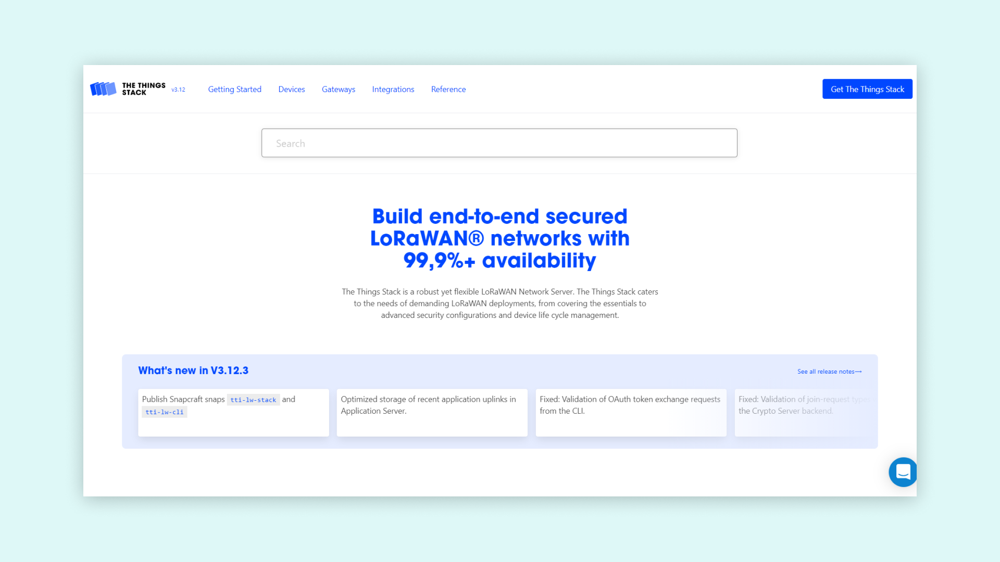
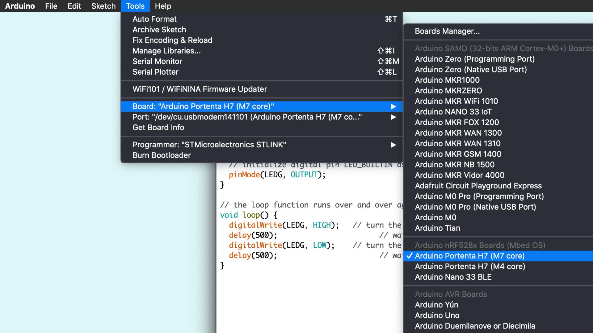
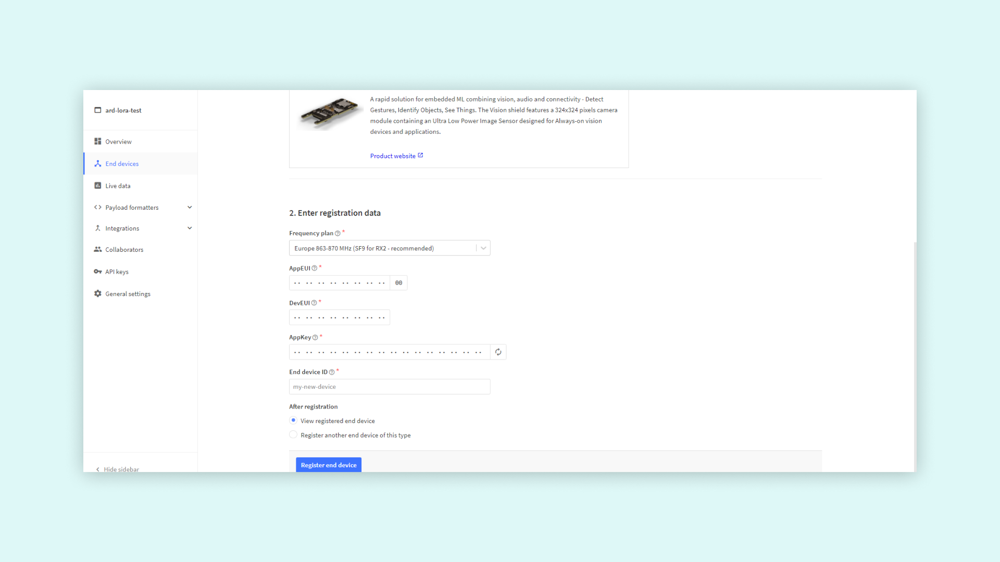

## Overview 

This tutorial explains how to connect your Portenta H7 to The Things Network (TTN) using the Vision Shield's LoRa® Connectivity feature. A data communication channel will be enabled between the H7 and a TTN application that will be configured on your TTN console.

***In order to connect your Portenta to the TTN, make sure you are within the range (max. 10 Km) from an available LoRa® Gateway. Indoor gateways will have a much shorter range. It is recommended that you check LoRa® Gateway availability on [The Things Network map](https://www.thethingsnetwork.org/map) before you try this tutorial.***

## You Will Learn

- About LoRaWAN® and The Things Network
- About creating a TTN application
- How to establish a connection between the H7 and the TTN

## Required Hardware and Software

- [Portenta H7](https://store.arduino.cc/portenta-h7)
- [Portenta Vision Shield - LoRa](https://store.arduino.cc/portenta-vision-shield-lora)
- 1x [Dipole Pentaband antenna](https://store.arduino.cc/antenna) or a UFL Antenna of the H7 
- [OpenMV IDE](https://openmv.io/pages/download)
- Arduino IDE 1.8.10+ or Arduino Pro IDE 0.0.4+ or Arduino CLI 0.13.0+
- 1x USB-C® cable (either USB-A to USB-C® or USB-C® to USB-C®)
- An account on [The Things Network](https://console.cloud.thethings.network/)

## Instructions

The Portenta Vision Shield - LoRa can be connected to TTN and can transmit data to other devices connected to this network through a secure channel. This channel is nothing but an application on the TTN network dedicated for your board. In this tutorial, you will be guided through a step-by-step process of setting up your Portenta board and the Portenta Vision Shield - LoRa to communicate with a TTN application using OpenMV and MicroPython. As stated before, to be able to follow this guide, you need to be under coverage of one of the TTN gateways. You can check for [the coverage](https://www.thethingsnetwork.org/map) now, if you have not done so yet.

### 1. Setting up the Environment

Start by going [here](https://console.cloud.thethings.network/). First choose your region. Next, sign in with your The Things Network account or create a new one on the login page.



### 2. Creating an App on TTN

Once you have created an account with TTN, you need to create a TTN [application](https://www.thethingsnetwork.org/docs/applications/). An application provides a way to aggregate data from different devices and then use these data with other 3rd party integrations. After signing in, click on **Create an application** or **Go to applications** if you already have created one.


Here you will have a list of all your applications. Now create your first app by pressing the **Create an application** button.

You have now to fill only the first two fields:

- The first one is the **Owner** of your app, it will automatically have you as the owner.
- The second one is the **ID** of your app: this must be lowercase and without spaces.


After completing these two fields, press the "Create application" button located at the bottom left corner of the page. The dashboard will then show you an overview of the newly created app.


Let's take a closer look at these sections:

- **Application Overview**: in order to use this app, you will need the Application ID and a device specific AppKey. An EUI is a globally unique identifier for networks, gateways applications and devices. The EUIs are used to identify all parts of the LoRaWAN® inside the backend server.
- **End devices**: here you can see and manage all the associated devices (e.g. your Portenta H7 with Portenta Vision Shield LoRa, Arduino MKR WAN 1300 or MKR WAN 1310) or proceed with the registration of a new one. Registering a new device lets you generate an AppEUI and an AppKey.
- **Collaborators**: here you can see and manage all the app collaborators, to integrate with other collaborative platforms or to manage access rights to the app with other TTN registered profiles.
- **API keys**: here you can create an API key; it is the most sensible information. It is basically the key to gain access to your app, so keep it safe.

### 3. Updating the Modems Firmware

To be able to use the LoRa® functionality, you need to first update the modems firmware through the Arduino IDE. Connect the Portenta H7 and Portenta Vision Shield to your computer and open the Arduino IDE. The LoRa® module on the Portenta Vision Shield can be accessed by using the [MKRWAN library](https://github.com/arduino-libraries/MKRWAN)(if you cannot find it in your examples list, you can go to **Tools > Library Manager** and type "MKRWAN library" to install it). This library provides all the APIS to communicate with LoRa® and LoRaWAN® networks and can be installed from the library manager. Select the **Portenta H7 (M7 core)** board in the Arduino IDE, like shown below.



The code you need to upload and run is from the **MKRWAN** library and its name is **MKRWANFWUpdate_standalone**. With the Portenta M7 selected, upload the **MKRWANFWUpdate_standalone** sketch. 


After uploading the sketch, open the Serial Monitor to confirm that the firmware has been updated. If the upload is successful, it will print the progress in the Serial Monitor.


If it all went correctly, you should see the same text in your Serial Monitor as on the image above.

### 4. Configuring the Portenta Vision Shield

It is now time to connect your Portenta H7 and Portenta Vision Shield - LoRa to TTN. You will need to upload code to the board using [OpenMV](https://openmv.io/pages/download)

Plug the Portenta Vision Shield - LoRa to the Portenta H7 and them to your PC through the USB port. If the Portenta board does not show up on OpenMV, try double-pressing the reset button on the Portenta. Now update to the latest firmware in OpenMV.

The only line you may need to change before uploading the code is the one that sets the frequency. Set the frequency code according to your country if needed. You can find more information about frequency by country at [this TTN link](https://www.thethingsnetwork.org/docs/lorawan/frequency-plans.html).

***Consider that in Australia the boards connect correctly to TTN gateways on AS923 frequencies; AU915 frequencies requires the selection of sub band 2 which is not yet implemented in the firmware.***

```python
// change this to your regional band (eg. US915, AS923, ...)
lora = Lora(band=BAND_EU868, poll_ms=60000, debug=False)
```

The `lora.join_OTAA()` or `lora.join_ABP()` functions connect your Portenta Vision Shield to The Things Network (TTN), using either Over-The-Air-Activation (OTAA) or Activating-By-Personalization (ABP) protocols. You just need to enter our `appEui` and `appKey`. The timeout decides how long the board will try and connect before stopping.

```python
try:
    lora.join_OTAA(appEui, appKey, timeout=20000)
    # Or ABP:
    #lora.join_ABP(devAddr, nwkSKey, appSKey, timeout=5000)
```

You can then send data to your TTN application with `lora.send_data()`, in here you can decide what data you want to send to your TTN application.

```python
try:
    if lora.send_data("HeLoRA world!", True):
        print("Message confirmed.")
    else:
        print("Message wasn't confirmed")
```

Now you need to read the downlink message. Using the `lora.available()` function, you can check if data are received on the board. If there are data on the board that has been received, you can use the `lora.receive_data()` function to take that data and put them into a local variable, making it easier to print in the OpenMV IDE serial terminal. Using `lora.poll()`, you can make sure that the LoRa® module is ready before you run the loop again.

```python
# Read downlink messages
while (True):
    if (lora.available()):
        data = lora.receive_data()
        if data:
            print("Port: " + data["port"])
            print("Data: " + data["data"])
    lora.poll()
    sleep_ms(1000)
```

**Hint: The Complete Sketch can be found in the Conclusions**

Then, once the upload is completed, open the Serial Terminal where you can now see firmware info, device EUI, data rate and join status.

In order to select the way in which the board is going to connect with TTN (OTAA or ABP) we need to configure it on the TTN portal. You will see which option you should select in the following steps.

### 5. Registering the Portenta on TTN

Before your Portenta H7 can start communicating with the TTN, you need to [register](https://www.thethingsnetwork.org/docs/devices/registration.html) the board with an application. Go back to the TTN portal and scroll to **End devices** section on your Application dashboard, then click **Add end device**.


On the registration page, first you have to fill in information about your board. Select brand Arduino SA and Portenta Vision Shield - LoRa as the model. Hardware and firmware versions will automatically be set to the newest ones. Then set your preferred region.


In the second step of registering the device, fill in **End device ID** and **EUI**. You can click the generate button next to the AppKey field to generate an app key for this device. Similarly, you can press the button next to the AppEUI field to make it all zeros or enter your own AppEUI.

**Note**: The Device ID must be lowercase and without spaces. The **DevEUI** can be copied from the terminal in OpenMV. You can run the following script to obtain it.

```python
from lora import *
print("Device EUI:", Lora().get_device_eui())
```



After pressing the Register button, your board will show up on the **Device Overview** page. You can now see all the information needed to complete the Arduino setup.


### 6. Connecting to TTN

Once your board has been registered, you can send information to TTN. Let's go back to the sketch to fill in the appEui and appKey. The sketch you use here will leverage OTA connection.

You can read more into OTA vs ABP activation mode at [this link](https://www.thethingsnetwork.org/docs/devices/registration.html)

Once your board has been registered, you can send information to TTN. Let's proceed in OpenMV. In the sketch the application EUI and the app key needs to be filled in. Find the EUI and the App key from TTN **Device Overview** page.

If this process is done successfully, you will see this message:

```
Message confirmed.
```

## Conclusion
If you receive this message, you have managed to configure the Portenta H7 and the Portenta Vision Shield - LoRa to TTN. You have retrieved the device EUI, used it to register the device in the TTN console and programmed the board using the data provided by TTN. Now, you can send data over LoRa® network, which can be viewed from anywhere in the world (as long as you have an Internet connection and your device is in range from a TTN gateway).

### Complete Sketch

```python
from lora import *

lora = Lora(band=BAND_EU868, poll_ms=60000, debug=False)

print("Firmware:", lora.get_fw_version())
print("Device EUI:", lora.get_device_eui())
print("Data Rate:", lora.get_datarate())
print("Join Status:", lora.get_join_status())

appEui = "" # Add your App EUI here
appKey = "" # Add your App Key here

try:
    lora.join_OTAA(appEui, appKey, timeout=20000)
    # Or ABP:
    #lora.join_ABP(devAddr, nwkSKey, appSKey, timeout=5000)
# You can catch individual errors like timeout, rx etc...
except LoraErrorTimeout as e:
    print("Something went wrong; are you indoor? Move near a window and retry")
    print("ErrorTimeout:", e)
except LoraErrorParam as e:
    print("ErrorParam:", e)

print("Connected.")
lora.set_port(3)

try:
    if lora.send_data("HeLoRA world!", True):
        print("Message confirmed.")
    else:
        print("Message wasn't confirmed")

except LoraErrorTimeout as e:
    print("ErrorTimeout:", e)

# Read downlink messages
while (True):
    if (lora.available()):
        data = lora.receive_data()
        if data:
            print("Port: " + data["port"])
            print("Data: " + data["data"])
    lora.poll()
    sleep_ms(1000)
```

### Next Steps

- Experiment your Portenta Vision Shield's capabilities with OpenMV and the examples from the dedicated library for Arduino. You can continue with [this tutorial](https://docs.arduino.cc/tutorials/portenta-vision-shield/blob-detection) from the Arduino DOCS site.
-  Combine LoRaWAN® protocol with an OpenMV example to develop your own IoT application. Take advantage of the Portenta Vision Shield's camera to detect, filter, classify images, read QR codes or more.     

## Troubleshooting

The most common issue is that the device cannot connect to a TTN gateway. Again, it is a good idea to check if you have coverage in the area you are conducting this tutorial, by checking out [this map](https://www.thethingsnetwork.org/map).

If you are within a good range from a gateway, you should also try to move your device and antenna to a window and even hold it out the window and move it around. This has proven successful on numerous accounts, as the signal can travel less obstructed.
