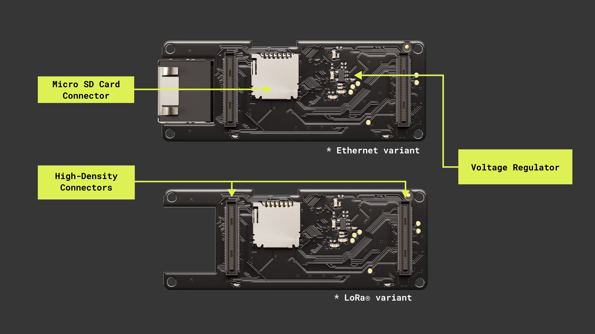
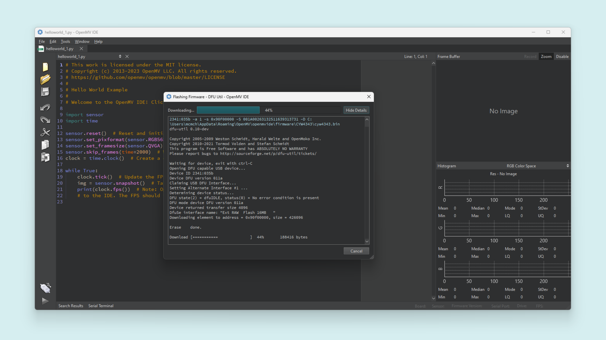

## Overview

This user manual will guide you through a practical journey covering the most interesting features of the Arduino Portenta Vision Shield. With this user manual, you will learn how to set up, configure and use this Arduino board.

## Hardware and Software Requirements
### Hardware Requirements

- [Portenta Vision Shield Ethernet](https://store.arduino.cc/collections/shields-carriers/products/arduino-portenta-vision-shield-ethernet) (x1) or [Portenta Vision Shield LoRa®](https://store.arduino.cc/collections/shields-carriers/products/arduino-portenta-vision-shield-lora%C2%AE)
- [Portenta H7](https://store.arduino.cc/products/portenta-h7) (x1) or [Portenta C33](https://store.arduino.cc/products/portenta-c33) (x1)
- [USB-C® cable cable](https://store.arduino.cc/products/usb-cable2in1-type-c) (x1)

### Software Requirements

- [OpenMV IDE](https://openmv.io/pages/download)
- [Arduino IDE 1.8.10+](https://www.arduino.cc/en/software), [Arduino IDE 2.0+](https://www.arduino.cc/en/software), or [Arduino Web Editor](https://create.arduino.cc/editor)
- To create custom Machine Learning models, the Machine Learning Tools add-on integrated into the [Arduino Cloud](https://create.arduino.cc/iot/) is needed. In case you do not have an Arduino Cloud account, you will need to create one first.

## Product Overview

The Arduino Portenta Vision Shield is an add-on board providing machine vision capabilities and additional connectivity to the Portenta family of Arduino boards, designed to meet the needs of industrial automation. The Portenta Vision Shield connects via a high-density connector to the Portenta boards with minimal hardware and software setup.

The included HM-01B0 camera module has been pre-configured to work with the OpenMV libraries provided by Arduino. Based on the specific application requirements, the Portenta Vision Shield is available in two configurations with either Ethernet or LoRa® connectivity.

### Board Architecture Overview

The Portenta Vision Shield LoRa® brings industry-rated features to your Portenta. This hardware add-on will let you run embedded computer vision applications, connect wirelessly via LoRa® to the Arduino Cloud or your own infrastructure, and activate your system upon the detection of sound events.




Here is an overview of the board's main components, as shown in the images above:

- **Power Regulator**: the Portenta H7/C33 supplies 3.3 V power to the LoRa® module (ASX00026 only), Ethernet communication (ASX00021 only), Micro SD slot and dual microphones via the 3.3 V output of the high-density connectors. An onboard LDO regulator supplies a 2.8 V output (300 mA) for the camera module.

- **Camera**: the Himax HM-01B0 Module is a very low-power camera with 320x320 resolution and a maximum of 60 FPS depending on the operating mode. Video data is transferred over a configurable 8-bit interconnect with support for frame and line synchronization. The module delivered with the Portenta Vision Shield is the monochrome version. Configuration is achieved via an I2C connection with the compatible Portenta boards microcontrollers.

    HM-01B0 offers very low-power image acquisition and provides the possibility to perform motion detection without main processor interaction. The“Always-on” operation provides the ability to turn on the main processor when movement is detected with minimal power consumption.

    ***The Portenta C33 is not compatible with the camera of the Portenta Vision Shield***.

- **Digital Microphones**: the dual MP34DT05 digital MEMS microphones are omnidirectional and operate via a capacitive sensing element
with a high (64 dB) signal-to-noise ratio. The microphones have been configured to provide separate left and right audio over a single PDM stream.

    The sensing element, capable of detecting acoustic waves, is manufactured using a specialized silicon micromachining process dedicated to produce audio sensors.

- **Micro SD Card Slot**: a Micro SD card slot is available under the Portenta Vision Shield board. Available libraries allow reading and
writing to FAT16/32 formatted cards

- **Ethernet (ASX00021 Only)**: ethernet connector allows connecting to 10/100 Base TX networks using the Ethernet PHY available on the Portenta
board.

- **LoRa® Module (ASX00026 Only)**: LoRa® connectivity is provided by the Murata CMWX1ZZABZ module. This module contains an STM32L0 processor
along with a Semtech SX1276 Radio. The processor is running on Arduino open-source firmware based on Semtech code.

### Shield Environment Setup

Connect the Vision Shield with a Portenta H7 through their High-Density connectors and verify they are correctly aligned.

<div style="text-align: center;">
  <video width="100%" controls="true">
  <source src="assets/h7_vision-shield.mp4" type="video/mp4"/>
  </video>
</div>

#### With OpenMV IDE

Before you can start programming MicroPython scripts for the Vision Shield, you need to download and install the OpenMV IDE.

Open the [OpenMV](https://openmv.io/pages/download) download page in your browser, download the latest version available for your operating system, and follow the instructions of the installer.


Open the **OpenMV IDE** and connect the Portenta H7 to your computer via the USB cable if you have not done so yet.


Click on the "connect" symbol at the bottom of the left toolbar.


If your Portenta H7 does not have the latest firmware, a pop-up will ask you to install it. Your board will enter in DFU mode and its green LED will start fading. 

Select `Install the latest release firmware`. This will install the latest OpenMV firmware on the H7. You can leave the option of erasing the internal file system unselected and click `OK`.


Portenta H7's green LED will start flashing while the OpenMV firmware is being uploaded to the board. A loading bar will start showing you the flashing progress.

Wait until the green LED stops flashing and fading. You will see a message saying `DFU firmware update complete!` when the process is done.



The board will start flashing its blue LED when it is ready to be connected. After confirming the completion dialog, the Portenta H7 should already be connected to the OpenMV IDE, otherwise, click the "connect" button (plug symbol) once again (the blue blinking should stop).


While using the Portenta H7 with OpenMV, the RGB LED of the board can be used to inform the user about its current status. Some of the most important ones are the following:

🟢 **Blinking Green:** Your Portenta H7 onboard bootloader is running. The onboard bootloader runs for a few seconds when your H7 is powered via USB to allow OpenMV IDE to reprogram your Portenta.

🔵 **Blinking Blue:** Your Portenta H7 is running the default __main.py__ script onboard. 

If you overwrite the __main.py__ script on your Portenta H7, then it will run whatever code you loaded on it instead.

***If the LED is blinking blue but OpenMV IDE cannot connect to your Portenta H7, please make sure you are connecting your Portenta H7 to your PC with a USB cable that supplies both data and power.***

⚪ **Blinking White:** Your Portenta H7 firmware is panicking because of a hardware failure. Please check that your Vision Shield's camera module is installed securely.

***If you tap the Portenta H7 reset button once, the board resets. If you tap it twice, the board enters Device Firmware Upgrade (DFU) mode and its green LED starts blinking and fading.***

### Pinout


The full pinout is available and downloadable as PDF from the link below:

- [Vision Shield full pinout](https://docs.arduino.cc/resources/pinouts/ABX00051-full-pinout.pdf)

### Datasheet

The complete datasheet is available and downloadable as PDF from the link below:

- [Vision Shield datasheet](https://docs.arduino.cc/resources/datasheets/ASX00021-ASX00026-datasheet.pdf)

### Schematics

The complete schematics are available and downloadable as PDF from the links below:

- [Vision Shield - Ethernet schematics](https://docs.arduino.cc/resources/schematics/ASX00021-schematics.pdf)
- [Vision Shield - LoRa® schematics](https://docs.arduino.cc/resources/schematics/ASX00026-schematics.pdf)

### STEP Files

The complete STEP files are available and downloadable from the link below:

- [Vision Shield STEP files](https://docs.arduino.cc/static/c1c3c72a51d20228fe415ac8717615f6/visionShields-step.zip)

## First Use

### Hello World Example

Working with camera modules, the `Hello World` classic example is not an LED blink but the simplest sketch to capture images. We will use this example to verify the board's connection to the IDEs and that the Vision Shield itself is working as expected.

The following example script can be found on **File > Examples > HelloWorld > helloworld.py** in the OpenMV IDE.

```python
import sensor
import time

sensor.reset()  # Reset and initialize the sensor.
sensor.set_pixformat(sensor.GRAYSCALE)  # Set pixel format to RGB565 (or GRAYSCALE)
sensor.set_framesize(sensor.QVGA)  # Set frame size to QVGA (320x240)
sensor.skip_frames(time=2000)  # Wait for settings take effect.
clock = time.clock()  # Create a clock object to track the FPS.

while True:
    clock.tick()  # Update the FPS clock.
    img = sensor.snapshot()  # Take a picture and return the image.
    print(clock.fps())  # Note: OpenMV Cam runs about half as fast when connected
    # to the IDE. The FPS should increase once disconnected.
```


From the above example script, we can highlight the main functions:

- `sensor.set_pixformat(<Sensor>)` lets you set the pixel format for the camera sensor. The Vision Shield is compatible with these: `sensor.GRAYSCALE`, and `sensor.BAYER`. 

  To define the pixel format to any of the supported ones, just add it to the `set_pixformat` function argument.

- `sensor.set_framesize(<Resolution>)` lets you define the image frame size in terms of pixels. [Here](https://docs.openmv.io/library/omv.sensor.html#sensor.set_framesize) you can find all the different options.

  To leverage full sensor resolution with the Vision Shield camera module `HM01B0`, use `sensor.B320X320`.

  

- `sensor.snapshot()` lets you take a picture and return the image so you can save it, stream it or process it.