## Overview

This user manual will guide you through a practical journey covering the most interesting features of the Arduino Portenta Vision Shield. With this user manual, you will learn how to set up, configure and use this Arduino board.

## Hardware and Software Requirements
### Hardware Requirements

- [Portenta Vision Shield Ethernet](https://store.arduino.cc/collections/shields-carriers/products/arduino-portenta-vision-shield-ethernet) (x1) or [Portenta Vision Shield LoRa®](https://store.arduino.cc/collections/shields-carriers/products/arduino-portenta-vision-shield-lora%C2%AE)
- [Portenta H7](https://store.arduino.cc/products/portenta-h7) (x1) or [Portenta C33](https://store.arduino.cc/products/portenta-c33) (x1)
- [USB-C® cable cable](https://store.arduino.cc/products/usb-cable2in1-type-c) (x1)

### Software Requirements

- [OpenMV IDE](https://openmv.io/pages/download)
- [Arduino IDE 1.8.10+](https://www.arduino.cc/en/software), [Arduino IDE 2.0+](https://www.arduino.cc/en/software), or [Arduino Web Editor](https://create.arduino.cc/editor)
- To create custom Machine Learning models, the Machine Learning Tools add-on integrated into the [Arduino Cloud](https://create.arduino.cc/iot/) is needed. In case you do not have an Arduino Cloud account, you will need to create one first.

## Product Overview

The Arduino Portenta Vision Shield is an add-on board providing machine vision capabilities and additional connectivity to the Portenta family of Arduino boards, designed to meet the needs of industrial automation. The Portenta Vision Shield connects via a high-density connector to the Portenta boards with minimal hardware and software setup.

The included HM-01B0 camera module has been pre-configured to work with the OpenMV libraries provided by Arduino. Based on the specific application requirements, the Portenta Vision Shield is available in two configurations with either Ethernet or LoRa® connectivity.

### Board Architecture Overview

The Portenta Vision Shield LoRa® brings industry-rated features to your Portenta. This hardware add-on will let you run embedded computer vision applications, connect wirelessly via LoRa® to the Arduino Cloud or your own infrastructure, and activate your system upon the detection of sound events.


Here is an overview of the board's main components, as shown in the images above:

- **Power Regulator**: the Portenta H7/C33 supplies 3.3 V power to the LoRa® module (ASX00026 only), Ethernet communication (ASX00021 only), Micro SD slot and dual microphones via the 3.3 V output of the high-density connectors. An onboard LDO regulator supplies a 2.8 V output (300 mA) for the camera module.

- **Camera**: the Himax HM-01B0 Module is a very low-power camera with 320x320 resolution and a maximum of 60 FPS depending on the operating mode. Video data is transferred over a configurable 8-bit interconnect with support for frame and line synchronization. The module delivered with the Portenta Vision Shield is the monochrome version. Configuration is achieved via an I2C connection with the compatible Portenta boards microcontrollers.

    HM-01B0 offers very low-power image acquisition and provides the possibility to perform motion detection without main processor interaction. The“Always-on” operation provides the ability to turn on the main processor when movement is detected with minimal power consumption.

    ***The Portenta C33 is not compatible with the camera of the Portenta Vision Shield***

- **Digital Microphones**: the dual MP34DT05 digital MEMS microphones are omnidirectional and operate via a capacitive sensing element
with a high (64 dB) signal-to-noise ratio. The microphones have been configured to provide separate left and right audio over a single PDM stream.

  The sensing element, capable of detecting acoustic waves, is manufactured using a specialized silicon micromachining process dedicated to produce audio sensors.

- **Micro SD Card Slot**: a Micro SD card slot is available under the Portenta Vision Shield board. Available libraries allow reading and
writing to FAT16/32 formatted cards

- **Ethernet (ASX00021 Only)**: ethernet connector allows connecting to 10/100 Base TX networks using the Ethernet PHY available on the Portenta
board.

- **LoRa® Module (ASX00026 Only)**: LoRa® connectivity is provided by the Murata CMWX1ZZABZ module. This module contains an STM32L0 processor
along with a Semtech SX1276 Radio. The processor is running on Arduino open-source firmware based on Semtech code.

### Shield Environment Setup

Connect the Vision Shield with a Portenta H7 through their High-Density connectors and verify they are correctly aligned.

<div style="text-align: center;">
  <video width="100%" controls="true">
  <source src="assets/h7_vision-shield.mp4" type="video/mp4"/>
  </video>
</div>

#### OpenMV IDE Setup

Before you can start programming MicroPython scripts for the Vision Shield, you need to download and install the OpenMV IDE.

Open the [OpenMV](https://openmv.io/pages/download) download page in your browser, download the latest version available for your operating system, and follow the instructions of the installer.


Open the **OpenMV IDE** and connect the Portenta H7 to your computer via the USB cable if you have not done so yet.


Click on the "connect" symbol at the bottom of the left toolbar.


If your Portenta H7 does not have the latest firmware, a pop-up will ask you to install it. Your board will enter in DFU mode and its green LED will start fading. 

Select `Install the latest release firmware`. This will install the latest OpenMV firmware on the H7. You can leave the option of erasing the internal file system unselected and click `OK`


Portenta H7's green LED will start flashing while the OpenMV firmware is being uploaded to the board. A loading bar will start showing you the flashing progress.

Wait until the green LED stops flashing and fading. You will see a message saying `DFU firmware update complete!` when the process is done.


The board will start flashing its blue LED when it is ready to be connected. After confirming the completion dialog, the Portenta H7 should already be connected to the OpenMV IDE, otherwise, click the "connect" button (plug symbol) once again (the blue blinking should stop).


While using the Portenta H7 with OpenMV, the RGB LED of the board can be used to inform the user about its current status. Some of the most important ones are the following:

🟢 **Blinking Green:** Your Portenta H7 onboard bootloader is running. The onboard bootloader runs for a few seconds when your H7 is powered via USB to allow OpenMV IDE to reprogram your Portenta.

🔵 **Blinking Blue:** Your Portenta H7 is running the default __main.py__ script onboard. 

If you overwrite the __main.py__ script on your Portenta H7, then it will run whatever code you loaded on it instead.

***If the LED is blinking blue but OpenMV IDE cannot connect to your Portenta H7, please make sure you are connecting your Portenta H7 to your PC with a USB cable that supplies both data and power.***

⚪ **Blinking White:** Your Portenta H7 firmware is panicking because of a hardware failure. Please check that your Vision Shield's camera module is installed securely.

***If you tap the Portenta H7 reset button once, the board resets. If you tap it twice, the board enters Device Firmware Upgrade (DFU) mode and its green LED starts blinking and fading.***

### Pinout

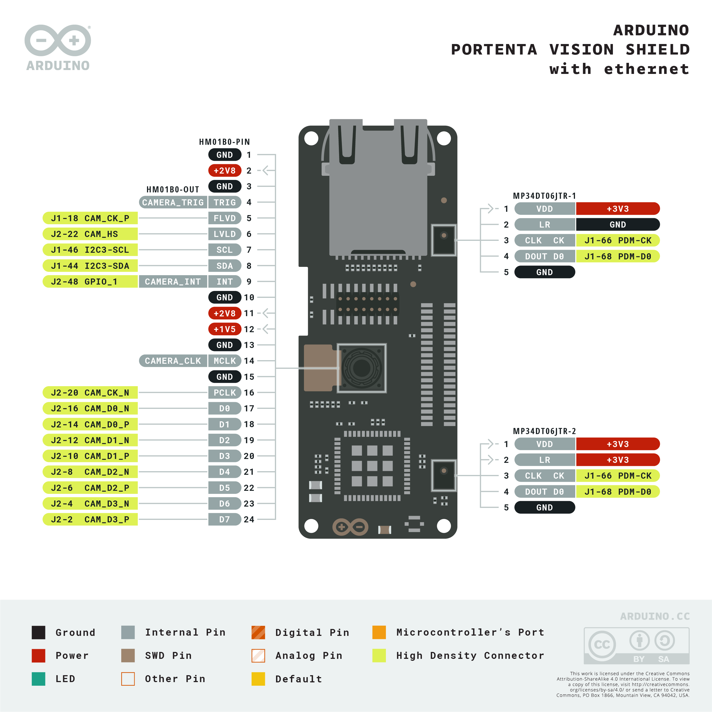

The full pinout is available and downloadable as PDF from the link below:

- [Vision Shield full pinout](https://docs.arduino.cc/resources/pinouts/ABX00051-full-pinout.pdf)

### Datasheet

The complete datasheet is available and downloadable as PDF from the link below:

- [Vision Shield datasheet](https://docs.arduino.cc/resources/datasheets/ASX00021-ASX00026-datasheet.pdf)

### Schematics

The complete schematics are available and downloadable as PDF from the links below:

- [Vision Shield - Ethernet schematics](https://docs.arduino.cc/resources/schematics/ASX00021-schematics.pdf)
- [Vision Shield - LoRa® schematics](https://docs.arduino.cc/resources/schematics/ASX00026-schematics.pdf)

### STEP Files

The complete STEP files are available and downloadable from the link below:

- [Vision Shield STEP files](https://docs.arduino.cc/static/c1c3c72a51d20228fe415ac8717615f6/visionShields-step.zip)

## First Use

### Hello World Example

Working with camera modules, the `Hello World` classic example is not an LED blink but the simplest sketch to capture images. We will use this example to verify the board's connection to the IDEs and that the Vision Shield itself is working as expected.

The following example script can be found on **File > Examples > HelloWorld > helloworld.py** in the OpenMV IDE.

```python
import sensor
import time

sensor.reset()  # Reset and initialize the sensor.
sensor.set_pixformat(sensor.GRAYSCALE)  # Set pixel format to RGB565 (or GRAYSCALE)
sensor.set_framesize(sensor.QVGA)  # Set frame size to QVGA (320x240)
sensor.skip_frames(time=2000)  # Wait for settings take effect.
clock = time.clock()  # Create a clock object to track the FPS.

while True:
    clock.tick()  # Update the FPS clock.
    img = sensor.snapshot()  # Take a picture and return the image.
    print(clock.fps())  # Note: OpenMV Cam runs about half as fast when connected
    # to the IDE. The FPS should increase once disconnected.
```


From the above example script, we can highlight the main functions:

- `sensor.set_pixformat(<Sensor>)` lets you set the pixel format for the camera sensor. The Vision Shield is compatible with these: `sensor.GRAYSCALE`, and `sensor.BAYER`. 

  To define the pixel format to any of the supported ones, just add it to the `set_pixformat` function argument.

- `sensor.set_framesize(<Resolution>)` lets you define the image frame size in terms of pixels. [Here](https://docs.openmv.io/library/omv.sensor.html#sensor.set_framesize) you can find all the different options.

  To leverage full sensor resolution with the Vision Shield camera module `HM01B0`, use `sensor.B320X320`.

  

- `sensor.snapshot()` lets you take a picture and return the image so you can save it, stream it or process it.

## Camera

The Portenta Vision Shields's main feature is its onboard camera, based on the HM01B0 ultralow power CMOS image sensor. It is perfect for Machine Learning applications such as object detection, image classification, machine/computer vision, robotics, IoT, and more.

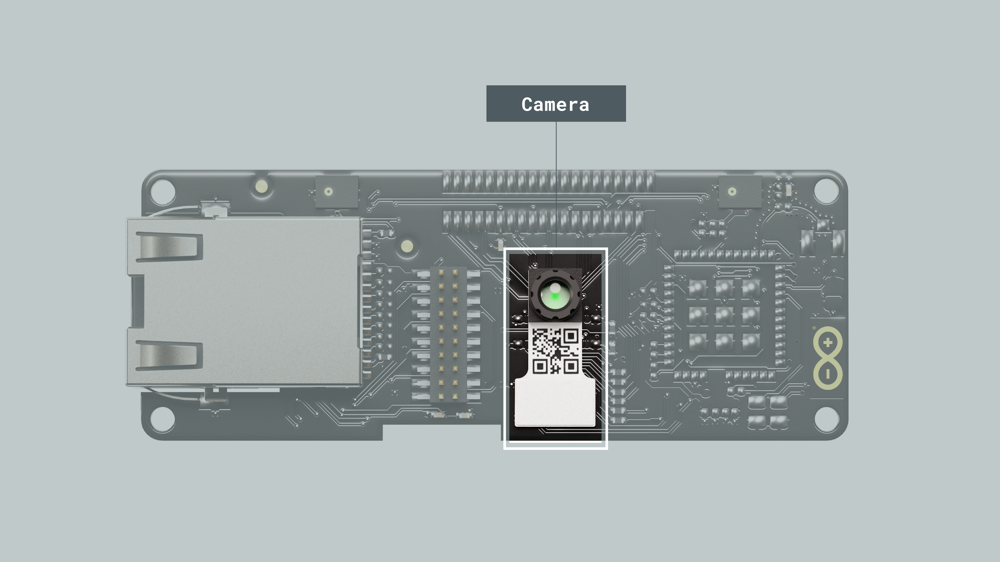

**Main Camera Features**

- Ultra-Low-Power Image Sensor designed for always-on vision devices and applications
- High-sensitivity 3.6 μ BrightSenseTM pixel technology Window, vertical flip and horizontal mirror readout
- Programmable black level calibration target, frame size, frame rate, exposure, analog gain (up to 8x) and digital gain (up to 4x)
- Automatic exposure and gain control loop with support for 50 Hz / 60 Hz flicker avoidance
- Motion Detection circuit with programmable ROI and detection threshold with digital output to serve as an interrupt

**Supported Resolutions**

- QQVGA (160x120) at 15, 30, 60 and 120 FPS
- QVGA (320x240) at 15, 30 and 60 FPS
- B320X320 (320x320) at 15, 30 and 45 FPS

**Power Consumption**
- < 1.1 mW QQVGA resolution at 30 FPS,
- < 2 mW QVGA resolution at 30 FPS
- < 4 mW QVGA resolution at 60 FPS

The Vision Shield is primarily intended to be used with the OpenMV MicroPython ecosystem. So, it's recommended to use this IDE for machine vision applications.

### Snapshot Example

The example code below lets you take a picture and save it on the Portenta H7 local storage or in a Micro SD card as `example.jpg`.

```python
import sensor
import time
import machine

sensor.reset()  # Reset and initialize the sensor.
sensor.set_pixformat(sensor.GRAYSCALE)  # Set pixel format to RGB565 (or GRAYSCALE)
sensor.set_framesize(sensor.B320X320)  # Set frame size to QVGA (320x240)
sensor.skip_frames(time=2000)  # Wait for settings take effect.

led = machine.LED("LED_BLUE")

start = time.ticks_ms()
while time.ticks_diff(time.ticks_ms(), start) < 3000:
    sensor.snapshot()
    led.toggle()

led.off()

img = sensor.snapshot()
img.save("example.jpg")  # or "example.bmp" (or others)

raise (Exception("Please reset the camera to see the new file."))
```

***If a Micro SD card is inserted into the Vision Shield, the snapshot will be stored there***

After the snapshot is taken, reset the board by pressing the reset button and the image will be on the board storage drive.


### Video Recording Example

The example code below lets you record a video and save it on the Portenta H7 local storage or in a Micro SD card as `example.mjpeg`.

```python
import sensor
import time
import mjpeg
import machine

sensor.reset()  # Reset and initialize the sensor.
sensor.set_pixformat(sensor.GRAYSCALE)  # Set pixel format to RGB565 (or GRAYSCALE)
sensor.set_framesize(sensor.QVGA)  # Set frame size to QVGA (320x240)
sensor.skip_frames(time=2000)  # Wait for settings take effect.

led = machine.LED("LED_RED")

led.on()
m = mjpeg.Mjpeg("example.mjpeg")

clock = time.clock()  # Create a clock object to track the FPS.
for i in range(50):
    clock.tick()
    m.add_frame(sensor.snapshot())
    print(clock.fps())
    
m.close()
led.off()

raise (Exception("Please reset the camera to see the new file."))
```
We recommend you use [VLC](https://www.videolan.org/vlc/) to play the video.


### Sensor Control

There are several functions that allow us to configure the behavior of the camera sensor and adapt it to our needs.

**Gain**: the gain is related to the sensor sensitivity and affects how bright or dark the final image will be.

With the following functions, you can control the camera gain:

```python
sensor.set_auto_gain(True, gain_db_ceiling=16.0)  # True = auto gain enabled, with a max limited to gain_db_ceiling parameter.
sensor.set_auto_gain(False, gain_db=8.0)  # False = auto gain disabled, fixed to gain_db parameter.
```


**Orientation**: flip the image captured to meet your application's needs.

With the following functions, you can control the image orientation:

```python
sensor.set_hmirror(True) # Enable horizontal mirror | undo the mirror if False
sensor.set_vflip(True) # Enable the vertical flip | undo the flip if False
```

You can find complete `Sensor Control` examples in **File > Examples > Camera > Sensor Control** of the OpenMV IDE.

### Bar and QR Codes 

The Vision Shield is ideal for production line inspections, in these examples, we are going to be locating and reading bar codes and QR codes.

#### Bar Codes

This example code can be found in **File > Examples > Barcodes** in the OpenMV IDE.

```python
import sensor
import image
import time
import math

sensor.reset()
sensor.set_pixformat(sensor.GRAYSCALE)
sensor.set_framesize(sensor.QVGA)  # High Res!
sensor.set_windowing((640, 80))  # V Res of 80 == less work (40 for 2X the speed).
sensor.skip_frames(time=2000)
sensor.set_auto_gain(False)  # must turn this off to prevent image washout...
sensor.set_auto_whitebal(False)  # must turn this off to prevent image washout...
clock = time.clock()

# Barcode detection can run at the full 640x480 resolution of your OpenMV Cam's.

def barcode_name(code):
    if code.type() == image.EAN2:
        return "EAN2"
    if code.type() == image.EAN5:
        return "EAN5"
    if code.type() == image.EAN8:
        return "EAN8"
    if code.type() == image.UPCE:
        return "UPCE"
    if code.type() == image.ISBN10:
        return "ISBN10"
    if code.type() == image.UPCA:
        return "UPCA"
    if code.type() == image.EAN13:
        return "EAN13"
    if code.type() == image.ISBN13:
        return "ISBN13"
    if code.type() == image.I25:
        return "I25"
    if code.type() == image.DATABAR:
        return "DATABAR"
    if code.type() == image.DATABAR_EXP:
        return "DATABAR_EXP"
    if code.type() == image.CODABAR:
        return "CODABAR"
    if code.type() == image.CODE39:
        return "CODE39"
    if code.type() == image.PDF417:
        return "PDF417"
    if code.type() == image.CODE93:
        return "CODE93"
    if code.type() == image.CODE128:
        return "CODE128"


while True:
    clock.tick()
    img = sensor.snapshot()
    codes = img.find_barcodes()
    for code in codes:
        img.draw_rectangle(code.rect())
        print_args = (
            barcode_name(code),
            code.payload(),
            (180 * code.rotation()) / math.pi,
            code.quality(),
            clock.fps(),
        )
        print(
            'Barcode %s, Payload "%s", rotation %f (degrees), quality %d, FPS %f'
            % print_args
        )
    if not codes:
        print("FPS %f" % clock.fps())
```

The format, payload, orientation and quality will be printed out in the Serial Monitor when a bar code becomes readable.


#### QR Codes

This example code can be found in **File > Examples > Barcodes** in the OpenMV IDE.

```python
import sensor
import time

sensor.reset()
sensor.set_pixformat(sensor.GRAYSCALE)
sensor.set_framesize(sensor.B320X320)
sensor.skip_frames(time=2000)
sensor.set_auto_gain(False)  # must turn this off to prevent image washout...
clock = time.clock()

while True:
    clock.tick()
    img = sensor.snapshot()
    img.lens_corr(1.8)  # strength of 1.8 is good for the 2.8mm lens.
    for code in img.find_qrcodes():
        img.draw_rectangle(code.rect(), color=(255, 255, 0))
        print(code)
    print(clock.fps())
```
The coordinates, size, and payload will be printed out in the Serial Monitor when a QR code becomes readable.


### Face Tracking

You can track faces using the built-in FOMO face detection model. This example can be found in **File > Examples > Machine Learning > TensorFlow > tf_object_detection.py**.

This script will draw a circle on each detected face and will print their coordinates in the Serial Monitor.

```python
import sensor
import time
import tf
import math

sensor.reset()  # Reset and initialize the sensor.
sensor.set_pixformat(sensor.GRAYSCALE)  # Set pixel format to RGB565 (or GRAYSCALE)
sensor.set_framesize(sensor.QVGA)  # Set frame size to QVGA (320x240)
sensor.set_windowing((240, 240))  # Set 240x240 window.
sensor.skip_frames(time=2000)  # Let the camera adjust.

min_confidence = 0.4

# Load built-in FOMO face detection model
labels, net = tf.load_builtin_model("fomo_face_detection")

# Alternatively, models can be loaded from the filesystem storage.
# net = tf.load('<object_detection_network>', load_to_fb=True)
# labels = [line.rstrip('\n') for line in open("labels.txt")]

colors = [  # Add more colors if you are detecting more than 7 types of classes at once.
    (255, 0, 0),
    (0, 255, 0),
    (255, 255, 0),
    (0, 0, 255),
    (255, 0, 255),
    (0, 255, 255),
    (255, 255, 255),
]

clock = time.clock()
while True:
    clock.tick()

    img = sensor.snapshot()

    # detect() returns all objects found in the image (split out per class already)
    # we skip class index 0, as that is the background, and then draw circles of the center
    # of our objects

    for i, detection_list in enumerate(
        net.detect(img, thresholds=[(math.ceil(min_confidence * 255), 255)])
    ):
        if i == 0:
            continue  # background class
        if len(detection_list) == 0:
            continue  # no detections for this class?

        print("********** %s **********" % labels[i])
        for d in detection_list:
            [x, y, w, h] = d.rect()
            center_x = math.floor(x + (w / 2))
            center_y = math.floor(y + (h / 2))
            print(f"x {center_x}\ty {center_y}")
            img.draw_circle((center_x, center_y, 12), color=colors[i], thickness=2)

    print(clock.fps(), "fps", end="\n")
```


You can load different **Machine Learning** models for detecting other objects, for example, persons. 

Download the `.tflite` and `.txt` files from this [repository](https://github.com/openmv/tensorflow-lib/tree/master/libtf/models) and copy them to the Portenta H7 local storage.

Use the following example script to run the **person detection** model.

```python
import sensor
import time
import tf
import math
import uos, gc

sensor.reset()  # Reset and initialize the sensor.
sensor.set_pixformat(sensor.GRAYSCALE)  # Set pixel format to RGB565 (or GRAYSCALE)
sensor.set_framesize(sensor.QVGA)  # Set frame size to QVGA (320x240)
sensor.set_windowing((240, 240))  # Set 240x240 window.
sensor.skip_frames(time=2000)  # Let the camera adjust.

net = tf.load('person_detection.tflite', load_to_fb=True)
labels = [line.rstrip('\n') for line in open("person_detection.txt")]


clock = time.clock()
while True:
    clock.tick()

    img = sensor.snapshot()

    for obj in net.classify(img, min_scale = 1.0, scale_mul= 0.8, x_overlap = 0.5, y_overlap = 0.5):
        print("*********** \nDetections at [x=%d,y=%d, w=%d, h=%d]" % obj.rect())
        img.draw_rectangle(obj.rect())
        predictions_list = list(zip(labels,obj.output()))
        
        for i in range(len(predictions_list)):                 
            print ("%s = %f" % (predictions_list[i][0], predictions_list[i][1]))
            
    print(clock.fps(), "fps", end="\n")
```

When a person is in the field of view of the camera, you should see the inference result for `person` rising above 70% of certainty.


## Microphone

The Portenta Vision Shield features two omnidirectional microphones, based on the MP34DT05 ultra-compact, low-power, and digital MEMS microphone. 

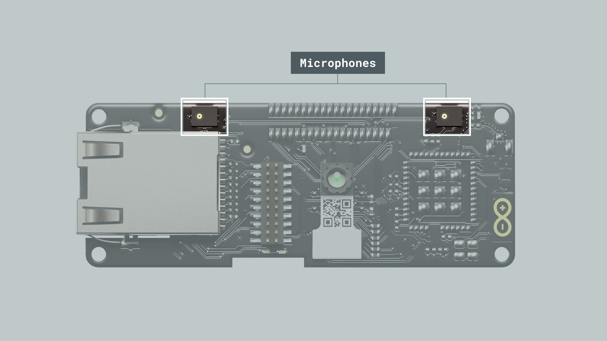

**Features:**
- AOP = 122.5 dB SPL
- 64 dB signal-to-noise ratio
- Omnidirectional sensitivity
- –26 dBFS ± 1 dB sensitivity

### FFT Example

You can analyze frequencies present in sounds alongside their harmonic features using this example.

By measuring the sound level on each microphone we can easily know from where the sound is coming, an interesting capability for robotics and AIoT applications.

```python
import image
import audio
from ulab import numpy as np
from ulab import utils

CHANNELS = 2
SIZE = 512 // (2 * CHANNELS)

raw_buf = None
fb = image.Image(SIZE + 50, SIZE, image.RGB565, copy_to_fb=True)
audio.init(channels=CHANNELS, frequency=16000, gain_db=24, highpass=0.9883)


def audio_callback(buf):
    # NOTE: do Not call any function that allocates memory.
    global raw_buf
    if raw_buf is None:
        raw_buf = buf


# Start audio streaming
audio.start_streaming(audio_callback)


def draw_fft(img, fft_buf):
    fft_buf = (fft_buf / max(fft_buf)) * SIZE
    fft_buf = np.log10(fft_buf + 1) * 20
    color = (222, 241, 84)
    for i in range(0, SIZE):
        img.draw_line(i, SIZE, i, SIZE - int(fft_buf[i]), color, 1)


def draw_audio_bar(img, level, offset):
    blk_size = SIZE // 10
    color = (214, 238, 240)
    blk_space = blk_size // 4
    for i in range(0, int(round(level / 10))):
        fb.draw_rectangle(
            SIZE + offset,
            SIZE - ((i + 1) * blk_size) + blk_space,
            20,
            blk_size - blk_space,
            color,
            1,
            True,
        )


while True:
    if raw_buf is not None:
        pcm_buf = np.frombuffer(raw_buf, dtype=np.int16)
        raw_buf = None

        if CHANNELS == 1:
            fft_buf = utils.spectrogram(pcm_buf)
            l_lvl = int((np.mean(abs(pcm_buf[1::2])) / 32768) * 100)
        else:
            fft_buf = utils.spectrogram(pcm_buf[0::2])
            l_lvl = int((np.mean(abs(pcm_buf[1::2])) / 32768) * 100)
            r_lvl = int((np.mean(abs(pcm_buf[0::2])) / 32768) * 100)

        fb.clear()
        draw_fft(fb, fft_buf)
        draw_audio_bar(fb, l_lvl, 0)
        if CHANNELS == 2:
            draw_audio_bar(fb, r_lvl, 25)
        fb.flush()

# Stop streaming
audio.stop_streaming()
```

With this script running you will be able to see the Fast Fourier Transform result in the image viewport. Also, the sound level on each microphone channel.


### Speech Recognition Example

You can easily implement sound/voice recognition applications using Machine Learning on the edge, this means that the Portenta H7 plus the Vision Shield can run these algorithms locally. 

For this example, we are going to test a [pre-trained model]((https://raw.githubusercontent.com/iabdalkader/microspeech-yesno-model/main/model.tflite)) that can recognize the `yes` and `no` keywords

First, download the `.tflite` [model](https://raw.githubusercontent.com/iabdalkader/microspeech-yesno-model/main/model.tflite) and copy it to the H7 local storage. 

Use the following script to run the example. It can also be found on **File > Examples > Audio > micro_speech.py** in the OpenMV IDE.

```python
import audio
import time
import tf
import micro_speech
import pyb

labels = ["Silence", "Unknown", "Yes", "No"]

led_red = pyb.LED(1)
led_green = pyb.LED(2)

model = tf.load("/model.tflite")
speech = micro_speech.MicroSpeech()
audio.init(channels=1, frequency=16000, gain_db=24, highpass=0.9883)

# Start audio streaming
audio.start_streaming(speech.audio_callback)

while True:
    # Run micro-speech without a timeout and filter detections by label index.
    idx = speech.listen(model, timeout=0, threshold=0.70, filter=[2, 3])
    led = led_green if idx == 2 else led_red
    print(labels[idx])
    for i in range(0, 4):
        led.on()
        time.sleep_ms(25)
        led.off()
        time.sleep_ms(25)

# Stop streaming
audio.stop_streaming()
```
Now, just say `yes` or `no` and you will see the inference result in the OpenMV Serial Monitor.


## Machine Learning Tool

The main features of the Portenta Vision Shield are the audio and video capabilities. This makes it a perfect option for almost infinite machine-learning applications.

Creating this type of application has never been easier thanks to our Machine Learning Tool powered by Edge Impulse®, where we can easily create in a __No-Code__ environment, __Audio__, __Motion__, __Proximity__ and __Image__ processing models.

The first step to start creating awesome artificial intelligence and machine learning projects is to create an [Arduino Cloud](https://cloud.arduino.cc/home/) account.

There you will find a dedicated integration called __Machine Learning Tools__.

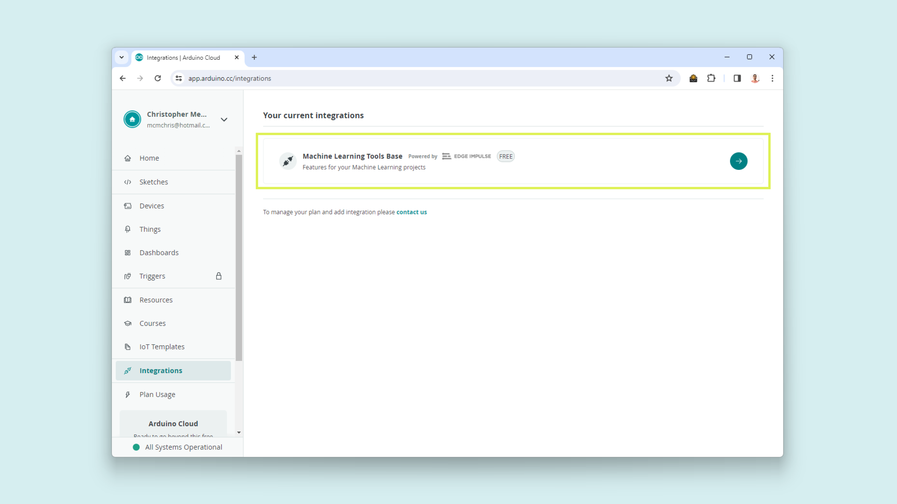

Once in, create a new project and give it a name.

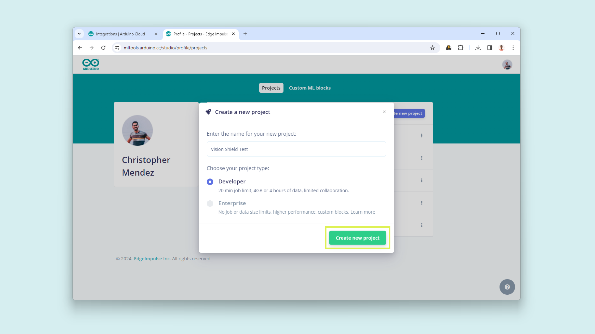

Enter your newly created project and the landing page will look like the following:


### Edge Impulse® Environment Setup

Now, it is time to set up the __Edge Impulse®__ environment on your PC. For this, follow [these](https://docs.edgeimpulse.com/docs/tools/edge-impulse-cli/cli-installation) instructions to install the __Edge Impulse CLI__.

***For Windows users: make sure to install [Visual Studio Community](https://visualstudio.microsoft.com/downloads/) and [Visual Studio Build Tools](https://visualstudio.microsoft.com/downloads/#build-tools-for-visual-studio-2022).***

- Download and install the latest __Arduino CLI__ from [here](https://arduino.github.io/arduino-cli/0.35/installation/). ([Video Guide for Windows](https://www.youtube.com/watch?v=1jMWsFER-Bc))  

- Download the [latest Edge Impulse® firmware](https://cdn.edgeimpulse.com/firmware/arduino-portenta-h7.zip) for the Portenta H7, and unzip the file.

- Open the flash script for your operating system (`flash_windows.bat`, `flash_mac.command` or `flash_linux.sh`) to flash the firmware.

- To test if the __Edge Impulse CLI__ was installed correctly, open the __Command Prompt__ or your favorite terminal and run:

  `edge-impulse-daemon`

  If everything goes okay, you should be asked for your Edge Impulse account credentials.

  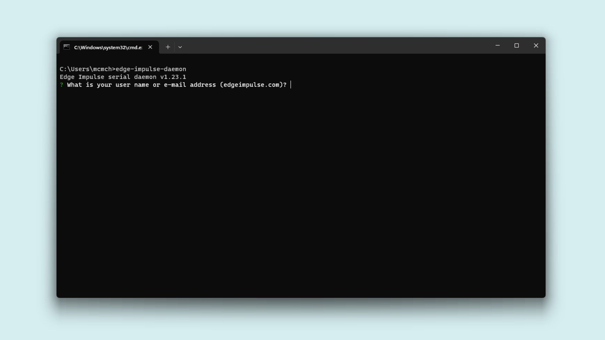

- Enter your account username or e-mail address and your password. 
- Select the project you have created on the Arduino ML Tools, it will be listed.
- Give your device a name and wait for it to connect to the platform.

    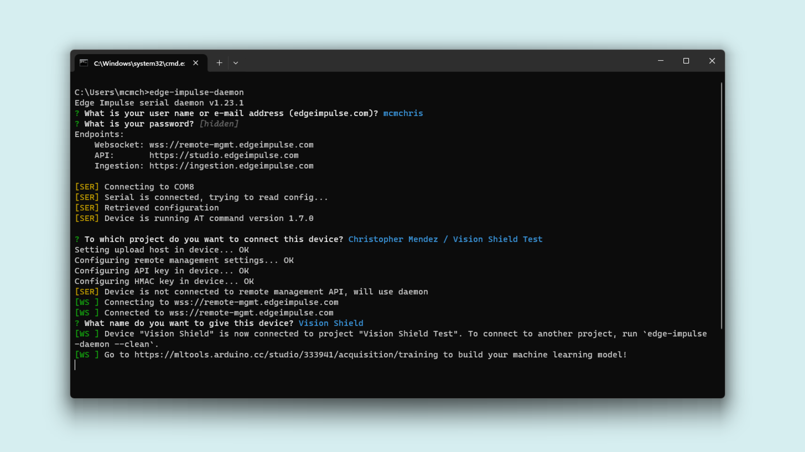

### Uploading Sensor Data 

The first thing to start developing a machine learning project is to create a _dataset_ for your model. This means, uploading _data_ to your model from the Vision Shield sensors.

To upload data from your Vision Shield on the Machine Learning Tools platform, navigate to __Data Acquisition__.

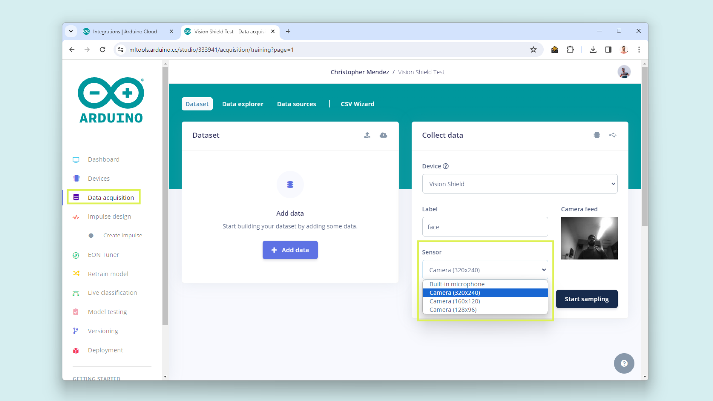

In this section, you will be able to select the Vision Shield onboard sensors individually. 

This is the supported sensors list:
- Built-in microphone
- Camera (320x240)
- Camera (160x160)
- Camera (128x96)

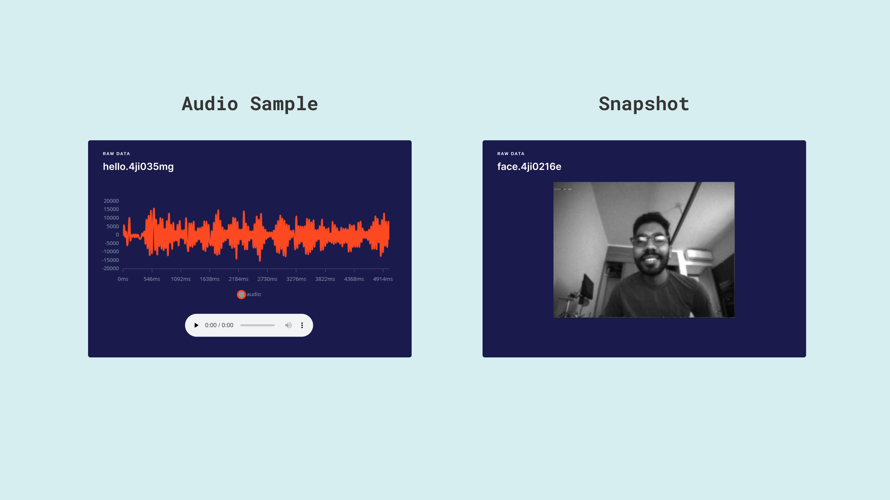

Now you know how to start with our __Machine Learning Tools__ creating your dataset from scratch, you can get inspired by some of our ML projects listed below: 

- [Image Classification with Edge Impulse®](https://docs.arduino.cc/tutorials/portenta-vision-shield/custom-machine-learning-model) (Article).

## Ethernet (ASX00021)

The **Portenta Vision Shield - Ethernet** gives you the possibility of connecting your Portenta H7 board to the internet using a wired connection.

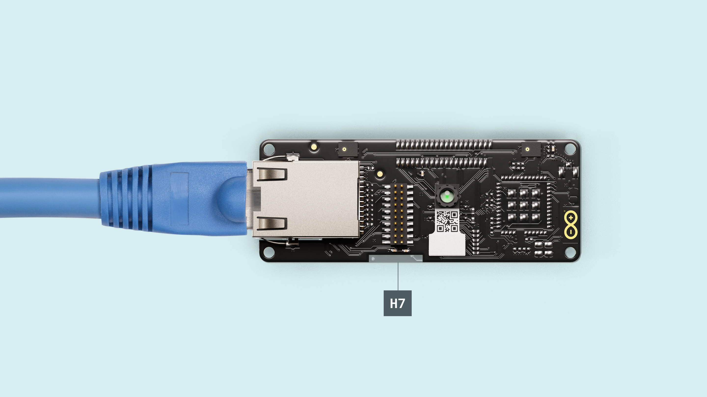

First, connect the Vision Shield - Ethernet to the Portenta H7. Now connect the USB-C® cable to the Portenta H7 and your computer. Lastly, connect the Ethernet cable to the Portenta Vision Shield's Ethernet port and your router or modem.

Now you are ready to test the connectivity with the following Python script. This example lets you know if an Ethernet cable is connected successfully to the shield. 

```python
import network
import time

lan = network.LAN()

# Make sure Eth is not in low-power mode.
lan.config(low_power=False)

# Delay for auto negotiation
time.sleep(3.0)

while True:
    print("Cable is", "connected." if lan.status() else "disconnected.")
    time.sleep(1.0)
```
 If the physical connection is detected, in the OpenMV Serial Monitor, you will see the following message:

 `Cable is connected.`

Once the connection is confirmed, we can try to connect to the internet using the example script below. 

This example lets you gather the current time from an NTP server.

```python
import network
import socket
import struct
import time

TIMESTAMP = 2208988800 + (3600*4) # (3600*4) is used to set the Time Zone (UTC-4)

if time.gmtime(0)[0] == 2000:
    TIMESTAMP += 946684800

# Create new socket
client = socket.socket(socket.AF_INET, socket.SOCK_DGRAM)

# Get addr info via DNS
addr = socket.getaddrinfo("pool.ntp.org", 123)[0][4]

# Send query
client.sendto("\x1b" + 47 * "\0", addr)
data, address = client.recvfrom(1024)

# Print time
t = struct.unpack(">IIIIIIIIIIII", data)[10] - TIMESTAMP
print("Year:%d Month:%d Day:%d Time: %d:%d:%d" % (time.localtime(t)[0:6]))
```
Run the script and the current date and time will be printed in the OpenMV IDE Serial Monitor.

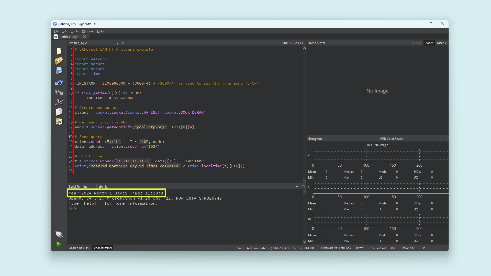

## LoRa® (ASX00026)

The **Vision Shield - LoRa®** can extend our project connectivity by leveraging it LoRa® module for long-range communication in remote areas with a lack of internet access. Powered by the Murata CMWX1ZZABZ module which contains an STM32L0 processor along with a Semtech SX1276 Radio.

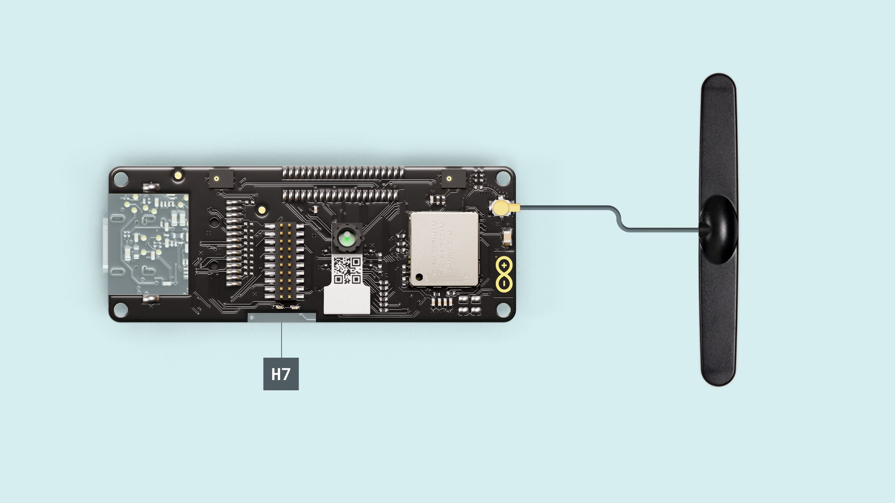

To test the LoRa® connectivity, first, connect the Vision Shield - LoRa® to the Portenta H7. Attach the LoRa® antenna to its respective connector. Now connect the USB-C® cable to the Portenta H7 and your computer. 

***Follow this [guide](https://docs.arduino.cc/tutorials/portenta-vision-shield/things-network-openmv) to learn how to set up and create your __end device__ on The Things Network.***

The following Python script lets you connect to The Things Network using LoRaWAN® and send a `Hello World` message to it.

```python
from lora import *

lora = Lora(band=BAND_AU915, poll_ms=60000, debug=False)

print("Firmware:", lora.get_fw_version())
print("Device EUI:", lora.get_device_eui())
print("Data Rate:", lora.get_datarate())
print("Join Status:", lora.get_join_status())

# Example keys for connecting to the backend
appEui = "*****************"  # now called JoinEUI
appKey = "*****************************"

try:
    lora.join_OTAA(appEui, appKey)
    # Or ABP:
    # lora.join_ABP(devAddr, nwkSKey, appSKey, timeout=5000)
# You can catch individual errors like timeout, rx etc...
except LoraErrorTimeout as e:
    print("Something went wrong; are you indoor? Move near a window and retry")
    print("ErrorTimeout:", e)
except LoraErrorParam as e:
    print("ErrorParam:", e)

print("Connected.")
lora.set_port(3)

try:
    if lora.send_data("HeLoRA world!", True):
        print("Message confirmed.")
    else:
        print("Message wasn't confirmed")

except LoraErrorTimeout as e:
    print("ErrorTimeout:", e)

# Read downlink messages
while True:
    if lora.available():
        data = lora.receive_data()
        if data:
            print("Port: " + data["port"])
            print("Data: " + data["data"])
    lora.poll()
    sleep_ms(1000)
```

Find the frequency used in your country for **The Things Network** on this [list](https://www.thethingsnetwork.org/docs/lorawan/frequencies-by-country/) and modify the parameter in the script within the following function.

```python
lora = Lora(band=BAND_AU915, poll_ms=60000, debug=False) # change the band with yours e.g BAND_US915
```
Define your application `appEUI` and `appKey` in the Python script so the messages are correctly authenticated by the network server.

```python
appEui = "*****************"  # now called JoinEUI
appKey = "*****************************"
```

After configuring your credentials and frequency band, you can run the script. You must be in an area with LoRaWAN® coverage, if not, you should receive an alert from the code advising you to move near a window.

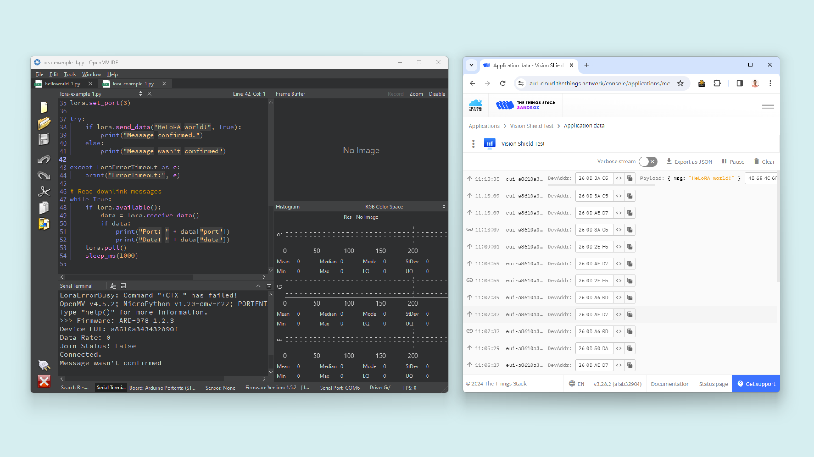

***You can set up your own LoRaWAN® network using our [LoRa® gateways](https://www.arduino.cc/pro/lora-gateways/)***


## Support

If you encounter any issues or have questions while working with the Vision Shield, we provide various support resources to help you find answers and solutions.

### Help Center

Explore our [Help Center](https://support.arduino.cc/hc/en-us), which offers a comprehensive collection of articles and guides for the Vision Shield. The Arduino Help Center is designed to provide in-depth technical assistance and help you make the most of your device.

- [Vision Shield Help Center page](https://support.arduino.cc/hc/en-us/sections/360004767859-Portenta-Family)

### Forum

Join our community forum to connect with other Portenta Vision Shield users, share your experiences, and ask questions. The forum is an excellent place to learn from others, discuss issues, and discover new ideas and projects related to the Vision Shield.

- [Vision Shield category in the Arduino Forum](https://forum.arduino.cc/c/hardware/portenta/portenta-vision-shield/177)

### Contact Us

Please get in touch with our support team if you need personalized assistance or have questions not covered by the help and support resources described before. We're happy to help you with any issues or inquiries about the Vision Shield.

- [Contact us page](https://www.arduino.cc/en/contact-us/) 

