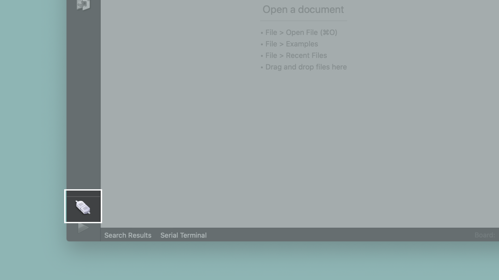
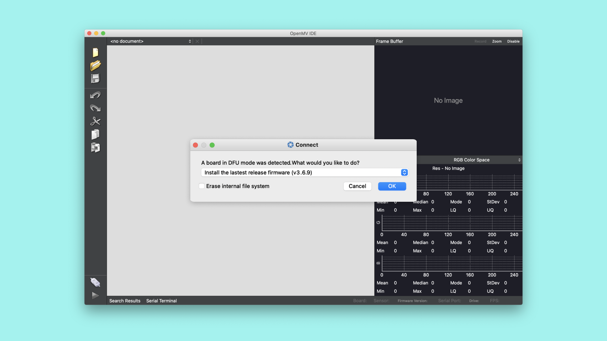

## Overview
The OpenMV IDE is meant to provide an Arduino like experience for simple machine vision tasks using a camera sensor. In this tutorial, you will learn about some of the basic features of the OpenMV IDE and how to create a simple MicroPython script. 

## Goals

- The basic features of the OpenMV IDE
- How to create a simple MicroPython script
- How to use the OpenMV IDE to run MicroPython on Portenta H7


### Required Hardware and Software

- [Portenta H7 (ABX00042)](https://store.arduino.cc/products/portenta-h7), [Portenta H7 Lite (ABX00045)](https://store.arduino.cc/products/portenta-h7-lite) or [Portenta H7 Lite Connected (ABX00046)](https://store.arduino.cc/products/portenta-h7-lite-connected)
- USB-C® cable (either USB-A to USB-C® or USB-C® to USB-C®)
- Portenta Bootloader Version 20+
- OpenMV IDE 2.6.4+

## Instructions

Using the OpenMV IDE, you can run [MicroPython](http://docs.MicroPython.org/en/latest/) scripts on the Portenta H7 board. MicroPython provides a lot of classes and modules that make it easy to quickly explore the features of the Portenta H7. In this tutorial, you will first download the OpenMV IDE and set up the development environment. [Here](https://openmv.io/) you can read more about the OpenMV IDE. OpenMV comes with its own firmware that is built on MicroPython. You will then learn to write a simple script that will blink the on-board RGB LED using some basic MicroPython commands.

### 1. Downloading the OpenMV IDE

Before you can start programming OpenMV scripts for the Portenta, you need to download and install the OpenMV IDE.

***IMPORTANT: Please make sure to update the bootloader to the most recent version to benefit from the latest improvements. Follow [these steps](https://docs.arduino.cc/tutorials/portenta-h7/updating-the-bootloader) before you proceed with the next step of this tutorial.***


Open the [OpenMV download](https://openmv.io/pages/download) page in your browser, download the version that you need for your operating system and follow the instructions of the installer.

### 2. Flashing the OpenMV Firmware

Connect the Portenta to your computer via the USB-C® cable if you haven't done so yet. Make sure you first update the bootloader to the latest version using the **STM32H747_manageBootloader** sketch in the examples menu in the Arduino IDE.

Instructions on how to update the bootloader can be found in the ["Updating the Portenta Bootloader" tutorial](https://docs.arduino.cc/tutorials/portenta-h7/updating-the-bootloader).

After updating the bootloader put the Portenta in bootloader mode by double-pressing the reset button on the board. The built-in green LED will start fading in and out. Now open the OpenMV IDE.


Click on the "connect" symbol at the bottom of the left toolbar.



A pop-up will ask you how you would like to proceed. Select "Reset Firmware to Release Version". This will install the latest OpenMV firmware on the Portenta H7. You can leave the option of erasing the internal file system unselected and click "OK".



Portenta H7's green LED will start flashing while the OpenMV firmware is being uploaded to the board. A terminal window will open and show you the flashing progress. Wait until the green LED stops flashing and fading. You will see a message saying "DFU firmware update complete!" when the process is done.


***Installing the OpenMV firmware will overwrite any existing sketches in the internal Flash of Portenta H7. Also the M7 port will not be exposed in the Arduino IDE anymore. To re-flash the M7 with an Arduino firmware you need to put the board into bootloader mode. To do so, double press the reset button on the Portenta H7 board. The built-in green LED will start fading in and out. In bootloader mode you will see the Portenta M7 port again in the Arduino IDE.***

The board will start flashing its blue LED when it is ready to be connected. After confirming the completion dialog, the Portenta H7 should already be connected to the OpenMV IDE, otherwise click the "connect" button (plug symbol) once again.


### 3. Preparing the Script

Create a new script by clicking the "New File" button in the toolbar on the left side. Import the required module `pyb`:

```python
import pyb # Import module for board related functions
```

A module in Python® is a confined bundle of functionality. By importing it into the script, it gets made available. For this example, you only need `pyb`, which is a module that contains board related functionality such as PIN handling. You can read more about its functions [here](https://docs.micropython.org/en/latest/library/pyb.html).

Now you can create the variables that will control our built-in RGB LED. With `pyb` you can easily control each color.

```python
redLED = pyb.LED(1) # built-in red LED
greenLED = pyb.LED(2) # built-in green LED
blueLED = pyb.LED(3) # built-in blue LED
```

Now you can easily distinguish between which color we control in the script.

### 4. Creating the Main Loop in the Script

Putting your code inside a while loop will make the code run continuously. In the loop you can turn on an LED with `on`, then you can use the `delay` function to create a delay. This function will wait with execution of the next instruction in the script. The duration of the delay can be controlled by changing the value inside the parentheses. The number defines how many milliseconds the board will wait. After the specified time has passed, you can turn off the LED with the `off` function. You can repeat that for each color.

```python
while True:
  # Turns on the red LED
  redLED.on()
  # Makes the script wait for 1 second (1000 milliseconds)
  pyb.delay(1000)
  # Turns off the red LED
  redLED.off()
  pyb.delay(1000)
  greenLED.on()
  pyb.delay(1000)
  greenLED.off()
  pyb.delay(1000)
  blueLED.on()
  pyb.delay(1000)
  blueLED.off()
  pyb.delay(1000)
```

### 5. Uploading the Script

Here you can see the complete blink script:

```python
import pyb # Import module for board related functions

redLED = pyb.LED(1) # built-in red LED
greenLED = pyb.LED(2) # built-in green LED
blueLED = pyb.LED(3) # built-in blue LED

while True:

  # Turns on the red LED
  redLED.on()
  # Makes the script wait for 1 second (1000 milliseconds)
  pyb.delay(1000)
  # Turns off the red LED
  redLED.off()
  pyb.delay(1000)
  greenLED.on()
  pyb.delay(1000)
  greenLED.off()
  pyb.delay(1000)
  blueLED.on()
  pyb.delay(1000)
  blueLED.off()
  pyb.delay(1000)
```

Connect your board to the OpenMV IDE and upload the above script by pressing the play button in the lower left corner.


Now the built-in LED on your Portenta board should be blinking red, green and then blue repeatedly.

## Conclusion
In this tutorial you learned how to use the OpenMV IDE with your Portenta board. You also learned how to control the Portenta H7's RGB LED with MicroPython functions and to upload the script to your board using the OpenMV IDE.

### Next Steps

-   Experiment with MicroPythons capabilities. If you want some examples of what to do, take a look at the examples included in the OpenMV IDE. Go to: **File > Examples > Arduino > Portenta H7** in the OpenMV IDE.
-   Take a look at the other Portenta H7 tutorials which showcase its many uses. You can find them [here](https://docs.arduino.cc/hardware/portenta-h7/#tutorials).

## Troubleshooting

### OpenMV Firmware Flashing Issues

- If the upload of the OpenMV firmware fails during the download, put the board back in bootloader mode and try again. Repeat until the firmware gets successfully uploaded.
- If the OpenMV IDE still cannot connect after flashing the firmware, try uploading the latest firmware using the "Load Specific Firmware File" option. You can find the latest firmware in the [OpenMV Github repository](https://github.com/openmv/openmv/releases). Look for a file named **firmware.bin** in the PORTENTA folder.
- If you experience issues putting the board in bootloader mode, make sure you first update the bootloader to the latest version using the **STM32H747_updateBootloader** sketch from the examples menu in the Arduino IDE.
- If you see a "OSError: Reset Failed" message, reset the board by pressing the reset button. Wait until you see the blue LED flashing, connect the board to the OpenMV IDE and try running the script again.
- In bootloader versions 17 and older there was a bug that could put the Portenta into a boot loop when the transmission aborted while flashing a large firmware file. This was fixed in the bootloader version 18.
