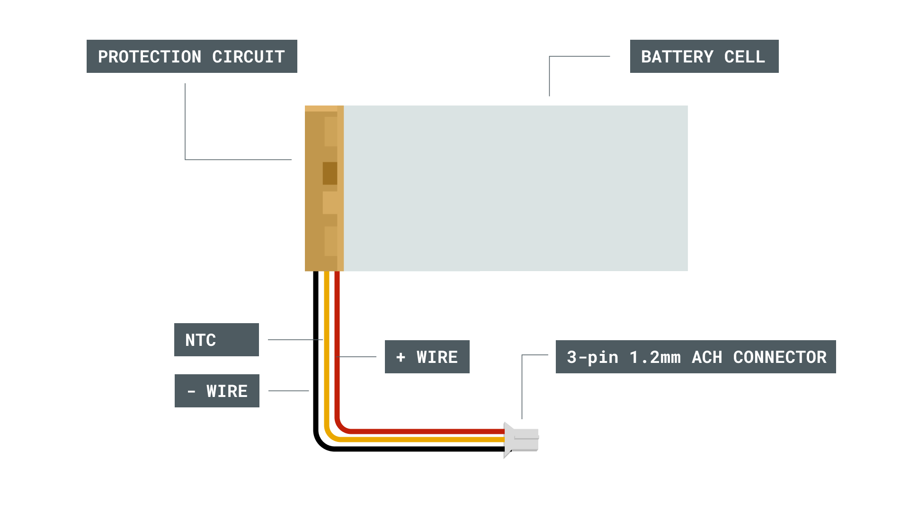
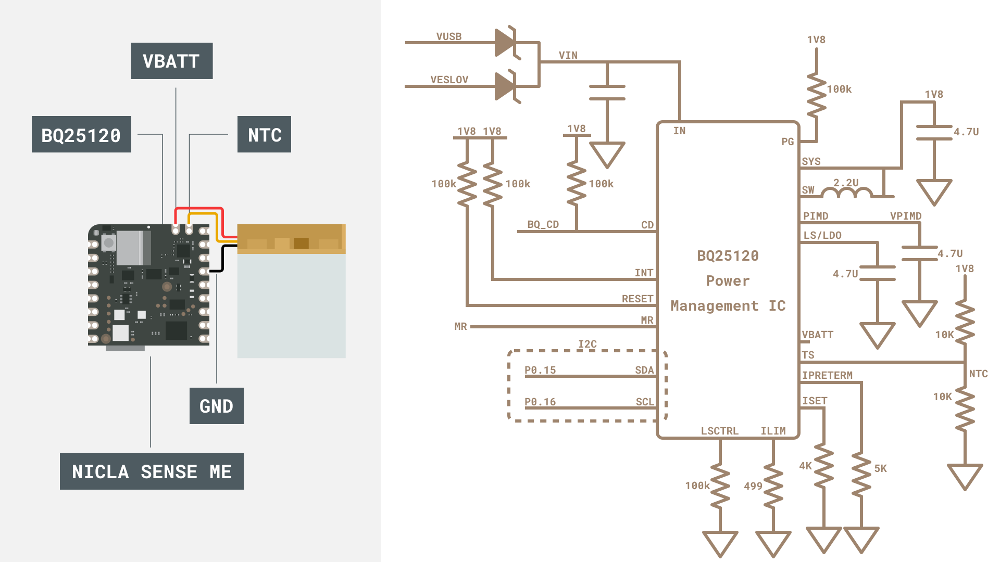

## Introduction

We have developed the Nicla Sense ME for low-power operation, and it really shines when you can use it independantly of a USB cable, especially for wireless sensing applications. The Nicla Sense ME includes a low-profile connector that will allow you to connect a Li-Ion battery. In this application note, we will take a closer look at the battery capabilities of the Nicla boards and how you can use it effectively.

### Goals
The goals of this project are to:
- Learn how to identify connector polarity
- Understand the features of the BQ25120 IC
- Set charging current on the Nicla Sense ME
- 

### Hardware & Software Needed
- [Arduino Nicla Sense ME](https://store.arduino.cc/products/nicla-sense-me)
- Multimeter
- IDE 2.x
- LiPo battery with 3-pin 1.2mm ACH Battery Male Connector

### NTC Battery protection
You can learn about Li-Ion batteries in the [MKR Battery Application Note](/tutorials/mkr-wifi-1010/mkr-battery-app-note). Briefly, the Nicla Sense ME uses a single cell Li-Ion battery. However, this must include a NTC cable, and also comes with a different connector to save space.
*** While a battery without a NTC sensor will work, it should be connected for enhanced safety. ***

The + wire connects to the battery, while the - terminal connects to the ground. The NTC pin connects the negative thermal constant (NTC) resistor to the Nicla board. The NTC helps the Nicla board identify the temperature of the battery and disables it if it is outside the operating temperature. The resistance of the resistor, as the name suggests, becomes less at higher temperatures. Commonly, the resistance between the NTC pin and ground is 10k.

*** Try measuring the resistance between the NTC pin and the ground with a multimeter. Make sure not to short the pins of the battery. ***

### Connector
As noted, a special lower footprint battery connector is used to connect the battery to the Nicla Sense ME board. A male 3-pin JST-ACH connector with 1.2mm pitch must be avaliable on the battery. Each individual connector is made of one plastic housing and three metal crimp terminals. A crimping device may be required if you wish to prepare your own wires. Note that when looking from above (with the slots facing downwards), the red (positive) wire should be on your left.

Alternatively, it is possible to solder the connectors to the pin headers on the board.

### BQ25120 Power Management IC
Power management, including battery charging, is handled by the BQ25120. The BQ25120 is designed for high efficency operation, even at very low current draw.

Input voltage for charging the battery can be supplied either via the ESLOV connector or (more commonly) via the USB connector. An I2C connection between the BQ25120 and the on-board microcontroller allows for control of the charging parameters. The BQ25120 can output power via a switching regulator (more efficent) as well as a linear regulator (less noise). The NTC pin is connected to the middle of a voltage divider which has a default value of 0.9V when nothing is connected. As the temperature increases, the NTC resistance decreases. This reduces the voltage felt on the TS pin.

The BQ25120 can read the battery voltage directly and send the information via I2C to the microcontroller if needed.

## Multimeter Battery Measurements

**1.** Test the battery voltage with a multimeter. A suitable battery would be about 150mAh (which is the about the same size as the Nicla Sense ME board). It should be between 3.3V and 4.2V, regardless of the capacity. If the battery voltage is outside this range, your battery may be damaged.

***Warning: Please make sure that the battery terminals do NOT touch each other. The short circuit can cause permanent damage to the battery and even explosion.***

**2.** Connect your battery to the Nicla Sense ME then check the voltage of VCC using your multimeter. 
You should notice that the voltage of VCC is about 3.3V, regardless of the battery level. The voltage that comes out of the PMIC enters the VCC. The resistance between the NTC pin and ground should be about 10k.

## Set battery current via Serial

## 

## Multimeter Battery Measurements

