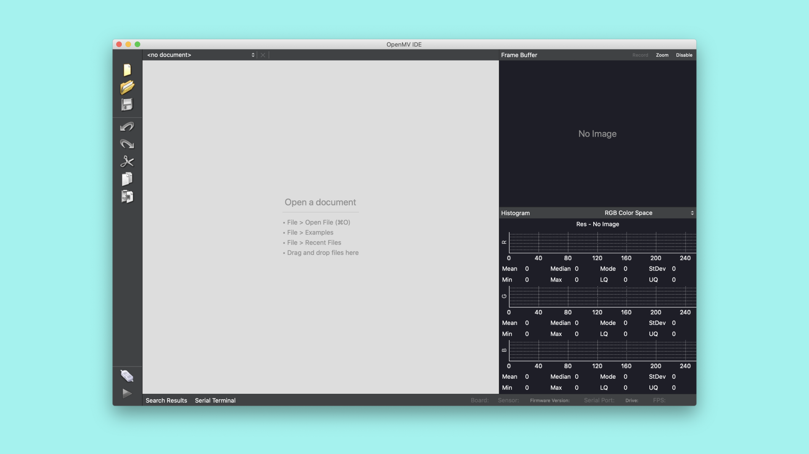
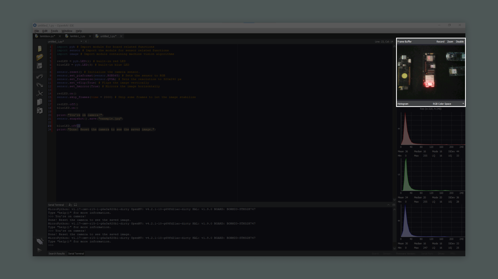

## Overview
The OpenMV IDE is meant to provide an Arduino like experience for simple machine vision tasks using a camera sensor. In this tutorial, you will learn about some of the basic features of the OpenMV IDE and how to create a simple MicroPython script. The Nicla Vision board has OpenMV firmware on the board by default, making it easy to connect to the OpenMV IDE.

## Goals

- The basic features of the OpenMV IDE
- How to create a simple MicroPython script
- How to use the OpenMV IDE to run MicroPython on Nicla Vision


### Required Hardware and Software

- [Nicla Vision](https://store.arduino.cc/products/nicla-vision)
- Micro USB cable (either USB A to Micro USB or USB C to Micro USB)
- OpenMV IDE 2.6.4+

## Instructions

Using the OpenMV IDE you can run [MicroPython](http://docs.MicroPython.org/en/latest/) scripts on the Nicla Vision board. MicroPython provides a lot of classes and modules that make it easy to quickly explore the features of the Nicla Vision. In this tutorial you will first download the OpenMV IDE and set up the development environment. [Here](https://openmv.io/) you can read more about the OpenMV IDE. OpenMV comes with its own firmware that is built on MicroPython. You will then learn to write a simple script that will blink the on-board RGB LED using some basic MicroPython commands.

***Before proceeding with the tutorial please update the board's bootloader. You can do this by first downloading the latest version of the "Mbed OS Nicla core" in the Arduino IDE. Then go to "File > Examples > STM32H747_System > STM32H747_updateBootloader" and upload this sketch to your board. After the sketch is uploaded follow the instructions in the serial monitor.***

### 1. Downloading the OpenMV IDE

Before you can start programming OpenMV scripts for the Nicla Vision you need to download and install the OpenMV IDE.

Open the [OpenMV download](https://openmv.io/pages/download) page in your browser, download the version that you need for your operating system and follow the instructions of the installer.

### 2. Connecting to the OpenMV IDE

Connect the Nicla Vision to your computer via the USB cable if you haven't done so yet.



Click on the "connect" symbol at the bottom of the left toolbar.


A pop-up will ask you how you would like to proceed. Select "Reset Firmware to Release Version". This will install the latest OpenMV firmware on the Nicla Vision. You can leave the option of erasing the internal file system unselected and click "OK".


Nicla Vision's green LED will start flashing while the OpenMV firmware is being uploaded to the board. A terminal window will open which shows you the flashing progress. Wait until the green LED stops flashing and fading. You will see a message saying "DFU firmware update complete!" when the process is done.


The board will start flashing its blue LED when it's ready to be connected. After confirming the completion dialog the Nicla Vision should already be connected to the OpenMV IDE, otherwise click the "connect" button (plug symbol) once again.


### 3. Preparing the Script

Create a new script by clicking the "New File" button in the toolbar on the left side. Import the required module `pyb`:

```python
import pyb # Import module for board related functions
```

A module in Python is a confined bundle of functionality. By importing it into the script it gets made available. For this example we only need `pyb`, which is a module that contains board related functionality such as PIN handling. You can read more about its functions [here](https://docs.micropython.org/en/latest/library/pyb.html).

Now we can create the variables that will control our built-in RGB LED. With `pyb` we can easily control each color.

```python
redLED = pyb.LED(1) # built-in red LED
greenLED = pyb.LED(2) # built-in green LED
blueLED = pyb.LED(3) # built-in blue LED
```

Now we can easily distinguish between which color we control in the script.

### 4. Creating the Main Loop in the Script

Putting our code inside a while loop will make the code run continuously. In the loop we turn on an LED with `on`, then we use the `delay` function to create a delay. This function will wait with execution of the next instruction in the script. The duration of the delay can be controlled by changing the value inside the parentheses. The number defines how many milliseconds the board will wait. After the specified time has passed, we turn off the LED with the `off` function. We repeat that for each color.

```python
while True:
  # Turns on the red LED
  redLED.on()
  # Makes the script wait for 1 second (1000 milliseconds)
  pyb.delay(1000)
  # Turns off the red LED
  redLED.off()
  pyb.delay(1000)
  greenLED.on()
  pyb.delay(1000)
  greenLED.off()
  pyb.delay(1000)
  blueLED.on()
  pyb.delay(1000)
  blueLED.off()
  pyb.delay(1000)
```

### 5. Uploading the Script

Here you can see the complete blink script:

```python
import pyb # Import module for board related functions

redLED = pyb.LED(1) # built-in red LED
greenLED = pyb.LED(2) # built-in green LED
blueLED = pyb.LED(3) # built-in blue LED

while True:

  # Turns on the red LED
  redLED.on()
  # Makes the script wait for 1 second (1000 milliseconds)
  pyb.delay(1000)
  # Turns off the red LED
  redLED.off()
  pyb.delay(1000)
  greenLED.on()
  pyb.delay(1000)
  greenLED.off()
  pyb.delay(1000)
  blueLED.on()
  pyb.delay(1000)
  blueLED.off()
  pyb.delay(1000)
```

Connect your board to the OpenMV IDE and upload the above script by pressing the play button in the lower left corner.


Now the built-in LED on your Nicla Vision board should be blinking red, green and then blue repeatedly.

## Using the Nicla Vision Camera

You can easily access the camera on the Nicla Vision through OpenMV IDE. Below is a short script that will set up the camera and take an image. The board will blink its LED to indicate when it will take the picture. The image can be seen in the frame buffer while the script is running.

```python
import pyb # Import module for board related functions
import sensor # Import the module for sensor related functions
import image # Import module containing machine vision algorithms

redLED = pyb.LED(1) # built-in red LED
blueLED = pyb.LED(3) # built-in blue LED

sensor.reset() # Initialize the camera sensor.
sensor.set_pixformat(sensor.RGB565) # Sets the sensor to RGB
sensor.set_framesize(sensor.QVGA) # Sets the resolution to 320x240 px
sensor.set_vflip(True) # Flips the image vertically
sensor.set_hmirror(True) # Mirrors the image horizontally

redLED.on()
sensor.skip_frames(time = 2000) # Skip some frames to let the image stabilize

redLED.off()
blueLED.on()

print("You're on camera!")
sensor.snapshot().save("example.jpg")

blueLED.off()
print("Done! Reset the camera to see the saved image.")
```

The camera that comes with the Nicla Vision supports RGB 565 images. That's why we use `sensor.set_pixformat(sensor.RGB565)`, enabling the camera to take an image with color. Then we need to set the resolution of the camera. Here we will use `sensor.set_framesize(sensor.QVGA)`.

Using `sensor.set_vflip` and `sensor.set_hmirror` will help us set the correct orientation of the image. If you hold the board with the USB cable facing down you want to call `sensor.set_vflip(True)`. The image will be mirrored, if you want the image to be displayed as you see it from your perspective, you want to call `sensor.set_hmirror(True)`.

Running this script in OpenMV will show the image that the camera is currently capturing in the top right corner, inside the frame buffer. The onboard red LED will be on for a couple of seconds, then the blue LED will turn on, this indicates when the picture is about to be taken. A message will be printed in the serial terminal when the image is taken.



The image will be saved as "example.jpg" in the boards directory. It is also possible to save the image in a ".bmp" format. If you reset the camera by pressing the reset button the image file will appear in the boards directory.

## Using the Nicla Vision with Arduino IDE

As mentioned before, the Nicla Vision comes with OpenMV firmware pre installed. This makes it easier to use the board with OpenMV out of the box. It is possible to use the Nicla Vision with the Arduino IDE. First make sure that you have the latest core installed. To install the core navigate into **Tools > Board > Boards Manager...**, in the Boards Manager window search for **Nicla Vision MBED** and install it. When this core is installed and you have your board connected to your computer, select the port that the board is connected to and the boards core. You should now be able to upload an Arduino sketch to the board.

If you wish to use the board with OpenMV after it has been used with the Arduino IDE, you have to put the board into bootloader mode and install OpenMV firmware. You do this by double pressing the reset button, located next to the LED. When the board is in bootloader mode and connected to your computer, follow the steps above in the **2. Connecting to the OpenMV IDE** section to connect the board to the OpenMV IDE again.

## Conclusion
In this tutorial you learned how to use the OpenMV IDE with your Nicla Vision board. You also learned how to control the Nicla Vision's RGB LED with MicroPython functions and to upload the script to your board using the OpenMV IDE.

### Next Steps

-   Experiment with MicroPythons capabilities. If you want some examples of what to do, take a look at the examples included in the OpenMV IDE. Go to: **File > Examples > Arduino > ** in the OpenMV IDE.
-   It is possible to use the board for more advanced image processing tasks. Be sure to take a look at our other tutorials if you want to learn more.
-   Take a look at our other Nicla Vision tutorials which showcase its many uses. You can find them [here](https://docs.arduino.cc/hardware/nicla-vision#tutorials).

## Troubleshooting

### OpenMV Firmware Flashing Issues

- If the upload of the OpenMV firmware fails during the download, put the board back in bootloader mode and try again. Repeat until the firmware gets successfully uploaded.
- If the OpenMV IDE still can't connect after flashing the firmware, try uploading the latest firmware using the "Load Specific Firmware File" option. You can find the latest firmware in the [OpenMV Github repository](https://github.com/openmv/openmv/releases). Look for a file named **firmware.bin**.
- If you see a "OSError: Reset Failed" message, reset the board by pressing the reset button. Wait until you see the blue LED flashing, connect the board to the OpenMV IDE and try running the script again.
