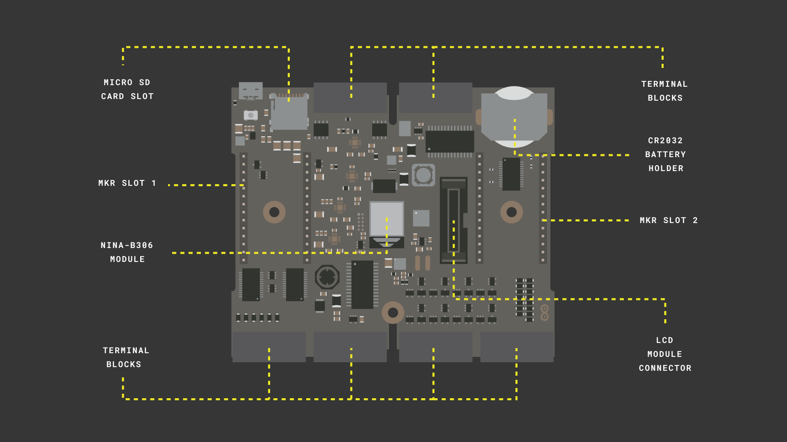
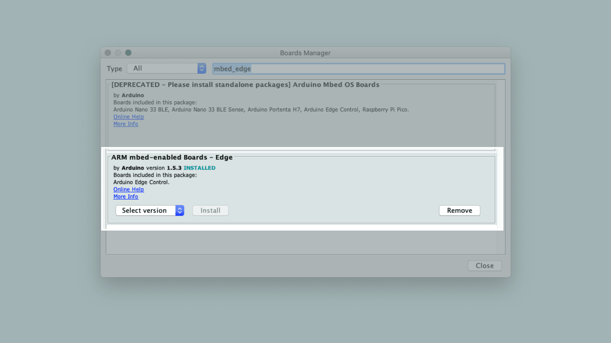
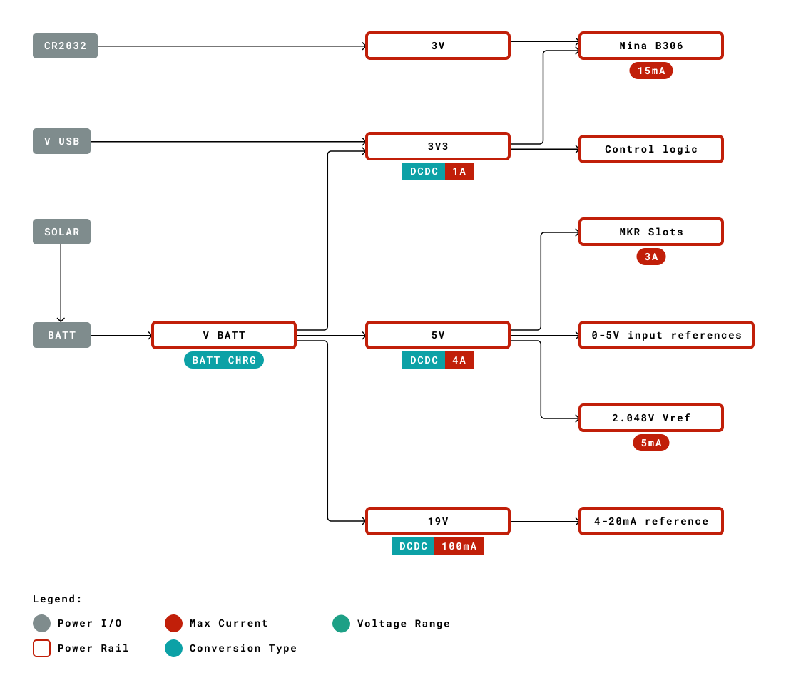
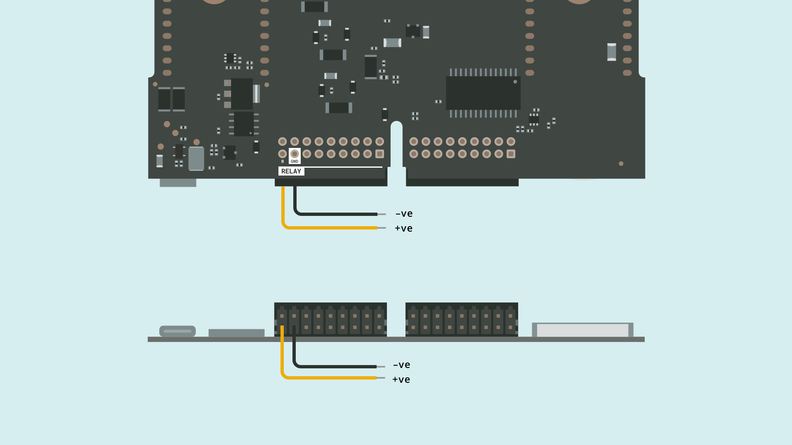

## Overview
The Edge Control board is a versatile tool that allows agriculturalists to develop creative and innovative solutions for agriculture by harnessing modern technology. In this tutorial you will set up the development environment for the board and learn to write a simple sketch that blinks the on-board LED. 

## Goals
- About the basic board topology
- How to setup the development environment
- How to power up the board
- About the basic API provided by the Arduino_EdgeControl library

### Required Hardware and Software
- [Arduino Edge Control](https://store.arduino.cc/edge-control)
- Micro USB cable
- Arduino IDE 1.8.10+
- External power source: a 12V SLA battery or 12V power supply 
- 1x Connector 
- 2x Jumper wires 

## Instructions

In this getting started tutorial you will set up the Edge Control board and blink an LED. You will first learn to install the core from the Boards Manager. You will write a simple blink sketch using some fundamental APIs provided by the Arduino Edge Control Library. You will need to connect your board to an external power source and therefore have a SLA battery or a power source with you when running the sketch. 

### 1. Get to Know the Board

The Arduino Edge Control board is designed to address the needs of **precision farming**. It provides a low power control system and modular connectivity allows you to adapt the board to your specific farming needs. The following image gives you an overview of some of the core features of the board that you need to be aware of before you can get started with the board.  



**Terminal Blocks** allows you to connect up to 

- **8** x **5V Analog Sensors**
- **4** x **4-20mA sensors**
- **16** x **Watermark Sensors** 
- **16** x **Latching Devices** (e.g. Motorized Valves)

and provides **4** x **configurable Solid State Relays**. 

***Connections to the Terminal blocks are made through the connectors included in the kit.***

The **LCD Module Connector**  is used to attach the LCD module to the Edge Control Board through a flat cable.  

The on-board **MKR slots 1 & 2** can be used to connect Arduino MKR boards to extend the capabilities such as connectivity through **LoRa, Wi-Fi, 2G/3G/CatM1/NBIoT**, and Sigfox. 

The board includes both a **microSD card socket** and an additional **2MB Flash memory** for data storage. Both are directly connected to the main processor via a SPI interface.

This board comes with the **Nina B306** processor which is the same processor used in other boards such as the **Nano 33 BLE**. 

### 2. The Basic Setup

Before you start programming the Edge control board, you will have to download the [Mbed core](https://github.com/arduino/ArduinoCore-mbed) from the board manager. In the Arduino IDE open the **Board manager** search for the `Edge Control` core and install it. 



### 3. The Blink Sketch

Open a new sketch file, name it `hello_edge_control.ino` and add the **Edge Control library**. This library provides access to many of the different pins and functionalities of the board. 

```cpp
#include <Arduino_EdgeControl.h>
```

For this example you need to ensure that the Serial communication has begun. The following code ensures that the board waits for at least 2.5 seconds before it times out and continues without an established serial connection. This guarantees that the communication has been established when connected to the Serial Monitor and also allows to work without being connected to it. Print a message on the Serial port with the text `Hello, Edge Control` 

```cpp
  // Set the timeout
  auto startNow = millis() + 2500;
  while (!Serial && millis() < startNow);
  Serial.println("Hello, Edge Control!");
```

The board is designed to be very low power and for this reason some the electronics are powered off by default. Once the serial communication has been established, we need to enable the power on the power rails that we want to use. The power tree below will give you an idea of the different power rails in the board. 




The Edge Control board uses an I/O expander in order to increase the number of digital control signals. If we want to blink the on-board LED we would need to enable the power of the I/O expander to which the LED is connected to and also enable the power to the 5V DCDC converter. 5V power line is powered by the **battery source** for which you can either use a power supply or a SLA battery to provide the required voltage.

The `Power` class provides API access to enable the different voltages on the board. In this tutorial we need to enable the 3.3V and 5V power lines using the `enable3V3()` and `enable5V()` functions. 

```cpp
// Enable power lines 
Power.enable3V3();
Power.enable5V();
```

Communication to the I/O Expander happens through the I2C port which we initialize with `Wire.begin()`. We also need to initialize the expander and configure the LED pin as OUTPUT. 

```cpp
// Start the I2C connection 
Wire.begin();

// Initialize the expander pins 
Expander.begin();
Expander.pinMode(EXP_LED1, OUTPUT);
```

Inside the loop function, you can use the `Expander.digitalWrite(pin, value)` function to control the LED via the I/O expander as with a normal GPIO pin.

```cpp
Serial.println("Blink");
Expander.digitalWrite(EXP_LED1, LOW);
delay(500);
Expander.digitalWrite(EXP_LED1, HIGH);
delay(500);
```

**Hint: The Complete Sketch can be found in the Conclusions**

### 4. Connect a Power Source 

Power sources can be connected to the on-board relay ports of the Edge Control board. Attach your **connectors** to the **RELAY terminal** on the board. Connect two jumper wires to the **GND** and **B** pins of the **Relay ports**. 



Connect a jumper from the **B** pin to the positive terminal of the battery and a jumper from the **GND** pin to the negative terminal of the battery 

### 5. Upload the Sketch 

Connect the board to your computer, upload the `hello_edge_control.ino` sketch and open the **Serial Monitor**. If all the connections are done right, the LED blinks and you should be able to see the output  `Hello Edge Control` and `Blink` in the serial monitor. 

## Conclusion
In this tutorial you learned how to set up your Edge Control Board, to power it, and how to use the core functions to control the GPIO pins.

### Complete Sketch 

```cpp
#include <Arduino_EdgeControl.h>

void setup() {
  Serial.begin(9600);

  // Set the timeout
  auto startNow = millis() + 2500;
  while (!Serial && millis() < startNow);
  Serial.println("Hello, Edge Control Sketch!");

  // Enable power lines 
  Power.enable3V3();
  Power.enable5V();

  // Start the I2C connection 
  Wire.begin();

  // Initialize the expander pins 
  Expander.begin();
  Expander.pinMode(EXP_LED1, OUTPUT);
}

void loop() {    
    // put your main code here, to run repeatedly:
    Serial.println("Blink");
    Expander.digitalWrite(EXP_LED1, LOW);
    delay(500);
    Expander.digitalWrite(EXP_LED1, HIGH);
    delay(500);
}
```

### Next Steps

We are developing new tutorials on how to connect valves, LCDs, watermark sensors and use many other functionalities of the board. In the mean time you can explore the [Arduino Edge Control](https://github.com/arduino-libraries/Arduino_EdgeControl)  library to develop your own application.
