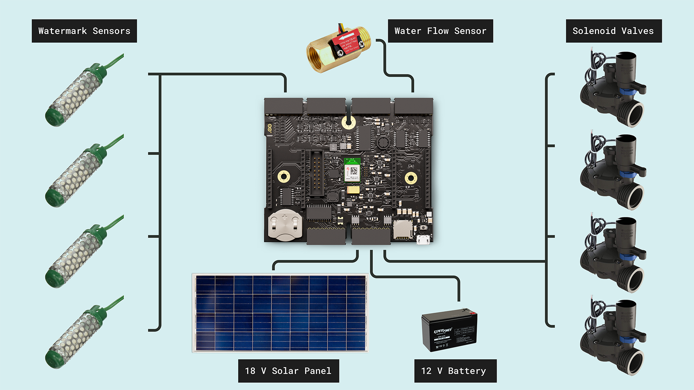
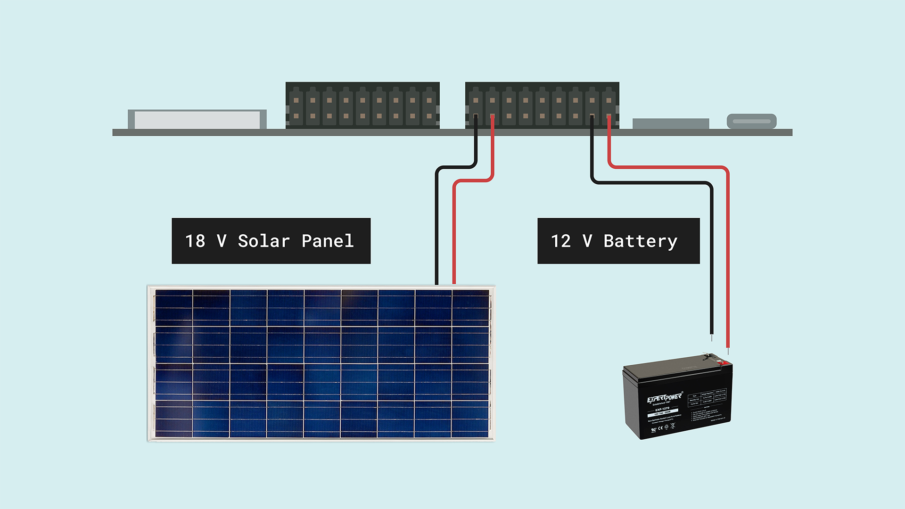
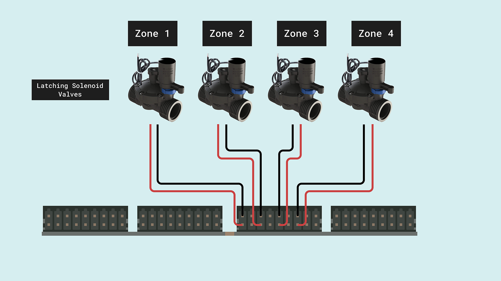
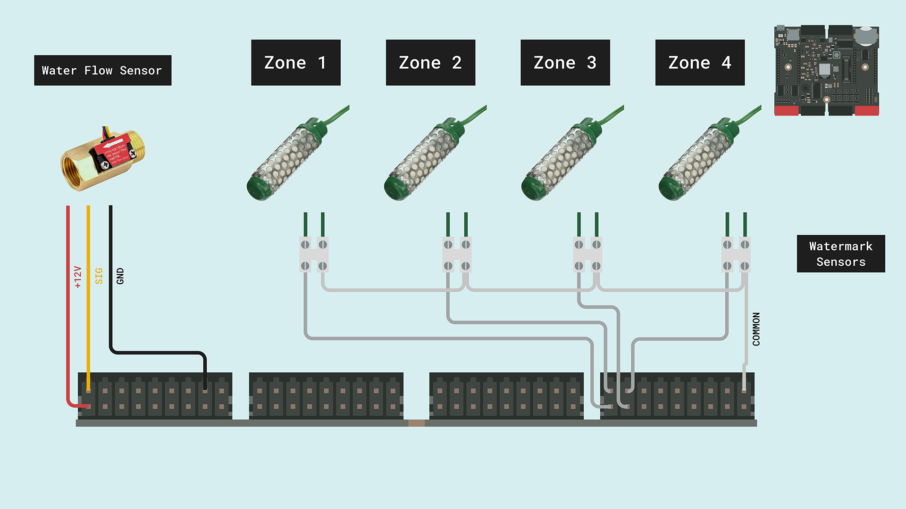
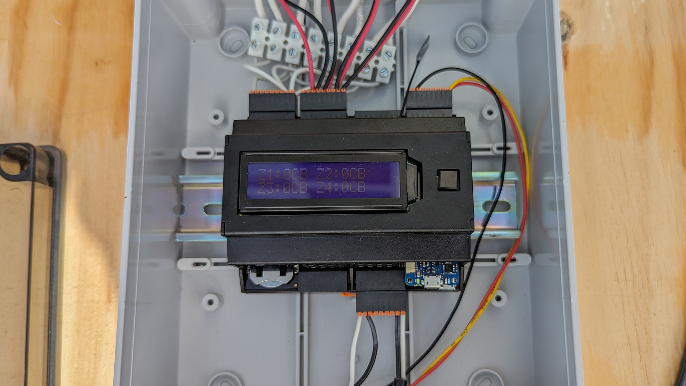
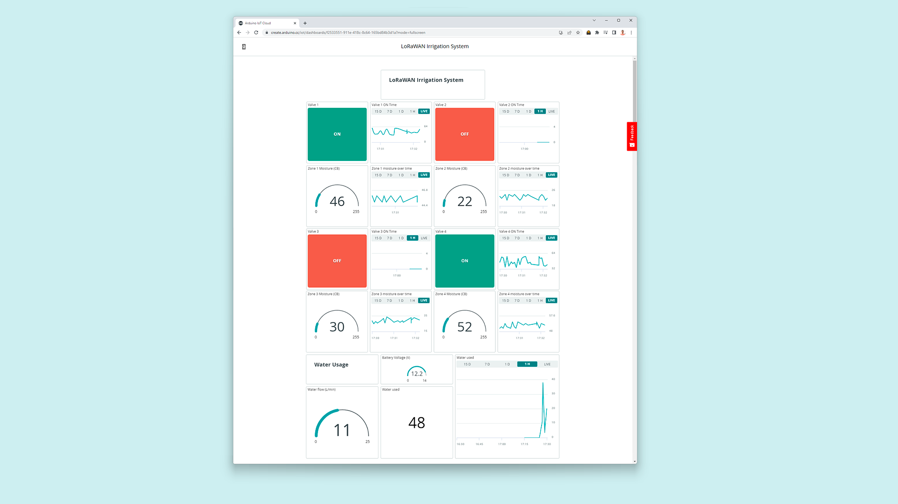
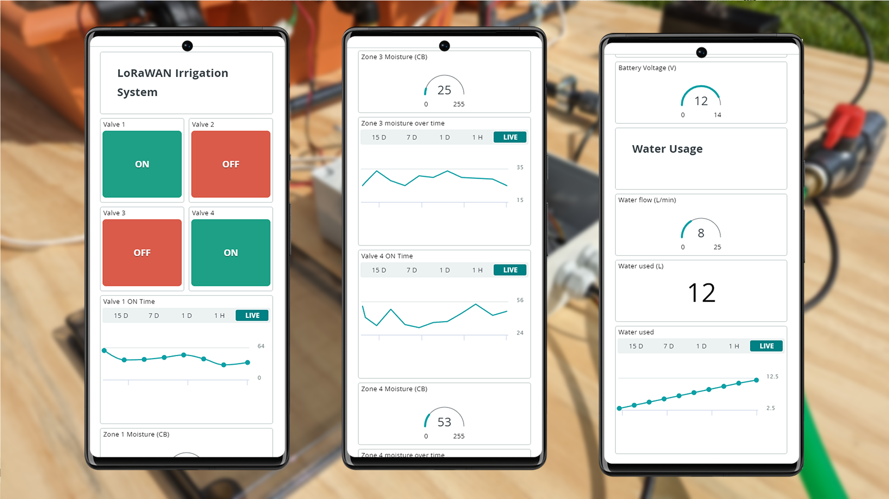
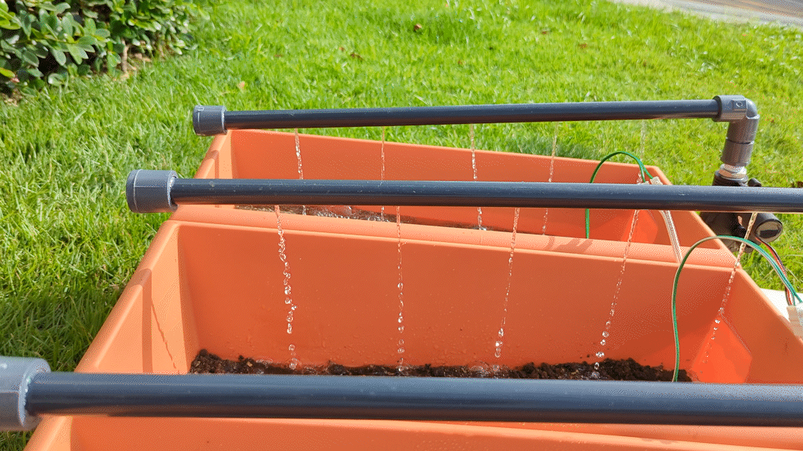

## Introduction

We know that agricultural activities are normally carried out in remote environments, this makes access to electricity and connectivity a challenge. 

Smart farming techniques are being implemented more and more due to the importance of optimizing the use of resources. This includes the demand for more efficient, eco-friendly, and more profitable crops.


Implementing traditional wired communication infrastructure in remote areas can be expensive and time-consuming. LoRaWAN, being a wireless technology, provides a cost-effective alternative as it requires minimal infrastructure setup, reducing installation and maintenance costs.

Arduino has you covered in these scenarios with its Pro solutions. With products designed to work in remote environments, supplying their power from renewable sources and providing long-distance connectivity and low power consumption.

The shown application note is intended to replicate a scaled smart farming application, that can be implemented on real agriculture fields using the same hardware and firmware.

## Goals

The goal of this application note is to showcase a sensorized farming irrigation system using a combination of an Edge Control, an MKR WAN 1310, and the Arduino IoT Cloud. The project's objectives are the following:

- Independently control four irrigation zones using latching valves.
- Leverage MKR WAN 1310 with LoRa and a Wisgate (Lite or PRO) to communicate with Arduino IoT Cloud.
- Monitor soil moisture and decide whether to irrigate based on it. 
- Display the soil humidity level on the Edge Control Enclosure kit LCD.
- Manually activate irrigation through Enclosure Kit built-in push button.
- Monitor average humidity level, irrigation time and water consumption on dedicated charts on Arduino IoT Cloud.
- Get water from a garden hose with a flow sensor able to evaluate the amount of consumed water.

## Hardware and Software Requirements


### Hardware Requirements
- Arduino Edge Control
- Arduino MKR WAN 1310
- Arduino Edge Control Enclosure Kit
- Water flow sensor (YF-B2 DN15)
- WATERMARK Soil Moisture Sensors.
- 2-Wires Latching Solenoid Valves (x4)
- 12 VDC 5Ah acid/lead SLA battery (x1)
- 18 VDC 180 W solar panel.
- 3.4 meters of DN15 PVC pipes (x1)
- DN15 PVC TEE pipes (x3)
- DN15 PVC elbow (x8)
- DN15 Manual Valve (x1)
- DN15 PVC caps (x4)
- DN15 PVC male adapters (x11)
- DN15 wall pipe brackets (x7)
- DN15 to DN20 adapters (x8)
- Rectangular planters (x4)
- DIN rail (x1)
- Cable glands (x6)
- 6 meters of duplex cable AWG 18 (x1)
- Electrical Register Box (x1)

### Software Requirements

- [Arduino IDE 1.8.10+](https://www.arduino.cc/en/software), [Arduino IDE 2](https://www.arduino.cc/en/software), or [Arduino Web Editor](https://create.arduino.cc/editor).
- If you are going to use an offline Arduino IDE, you must install the following libraries: `Arduino_EdgeControl` and `ArduinoIoTCloud`. You can install them through the Arduino IDE Library Manager.
- The [Irrigation System Arduino Sketches](assets/Edge-Control_MKR_Codes.zip).
- [Arduino Create Agent](https://create.arduino.cc/getting-started/plugin/welcome) to provision the MKR WAN 1310 on the Arduino IoT Cloud.

## Irrigation System Setup

The electrical connections of the intended application are shown in the diagram below:



- The Edge Control board will be powered with a 12 VDC acid/lead SLA battery connected to BATT+ and GND of J11 respectively, the battery will be recharged with an 18 VDC 180W solar panel connected to SOLAR+ and GND on the same connector.



- The four solenoid valves will be connected to the Edge Control latching outputs of the J9 connector following the wiring below. 



- The water flow sensor will be connected to a +12 VDC output, GND and the signal wire to the IRQ_C_CH_1, of the J3 connector, and the four watermark sensors will be connected to a terminal block rail, one terminal to the common and the others to the watermark sensor inputs from 1 to 4 respectively on J8.



Here are the physical connections:



## Irrigation System Overview

The irrigation system works as a whole: it integrates the water flow measurement and the activation of the valves, done by the Edge Control, with the Cloud communication, using the MKR WAN 1310.

The Edge Control is responsible for:

- Measuring the water usage with a water flow sensor.
- Measuring the soil humidity level using watermark sensors.
- Controlling an LCD screen where different system variables will be shown, including soil humidity.
- Deciding whether to irrigate based on local humidity.

The MKR WAN 1310 is responsible for:

- Providing Cloud connectivity using LoRaWAN.
- Reporting the values of the Edge Control sensors on the cloud. 

The communication between both devices is done leveraging the I2C communication protocol.


### Valves Control

The valves can be controlled manually by using the onboard button, one tap opens the valve one, two taps valve two, and so on. Also, the valves can be controlled automatically by the system when the soil moisture is poor, for this we must enable the "Smart mode" by tapping the button five times. The working time of the valves is monitored and reported on the cloud to enable an efficient visualization of the average daily use.

*** These valves are latching ones, which means they are activated by a pulse. The polarity defines if it opens or closes. This pulse must be in the range of 20-40 ms, more than that can damage the latching outputs. *** 

### Water Usage

The water flow sensor will measure the water used and will calculate its volume in liters. This information will be monitored through the cloud and the integrated LCD.

### Soil moisture measurement

Instead of measuring the percentage of water by volume in a given amount of soil, we will be using watermark sensors that are capable of measuring the physical force holding water in the soil, this is correlated with how difficult it is for the plants to extract water from the soil. 

This measurement is done in Centibars, and we can use the following readings as a general guideline:

- **0-10 Centibars** = Saturated soil
- **10-30 Centibars** = Soil is adequately wet (except coarse sands, which are drying)
- **30-60 Centibars** = Usual range for irrigation (most soils)
- **60-100 Centibars** = Usual range for irrigation in heavy clay
- **100-200 Centibars** = Soil is becoming dangerously dry- proceed with caution!

### Arduino Edge Control Code

Let's go through some important code sections to make this application fully operative; starting with the required libraries:

```arduino
#include <Arduino_EdgeControl.h>
#include <Wire.h>
#include <RunningMedian.h>

#include "SensorValues.hpp"
#include "Helpers.h"

// The MKR1 board I2C address
#define EDGE_I2C_ADDR 0x05

constexpr unsigned int adcResolution{ 12 };  // Analog Digital Converter resolution for the Watermark sensors.

mbed::LowPowerTimeout TimerM;

// Watermark sensors thresholds
const long open_resistance = 35000, short_resistance = 200, short_CB = 240, open_CB = 255, TempC = 28;

// Watermark sensors channels
uint8_t watermarkChannel[4] = { 0, 1, 2, 3 };

constexpr float tauRatio{ 0.63f };
constexpr float tauRatioSamples{ tauRatio * float{ (1 << adcResolution) - 1 } };
constexpr unsigned long sensorDischargeDelay{ 2 };

constexpr unsigned int measuresCount{ 20 };
RunningMedian measures{ measuresCount };

constexpr unsigned int calibsCount{ 10 };
RunningMedian calibs{ calibsCount };

unsigned long previousMillis = 0;  // will store last time the sensors were updated

const long interval = 180000;  // interval of the LoRaWAN message (milliseconds)

// Variables for the water flow measurement
volatile int irqCounts;
float calibrationFactor = 4.5;
volatile byte pulseCount = 0;
float flowRate = 0.0;
unsigned int flowMilliLitres = 0;
unsigned long totalMilliLitres = 0;
unsigned long oldTime = 0;
unsigned long oldTime2 = 0;

// Valves flow control variables
bool controlV1 = 1;
bool controlV2 = 1;
bool controlV3 = 1;
bool controlV4 = 1;

// Valves On time kepping variables
int StartTime1, CurrentTime1;
int StartTime2, CurrentTime2;
int StartTime3, CurrentTime3;
int StartTime4, CurrentTime4;

// LCD flow control variables
bool controlLCD = 1;
int showTimeLCD = 0;

// Smart mode variables
#define dry_soil 30
bool smart = false;
bool V1open = 0;
bool V2open = 0;
bool V3open = 0;
bool V4open = 0;
/** UI Management **/
// Button statuses
enum ButtonStatus : byte {
  ZERO_TAP,
  SINGLE_TAP,
  DOUBLE_TAP,
  TRIPLE_TAP,
  QUAD_TAP,
  FIVE_TAP,
  LOT_OF_TAPS
};

// ISR: count the button taps
volatile byte taps{ 0 };
// ISR: keep elapsed timings
volatile unsigned long previousPress{ 0 };
// ISR: Final button status
volatile ButtonStatus buttonStatus{ ZERO_TAP };

SensorValues_t vals;

```
- `Arduino_EdgeControl.h` will enable the support for the Edge Control peripherals; install it by searching for it on the Library Manager.
- `Wire.h` will enable the I2C communication between the Edge Control, the MKR WAN 1310 and the other peripherals. It is included in the Board Support Package (BSP) of the Edge Control.
- `RunningMedian.h` handles the calculations regarding the watermark sensor measurements.

There are two headers included in the project code able to handle some helper functions and structures:

- `SensorValues.hpp` handles the shared variables between the Edge Control and the MKR WAN 1310 through I2C.
- `Helpers.h` handles the real-time clock (RTC) functions to retrieve the local date and time.

This code's section also contains all the system variables regarding the following:
- Constants and variables to set and store the watermark sensors data.
- Constants and variables for the water flow sensor.
- Flow control variables.
- Structure to handle the number of button taps to control each valve manually.

```arduino
/**
  Main section setup
*/
void setup() {

  EdgeControl.begin();
  Wire.begin();

  delay(500);
  Serial.begin(115200);
  delay(2000);

  Power.enable3V3();
  Power.enable5V();
  Power.on(PWR_3V3);
  Power.on(PWR_VBAT);
  Power.on(PWR_MKR1);

  delay(5000);  // giving time for the MKR WAN 1310 to boot

  // Init Edge Control IO Expander
  Serial.print("IO Expander initializazion ");
  if (!Expander.begin()) {
    Serial.println("failed.");
    Serial.println("Please, be sure to enable gated 3V3 and 5V power rails");
    Serial.println("via Power.enable3V3() and Power.enable5V().");
  } else Serial.println("succeeded.");

  // Init IRQ INPUT pins
  pinMode(IRQ_CH1, INPUT);

  // Attach callbacks to IRQ pins
  attachInterrupt(digitalPinToInterrupt(IRQ_CH1), [] {irqCounts++;},FALLING);

  // LCD button definition
  pinMode(POWER_ON, INPUT);
  attachInterrupt(POWER_ON, buttonPress, RISING);

  Watermark.begin();
  Latching.begin();
  analogReadResolution(adcResolution);

  setSystemClock(__DATE__, __TIME__);  // define system time as a reference for the RTC

  // Init the LCD display
  LCD.begin(16, 2);
  LCD.backlight();

  LCD.home();
  LCD.print("LoRa Irrigation");
  LCD.setCursor(5, 1);
  LCD.print("System");
  CloseAll();
  delay(2000);

  LCD.clear();
}
```

To save energy and resources, the Edge Control has different power lines that must be enabled to power the different internal and external peripherals. In this case, the 3.3 V, 5 V, Battery, and the MKR1 slot need to be enabled. 

We are using an external interruption for the water flow sensor attached to the IRQ_CH1 and the LCD button.

To handle all the I/O, the I/O Expander together with the Enclosure Kit LCD and the sensors inputs need to be initialized. 

```arduino
void loop() {

  // LCD button taps detector function
  detectTaps();
  tapsHandler();

  // reset the valves accumuldated on time every day at midnight
  if (getLocalhour() == " 00:00:00") {
    Serial.println("Resetting accumulators every day");
    vals.z1_on_time_local = 0;
    vals.z2_on_time_local = 0;
    vals.z3_on_time_local = 0;
    vals.z4_on_time_local = 0;
    delay(1000);
  }

  readWatermark();

  if ((millis() - oldTime2) >= 1000)  // Only process counters once per second
  {
    oldTime2 = millis();
    readWaterFLow();
    auto vbat = Power.getVBat(adcResolution);
    Serial.print("Battery Voltage: ");
    Serial.println(vbat);
    vals.battery_volt_local = vbat;
  }

  unsigned long currentMillis = millis();

  if (currentMillis - previousMillis >= interval) {

    previousMillis = currentMillis;

    // send local sensors values and retrieve cloud variables status back and forth
    Serial.println("Sending variables to MKR");
    updateSensors();
  }

  // activate, deactive and keep time of valves function
  valvesHandler();
}
```

The Edge Control will check the number of button taps for the valve's manual control and handle the right action to do through the use of a switch case statement.
Then will read the watermark sensors, and periodically it will measure the battery voltage.

Every 3 minutes, the Edge Control will request the MKR WAN to send a LoRaWAN message updating the sensors values in the cloud. 

Finally, from our loop function, we will check the valves states to control them and keep track of their active time.

### Arduino MKR WAN 1310 Code

The MKR WAN 1310 needs the following libraries:

- `ArduinoJson.h` parse and create JSON structures to visualize the I2C sent variables. It can be installed directly from the Arduino Library Manager.
- `Wire.h` will enable the I2C communication between the Edge Control, the MKR WiFi 1010 and the other peripherals. It is included in the BSP of the MKR WiFi board.

There are three headers included in the project code that handles some helper functions and structures:

- `thingProperties.h` is automatically generated by the Arduino IoT Cloud. However, if you are using an offline IDE, verify it is in the same directory as your sketch and includes all the Arduino IoT Cloud variables.
- `SensorValues.hpp` handles the shared variables between the Edge Control and the MKR WiFi 1010 through I2C.
- `arduino_secrets.h` includes the LoRaWAN credentials of your device.

```arduino
#include "arduino_secrets.h"
#include "thingProperties.h"
#include "SensorValues.hpp"
#include <Wire.h>

#include <ArduinoJson.h>

// The MKR1 board I2C address
#define SELF_I2C_ADDR 0x05

unsigned long previousMillis = 0;
const long interval = 3*60000;  //180 second interval (3 minutes)
```
We also define the I2C address of the MKR and the update interval for the LoRaWAN messages. Due to the LoRaWAN limitations, we shouldn't define "short" intervals.

```arduino
/**
  Main section setup
*/
void setup() {
  // Initialize serial and wait for port to open:
  Serial.begin(115200);
  // This delay gives the chance to wait for a Serial Monitor without blocking if none is found
  delay(1500);

  // Defined in thingProperties.h
  initProperties();

  // Connect to Arduino IoT Cloud
  ArduinoCloud.begin(ArduinoIoTPreferredConnection, false);

  /*
     The following function allows you to obtain more information
     related to the state of network and IoT Cloud connection and errors
     the higher number the more granular information you’ll get.
     The default is 0 (only errors).
     Maximum is 4
 */
  setDebugMessageLevel(2);
  ArduinoCloud.printDebugInfo();

    // Init I2C coomunication
  Wire.begin(SELF_I2C_ADDR);
  Wire.onReceive(receiveEvent);  // I2C receive callback

}

/**
 Main section loop
*/
void loop() {

  ArduinoCloud.update();

}
```
In the `setup` function, we initialized the Serial communication, the Arduino Cloud variables, and the connection handler. Also, we initialized the I2C communication and defined a callback function `receiveEvent` to handle the received messages.

```arduino
/**
  Function that updates the Arduino Cloud variables with local values and those received from the Edge Control
  @param vals includes the structured values of the shared variables
*/
void uploadValues(SensorValues_t *vals) {

  StaticJsonDocument<200> doc;
  doc["Zone 1"] = vals->valve1_local;
  doc["Zone 2"] = vals->valve2_local;
  doc["Zone 3"] = vals->valve3_local;
  doc["Zone 4"] = vals->valve4_local;
  doc["Moisture 1"] = vals->z1_moisture_local;
  doc["Moisture 2"] = vals->z2_moisture_local;
  doc["Moisture 3"] = vals->z3_moisture_local;
  doc["Moisture 4"] = vals->z4_moisture_local;
  doc["Water usage"] = vals->water_usage_local;

  String output;
  serializeJson(doc, output);
  Serial.println(output);

  // Cloud variable --- Shared I2C Variable
  water_usage = vals->water_usage_local;  
  water_flow = vals->water_flow_local;

  z1_on_time = vals->z1_on_time_local;
  z2_on_time = vals->z2_on_time_local;
  z3_on_time = vals->z3_on_time_local;
  z4_on_time = vals->z4_on_time_local;

  z1_moisture = vals->z1_moisture_local;
  z2_moisture = vals->z2_moisture_local;
  z3_moisture = vals->z3_moisture_local;
  z4_moisture = vals->z4_moisture_local;

  valve1 = vals->valve1_local;
  valve2 = vals->valve2_local;
  valve3 = vals->valve3_local;
  valve4 = vals->valve4_local;

  battery_volt = vals->battery_volt_local;

}
```
The `uploadValues` function simply updates the Cloud variables with the ones received from the Edge Control.

## Connectivity

This project is using LoRaWAN®, which stands for Long Range Wide Area Network, and it is a low-power wireless communication protocol designed for connecting battery-operated devices to the internet over long distances. If you want to learn more about LoRa® and LoRaWAN® check this [guide](https://docs.arduino.cc/learn/communication/lorawan-101).

The MKR WAN 1310 will be the **end-device** encharged of connecting to The Things Network (TTN), which is the network server supported by the Arduino Cloud. Learn how to connect the MKR WAN 1310 to TTN using this [guide](https://docs.arduino.cc/tutorials/mkr-wan-1310/the-things-network).

As a **gateway** we will be using the [WisGate Edge Lite 2](https://docs.arduino.cc/hardware/wisgate-edge-lite-2), which will provide long-range coverage and access to the network. Learn how to set up yours using this [guide](https://docs.arduino.cc/tutorials/wisgate-edge-lite-2/getting-started).

***If there is coverage of a TTN public gateway in your area, it is not necessary to install yours.***

### The Arduino IoT Cloud Dashboard

Taking advantage of the Arduino IoT Cloud, it is possible to seamlessly integrate a simple but powerful dashboard to monitor and visualize the status of the system from remote, resulting in a professional Human-Computer Interaction (HCI) as shown below:



Within the Arduino IoT Cloud's dashboard, the system variables can be monitored as follow:
- Each solenoid valve status is shown as **OFF** or **ON**.
- The activated time of each valve is graphed next to its state.
- The watermark sensor instant values are shown in gauges alongside a time series record chart.
- There is a resources section showing the battery voltage in a gauge and the water flow in liters per minute, also, it shows the liters of water used.



The dashboard is easily accessible from a browser, mobile phone or tablet, allowing a user to receive updates on the irrigation status from anywhere.
## Full Smart Irrigation System Example

All the necessary files to replicate this application note can be found below:

- The complete code can be downloaded [here](assets/Edge-Control_MKR_Codes.zip).

### The Irrigation System Working

Below you can find some additional images and animations showing how the system works:





## Conclusion

### Next Steps