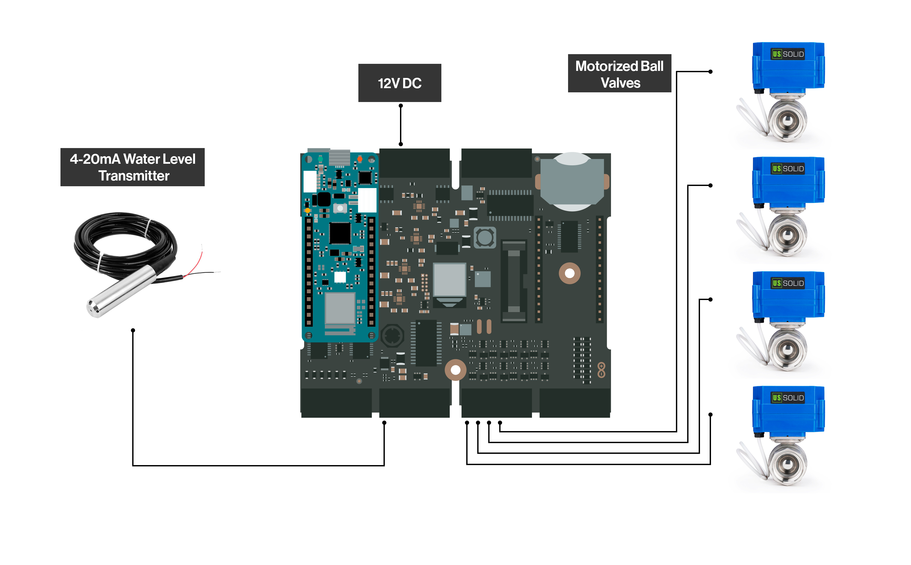
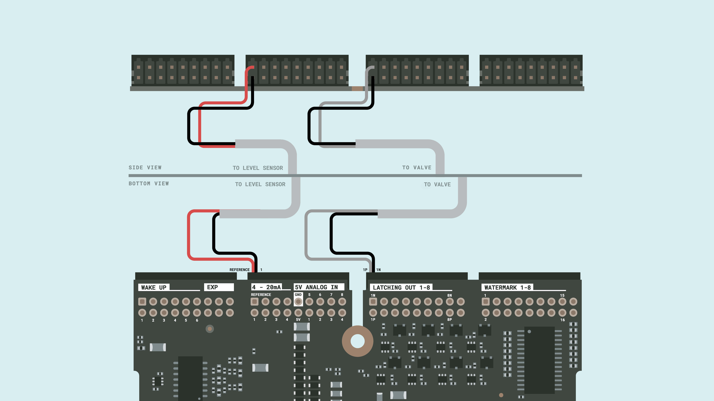

## Introduction

Agriculture has always been a key part of human development. Humanity is constantly growing and the demand of more efficient, profitable, and green agriculture is one of the challenges that the industry has been working on during the last years.


Smart farming is one of the most important actors in this revolution and is more accessible today than ever by using the Arduino Pro solutions. Taking advantage of the control capabilities, sensor data analysis and cloud connectivity, Arduino Edge Control is perfect for managing agriculture applications.

The application note shown is intended to replicate a scale smart farming application, that can be implemented on real agriculture fields using the same hardware and firmware.

## Goals

The goal of this application note is to showcase a smart farming irrigation system using a combination of an Edge Control, an MKR WiFi 1010, and the Arduino IoT Cloud. The project's objectives are the following:

- Independently control four irrigation zones using motorized ball valves.
- Get water from a smart tank with water level monitoring.
- Program irrigation timers from remote through Arduino IoT Cloud by using Wi-Fi® connectivity.
- Manually activate irrigation from Arduino IoT Cloud through dedicated widgets.
- Monitor average irrigation time and water consumption on dedicated charts on Arduino IoT Cloud.
- Plan irrigation according to the weather forecast, by including an API-based weather station in Arduino IoT Cloud.

## Hardware and Software Requirements


### Hardware Requirements
- Arduino Edge Control
- Arduino MKR WiFi 1010
- Arduino Edge Control Enclosure Kit
- Differential pressure Liquid Level Sensor - 4-20 mA (0-1 meter) Submersible.
- 2-Wires Motorized ball Valves (3-Wires version are also supported) (x4)
- 12 VDC power supply (x1)
- 3.4 meters of 15 mm PVC pipes (x1)
- 15 mm PVC TEE pipes (x3)
- 15 mm PVC elbow (x8)
- 15 mm Manual Valve (x1)
- 15 mm PVC caps (x4)
- 15 mm PVC male adapters (x11)
- 15 mm wall pipe brackets (x7)
- Rectangular planters (x4)
- DIN rail (x1)
- Cable glands (x6)
- 6 meters of duplex cable AWG 18 (x1)
- Electrical Register Box (x1)
- Water Tank (x1)

### Software Requirements

- [Arduino IDE 1.8.10+](https://www.arduino.cc/en/software), [Arduino IDE 2](https://www.arduino.cc/en/software), or [Arduino Web Editor](https://create.arduino.cc/editor).
- If you are going to use an offline Arduino IDE, you must install the following libraries: `Arduino_EdgeControl`, `ArduinoIoTCloud`, `Arduino_JSON`, `ArduinoJson`, `ArduinoHttpClient` and `Arduino_ConnectionsHandler`. You can install them through the Arduino IDE Library Manager.
- The [Smart Irrigation System Arduino Sketches](assets/Edge-Control_MKR_Codes.zip).
- [Arduino Create Agent](https://create.arduino.cc/getting-started/plugin/welcome) to add the MKR WiFi 1010 to the Arduino IoT Cloud.

## Smart Irrigation System Setup

The electrical connections of the intended application are shown in the diagram below:



- The Edge Control board will be powered with an external 12 VDC power supply connected to BATT+ and GND of J11 respectively.


- The four motorized ball valves will be connected to the Edge Control Latching outputs of J9 connector from OUT0 to OUT6. 


***You can also use 3-Wires motorized valves without any changes in the code. See this [guide](https://docs.arduino.cc/tutorials/edge-control/motorized-ball-valve) for reference.***

- The water level transmitter will be connected to the +19 V reference and the 4-20 mA input number one of the J7 connector.


## Smart Irrigation System Overview

The irrigation system works as a whole: it integrates the level measurement and the activation of the valves, done by the Edge Control, with the Cloud communication, using the MKR WiFi 1010.

The Edge Control is responsible for keeping track of the time with its integrated real-time clock (RTC), in order to schedule the use of the valves and know when a day has passed. In addition, the same setup is able to: 
-  Measure the level of the tank water with a 4-20 mA liquid level transmitter to calculate its consumption
- Control an LCD screen where the status of the valves and timers are shown. In addition, the LDC push button can be used to manually activate the valves.

To communicate the system with the cloud, the MKR WiFi 1010 serves as a bridge. It notifies the Edge Control of any changes in the cloud to activate, deactivate or configure a timer to control the valves. In addition, it reports the values of the Edge Control sensors to the cloud. The communication between both devices is done using the I2C communication protocol.


### Valves Control

If a valve is activated from the cloud, the message "opening valve" will appear on the screen at the same time that it's being opened. If the valve is activated by a cloud timer, the display will show the same message, including a countdown of the remaining irrigation time. The working time of the valves is reported to the cloud for a visualization of the average daily use.

### Water Usage

At every system startup the current amount of water is measured and saved. This way any decrease in it is considered as used. The use of water is daily reset to have an average daily use graph in the cloud.

### Weather Forecast Consideration

The system is capable of knowing the weather thanks to the use of the MKR WiFi 1010 and the OpenWeather API. If the probability of rain is greater than 90%, the automatic watering timers will be ignored. However, it will be possible to continue watering manually if the user so wishes.

### Arduino Edge Control Code

We will go through some important code sections to make this application fully operative. We will begin with the required libraries:

- Including `Arduino_EdgeControl.h` will enable the support for the Edge Control peripherals; install it by searching for it on the Library Manager.
- Including `Wire.h` will enable the I2C communication between the Edge Control, the MKR WiFi 1010 and the other peripherals. It's included in the Board Support Package (BSP) of the Edge Control.

There are two headers included in the project code that handles some helper functions and structures:

- `SensorValues.hpp` handles the shared variables between the Edge Control and the MKR WiFi 1010 through I2C.
- `helpers.h` handles the real-time clock (RTC) functions to retrieve the local date and time.

Here is also defined a structure to handle the number of button taps to control each valve manually.

```arduino

#include "Helpers.h"
#include <Arduino_EdgeControl.h>
#include <Wire.h>
#include "SensorValues.hpp"

// The MKR1 board I2C address
#define EDGE_I2C_ADDR 0x05

/** UI Management **/
// Button statuses
enum ButtonStatus : byte {
  ZERO_TAP,
  SINGLE_TAP,
  DOUBLE_TAP,
  TRIPLE_TAP,
  QUAD_TAP,
  FIVE_TAP,
  LOT_OF_TAPS
};

```

In order to save energy and resources, the Edge Control has different power lines that must be enabled so we can power the different internal and external peripherals. In this case, we need to enable the 3.3 V, 5 V, Battery, MKR1 slot, and the +19 V reference for the 4-20 mA sensor's current loop. To handle all the I/O we also need to initialize the I/O Expander together with the Enclosure Kit LCD and the sensors inputs. 

With the `setSystemClock` function we define a starting date reference for the real-time clock. If you need to configure the RTC time with your time zone, use the commented function `RealTimeClock.setEpoch(<Your region unixTime>)` replacing the parameter with your region unix time in seconds.  

***You just need to set the RTC once and make sure to have a CR2032 3V battery in the Edge Control holder to maintain the RTC configurations.***

```arduino
/**
  Main section setup
*/
void setup() {
  EdgeControl.begin();
  Wire.begin();
  delay(500);
  Serial.begin(115200);

  Serial.println("Init begin");

  // Enable power lines
  Power.enable3V3();
  Power.enable5V();
  Power.on(PWR_3V3);
  Power.on(PWR_VBAT);
  Power.on(PWR_MKR1);
  delay(5000);    // wait for the MKR board to boot
  Power.on(PWR_19V);

  // Init Edge Control IO Expander
  Serial.print("IO Expander initializazion ");
  if (!Expander.begin()) {
    Serial.println("failed.");
    Serial.println("Please, be sure to enable gated 3V3 and 5V power rails");
    Serial.println("via Power.enable3V3() and Power.enable5V().");
  } else Serial.println("succeeded.");

  // LCD button definition
  pinMode(POWER_ON, INPUT);
  attachInterrupt(POWER_ON, buttonPress, RISING);

  // Arduino Edge Control ports init
  Input.begin();
  Input.enable();
  Latching.begin();

  analogReadResolution(adcResolution);

  setSystemClock(__DATE__, __TIME__);  // define system time as a reference for the RTC

  //RealTimeClock.setEpoch(1684803771-(3600*4));  // use this to set the RTC time once.

  // Init the LCD display
  LCD.begin(16, 2);
  LCD.backlight();

  LCD.home();
  LCD.print("Smart Irrigation");
  LCD.setCursor(5, 1);
  LCD.print("System");
  delay(2000);

  LCD.clear();
}
```

The Edge Control will check the number of button taps for the valve's manual control and handle the right action to do through the use of a switch case statement.

The `updateSensors()` function handles the update of system variables, including the valves statutes. It uploads the local sensor values to the cloud and retrieves online changes to maintain the synchrony.

To measure the water level we are using a 4-20 mA (0 to 1 meter) sensor, but we need to express that current information in centimeters. The Edge Control converts the current from the sensor loop into a voltage by using an internal 220 ohms resistor which is read by the internal ADC. To convert this voltage back to a current value, we use the following equation from a 4-20 mA sensor:

`y = 16x + 4`

Where:
* First we solve for x, having the formula: `x = (y - 4)/16` where x is in meters.
* As we are working in centimeters, we multiply the expression by 100: `x = (y - 4)*(100/16)`.
* Finally, we simplify the expression resulting on: `x = (y - 4)*6.25`.

This is a brief explanation of the mathematical expression used inside the sketch to convert the original sensor value voltage into centimeters:

`float w_level = ((voltsReference / 220.0 * 1000.0) - 4.0) * 6.25;`

As we want to show an intuitive graph for the valve's active time, the accumulated time is reset each day at midnight so we can have a daily use graph on the Arduino IoT Cloud.

The `valvesHandler()` function activates, deactivates and keeps the active time of each zone valve.

```arduino
void loop() {
  // LCD button taps detector function
  detectTaps();

  // Different button taps handler
  switch (buttonStatus) {
    case ZERO_TAP:  // will execute always the button is not being pressed.
      if (controlLCD == 1 && showTimeLCD == 0) {
        ValvesStatusLCD();  // when there is not an active timer
        controlLCD = 0;
      }

      if (showTimeLCD == 1) {
        ValvesTimersLCD();  // when there is an active timer
      }

      break;

    case SINGLE_TAP:  // will execute when the button is pressed once.
      Serial.println("Single Tap");
      vals.z1_local = !vals.z1_local;
      sendValues(&vals);
      buttonStatus = ZERO_TAP;
      break;

    case DOUBLE_TAP:  // will execute when the button is pressed twice.
      Serial.println("Double Tap");
      vals.z2_local = !vals.z2_local;
      sendValues(&vals);
      buttonStatus = ZERO_TAP;
      break;

    case TRIPLE_TAP:  // will execute when the button is pressed three times.
      Serial.println("Triple Tap");
      vals.z3_local = !vals.z3_local;
      sendValues(&vals);
      buttonStatus = ZERO_TAP;
      break;

    case QUAD_TAP:  // will execute when the button is pressed four times.
      Serial.println("Quad Tap");
      vals.z4_local = !vals.z4_local;
      sendValues(&vals);
      buttonStatus = ZERO_TAP;
      break;

    case FIVE_TAP:  // will execute when the button is pressed five times.
      Serial.println("Five Tap");
      LCD.backlight();
      LCD.home();
      
      break;

    default:
      Serial.println("Too Many Taps");
      buttonStatus = ZERO_TAP;
      break;
  }

  // reset the valves accumuldated on time every day at midnight
  if (getLocalhour() == " 00:00:00") {
    Serial.println("Resetting accumulators every day");
    vals.z1_on_time = 0;
    vals.z2_on_time = 0;
    vals.z3_on_time = 0;
    vals.z4_on_time = 0;
    delay(1000);
  }

  unsigned long currentMillis = millis();

  if (currentMillis - previousMillis >= interval) {

    previousMillis = currentMillis;

    //Serial.println(getLocalhour());

    // send local sensors values and retrieve cloud variables status back and forth
    updateSensors();
  }

  // activate, deactivate and keep time of valves function
  valvesHandler();
}

```

### Arduino MKR WiFi 1010 Code

The MKR WiFi 1010 needs the following libraries:

- `ArduinoIoTCloud.h` It handles the Arduino IoT Cloud connection and project variables publishing. It can be installed directly from the Arduino Library Manager.
- `Arduino_ConnectionHandler.h` It manages the Wi-Fi® connection and can be installed directly from the Arduino Library Manager.
- `ArduinoJson.h` and `Arduino_JSON` These libraries parse and create JSON structures for the HTTP requests. They can be installed directly from the Arduino Library Manager.
- `ArduinoHttpClient.h` This library requests weather data from the Open Weather API. It can be installed directly from the Arduino Library Manager.
- `Wire.h` will enable the I2C communication between the Edge Control, the MKR WiFi 1010 and the other peripherals, it's included in the BSP of the MKR WiFi board.
- `utility/wifi_drv.h` This library controls the MKR built-in RGB LED. It's included in the BSP of the MKR WiFi 1010.

There are two headers included in the project code that handles some helper functions and structures:

- `thingProperties.h` This is automatically generated by the Arduino IoT Cloud, however, if you are using an offline IDE verify it's in the same directory as your sketch, it includes all the Arduino IoT Cloud variables.
- `SensorValues.hpp` handles the shared variables between the Edge Control and the MKR WiFi 1010 through I2C.

In the global variables, we define the MKR board I2C address (it must be the same as defined in the Edge Control code); we also define the water tank dimensions.

```arduino
#include "thingProperties.h"
#include <ArduinoJson.h>
#include <Wire.h>
#include "SensorValues.hpp"
#include <utility/wifi_drv.h>
#include <ArduinoHttpClient.h>
#include <Arduino_JSON.h>

// The MKR1 board I2C address
#define SELF_I2C_ADDR 0x05

// Water tank constants
#define PI 3.1415926535897932384626433832795
#define radius 0.28  // in meters
```

***To properly retrieve weather information from the [Open Weather API](https://home.openweathermap.org/users/sign_in), you must create an account to use it; there you will find a unique API Key needed to format your HTTP requests.***

Replace the `city` and `countryCode` variables with yours.

```arduino
// OpenWeather server address:
const char serverAddress[] = "api.openweathermap.org";
int port = 443;

// Your OpenWeather API Key
String openWeatherMapApiKey = "<API Key>";

// Replace with your country code and city
String city = "Santiago de los Caballeros";
String countryCode = "DO";
```

The MKR WiFi 1010 will update its connection with the Arduino IoT Cloud, and check for changes on every variable, from the valves switches to the scheduled activated timers. It shows when it's successfully connected to the cloud by turning on its blue LED. Also, it asks for a weather forecast every 10 minutes to update the temperature, humidity and rain probability in the Arduino IoT Cloud dashboard.

```arduino
void loop() {
  // function that ask for schedule timers set on the Cloud
  scheduleHandler();

  unsigned long currentMillis = millis();

  if (currentMillis - previousMillis >= intervalStat) {
    // save the last time you asked for connectivity status
    previousMillis = currentMillis;

    // Turn on the blue LED if the board is successfully connected to the Cloud.
    if (ArduinoCloud.connected()) {
      WiFiDrv::analogWrite(27, 122);
    } else {
      WiFiDrv::analogWrite(27, 0);
    }
  }

  // doing this just once after there's a WiFi connections
  if (bootForecast == 1 && WiFi.status() == WL_CONNECTED) {
    getForecast();  // request rain probability
    getWeather();   // request temperature and humidity
    bootForecast = 0;
  }


  if (millis() - lastRequest > interval) {
    // request weather variables each interval
    if (WiFi.status() == WL_CONNECTED) {
      getForecast();
      getWeather();
    }
    lastRequest = millis();
  }

  ArduinoCloud.update();
}
```

The system needs to be as fast as possible when a valve activation is requested, this is why there is one function for each valve that is fired once the valve status is changed on the Arduino IoT Cloud.

```arduino
/*
  Since Z1 is READ_WRITE variable, onZ1Change() is
  executed every time a new value is received from IoT Cloud.
*/
void onZ1Change() {
  // Add your code here to act upon Z1 change
  Serial.println("Z1 changed!!");
  SensorValues_t vals;
  vals.z1_local = z1;
  delay(1000);
}
```

The `uploadValues(SensorValues_t *vals)` is executed every time the Edge Control requests data through I2C from the MKR. It updates all the local and cloud-shared variables to be sent, it also converts the water level variable to water volume using the cylinder volume formula:
 
`v = πr²h`
 
 Where:
 * `r` is the tank radius in meters.
 * `h` is the tank height in meters.

 As `r` and `h` are in meters, the volume result will be in cubic meters (m³), for a more intuitive perception of water quantity we will convert it to liters:
 
`1m³ = 1000 L`

As our level sensor output is in centimeters we can convert (height) to meters dividing by 100:`h = (water_level/100)`

To turn m³ into liters we just need to multiply by 1000: `water_volume = PI*(radius)*(radius)*(water_level/100)*1000`

This is the brief why of the expression used in the code.

Using flow control variables we store the initial water level as a reference point. Any level measured below that point will be considered as water used updating the `water_usage` variable. If we refill the tank, it will save the higher value of water level as a new reference point.

```arduino
  water_level = vals->water_level_local;
  water_volume = PI * (radius) * (radius) * ((int)water_level/100) * 1000;

  if (waterCtrl == 0) {
    currentWater = water_volume;
    Serial.println("Initial Water Volumen: ");
    Serial.println(currentWater);
    water_usage = 0;
    waterCtrl = 1;
  }

  if (water_volume < currentWater) {
    water_usage += currentWater - water_volume;
    currentWater = water_volume;
  } else if (water_volume > currentWater) {
    currentWater = water_volume;
  }
```

### The Arduino IoT Cloud Dashboard

Taking advantage of the Arduino IoT Cloud, its possible to seamlessly integrate a simple but powerful dashboard to monitor and visualize the status of the system in real-time, resulting in a professional Human-Computer Interaction (HCI) as can be seen below:


Within the Arduino IoT Cloud's dashboard, the system variables can be monitored and controlled. There are temperature, humidity and rain probability gauges showing the current weather status and forecast, toggle switches to control each motorized valve accompanied by a scheduler widget to set automatic irrigation routines, also time series graphs showing the daily activated time of each valve. Finally, there are water supply monitoring widgets, one that shows the current water level in percentage from 0-100%, a water volume widget that shows the remaining liters of water in the tank, and a water usage widget that shows the liters used daily.


The dashboard can be easily accessible from a PC, mobile phone or tablet from anywhere, receiving an instantaneous update wherever we are.

## Full Smart Irrigation System Example

All the necessary files to replicate this application note can be found below:

- The complete code can be downloaded [here](assets/Edge-Control_MKR_Codes.zip).

### The Irrigation System Working

Below you can find some additional images and animations showing how the system works:


## Conclusion

In this application note, you have learned how to build a smart irrigation system to water your crops automatically, manually or remotely. Thanks to real-time weather analysis, you can avoid irrigation when it is raining, saving water and avoiding over-irrigation or flooding problems. 

Arduino Edge Control allows you to easily implement this kind of agriculture systems ready for field deployment. However, if Wi-Fi® access is limited in your area, the connectivity can be extended using alternative boards, like the [Arduino MKR WAN 1310](https://docs.arduino.cc/hardware/mkr-wan-1310).  

Thanks to the Edge Control capabilities to connect to the cloud and be remotely controlled, it is a great choice for developing robust and agriculture environment-proof solutions.

### Next Steps

As you already know how to develop a Smart Irrigation System with Arduino Edge Control and the MKR WiFi 1010, it's time for you to continue exploring all the capabilities of the Arduino Pro environment to integrate it with your professional setup and improve it with powerful solutions.

You can add different connectivity modules like LoRaWAN®, GSM, RS-485 or Ethernet by using the [Arduino MKR family](https://store-usa.arduino.cc/collections/mkr-family)