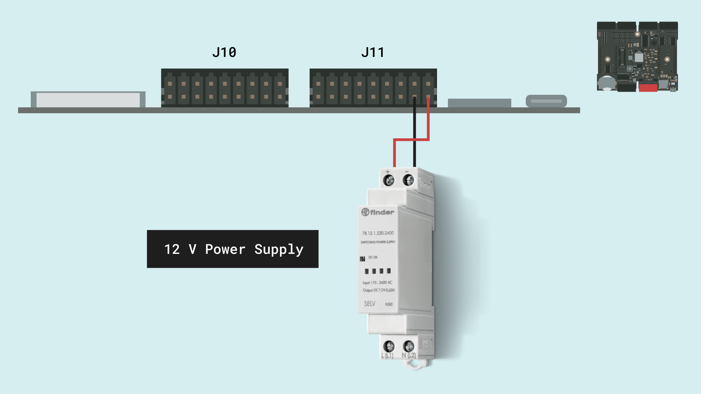
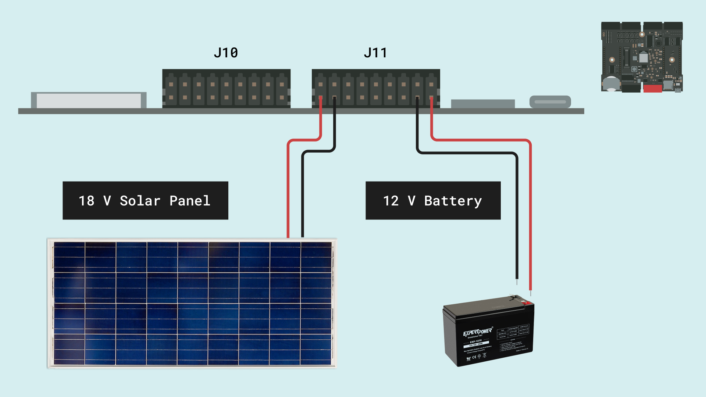

## Overview

This user manual will guide you through a practical journey covering the most interesting features of the Arduino Edge Control. With this user manual, you will learn how to set up, configure and use this Arduino board.

## Hardware and Software Requirements
### Hardware Requirements

- [Arduino Edge Control](https://store.arduino.cc/products/arduino-edge-control) (x1)
- Micro USB cable (x1)
- External power source: a 12V SLA battery or 12V power supply (x1)

### Software Requirements

- [Arduino IDE 1.8.10+](https://www.arduino.cc/en/software), [Arduino IDE 2.0+](https://www.arduino.cc/en/software), or [Arduino Web Editor](https://create.arduino.cc/editor)

## Product Overview

The Edge Control board is a versatile tool that allows agriculturalists to develop creative and innovative solutions for agriculture by harnessing modern technology. This board is designed to address the needs of precision farming. It provides a low power control system, suitable for irrigation with modular connectivity. Equipped with latching outputs and solid state relays, it becomes an ideal choice for controlling motorized or solenoid valves, among many other devices. As inputs, it manages 0-5V analog sensors, 4-20mA sensors, and Watermark soil moisture sensors, a variety that handles most of the agricultural needs. All this and more makes the Edge Control the perfect option for your 4.0 Agriculture industry. 

### Board Architecture Overview

The Edge Control features a robust and efficient architecture that integrates a wide range of sensors inputs and ready-to-use control outputs for industrial farming field devices.

Here is an overview of the board's architecture's main components shown in the image above:

- **Microcontroller**: at the heart of the Edge Control is the nRF52840, a powerful and versatile System-on-Chip (SoC) from Nordic® Semiconductor. The nRF52840 is built around a 32-bit Arm® Cortex®-M4 processor running at 64 MHz.
- **MKR slots**: the on-board MKR slots 1 & 2 can be used to connect Arduino MKR boards to extend the capabilities such as connectivity through LoRa, Wi-Fi, 2G/3G/CatM1/NBIoT, and Sigfox.
- **Storage**: the board includes both a microSD card socket and an additional 2MB Flash memory for data storage. Both are directly connected to the main processor via a SPI interface.
- **Power management**: the Edge Control is designed for ultra-low power operation, with efficient power management features that ensure minimal energy consumption. It can operate for up to 34 months on a 12V/5Ah battery. Equipped with several buck and boost converters supplying a variety of output voltages from 19V DC to 3.3V DC. The LT3652 solar panel battery charger features a Maximum Power Point Tracker (MPPT) taking the best performance out of the solar panels.
- **Interfaces**: through the different terminal blocks, the board give access to several standardized sensors inputs like 0-5V, 4-20mA and watermark sensors. Also, it is equipped with drivered latching outputs, and relay contacts ready to manage high power external devices.

### Board Core and Libraries

To install the core for the Edge Control, navigate to **Tools > Board > Boards Manager** or click the Boards Manager icon in the left tab of the IDE. In the Boards Manager tab, search for `Edge Control` and install the latest `Arduino Mbed OS Edge Boards` version.

The **Arduino_EdgeControl** library contains the examples you need to work with the board's components, such as the different sensors, outputs and adds on like the LCD included with the [Enclosure Kit](https://store-usa.arduino.cc/products/edge-control-enclosure-kit?selectedStore=us).

### Pinout

The full pinout is available and downloadable as PDF from the link below:

- [Edge Control pinout](https://docs.arduino.cc/resources/pinouts/AKX00034-full-pinout.pdf)

### Datasheet

The complete datasheet is available and downloadable as PDF from the link below:

- [Edge Control datasheet](https://docs.arduino.cc/resources/datasheets/AKX00034-datasheet.pdf)

### Schematics

The complete schematics are available and downloadable as PDF from the link below:

- [Edge Control schematics](https://docs.arduino.cc/resources/schematics/AKX00044-schematics.pdf)

### STEP Files

The complete STEP files are available and downloadable from the link below:

- [Edge Control STEP files](https://docs.arduino.cc/static/38d409dd238978baf03b79eac9bb752f/AKX00044-step.zip)

## First Use
### Powering the Board

The Edge Control can be powered by:

- Using a Micro USB cable (not included). 
- Using an external **12V power supply** connected to `BATT+` pin and `GND`.(please, refer to the [board pinout section](#pinout) of the user manual).
- Using a **12V lead-acid battery** connected to `BATT+` pin and `GND`. **It can be powered for up to 34 months on a 12V/5Ah battery**.
- Using a whole **off grid** power system including an **18V Solar Panel** and a **12V lead-acid battery**.

