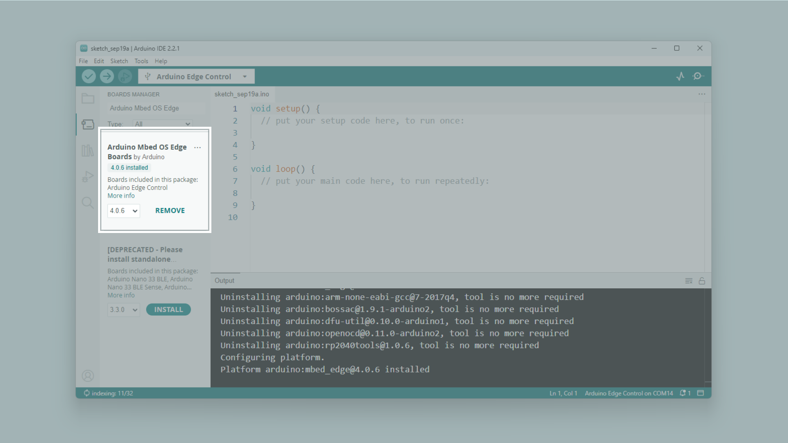
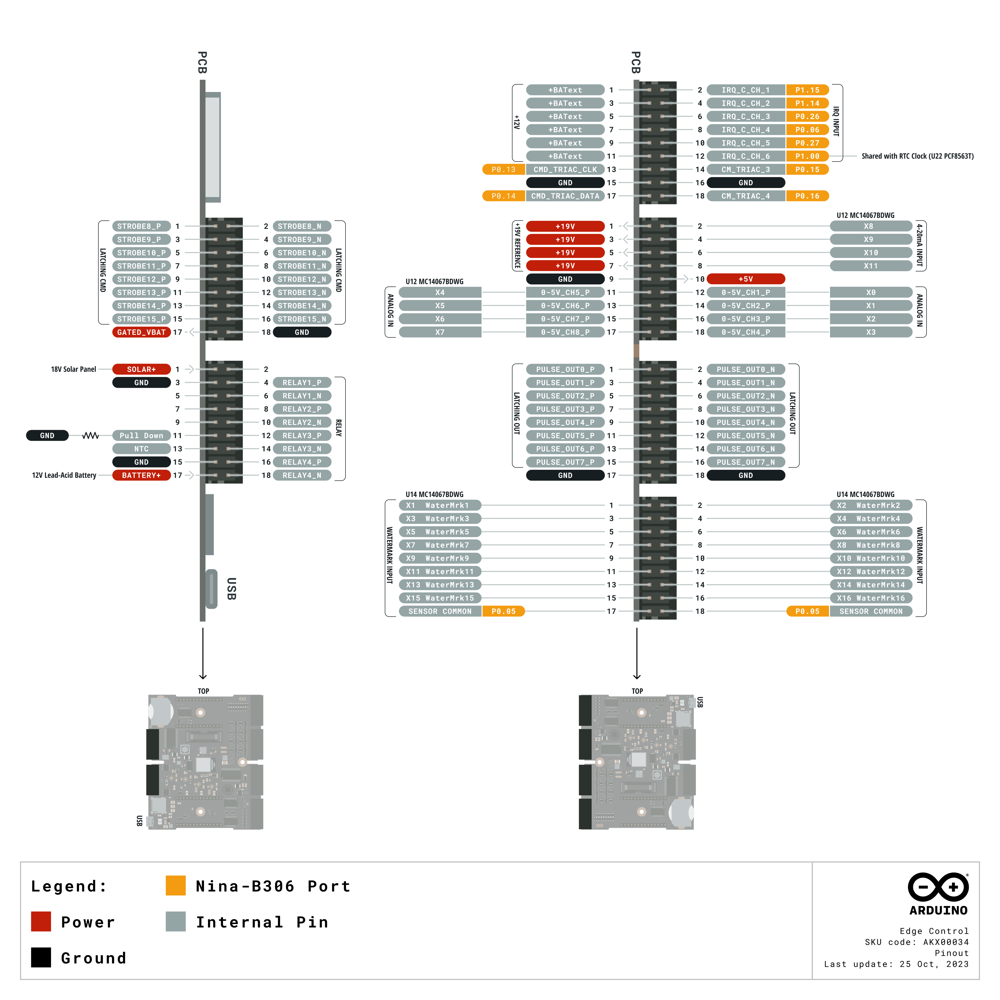
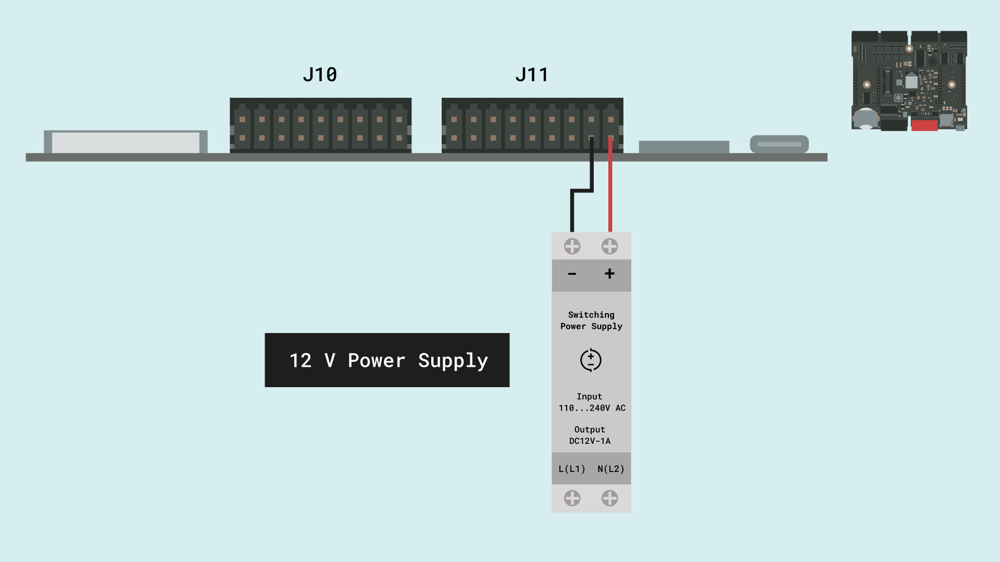
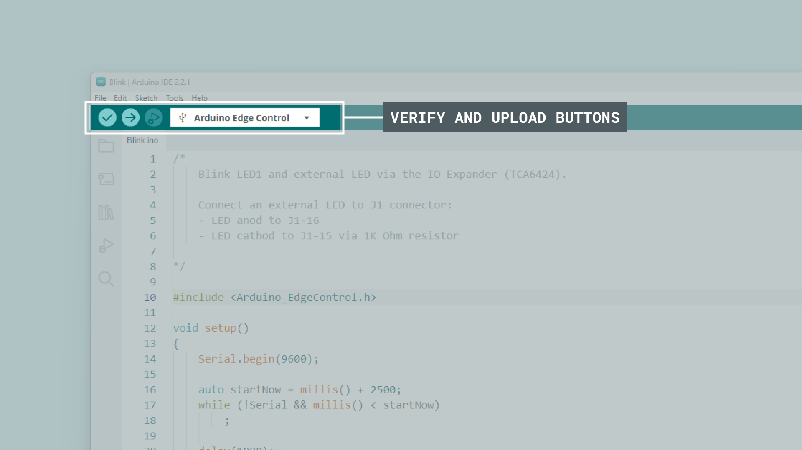
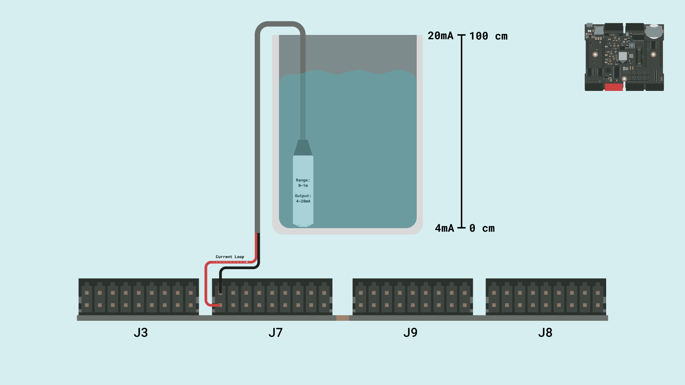
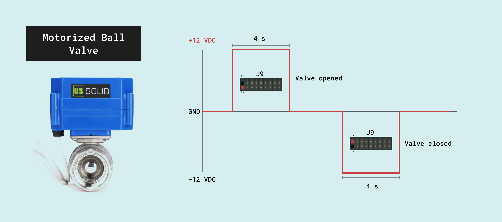
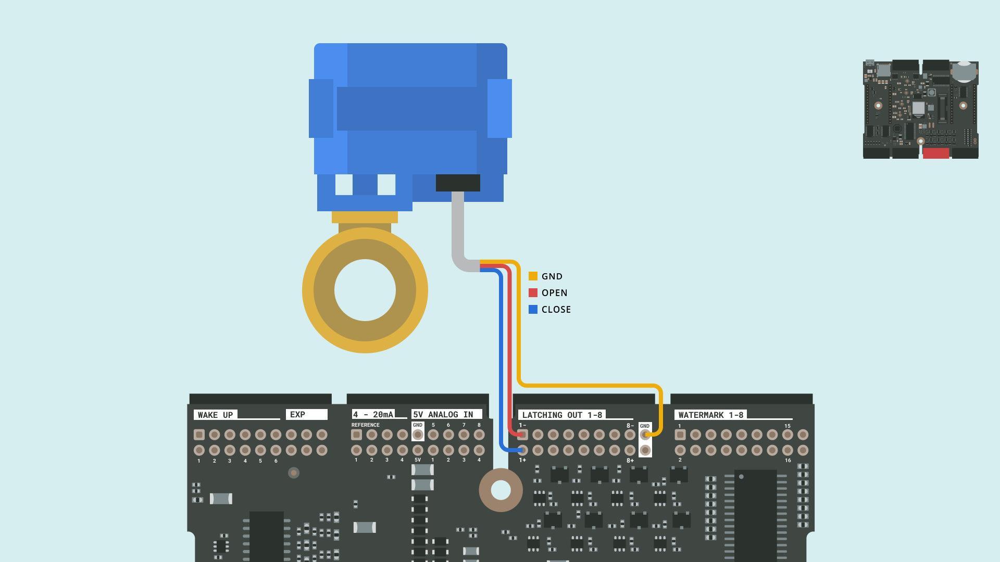
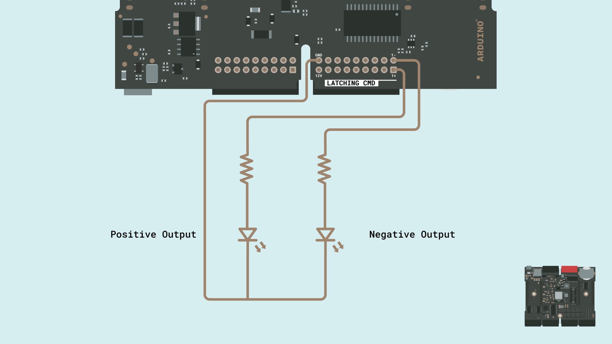
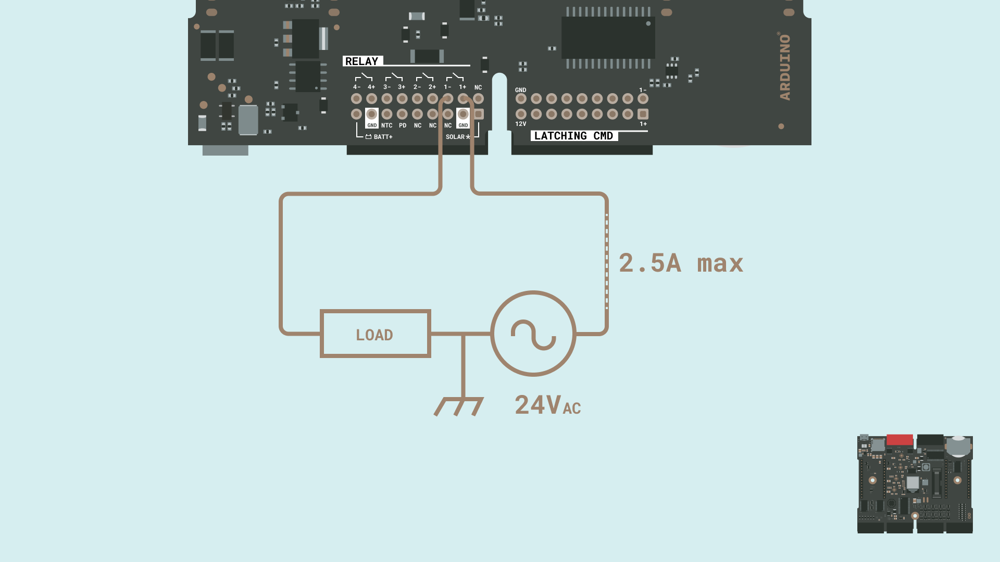

## Overview

This user manual will guide you through a practical journey covering the most interesting features of the Arduino Edge Control. With this user manual, you will learn how to set up, configure and use this Arduino board.

## Hardware and Software Requirements
### Hardware Requirements

- [Arduino Edge Control](https://store.arduino.cc/products/arduino-edge-control) (x1)
- Micro USB cable (x1)
- External power source: a 12V SLA battery or 12V power supply (x1)

### Software Requirements

- [Arduino IDE 1.8.10+](https://www.arduino.cc/en/software), [Arduino IDE 2.0+](https://www.arduino.cc/en/software), or [Arduino Web Editor](https://create.arduino.cc/editor)

## Product Overview

The Edge Control board is a versatile tool that allows agriculturalists to develop creative and innovative solutions for agriculture by harnessing modern technology. This board is designed to address the needs of precision farming. It provides a low power control system, suitable for irrigation with modular connectivity. Equipped with latching outputs and solid state relays, it becomes an ideal choice for controlling motorized or solenoid valves, among many other devices. As inputs, it manages 0-5V analog sensors, 4-20mA sensors, and Watermark soil moisture sensors, a variety that handles most of the agricultural needs. All this and more makes the Edge Control the perfect option for your 4.0 Agriculture industry. 

### Board Architecture Overview

The Edge Control features a robust and efficient architecture that integrates a wide range of sensors inputs and ready-to-use control outputs for industrial farming field devices.


Here is an overview of the board's architecture's main components shown in the image above:

- **Microcontroller**: at the heart of the Edge Control is the nRF52840, a powerful and versatile System-on-Chip (SoC) from Nordic® Semiconductor. The nRF52840 is built around a 32-bit Arm® Cortex®-M4 processor running at 64 MHz.
- **MKR slots**: the on-board MKR slots 1 & 2 can be used to connect Arduino MKR boards to extend the capabilities such as connectivity through LoRa, Wi-Fi, 2G/3G/CatM1/NBIoT, and Sigfox.
- **Storage**: the board includes both a microSD card socket and an additional 2MB Flash memory for data storage. Both are directly connected to the main processor via a SPI interface.
- **Power management**: the Edge Control is designed for ultra-low power operation, with efficient power management features that ensure minimal energy consumption. It can operate for up to 34 months on a 12V/5Ah battery. Equipped with several buck and boost converters supplying a variety of output voltages from 19V DC to 3.3V DC. The LT3652 solar panel battery charger features a Maximum Power Point Tracker (MPPT) taking the best performance out of the solar panels.
- **Interfaces**: through the different terminal blocks, the board give access to several standardized sensors inputs like 0-5V, 4-20mA and watermark sensors. Also, it is equipped with drivered latching outputs, and relay contacts ready to manage high power external devices.

### Board Core and Libraries

To install the core for the Edge Control, navigate to **Tools > Board > Boards Manager** or click the Boards Manager icon in the left tab of the IDE. In the Boards Manager tab, search for `Edge Control` and install the latest `Arduino Mbed OS Edge Boards` version.



The **Arduino_EdgeControl** library contains the examples you need to work with the board's components, such as the different sensors, outputs and adds on like the LCD included with the [Enclosure Kit](https://store-usa.arduino.cc/products/edge-control-enclosure-kit?selectedStore=us).


### Pinout



The full pinout is available and downloadable as PDF from the link below:

- [Edge Control pinout](https://docs.arduino.cc/resources/pinouts/AKX00034-full-pinout.pdf)

### Datasheet

The complete datasheet is available and downloadable as PDF from the link below:

- [Edge Control datasheet](https://docs.arduino.cc/resources/datasheets/AKX00034-datasheet.pdf)

### Schematics

The complete schematics are available and downloadable as PDF from the link below:

- [Edge Control schematics](https://docs.arduino.cc/resources/schematics/AKX00044-schematics.pdf)

### STEP Files

The complete STEP files are available and downloadable from the link below:

- [Edge Control STEP files](https://docs.arduino.cc/static/38d409dd238978baf03b79eac9bb752f/AKX00044-step.zip)

## First Use
### Powering the Board

The Edge Control can be powered by:

- Using a Micro USB cable (not included). 
- Using an external **12V power supply** connected to `BATT+` pin and `GND`.(please, refer to the [board pinout section](#pinout) of the user manual).
- Using a **12V lead-acid battery** connected to `BATT+` pin and `GND`. **It can be powered for up to 34 months on a 12V/5Ah battery**.
- Using a whole **off grid** power system including an **18V Solar Panel** and a **12V lead-acid battery**.




### Hello World Example

Let's program the Edge Control with the classic `hello world` example used in the Arduino ecosystem: the `Blink` sketch. We will use this example to verify the board's connection to the Arduino IDE and that the Edge control core and the board itself are working as expected. 

There are two ways to program this example in the board:

- Navigate to **File > Examples > Arduino_EdgeControl > Basic > Blink.**
- Copy and paste the code below into a new sketch in the Arduino IDE.

```arduino
#include <Arduino_EdgeControl.h>

void setup() {
  Serial.begin(9600);

  auto startNow = millis() + 2500;
  while (!Serial && millis() < startNow)
    ;

  delay(1000);
  Serial.println("Hello, Challenge!");

  Power.on(PWR_3V3);
  Power.on(PWR_VBAT);

  Wire.begin();

  delay(500);

  Serial.print("IO Expander initializazion ");
  if (!Expander.begin()) {
    Serial.println("failed.");
    Serial.println("Please, be sure to enable gated 3V3 and 5V power rails");
    Serial.println("via Power.on(PWR_3V3) and Power.on(PWR_VBAT).");
  }
  Serial.println("succeeded.");

  Expander.pinMode(EXP_LED1, OUTPUT);
}

void loop() {
  Serial.println("Blink");
  Expander.digitalWrite(EXP_LED1, LOW);
  delay(500);
  Expander.digitalWrite(EXP_LED1, HIGH);
  delay(500);
}
```

For the Edge Control, the `EXP_LED1` macro represents the **Green LED** of the of the board.

The custom power management of the Edge Control lets you turn on just the board peripherals and power rails you need, as the LED is connected to the IO Expander is needed to enable the 3.3v and battery source, also the expander using these functions:

```arduino
Power.on(PWR_3V3);
Power.on(PWR_VBAT);
.
.
.
Expander.begin();
```

To upload the code to the Edge Control, click the **Verify** button to compile the sketch and check for errors; then click the **Upload** button to program the board with the sketch.



***The Edge Control should be powered by an external power source or a battery so the blink works.***

You should now see the onboard LED turn on for half a second, then off, repeatedly.


## Inputs
### Analog Inputs
The Edge Control has **eight analog input pins**, mapped as follows: 

|       **Input Name**      |        **Arduino Pin Mapping**      |
|:-------------------------:|:-----------------------------------:|
|      `0-5V Channel 1`     |           `INPUT_05V_CH01`          |
|      `0-5V Channel 2`     |           `INPUT_05V_CH02`          |
|      `0-5V Channel 3`     |           `INPUT_05V_CH03`          |
|      `0-5V Channel 4`     |           `INPUT_05V_CH04`          |
|      `0-5V Channel 5`     |           `INPUT_05V_CH05`          |
|      `0-5V Channel 6`     |           `INPUT_05V_CH06`          |
|      `0-5V Channel 7`     |           `INPUT_05V_CH07`          |
|      `0-5V Channel 8`     |           `INPUT_05V_CH08`          |

Every pin can be used through the built-in functions of the Arduino programming language. 

Edge Control ADC can be configured to 8, 10 or 12 bits defining the argument of the following function respectively (default is 10 bits):

```arduino
analogReadResolution(12);  // ADC resolution set to 12 bits (0-4095)
```
***The Edge Control ADC reference voltage is fixed to 5.0v, this means that it will map the ADC range from 0 to 5.0 volts.***

The example code shown below reads the analog input value from every Edge Control channel and displays it on the IDE Serial Monitor:

This example code could also be found on  **File > Examples > Arduino_EdgeControl > Basic > 0-5V_Input**


```arduino
/*
  Testing strategy: connect each 5V ANALOG-IN input pin alternatively to +5V on the same connector.
*/

#include <Arduino_EdgeControl.h>

constexpr unsigned int adcResolution { 12 };

constexpr pin_size_t inputChannels [] {
    INPUT_05V_CH01,
    INPUT_05V_CH02,
    INPUT_05V_CH03,
    INPUT_05V_CH04,
    INPUT_05V_CH05,
    INPUT_05V_CH06,
    INPUT_05V_CH07,
    INPUT_05V_CH08
};
constexpr size_t inputChannelsLen { sizeof(inputChannels) / sizeof(inputChannels[0]) };
int inputChannelIndex { 0 };

struct Voltages {
    float volt3V3;
    float volt5V;
};

void setup()
{
    Serial.begin(9600);

    auto startNow = millis() + 2500;
    while (!Serial && millis() < startNow)
        ;

    delay(1000);
    Serial.println("Hello, Challenge!");

    Power.on(PWR_3V3);
    Power.on(PWR_VBAT);

    Wire.begin();
    Expander.begin();

    Serial.print("Waiting for IO Expander Initialization...");
    while (!Expander) {
        Serial.print(".");
        delay(100);
    }
    Serial.println(" done.");

    Input.begin();
    Input.enable();

    analogReadResolution(adcResolution);
}

void loop()
{
    Serial.print("0-5V Input Channel ");
    switch (inputChannels[inputChannelIndex]) {
        case INPUT_05V_CH01: Serial.print("01"); break;
        case INPUT_05V_CH02: Serial.print("02"); break;
        case INPUT_05V_CH03: Serial.print("03"); break;
        case INPUT_05V_CH04: Serial.print("04"); break;
        case INPUT_05V_CH05: Serial.print("05"); break;
        case INPUT_05V_CH06: Serial.print("06"); break;
        case INPUT_05V_CH07: Serial.print("07"); break;
        case INPUT_05V_CH08: Serial.print("08"); break;
        default: break;
    }
    Serial.print(": ");

    auto [ voltsMuxer, voltsInput ] = getAverageAnalogRead(inputChannels[inputChannelIndex]);

    Serial.print(voltsInput);
    Serial.print(" (");
    Serial.print(voltsMuxer);
    Serial.println(")");
    delay(1000);

    inputChannelIndex = ++inputChannelIndex % inputChannelsLen;
}

Voltages getAverageAnalogRead(int pin)
{
    constexpr size_t loops { 100 };
    constexpr float toV { 3.3f / float { (1 << adcResolution) - 1 } };
    constexpr float rDiv { 17.4f / ( 10.0f + 17.4f) };

    int tot { 0 };

    for (auto i = 0u; i < loops; i++)
        tot += Input.analogRead(pin);
    const auto avg = static_cast<float>(tot) * toV / static_cast<float>(loops);

    return { avg, avg / rDiv };
}

```

### IRQ Inputs

The Edge Control has **six interrupt request input pins**, mapped as follows: 

|             **Input Name**           |    **Arduino Pin Mapping**   |
|:------------------------------------:|:----------------------------:|
|      `Interrupt Request Input 1`     |           `IRQ_CH1`          |
|      `Interrupt Request Input 2`     |           `IRQ_CH2`          |
|      `Interrupt Request Input 3`     |           `IRQ_CH3`          |
|      `Interrupt Request Input 4`     |           `IRQ_CH4`          |
|      `Interrupt Request Input 5`     |           `IRQ_CH5`          |
|      `Interrupt Request Input 6`     |           `IRQ_CH6`          |

The IRQ inputs of the Edge Control can be used through the built-in functions of the Arduino programming language. The configuration of an interrupt pin is done in the `setup()` function with the built-in function `attachInterrupt()` as shown below:

```arduino
attachInterrupt(digitalPinToInterrupt(pin), ISR, mode);
```
- The `pin` argument defines the input channel that will fire the interrupt.
- The `ISR` argument defines the callback function of the interrupt.
- The `mode` argument defines when the interrupt should be triggered.

The example code shown below counts the pulses on every IRQ input and prints the counter value on the IDE Serial Monitor:

This example code could also be found on  **File > Examples > Arduino_EdgeControl > Basic > IRQCounter**


```arduino
/*
    Testing strategy: alternatively create a short-time connection between
    WAKEUP 1-6 and any of the +BAT_ext pins (the row above the WAKEUP ones).

    Check IRQChannelMap for advanced C++ implementation.
*/

#include <Arduino_EdgeControl.h>

volatile int irqCounts[6] { };

enum IRQChannelsIndex {
    irqChannel1 = 0,
    irqChannel2,
    irqChannel3,
    irqChannel4,
    irqChannel5,
    irqChannel6
};


void setup()
{
    EdgeControl.begin();
    
    Serial.begin(115200);

    // Wait for Serial Monitor or start after 2.5s
    for (const auto timeout = millis() + 2500; millis() < timeout && !Serial; delay(250));

    // Init IRQ INPUT pins
    for (auto pin = IRQ_CH1; pin <= IRQ_CH6; pin++)
        pinMode(pin, INPUT);

    // Attach callbacks to IRQ pins
    attachInterrupt(digitalPinToInterrupt(IRQ_CH1), []{ irqCounts[irqChannel1]++; }, RISING);
    attachInterrupt(digitalPinToInterrupt(IRQ_CH2), []{ irqCounts[irqChannel2]++; }, RISING);
    attachInterrupt(digitalPinToInterrupt(IRQ_CH3), []{ irqCounts[irqChannel3]++; }, RISING);
    attachInterrupt(digitalPinToInterrupt(IRQ_CH4), []{ irqCounts[irqChannel4]++; }, RISING);
    attachInterrupt(digitalPinToInterrupt(IRQ_CH5), []{ irqCounts[irqChannel5]++; }, RISING);
    attachInterrupt(digitalPinToInterrupt(IRQ_CH6), []{ irqCounts[irqChannel6]++; }, RISING);

}

void loop()
{
    // Check for received IRQ every second.
    Serial.println("--------");
    for (unsigned int i = irqChannel1; i <= irqChannel6; i++) { 
        Serial.print("IRQ Channel: ");
        Serial.print(i + 1);
        Serial.print(" - ");
        Serial.println(irqCounts[i]);
    }
    delay(1000);
}

```

### 4-20mA Inputs

The Edge Control has **four 4-20mA input pins**, mapped as follows: 

|          **Input Name**          |         **Arduino Pin Mapping**       |
|:--------------------------------:|:-------------------------------------:|
|      `4-20mA Sensor Input 1`     |           `INPUT_420mA_CH01`          |
|      `4-20mA Sensor Input 2`     |           `INPUT_420mA_CH02`          |
|      `4-20mA Sensor Input 3`     |           `INPUT_420mA_CH03`          |
|      `4-20mA Sensor Input 4`     |           `INPUT_420mA_CH04`          |

Every 4-20mA input can be read through the built-in functions of the Arduino programming language. They are sampled the same way as the 0-5V analog inputs but the input value is read via a 220 ohm resistor and a +19V reference.

A current of 4 to 20 mA passing through the 220 ohm resistor would produce a drop of 0.88v to 4.4v respectively, being in the 5V range of the ADC input.

In the application example a 4-20 mA water level sensor will be used. To convert the analog read voltage back to a current value, the following equation from a 4-20 mA sensor can be used:

`y = 16x + 4`

Where:
* First we solve for x, having the formula: `x = (y - 4)/16` where x is in meters.
* To be able to work in centimeters, you can multiply the expression by 100: `x = (y - 4)*(100/16)`.
* Eventually, you can simplify the expression as: `x = (y - 4)*6.25`.

This is a brief explanation of the mathematical expression used inside the sketch to convert the original sensor value voltage into centimeters:

`float w_level = ((voltsReference / 220.0 * 1000.0) - 4.0) * 6.25;`



```arduino
#include <Arduino_EdgeControl.h>

constexpr unsigned int adcResolution { 12 };

struct Voltages {
    float volt3V3;
    float voltRef;
};

void setup()
{
    Serial.begin(115200);

    auto startNow = millis() + 2500;
    while (!Serial && millis() < startNow)
        ;

    delay(1000);
    Serial.println("Hello, Challenge!");

    Power.on(PWR_3V3);
    Power.on(PWR_VBAT);
    Power.on(PWR_19V);

    Wire.begin();
    Expander.begin();

    Serial.print("Waiting for IO Expander Initialization...");
    while (!Expander) {
        Serial.print(".");
        delay(100);
    }
    Serial.println(" done.");

    Input.begin();
    Input.enable();

    analogReadResolution(adcResolution);
}

void loop()
{
    Serial.print("4-20mA Input Channel 01: ");

    auto [ voltsMuxer, voltsReference ] = getAverageAnalogRead(INPUT_420mA_CH01);

    float w_level = ((voltsReference / 220.0 * 1000.0) - 4.0) * 6.25;

    if(w_level < 0){
      w_level = 0;
    }

    Serial.print(w_level);
    Serial.print(" cm (");
    Serial.print(voltsReference);
    Serial.println(" V)");
    delay(1000);

}

/**
  Average the water level sensor readings to improve stability
  @param pin The input pin where the 4-20mA sensor is connected
*/
Voltages getAverageAnalogRead(int pin) {
  constexpr size_t loops{ 100 };
  constexpr float toV{ 3.3f / float{ (1 << adcResolution) - 1 } };
  constexpr float rDiv{ 17.4f / (10.0f + 17.4f) };

  int tot{ 0 };

  for (auto i = 0u; i < loops; i++)
    tot += Input.analogRead(pin);
  const auto avg = static_cast<float>(tot) * toV / static_cast<float>(loops);

  return { avg, avg / rDiv };
}

```

### Watermark Inputs

The Edge Control has **16 Watermark sensor inputs**, mapped as follows: 

|          **Input Name**          |         **Arduino Pin Mapping**       |
|:--------------------------------:|:-------------------------------------:|
|      `Watermark Sensor Input 1`     |           `WATERMARK_CH01`          |
|      `Watermark Sensor Input 2`     |           `WATERMARK_CH02`          |
|      `Watermark Sensor Input 3`     |           `WATERMARK_CH03`          |
|      `Watermark Sensor Input 4`     |           `WATERMARK_CH04`          |
|      `Watermark Sensor Input 5`     |           `WATERMARK_CH05`          |
|      `Watermark Sensor Input 6`     |           `WATERMARK_CH06`          |
|      `Watermark Sensor Input 7`     |           `WATERMARK_CH07`          |
|      `Watermark Sensor Input 8`     |           `WATERMARK_CH08`          |
|      `Watermark Sensor Input 9`     |           `WATERMARK_CH09`          |
|      `Watermark Sensor Input 10`     |           `WATERMARK_CH010`          |
|      `Watermark Sensor Input 11`     |           `WATERMARK_CH011`          |
|      `Watermark Sensor Input 12`     |           `WATERMARK_CH012`          |
|      `Watermark Sensor Input 13`     |           `WATERMARK_CH013`          |
|      `Watermark Sensor Input 14`     |           `WATERMARK_CH014`          |
|      `Watermark Sensor Input 15`     |           `WATERMARK_CH015`          |
|      `Watermark Sensor Input 16`     |           `WATERMARK_CH016`          |

Watermark sensors are capable of measuring the physical force holding the water in the soil. Those measurements are correlated with the effort plants have to make to extract water from the soil, a really interesting data for agricultural applications.

The measurement is done in Centibars, and we can use the following readings as a general guideline:

- 0-10 Centibars: Saturated soil
- 10-30 Centibars: Soil is adequately wet (except coarse sands, which are drying)
- 30-60 Centibars: Usual range for irrigation (most soils)
- 60-100 Centibars: Usual range for irrigation in heavy clay
- 100-200 Centibars: Soil is becoming dangerously dry - Proceed with caution!


Watermark sensors are resistive, so the Edge Control actually measures a resistance value that needs to be converted to a pressure unit, in this case, `centibars` or `kPa`. For this, the function below is used:

```arduino
/**
  This function convert the Watermark readings into centibars
  @param res is the resistance measured of the watermark sensor
  @return CB, the centibars
*/
int CalcCB(int res) {
  int CB = 0;
  if (res > 550.00) {

    if (res > 8000.00) {
      CB = -2.246 - 5.239 * (res / 1000.00) * (1 + .018 * (TempC - 24.00)) - .06756 * (res / 1000.00) * (res / 1000.00) * ((1.00 + 0.018 * (TempC - 24.00)) * (1.00 + 0.018 * (TempC - 24.00)));
    } else if (res > 1000.00) {
      CB = (-3.213 * (res / 1000.00) - 4.093) / (1 - 0.009733 * (res / 1000.00) - 0.01205 * (TempC));
    } else {
      CB = ((res / 1000.00) * 23.156 - 12.736) * (1.00 + 0.018 * (TempC - 24.00));
    }
  } else {
    if (res > 300.00) {
      CB = 0.00;
    }
    if (res < 300.00 && res >= short_resistance) {
      CB = short_CB;  //240 is a fault code for sensor terminal short
    }
  }

  if (res >= open_resistance) {
    CB = open_CB;  //255 is a fault code for open circuit or sensor not present
  }

  return abs(CB);
}
```

The example code shown below reads the resistance value from the 1st Watermark sensor channel and displays it on the IDE Serial Monitor in terms of `ohms` and `centibars or kPa`:

More example codes could also be found on  **File > Examples > Arduino_EdgeControl > Basic**

```arduino
#include <Arduino.h>
#include <mbed.h>

#include <Arduino_EdgeControl.h>  //http://librarymanager/All#Arduino_EdgeControl
#include <RunningMedian.h>  //http://librarymanager/All#RunningMedian

constexpr unsigned int adcResolution { 12 };

mbed::LowPowerTimeout TimerM;

uint8_t watermarkChannel { 0 }; // channel 0 is the 1st channel

constexpr float tauRatio { 0.63f };
constexpr float tauRatioSamples { tauRatio * float { (1 << adcResolution) - 1 } };
constexpr unsigned long sensorDischargeDelay { 2 };

constexpr unsigned int measuresCount { 20 };
RunningMedian measures { measuresCount };

constexpr unsigned int calibsCount { 10 };
RunningMedian calibs { calibsCount };

// Watermark sensors thresholds
const long open_resistance = 35000, short_resistance = 200, short_CB = 240, open_CB = 255, TempC = 25;


void setup()
{
    Serial.begin(9600);

    auto startNow = millis() + 2500;
    while (!Serial && millis() < startNow)
        ;
    delay(2000);

    Power.on(PWR_3V3);
    Power.on(PWR_VBAT);

    Wire.begin();
    Expander.begin();

    Serial.print("Waiting for IO Expander Initialization...");
    while (!Expander) {
        Serial.print(".");
        delay(100);
    }
    Serial.println(" done.");

    Watermark.begin();

    analogReadResolution(adcResolution);
}

void loop()
{

    // Init commands and reset devices
    Watermark.calibrationMode(OUTPUT);
    Watermark.calibrationWrite(LOW);
    Watermark.commonMode(OUTPUT);
    Watermark.commonWrite(LOW);

    Watermark.fastDischarge(sensorDischargeDelay);

    // Calibration cycle:
    // disable Watermark demuxer
    Watermark.disable();

    Watermark.commonMode(INPUT);
    Watermark.calibrationMode(OUTPUT);
    for (auto i = 0u; i < measuresCount; i++) {
        Watermark.calibrationWrite(HIGH);

        auto start = micros();
        while (Watermark.analogRead(watermarkChannel) < tauRatioSamples)
            ;
        auto stop = micros();

        Watermark.calibrationWrite(LOW);

        Watermark.fastDischarge(sensorDischargeDelay);

        calibs.add(stop - start);
    }

    calibs.clear();

    Watermark.fastDischarge(sensorDischargeDelay);

    // Measures cycle:
    // enable Watermark demuxer
    Watermark.enable();

    Watermark.commonMode(OUTPUT);
    Watermark.calibrationMode(INPUT);
    for (auto i = 0u; i < measuresCount; i++) {
        Watermark.commonWrite(HIGH);

        auto start = micros();
        while (Watermark.analogRead(watermarkChannel) < tauRatioSamples)
            ;
        auto stop = micros();

        Watermark.commonWrite(LOW);

        Watermark.fastDischarge(sensorDischargeDelay);

        measures.add(stop - start);
    }

    Serial.print("MEASURES");
    Serial.print(" - Median: ");
    Serial.print(measures.getMedian());
    Serial.print("Ω - Average: ");
    Serial.print(measures.getAverage());
    Serial.print("Ω - Lowest: ");
    Serial.print(measures.getLowest());
    Serial.print("Ω - Highest: ");
    Serial.print(measures.getHighest());
    Serial.println("Ω");

    Serial.print(CalcCB(measures.getAverage()));
    Serial.println(" CENTIBARS/kPa");

    measures.clear();

    Serial.println();

    delay(1000);
}


/**
  This function convert the Watermark readings into centibars
  @param res is the resistance measured of the watermark sensor
  @return CB, the centibars
*/
int CalcCB(int res) {
  int CB = 0;
  if (res > 550.00) {

    if (res > 8000.00) {
      CB = -2.246 - 5.239 * (res / 1000.00) * (1 + .018 * (TempC - 24.00)) - .06756 * (res / 1000.00) * (res / 1000.00) * ((1.00 + 0.018 * (TempC - 24.00)) * (1.00 + 0.018 * (TempC - 24.00)));
    } else if (res > 1000.00) {
      CB = (-3.213 * (res / 1000.00) - 4.093) / (1 - 0.009733 * (res / 1000.00) - 0.01205 * (TempC));
    } else {
      CB = ((res / 1000.00) * 23.156 - 12.736) * (1.00 + 0.018 * (TempC - 24.00));
    }
  } else {
    if (res > 300.00) {
      CB = 0.00;
    }
    if (res < 300.00 && res >= short_resistance) {
      CB = short_CB;  //240 is a fault code for sensor terminal short
    }
  }

  if (res >= open_resistance) {
    CB = open_CB;  //255 is a fault code for open circuit or sensor not present
  }

  return abs(CB);
}

```
You should see the sensor readings as below, in the Arduino IDE serial monitor.

```
MEASURES - Median: 1891.00Ω - Average: 1884.95Ω - Lowest: 1815.00Ω - Highest: 1930.00Ω
14 CENTIBARS/kPa
```

## Outputs
### Latching Outputs

The latching outputs are suitable for latching devices like motorized valves and latching solenoid valves. They consists of dual channels (P and N) through which an impulse or strobe can be sent in either of the 2 channels (to open a close valve for example). The duration of the strobes can be configured to adjust to the external device requirement.




The board provides a total of 16 latching ports divided in 2 types:

- **8 Latching Outputs** with mosfet drivers, mapped as follows: 

  |        **Output Name**        |       **Arduino Pin Mapping**       |
  |:----------------------------:|:-----------------------------------:|
  |      `Latching Output 1`     |           `LATCHING_OUT_1`          |
  |      `Latching Output 2`     |           `LATCHING_OUT_2`          |
  |      `Latching Output 3`     |           `LATCHING_OUT_3`          |
  |      `Latching Output 4`     |           `LATCHING_OUT_4`          |
  |      `Latching Output 5`     |           `LATCHING_OUT_5`          |
  |      `Latching Output 6`     |           `LATCHING_OUT_6`          |
  |      `Latching Output 7`     |           `LATCHING_OUT_7`          |
  |      `Latching Output 8`     |           `LATCHING_OUT_8`          |

These outputs can handle up to 3.3 A, so they can manage loads directly without problem. Motorized valves or solenoid latching valves are perfect examples of devices to control with these outputs.

With the following command you can control the output state:

```arduino
Latching.channelDirection(LATCHING_OUT_1, POSITIVE); //this define the output and channel (P or N) that will be controlled
Latching.strobe(200);  //this define the time the output is activated.
```



If you want to know more about using this outputs, follow our guide: [Connecting and Controlling a Motorized Ball Valve](https://docs.arduino.cc/tutorials/edge-control/motorized-ball-valve).

- **8 Latching Commands** without drivers, mapped as follows: 

  |        **Output Name**        |       **Arduino Pin Mapping**       |
  |:----------------------------:|:-----------------------------------:|
  |      `Latching Command 1`     |           `LATCHING_CMD_1`          |
  |      `Latching Command 2`     |           `LATCHING_CMD_2`          |
  |      `Latching Command 3`     |           `LATCHING_CMD_3`          |
  |      `Latching Command 4`     |           `LATCHING_CMD_4`          |
  |      `Latching Command 5`     |           `LATCHING_CMD_5`          |
  |      `Latching Command 6`     |           `LATCHING_CMD_6`          |
  |      `Latching Command 7`     |           `LATCHING_CMD_7`          |
  |      `Latching Command 8`     |           `LATCHING_CMD_8`          |

These outputs must be connected to external devices through third-party protection/power circuits with high impedance inputs (max +/- 25 mA). They are suitable for custom applications where just the activation signal is needed. For example for using external relay modules or direct connections with other control devices like PLC inputs.

With the following command you can control the output state:

```arduino
Latching.channelDirection(LATCHING_CMD_1, NEGATIVE); //this define the output and channel (P or N) that will be controlled
Latching.strobe(200);  //this define the time the output is activated.
```


The example code shown below activates the first channel `Latching Outputs` and `Latching Commands` for a defined time (strobe) in a sequence:

This example code could also be found on  **File > Examples > Arduino_EdgeControl > Basic > Latching**

```arduino
#include <Arduino_EdgeControl.h>

void setup()
{
    Serial.begin(9600);

    auto startNow = millis() + 2500;
    while (!Serial && millis() < startNow)
        ;

    delay(1000);
    Serial.println("Hello, Challenge!");

    Latching.begin();
}

void loop()
{
    Latching.channelDirection(LATCHING_CMD_1, POSITIVE);
    Latching.strobe(2000);  // 2 seconds with a 12v output on latching cmd output P

    Latching.channelDirection(LATCHING_CMD_1, NEGATIVE);
    Latching.strobe(2000);  // 2 seconds with a 12v output on latching cmd output N

    Latching.channelDirection(LATCHING_OUT_1, POSITIVE);
    Latching.strobe(4000);  // 4 seconds with a 12v output on latching output P (opening the motorized valve) 

    Latching.channelDirection(LATCHING_OUT_1, NEGATIVE);
    Latching.strobe(4000);  // 4 seconds with a 12v output on latching output N (closing the motorized valve)

    delay(1000);
}
```

### Relay Outputs

The Edge Control has **four solid state relay outputs**, mapped as follows: 

|          **Output Name**          |         **Arduino Pin Mapping**       |
|:--------------------------------:|:-------------------------------------:|
|      `Solid State Relay 1`     |           `RELAY_CH01`          |
|      `Solid State Relay 2`     |           `RELAY_CH02`          |
|      `Solid State Relay 3`     |           `RELAY_CH03`          |
|      `Solid State Relay 4`     |           `RELAY_CH04`          |

This relay outputs are suitable for AC loads with a current draw below 2.5A and a 24V AC power supply.

You can control the relay outputs individually using this function:

```arduino
Relay.on(RELAY_CH01);  // this command closes the channel 1 relay contacts
```
```arduino
Relay.off(RELAY_CH01);  // this command opens the channel 1 relay contacts
```


### Power Outputs

## Edge Control Enclosure Kit

## RTC

## Communication