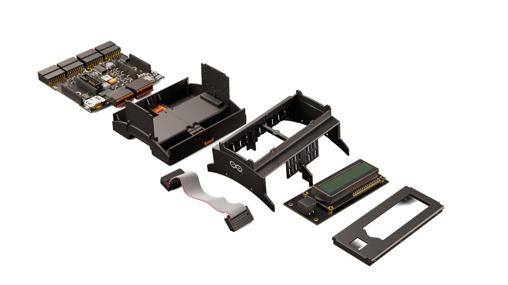
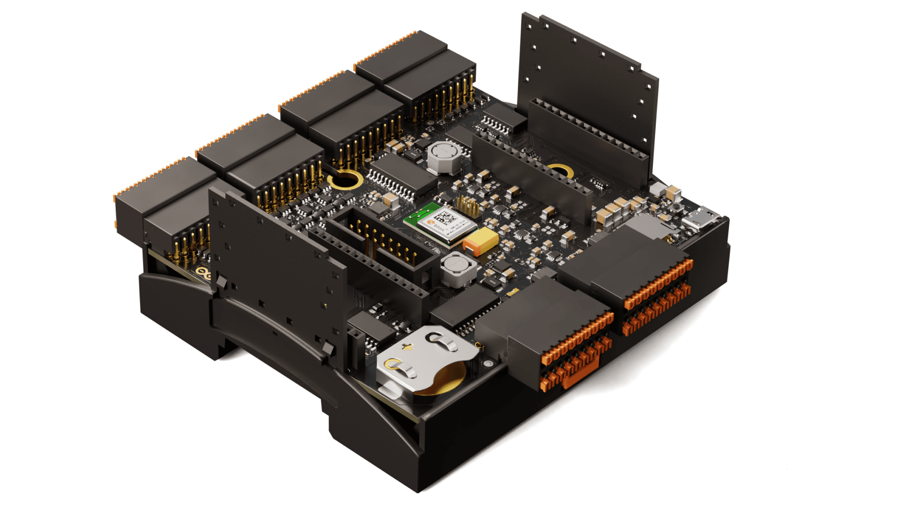
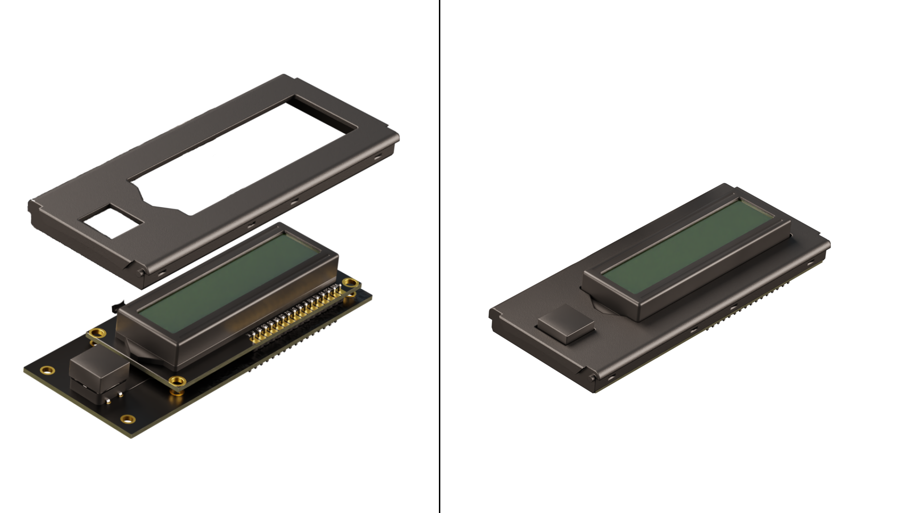
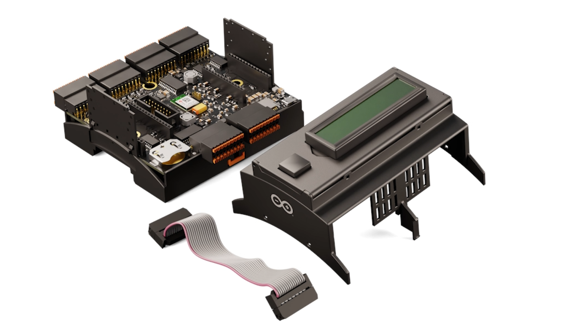
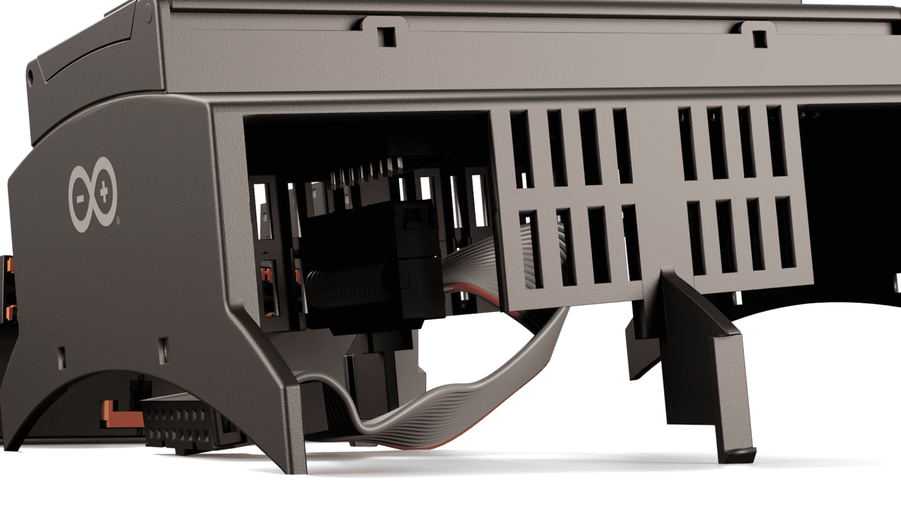
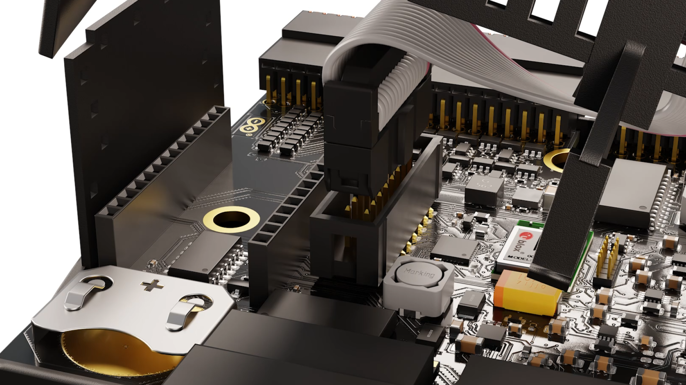
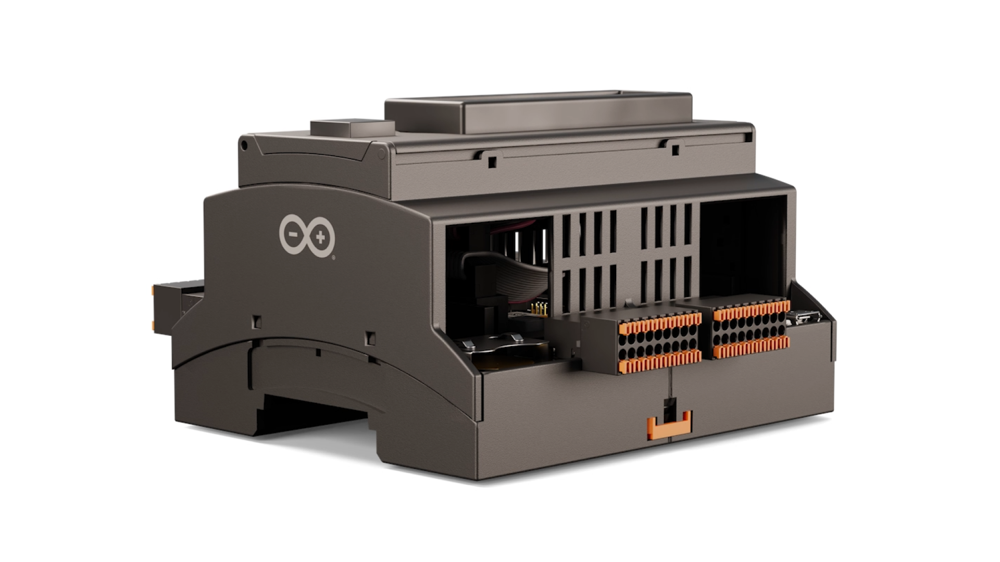

## Introduction 

The enclosure kit features an LCD screen on top and a perfectly fitted case for the Arduino Edge Control.

### Required Hardware and Software

- [Arduino® Edge Control](https://store.arduino.cc/products/arduino-edge-control)
- [Arduino® Enclosure Kit]()

## Assemble the Kit

<video width="100%" controls="true">
<source src="assets/edge-control-kit-assembly-animation.mp4" type="video/mp4"/>
</video>

Once you got all the parts and an Edge Control, we can start with placing the Edge Control into the bottom part of the enclosure kit.

Next place the LCD screen cover over the screen.

Now place the LCD screen into the top part of the enclosure kit.

To connect the screen to the carrier, plug one end of the cord into the under side of the LCD screen, the other end of the cord goes into the LCD connector on the Edge Control.

Finally you can put the upper part that holds the screen on the bottom part that holds the Carrier.

There you go, a perfectly fitted enclosure for your Edge Control with an LCD screen!

## Next Step

Now that you have your Edge Control hooked up to a LCD screen you might want to test the setup out. Feel free to take a look at our tutorials for the Arduino Edge Control.

- For simple getting started instructions for the Edge Control, look no further than our [Getting Started tutorial](https://docs.arduino.cc/tutorials/edge-control/ec-ard-gs)
- For a more in-depth look at the Edge Control's features head on over to our [Connecting and Controlling a Motorized Ball Valve tutorial](https://docs.arduino.cc/tutorials/edge-control/ec-ard-3wirevalve)