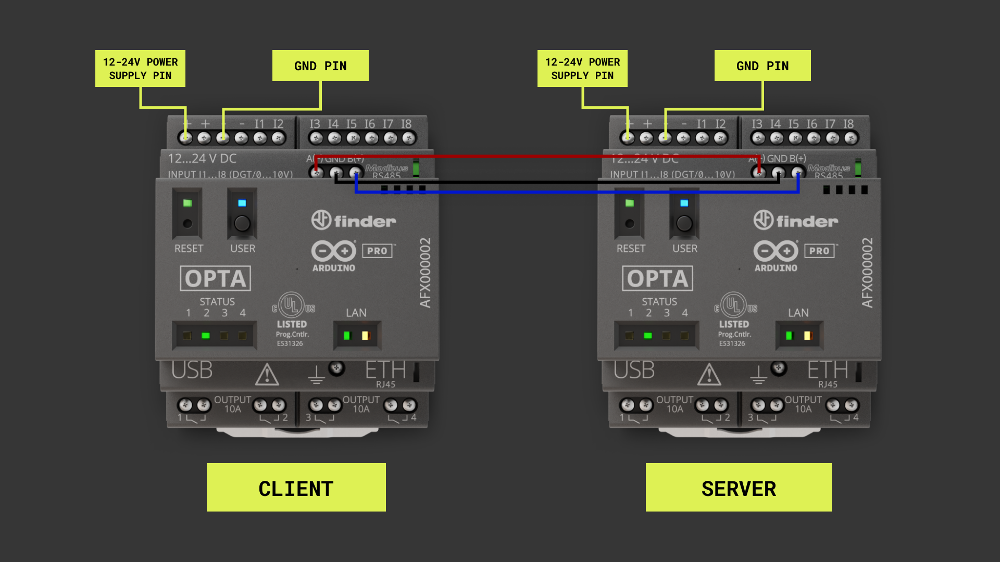
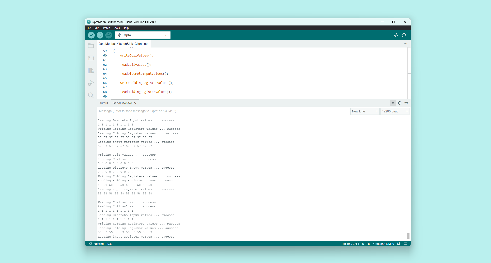

## Overview

Modbus is an open serial protocol derived from the client/server architecture initially developed and published by Modicon (now Schneider Electric) in 1979 for use with programmable logic controllers (PLCs); since 1979, Modbus has become a standard communications protocol in industrial electronic devices. The Opta™, with its industrial hardware and software capabilities and the Arduino ecosystem tools such as the Arduino IDE and its libraries, can implement this communications protocol. In this tutorial, we will learn how to implement this communications protocol over RS485 between two Opta™ devices.

## Goals

- Learn how to use the Modbus RTU communication protocol over RS485 between two Opta™ devices


### Required Hardware and Software

### Hardware Requirements

- [Opta™](https://store.arduino.cc/pages/opta) with RS485 support (x2)
- Wires with similar specs: STP/UTP 24-18AWG (Unterminated)/22-16AWG (Terminated) 100-130Ω rated cable for RS485 connection (x3)
- 12VDC/1A DIN rail power supply (x1)
- USB-C® cable (x1)

### Software Requirements

- [Arduino IDE 1.8.10+](https://www.arduino.cc/en/software), [Arduino IDE 2.0+](https://www.arduino.cc/en/software), or [Arduino Web Editor](https://create.arduino.cc/editor)

## Modbus 101

Modbus is an open and royalty-free serial communication protocol widely used in industrial electronic devices, especially in Building Management Systems (BMS) and Industrial Automation Systems (IAS). It was published in 1979 (more than 40 years ago) and has become a _de facto_ standard communication protocol among industrial electronic devices.


***Modbus communication protocol is often used to connect a supervisory device with a Remote Terminal Unit (RTU) in Supervisory Control and Data Acquisition (SCADA) Systems.***


Reliability in communications between electronic devices is ensured with Modbus by using messages with a simple 16-bit structure with a Cyclic-Redundant Checksum (CRC).


***If you want more insights on the Modbus communication protocol, look at our [Modbus article](https://docs.arduino.cc/learn/communication/modbus).***


## Instructions

### Setting Up the Arduino IDE

First, let's ensure we have the latest Arduino IDE version installed on our computers; you can download the latest Arduino IDE version [here](https://www.arduino.cc/en/software). If you are using Opta™ for the first time, please look at our [getting started tutorial](/tutorials/opta/getting-started) and install the device drivers on your computer. Modbus RTU communications protocol will be implemented using the [`ArduinoModbus`](https://www.arduino.cc/reference/en/libraries/arduinomodbus/) library, be sure to install the latest version of the library.

***`ArduinoModbus` library requires the `ArduinoRS485` library as the Modbus library is dependent on it; remember to install both libraries.***

### Connecting the Opta™ Over RS485

Now the Opta™ devices must be connected via RS485 bus, as shown in the image below:




### Code Overview

The objective of the example described below is to configure and use Modbus RTU communications protocol over RS485 between two Opta™ devices, one acting as a Client and the other acting as a Server. The Client is responsible for writing and reading `Coil`, `Holding`, `Discrete Input`, and `Input` register values. The Server will poll for Modbus RTU requests and return values accordingly to each request. To help you understand better how the example works, we will briefly explain the essential parts of the code used in this tutorial.

#### Modbus RTU Client

The Opta™ Client will require the following setup:

```arduino
#include <ArduinoModbus.h>
#include <ArduinoRS485.h> // ArduinoModbus depends on the ArduinoRS485 library

constexpr auto baudrate { 19200 };

// Calculate preDelay and postDelay in microseconds as per Modbus RTU Specification
//
// MODBUS over serial line specification and implementation guide V1.02
// Paragraph 2.5.1.1 MODBUS Message RTU Framing
// https://modbus.org/docs/Modbus_over_serial_line_V1_02.pdf
constexpr auto bitduration { 1.f / baudrate };
constexpr auto preDelayBR { bitduration * 9.6f * 3.5f * 1e6 };
constexpr auto postDelayBR { bitduration * 9.6f * 3.5f * 1e6 };
// constexpr auto preDelayBR { bitduration * 10.0f * 3.5f * 1e6 };

int counter = 0;

void setup()
{
    Serial.begin(9600);
    while (!Serial);

    Serial.println("Modbus RTU Client");

    RS485.setDelays(preDelayBR, postDelayBR);

    // start the Modbus RTU client
    if (!ModbusRTUClient.begin(baudrate, SERIAL_8E1)) {
        Serial.println("Failed to start Modbus RTU Client!");
        while (1);
    }
}
```

Given Modbus RTU specification, `preDelay` and `postDelay` must be configured for correct operation and this example will use the defined parameters as per specification based on message RTU framing that is explained in deep with this [guide](https://modbus.org/docs/Modbus_over_serial_line_V1_02.pdf). The method `RS485.setDelays(preDelayBR, postDelayBR);` will be called to take it into effect to correctly enable Modbus RTU on the Opta™.

The baud rate can be configured as `4800`, `9600`, and `19200`; in the current example, we are using a baud rate of `19200`, but it can be changed depending on the system requirements. The `SERIAL_8E1` defines the serial port parameters setting (8 data bits, even parity, and one stop bit).

The Modbus Server can be a module or a sensor with registers that can be accessed using specified addresses to obtain the desired information about what's being measured or monitored. To access those data, inside the loop function of the sketch for the Client device, there are several tasks in charge of reading and writing specific values. 


```arduino
void loop(){
    writeCoilValues();

    readCoilValues();

    readDiscreteInputValues();

    writeHoldingRegisterValues();

    readHoldingRegisterValues();

    readInputRegisterValues();

    counter++;

    delay(5000);
    Serial.println();
}
```

The complete code for the Client is shown below:

```arduino
#include <ArduinoModbus.h>
#include <ArduinoRS485.h> // ArduinoModbus depends on the ArduinoRS485 library

constexpr auto baudrate { 19200 };

// Calculate preDelay and postDelay in microseconds as per Modbus RTU Specification
//
// MODBUS over serial line specification and implementation guide V1.02
// Paragraph 2.5.1.1 MODBUS Message RTU Framing
// https://modbus.org/docs/Modbus_over_serial_line_V1_02.pdf
constexpr auto bitduration { 1.f / baudrate };
constexpr auto preDelayBR { bitduration * 9.6f * 3.5f * 1e6 };
constexpr auto postDelayBR { bitduration * 9.6f * 3.5f * 1e6 };
// constexpr auto preDelayBR { bitduration * 10.0f * 3.5f * 1e6 };

int counter = 0;

void setup()
{
    Serial.begin(9600);
    while (!Serial);

    Serial.println("Modbus RTU Client");

    RS485.setDelays(preDelayBR, postDelayBR);

    // start the Modbus RTU client
    if (!ModbusRTUClient.begin(baudrate, SERIAL_8E1)) {
        Serial.println("Failed to start Modbus RTU Client!");
        while (1);
    }
}

void loop()
{
    writeCoilValues();

    readCoilValues();

    readDiscreteInputValues();

    writeHoldingRegisterValues();

    readHoldingRegisterValues();

    readInputRegisterValues();

    counter++;

    delay(5000);
    Serial.println();
}

void writeCoilValues()
{
    // set the coils to 1 when counter is odd
    byte coilValue = ((counter % 2) == 0) ? 0x00 : 0x01;

    Serial.print("Writing Coil values ... ");

    // write 10 Coil values to (server) id 42, address 0x00

    ModbusRTUClient.beginTransmission(42, COILS, 0x00, 10);
    for (int i = 0; i < 10; i++) {
        ModbusRTUClient.write(coilValue);
    }
    if (!ModbusRTUClient.endTransmission()) {
        Serial.print("failed! ");
        Serial.println(ModbusRTUClient.lastError());
    } else {
        Serial.println("success");
    }

    // Alternatively, to write a single Coil value use:
    // ModbusRTUClient.coilWrite(...)
}

void readCoilValues()
{
    Serial.print("Reading Coil values ... ");

    // read 10 Coil values from (server) id 42, address 0x00

    if (!ModbusRTUClient.requestFrom(42, COILS, 0x00, 10)) {
        Serial.print("failed! ");
        Serial.println(ModbusRTUClient.lastError());
    } else {
        Serial.println("success");

        while (ModbusRTUClient.available()) {
            Serial.print(ModbusRTUClient.read());
            Serial.print(' ');
        }
        Serial.println();
    }

    // Alternatively, to read a single Coil value use:
    // ModbusRTUClient.coilRead(...)
}

void readDiscreteInputValues()
{
    Serial.print("Reading Discrete Input values ... ");

    // read 10 Discrete Input values from (server) id 42, address 0x00

    if (!ModbusRTUClient.requestFrom(42, DISCRETE_INPUTS, 0x00, 10)) {
        Serial.print("failed! ");
        Serial.println(ModbusRTUClient.lastError());
    } else {
        Serial.println("success");

        while (ModbusRTUClient.available()) {
            Serial.print(ModbusRTUClient.read());
            Serial.print(' ');
        }
        Serial.println();
    }

    // Alternatively, to read a single Discrete Input value use:
    // ModbusRTUClient.discreteInputRead(...)
}

void writeHoldingRegisterValues()
{
    // set the Holding Register values to counter

    Serial.print("Writing Holding Registers values ... ");

    // write 10 coil values to (server) id 42, address 0x00

    ModbusRTUClient.beginTransmission(42, HOLDING_REGISTERS, 0x00, 10);
    for (int i = 0; i < 10; i++) {
        ModbusRTUClient.write(counter);
    }
    if (!ModbusRTUClient.endTransmission()) {
        Serial.print("failed! ");
        Serial.println(ModbusRTUClient.lastError());
    } else {
        Serial.println("success");
    }

    // Alternatively, to write a single Holding Register value use:
    // ModbusRTUClient.holdingRegisterWrite(...)
}

void readHoldingRegisterValues()
{
    Serial.print("Reading Holding Register values ... ");

    // read 10 Input Register values from (server) id 42, address 0x00

    if (!ModbusRTUClient.requestFrom(42, HOLDING_REGISTERS, 0x00, 10)) {
        Serial.print("failed! ");
        Serial.println(ModbusRTUClient.lastError());
    } else {
        Serial.println("success");

        while (ModbusRTUClient.available()) {
            Serial.print(ModbusRTUClient.read());
            Serial.print(' ');
        }
        Serial.println();
    }

    // Alternatively, to read a single Holding Register value use:
    // ModbusRTUClient.holdingRegisterRead(...)
}

void readInputRegisterValues()
{
    Serial.print("Reading input register values ... ");

    // read 10 discrete input values from (server) id 42,

    if (!ModbusRTUClient.requestFrom(42, INPUT_REGISTERS, 0x00, 10)) {
        Serial.print("failed! ");
        Serial.println(ModbusRTUClient.lastError());
    } else {
        Serial.println("success");

        while (ModbusRTUClient.available()) {
            Serial.print(ModbusRTUClient.read());
            Serial.print(' ');
        }
        Serial.println();
    }

    // Alternatively, to read a single Input Register value use:
    // ModbusRTUClient.inputRegisterRead(...)
}
```

#### Modbus RTU Server

In the Opta™ Server, the main task will be to poll for Modbus RTU requests and return configured values when requested. It requires following the same initial configuration as the Opta™ Client. The main difference between the Client and the Server devices lies in the `setup()` function:

```arduino
#include <ArduinoRS485.h> // ArduinoModbus depends on the ArduinoRS485 library
#include <ArduinoModbus.h>

constexpr auto baudrate { 19200 };

// Calculate preDelay and postDelay in microseconds as per Modbus RTU Specification
//
// MODBUS over serial line specification and implementation guide V1.02
// Paragraph 2.5.1.1 MODBUS Message RTU Framing
// https://modbus.org/docs/Modbus_over_serial_line_V1_02.pdf
constexpr auto bitduration { 1.f / baudrate };
constexpr auto preDelayBR { bitduration * 9.6f * 3.5f * 1e6 };
constexpr auto postDelayBR { bitduration * 9.6f * 3.5f * 1e6 };
// constexpr auto preDelayBR { bitduration * 10.0f * 3.5f * 1e6 };

const int numCoils = 10;
const int numDiscreteInputs = 10;
const int numHoldingRegisters = 10;
const int numInputRegisters = 10;

void setup() {
  Serial.begin(9600);
  while (!Serial);

  Serial.println("Modbus RTU Server");

  RS485.setDelays(preDelayBR, postDelayBR);

  // start the Modbus RTU client
  if (!ModbusRTUServer.begin(42, baudrate, SERIAL_8E1)) {
      Serial.println("Failed to start Modbus RTU Server!");

      while (1);
  }

  // configure coils at address 0x00
  ModbusRTUServer.configureCoils(0x00, numCoils);

  // configure discrete inputs at address 0x00
  ModbusRTUServer.configureDiscreteInputs(0x00, numDiscreteInputs);

  // configure holding registers at address 0x00
  ModbusRTUServer.configureHoldingRegisters(0x00, numHoldingRegisters);

  // configure input registers at address 0x00
  ModbusRTUServer.configureInputRegisters(0x00, numInputRegisters);
}
```

In the `setup()` function of the sketch dedicated to the Modbus server, the Server address is assigned as an identifier that will be recognized by the Client. Also, the initial values of the `Coils`, `Discrete Input`, `Holding`, and `Input` registers are configured. Those are the data that the Client will locate and retrieve. The following line is necessary in the Server `loop()` function:


```arduino
ModbusRTUServer.poll();
```

This is the line that will poll for Modbus RTU requests. The complete code for the Server is shown below:

```arduino
#include <ArduinoRS485.h> // ArduinoModbus depends on the ArduinoRS485 library
#include <ArduinoModbus.h>

constexpr auto baudrate { 19200 };

// Calculate preDelay and postDelay in microseconds as per Modbus RTU Specification
//
// MODBUS over serial line specification and implementation guide V1.02
// Paragraph 2.5.1.1 MODBUS Message RTU Framing
// https://modbus.org/docs/Modbus_over_serial_line_V1_02.pdf
constexpr auto bitduration { 1.f / baudrate };
constexpr auto preDelayBR { bitduration * 9.6f * 3.5f * 1e6 };
constexpr auto postDelayBR { bitduration * 9.6f * 3.5f * 1e6 };
// constexpr auto preDelayBR { bitduration * 10.0f * 3.5f * 1e6 };

const int numCoils = 10;
const int numDiscreteInputs = 10;
const int numHoldingRegisters = 10;
const int numInputRegisters = 10;

void setup() {
  Serial.begin(9600);
  while (!Serial);

  Serial.println("Modbus RTU Server");

  RS485.setDelays(preDelayBR, postDelayBR);

  // start the Modbus RTU client
  if (!ModbusRTUServer.begin(42, baudrate, SERIAL_8E1)) {
      Serial.println("Failed to start Modbus RTU Client!");
      while (1);
  }

  // configure coils at address 0x00
  ModbusRTUServer.configureCoils(0x00, numCoils);

  // configure discrete inputs at address 0x00
  ModbusRTUServer.configureDiscreteInputs(0x00, numDiscreteInputs);

  // configure holding registers at address 0x00
  ModbusRTUServer.configureHoldingRegisters(0x00, numHoldingRegisters);

  // configure input registers at address 0x00
  ModbusRTUServer.configureInputRegisters(0x00, numInputRegisters);
}

void loop() {
  // poll for Modbus RTU requests
  ModbusRTUServer.poll();

  // map the coil values to the discrete input values
  for (int i = 0; i < numCoils; i++) {
    int coilValue = ModbusRTUServer.coilRead(i);

    ModbusRTUServer.discreteInputWrite(i, coilValue);
  }

  // map the holding register values to the input register values
  for (int i = 0; i < numHoldingRegisters; i++) {
    long holdingRegisterValue = ModbusRTUServer.holdingRegisterRead(i);

    ModbusRTUServer.inputRegisterWrite(i, holdingRegisterValue);
  }
}
```

### Testing the Modbus RTU Client and Server

Once the Modbus RTU Client and Server code for each Opta™ device has been uploaded, by opening the Serial Monitor on the Opta™ Client's side a `Success!` message will be displayed after each read-and-write task as shown in the image below:




## Conclusion

This tutorial shows how to establish a Modbus RTU connection between two Opta™ devices using the Arduino ecosystem tools, such as the Arduino IDE and Arduino `ArduinoRS485` and `ArduinoModbus` libraries. Those are essential to enable the communication with Modbus RTU compatible devices. Through these examples it is easy to understand how to enable the communication between a Modbus RTU Server and a Client. Looking at this example it will be also easy o add extend the communication to another Modbus Server device, like secondary Opta™ or use a Modbus RTU-compatible module for enhanced project developments.


### Next Steps

Now that you know how to create and use a Modbus RTU communication with Opta™, you can take a look at [Getting started with connectivity on the Opta™ tutorial](/tutorials/opta/getting-started-connectivity) to discover more about all the connectivity possibilities that Opta™ has.