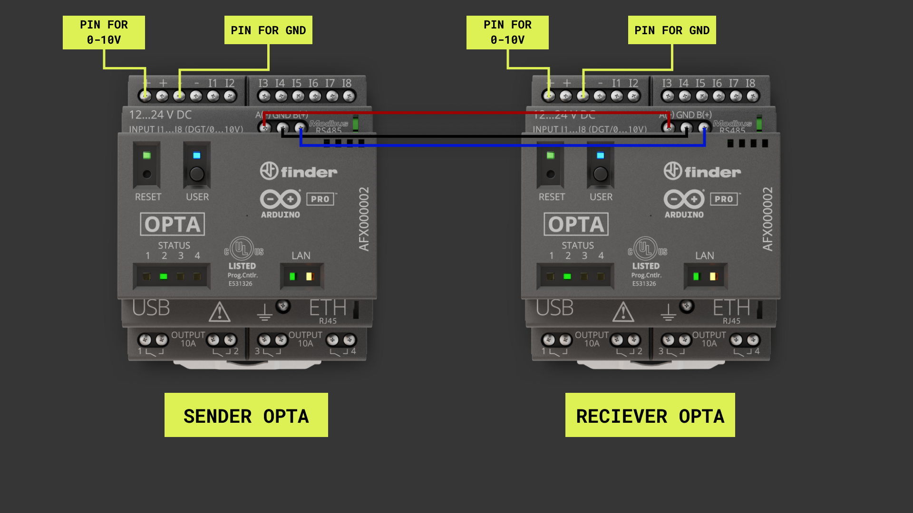

## Overview

The Arduino Opta is equipped with the industry standard RS485 protocol. Making use of this feature is made easy with the help of the Arduino IDE and the [ArduinoRS485 library](https://www.arduino.cc/reference/en/libraries/arduinors485/). This tutorial will go through the steps to get this protocol up and running using two Optas and the Arduino IDE. Going through some important functions in the library and show a example sketch that makes use of the library and RS485 protocol.

## Goals

- Learn how to connect two Optas for RS485 communication
- Run a Modbus-RS485 sender sketch on Opta
- Run a Modbus-RS485 receiver sketch on Opta
- Learn how to send values using the Modbus RTU protocol and the RS485 interface 

### Required Hardware and Software

- USB-C® cable (either USB-C to USB-A or USB-C to USB-C)
- [Arduino Opta](https://store.arduino.cc/pages/opta)
- Power supply of 12-24V DC, 1A 
- [Arduino IDE](https://www.arduino.cc/en/software)

## Instructions

### Setting up With Arduino IDE

First make sure the latest version of the Arduino IDE is installed. Download the IDE from [here](https://www.arduino.cc/en/software) if you need help setting up the Opta with the Arduino IDE, please have a look at our [Getting started with Opta tutorial]().

To make it easier to use the RS485 protocol with Opta let's make use of a library. The library is called [ArduinoRS485 library](https://www.arduino.cc/reference/en/libraries/arduinors485/), which can be found in the Arduino IDE library manager. Once installed let's take a look at a simple sketch to use for testing out the Modbus RS485 protocol.

If you want a more in-depth article that explains the entirety of what a Modbus and RS485 protocol is, take a look at our [Modbus article](https://docs.arduino.cc/learn/communication/modbus).

### Using Modbus RS485 on Opta

The sender sketch will run a RS485 connection between your two devices and it will let you send a message over the serial monitor to the receiving device. The receiving device, which will be a Opta in this example, will then take the message, open or close the corresponding relay and turn on or off a LED. If you send the number 0 through the serial monitor, the receiving Opta will open or close relay 1 depending on it's current status, while turning on or off a status LED.

Here are some important functions in the sketch:

- `RS485.begin(9600)`: Initializes the RS485 object communication speed with assigned baudrate, `9600` in this case.
- `RS485.beginTransmission()`: Enables RS485 transmission.
- `RS485.print()`: Writes binary data over RS485. This data is sent as a byte or series of bytes.
- `RS485.endTransmission()`: Disables RS-485 transmission.

Connect the sender and receiver Opta according to the image shown below.



### Modbus RTU RS485 Sender Sketch

Now upload this sketch to the device you want to designate as the sender device.

```arduino
#include <ArduinoRS485.h>

int incomingByte = 0; // for incoming serial data

void setup()
{
  Serial.begin(115200); // opens serial port
  RS485.begin(9600);
}

void loop() {

  if (Serial.available() > 0)
  {
    incomingByte = Serial.read();
    RS485.beginTransmission();
    RS485.print(incomingByte);
    RS485.endTransmission();
    delay(1000);
  }
}
```


### Modbus RTU RS485 Receiver Sketch

Some important functions in the receiver sketch:

- `RS485.begin(9600)`: Make sure this is set to the same baudrate as the sender device, `9600` in this case.
- `RS485.receive()`: Enables reception through the RS485 connection.
- `RS485.parseInt()`: We use this function to make sure that the correct value is received and read.

Now upload this sketch to the receiver device.

```arduino
#include <ArduinoRS485.h>
int readValue = 0;
bool newState = false;

int relays[] = {D0, D1, D2, D3};
int leds[] = {LED_D0, LED_D1, LED_D2, LED_D3};

void setup()
{
    for (int i = 0; i < 4; i++){
        pinMode(relays[i], OUTPUT);
        pinMode(leds[i], OUTPUT);
    }

    RS485.begin(9600);
    RS485.receive();

    Serial.begin(9600);
    while (!Serial);
}

void loop(){
    while (RS485.available() > 0){
        readValue = RS485.parseInt();
        RS485.parseInt();
        newState = true;
    }

    if (newState){
        changeRelay();
        newState = false;
    }
}

void changeRelay(){
    if (digitalRead(relays[readValue]) == 1){
        digitalWrite(relays[readValue], LOW);
        digitalWrite(leds[readValue], LOW);
    }else{
        digitalWrite(relays[readValue], HIGH);
        digitalWrite(leds[readValue], HIGH);
    }
}
```

### Testing Out the Sketches

Now that both sketches has been uploaded to the devices. Plug in the USB to the sender device, make sure the receiver device is powered and then open the serial monitor in the Arduino IDE. With the serial monitor open send a value between 0-3 in the serial monitor to the sender device. Sending a 0 should open the first relay and turn on the first status LED, from left to right. Sending a 0 again will close the relay and turn off the LED.

The values the device can receive and the result:

- Sending the value 0: Will turn on or off the first relay and status LED.
- Sending the value 1: Will turn on or off the second relay and status LED.
- Sending the value 2: Will turn on or off the third relay and status LED.
- Sending the value 3: Will turn on or off the fourth relay and status LED.

## Conclusion

In this tutorial we went through how to establish a Modbus RTU connection between two Optas. And then how to write sketches using the `ArduinoRS485.h` library to send and receive values between these two devices. Finally the tutorial showed how to take these values sent with RS485 to interact with the Opta.

### Next Steps

Now that you are familiar with Modbus RS485 on the Opta, have a look at our [Getting started with Opta tutorial]() to get a better overview of other features on the device.

If you wish to incorporate connectivity in your Opta solutions, have a look at the [Connectivity on Opta tutorial]().

If you are interested in seeing the RS485 protocol being put to work in a real life scenario, have a look at our [Tank levels application note for the Opta]().