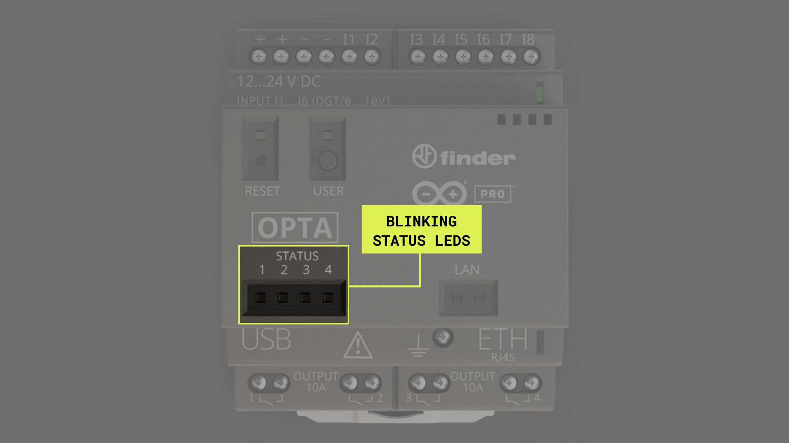
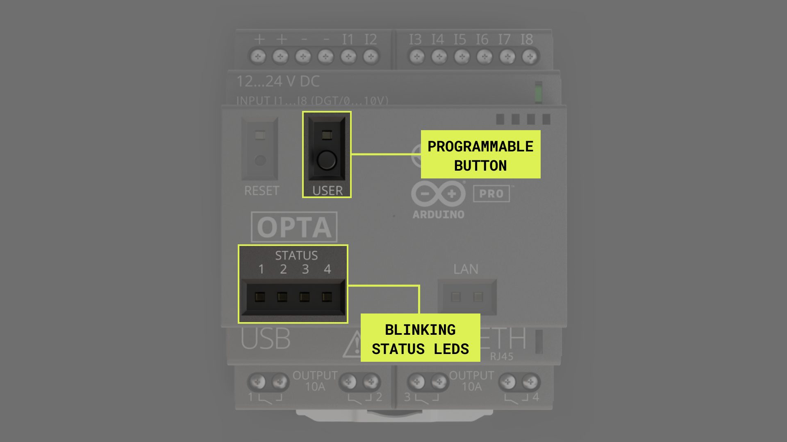
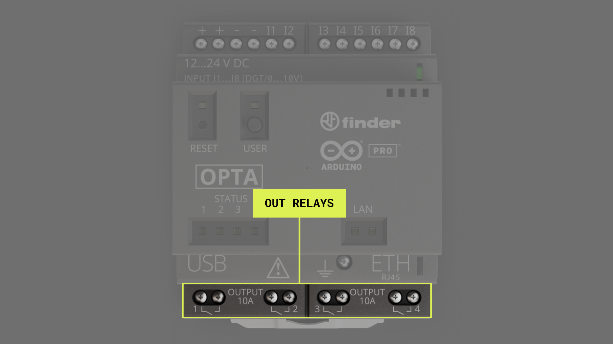
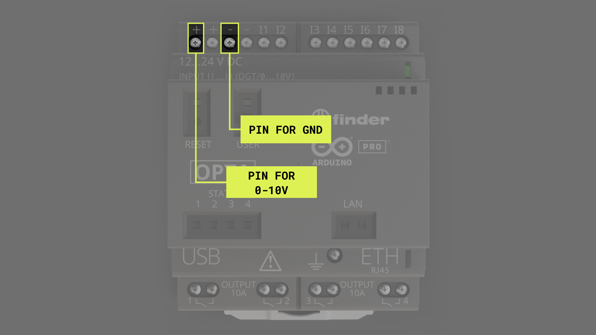
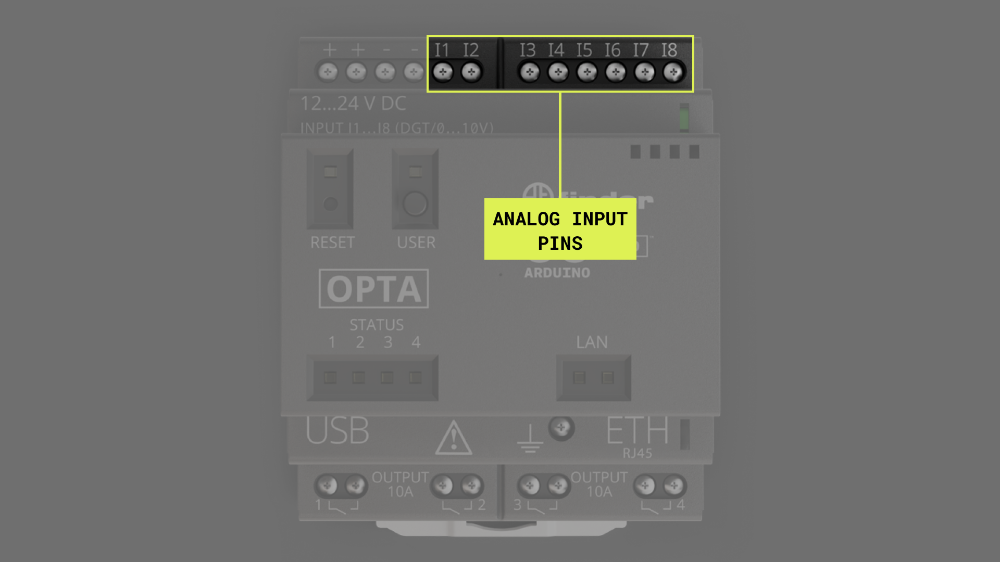

## Overview

The Arduino Opta is a robust PLC solution with many features. In this tutorial we will go through how to set up the Opta with the Arduino IDE and how to use some of the devices features. We will take a look at how to program the LEDs on the device, how to use the programmable button, as well as using inputs and outputs.

## Goals

- Get the Arduino Opta working with the Arduino IDE
- Blinking the LEDs on the device
- Programming the button on the device
- Test the inputs and outputs on the device
- How to connect the device to the cloud

### Required Hardware and Software

- USB-C cable (either USB-C to USB-A or USB-C to USB-C)
- Power supply (optional)
- [Arduino Opta](https://store.arduino.cc/pages/opta)
- Arduino IDE

## Instructions

### Setting up with the Arduino IDE

First make sure the latest version of the Arduino IDE is installed. Download the IDE from [here](https://www.arduino.cc/en/software) if you have not done so already. Now within the Arduino IDE we need to install the core for the Opta. Go to **Tools > Board > Boards Manager**, in the boards manager search for **Opta mbed** and install it.


Now we are ready to upload sketches to the Opta via the Arduino IDE.

### Trying a Blink Sketch

With the IDE and core are installed, lets try and upload a sketch to our device. We will be creating a classic version of the Arduino blink sketch to see if everything is working with the IDE and our device. Lets create a simple blink sketch that will blink the four LEDs on the Opta. All the LEDs on the device are defined in the core, so we can easily use them as stated in the sketch below. Copy the sketch below into a Arduino IDE sketch, select the correct board and port in the **Tools** section, then upload the sketch. When the sketch is uploaded you should see the LEDs on top of the Opta blink in sequence, the LEDs are highlighted in the image below.

```arduino
void setup() {
  pinMode(LED_D0, OUTPUT);
  pinMode(LED_D1, OUTPUT);
  pinMode(LED_D2, OUTPUT);
  pinMode(LED_D3, OUTPUT);
}

void loop() {
  digitalWrite(LED_D0, HIGH);
  delay(100);
  digitalWrite(LED_D0, LOW);
  delay(100);
  digitalWrite(LED_D1, HIGH);
  delay(100);
  digitalWrite(LED_D1, LOW);
  delay(100);
  digitalWrite(LED_D2, HIGH);
  delay(100);
  digitalWrite(LED_D2, LOW);
  delay(100);
  digitalWrite(LED_D3, HIGH);
  delay(100);
  digitalWrite(LED_D3, LOW);
  delay(500);  
}
```



### Configuring the Programmable Button on the Opta

On the Arduino Opta there is a programmable button that we can make use of, shown on the image below. Using the Arduino IDE we can easily program this button to fit our needs. Lets take a look at a simple use case for the button. Expanding on the blink sketch we tried earlier. Lets use the button as our trigger for when the LED should blink. The button is already defined in the core, so using it is a simple case of using `BTN_USER` as the button pin in your code. The we can modify the Blink sketch we used earlier. The new sketch will reverse the blink sequence when the button is pressed. The `BTN_USER` will continuously read `HIGH`, when it is pressed it will read `LOW`. We will put the blink sequences in separate functions to easier control the event change when the button is pressed. Below you can find the entire sketch and an image highlighting the button on the device. 

```arduino
bool reversed = false;
int buttonState = 0;

void setup() {
  // initialize digital pin LED_BUILTIN as an output.
  pinMode(LED_D0, OUTPUT);
  pinMode(LED_D1, OUTPUT);
  pinMode(LED_D2, OUTPUT);
  pinMode(LED_D3, OUTPUT);
  pinMode(BTN_USER, INPUT);
}

// the loop function runs over and over again forever
void loop() {
  buttonState = digitalRead(BTN_USER);
    if(buttonState == LOW){
    if (reversed == true){
      reversed = false;
    }
    else if (reversed == false){
      reversed = true;
    }
  }
  if (reversed == true){
    reverseSequence();
  }
  else{
    sequence();
  }
}

void sequence() {
  digitalWrite(LED_D0, HIGH);
  delay(100);
  digitalWrite(LED_D0, LOW);
  delay(100);
  digitalWrite(LED_D1, HIGH);
  delay(100);
  digitalWrite(LED_D1, LOW);
  delay(100);
  digitalWrite(LED_D2, HIGH);
  delay(100);
  digitalWrite(LED_D2, LOW);
  delay(100);
  digitalWrite(LED_D3, HIGH);
  delay(100);
  digitalWrite(LED_D3, LOW);
  delay(100);  
}

void reverseSequence(){
  digitalWrite(LED_D3, HIGH);
  delay(100);
  digitalWrite(LED_D3, LOW);
  delay(100);
  digitalWrite(LED_D2, HIGH);
  delay(100);
  digitalWrite(LED_D2, LOW);
  delay(100);
  digitalWrite(LED_D1, HIGH);
  delay(100);
  digitalWrite(LED_D1, LOW);
  delay(100);
  digitalWrite(LED_D0, HIGH);
  delay(100);
  digitalWrite(LED_D0, LOW);
  delay(100);  
}
```



Now the blink sequence should switch direction when the button is pressed.

### Using Out Relays

The Arduino Opta has 4 out relays, corresponding to pins D0-D3. These four electromechanical relay outputs, each of which consists of 1 NO (SPST) contact with a capacity of 10 A at 250 V AC
This value refers to an applied resistive load (AC1), at a nominal voltage of 250 V AC. If the load is not resitive, or if the voltage on the contacts is different from 250 V AC, the nominal values can also change significantly.



The OPTA output contacts are "clean" contacts, they are contacts that are not live in a non-connection situation. This type of contact allows it to be used in any system and with any type of voltage. To function, the outputs must therefore be connected by bringing, for example a power cable to a terminal, and exiting the terminal on the side, go towards the load to be managed.
In this way, when the contact is closed by the logic set via IDE, that power supply signal will cross the contact and will switch on or in any case carry the signal up to the reference load.
The “clean” contact also allows to carry a different power system or type of load for each output contact.

Lets run a simple sketch to test out the out relays on the Opta. For this sketch you need to Supply a voltage from 5.5 to 32V on PIN 1 (VIN) and connect GND to PIN 3, as shown in the image below. Internally the signal is conditioned to 5V and the relays are driven. Inside the case there is a led to check power supply on VIN. If you are uncertain to whether the device is powered correctly, check the LED.



```arduino
void setup() {
 pinMode(D0, OUTPUT); // sets the rele pin D0 as output
 pinMode(D1, OUTPUT); // sets the rele pin D1 as output
 pinMode(D2, OUTPUT); // sets the rele pin D2 as output
 pinMode(D3, OUTPUT); // sets the rele pin D3 as output

}
void loop() {
 digitalWrite(D0, HIGH); // sets the Rele 1 on
 delay(1000); // waits for a second
 digitalWrite(D0, LOW); // sets the Rele 1 off
 delay(1000); // waits for a second
}
```

### Using Analog Inputs

The Arduino Opta has 8 analog in pins, corresponding to pins A0-A7. OPTA is equipped with 8 inputs that can work both in digital mode (0 or 1) and in analog mode (from 0 to 10 V DC)
This choice must be made through IDE, setting the low value (0 = 0 V) or the high value (1 = 10 V) in the programming phase if we intend to set a digital type input. If the value is analogue (temperature, speed, position sensor), the low value (0 = 0 V) and the reference reading value will be set in the range between 0 and 10 V DC.



Now lets try a sketch that will read the analog inputs on the Opta. The sketch can read between 0-12V, keep that in mind when connecting power to the device. The voltage that is read by the micro is proportional and rescaled with a factor of 0.3 in the sketch. The resolution is up to 16bit (65535), at 12bit (4095). The sketch will read the inputs on the analog pins A0, A1 and A2. Then printing the result in the serial monitor.

```arduino
void setup() {
 Serial.begin(9600);
 analogReadResolution(12);
}

void loop() {

 // read the input on analog input 1:
 int sensorValueA0 = analogRead(A0);

 // 65535 is the max value with 16 bits resolution set by analogReadResolution(16)
 // 4095 is the max value with 12 bits resolution set by analogReadResolution(12)

 float voltageA0 = sensorValueA0 * (3.3 / 4095.0);
 // print out the value you read:
 Serial.print("A0: ");
 Serial.print(sensorValueA0);
 Serial.print(" = ");
 // print the voltage as a floating point number with 5 decimal digits
 Serial.println(voltageA0, 5);
 // read the input on analog pin 2:
 int sensorValueA1 = analogRead(A1);

 // 65535 is the max value with 16 bits resolution
 // 4095 is the max value with 12 bits resolution

 float voltageA1 = sensorValueA1 * (3.3 / 4095.0);
 // print out the value you read:
 Serial.print("A1: ");
 Serial.print(sensorValueA1);
 Serial.print(" = ");
 // print the voltage as a floating point number with 5 decimal digits
 Serial.println(voltageA1, 5);
 // read the input on analog pin 3:
 int sensorValueA2 = analogRead(A2);

 // 65535 is the max value with 16 bits resolution
 // 4095 is the max value with 12 bits resolution

 float voltageA2 = sensorValueA2 * (3.3 / 4095.0);
 // print out the value you read:
 Serial.print("A2: ");
 Serial.print(sensorValueA2);
 Serial.print(" = ");
 // print the voltage as a floating point number with 5 decimal digits
 Serial.println(voltageA2, 5);

 delay(1000);
}
```

### Connecting the Opta to the Cloud

It is possible to use the Arduino Opta with the Arduino Cloud. To set up the Arduino Opta to the cloud go to the [Arduino Cloud](https://cloud.arduino.cc/). For help with how to get started with the cloud, go to our [Getting started with the cloud tutorial](https://docs.arduino.cc/arduino-cloud/getting-started/iot-cloud-getting-started). We also have a number of other helpful tutorials for [the Arduino cloud](https://docs.arduino.cc/arduino-cloud/).

## Conclusion

This tutorial went through the basics of the Arduino Opta. Now you should know how to program the LEDs on the board. We also showed how to program the programmable button on the device. The analog inputs and the out relays were also covered. After going through this tutorial you should be ready to go into the other Opta tutorials and learn more about the device and its features. 

### Next Steps

Now that you know the basics of the Arduino Opta it could be a good idea to combine these features with other features on the Opta. For example, if you want to add connectivity to your solution, take a look at the [Getting started with connectivity on the Opta tutorial](). It is also possible to use the Opta with the LogicLab IDE, for a guide on how to set this up check out our [Setting up the Opta with LogicLab tutorial](). For a better view of what LogicLab with Opta can offer take a look at our [LogicLab tutorial]()