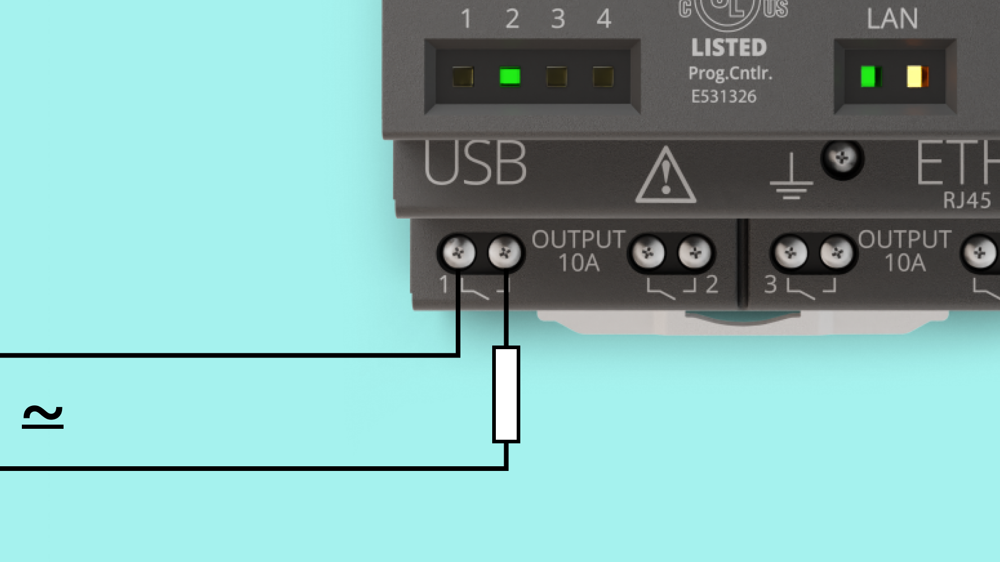

## Overview

Opta is a robust micro PLC solution with many engaging features. In this tutorial we will go through how to set up Opta with the Arduino IDE and how to use its basic features. We will take a look at how to program the LEDs on the device, how to use the programmable button, as well as using inputs and outputs.

## Goals

- Get the Opta working with the Arduino IDE
- Blinking the LEDs on the device
- Programming the button on the device
- Test the inputs and outputs on the device
- How to connect the device to the cloud

### Required Hardware and Software

- USB-C cable (either USB-C to USB-A or USB-C to USB-C)
- Power supply (optional)
- [Arduino Opta](https://store.arduino.cc/pages/opta)
- Arduino IDE

## Instructions

### Setting up with the Arduino IDE

First make sure the latest version of the Arduino IDE is installed. The IDE can be downloaded [here](https://www.arduino.cc/en/software). 
Within the Arduino IDE install the core for the Opta. Go to **Tools > Board > Boards Manager**, in the boards manager search for **Opta mbed** and install it.


Now we are ready to upload sketches to the Opta via the Arduino IDE.

### Trying a Blink Sketch

When the IDE and the core are installed, let's warm up by uploading a first sketch to your Opta. We will be using a classic version of the Arduino blink sketch to put your device to work and test everything is set properly. 
Let's create a simple blink sketch that will blink the four STATUS LEDs on the Opta, highlighted in the image below.
All the LEDs on the device are defined in the core, so you can easily use them as stated in the sketch below. 
The STATUS LEDs are identified on Opta with numbers; here the correspondence of each of them with the definition in the core:
LED_D0 --> STATUS 1
LED_D1 --> STATUS 2
LED_D2 --> STATUS 3
LED_D3 --> STATUS 4
Copy the sketch below into the Arduino IDE sketch editor, select the correct board and port in the **Tools** section, then upload it to Opta. When the sketch is uploaded you should see the Opta's STATUS LEDs blinking in sequence. 

```arduino
void setup() {
  pinMode(LED_D0, OUTPUT);
  pinMode(LED_D1, OUTPUT);
  pinMode(LED_D2, OUTPUT);
  pinMode(LED_D3, OUTPUT);
}

void loop() {
  digitalWrite(LED_D0, HIGH);
  delay(100);
  digitalWrite(LED_D0, LOW);
  delay(100);
  digitalWrite(LED_D1, HIGH);
  delay(100);
  digitalWrite(LED_D1, LOW);
  delay(100);
  digitalWrite(LED_D2, HIGH);
  delay(100);
  digitalWrite(LED_D2, LOW);
  delay(100);
  digitalWrite(LED_D3, HIGH);
  delay(100);
  digitalWrite(LED_D3, LOW);
  delay(500);  
}
```


### Configuring the Programmable Button on the Opta

Opta has a programmable button, shown on the image below and identified as USER. It can be programmed using the Arduino IDE to fit your needs.  
To show how much simple is to use it, let's expand the former sketch and program the button as a trigger to modify the behavior of the blink for the STATUS LEDs. 
The button is defined in the core as `BTN_USER`: 'HIGH' as default (not pressed), 'LOW' when pressed. 
The new sketch will reverse the blink sequence when the button is pressed. 
The blink sequences is placed in separate functions to control more easily the event change when the button is pressed. Below the entire sketch and an image highlighting the button on the device. 

```arduino
bool reversed = false;
int buttonState = 0;

void setup() {
  // initialize digital pin LED_BUILTIN as an output.
  pinMode(LED_D0, OUTPUT);
  pinMode(LED_D1, OUTPUT);
  pinMode(LED_D2, OUTPUT);
  pinMode(LED_D3, OUTPUT);
  pinMode(BTN_USER, INPUT);
}

// the loop function runs over and over again forever
void loop() {
  buttonState = digitalRead(BTN_USER);
    if(buttonState == LOW){
    if (reversed == true){
      reversed = false;
    }
    else if (reversed == false){
      reversed = true;
    }
  }
  if (reversed == true){
    reverseSequence();
  }
  else{
    sequence();
  }
}

void sequence() {
  digitalWrite(LED_D0, HIGH);
  delay(100);
  digitalWrite(LED_D0, LOW);
  delay(100);
  digitalWrite(LED_D1, HIGH);
  delay(100);
  digitalWrite(LED_D1, LOW);
  delay(100);
  digitalWrite(LED_D2, HIGH);
  delay(100);
  digitalWrite(LED_D2, LOW);
  delay(100);
  digitalWrite(LED_D3, HIGH);
  delay(100);
  digitalWrite(LED_D3, LOW);
  delay(100);  
}

void reverseSequence(){
  digitalWrite(LED_D3, HIGH);
  delay(100);
  digitalWrite(LED_D3, LOW);
  delay(100);
  digitalWrite(LED_D2, HIGH);
  delay(100);
  digitalWrite(LED_D2, LOW);
  delay(100);
  digitalWrite(LED_D1, HIGH);
  delay(100);
  digitalWrite(LED_D1, LOW);
  delay(100);
  digitalWrite(LED_D0, HIGH);
  delay(100);
  digitalWrite(LED_D0, LOW);
  delay(100);  
}
```


Now the blink sequence should reverse its direction when the button is pressed.

### Using Out Relays

Opta has 4 outputs, consisting of 4 electromechanical relays NO (SPST) with a capacity of 10 A at 250 V AC (considering a resistive load). They are identified as OUTPUTS and located on the bottom of Opta as shown in the image. They correspond to pins D0 to D3 as follows:
OUTPUT 1 --> D0
OUTPUT 2 --> D1
OUTPUT 3 --> D3
OUTPUT 4 --> D4


The OPTA output contacts are "clean" contacts, they are contacts that are not live in a non-connection situation. This type of contact allows it to be used in any system and with any type of voltage. To function, the outputs must therefore be connected by bringing, for example a power cable to a terminal, and exiting the terminal on the side, go towards the load to be managed.
In this way, when the contact is closed by the logic set via IDE, that power supply signal will cross the contact and will switch on or in any case carry the signal up to the reference load.
The “clean” contact also allows to carry a different power system or type of load for each output contact.



Let's run a simple sketch to test the output relays on Opta. To activate the relays and run this sketch you need to provide Opta with a voltage from 12 to 24 V DC by connecting it a proper power supply.

Opta has dedicated terminals for power supply, located in the upper part of Opta next to the Inputs. They are doubled to help the user to connect the power supply and any common part for the input terminals but are at the same potential (upon polarity) and equivalent.

These terminals are polarized, it is therefore mandatory to strictly respect the power supply polarity by connecting the positive connector of the power supply to "+" and the negative to "-".

Inside the case there is a led to check power supply. If you are uncertain to whether the device is powered correctly, check the LED.


```arduino
void setup() {
 pinMode(D0, OUTPUT); // sets the rele pin D0 as output
 pinMode(D1, OUTPUT); // sets the rele pin D1 as output
 pinMode(D2, OUTPUT); // sets the rele pin D2 as output
 pinMode(D3, OUTPUT); // sets the rele pin D3 as output

}
void loop() {
 digitalWrite(D0, HIGH); // sets the Rele 1 on
 delay(1000); // waits for a second
 digitalWrite(D0, LOW); // sets the Rele 1 off
 delay(1000); // waits for a second
}
```

### Using Opta's Inputs

Opta has 8 input pins, that can be programmed to be used as analog or digital. The mapping between the marking on the Opta physical terminals (I1 to I8) and their definition in the core can be found below:
I1 --> A0
I2 --> A1
I3 --> A2
I4 --> A3
I5 --> A4
I6 --> A5
I7 --> A6
I8 --> A7

OPTA is equipped with 8 inputs that can work both in digital mode (0 or 1) and in analog mode (from 0 to 10 V DC)
This choice must be made through IDE, setting the low value (0 = 0 V) or the high value (1 = 10 V) in the programming phase if we intend to set a digital type input. If the value is analogue (temperature, speed, position sensor), the low value (0 = 0 V) and the reference reading value will be set in the range between 0 and 10 V DC.


Now lets try a sketch that will read the analog inputs on the Opta. The sketch can read between 0-12V, keep that in mind when connecting power to the device. The voltage that is read by the microcontroller is proportional and rescaled with a factor of 0.3 in the sketch. The resolution is up to 16bit (65535), at 12bit (4095). The sketch will read the inputs on the analog pins A0, A1 and A2. Then printing the result in the serial monitor.

```arduino
void setup() {
 Serial.begin(9600);
 analogReadResolution(12);
}

void loop() {

 // read the input on analog input 1:
 int sensorValueA0 = analogRead(A0);

 // 65535 is the max value with 16 bits resolution set by analogReadResolution(16)
 // 4095 is the max value with 12 bits resolution set by analogReadResolution(12)

 float voltageA0 = sensorValueA0 * (3.3 / 4095.0);
 // print out the value you read:
 Serial.print("A0: ");
 Serial.print(sensorValueA0);
 Serial.print(" = ");
 // print the voltage as a floating point number with 5 decimal digits
 Serial.println(voltageA0, 5);
 // read the input on analog pin 2:
 int sensorValueA1 = analogRead(A1);

 // 65535 is the max value with 16 bits resolution
 // 4095 is the max value with 12 bits resolution

 float voltageA1 = sensorValueA1 * (3.3 / 4095.0);
 // print out the value you read:
 Serial.print("A1: ");
 Serial.print(sensorValueA1);
 Serial.print(" = ");
 // print the voltage as a floating point number with 5 decimal digits
 Serial.println(voltageA1, 5);
 // read the input on analog pin 3:
 int sensorValueA2 = analogRead(A2);

 // 65535 is the max value with 16 bits resolution
 // 4095 is the max value with 12 bits resolution

 float voltageA2 = sensorValueA2 * (3.3 / 4095.0);
 // print out the value you read:
 Serial.print("A2: ");
 Serial.print(sensorValueA2);
 Serial.print(" = ");
 // print the voltage as a floating point number with 5 decimal digits
 Serial.println(voltageA2, 5);

 delay(1000);
}
```

### Connecting Opta to the Cloud

It is possible to use the Opta with the Arduino Cloud. To set up the Opta to the cloud go to the [Arduino Cloud](https://cloud.arduino.cc/). For help with how to get started with the cloud, go to our [Getting started with the cloud tutorial](https://docs.arduino.cc/arduino-cloud/getting-started/iot-cloud-getting-started). We also have a number of other helpful tutorials for [the Arduino cloud](https://docs.arduino.cc/arduino-cloud/).

## Conclusion

This tutorial went through the basics of the Opta. Now you should know how to program the LEDs on the board. We also showed how to program the programmable button on the device. The analog inputs and the out relays were also covered. After going through this tutorial you should be ready to go into the other Opta tutorials and learn more about the device and its features. 

### Next Steps

Now that you know the basics of the Opta it could be a good idea to combine these features with other features on the Opta. For example, if you want to add connectivity to your solution, take a look at the [Getting started with connectivity on the Opta tutorial]().