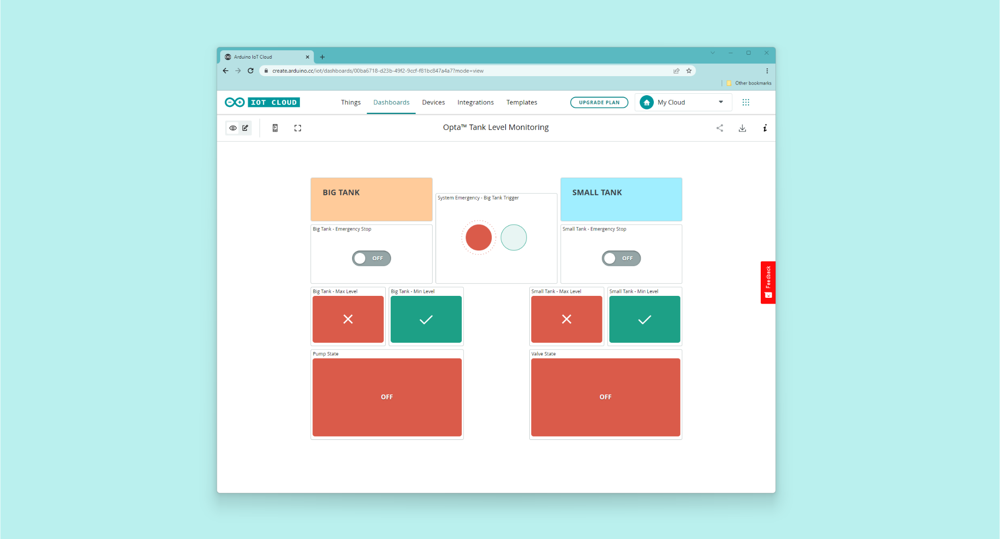

## Introduction

Monitoring and adjusting tank levels, in-situ and remotely, are everyday tasks operated in many industries, even at home. Some industrial applications include transport and storage tanks like, for example, a tank in a water treatment plant. In household applications, tank level monitoring is essential for applications like water dispensers, water evaporators, streamers, monitoring systems of boilers, heating systems, washing machines, steam irons, automated coffee machines... the list goes on. With its industrial IoT capabilities, Opta™ micro PLC can be the perfect solution for these industrial applications.

## Goals

This application note aims to show a system capable of monitoring and adjusting two tank levels using Opta™. We will refer to those tanks as **Big Tank (BT) and Small Tank (ST)**. The goals to be met by the application are the following:

- Big Tank (BT) and Small Tank (ST) levels must stay within a minimum and a maximum user-defined level; maximum and minimum levels will be measured using float switches. A vertical-type float switch will be used for measuring the maximum level, while a horizontal-type float switch will be used for measuring the minimum level in the tanks.
- If the Small Tank (ST)  level goes below its minimum level, a relay opens a gate valve from the Big Tank (BT), letting the Big Tank (BT) liquid fill the Small Tank (ST). When the level in the Small Tank (ST) goes over its maximum, the relay closes the gate valve.
- If the BT level goes over its maximum level, a pump is activated to bring its level back below its maximum level.
- If the BT level goes below its minimum level, the system gets blocked, and the levels of the ST don't activate the relay that opens or closes the gate valve of the BT.

A graphical representation of the intended application is shown below:


Big Tank is at least double the capacity of the Small Tank in the experimental setup shown before.

## Hardware and Software Requirements

### Hardware Requirements

- [Opta™ PLC](https://store.arduino.cc/pages/opta) with RS-485 support (x2)
- USB-C® cable (x2)
- Vertical float switch (x2)
- Horizontal float switch (x2)
- 12VDC NC 2/2-Way direct acting solenoid or motorized ball valve (x1)
- 12VDC liquid pump (x1)
- 12VDC DIN rail power supply (x1)

### Software Requirements

- [Arduino IDE 1.8.10+](https://www.arduino.cc/en/software), [Arduino IDE 2.0+](https://www.arduino.cc/en/software), or [Arduino Web Editor](https://create.arduino.cc/editor)
- If you choose an offline Arduino IDE, you must install the following libraries: `ArduinoRS485`, `ArduinoModbus`, and `Scheduler`. You can install those libraries via the Library Manager of the Arduino IDE.
- The [Arduino IoT Cloud](https://create.arduino.cc/iot/things) will be required to perform remote actuation and status monitoring via Wi-Fi® connectivity using the provided sketch in later section. The Ethernet connection is also an available connectivity option. The Arduino IoT Cloud account is free and it will be needed to access its features.

## Demonstration Setup

The electrical connections of the intended application are shown in the diagram below:


The Opta™ will communicate with each other using the Modbus RTU protocol. The level sensors (vertical and horizontal float switches) are monitored via digital input pins of the Opta™; the pump and the solenoid/ball valve are controlled using the built-in relay outputs of the Opta™.

## Demonstration Description

Small Tank (ST) and Big Tank (BT) each have a specific monitoring routine to track and control their minimum and maximum level. Both Opta™ will exchange important states and parameters of each tank to understand and take appropriate actions to maintain both tanks' desired capacity in the application. As mentioned before, the Opta™ in charge of the Small Tank and Big Tank will communicate with each other using Modbus RTU protocol. The Big Tank will be the Client, while the Small Tank will behave as Server.

The Opta™ in the Big Tank (BT) performs the following actions:

- It activates the pump if its maximum level alarm is triggered; this will cause liquid migration from Big Tank to Small Tank.
- It shuts off the system completely, halting most of the activities.
- It sends the current minimum level state to Small Tank while also seeking for Small Tank's maximum level state.

The Opta™ in the Small Tank (ST) performs the following actions:

- It manages the solenoid/ball valve given the Small Tank level and Big Tank minimum level state.
- It sends Small Tank's current maximum level state to Big Tank while seeking Big Tank's minimum level state.

In addition to the functionalities explained before, both Opta™ connect to Arduino IoT Cloud via Wi-Fi®. Through Arduino IoT Cloud, both tanks can be monitored and controlled online.

### Understanding the Small Tank (ST) Code

We will highlight the details that make up a crucial part of the Opta™ in charge of the Small Tank. Notice that some of the functions in the code are generated by Arduino IoT Cloud during the dashboard configuration. We will begin with the required libraries.

The following headers are required to enable the Modbus RTU protocol, connection with the Arduino IoT Cloud, and the scheduler. The scheduler handles the data exchange using Modbus RTU protocol while keeping the `loop()` to manage the local parameters of the Small Tank. It will also define the parameters needed per Modbus RTU specification.

```arduino
#include "thingProperties.h"
#include "stm32h7xx_ll_gpio.h"
#include <Scheduler.h>

#include <ArduinoRS485.h>
#include <ArduinoModbus.h>

constexpr auto baudrate { 19200 };
constexpr auto bitduration { 1.f / baudrate };
constexpr auto preDelayBR { bitduration * 9.6f * 3.5f * 1e6 };
constexpr auto postDelayBR { bitduration * 9.6f * 3.5f * 1e6 };
```

The vertical and horizontal float switches are essential sensors recognizing the tank's capacity. It will measure if the switches are closed or open by reading the voltage in this scenario. For example, if the vertical switch is closed and indicates the tank is at maximum capacity, it will read ~3.0V and return such state as 1. Otherwise, it will return the maximum capacity state as 0, meaning it has not reached the upper capacity limit.

Usually, two-state element suffices such state conditions, but it may be better if unforeseen states are obervable. The simple `analogRead()` method is used to convert obtained raw value into comprehensible information by using `analogRead() * (3.249 / 4095.0) / 0.3034;` to represent in range of 0-3.2V in the current example. The ~3.0V will mean the sensor is closed, while 0V will mean it is open.

However, the reading between 1.8-2.4V for an extended period during operation could mean the sensor is decalibrated or has failed. This reading could be helpful to take action to either replace or fix the sensor that is giving uncertain readings, without needing to make a close approach to dangerous elements that the sensor might be set up.

```arduino
uint8_t ST_Level_Check(){
  // Simple sensor read state 
  ST_Max = ST_MaxSensor_A0();
  ST_Min = ST_MinSensor_A1();
}

...

// Reading the sensor's current state
// ST_MaxSensor_A0 & ST_MinSensor_A1 is reading the vertical & horizontal float switches.
uint8_t ST_MaxSensor_A0(){
  digitalWrite(LEDB, HIGH);
  int st_max_read = analogRead(A0);
  float st_max_read_V = st_max_read * (3.249 / 4095.0) / 0.3034;

  Serial.print(F("Small Tank - Max = "));
  Serial.println(st_max_read_V, 3);

  digitalWrite(LEDB, LOW);

  if (st_max_read_V >= 2.99){
    ST_Max_Cloud = true;
    return 1;
  } else {
    ST_Max_Cloud = false;
    return 0;
  }
}

uint8_t ST_MinSensor_A1(){
  digitalWrite(LEDB, HIGH);
  int st_min_read = analogRead(A1);
  float st_min_read_V = st_min_read * (3.249 / 4095.0) / 0.3034;

  Serial.print(F("Small Tank - Min = "));
  Serial.println(st_min_read_V, 3);

  digitalWrite(LEDB, LOW);

  if (st_min_read_V >= 2.99){
    ST_Min_Cloud = true;
    return 1;
  } else {
    ST_Min_Cloud = false;
    return 0;
  }
}
```

The Opta™ controlling the Small Tank will need to recognize the reservoir's capacity and use such information to maintain the nominal volume. A 2/2-way normally closed direct acting solenoid or a motorized ball valve is used in this setup and controlled by Small Tank to free the volume whenever certain conditions are applicable.

The following function helps control this valve by reading the reservoir's capacity and external information from the Big Tank. The `BT_Min` is the float switch state for Big Tank's minimum level, attained via communication using Modbus RTU protocol.

```arduino
uint8_t ST_Volume_CTRL(){
  // Active main condition to free Small Tank volume
  if (((ST_Min == 0 && BT_Min == 1) && ST_Max != 1)){
    if (ST_Valve != 1){
      ST_Valve = 1;
      ST_Valve_Cloud = true;
      digitalWrite(D2, ST_Valve);
      
      Serial.println(F("Small Tank - Valve Opening"));
    } else {
      Serial.println(F("Small Tank - Valve Opened"));
    } 
  }

  // Conditional to halt volume freeing process for Small Tank
  if (ST_Max == 1 || BT_Min == 0){
      if (ST_Valve != 0){
        ST_Valve = 0;
        ST_Valve_Cloud = false;
        digitalWrite(D2, ST_Valve);
        Serial.println(F("Small Tank - Valve Closing"));
      } else {
        Serial.println(F("Small Tank - Valve Closed"));
      }
      // Sending Big Tank Pump Off Command
      ModbusRTUServer.inputRegisterWrite(0, 0x50);
      delay(40);
  }
}
```

As the Opta™ receives `BT_Min` from the Big Tank, the Small Tank also shares the information with the Big Tank regarding Small Tank's maximum level tagged as `ST_Max`.

```arduino
void ST_Param_Share(){
  // Simple representation for Small Tank's Maximum level sensor
  // 6 for ST_Max = 1
  // 7 for ST_Max = 0
  if (ST_Max == 1){
    ModbusRTUServer.inputRegisterWrite(0, 0x36);
    Serial.println(F("Small Tank - Maximum Level: ON"));
  } else {
    ModbusRTUServer.inputRegisterWrite(0, 0x37);
    Serial.println(F("Small Tank - Maximum Level: OFF"));
  }
  delay(100);
}
```

It is possible to notice whenever an Opta™ exchanges information with another Opta™ using Modbus RTU protocol with subsequent code structure. This method writes for the specified address and the data for the seeking Opta™.

```arduino
ModbusRTUServer.inputRegisterWrite(0, 0x37)
```

In the meantime, the Big Tank's Opta™ will send such parameters, while the Small Tank Opta™ will poll for Modbus RTU requests to determine whether to activate a specific module or if it is activated. In this example, if we receive `0x56` from the Big Tank Opta™, the Small Tank will turn off the valve. If it captures the data `0x31` or `0x32`, the Small Tank will have the information regarding Big Tank's minimum level. The following simple parser does this task inside the Small Tank's Opta™.

```arduino
uint8_t RTU_parser(){
  // poll for Modbus RTU requests
  ModbusRTUServer.poll();

  long bigTank_coil = ModbusRTUServer.holdingRegisterRead(0);
  //Serial.println(bigTank_coil);

  if (bigTank_coil == 0x56){
    Serial.println(F("Received: Big Tank - Valve Off"));
    ST_Valve = 0;
    digitalWrite(D2, ST_Valve);
  }
  if (bigTank_coil == 0x31){
    Serial.println(F("Received: Big Tank - Min - On"));
    BT_Min = 1;
  }
  if (bigTank_coil == 0x32){
    Serial.println(F("Received: Big Tank - Min - Off"));
    BT_Min = 0;
  }
  Serial.println(F(""));
  delay(40);
}
```

The setup process to enable all the needed features to manage Small Tank's Opta™ is as follows. Here the Modbus RTU protocol, scheduler, Arduino IoT Cloud, and other features are configured and enabled.

```arduino
/*************************************
* Modbus RTU related tasks
*************************************/
void RTU_Setup(){
  Serial.println(F("Small Tank - Modbus RTU Client"));

  RS485.setDelays(preDelayBR, postDelayBR);

  if (!ModbusRTUServer.begin(42, baudrate, SERIAL_8E1)) {
      Serial.println("Failed to start Modbus RTU Server!");
      while (1);
  }

  // configure holding registers & input registers at address 0x00
  ModbusRTUServer.configureHoldingRegisters(0x00, 5);
  ModbusRTUServer.configureInputRegisters(0x00, 5);
}

void setup() {
  // Initial parameter initialization
  EM_Stop_ST = false;
  ST_Valve_Cloud = false;

  Serial.begin(9600);
  while (!Serial)
      ;

  delay(1000);
  
  // Analog/Digital IO Port Configuration
  analogIO_Setup();
  digitalIO_Setup();

  // Modbus RTU Configuration 
  RTU_Setup();
  
  // Status LED configuration;
  finder_led_Setup();
  digitalWrite(LEDG, HIGH);
  
  // Scheduler -> Modbus RTU
  Scheduler.startLoop(modbus_line);
  
  // This delay gives the chance to wait for a Serial Monitor without blocking if none is found
  delay(1500); 

  // Defined in thingProperties.h
  initProperties();

  // Connect to Arduino IoT Cloud
  ArduinoCloud.begin(ArduinoIoTPreferredConnection);
  
  /*
     The following function allows you to obtain more information
     related to the state of network and IoT Cloud connection and errors
     the higher number the more granular information you’ll get.
     The default is 0 (only errors).
     Maximum is 4
 */
  setDebugMessageLevel(2);
  ArduinoCloud.printDebugInfo();
}
```

The main `loop()` manages local parameters and `modbus_line()` handles the data exchange between the Opta™ using Modbus RTU protocol.

```arduino
void loop() {
  ArduinoCloud.update();
  
  if (EM_Stop_ST == false){
    // Essential tank runtime and parameter display
    ST_Level_Check();
    ST_Param_Monitor();
    
    // Small Tank Condition Checkers
    component_state();
    ST_Volume_CTRL();
  } else {
    Serial.println(F("Small Tank - Emergency Stop - Cloud"));
    ST_Valve = 0;
    ST_Valve_Cloud = false;
  }
  delay(1000);
}

void modbus_line(){
  ST_Param_Share();

  // Modbus RTU w/ Small Tank PLC
  RTU_parser();
  delay(100);
}
```

We will now continue with Big Tank's Opta™ to understand its role.

### Understanding the Big Tank (BT) Code

The Opta™ in charge of the Big Tank has a similar structure to the Small Tank's Opta™,  such as Arduino IoT Cloud generated code during the configuration. We will focus on the main tasks that the Big Tank is in charge of and specializes as a Client.

The Big Tank's Opta™ has two main tasks. They are to stop the system operation or to control the attached pump. The `BT_System_Off()` is triggered if the minimum level flag is turned off, which will halt the Pump and send the valve off command for Small Tank's Opta™. This sets emergency stop for the system. The `BT_Pump_CTRL()` will send the valve off request whenever Big Tank's maximum level is reached and activate the pump to avoid reservoir overfill.

```arduino
uint8_t BT_System_Off(){
  if (BT_Min != 1){
    // Sending Small Tank Valve Off Command
    writeHoldingRegisterValues(42, 0x00, 0x56, 1);
    delay(40);

    // Turn off 
    BT_Pump = 0;
    Sys_EM_Stop = true;

    digitalWrite(D2, BT_Pump);
    Serial.println(F("Big Tank - Level Below Nominal: Emergency Stop"));
  } else {
    Sys_EM_Stop = false;
    Serial.println(F("Big Tank - Level Above Nominal"));
  }
}

uint8_t BT_Pump_CTRL(){
  if (BT_Max != 0){
    // Sending Small Tank Valve Off Command
    writeHoldingRegisterValues(42, 0x00, 0x56, 1);
    delay(40);

    // Turn on the BT Pump
    if (BT_Pump != 1){
      BT_Pump = 1;
      BT_Pump_Cloud = true;
      digitalWrite(D2, BT_Pump);
      Serial.println(F("Big Tank - Pump Initiating"));
    } else {
      Serial.println(F("Big Tank - Pump Active"));
    }
  } else if (BT_Max == 0 || ST_Max == 1){
    if (BT_Pump != 0){
      BT_Pump = 0;
      BT_Pump_Cloud = false;
      digitalWrite(D2, BT_Pump);
      Serial.println(F("Big Tank - Pump Stopping"));
    } else {
      Serial.println(F("Big Tank - Pump Inactive"));
    }
  }
}
```

The Opta™ in charge of the Big Tank shares the information with the Small Tank regarding Big Tank's minimum level tagged as `BT_Min` inside the sketch.

```arduino
void BT_Param_Share(){
  // Simple representation for Big Tank's Minimum level sensor
  // 0x31 for BT_Min = 1
  // 0x32 for BT_Min = 0
  if (BT_Min == 1){
    writeHoldingRegisterValues(42, 0x00, 0x31, 1);
    Serial.println(F("Big Tank - Minimum Level: ON"));
  } else {
    writeHoldingRegisterValues(42, 0x00, 0x32, 1);
    Serial.println(F("Big Tank - Minimum Level: OFF"));
  }
  delay(100);
}
```

In this example, if we receive `0x50` from the Small Tank Opta™, the Big Tank will turn off the pump. If it captures `0x36` or `0x37`, the Big Tank will have the information regarding Small Tank's maximum level. The following simple parser does this task inside the Big Tank's Opta™. The minor difference between the Small Tank Opta™ is how it seeks for the data to retrieve. The Big Tank Opta™ will use `readInputRegisterValues(42, 0x00, 1)` to request Small Tank Opta™ and search for the data if it has available information.

```arduino
uint8_t RTU_parser(){
  // poll for Modbus RTU requests
  smallTank_coil = readInputRegisterValues(42, 0x00, 1);

  if (smallTank_coil == 0x50){
    Serial.println(F("Received: Small Tank - Pump Off"));
    BT_Pump = 0;
    digitalWrite(D2, BT_Pump);
  }
  if (smallTank_coil == 0x36){
    Serial.println(F("Received: Small Tank - Maximum Level - On"));
    ST_Max = 1;
  }
  if (smallTank_coil == 0x37){
    Serial.println(F("Received: Small Tank - Maximum Level - Off"));
    ST_Max = 0;
  }
  Serial.println(F(""));
  delay(40);
}
```

The Big Tank Opta™, since it is the Client, the Modbus RTU protocol is configured accordingly with the Client's properties. The commonly used method in this example for the Client will be `writeHoldingRegisterValues()` and `readInputRegisterValues()`. The first method will write to the Small Tank Opta™ when certain conditions are flagged, while the other method will request information to track the Small Tank Opta™.

```arduino
void RTU_Setup(){
  Serial.println(F("Big Tank - Modbus RTU Client"));

  RS485.setDelays(preDelayBR, postDelayBR);

  // start the Modbus RTU client
  if (!ModbusRTUClient.begin(baudrate, SERIAL_8E1)) {
      Serial.println("Failed to start Modbus RTU Client!");
      while (1);
  }
}

void writeHoldingRegisterValues(int dev_address, uint8_t reg_address, uint8_t holding_write, int byte_count){
  ModbusRTUClient.beginTransmission(dev_address, HOLDING_REGISTERS, reg_address, byte_count);
  ModbusRTUClient.write(holding_write);

  if (!ModbusRTUClient.endTransmission()) {
    Serial.print(F("Holding Register Write - Failed! "));
    Serial.println(ModbusRTUClient.lastError());
  } else {
    Serial.println(F("Holding Register Write - Success"));
  }
}

void readHoldingRegisterValues(int dev_address, uint8_t reg_address, int byte_count, uint8_t packet){
  if (!ModbusRTUClient.requestFrom(dev_address, HOLDING_REGISTERS, reg_address, byte_count)) {
    Serial.print(F("Holding Register Read - Failed! "));
    Serial.println(ModbusRTUClient.lastError());
  } else {
    Serial.println(F("Holding Register Read - Success"));

    while (ModbusRTUClient.available()) {
        Serial.print(ModbusRTUClient.read());
        packet = ModbusRTUClient.read();
        Serial.print(' ');
    }
    Serial.println();
  }
}

uint8_t readInputRegisterValues(int dev_address, uint8_t reg_address, int byte_count){
  uint8_t packet;
  if (!ModbusRTUClient.requestFrom(dev_address, INPUT_REGISTERS, reg_address, byte_count)) {
    Serial.print(F("Input Register Read - Failed! "));
    Serial.println(ModbusRTUClient.lastError());
    return 0;
  } else {
    Serial.println(F("Input Register Read - Success"));

    while (ModbusRTUClient.available()) {
        packet = ModbusRTUClient.read();

        // Enable if you would like to verify Input Register readings
        //Serial.println(packet);
    }
    return packet;
  }
}
```

In the loop and assigned scheduler function, the Big Tank Opta™ will share its local parameters with Small Tank's Opta™, consistently checking for pump activation or if the system must activate an emergency stop.

```arduino
void loop() {
  ArduinoCloud.update();

  if (EM_Stop_BT == false){
    // Essential tank runtime and parameter display
    BT_Level_Check();
    BT_Param_Monitor();
  
    // Big Tank Condition Checkers
    component_state();
    BT_System_Off();
    BT_Pump_CTRL();
  } else {
    Serial.println(F("Big Tank - Emergency Stop Triggered"));
    BT_Pump = 0;
    BT_Pump_Cloud = false;
  }
  delay(1000);
}

void modbus_line(){
  BT_Param_Share();

  // Modbus RTU w/ Small Tank PLC
  RTU_parser();
  delay(100);
}
```

Arduino IoT Cloud integration with the tanks is shown below:



Within Arduino IoT Cloud's dashboard, both tank's system status can be monitored. Remote actuation is available for both Opta™ regarding its managed tasks, meaning such actuators and emergency stop can be controlled manually on-demand.

## Full Tank Level Monitoring Example

The complete code for the Small and Big Tank's Opta™ can be downloaded [here](assets/tank-level-monitoring-sketch.zip). It is important to know that for both, `thingProperties.h` is included with its respective variables and is generated automatically with Arduino IoT Cloud.

## Conclusion

You have learned to build tank level monitoring systems with the Opta™ and the Arduino IoT Cloud. In this application note, we have learned how to comminicate two Opta™ using Modbus RTU protocol to exchange data and build a simple tank-level monitoring system using its I/O ports. We also have learned how to use the Arduino IoT Cloud features to have an on-demand trigger and monitor the actual tank-level information.