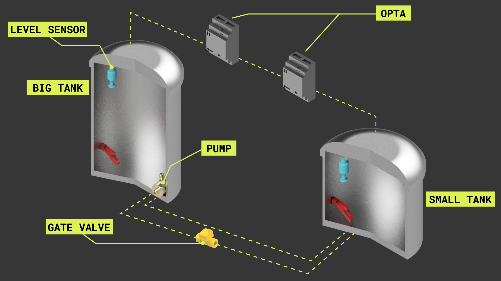
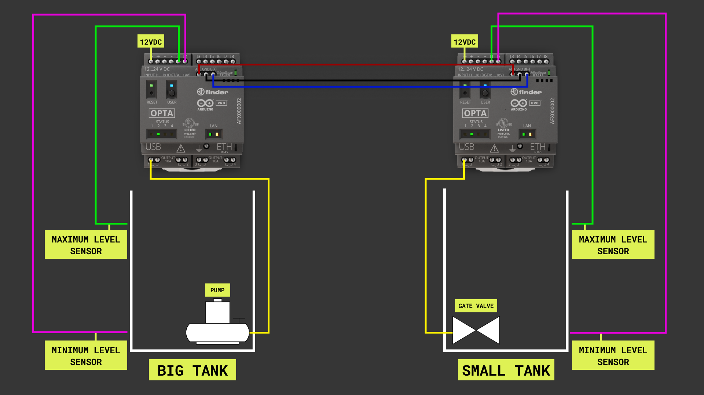

## Introduction

Monitoring and adjusting tank levels, in-situ and remotely, are everyday tasks that are done in many industries, even in your house. Some industrial applications include transport and storage tanks (for example, think of a tank in a water treatment plant). In household applications, tank level monitoring is essential for applications like water dispensers, water evaporators, streamers, monitoring systems of boilers, heating systems, washing machines, steam irons, automated coffee machines, etc. With its industrial IoT capabilities, the Opta micro PLC can be used for this application. 

## Goals

This application note aims to show a system based on the Opta, capable of monitoring and adjusting two tank levels; we will refer to those tanks as Big Tank (BT) and Small Tank (ST). The goals to be met by the application are the following:

- BT and ST levels must stay within a minimum and a maximum user-defined level; maximum and minimum levels will be measured using float switches. A vertical-type float switch will be used for measuring the maximum level, while a horizontal-type float switch will be used for measuring the minimum level in the tanks.
- If the ST level goes below its minimum level, a relay opens a gate valve from the BT, letting the BT liquid fill the ST. When the level in the ST goes over its maximum, the relay closes the gate valve.
- If the BT level goes over its maximum level, a pump is activated to bring its level back below its maximum level.
- If the BT level goes below its minimum level, the system gets blocked, and the levels of the ST don't activate the relay that opens or closes the gate valve of the BT.

A graphical representation of the intended application is shown below:



BT is at least 2.5 times bigger than ST in the experimental setup shown before.

## Hardware and Software Requirements

### Hardware Requirements

- [Arduino Opta](https://store.arduino.cc/products/nicla-sense-me)
- USB-C® cable (x2)
- Vertical float switch (x2)
- Horizontal float switch (x2)
- 12VDC solenoid valve (x1) 
- 12VDC liquid pump
- 12VDC DIN rail power supply (x1)

### Software Requirements

- [Arduino IDE 1.8.10+](https://www.arduino.cc/en/software), [Arduino IDE 2.0+](https://www.arduino.cc/en/software), or [Arduino Web Editor](https://create.arduino.cc/editor)
- If you choose an offline Arduino IDE, you must install the following libraries: `ArduinoRS485`, and `Scheduler`. You can install those libraries via the Library Manager of the Arduino IDE.
- For the Wi-Fi connectivity feature of the Opta, we will use [Arduino IoT Cloud](https://create.arduino.cc/iot/things); you will need to create an account if you still need to create one.

## Demonstration Setup

The electrical connections of the intended application are shown in the diagram below:



Notice that the Optas communicate with each other over RS-485. The level sensors (vertical and horizontal float switches) are monitored via the digital input pins of the Optas; the pump and the gate valve are controlled using the built-in relay outputs of the Optas.

## Demonstration Description

ST and BT each have a specific monitoring routine to monitor and control their minimum and maximum level. Both Optas will exchange important states and parameters of each tank to understand and execute appropriate actions to maintain both tank levels as expected in the application. As stated before, the Optas in charge of ST and BT will communicate with each other using Modbus RTU over RS-485.

The Opta in the BT performs the following actions:

- It activates the pump if its maximum level alarm is triggered; this will cause liquid migration from BT to ST. 
- It shuts off the system completely, halting any activity on it.
- It sends the current minimum level state to ST while also seeking for ST maximum level state. 

The Opta in the ST performs the following actions:

- It manages the gate valve given the ST level and BT minimum level state. 
- It sends ST's current maximum level state to BT while seeking BT's minimum level state. 

In addition to the functionalities explained before, both Optas are connected to Arduino IoT Cloud via Wi-Fi. Through Arduino IoT Cloud, both tanks can be monitored and controlled online. 

### Example Code for Small Tank (ST)

The following code exemplifies how Opta in ST can achieve the actions described before. Notice that some of the functions in the code were generated by Arduino IoT Cloud during the dashboard configuration:

```arduino
#include "thingProperties.h"
#include "stm32h7xx_ll_gpio.h"

#include <ArduinoRS485.h>
#include <Scheduler.h>

#define CHANNEL1

#ifdef CHANNEL1
  float a1_tot = 0;
  float a1_avg = 0;
  float a1_max = 0;
  float a1_min = 5;
  float a1_noise = 0;
  int a1_count, a2_count = 0;
#endif

int start_time    = 0;
int rs485_counter = 0;
char rs485_rec;

// Global parameters, initial conditions
uint8_t BT_Max = 0, ST_Max = 0, ST_Valve = 0;
uint8_t BT_Min = 1, ST_Min = 1;

// Small tank routines
void ST_Param_Monitor() {
  Serial.println(F("\n------------------------"));
  Serial.println(F("--> Small Tank Status Monitor: "));
  Serial.print(F("Small tank - Maximum sensor: "));
  Serial.println(ST_Max);
  Serial.print(F("Small tank - Minimum sensor: "));
  Serial.println(ST_Min);
  Serial.print(F("Small tank - Valve activity: "));
  Serial.println(ST_Valve);
  Serial.println(F("Small tank - Co-shared req. BT parameters: "));
  Serial.print(F("Big tank - Minimum sensor: "));
  Serial.println(BT_Min);
  Serial.println(F("------------------------\n"));
}

uint8_t ST_Level_Check() {
  // Simple sensor read state 
  ST_Max = ST_MaxSensor_A1();
  ST_Min = ST_MinSensor_A2();
}

uint8_t ST_Volume_Ctrl() { 
  // Active main condition to free ST volume
  if (((ST_Min == 0 && BT_Min == 1) && ST_Max != 1)) {
    if (ST_Valve != 1) {
      ST_Valve = 1;
      ST_Valve_Cloud = true;
      digitalWrite(D2, ST_Valve);
      
      Serial.println(F("Small tank - Valve opening"));
    } else {
      Serial.println(F("Small tank - Valve opened"));
    } 
  }

  // Conditional to halt volume freeing process for ST
  if (ST_Max == 1 || BT_Min == 0) {
      if (ST_Valve != 0) {
        ST_Valve = 0;
        ST_Valve_Cloud = false;
        digitalWrite(D2, ST_Valve);
        Serial.println(F("Small tank - Valve closing"));
      } else {
        Serial.println(F("Small tank - Valve closed"));
      }

      // Sending Big Tank Pump Off Command
      // 0x52 for BT_Pump Off
      RS485.beginTransmission();
      RS485.println('P');
      RS485.endTransmission();
      delay(40);
  }
}

void ST_Param_Share() {
  // 4 for ST_Min = 1
  // 5 for ST_Min = 0
  // 6 for ST_Max = 1
  // 7 for ST_Max = 0
  RS485.beginTransmission();
  if (ST_Max == 1){
    RS485.println('6');
    Serial.println(F("Small tank - Maximum level: ON"));
  } else {
    RS485.println('7');
    Serial.println(F("Small Tank - Maximum Level: OFF"));
  }
  RS485.endTransmission();
  delay(100);
}

uint8_t ST_MaxSensor_A1() {
  // Value Extractor
  digitalWrite(LEDB, HIGH);
  int st_max_read = analogRead(A1);
  float st_max_read_V = st_max_read * (3.249 / 4095.0) / 0.3034;

  Serial.print(F("ST_Max = "));
  Serial.println(st_max_read_V, 3);

  digitalWrite(LEDB, LOW);

  if (st_max_read_V >= 2.99) {
    ST_Max_Cloud = true;
    return 1;
  } else {
    ST_Max_Cloud = false;
    return 0;
  }
}

uint8_t ST_MinSensor_A2() {
  // Value extractor
  digitalWrite(LEDB, HIGH);
  int st_min_read = analogRead(A2);
  float st_min_read_V = st_min_read * (3.249 / 4095.0) / 0.3034;

  Serial.print(F("ST_Min = "));
  Serial.println(st_min_read_V, 3);

  digitalWrite(LEDB, LOW);

  if (st_min_read_V >= 2.99) {
    ST_Min_Cloud = true;
    return 1;
  } else {
    ST_Min_Cloud = false;
    return 0;
  }
}

void component_state() {
  if (ST_Valve == 1){
    digitalWrite(LEDR, HIGH);
  } else {
    digitalWrite(LEDR, LOW);
  }
}

// Opta LED PLC Switches
void opta_led_setup() {
  pinMode(LEDG, OUTPUT);
  pinMode(LEDR, OUTPUT);
  pinMode(LEDB, OUTPUT);
  pinMode(PIN_SPI_MISO, OUTPUT);
  pinMode(PIN_SPI_MOSI, OUTPUT);
  pinMode(PIN_SPI_SCK, OUTPUT);
  pinMode(PIN_SPI_SS, OUTPUT);

  opta_led_off();
}

void opta_led_off() {
  digitalWrite(LEDG, LOW);
  digitalWrite(LEDR, LOW);
  digitalWrite(LEDB, LOW);
  digitalWrite(PIN_SPI_MISO, LOW);
  digitalWrite(PIN_SPI_MOSI, LOW);
  digitalWrite(PIN_SPI_SCK, LOW);
  digitalWrite(PIN_SPI_SS, LOW);
}


// Digital port related tasks
void digitalIO_Setup() {
  // D2 -> ST Valve
  pinMode(D2, OUTPUT);
}

// Analog port related tasks
void analogIO_Setup() {
  analogReadResolution(12);
  start_time = millis();
  SCB_DisableDCache();
  Serial.println("Start");
}

// RS-485 port related tasks
void RS485_Setup() {

  Serial.begin(9600);
  RS485.begin(9600);
  while (!Serial)
      ;

  delay(1000);

  Serial.println(F("ST - RS485 Interface Client Toggle"));
  RS485.beginTransmission();

  // Enable RS-485 reception
  RS485.receive();
}

uint16_t rs485_transport, rs485_carrier;
uint8_t RS485_parser() {
  if (RS485.available() > 0) {
    //rs485_rec = RS485.read();
    if (RS485.find('V')) {
      Serial.println(F("Received: Valve OFF - BT"));
      ST_Valve = 0;
      digitalWrite(D2, ST_Valve);
    }
    if (RS485.find('1')) {
      Serial.println(F("Received: BT_Min - ON"));
      BT_Min = 1;
    }
    if (RS485.find('2')) {
      Serial.println(F("Received: BT_Min - OFF"));
      BT_Min = 0;
    }
  }
  delay(40);
}

void setup() {

  // Initial parameter initialization
  EM_Stop_ST = false;
  ST_Valve_Cloud = false;
  
  // IO ports configuration
  analogIO_Setup();
  digitalIO_Setup();

  // RS-485 configuration 
  RS485_Setup();
  
  // Status LED configuration;
  opta_led_setup();
  digitalWrite(LEDG, HIGH);
  
  // Scheduler -> RS-485 Interface
  Scheduler.startLoop(rs485_interface);
  
  // This delay gives the chance to wait for a Serial Monitor without blocking if none is found
  delay(1500); 

  // Defined in thingProperties.h
  initProperties();

  // Connect to Arduino IoT Cloud
  ArduinoCloud.begin(ArduinoIoTPreferredConnection, false, "mqtts-sa.iot.oniudra.cc");
  setDebugMessageLevel(2);
  ArduinoCloud.printDebugInfo();
}

void loop() {
  ArduinoCloud.update();
  
  if (EM_Stop_ST == false) {
    // Essential tank runtime and parameter display
    ST_Level_Check();
    ST_Param_Monitor();
    
    // ST Condition Checkers
    component_state();
    ST_Volume_Ctrl();
  } else {
    Serial.println(F("Emergency stop - Cloud"));
    ST_Valve = 0;
    ST_Valve_Cloud = false;
  }
  delay(1000);
}

void rs485_interface(){
  ST_Param_Share();

  // RS485 Communication with ST Opta
  RS485_parser();
  delay(100);
}


/*
  onEMStopSTChange() function generated by Arduino IoT Cloud  
  Since EMStopST is READ_WRITE variable, onEMStopSTChange() is
  executed every time a new value is received from IoT Cloud.
*/
void onEMStopSTChange()  {
  if (EM_Stop_ST == false) {
    Serial.println(F("Emergency Stop Deactivated - Cloud"));
  }
  if (EM_Stop_ST == true) {
    Serial.println(F("Emergency Stop Activated - Cloud"));
  }
}

/*
  onSTValveCloudChange() function generated by Arduino IoT Cloud
  Since STValveCloud is READ_WRITE variable, onSTValveCloudChange() is
  executed every time a new value is received from IoT Cloud.
*/
void onSTValveCloudChange()  {
  if (ST_Valve_Cloud == false) {
    ST_Valve = 0;
    Serial.println(F("Small Tank - Valve Deactivated - Cloud"));
  }
  if (ST_Valve_Cloud == true) {
    ST_Valve = 1;
    Serial.println(F("Small Tank - Valve Activated- Cloud"));
  }
}
```

## Conclusion

## References 